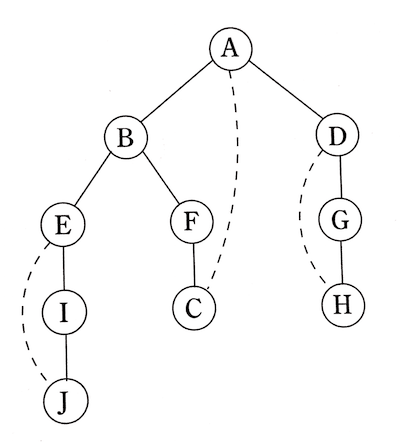
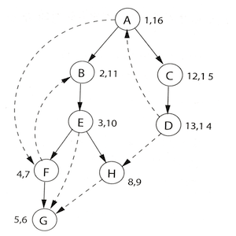

# 그래프의 분할

## 왜 그래프인가?

- 지도에서 국가마다 색칠을 하는데, 인접한 국가는 다른 색을 입혀야 한다고 해보자.
- 이를 위해, 각 나라는 정점으로, 인접해 있는지 여부는 간선으로 나타낼 수 있음. 즉 관심사만을 표현.
- 책에서는 이를 가리켜 그래프 색칠<sup>Graph coloring</sup>이라고 부름.

### 그래프 형식

- 형식적으로 그래프는 정점(또는 노드)의 집합 V와 간선 E로 표현.

```
V = {1, 2, 3, …, 13}
e = {x, y}
```

- 이 때의 x, y는 'x가 y와 경계를 공유한다'는 의미.
- 방향이 없으며, 무방향 그래프<sup>undirected graph</sup>라고 함.
- 한편, 방향이 있는 간선도 있음. 그럴 때는 방향이 있는 간선을 사용해야 함.
- e = (x, y)라고 쓰고, x로부터 y로의 유향 간선이라고 읽음.
- 유향 그래프<sup>directed graph</sup>의 예로는 WWW의 모든 링크를 나타낸 그래프.

### 그래프를 어떻게 표현할까?

인접 행렬<sup>adjacency matrix</sup>로 표현

- n = |V|인 정점들 v1, v2, …, vn이 있다면,
- (i, j)번째 항목이 다음과 같은 n x n 배열이 됨.

```mathematica
a_{ij} = \begin{cases} 1  & v_{i}\text{에서 }v_j\text{까지 간선이 있다면} \\ 0 & \text{그렇지 않다면} \end{cases}
```

- 무방향 그래프에 대한 행렬은 대칭.
- 특정 간선의 존재를 단지 하나의 메모리에 접근하여 상수 시간 내로 파악 가능.
- 하지만, O(n^2) 공간을 차지하고, 간선이 많지 않다면 비효율적.

인접 리스트<sup>adjacency list</sup>로 표현

- 정점마다 하나씩, |V|개의 연결 리스트로 구성.
- 정점 u에 대한 연결 리스트는 u가 향하는 정점들의 이름을 지님.
- 유향 그래프이면 각 간선은 연결 리스트 하나에 나타나고, 무향 그래프이면 두 개에 나타남.
- 어느 쪽이든 자료 구조 전체 크기는 O(|E|).
- 다만, 간선(u, v)를 조사하는 것은 더 이상 상수 시간이 아님.
- u의 인접 리스트를 통해 알아내야 하기 때문임.

## 무방향 그래프에서의 깊이 우선 탐색

### 미로 찾기

> "주어진 하나의 정점으로부터 그래프의 어떤 부분에 도달할 수 있는가?"

- 위 질문은 깊이 우선 탐색이 해결하려는 근본적 문제. 이는 미로 찾기와 비유됨.
- 미로 탐색에 필요한 것은 실 꾸러미와 분필.
- 분필로 이미 방문한 교차로를 표시. 같은 곳을 순환하지 않음.
- 실 꾸러미는 언제든 출발점으로 돌아올 수 있게 함.
- 미분필 표시는 부울 변수. 실 꾸러미는 스택 혹은 재귀.
- 코드는 아래와 같음. 참고로, `previsit`, `postvisit`이 뭔가 싶었는데, 이 작업의 활용을 뒤에서 소개함.

```
procedure explore(G, v)
Input: G = (V, E) is a graph; v ∈ V
Output: visited(u) is set to true for all nodes u reachable from v

visited(v) = true
previsit(v)
for each edge (v, u) ∈ E :
  if not visited(u): explore(G, u)
postvisit(v)
```

- 아래 그림은 그래프에 대한 `explore`를 표현한 것.
- 실선으로 된 간선들이 트리를 형성. 트리 간선<sup>tree edge</sup>이라 불림.
- 점선으로 된 간선들은 되돌아 옴(스택에서 정점을 꺼냄)을 표현. 역방향 간선<sup>back edge</sup>이라 불림.



### 깊이 우선 탐색

- 깊이 우선 탐색<sup>DFS, Depth-first search</sup>의 정점에서 일어나는 작업은 크게 2가지.
  - 방문한 지점을 표시하고, pre/postvisit으로 표시.
  - 다른 곳에 새로운 루프가 있는지 살피고자 인접 간선에 있는 루프 찾기.
- 첫 번째 작업의 전체 수행 시간은 O(|V|)
- 두 번째 작업의 전체 수행 시간은 O(|E|)
- 따라서, 입력에 대해 선행인 O(|V| + |E|)의 수행시간.
- 단지 인접 리스트를 읽기만 할 때와 동일함.

### 무방향 그래프에서의 연결성

- 만약 모든 정점 쌍에 대한 경로가 있다면 "무방향 그래프는 연결되어 있다"고 표현.
- 아래와 같이 세 개의 연결 영역이 있는 경우, 이들 영역을 연결된 성분<sup>connected component</sup>라고 표현.
- 혹은 부분 그래프<sup>subgraph</sup>.

```
{ A, B, E, I, J }    { C, D, G, H, K, L}    { F }
```

- 특정 노드가 속한 연결된 성분이 있는지는 다음과 같은 방법을 통해 가능.
- cc는 0으로 초기화. explore 프로시저 호출 시 마다 증가.

```
procedure previsit(v)
ccnum[v] = cc
```

### previsit과 postvisit의 순서화

- 각 노드 별로 첫 발견의 순간(previsit)과 마지막 출발의 순간(postvisit)이 존재.
- 아래의 경우는 이런 이벤트가 총 24개가 존재함.


- 이 숫자들로 `pre`, `post` 배열을 생성하는 한가지 방법은 아래와 같음.
- 이 때의 clock 초기값은 1로 설정.

```
procedure previsit(v)
pre[v] = clock
clock = clock + 1

procedure postvisit(v)
post[v] = clock
clock = clock + 1
```

- 그리고 아래의 특성을 발견할 수 있음.
- 간격은 정점 u가 스택에 있는 동안의 시간이기 때문이고, 스택의 후입 선출 동작 때문임.

> 임의의 노드 u와 v에 대해 두 간격 [pre(u), post(u)]와 [pre(v), post(v)]는 서로 떨어져 있거나, 하나가 다른 하나 안에 포함된다.

## 유향 그래프에서의 깊이 우선 탐색

### 간선의 유형

유향 그래프에서의 주요 용어들을 설명.




- 루트<sup>root</sup>: A 노드
- 자손<sup>descendant</sup>: 자신의 하위 노드
- 조상<sup>ancestor</sup>: 자신의 상위 노드
- 부모<sup>parent</sup>: 단계가 하나인 조상
- 자식<sup>child</sup>: 단계가 하나인 자손
- 트리 간선<sup>Tree edge</sup>: 무방향 그래프에서의 그것과 같다.
- 순방향 간선<sup>Forwared edge</sup>: 자식이 아닌 자손으로의 연결. (예: AF)
- 역방향 간선<sup>Back edge</sup>: 부모가 아닌 조상으로의 연결. (예: FB)
- 교차 간선<sup>Cross edge</sup>: 자손이나 조상에게 연결되지 않음. 이미 완전히 탐색된 노드로 연결. (예: DH)

pre, post 숫자로부터 간선의 유형을 알 수 있음. 또한, 조상과 자손 관계도 알 수 있음. 예컨대, 정점 u가 먼저 발견되고 정점 v가 explore(u) 동안 발견된다면, 정점 u는 정점 v의 조상.

### 유향 비순환 그래프

- 순환<sup>Cycle</sup>이란 순환하는 경로를 가리킴.
- 위 그림에서의 순환은 BEFB.
- 순환이 없는 그래프는 비순환<sup>Acyclic</sup>이라 함.
- 유향 그래프가 순환이라면, 우선 탐색에 역방향 간선이 있다는 것과 같음.

#### 위상 정렬

그리고 나서 유향 비순환 그래프(DAG<sup>Directed Acyclic Graph</sup>)에서의 위상 정렬<sup>Topological Sorting</sup>에 대해 설명함. 그 중에서 아래 내용이 잘 이해하기 어려웠음. 지금에서야 이해됨.

> 단순히 작업을 post 숫자가 감소하도록 수행하면 됩니다.

개인적으로는 아래 방식의 위상 정렬이 이해하기 쉬움.

- DAG 선형화의 가장 마지막 정점은 post 숫자가 제일 낮으며 끝점<sup>sink</sup>이라 불림.
- 반대로, 가장 높은 post 숫자를 지닌 정점은 출처<sup>source</sup>.
- 모든 DAG는 적어도 하나의 출처와 하나의 끝점을 가짐.
- 따라서 아래 방식으로 접근 가능.

```
1. 출처를 찾아 출력하고, 그래프에서 출처를 지워라.
2. 그래프가 빌 때(없어질 때)까지 이 작업을 반복하라.
```

인과 관계나 계층 구조, 시간적 의존성과 같은 관계를 모델링하기에 좋다고 하는데 정말 그러함. 그동안 무방향 그래프에 대해서만 알고 있었다는 게 부끄러움. Jira의 Workflow도 DAG를 사용하지 않았을까?

## 강한 연결 성분

### 유향 그래프에 대한 연결성 정의하기

- 무향 그래프에서의 연결 정의는 쉬움. 앞서 언급된 "그래프는 연결되어 있다" 혹은 "몇 개의 연결된 성분으로 이루어져 있다" 참고.
- 유향 그래프에서 연결성<sup>connectivity</sup>는 아래와 같이 정의.

> 유향 그래프의 두 노드 u와 v는 u에서 v와 v에서 u의 경로가 있을 때 연결된다.

- 이 연결성을 강한 연결 성분<sup>strongly connected component</sup>이라 부름.
- 아래 그림에는 5개의 강한 연결 성분이 존재함.


- 이제 각각의 강한 연결 성분을 하나의 메타 노드로 줄일 수 있음.
- 한 메타 노드에서 다른 메타 노드로 간선을 그림. 이렇게 얻은 메타 그래프는 DAG이며 아래 특성을 가짐.
- "모든 유향 그래프는 유향 그래프의 강한 연결 성분들의 DAG이다"
- 유향 그래프의 연결 구조가 두 계층으로 되어 있다고 표현하기도.
- 최상위 단계의 DAG를 통해 좀 더 간단하게 살필 수 있고, 메타 노드를 자세히 들여다 보면 완전한<sup>full fledged</sup> 강한 연결 성분을 검사할 수 있음.

### 효율적인 알고리즘

강한 연결 성분은 DFS를 확장하여 선형 시간에 발견할 수 있다고 함. 아래는 강한 연결 성분을 찾는 주요 골자.

1. 메타 그래프에서의 끝점<sup>sink</sup>(강한 연결 성분)을 먼저 고르고,
2. 여기서 임의의 노드를 정한 뒤 `explore`를 호출한다면,
3. 정확히 강한 연결 성분의 정점만을 순회할 것.

하지만 두 가지 문제가 남아 있음.

1. 메타 그래프에서의 끝점에 있는 노드를 어떻게 찾을 것인가?
2. 첫 번째 성분이 발견되고 나면 어떻게 계속하는가?

먼저, 메타 그래프의 끝점에 있는 노드 찾기.

- 끝점을 찾기는 쉽지 않으나, 아래 특성을 이용하여 출처는 찾을 수 있음.
- 아래 특성 중, 첫 번째는 두 번째의 일반적 특성으로부터 나옴.

```
1. DFS에서 가장 높은 post 숫자를 갖는 노드는 반드시 강한 연결 성분 출처에 있어야 한다.
2. 만약 C와 C1이 강한 연결 성분이고 C 안의 노드로부터 C1안의 노드로 간선이 있다면, C 안에서 가장 높은 post 숫자는 C1 안에 있는 가장 높은 post 숫자보다 크다
```

- 여기서 역방향 그래프 G^R을 생각. 모든 간선은 G와 반대 방향.
- 하지만 동일한 강한 연결 성분을 가짐.
- 따라서, G^R에 대해 DFS를 수행하면, 가장 높은 post 숫자의 노드가 G에서의 강한 연결 성분 끝점.
- 즉, 메타 그래프에서의 끝점에 있는 노드를 찾았음.

다음으로, 첫 번째 성분이 발견되고 나면 어떻게 계속하는가.

- 첫 번째 강한 연결 성분을 찾은 후 그래프에서 이를 지움.
- 그러면 남은 노드 중에서 가장 높은 post 숫자의 노드가 새로운 강한 연결 성분 끝점이 됨.
- 반복하면 됨.

그렇게 얻은, 강한 연결 성분 찾기 알고리즘은 다음과 같음.

1. G^R에 대해 DFS를 실행한다.
2. G에 대해 무방향 연결 성분 알고리즘을 실행하고, 깊이 우선 탐색 동안에 앞선 1단계부터 post 숫자가 감소하는 순서로 정점들을 처리한다.

조금 어렵다. 내가 해석한 대로 정리하면 다음과 같음.

1. G^R에 대해 DFS 수행.
2. post가 가장 높은 노드에 대해, 정방향 DFS 수행.
3. 2번의 결과가 첫 번째 강한 연결 성분.
4. 1번 결과에서 2번 결과를 지운 뒤, 2번부터 반복.

위 알고리즘은 선형 시간이고, 일차항의 유일한 상수는 정방향 DFS의 두배라고 함. 선형은 이해되지만, 일차항이 단지 DFS의 두 배라는 것은 잘 이해되지 않음. post가 높은 노드를 찾을 때의 비용은 고려하지 않는 걸까?

직접 작성해보자.