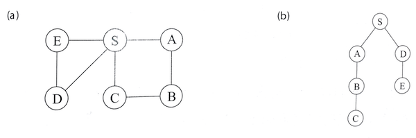

# 그래프의 경로

## 거리

- 아래의 좌측 그림은 주어진 그래프, 우측 그림은 DFS로 구해진 탐색 트리.
- 그림에서 알 수 있듯이 이들 경로가 가장 경제적이지는 않음.
- 예컨대, C에서 S로 가는 길은 1개의 간선으로도 가능하나 DFS 트리에서는 3개가 필요.



- 이 장에서는 그래프의 최단 경로를 찾는 알고리즘을 살피게 됨.
- 아래는 책에서 정의한 두 노드 사이의 거리.

> 두 노드 사이의 거리는 그들 사이의 최단 경로의 길이이다.

## 너비 우선 탐색

DFS가 미묘하고 유용한 특성을 가지지만, 매우 인접한 정점들에 대해 빠르게 접근할 수 없음. BFS는 이를 극복함. 아래는 너비 우선 탐색<sup>Breath-First Search</sup> 알고리즘을 통해 거리를 알아내는 알고리즘.

```
procedure bfs(G, s)
입력: 유향 또는 무방향 그래프 G = (V, E), 정점 s ∈ V
출력: s로부터 도달할 수 있는 모든 정점 u에 대해 dist(u)는 s로부터 u까지의 거리로 설정됨.

for all u ∈ V:
  dist(u) = ∞

dist(s) = Θ
Q = [s] (queue containing just s)
while Q is not empty:
  u = eject(Q)
  for all edges (u, v) ∈ E:
    if dist(v) = ∞:
      inject(Q, v)
      dist(v) = dist(u) + 1
```

구현은 [여기](https://github.com/codehumane/learn-algorithm-in-java/commit/3f5fa5d702adc5b46820e705f387598d5219a54e)를 참고.

- 물론 탐색 방향이 다름.
- 깊이 우선은 