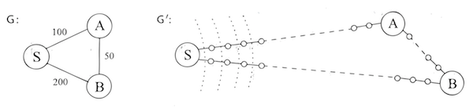

# 그래프의 경로

## 거리

- 아래의 좌측 그림은 주어진 그래프, 우측 그림은 DFS로 구해진 탐색 트리.
- 그림에서 알 수 있듯이 이들 경로가 가장 경제적이지는 않음.
- 예컨대, C에서 S로 가는 길은 1개의 간선으로도 가능하나 DFS 트리에서는 3개가 필요.


- 이 장에서는 그래프의 최단 경로를 찾는 알고리즘을 살피게 됨.
- 아래는 책에서 정의한 두 노드 사이의 거리.

> 두 노드 사이의 거리는 그들 사이의 최단 경로의 길이이다.

## 너비 우선 탐색

DFS가 미묘하고 유용한 특성을 가지지만, 매우 인접한 정점들에 대해 빠르게 접근할 수 없음. BFS는 이를 극복함. 아래는 너비 우선 탐색<sup>Breath-First Search</sup> 알고리즘을 통해 거리를 알아내는 알고리즘.

```
procedure bfs(G, s)
입력: 유향 또는 무방향 그래프 G = (V, E), 정점 s ∈ V
출력: s로부터 도달할 수 있는 모든 정점 u에 대해 dist(u)는 s로부터 u까지의 거리로 설정됨.

for all u ∈ V:
  dist(u) = ∞

dist(s) = Θ
Q = [s] (queue containing just s)
while Q is not empty:
  u = eject(Q)
  for all edges (u, v) ∈ E:
    if dist(v) = ∞:
      inject(Q, v)
      dist(v) = dist(u) + 1
```

구현은 [여기](https://github.com/codehumane/learn-algorithm-in-java/commit/3f5fa5d702adc5b46820e705f387598d5219a54e)를 참고.

## 간선의 길이

- 응용 프로그램에서의 최단 경로를 발견할 때는 각 간선의 길이가 대부분 다름.
- 모든 간선 e ∈ E의 길이는 책에서 l_e(l<sub>e</sub>)로 표기하기로 약속.
- 만약, e = (u, v)이면 때로는 l(u, v) 또는 l_uv로 표기.
- 참고로, l_e는 꼭 물리적 길이만을 의미하지는 않음. 시간이나 돈 등의 어떤 양을 나타낼 수도. 때로는 음수 길이도 사용됨.

## 데이크스트라 알고리즘

### 너비 우선 탐색의 적용

간선 길이가 양의 정수 l_e인 그래프 G = (V, E)에 너비 우선 탐색을 어떻게 적용할 수 있을까?

#### 더욱 편리한 그래프

- G를 BFS로 다룰 수 있도록 G'로 변환해 볼 수 있음.
- 더미 노드를 도입해 G의 긴 간선들을 단위 길이의 조각으로 나누는 것.

> E의 임의의 간선 e = (u, v)에 대해, u와 v 사이에 l_e - 1개의 더미 노드를 추가하여 길이 1인 l_e 간선들로 대체한다.


#### 알람 시계

하지만 G가 매우 긴 간선들을 가진다면?

이 경우 BFS에서는 의미 없는 더미 노드를 계산하느라 많은 시간이 소모됨. 그래서 알람 시계 알고리즘을 소개함. 지루한 단계에서는 snooze, 관심 있는 노드가 발견될 때에는 알람으로 깨우는 방법임.



위 그림의 경우 알람 시계는 다음과 같음.

1. S에서 처음에 알람 2개를 설정.
   - 노드 A에 대해 T=100
   - 노드 B에 대해 T=200
2. 잠깐 잠들었다가 T=100에서 A가 발견된 것을 확인하고 깸.
3. B에 대한 도착 예정시간은 T=150(이 값은 S로부터의 거리로 추정됨)으로 조정.
   - 최초의 T가 과대평가된 경우임.
   - 노드가 발견될 때 마다 더 빠른 경로가 발견됨.
4. 이를 더 이상 알람이 없을 때까지 반복.

#### 데이크스트라 알고리즘

- 우선순위 큐를 이용해 알람 시스템을 만들 수 있음.
- 우선순위 큐는 원소 집합(노드)을 연관된 숫자 키 값(알람 시각)으로 유지하고 아래 연산을 지원.

| 연산           | 설명                           |
| ------------ | ---------------------------- |
| insert       | 새로운 원소를 집합에 더함               |
| decrease-key | 특정 원소의 키 값을 감소               |
| delete-min   | 가장 작은 키를 반환하고, 집합에서 이를 제거    |
| make-queue   | 주어진 키 값을 지닌 원소로부터 우선순위 큐를 구축 |

- 위 표에서 처음 두 개의 연산은 알람을 설정하는 것.
- 세 번째는 다음에 어떤 알람이 울릴지 알려주는 것.
- 이를 통해 얻게된 데이크스트라 알고리즘은 아래와 같음.

```
procedure dijkstra(G, l, s)
입력: 유향 또는 무방향 그래프 G = (V, E), 양의 간선 길이 {l_e : e ∈ E}, 정점 s ∈ V
출력: s로부터 도달할 수 있는 모든 정점 u에 대해 dist(u)는 s로부터 u까지의 거리로 설정됨.

for all u ∈ V:
  dist(u) = ∞
  prev(u) = nil
dist(s) = 0

H = makequeue (V) (using dist-values as keys)
while H is not empty:
  u = deletemin(H)
  for all edges (u, v) ∈ E:
    if dist(v) > dist(u) + l(u, v):
      dist(v) = dist(u) + l(u, v)
      prev(v) = u
      decreasekey(H, v)
```

