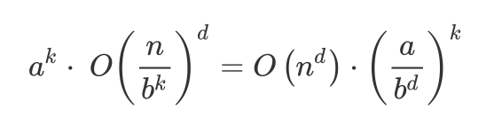
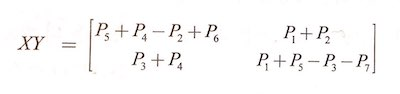

# 분할 정복법 알고리즘

## 곱셈

먼저, 두 복소수의 곱이 4개의 곱셈이 아닌 3개의 곱셈으로 줄어드는 과정을 소개함.

1. 두 복소수의 곱은 i^2은 -1이라는 특성을 이용하여, 다음과 같이 표기 가능함.
2. (a + bi)(c + di) = ac - bd + (bc + ad)i
3. 칼 프리드리히 가우스는 허수 부분<sup>imaginary part</sup>을 다음과 같이 표기함.
4. bc + ad = (a + b)(c + d) - ac - bd
5. 실수 부분<sup>real part</sup>과 함께 전체 식을 살펴보면 다음과 같음.
6. (a + bi)(c + di) = ac - bd + ((a + b)(c + d) - ac - bd)i

덧셈은 총 5번으로 늘어났지만, 곱셈(상대적으로 연산 비용이 더 큰)의 횟수는 4번에서 3번으로 줄어듦. 곱셈의 갯수가 4에서 3으로 줄어든 것이 의미가 없어 보일 수 있으나, 곱셈을 재귀적으로 해결할 때는 이 작은 차이가 모여 유의미한 결과를 가져옴.

이제 이 아이디어를 일반적인 곱셈에 적용함.

1. 먼저, 두 수 x와 y를 n 비트의 정수라고 가정함.
2. 두 수를 n/2 비트로 쪼갬. 아래 그림 참고
3. (예시) x = 10110110₂ = 1011₂ * 2^4 + 0110₂
4. 일반화하면 다음과 같음.

```latex
xy = (2^{n/2}·x_L + x_R)(2^{n/2}·y_L + y_R) = 2^n·x_L·y_L + 2^{n/2}·(x_L·y_R + x_R·y_L) + x_R·y_R
```

5. 가우스의 비결을 적용하면 다음과 같음.

```latex
x_L·y_R + x_R·y_R = (x_L + x_R)(y_L + y_R) - x_L·y_L - x_R·y_R
```


코드로 표현하면 다음과 같음.

```
function multiply(x, y)

if n = 1: return xy
xL, xR = leftmost [n/2], rightmost [n/2] bits of x
yL, yR = leftmost [n/2], rightmost [n/2] bits of y

P1 = multiply(xL, yL)
P2 = multiply(xR, yR)
P3 = multiply(xL + xR, yL + yR)

return p1 * 2^(2[n/2]) + (P3 - P1 - P2) * 2([n/2]) + P2
```

시간 복잡도는 O(n^2)에서 O(n^1.59)로 줄어듦. 이 문제의 재귀 트리 그림은 생략하고 설명만 간단히 기록.

1. 재귀 트리의 높이는 ln(n)이 됨.
2. 분기계수<sup>Branching Factor</sup>는 3.
3. 트리 깊이가 k이면, 크기가 n/2^k인 부분 문제가 3^k만큼 있음.
4. 따라서, 깊이 k인 트리의 전체 시간은 3^k * O(n/2^k) = (3/2)^k * O(n).

참고로, 1비트가 될 때까지 재귀 호출하는 것은 비합리적. 대부분 프로세서에서 16비트나 32비트 곱셈은 하나의 연산이므로, 숫자가 이 범위 이내로 줄어 드는지를 기저 조건<sup>base condition</sup>에서 확인하는 게 효율적임.

## 점화식

분할 정복법 알고리즘 패턴은 다음과 같음.

- 크기가 **n**인 문제가 주어졌을 때,
- 이를 **n/b** 크기로 쪼개고,
- 이렇게 쪼개진 **a**개의 부분 문제를 재귀적으로 풀고,
- 각 해답을 **O(n^d)** 시간으로 결합한다.
- 이 때, **a, b, d > 0** 이다.


이제 알고리즘의 수행 시간을 다음과 같이 나타낼 수 있음.

`T(n) = aT(⎡n/b⎤) + O(n^d)`

그리고 이 식은 a > 0이고 b > 1, d ≥ 0인 어떤 상수에 대해 다음이 성립함.

```
d > logb(a) 일 때, O(n^d)
d = logb(a) 일 때, O(n^d*log(n))
d < logb(a) 일 때, O(n^(logb(a)))
```

증명 과정.

1. 편의상 n이 b의 거듭제곱이라고 가정함. (이 가정이 중요한 차이를 불러 일으키지는 않음)
2. 트리의 k번째 단계는 크기가 n/(b^k)인 부분 문제 a^k개로 이루어짐.
3. k 단계에서 수행한 전체 작업은 아래 그림의 식과 같음.
4. k가 0(뿌리)부터 logb(n)(잎)으로 가면서 이 숫자는 비율이 a/(b^d)인 등비급수가 됨.
5. 이 등비급수의 합이 분할 정복에서의 수행 시간이 되며, O 표기법에서는 다음의 3가지 경우 중 하나.

```
비율 < 1: 급수 감소함. 합은 첫 번째 항인 O(n^d)와 같다.
비율 > 1: 급수 증가함. 합은 마지막 항인 O(n^(logb(a)))와 같다.
비율 = 1: 급수의 모든 O(log(n)) 항은 O(n^d)와 같다.
```



## 병합 정렬

```
function mergesort(a[1 ... n])

if n > 1:
  return merge(
      mergesort(a[1 ... ⎣n/2⎦]),
      mergesort(a[⎣n/2⎦+1 ... n])
  )
else:
  return a
```

알고리즘이 올바른지 여부는 `merge`에 달려 있음.

```
function merge(x[1 ... k], y[1 ... l])

if k = 0: return y[1 ... l]
if l = 0: return x[1 ... k]

if x[1] ≤ y[1]:
  return x[1] ∘ merge(x[2 ... k], y[1 ... l])
else:
  return y[1] ∘ merge(x[1 ... k], y[2 ... l])
```

**∘ 기호는 연결<sup>concatenation</sup>을 나타냄.*

`merge`의 수행 시간은 선형이며, `mergesort`의 전체 수행 시간은 다음과 같음.

```T(n) = 2T(n/2) + O(n)```

앞서 소개한 점화식을 통해,`O(n log(n))` 임을 알 수 있음.

## 중앙값

먼저, 중앙값<sup>Median</sup> 소개

- 50번째 백분위수<sup>Percentile</sup>임.
- 하나의 값으로 숫자 집합을 대표하는 것.
- 특정 이상치<sup>Outlier</sup>에 영향을 덜 받는다는 점에서, 평균보다 유용하기도 함.
- 1이 100개인 경우의 평균은 1인데, 여기서 10,000이라는 숫자가 하나 더 생겼을 때의 평균값과 중앙값을 비교해보면 됨.

중앙값을 계산하는 방법

- 정렬한 후 가운데 값(⎣n/2⎦)을 고르면 됨.
- 하지만, 수행시간이 O(n log(n))임.
- 정렬은 중앙값을 계산하는 데 필요한 작업보다 더 많은 것을 함.
- 정말로 정렬까지 해야 할까?

중위값을 계산하는 좀 더 효율적인 방법

> 재귀적인 해를 찾을 때, 역설적이게도 종종 더 일반적인 문제로 작업하는 것이 쉬울 때가 있습니다.

- 그래서 여기서 말하는 일반화는 선택<sup>selection</sup>임.
- 리스트 S의 숫자 중 하나를 임의로 선택함.
- 이렇게 선택된 숫자 v로 S를 세 범주로 나눈다.
  - Sʟ: v보다 작은 원소 집합
  - S𝗏: v와 같은 원소 집합
  - Sʀ: v보다 큰 원소 집합
- |Sʟ|의 값이 ⎣list / 2⎦보다 큰지 여부 확인.
- 필요하면, |Sʟ| + |S𝗏|의 값과도 비교함.
- 어쨌든, ⎣list / 2⎦ 번째로 큰 값이 어디에 속하는지 알 수 있음.
- 리스트 범주 나누는 작업을 반복하여, ⎣list / 2⎦ 번째로 큰 값은 무엇인지 알아낼 수 있음.

***수학 기호**

- |: 보통 절대값으로 알았지만, 집합에 대한 cardinality를 의미하기도 함. 예를 들어, |S|=3은 집합 S의 갯수가 3이라는 것을 의미한다.

효율성을 분석해 보면,

- 최악의 경우는 가장자리의 원소를 계속 v로 선택하는 것: n + (n-1) + (n-2) + … + n/2 = O(n^2)
- 최상의 경우는 처음 선택한 v가 중위값인 경우: O(n)
- 이제 기대값을 구해 보면,
- 배열에서 25~75% 사이의 원소를 구할 수 있는 확률은 1/2이고,
- 그러면 분리된 배열의 최대 크기는 3/4가 됨.
- 그리고 이렇게 분리하는 데 들어가는 비용은 n임.
- T(n) = T(3n/4) + O(n)
- 이를 반복하면, T(n) = O(n)으로, 평균적으로 O(n)의 효율성을 가진다고 말할 수 있음.

#### 행렬 곱셈

두 개의 n x n 행렬 A와 B의 곱에서, (i, j)번째 항목을 표현하면 다음과 같음. (AB)ij는 X의 i번째 행과 Y의 j번째 열의 내적<sup>Scalar Product 혹은 Dot Product</sup>임.


위 공식은 행렬 곱셈에 대한 O(n^3) 알고리즘임. 이것이 한동안 가장 좋은 수행 시간이었지만, 독일의 수학자 폴커 스트라센<sup>Volker Strassen</sup>은 분할 정복법에 기반을 둔 좀 더 효율적 알고리즘을 발표함.

- A와 B를 각각 네 개의 n/2 x n/2 블록으로 나눔.
- 각 블록을 마치 하나의 원소인 것처럼 취급하여 내적을 수행함.
- 내적의 각 결과에 대해 재귀적으로 위 작업을 반복함.
- 그리고 O(n^2) 시간의 덧셈을 수행함.
- 점화식으로 나타내면, `T(n) = 8T(n/2) + O(n^2)`임.

하지만, 이는 여전히 O(n^3) 임. 여기서 선형 대수를 이용하여, AB를 단지 7개의 n/2 x n/2 부분 문제로 구할 수 있음. 스트라센은 분해<sup>Decomposition</sup>을 통해 이 방법을 발견했다고 함. 정리하면 다음과 같음.



정리는 A와 B로 했는데, 책에서는 X와 Y를 사용하고 있음. 이 때의 각 P는 다음과 같음.

1. P1 = A(F - H)
2. P2 = (A + B)H
3. P3 = (C + D)E
4. P4 = D(G - E)
5. P5 = (A + D)(E + H)
6. P6 = (B - D)(G + H)
7. P7 = (A - C)(E + F)

## 고속 푸리에 변환

이번에는 정수 곱셈과 행렬 곱셈이 아닌, 다항식<sup>Polynomial</sup>에 분할 정복법을 적용함. 먼저, 두 개의 d차 다항식 곱은 차수가 2d인 다항식임. 식으로 표현하면 아래와 같음.

```latex
A(x) = a_0 + a_1x + \cdots + a_dx^d
B(x) = b_0 + b_1x + \cdots + b_dx^d
C(x) = A(x) \cdot B(x) = c_0 + c_1x + \cdots + c_{2d}x^{2d}
```

C(x)를 좀 더 일반화하면 다음과 같음.

```latex
c_k = a_0b_k + a_1b_{k-1} + \cdots + a_kb_0 = \sum_{i=0}^ka_ib_{k-1}
```

c_k를 계산하는 데 O(k) 단계가 걸리고, 2d+1개의 모든 계수를 찾는데는 Θ(d^2) 시간이 걸림. 더 빠르게 다항식을 곱할 수 있는 방법으로, 고속 푸리에 변환<sup>Fast Fourier Transform</sup>이 소개됨. 궁금함.

잠깐 용어 정리.

- [차수<sup>degree</sup>](https://ko.wikipedia.org/wiki/%EC%B0%A8_(%EC%88%98%ED%95%99)): 다항식의 종류나 확대체의 종류를 나타냄. x^2 · y^3 + x^3 + y^4 + 1의 차수는 5가 됨.
- [다항식<sup>polynomial</sup>](https://ko.wikipedia.org/wiki/%EB%8B%A4%ED%95%AD%EC%8B%9D): 문자의 거듭제곱의 상수 배 여럿의 합을 표현하는 수식. a·x^2 + b = 0이 하나의 다항식.
- [계수<sup>coefficient</sup>](https://ko.wikipedia.org/wiki/%EA%B3%84%EC%88%98): 상수와 변수로 이루어진 단항식 또는 다항식에서 지목된 변수 이외의 부분(나머지 인수 전체).
- [보간<sup>Interpolation<sup>](http://terms.naver.com/entry.nhn?docId=3405107&cid=47324&categoryId=47324): 알고 있는 데이터 값들을 이용하여 모르는 값을 추정하는 방법의 한 종류.

### 다항식의 다른 표현

다항식들의 중요한 특성들을 살펴봄. 고속 푸리에 변환을 좀 더 잘 이해하기 위함.

> 서로 다른 d+1개의 점들로 고유의 d차 다항식을 특정할 수 있다.

간단한 예시로 "임의의 두 점이 직선을 결정한다"가 있음. 만약, x\_0, …, x\_d를 고정한다면, d차 다항식 `A(x) = a_0 + a_1·x + … + a_d·x^d`는 다음 중 하나로 표현 가능함.

```latex
1. 다항식의 계수 a_0, a_1, …, a_d
2. 값 A(x_0), A(x_1), …, A(x_d)
```

두 번째 표현을 이용하면, 곱셈 수행 시간이 선형이 됨. 단지 a\_0 · b\_0 + a\_1 · b\_1 + … + a\_d · b\_d를 구하면 되기 때문임. 처음에 언뜻 이해 안되서 아래처럼 표를 작성해 봄. 생각해보니 당연한 것.

| 다항식                                      | 1    | 2    | 3    | 4    | 5    |
| ---------------------------------------- | ---- | ---- | ---- | ---- | ---- |
| A(x) = x                                 | 1    | 2    | 3    | 4    | 5    |
| B(x) = 2x + 1                            | 3    | 5    | 7    | 9    | 11   |
| C(x) = 2x^2 + x                          | 3    | 10   | 21   | 36   | 55   |
| A(x) · B(x) = A\_1 · B\_1 + A\_2 · B\_2 + ... | 3    | 10   | 21   | 36   | 55   |

하지만 우리는 다항식의 곱을 계수로 표현하고 싶다. 그래서 다음과 같이 함.

1. 계수를 값으로 변환함.
2. 값 표현에서 곱셈을 함.
3. 보간<sup>Interpolation</sup>을 통해 다시 계수로 변환함.

이를 코드로 표현하면 다음과 같음.

```latex
입력: d차 다항식 A(x)와 B(x)의 계수
출력: 다항식의 곱 C = A·B

Selection
  Pick some points x_0, x_1, ..., x_{n-1}, where n ≥ 2d+1
Evaluation
  Compute A(x_0), A(x_1), ..., A(X_{n-1}) and B(x_0), B(x_1), ..., B(x_{n-1})
Multiplication
  Compute C(x_k) = A(x_k)B(x_k) for all k = 0, ..., n-1
Interpolition
  Recover C(x) = c_0 + c_1·x + ... + c_{2d}·x^{2d}
```

다른 것은 별 것 없어 보임. 보간을 어떻게 하는지가 중요. 이 때의 시간복잡도는, 보간 절차는 무시하더라도 Θ(n^2)이 됨. d차 다항식을 계산<sup>evaluation</sup>하는 것이 각 점마다 O(n)이 걸리고, 이를 곱하는 절차가 n번 수행되기 때문임. 고속 푸리에 변환<sup>FFT</sup>을 이용하면 O(n·log(n))으로 줄일 수 있음.

**왜 다항식을 곱하는가?**

- 다항식과 이진 정수는 매우 유사함.
- 변수 x를 밑 2로 바꾸는 것과, 자릿수 올림에만 주의하면 됨.
- 따라서 다항식을 빠르게 곱하는 방법을 고민하는 것이 정수 곱셈에 도움이 됨.
- 더욱 중요하게 사용되는 분야는 신호 처리라고 함. 하지만, 잘 이해되지 않음. 몇 번 반복해서 읽고 그냥 넘어감.

### 분할 정복법에 의한 계산

차수가 n-1 이하인 다항식 A(x)를 계산할 때, 어떻게 n개의 점들을 선택하는가?

1. 양수와 음수의 쌍으로 점들을 선택한다면 다음과 같음.

```latex
\pm x_0, \pm x_1, ..., \pm x_{n/2-1}
```

2. 그러면 A(x_i)와 A(-x_i)에 필요한 계산이 상당수 겹침.
3. x_i의 짝수 차수 거듭제곱이 -x_i와 같으므로.
4. 이번에는 A(x)를 짝수와 홀수 차수 거듭제곱으로 분해. 예컨대, 다음과 같음.

```latex
3 + 4x + 6x^2 + 2x^3 + x^4 + 10x^5 = (3 + 6x^2 + x^4) + x(4 + 2x^2 + 10x^4)
```

5. 이를 일반화하면 다음과 같음.

```latex
A(x) = A_e(x^2) + xA_0(x^2)
```

6. 이제 A(x)에 대한 계산은 n/2개의 점들에 대한 A_e(x)와 A_0(x)의 계산이 됨.
7. 문제 전체를 이런식으로 재귀적으로 만들 수 있다면?
8. T(n) = 2T(n/2) + O(n), 즉 O(n·log(n))의 수행시간을 가지게 됨.
9. 그런데 어떻게 전체를 재귀적으로 만들수 있는가?
10. 복소수를 사용하면 됨. 어떤 복소수?


11. 위 그림처럼, 1의 복소수 n 제곱근들, 즉 방정식 z^n = 1에 대한 n개의 복소수 해를 사용.
12. 책의 117p. 그림을 보면 이해가 좀 더 쉬움.
13. 하지만 개인적으로 책만으로는 부족했음. [이 글](https://galileospendulum.org/2013/04/08/talk-mathy-to-me-whats-the-square-root-of-i/)이 이해를 도왔음.
14. 이렇게 얻은 알고리즘이 바로 고속 푸리에 변환.

### 보간

TBD