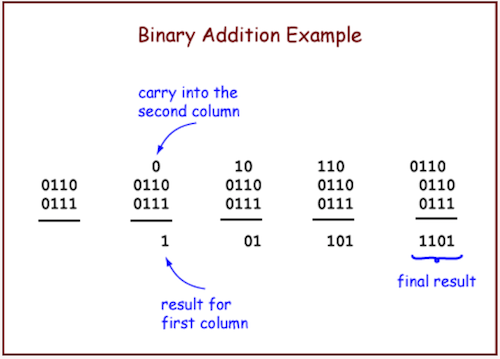
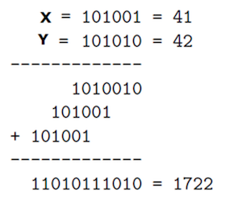
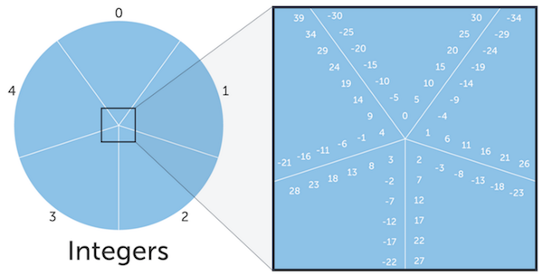
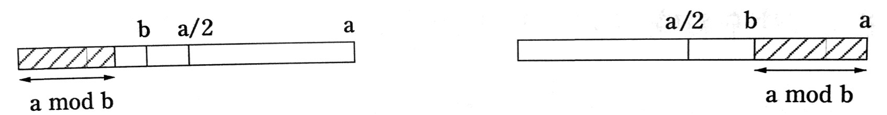
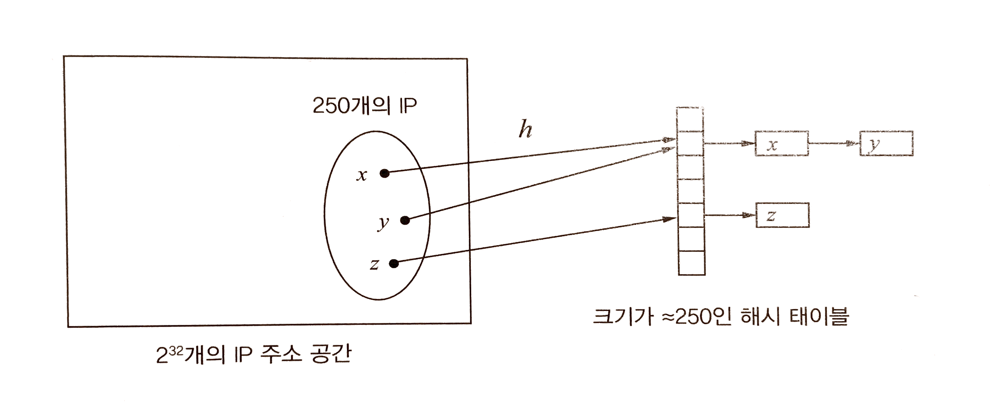
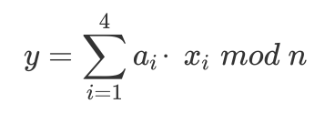

# 숫자 알고리즘

## 기본 산술 연산

### 덧셈

아래는 십진수의 기본 속성을 설명함.

> 세 개의 한 자릿수를 더한 합계는 최대 두 자릿수를 넘을 수 없다.

이는 이진수에도 적용하여, 아래 그림과 같은 알고리즘을 생각할 수 있다.



*그림 출처: http://chortle.ccsu.edu/assemblytutorial/Chapter-08/ass08_3.html

수행 시간은 어떠한가?

- 책에서는 c(0) + c(1)n 이라고 표기함.
- 여기서 c(0)과 c(1)은 상수를 가리키며, 따라서 수행시간은 선형적임.
- 참고로, 상수를 단지 c(0)와 c(1)으로 표기한 이유는, 여기서 중요한 값이 아니라는 의도로 보여짐.

수행시간이 더 빠른 알고리즘은 없는가?

- 각 자릿수의 수를 모두 더하려면 최소한 두 수를 읽고, 결과를 써야 하며, n 번의 연산을 수행해야 함.
- 따라서 위 알고리즘이 최적이라고 볼 수 있음.

### 곱셈과 나눗셈

그림으로 알고리즘을 살펴보면 아래와 같다.



마찬가지로 수행시간은 얼마나 될까?

- 위 그림에서 Y의 자릿수가 n인 경우, 중간값이 n개 생김.
- 중간값들은 자릿수만큼 왼쪽으로 이동했으므로, 최대 2n 자리의 숫자가 됨.
- 이 중간값들을 더하는 데 걸리는 총 시간은 아래와 같음.
- O(n) + O(n) + … + O(n) : 총 n-1번 수행 = O(n^2)
- 다항 시간이긴 하지만, 덧셈보다는 느림.

알콰리즈미가 알아낸 또다른 곰셈법도 있음.


*그림 출처: https://sites.google.com/site/markdolanprogramming/cis-3223/algorithms-chapter-1

- x와 y가 있을때, x는 계속 반으로 나누고 나머지를 버리고 y는 계속 2를 곱함.
- x가 1이 될 때까지 계속 반복함.
- x의 수들 중 짝수인 열을 제외하고 y의 숫자들을 모두 더함.
- 의사코드는 아래와 같음. (개인적으로 좀 더 잘 이해하기 위해, 책과 다르게 x, y를 서로 바꿈)

```
function multiply(x, y)
입력: n비트의 두 정수 x와 y, y ≥ 0
출력: 두 수의 곱

if x = 0: return 0
z = multiply(y, ⎣x/2⎦)
if x is even:
  return 2z
else:
  return y + 2z
```

수행시간은?

- 일단 n번의 재귀호출이 발생함.
- 재귀호출마다 2로 나누기(비트  우측 시프트), 홀수 여부 검사(마지막 비트 검사), 2 곱하기(비트 좌측 시프트), 한 번의 덧셈이 발생하므로, 총 O(n)번의 비트 연산이 수행됨.
- 전체 수행 시간은 O(n^2)이며 앞서 소개한 곱셈 알고리즘과 동일함.
- 이보다 더 나은 알고리즘도 있으나, 2장에서 소개될 예정이라고 함. 아마도 [카라추바 알고리즘](https://ko.wikipedia.org/wiki/%EC%B9%B4%EB%9D%BC%EC%B6%94%EB%B0%94_%EC%95%8C%EA%B3%A0%EB%A6%AC%EC%A6%98)일듯.

다음은 나눗셈 알고리즘이다. 의사 코드는 아래와 같다.

```
function divide(x, y)
입력: n 비트의 두 정수 x와 y, y ≥ 1
출력: x를 y로 나눌 때 몫과 나머지

if x = 0: return (q, r) = (0, 0)
(q, r) = divide(⎣x/2⎦, y)
q = 2*q, r = 2*r
if x is odd: r = r + 1
if r ≥ y: r = r - y, q = q + 1
return (q, r)
```

- `x = yq + r`이고 `r < y`를 성립하는 몫 `q`와 나머지 `r`을 찾는 과정임.
- 수행시간은 n^2에 비례함.

그런데 개인적으로 아래와 같은 방식이 떠올랐고, 이게 제일 간단하지 않나 싶다.

```
function divide2(x, y)
입력: n 비트의 두 정수 x와 y, y ≥ 1
출력: x를 y로 나눌 때 몫과 나머지

q = 0
while x ≥ y do
  x = x - y;
  q++;
end
return (q, x)
```

이를 간단히 구현해 본 코드는 [여기](https://github.com/codehumane/learn-algorithm-in-java/blob/master/src/main/java/math/Division.java), 테스트 코드는 [여기](https://github.com/codehumane/learn-algorithm-in-java/blob/master/src/test/java/math/DivisionTest.java)를 참고. 이 외에도 여러가지 방법들이 있음을 [여기](https://en.wikipedia.org/wiki/Division_algorithm#Newton.E2.80.93Raphson_division)서 확인 가능함.

## 모듈러 연산

모듈러<sup>modulo</sup> 연산에 대한 설명은 아래와 같다.

- `x modulo N`은 `x`를 `N`으로 나눌 때의 나머지를 가리킴.
- 즉, `x = qN + r` 이고, `0 ≤ r < N` 이면, `x modulo N`은 `r`임.
- 범위를 {0, 1, …, N-1}로 정의해두고 이를 벗어나면 다시 처음부터 순환하는 것과 같음.
- 한계 크기에 제한받지 않고 수를 다루기 위한 방식임.
- 24시간이 지나면 시간이 다시 0이 되는 것을 생각하면 됨.

모듈러를 이용한 새로운 동치 개념도 생각해볼 수 있다.

- `x ≡ y (mod N)` ⇔ `x mod N = y mod N` ⇔  `(x - y)가 N으로 나누어 떨어진다`

이는 아래 그림을 통해 좀 더 쉽게 이해할 수 있다.



*출처: https://en.khanacademy.org/computing/computer-science/cryptography/modarithmetic/a/congruence-modulo

동치 개념을 이용해서, 각 정수를 N개의 동치 집합으로 나눠볼 수도 있다.

- 이 동치 집합은 `{i + kN : k ∈ ℤ}`이고, i는 0에서 N-1 사이가 됨.
- 참고로, ∈ 표기는 어떤 원소<sup>element</sup>가 집합에 속한다는 것을 나타냄.
- 또한, ℤ는 정수의 집합이다. 이 외에도 수학에서 자주 사용되는 집합들은 ℕ, ℝ 등의 특정 기호를 부여함.
- 더 많은 집합 기호는 [여기](https://ko.wikipedia.org/wiki/%EC%A7%91%ED%95%A9)를, 동치 관계에 대한 좀더 자세한 설명은 [여기](https://www.khanacademy.org/computing/computer-science/cryptography/modarithmetic/a/equivalence-relations)를 참고.

동치 집합을 이용하여 덧셈과 곱셈을 아래와 같이 정의할 수도 있다.

> 대체 규칙: x ≡ x' (mod N)이고 y ≡ y' (mod N)이면, x + y ≡ x' + y' (mod N)이고 xy ≡ x'y' (mod N)이다.

- 이를 이용하면 아래의 질문에 좀 더 쉽게 대답할 수 있음.
- "한 편당 3시간 분량인 25편의 TVg 프로그램을 모두 보고 나면 몇 시가 되는가?"
- `(25*3) mod 24`는 대체 규칙(`25 ≡ 1 mod 24`)으로 `1*3 = 3 mod 24`과 같고, 결과는 `3`이 됨.
- 이 외에도 "2^345를 31로 나눈 값은 얼마인가?"를 아래 과정과 같이 쉽게 계산할 수 있음.
- 2^345 ≡ (2^5)^69 ≡ 32^69 ≡ 1^69 ≡ 1 (mod 31)

참고로, 모듈러 연산도 정수의 덧셈과 곱셈에서의 결합, 교환, 분배법칙이 성립한다.

- 결합법칙: `x + (y + z) ≡ (x + y) + z (mod N)`
- 교환법칙: `xy ≡ yx (mod N)`
- 분배법칙: `x(y + z) ≡ xy + yz (mod N)`

### 모듈러 지수 연산

`x^y mod N`을 구해야 하는데, `x^y`의 결과가 계산기나 컴퓨터가 다룰 수 없는 크기의 수라면? 한 가지 방법은 대체 규칙을 이용해,  `x mod N`을 지수 만큼 반복하는 것이다.  `5^3 mod 3`을 예로 들면 다음과 같다.

```
5^5 mod 3
= (5 * 5 * 5 * 5 * 5) mod 3
= ((5 mod 3) * 5 * 5 * 5 * 5) mod 3
= ((10 mod 3) * 5 * 5 * 5) mod 3
= ((5 mod 3) * 5 * 5) mod 3
= ((10 mod 3) * 5) mod 3
= 5 mod 3
= 2
```

이를 구현한 코드는 [여기](https://github.com/codehumane/learn-algorithm-in-java/blob/master/src/main/java/math/ModularExponentiation.java), 테스트 코드는 [여기](https://github.com/codehumane/learn-algorithm-in-java/blob/master/src/test/java/math/ModularExponentiationTest.java)에 기록했다. 코드를 보면 알겠지만 알고리즘의 수행시간은 `y`의 크기에 비례한다. 정확히는 `y + 1`만큼 함수가 호출된다. 즉, O(y) 이다. 좀 더 빠른 알고리즘은 제곱을 이용하는 것이다. 아래와 같이 말이다.

```
5^5 mod 3
= (5 * 5 * 5 * 5 * 5) mod 3
= ((5 mod 3) * (5 mod 3) * 5 * 5 * 5) mod 3
= ((4 mod 3) * (4 mod 3) * 5) mod 3
= 5 mod 3
= 2
```

이를 구현한 코드는 [여기](https://github.com/codehumane/learn-algorithm-in-java/blob/master/src/main/java/math/ModularExponentiation.java)에 기록함. 코드를 보면 알겠지만 함수의 호출 횟수는 최대  `ln(y) + y/2 - 1`로 줄어들었다. Big O 표기법으로는 O(ln(y))이다. [Khan Academy의 Fast modular exponentiation](https://www.khanacademy.org/computing/computer-science/cryptography/modarithmetic/a/fast-modular-exponentiation)에 따르면, 책에는 언급되지 않는 조금 더 빠른 방법을 제시하고 있다.

- 지수를 바이너리(2진수)로 변환한다.
- 가장 오른쪽 숫자부터 순서를 매기고 이를 k라고 부르자. 이 때 시작 값은 0이다.
- 숫자가 1이면 2^k로 변환하고, 그렇지 않으면 0으로 바꾸자.
- 이렇게 하면 지수가 2의 배수로 이뤄진 덧셈이 된다.
- 이제 오로지 제곱 알고리즘만을 이용하여 모듈러 연산을 구할 수 있다.
- `5^117 mod 19`를 예로 들어 설명하면 다음과 같다.

```
5^117 mod 19

// 변환
= 5^(1 + 4 + 16 + 32 + 64) mod 19
= (5^1 * 5^4 * 5^16 * 5^32 * 5^64) mod 19

// 첫번째 계산
= ((5 mod 19) * 5^4 * 5^16 * 5^32 * 5^64) mod 19
= (5 * 5^4 * 5^16 * 5^32 * 5^64) mod 19

// 두번째 계산
= (5 * ((5^2 mod 19) * (5^2 mod 19))) * 5^16 * 5^32 * 5^64) mod 19
= (5 * (((5^1 mod 19) * (5^1 mod 19)) * (5^2 mod 19)) ) * 5^16 * 5^32 * 5^64) mod 19
= (5 * ((5 * 5) * (5^2 mod 19)) ) * 5^16 * 5^32 * 5^64) mod 19
= (5 * ((25 mod 19) * (5^2 mod 19)) ) * 5^16 * 5^32 * 5^64) mod 19
= (5 * (6 * 6) * 5^16 * 5^32 * 5^64) mod 19
= (5 * (36 mod 19) * 5^16 * 5^32 * 5^64) mod 19
= (5 * 17 * 5^16 * 5^32 * 5^64) mod 19

// 다섯번째까지 반복하면..
= (5 * 17 * 16 * 9 * 5) mod 19
= 61200 mod 19
= 1
```

이를 구현한 코드는 [여기](https://github.com/codehumane/learn-algorithm-in-java/blob/master/src/main/java/math/ModularExponentiation.java), 테스트 코드는 [여기](https://github.com/codehumane/learn-algorithm-in-java/blob/master/src/test/java/math/ModularExponentiationTest.java)에 기록했다. 시간 복잡도를 분석해보면 최대 `⎡ln(y)⎤ + ⎡ln(⎡ln(y)⎤)⎤ + ⎡ln(⎡ln(y) - 1⎤)⎤+⎡ln(⎡ln(y) - 2⎤)⎤+ … +  1`가 될 것 같다(?).

### 유클리드의 최대 공약수 알고리즘

최대 공약수<sup>gcd, greatest common divisor</sup>를 찾기 위해 사용되는 유클리드의 법칙은 아래와 같다.

> 유클리드 법칙 1: x와 y가 양의 정수이고 x ≥ y를 만족하면, 최대 공약수 gcd(x, y) = gcd(x mod y, y) 이다.

이 법칙의 증명 과정은 [칸아카데미 - 유클리드 호제법](https://ko.khanacademy.org/computing/computer-science/cryptography/modarithmetic/a/the-euclidean-algorithm)이 좀 더 잘 설명하고 있다. 혹은 간단히 `x ≡ y (mod N) 이면, (x - y)가 N으로 나누어 떨어진다`는 개념을 반복하면, 위 법칙을 쉽게 이해할 수 있다. 그 외에 책에는 언급되지 않는 두 가지 법칙이 더 필요한데, 이들은 다음과 같다.

> 유클리드 법칙 2: gcd(x, 0) = x
>
> 유클리드 법칙 3: gcd(y, 0) = y

유클리드 법칙 1로 값을 줄여나가다 보면, 법칙 2 또는 3을 만나게 되며, 이 때의 값이 바로 최대공약수가 된다. 간단히 코드로 표현하면 다음과 같다. 전체 코드는 [여기](https://github.com/codehumane/learn-algorithm-in-java/blob/master/src/main/java/math/GCD.java)를 참고.

```java
// x >= y
int gcd(int x, int y) {
  if (y == 0) return x;
  return gcd(x, x%y);
}
```

이제 이 알고리즘의 수행시간을 생각해보자. 한 번의 함수 호출 시, x는 x/2 이하로 줄어든다. 이는 책에서 나온 아래 그림을 통해 쉽게 유추할 수 있다.



그리고 그 다음 재귀호출 시에는 x와 y가 서로 바뀌므로, 이번에는 y가 y/2 이하로 줄어든다. 이를 반복해가면, 결국 함수의 호출이 최대 ⎡ln(x) + ln(y)⎤만큼 일어남을 알 수 있다.

### 유클리드 알고리즘의 확장

누군가 `gcd(a, b) = d`라고 할 때, 이를 어떻게 증명할 수 있을까? 책에서는 아래의 정리를 통해 가능하다고 한다.

> a와 b가 d로 나누어 떨어지고, d = ax + by를 만족하는 정수 x와 y가 존재하면 d는 gcd(a, b)이다.

정리의 증명은 다음과 같다.

1. 첫 번째 조건에 따라 d는 a와 b의 공약수이다.
2. 이로 인해, d ≤ gcd(a, b)가 성립한다.
3. 또한, gcd(a, b)는 a와 b의 공약수이므로, ax + by의 약수이다.
4. 이로 인해, gcd(a, b) ≤ d가 성립한다.
5. 결국, d = gcd(a, b)가 된다.

모듈러 집합을 떠올리며 증명을 이해할 수 있긴 하지만, 책의 뒷부분에서 소개되는 식(수학적 귀납법)이 조금 더 와닿는다.

1. `d = gcd(a, b) = ax + by`
2. `gcd(a, b) = gcd(b, a mod b)` 이므로,
3. 유클리드 법칙을 이용하면, `gcd(a, b) = gcd(b, a mod b) = bx' + (a mod b)y'`
4. 또한, `(a mod b)`를 `(a - ⎣a/b⎦b)`로 바꿔 쓸 수 있으므로,
5. `bx' + (a mod b)y' = bx' + (a - ⎣a/b⎦b)y' = ay' + b(x' - ⎣a/b⎦y')`
6. `x = y', y = x' - ⎣a/b⎦y'`라고 표현할 수 있으므로, `d = ax + by`가 성립한다.

전체식은 아래와 같다.

> d = gcd(a, b) = gcd(b, a mod b) = bx' + (a mod b)y' = bx' + (a - ⎣a/b⎦b)y' = ay' + b(x' - ⎣a/b⎦y') = ax + by

이제 이 정리를 이용해서 알고리즘을 작성해 볼 수 있다. 아래는 두 개의 양의 정수 a, b(a ≥ b ≥ 0)가 주어졌을 때, d = gcd(a, b) 이면서 ax + by = d를 만족하는 정수 x, y, d를 구하는 코드이다.

```java
static Result get(int a, int b) {
    if (b == 0) return Result.of(1, 0, a);
    final Result r = get(b, a % b);
    return Result.of(r.y, r.x - a / b * r.y, r.d);
}
```

전체 코드는 [여기](https://github.com/codehumane/learn-algorithm-in-java/blob/master/src/main/java/math/EuclidExtended.java)에 기록함.

### 모듈러 역수

책은 모듈러 나눗셈을 소제목으로 사용하고 있지만, 실제로는 모듈러 역수<sup>modular inverse</sup>를 다루고 있다. 또한 [이 문서](https://ko.khanacademy.org/computing/computer-science/cryptography/modarithmetic/a/modular-inverses)에 설명하는 바와 같이 모듈러 연산에는 나눗셈이 없기도 하다. 어쨌든, 0이 아닌 모든 실수 a에 대해 곱셈의 결과가 1이 되는 수를 가리켜 a의 역수라고 부른다. `1/a`를 생각하면 된다. 표기는 `a^-1`로 한다. 모듈러 연산에서도 아래와 같이 역수를 정의할 수 있다.

> (a * a^-1) ≡ 1 (mod N) 혹은 (a * a^-1) mod N = 1

굳이 책을 보지 않아도 쉽게 떠올려 볼 수 있는 알고리즘은 다음과 같다. a^-1을 b라고 두고, b를 0부터 N-1까지 늘려가며 a * b를 N으로 나눠보는 것이다. 나머지가 1이면, 이 때의 b가 바로 역수가 된다. 코드는 [여기](https://github.com/codehumane/learn-algorithm-in-java/blob/master/src/main/java/math/ModularInverse.java)에 기록했다. 한가지 주의할 것은, a와 N이 서로소<sup>coprime</sup>인 경우에만 역수가 존재한다는 점이다. 책에서는 명시적으로 서로소를 언급하는 대신, 아래와 같이 최대 공약수를 이용하여 증명하고 있다.

> x modulo N의 역은 최대 하나 밖에 없고, … (중략) … 이 역은 항상 존재하지는 않습니다.

1. `ax mod N`은 `ax + kN` 형태로 나타낼 수 있음 (`k`가 음수라고 생각하면 이해하기 쉽다)
2. 따라서, `ax mod N`은 `gcd(a, N)`으로 나누어 떨어짐 (당연한 이야기)
3. `gcd(a, N) > 1`이면, 어떤 `x`에 대해서도 `ax ≡ 1 mod N`을 만족할 수 없음
4. 따라서, `gcd(a, N) > 1`이면, `a`는 `mod N` 에 대한 역수를 가질 수 없음

여기서 3번째 문장이 이해되지 않는다. 하지만, 이렇게 이야기하면 이해하기 쉽다. `ax mod N = 1`을 만족해야 하는데, 만약 a와 N이 2 이상의 공약수를 가진다면, a가 N으로 나누어떨어진다는 이야기다. 즉, 나머지가 1이 될 수 없다. 따라서, a가 mod N에 대한 역수를 가질 수 없다고 할 수 있다.

이제는 책에서 소개되는 유클리드 규칙을 이용한 알고리즘을 살펴보자.

1. `gcd(a, N) = 1`이면, `ax + Ny = 1`을 만족하는 `x`와 `y`를 찾을 수 있다.
2. `ax ≡ 1 (mod N)`이므로 `x`는 `a`의 역수가 된다.

전체 코드는 [여기](https://github.com/codehumane/learn-algorithm-in-java/blob/master/src/main/java/math/ModularInverse.java)를 참고하고, 간단히 기록하면 아래와 같다.

```java
static int get(int a, int N) {
    final Result result = EuclidExtended.get(a, N);
    if (result.getD() > 1) return -1;
    return result.getX();
}
```

## 소수 판별

소수를 판별하기 위해 생각해볼 수 있는 가장 쉬운 방법은, 주어진 수 N을 2부터 N-1까지 차례대로 나눠보는 것이다. 나머지가 0인 경우가 한 번이라도 있다면 N은 소수가 아니다. 하지만 책에서는 소수를 판별하는 좀 더 빠른 방법을 소개하고 있다. 먼저, 1640년에 밝혀진 페르마의 소정리를 살펴보자.

> N이 소수이면 모든 정수 1 ≤ a < N에 대하여, `a^(N-1) ≡ 1 (mod N)`이 성립한다.

따라서, 이 식이 성립되지 않는 a를 찾으면, N이 소수가 아니라 합성수임을 알 수 있다. 그런데 문제가 있다. 페르마의 정리가 소수 판별을 위한 필요충분조건이 아니라는 점이다. N이 소수가 아니면 위 정리가 성립하지 않기 때문이다. 예컨대, 341은 소수가 아닌데, 2^340 ≡ 1 mod 341이 성립한다. 참고로 카미키얼 수<sup>Carmichael Number</sup>라고 불리는 합성수는 자신과 서로소인 모든 a에 대해 페르마의 검사를 통과한다고 한다.

다행인 것은 카미키얼 수를 제외하면, 페르마의 검사가 성립되지 않는 a의 개수는 전체 a의 절반 이상이라는 점이다. 그래서 책에서는 아래와 같이 한 가지 정리를 더 추가하고 있다.

> N이 소수가 아니면, a^(N-1) ≡ 1 mod N을 만족하는 a(a < N)는 반을 넘지 않는다.

무작위로 선정하여 검증하는 a의 개수를 늘릴수록 아래와 같이 오류가 발생하는 확률을 줄일 수 있다고 한다.

> Pr(N이 소수가 아닌데도 페르마의 정리가 통과할 확률) ≤ 1 / 2^k

이 2개의 정리를 이용한 전체 코드는 [여기](https://github.com/codehumane/learn-algorithm-in-java/blob/master/src/main/java/math/Primality.java)에 기록함.

### 무작위 소수 만들기

수백 비트 길이의 무작위 소수를 선택하는 빠른 알고리즘을 소개하고 있다. n비트 숫자는 대략 1/ln(2^n) ≈ 1.44/n의 확률로 소수이다(참고로, ≈ 기호는 근사함을 나타냄). 이를 이용하면 아래 과정을 통해 n 비트의 소수를 생성할 수 있음.

1. 무작위로 n비트의 수 N을 선택함.
2. N에 대해 소수 판별을 실행함.
3. 통과하면 N을 반환, 그렇지 않으면 다시 반복함.

이 알고리즘은 얼마나 빠를까?

- N이 소수일 확률은 1/n 이상
- 각 반복이 적어도 1/n의 확률로 멈춤
- 따라서, 평균적으로 O(n)번의 반복 안에 멈춤

## 암호학

메시지를 암호화하여 서로 주고 받는 과정을 간단히 설명함.

- `x`: 메시지
- `e(∙)`: 암호화 함수. 복호화를 위해 전단사<sup>bijection</sup> 함수임
- `d(∙)`: 복호화 함수
- 암/복호화 과정: `d(e(x)) = x`
- 암호화 된 메시지가 노출되도 `d(∙)`를 모르고는 해독할 수 없는 `e(∙)`를 선택함.

### 개인 키 방식: 일회용 암호표와 AES

일회용 암호표<sup>One-Time Pad</sup> 설명.

- A와 B가 미리 만남.
- 나중에 보낼 메시지 `x`와 길이가 같은 이진 문자열 `r`을 결정함.
- 여기서 A의 암호화 함수는 XOR 연산
- 즉, `eᵣ(x) = x ⊕ r`
- 예를 들면, `eᵣ(11110000) = 11110000 ⊕ 01110010 = 10000010`
- eᵣ은 전단사 함수. 왜냐하면 `eᵣ(eᵣ(x)) = (x ⊕ r) ⊕ r = x ⊕ (r ⊕ r) = x ⊕ 0`
- 암호 해독은 `dᵣ(y) = y ⊕ r`

여기서, `r`이 선택되는 방식은 아래와 같이 간단함.

- 무작위로 각 비트를 선정하면 됨.
- 암호화 된 메시지를 알게 되더라도, 모든 가능한 `r` 값에 따라 결과 메시지 달라짐.
- 모든 가능한 결과 메시지의 확률은 동일함.

AES<sup>Advanced Encryption Standard</sup>도 일종의 개인 키 방식.

- A와 B가 무작위 문자열 `r`을 공유하는 것은 AES와 동일함.
- 다만, 문자열의 길이가 128비트로 고정됨.
- 메시지의 길이가 이보다 길면 메시지를 128비트 크기로 나누어 `eᵣ`을 적용.

### RSA

RSA를 통한 메시지 암호화/복호화 과정을 설명함.

- RSA는 공개 키 암호화 방식
- 전 세계에 알려진 공개 키와 자신만 아는 개인 키를 가짐.
- A가 B에게 메시지 `x`를 보내려면 B의 공개키를 이용해서 암호화 함.
- B는 자신만 아는 개인 키를 사용해서 암호를 해독.

여기서 사용되는 특징은 2가지. 임의의 두 소수 p와 q가 있고 N = pq 이며, e는 (p - 1)(q - 1)와 서로소라고 가정하면,

1. x ↦ xᵉ mod N은 집합 {0, 1, ..., N - 1}에서 전단사 함수임.
2. d가 e mod (p -1)(q -1)의 역이라고 할 때, x ∈ {0, ..., N -1}인 모든 x에 대해 (xᵉ)ᵈ ≡ x mod N이 성립함.

수식 기호 참고.

- ↦ : [단사<sup>injective</sup> 함수](https://en.wikipedia.org/wiki/Injective_function)를 가리킴
- ≡ : [동치 관계<sup>equivalence relation</sup>](https://en.wikipedia.org/wiki/Equivalence_relation)를 나타냄

첫 번째 특성은 정보가 손실되지 않는다는 점에서 암호화에 유리하고, 두 번째 특성은 d를 알면 간단히 암호를 해독할 수 있음을 나타냄. 여기서는 `x`가 원래 메시지이고, `(N, e)`가 공개키, `d`가 개인키가 됨.

RSA의 안정성은 아래 가정에 달렸다고 함.

> N과 e, y = xᵉ mod N이 주어졌을 때, x를 효율적으로 계산할 수는 없다.

- 가능한 모든 x에 대해 xᵉ ≡ y mod N을 검사하기에는 지수적 시간이 걸림.
- N을 인수분해해서 p와 q를 얻고, e mod (p -1)(q - 1)의 역인 d를 구할 수도 있으나, 인수분해는 충분히 비효율적임.

## 유니버설 해싱

고객의 IP 주소를 어떻게 관리할 것인가를 고민하면서 유니버설 해싱을 설명함.

- 만약 고객 IP 주소를 배열에 저장하면,
  - IP 주소를 색인으로 사용하므로 검색 시간이 매우 빠름.
  - 하지만 메모리 낭비가 심함. IP 주소가 32비트 이므로 배열의 크기는 2^32이고, 대부분 비어있을 것.
- 연결 리스트에 저장하면,
  - 저장 공간의 효율성은 높아지지만,
  - 자료 접근 시간이 매우 느림(자료 갯수에 비례하는 시간이 걸림).

해싱은 메모리 사용량을 고객 수에 비례하게 하면서, 검색 시간은 빠르게 하는 방법임. 해시 함수가 무엇인지에 대해서는 [위키 문서](https://ko.wikipedia.org/wiki/%ED%95%B4%EC%8B%9C_%ED%95%A8%EC%88%98)를 참고.

### 해시 테이블

해싱의 추상적 개념을 설명함.

- 2^32개의 IP에 '별명'을 하나씩 붙임.
- 이 별명을 1~250 사이의 숫자라고 가정.
- 현재 접속한 고객 IP의 별명을 크기 250의 배열에 저장.
- IP의 배열은 색인이 되고, 이 색인에 담기는 데이터는 실제 IP가 연결 리스트(버킷<sup>bucket</sup>)로 저장됨.
- 만약, 두 고객의 IP가 같으면 해당 색인의 배열 값은 크기 2의 연결 리스트가 됨.
- 별명<sup>short name</sup>을 지정하는 것이 해시 함수의 역할.
- x의 별명은 h(x)이고, 배열의 h(x) 위치에 x가 저장됨.



### 해시 함수의 종류

해시 함수의 특성은 2가지를 만족시켜야 함.

1. **무작위 특성**: 자료들이 몰리지 않아야 함
2. **일관성**: 같은 입력의 결과는 항상 같아야 함

이 같은 특성으로 인해, IP의 마지막 8비트만 뽑아 내는 해싱은 좋은 방법이 아님. 만약, 모든 고객이 아시아에서 접속했다면? 책에서 제안하는 IP 해시 함수는 다음과 같음.



1. **n = 257**. 버킷의 갯수를 257(250보다 약간 큰 소수)로 지정함.
2. **x = (x<sub>1</sub>, …, x<sub>4</sub>)**. IP가 4개(IP는 8비트로 이뤄진 정수 4개의 집합)의 modulo n으로 이뤄져 있다고 가정.
3. **a = (a<sub>1</sub>, …, a<sub>4</sub>)** 임의의 mod n 숫자 4개를 지정.
4. 그러면 IP 주소 `(x1, …, x4)`를 `h(x1, …, x4) = (a1・x1, …, a4・x4) mod 257`로 대응시킬 수 있음.

이렇게 하면 임의의 IP 2개의 해시값(y1, y2)이 충돌할 확률 Pr[y1 = y2]은 1/n을 유지함. 위에서 언급한 해시 함수의 특성을 만족시킴. 증명은 다음에 다시 도전. 그리고 이 해싱을 일반화하면 다음과 같음.

1. 테이블의 크기 n을 테이블 크기보다 약간 큰 소수로 지정.
2. 해시 테이블 연산의 성능 보장을 위해, 이 소수의 값을 데이터 항목 개수의 두 배 정도로 권장함.
3. 모든 데이터 항목이 가질 수 있는 값의 크기를 N = n^k라고 할 때,
4. 각 데이터 항목은 mod n인 정수 k개의 순서쌍임.
5. 유니버설 해시 함수의 집합은 H = {h<sub>a</sub> : a ∈ {0, …, n - 1}^k }