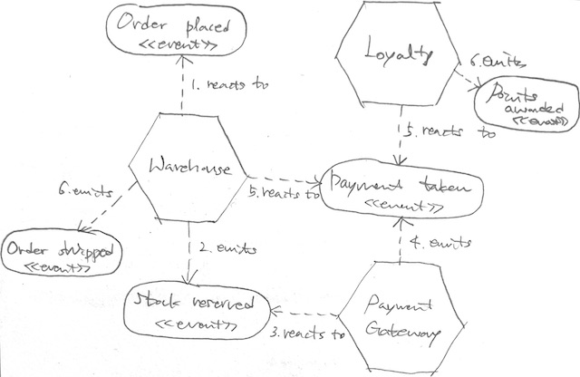

# Building Microservices, 2nd Edition

두 번 읽었던 책인데 2판 나왔길래 아래 챕터들만 다시 읽어보는 것으로.

- CH1. What Are Microservices?
- CH2. How to Model Microservices?
- CH3. Splitting The Monolith
- CH6. Workflow
- CH10. From Monitoring to Observability
- CH12. Resiliency
- CH13. Scaling
- CH14. User Interfaces
- CH15. Organizational Structures

# Chapter 1. What Are Microservices?

## Microservices at a Glance

기본 개념.

- 독립적으로 배포 가능한 서비스.
- 이 서비스는 비즈니스 도메인을 모델링.
- 기능들을 캡슐화하며, 다른 서비스들이 네트워크를 통해 접근.
- 이들이 모여 전체 시스템을 구성.

SOA와의 관계.

- 물론 서비스 경계를 그리는 것에 대해 논란이 있고,
- 독립적 배포가 핵심이긴 하나,
- SOA의 한 형태.
- 특정 기술에 구애받지 않는 것이 한 가지 주요 이점.

캡슐화와 DB.

- 기능은 캡슐화되어 있고,
- 이 기능은 네트워크 엔드포인트를 통해 노출.
- 구현 세부 사항은 숨겨져 있다는 의미이며,
- 공유 DB가 없는 형태를 주로 가짐.
- 필요하면 각자 DB를 가지고 캡슐화.

정보 은닉과 변경.

- 외부 인터페이스로 노출하는 것을 제외하고는 정보를 가능한 숨김.
- 외부 인터페이스에 영향을 주지 않는 내부의 변경은 쉬우며,
- 이는 배포 독립성에 있어 핵심.
- 따라서 명확하고 안정적인 서비스 경계가 중요.
- 높은 응집도와 낮은 결합도.
- 이를 위한 한 가지 방법으로 헥사고날 아키텍처 언급.

## Key Concepts of Microservices

### Independent Deployability

- 다른 서비스의 배포 없이도,
- 한 서비스를 수정하고 배포할 수 있는 것.
- 이를 위해 서비스 간 낮은 결합도를 유지해야 함.
- 이는 서비스 간의 계약이 명시적이고, 잘 정의되어 있으며, 안정적이어야 함을 의미.
- 공유 DB 등의 선택은 이를 어렵게 만듦.

### Modeled Around a Business Domain

- 2개 이상의 마이크로서비스를 동시에 수정해야 하는 기능 출시는 비용이 큼.
- 관련 팀들이 같이 협업해야 하고, 새로운 버전의 배포 순서 등도 고려해야 함.
- 따라서 한 번에 한 곳만 바뀌는 경계 설정이 중요.
- 종종 3티어 아키텍처(presentation/business logic/data)를 만나게 되는데,
- 이 3티어 계층이 모두 같이 바뀌는 경우가 많음.
- 계층이 복잡해 질수록 문제는 더 심각.
- 기술적 응집력보다는 비즈니스적 응집력을 선호.

### Owning Their Own State

- 사람들이 가장 힘들어 하는 것이 공유 DB를 안 쓰는 것.
- 데이터의 소유자에게 데이터를 제공 받아야 함.
- 이런 식으로 숨겨야 할 것과 공유해야 하는 것을 잘 나누면,
- 하위호환성을 위한 비용을 절감할 수 있음.
- 앞에서 언급했든 같은 비즈니스 기능을 가진 것끼리 모아야 함.
- 비즈니스 관련 변경의 비용을 줄이는 것이 목적.
- DB 데이터 역시 마찬가지.

### Size

- 얼마나 작아야 하는지는 자주 나오는 질문.
- 하지만 실제 마이크로서비스에서는 그다지 관심사 주제가 아님.
- 그리고 크기 측정은 또 어떻게 할 것인지가 모호.
- 라인 수, 인터페이스의 수, 이해 가능한 정도 등 모두 한계가 있음.
- 이보다는 아래 2가지가 더 중요.
- 먼저, 마이크로서비스를 얼마나 많이 다룰 수 있는 역량이 되느냐(많을수록 복잡성도 증대).
- 다음으로, 서로 강하게 결합되지 않는 경계를 어떻게 나눌 것인가.

### Flexibility

> microservices buy you options.

- 서비스를 나누면 유연성이 올라감.
- 조직적, 기술적, 확장적, 강건적 유연성.
- 하지만 비용/복잡성도 함께 올라감.
- 따라서 선택의 문제.
- 저자는 점진적 적용을 권장.
- 가고 있는 길의 영향을 좀 더 판단하기 쉽고,
- 멈추거나 돌아오기도 쉽기 때문.

### Alignment of Architecture and Organization

> Organizations which design systems...are constrained to produce designs which are copies of the communication structures of these organizations.

- 콘웨이 법칙 이야기.
- 과거와 지금은 다름.
- 사일로 현상과 핸드오프를 줄이고,
- 더 빠르고 잦은 소프트웨어 출시를 바람.
- 기술 계층으로 팀을 구분하기보다,
- 비즈니스 경계로 팀을 구성.
- 다른 팀과의 커뮤니케이션 비용 없이도,
- 자율적으로 빠르게 원하는 기능을 결정하고 출시.
- 14, 15장에서 좀 더 자세히 다룸.

## The Monolith

- 일반적으로 마이크로서비스는 모놀리스의 대안.
- 이 둘의 비교가 마이크로서비스의 가치 판단에 도움.

### The Single-Process Monolith

- 가장 흔히 떠올리는 모놀리스.
- 단일 프로세스로 모든 코드가 배포되는 것.
- 그리고 스케일링 이유로 이 프로세스의 여러 인스턴스가 실행될 것.
- 많은 작은 조직에 적합한 모델.

### The Modular Monolith

- 단일 프로세스 모노리스가 점점 커지면서,
- 모듈러 모놀리스로 나아갈 수 있음.
- 단일 프로세스 안에 여러 모듈이 모여 있는 것.
- 모듈 경계가 잘 정의되어 있다면, 많은 조직들에게 매우 좋은 선택.
- 마이크로서비스에 비해 좀 더 쉽게 병렬 작업이 가능함.
- 좀 더 간단한 배포 토폴로지를 가지기 때문.
- 여기서 일어나는 문제는 보통 코드 레벨에서 DB 분해가 잘 안 된다는 것.
- 이는 나중에 마이크로서비스로 떼어낼 때 어려움으로 작동하곤 함.
- 그래서 미리 DB를 여러 개로 나눠두기도 함.

### The Distributed Monolith

- 분산 모놀리스는 시스템이 여러 개의 서비스로 구성되어 있긴 하나,
- 어떤 이유로든 모두가 한 번에 배포되는 것을 가리킴.
- 이 방식은 단일 프로세스 모놀리스의 단점과,
- 분산 시스템의 단점을 모두 가짐.
- 한편, 장점은 크게 취하지 못함.
- 이런 유형이 나타나는 이유는 보통 정보 은닉이나 비즈니스 응집성 등이 부족.
- 대신, 여러 서비스들 간 높은 결합도를 가지며 한 번에 여러 곳이 바뀌고 배포도 한 번에.

### Monoliths and Delivery Contention

- 소유권의 혼란.
- 여러 사람이 같은 코드를 동시에 수정하게 되고,
- 서로 다른 팀이 기능 출시에 함께 엮이거나,
- 누구의 소유인지 누가 결정을 내려야 하는지 혼란이 있는 것.
- 모놀리스라고 해서 무조건 이 문제를 겪는 건 아니지만,
- 마이크로서비스 환경에서는 이 문제가 훨씬 유연하며 쉽게 접근이 가능함.

### Advantages of Monoliths

- 단순한 배포 토폴로지는 분산 시스템이 갖는 여러 위험으로부터 자유로움.
- 개발 워크플로우가 간단하고, 모니터링, 트러블슈팅, 종단간 테스팅 등이 훨씬 쉬움.
- 코드 재사용성도 쉬움.
- 하지만 많은 이들이 모놀리스를 피해야 하는 것으로 바라보곤 함.
- 하지만 모놀리스는 분명한 아키텍처 선택지 중 하나.

## Enabling Technology

- 마이크로서비스의 적용에 있어 기술적인 부분은 생산성 측면에 있어 매우 중요.
- 뒤에서 자세히 다루기에 앞서 마이크로서비스 적용에 있어 필요한 몇 가지 기술들 간단히 소개.

### Log Aggregation and Distributed Tracing

- 로그 애그리게이션 시스템은 마이크로서비스 적용의 선행조건.
- 이것 없이는 트러블슈팅이 매우 어려움.
- 모든 서비스의 로그를 중앙 수집하고,
- 분석뿐만 아니라 알림 메커니즘에도 활용.
- 저자는 [Humio](https://www.humio.com/)를 선호한다고.
- 관련 호출들을 엮어주는 correlation ID를 구현하면 더 도움이 됨.

### Containers and Kubernetes

- 각 서비스를 격리된 환경에서 실행시키면,
- 한 서비스의 문제를 그 서비스로 제한할 수 있음.
- 가상화도 하나의 방법이지만 컨테이너가 좀 더 경량화 된 해결책.
- 경량화 된 만큼 속도(스케일링 등)나 비용 측면에서 유리.
- 이런 컨테이너가 많아지면 오케스트레이션을 위해 k8s도 고민.
- 하지만 컨테이너가 많지 않다면 k8s의 비용이 더 클 것.

### Streaming

- 서비스 별로 DB를 갖게 되어도 여전히 데이터 공유가 필요.
- 그리고 변경의 일괄 리포팅보다 실시간 반응을 더 선호.
- 이로 인해 스트리밍을 고려하게 됨.
- Kafka 등의 도구 이야기 간단히 언급.

### Public Cloud and Serverless

- 퍼블릭 클라우드 서비스들 이야기.
- 여러 관리형 서비스와 배포 도구들 제공.
- 서버리스 이야기도.

## Advantages of Microservices

- 분산 시스템이 갖는 많은 이점과 겹침.
- 여기에 정보 은닉과 도메인 주도 개발이 더해짐.

### Technology Heterogeneity

- 서비스마다 다른 기술을 사용할 수 있다는 이야기.
- 또한 이런 기술 세부사항들은 컨슈머나 업스트림 서비스들에게 은닉.
- 따라서 변경하기 쉬움.

### Robustness

- 벌크헤드.
- 한 서비스의 장애가 다른 곳으로 전파되지만 않는다면,
- 문제를 그 한 곳으로 격리시킬 수 있음.
- 하지만 새로운 장애/실패 원인이 늘어남에 유의.
- 네트워크는 언제든 실패할 수 있음.
- 이런 실패가 일어날 수 있음을 받아들이고.
- 이런 문제 역시 전파되지 않는 구조를 고민해야.

### Scaling

- 모놀리스에서는 모든 게 함께 스케일링.
- 하지만 필요한 부분만 선택적으로 스켕일링 가능.
- 비용 측면에서 효율적.

### Ease of Deployment

- 모놀리스에서는 일부만 바뀌어도 전체 애플리케이션을 배포.
- 영향 범위와 리스크가 큼.
- 이로 인해 배포를 꺼려하는 경향도.
- 릴리즈 주기가 길어지며 영향과 리스크는 더욱 증가.
- 마이크로서비스에서는 필요한 부분만을 빠르게 배포.
- 변경의 속도도 올라가고 위험도 국소화.

### Organizational Alignment

- 코드와 팀의 규모가 크면 여러 생산성이 낮아짐.
- 서로 다른 팀이 섞이면 문제는 더 심각.
- 마이크로서비스에서는 조직과 아키텍처 경계를 일치시키기 쉬움.
- 생산성이 올라가고 집중하기 좋은 환경이 될 수 있음.
- 나중에 15장 좀 더 자세히 읽어보자.

### Composability

- 지금 시대에는 여러 서비스 채널(웹, 스마트폰, 태블릿, ...)이 존재.
- 마이크로서비스는 이런 환경에서의 재사용성을 높이고,
- 여러 조합으로 외부의 변화에 유연하게 대응.

## Microservice Pain Points

- 많은 장점과 더불어 높은 복잡도를 가져옴.
- 따라서 이 편익을 계산할 수 있어야.

### Developer Experience

- 개인 장비에서 띄울 수 있는 서비스의 수는 제한적.
- 이를 극복하는 극단적 방법 중 하나는 클라우드에서 개발하는 것.
- 하지만 피드백 주기가 느려지고 이는 생산성 문제로 이어짐.
- 그래서 개발자가 작업해야 하는 시스템의 범위를 한정하는 것이 현실적.
- 하지만 집단적 소유권<sup>collective ownership</sup>을 수용하려는 조직에서는 어령루 수도.

### Technology Overload

- 여러 필요한 기술들이 부담으로 다가올 수도.
- 꽤 많은 과거의 기술들이 단지 마이크로서비스 친화적이라고 브랜딩만 새로 하는 경우가 많다고 함.
- 마이크로서비스의 도입과 함께 기술 숭배를 펼치기도.
- 하지만 필수가 아닌 것들이 많음.
- 균형을 잡아야 함.
- 점진적으로 마이크로서비스를 도입하면서,
- 필요에 따라 조금씩 새로운 기술을 도입하는 방식을 권장.

### Cost

- 단기적으로는 비용이 늘어남.
- 더 많은 프로세스, 컴퓨터, 네트워크, 저장소, 지원 도구들(라이센스 비용으로 이어짐)이 필요.
- 조직의 생산성도 단기적으로 느려짐.
- 새로운 기술과 개념들을 적응해야 하므로.
- 비용은 늘어나는 대신 더 많은 고객을 만나고 수익을 올리는 데 도움.

### Reporting

- DB가 하나일 때는 조인 등을 통해 쉽게 데이터 확인이 가능.
- DB가 분리되면 스트리밍을 통해 실시간 리포팅을 구성하기도.
- 혹은 중앙 리포팅 DB를 만들고 여기로 데이터를 발행할 수도.

### Monitoring and Troubleshooting

- 1개의 단일 서비스 인스턴스가 내려갔다면, 이 영향을 어떻게 이해해야 할까?
- 수십 수백개의 프로세스가 있을 때는 다른 접근법이 필요.
- CH10에서 다룰 내용들.

### Security

- 한 프로세스 내에서만 돌던 데이터가,
- 이제는 서비스들 간 네트워크를 통해 이동함.
- 중간에 데이터가 노출될 수도, 조작될 수도 있음.
- 여러가지 보호 수단이 필요.

### Testing

- MSA에서 종단간 테스트는 매우 규모가 큼.
- 여러 프로세스에 걸쳐 테스트를 실행해야 하며,
- 모두 배포되어야 하고 적절히 설정되어 있어야 함.
- 잘못된 배포로 인한 네트워크 탐임아웃이나 서비스 인스턴스 다운 등,
- 환경적 이유로 거짓 음성(테스트 실패)이 나온 건 아닌지도 확인해야 함.
- MSA 규모가 점점 더 커지면 종단간 테스트의 투자 대비 수익은 점점 낮아짐.
- 따라서 계약 주도 테스팅이나 프로덕션에서의 테스팅 등 새로운 형태의 테스트가 필요.
- 병렬 실행이나 카나리 배포 등 새로운 배포 기법도 필요.

### Latency

- 로컬에 함께 있던 것들이 쪼개짐.
- 따라서 네트워크 전송이 일어남.
- 시스템의 지연으로 이어짐.
- 이 지연을 정확히 예상하긴 어려우므로,
- 이 역시 점진적인 MSA 적용의 한 가지 이유가 됨.
- 조금씩 옮겨가며 그 영향을 확인하고 조치를 취해 리스크를 제한.
- 더불어 지연을 수용할 만한 곳은 어디인지 등의 판단도 함께 필요.

> make a small change and the measure the impact.

### Data Consistency

- DB가 쪼개지다 보니 데이터 일관성 문제가 생기기 마련.
- DB가 제공해 주는 트랜잭션 사용이 불가하기 때문.
- 그리고 분산 트랜잭션은 대부분의 경우에 큰 문제가 됨.
- 사가 패턴을 대안으로 제시.
- 결과적 일관성도 대안.
- 점진적 접근 필요성 또 언급.

## Should I Use Microservices?

- 앞서 언급한 많은 도전과제들 때문에,
- MSA의 도입은 신중한 것이 좋다고 함.
- 자기 자신이 처한 문제 영역, 역량, 기술적 배경, 공감대 등 고려해야 할 것이 많음.
- MSA는 여러 선택지 중 하나.

### Whom They Might Not Work For

- 새로운 제품이나 스타트업들에게 MSA는 X.
- 서비스 경계를 건드리는 변경이 많이 일어나긴 때문.
- 도메인 모델이 어느 정도 안정된 상태에서 적용하는 것을 권장.
- 무조건 성공할 것이라 확신하며 처음부터 MSA를 하는 사람도 있지만,
- 고객이 이 새로운 제품을 사용할지는 미지수이며,
- 결과적으로 완성된 모습은 처음의 의도와는 완전히 다를 수도.
- 또한 인력이 적은 곳에서는 MSA를 위해 필요한 일들이 부담으로 작용할 수 있음.
- "microservice tax"
- 이 세금을 지금 지불할 만한 가치가 있는 상황인지 판단 필요.
- 배포나 관리를 고객이 하는 경우도 있음.

### Where They Work Well

- 저자의 경험상, MSA를 하는 가장 큰 이유는,
- 더 많은 개발자들이 서로 방해 없이 같은 시스템을 개발하는 것.
- 조직과 아키텍처 경계를 올바르게 세우기만 한다면,
- 서로 독립적으로 일하며 배포 경합 등의 문제를 피해갈 수 있음.
- SaaS 애플리케이션이 MSA 적합하다는 이야기도.
- 서비스 별 기술 선택이 좀 더 자율적이기에 퍼블릭 클라우드 활용과도 잘 어울림.
- 다양한 새로운 채널을 통해 고객에게 서비스를 제공해야 하는 곳에도.
- 무엇보다, 시스템 성장과 함께 유연성을 제공할 수 있다는 것이 큰 장점.
- 물론 그 유연성에는 비용이 뒤따르지만, 미래의 선택에 열려있을 수 있음.

# Chapter 2. How to Model Microservices

## What Makes a Good Microservice Boundary?

- 한 마이크로 서비스의 변경이 다른 서비스들과 격리되는 것은 매우 중요.
- 독립적인 변경, 배포, 릴리즈가 가능해야 함.
- 이 관점에서 서비스들 간 경계는 어떻게 나눠야 할까?
- 이 경계 식별은 근본적으로 모듈의 분해와 유사.
- 다만 모델 간에 서로 네트워크로 통신한다는 점이 차이.
- 따라서 모듈 분해에 중요한 요소를 활용할 수 있음.
- 여기서는 3가지인 정보 은닉, 응집력, 결합도 이야기.

### Information Hiding

- 가능한 세부사항을 모듈 안으로 숨기는 것.
- 정보은닉의 이점으로 3가지를 꼽음.
- 먼저, Improved development time.
- 모듈을 독립적으로 개발할 수 있으므로,
- 더 많은 작업을 병렬로 진행할 수 있음.
- 다음으로, comprehensibility.
- 각 모듈을 격리해서 이해하고 볼 수 있으므로,
- 전체 시스템을 이해하는 것이 더 쉬움.
- 마지막으로 flexibility.
- 다른 모듈에 영향 없이 독립적 변경이 가능하며,
- 모듈을 서로 다르게 조합해서 새로운 기능을 만들 수 있음.
- 모듈을 나눈다고 위 이점들이 이뤄지는 것은 아님.
- 경계를 잘 식별해야 가능한 것이며, 정보은닉은 이를 돕는 주요 요소.
- 한편, 서로 간의 가정을 줄이는 것의 중요성도 언급.
- 그래야 영향을 최소화하고 안전한 변경이 가능.

### Cohesion

> the code that changes together, stays together.

- 위 문장이 저자가 가장 명료하다고 느끼는 응집력 정의라고 함.
- MSA에서도 사업의 변화를 쉽게 만드는 것이 목표이며,
- 따라서 같은 기능을 한 곳에 두어 변경의 영향을 가능한 최소화해야 함.
- 여러 서비스를 같이 바꿔야 한다면 비용과 위험이 발생하고 느려짐.

### Coupling

- 서비스 간 낮은 결합도를 가진다면, 한 곳의 변경이 다른 곳에 전파되지 않음.
- 결합도를 높이는 흔한 실수 중 하나는 서비스를 서로 강하게 묶는 통합을 선택하는 것.
- 서비스 간 가능한 적게 알아야 낮은 결합도가 가능.
- 서로 통신하는 횟수를 제한해야 할 수도 있음.

### The Interplay of Coupling and Cohesion

- 결합도와 응집도는 매우 밀접한 관계.
- 관련된 기능이 산재한다면, 변경이 여러 경계에 걸치게 되고, 강하게 엮이는 것.
- 응집력은 경계 안(inside)의 관계에 대한 이야기이고,
- 결합도는 경계를 가로지르는(across) 관계에 대한 이야기.
- 아래의 콘스탄틴 법칙도 언급함.
- stable = 각 요소들이 서로 독립적이어서 변경의 영향이 적음.

> A structure is stable if cohesion is strong and coupling is low.

- 절대적으로 옳은 방법은 없음.
- 결합도와 응집도 역시 코드 구조화 시 고려해야 하는 트레이드 오프 중 하나.
- 그리고 시간이 지남에 따라 안정성이 낮아질 수 있으며,
- 따라서 꾸준히 과거의 결정을 재고해야 함.

## Types of Coupling

- 결합도가 나쁘긴 하지만 어떤 것은 피할 수 없기도 함.
- 결합도를 낮추려 노력할 뿐.
- 이 결합도에는 여러 유형이 있음.
- 책에서는 4개를 소개하고 있으며, 왼쪽에서 오른쪽으로 갈수록 결합도가 높음.
- domain < pass-throw < common < content

### Domain Coupling

- 도메인 결합도란, 한 MS가 다른 MS와 상호작용하는 것을 가리킴.
- 다른 MS가 제공하는 기능을 사용하기 위해 필요한 것.
- 예컨대 주문 MS는 재고 MS에 상품 예약을 하고 결제 MS에 결제를 요청함.
- MSA에서 이런 상호작용은 대개는 불가피한 의존 유형.
- 도메인 의존성은 결합도 중에서도 느슨한 수준.
- 물론 가능한 적게 유지하는 것이 좋음.
- 한 MS가 여러 다운스트림 MS에 요청하는 것은 너무 많은 로직이 중앙화 된 것일 수 있음.
- 서비스 간 주고받는 데이터가 복잡해질수록 문제가 됨.
- 정보 은닉을 기억해야 함.
- 꼭 필요한 것만을 공유하고, 필요한 만큼만 데이터를 보내라.

### Pass-Through Coupling

pass-through 결합도 설명과 이것의 문제점 이야기.

- 한 MS가 다른 MS로 데이터를 전달하는데,
- 중간에 또 다른 MS를 거쳐야 하는 것을 가리킴.
- 문제적 결합도의 대표적 사례.
- 만약, `Order Processor`가 주문 요청을 `Warehouse`에게 보내고,
- `Warehouse`는 주문 요청에서 `Shipping Manifest`를 추출해서,
- `Shipping` 서비스로 보내야 한다고 가정.
- 만약, `Shipping Manfiest`의 변경이 필요하면,
- `Warehouse`뿐만 아니라 `Order Processor`에까지 영향을 줌.

이를 해결할 수 있는 첫 번째 방법.

- 중간 단계를 없애는 방법을 생각해 볼 수 있음.
- `Warehouse`에 주문 상품 목록만을 담아 요청하고 응답이 오면,
- `Shipping Manifest`만을 `Shipping`에 전달하는 것.
- 다만, 이것의 트레이드 오프로 `Order Processor`의 도메인 의존성과 로직의 복잡성이 높아짐.

두 번째 대안 이야기.

- `Order Processor`로부터 `Shipping Manifest`를 숨기는 것도 방법.
- `Order Processor`는 추상화 된 주문 요청을 `Warehouse`에 보내고,
- `Warehouse`가 이 요청으로부터 `Shipping Manifest`를 만들어 `Shipping`에 요청.
- `Shipping` 서비스의 계약이 바뀌더라도 이 변경은 `Warehouse`로만 영향이 한정될 가능성 높음.
- 물론 완전히 독립적이 되는 것은 아님.
- 국제 배송이 될 경우 `Shipping`은 부가 정보를 필요로 할 수 있으며,
- 이 정보를 마땅히 얻을 곳이 없다면,  `Order Processor`의 변경은 불가피.
- 하지만 `Shipping Manifest`를 숨김으로써 단계적 배포 등을 통해 어느 정도 독립성을 챙길 수 있음.

마지막 방법.

- `Order Processor`가 여전히 `Shipping Manifest`를 포함해서 요청을 보내긴 하되,
- `Warehouse`는 이것의 구조에는 관심을 두지 않고,
- 단지 데이터 블럽으로 대우하며 그대로 `Shipping`에 전달.
- `Shipping Manifest`의 변경은 이제 `Order Processor`와 `Shipping`으로 한정.

### Common Coupling

일단 공통 결합도가 무엇인지 언급.

- 2개 이상의 MS가 공통의 데이터 셋을 사용하는 경우를 가리킴.
- 예를 들어, 여러 MS에 공통 데이터를 공유하는 방식으로 공유 DB(또는 메모리나 파일시스템)를 사용.
- 이 때의 문제는 데이터 구조 변경이 여러 MS에 영향을 준다는 것.
- 물론, 자주 바뀌지 않는 읽기전용의 정적 데이터를 공유하는 건 괜찮을 수도.
- 그러나 자주 바뀌는 데이터는 문제가 됨.
- 책에서는 `Order Processor`와 `Warehouse`가 주문 테이블을 같이 사용하며,
- 같은 주문 건에 대해 상태를 바꿀 수 있는 경우를 예로 들고 있음.
- 이 둘은 서로 다른 생애주기로 주문을 관리함.

이를 극복하는 방법들.

- 각각이 주문의 상태를 바꿀 때 서로의 관점을 깨뜨리는 건 아닌지를 어떻게 확인할 수 있을까?
- 한 가지 방법은 유한 상태 머신을 만드는 것.
- 자세한 내용은 CH6에서 다룬다고 함.
- 또 다른 해결책은 한 MS를 source of truth로 만드는 것.
- `Order`라는 서비스를 만들고 이를 담당하게 하고,
- `Order Processor`와 `Warehouse`가 상태 변경 요청을 여기로 보내게 함.
- `Order`를 단순한 DB CRUD 래퍼로 만들 수도 있으나,
- 이는 단지 필드를 private으로 만들되 모든 getter/setter를 그대로 제공하는 것과 마찬가지.
- 앞에서의 문제가 조금 다른 형태로 재현될 뿐임.

공통 결합도로 인한 리소스 경합 문제도 있음.

- 같은 파일시스템이나 DB를 공유해서 사용하다 보면,
- 특정 MS가 무거원 연산을 실행시킬 수도 있고,
- 이로 인해 여기에 의존하는 다른 MS에도 영향을 줄 수 있음.
- 단지 변경 이슈 외에도 경합 문제도 고려해야 함.

### Content Coupling

- 업스트림 서비스가 다운스트림 서비스의 내부에 접근해서 그 내부의 상태를 바꾸는 것.
- 예를 들어, 다른 MS의 DB 값을 직접 변경하는 것.
- 공통 결합 문제에서는 다른 공유 데이터를 사용해도 이것이 통제 밖에 있다는 것을 인지하지만,
- 컨텐츠 결합에서는 이 책임이 덜 명확하며 따라서 개발자 입장에서 시스템을 변경하는 것이 더 어려움.
- 로직이 중복될 뿐만 아니라 로직이 달라지기 시작하면 원인을 찾기 어려운 문제가 됨.
- 위에서 `Order`를 만들었던 것처럼 서비스를 하나 만들고 요청을 위임하는 것이 좋음.

## Just Enough Domain-Driven Design

- 에릭 에반스의 DDD 책에 나온 3가지 주요 아이디어 짧게 소개.
- Ubiquitous language
- Aggregate
- Bounded context

### Ubiquitous Language

- 실제 사용자들이 사용하는 용어와 같은 것을 개발에 사용해야 한다는 것.
- 이를 통해 커뮤니케이션을 더 쉽게 만들고 실제 세계를 좀 더 잘 모델링.
- 이와 반대되는 은행 시스템 개발 사례를 얘기하고 있음.
- 번역에 많은 시간이 들어갔다고.

### Aggregate

- 애그리거트의 정의는 다양해서 혼란의 여지가 있지만,
- 저자는 실제 도메인 개념을 표현하는 것을 생각하는 게 도움이 됐다고.
- 주문, 송장, 재고 아이템 등.
- 책에서 계속 언급되는 MusicCorp 예시에서는,
- 주문 애그리거트가 여러 라인 아이템(주문 상품)들을 가짐.
- 이 라인 아이템들은 주문 애그리거트의 부분으로써만 의미가 있음.
- 애그리거트는 자주적 단위로 간주.
- 즉, 애그리거트의 상태와 이 상태의 전이를 위한 코드는 함께 모여 있음.
- 따라서 하나의 애그리거트는 하나의 MS에 의해서만 다뤄져야 함.
- 애그리거트는 다른 애그리거트와 관계를 맺을 수 있음.
- 하나의 MS안에 있는 애그리거트들이라면 외부키로 연결할 수도.
- 그러나 서로 다른 MS에 있다면 단지 ID만을 저장하면 됨.
- 외부키로 연결할 때에 비해 덜 명시적.
- 그래서 책에서는 바닐라 ID 대신 URI를 저장하라고 함.
- 예컨대 `/customer/141` 같은 식.
- 보통 URI를 통해 리소스 식별이 가능하므로 모호함을 어느 정도 극복.
- 물론 이 또한 여러 문제가 떠오름. 선택의 문제.

### Bounded Context

- 애그리거트에 비해 좀 더 큰 조직적 경계.
- 이 분류 별로 명시적 책임들이 수행되고,
- 구현세부사항은 숨겨짐(알 필요도 없고, 알면 안 됨).
- 1개 이상의 애그리거트를 가지며,
- 이 중 어떤 것은 바깥에 노출되고 어떤 것은 내부에 숨겨짐.
- 필요하면 바운디드 컨텍스트끼리 서로 관계를 맺음.

#### Hidden models

- MusicCorp에서 재정 부서와 창고는 서로 다른 바운디드 컨텍스트.
- 이들은 바깥 세상과 소통하는 명시적인 인터페이스가 있음.
- 그리고 본인들만 알아야 하는 세부사항을 가짐.
- 여기서 재정 부서는 장부에서 재고 정보를 최신 상태로 유지해야 함.
- 이는 창고 서비스로부터 재고 아이템이라는 공유 모델로 얻을 수 있음.
- 하지만 창고의 선반이나 접수인 등의 세부사항은 알지 못해야 함.
- 물론 재고 아이템을 공유 받을 때도 재정 부서의 관점에서 필요한 것만.
- 재고 아이템의 외부 표현과 내부 표현이 서로 다른 것.
- 이 공유 시점에 필요하다면(혼란을 피하거나) 이름을 다르게 지을 수 있음.
- 재고 아이템의 갯수만 제공한다면, `StockItem`이라는 표현 대신 `StockCount` 등을 고려.

#### Shared models

- 재정 부서와 창고는 모두 고객의 정보를 필요로 함.
- 재정 부서는 고객의 금융 지불 정보를 알아야 하고,
- 창고는 배송 추적을 위한 고객 정보를 알아야 함.
- 이런 경우 고객이라는 공유 모델은 서로 다른 바운디드 컨텍스트에서 서로 다른 의미를 가짐.
- 예컨대, 재정 부서에서는 "고객"이라는 이름을 사용하는 반면,
- 창고에서는 수취인이라는 용어를 사용할 수 있음.

### Mapping Aggregate and Bounded Contexts to Microservices

- 애그리거트와 바운디드 컨텍스트는 잘 정의된 인터페이스와 함께 응집력을 가져다 줌.
- 애그리거트는 단일 도메인 개념에 집중한 자율적 상태 머신이고,
- 바운디드 컨텍스트는 연관성 있는 애그리거트의 집합을 나타내며 좀 더 넓은 세상으로의 명시적 인터페이스를 제공.
- 이 둘 모두 서비스의 경계로써 잘 동작함.
- 그러나 시작할 때는 서비스의 수를 줄이는 것이 좋고,
- 따라서 바운디드 컨텍스트르를 아우르는 서비스를 권장.
- 그리고 필요에 따라 더 작은 단위로 분리.
- 주의할 것은 애그리거트의 필요성을 생각해 볼 때,
- 한 애그리거트가 여러 서비스에 나뉘지 않아야 함.

#### Turtles all the way down

- BD(바운디드 컨텍스트)로 서비스를 나누었는데,
- 이 BD는 또 다른 BD들을 내포하고 있을 수 있음.
- 이를 좀 더 잘게 나눈다고 할 때, 이런 구분은 구현 세부사항일 수 있으며, 따라서 이를 외부 세상엔 숨길 수 있음.
- 예컨대, `Warehouse`를 `Inventory`와 `Shipping`으로 나눈다고 가정.
- 하지만 외부세상은 여전히 `Warehouse` 서비스에 통신.
- 내부적으로만 나뉘는 것.
- 외부 세상으로의 변경 영향을 줄일 수 있고,
- 테스트 스텁을 만들어야 하는 비용을 줄일 수도 있음.

## Event Storming

- 도메인 모델링을 위한 협력적 브레인스토밍 활동.
- 기술적, 그리고 비기술적 이해관계자들이 함께 참여.
- 도메인 세상에 대한 공유된, 비슷한 시각을 가질 수 있음.
- 이벤트 드리븐 시스템 뿐만아니라 요청/응답 지향 시스템에도 사용 가능.

### Logistics

- 일단 모두가 방 안에 함께해야 함.
- 이것이 가장 어려운 단계.
- 하지만 모든 이해관계자들이 동시에 모여야 하는 것이 핵심.
- 사용자, 직무전문가, 프로덕트 오너, ...
- 그리고 의자는 모두 치워두는 것도 권장.
- 큰 공간도 필요. 벽에 커다란 종이를 붙이고, 모두가 정보를 파악할 수 있게.
- 주 도구는 서로 다른 색을 가진 포스트잇.

### The process

- 도메인 이벤트를 식별하는 것으로 활동은 시작.
- 이는 시스템에서 일어나는 것들을 가리킴.
- "Order Placed", "Payment Received", ...
- 이 이벤트들은 주황색 포스트잇에 기록.
- 그리고 이 이벤트를 일으키는 명령들을 식별.
- 여기서 명령이란 사용자의 결정들을 일컬음.
- 명령들은 파란색 포스트잇에 작성.
- 여기서는 기술 세부사항보다는 주요 이해관계자들로부터 여러 도메인 개념들을 이끌어내는 것에 초점.
- 이제 애그리거트 식별 단계.
- "Order Placed"의 "Order"가 애그리거트 후보.
- 이제 이들을 묶어 BD 식별.
- 일반적으로는 조직 구조를 따라감.

## Alternatives to Business Domain Boundaries

- DDD 외에도 경계를 찾는 여러 방법들이 있음.
- 저자는 이들을 DDD와 함께 자주 사용한다고 함.

### Volatility

- 자주 변경되는 부분을 하나의 서비스로 추출하는 것.
- 이것의 이점이 분명하긴 하나 절대적인 것은 아님.
- 예컨대, 애플리케이션 스케일링이 이슈일 때는 이 분리는 X.
- 대신 bimodal IT 같은 곳에서 두드러짐.
- Mode 1은 안정적이고 잘 바뀌지 않는 곳이고,
- Mode 2는 빠르게 변화하고 비즈니스와 긴밀하게 연결된 곳.
- 하지만 저자는 bimodal이 결국 느리거나 더 느린 2개의 속도로 끝난다며 비판.
- 대신 빠른 시장 대응이 필요하고 이에 대응해야 할 경우 추출은 의미가 있음.

### Data

- 데이터 역시 분리의 기준이 될 수 있음.
- 예를 들어, PII<sup>Personally Identifiable Information</sup>의 사용은 특정 서비스로 제한해서 리스크를 줄이고 싶을 수도.
- 좀 더 구체적인 신용카드 회사 사례 언급.

### Technology

- 서로 다른 기술의 사용 역시 분리 기준 후보.
- 1개의 서비스에서 서로 다른 DB를 사용할 수도 있으나 이는 도전적이기에 분리할 수도.
- 또한 성능 상의 이유로 Rust 같은 언어를 사용한다면 이 역시 분리 후보.
- 물론, 이 기준이 일반적인 수단으로 받아들여지는 것은 위험.
- 전형적인 3계층 아키텍처(Web - Backend - Database)가 될 수도.

### Organizational

- 조직의 구조는 좋든 나쁘든 시스템 아키텍처를 결정짓는 경향이 있음.
- 그래서 서비스 경계 식별의 주요 의사 결정 요소로 고려해야 함.
- MS의 공유된 소유권은 15장에서 다룰 여러 문제들을 야기.
- 서비스 경계를 나누기 위해 조직 구조도 함께 변경해야 할 수도.
- 물론, 조직이 너무 자주 바뀌는 경우도 생각해봐야 함.
- 최악의 경우 조직 구조도 바뀌긴 하나,
- 일반적으로는 MS의 소유권만 바뀜.

# Chapter 3. Splitting the Monolith

## Have a Goal

- MSA 자체가 목적은 아님.
- 그리고 목적지로 갈 수 있는 다른 쉬운 방법은 없는지 먼저 고민해야 함.
- 목적이 명확치 않으면 어디서부터 시작해야 할지도 막막.

> Microservices aren't easy. Try the simple stuff first.

## Incremental Migration

- 모놀리틱을 나누기로 했다면 조금씩 떼어내길 강력히 권장.
- 점진적 접근을 통해, 앞으로 나아가며 배울 수 있고, 잘못되는 것의 영향도 줄일 수 있음.
- 언제 멈춰야 하는지도 알 수 있음(중요).

## The Monolith Is Rarely the Enemy

- 모놀리틱이 나쁜 게 아니라는 이야기.
- 모놀리틱이냐 MSA냐가 초점이 아니라 변경함으로써 얻는 이득에 중점을 둬야.
- 그리고 MSA로의 전환 뒤에도 모놀리틱이 남아 있는 것은 흔한 일.
- 예컨대, 병목이 되는 10%의 기능을 따로 뗴어내고 개선하면,
- 나머지 90%의 기능은 모놀리틱에 남아ㅕ 있음.
- 사람들은 이렇게 모놀리틱과 MSA가 혼재하는 것을 지저분하다고 여김.
- 하지만 실제 세상의 동작하는 시스템은 결코 깨끗하지 않음.
- 무한한 자금과 완벽한 예측력이 아니고서야.
- 다만, 지식이 변화고 적응이 필요할 때마다 시스템은 꾸준히 진화해야.

### The Dangers of Premature Decomposition

- 도메인에 대한 명확한 이해가 없다면 MS를 만드는 것은 위험.
- 쏘트웍스에서의 사례 이야기.
- GoCI를 만들던 사람들이 이와 비슷한 Snap CI를 만드는데,
- 비슷한 코드가 많다보니 자신감을 갖고 MSA 작업을 시작.
- 하지만 몇 달 후 보니 Snap CI는 미묘하게 기존 유스케이스와 달랐고,
- 그래서 초기에 취했던 서비스 경계가 올바르지 않음을 발견.
- 그래서 변경이 일어나면 여러 서비스에 걸쳐 영향을 줌.
- 결국 서비스들을 다시 원래의 모놀리틱으로 병합.
- 1년 뒤에야 다시 서비스 경계를 설정하고 다시 나눴다고 함.

## What to Split First?

- 왜 MSA로 가야하는지가 명확해 졌다면 우선순위 정하는 데도 도움이 됨.
- 스케일링을 해야한다면, 부하를 다루는 데 제약을 주는 기능을 찾기.
- 시장 대응력을 높이고자 한다면, 자주 바뀌는 부분을 찾기.
- [CodeScene](https://www.codescene.com/) 같은 도구를 이용해 변동부를 찾을 수도 있음.
- 한편, 분리가 가능한지 여부도 함께 고려해야 함.
- 어떤 기능은 너무 복잡하게 얽혀 있어 실마리를 푸는 게 어려울 수도.
- 혹은 변경하기엔 너무 중요하고 리스크가 클 수도.
- 결국 얼마나 추출이 쉬운지와 그 이득은 얼마나 되는지를 같이 고려.
- 저자는 처음엔 쉬운 것을 고르라고 권장.
- 이를 통해 배우고 추진력을 얻어 더 큰 곳으로 나아가기.

## Decomposition by Layer

- 첫 번째로 추춢할 MS를 식별했으니,
- 이제 분리 단계에 대해 좀 더 생각해 볼 차례.
- 전통적인 웹기반 3계층인 UI, 애플리케이션 코드, 데이터로 나누어 생각해 보자.
- 일단, UI는 일반적으로 1:1 매핑이 안 됨.
- 이 결과 UI의 추출은 별개 단계로 간주되곤 함.
- 하지만 UI의 분리로부터 얻는 이점이 클 때도 있음.
- UI의 분리가 너무 지연되지 않도록 신경써야 함.

### Code First

- DB는 여전히 한 통을 유지한 채,
- 코드만 별도 MS로 빼는 것.
- 가장 흔한 첫 번째 단계.
- 쉬우면서 단기적 이점이 크기 때문.
- 분리를 진행하면서, 깔끔한 코드 분리가 어렵다는 것을 알게 되면, 멈출 수 있음.
- 그런데 코드는 깔끔히 분리 됐는데, DB 분리가 어렵다면 이는 문제가 됨.
- 따라서 코드를 먼저 진행하더라도 DB 분리가 가능한지 함께 살펴봐야 함.

### Data First

- 코드 보다 데이터를 먼저 분리하는 것.
- 이는 흔치 않긴 하지만 데이터가 분리 가능한지 확실치 않을 때 유용.

## Useful Decompositional Patterns

- 시스템을 쪼개는 데 도움이 되는 몇 가지 패턴이 있음.
- <Monolith to Microservices> 책에서 자세히 언급했으니 여기선 간단히 소개.

### Strangler Fig Pattern

- 시스템으로 들어오는 모든 요청을 가로챈 뒤,
- 요청 종류에 따라 기존의 모놀리스 또는 신규 MS로 라우팅.
- 모놀리스에 영향을 주지 않을 수 있다는 것이 장점.

### Parallel Run

- 마이그레이션 하려는 기능이 매우 중요하다면,
- 모놀리틱에도 기존과 같이 요청을 보내면서,
- 새로운 MS에도 요청을 보내기.
- 그리고 그 결과를 계속 비교하여 검증.

### Feature Toggle

- 스위치를 키고 꺼서 2개의 구현체를 번갈아 사용하는 것.
- 범용적 장치이긴 하나 MS 마이그레이션에 특히 유용.
- strangler fig 패턴의 경우 피처 토글을 프록시 레이어에 구현하는 것.

## Data Decomposition Concerns

- DB를 나누기 시작하면 여러 이슈를 마주함.
- 그 중 몇 가지를 소개하고 도움 되는 팁 이야기.

### Performance

- DB, 특히 관계형 DB는 서로 다른 테이블의 조인에 유리.
- 그러나 서비스 별로 나뉘면 DB가 아닌 애플리케이션 코드에서 조인이 이뤄짐.
- 이는 DB만큼 빠르지 못함.
- 책에 나온 예시의 경우, 보고서는 월 단위로 만들어지고, 따라서 캐시를 적극 활용할 수 있으므로, DB 조인을 쓰지 않더라도 느려지진 않음.
- 하지만 자주 일어나는 연산이라면 문제가 될 수도.
- 이 경우 SKU를 벌크로 가져오는 API를 활용하거나,
- 로컬 캐시를 이용해서 문제를 피해갈 수 있음.

### Data Integrity

- DB는 데이터의 무결성에도 유리.
- 책에 나오는 사례의 `Album`, `Ledger` 테이블에 외부키를 지정해서 관계를 지정할 수 있음.
- 외부키로 참조된 데이터는 함부로 지워지지 않음.
- 하지만 DB가 분리되면 이 무결성은 DB에서 지원 X.
- 그래서 "copping pattern" 같은 대안을 활용.
- 실제로 지우지는 않고 상태로 마킹만 하는 것.
- 또 다른 옵션은 앨범이 팔릴 때마다 그 이름을 `Ledger` 테이블로 복사하는 것.
- 하지만 이름이 변경됐을 때의 동기화 이슈가 있음.

### Transactions

- DB가 분리되면 ACID 트랜잭션 역시 X.
- 어떤 이들은 분산 트랜잭션을 구현하곤 하지만,
- 이는 복잡할 뿐만 아니라 DB에서와 같은 보장도 어려움.
- 대신, 사가<sup>saga</sup>라는 대안이 있음.
- 물론 이 또한 새로운 복잡성을 가져옴.
- 분리의 분명한 이점도 있는 반면 이런 트레이드 오프가 존재.

### Tooling

- 코드를 바꿀 때는 IDE 등의 도움을 받아 상대적으로 쉽지만,
- DB를 바꾸는 것은 도구의 지원이 제한되어 있음.
- 그래도 관계형 DB 스키마의 변경 버전을 관리해 주는 도구가 도움이 됨.
- Flyway와 Liquibase 언급.

### Reporting Database

- 리포팅 DB를 만들어서 외부 접근에 특화된 DB를 두기도 함.
- 그리고 각 서비스에서 이 리포팅 DB로 데이터를 푸시.
- 내부 DB를 어느 정도 계속 숨기면서도 DB의 기능을 잘 활용할 수 있음.
- 이를 위해 최소한의 데이터만을 리포팅 DB로 보내야 하고,
- 종단간 API를 다루는 것처럼 관리해줘야 함.
- 담당 MS의 유지보수자가 리포팅 DB로 푸시하는 데이터에 대한 책임을 가짐.

# Chapter 6. Workflow

- 여러 MS가 협력해서 비즈니스 프로세스를 구현해야 한다면?
- 이 문제를 해결하기 위해 분산 트랜잭션을 사용하는 것의 위험을 이야기하고,
- 좀 더 안전한 방법으로 사가<sup>sagas</sup> 소개.

## Database Transactions

- DB의 트랜잭션을 이용하면 1개 이상의 상태 변경이 성공했는지를 확실히 알 수 있음.
- 이 변경엔 삭제, 삽입, 수정이 모두 포함되며,
- 여러 테이블에 걸쳐 일어나는 변경도 하나의 트랜잭션으로 묶을 수 있음.

### ACID Transactions

- 보통 DB 트랜잭션이라 하면, ACID 트랜잭션을 일컬음.
- 원자성, 일관성, 격리, 내구성 이야기.
- 참고로 모든 DB가 ACID 트랜잭션을 제공하는 것은 아님.
- 몽고DB의 경우 단일 문서의 변경에 대해서만 ACID 지원.

### Still ACID, but Lacking Atomicity?

- MSA에서도 MS 안의 단일 DB에 대해서는 여전히 ACID 가능.
- 하지만 여러 MS의 여러 DB를 아우르는 트랜잭션에서,
- 일정 수준의 트랜잭션은 가능하지만 원자성은 보장이 안 됨.
- 기존에 이런 원자성에 의존하던 기능을 MS로 분리하려면 문제가 됨.
- 그리고 분산 트랜잭션은 해결책이 되지 못함.
- two-phase 커밋을 말하는 것.

## Distributed Transactions Two-Phase Commits

- 2PC는 2개의 단계로 이뤄짐(그래서 2PC).
- 투표 단계와 커밋 단계.
- 일단 투표 단계 설명.
  - 중앙 코디네이터가 트랜잭션에 참여할 모든 워커에 연락.
  - 그리고 상태 변경이 가능한지 모두에게 질의.
  - 만약 가능하다고 답변오면 다음 단계로 넘어감.
  - 누구라도 불가능하다고 답변하면 전체 연산 종료.
- 여기서 가능하다고 답변할 때, 실제 작업을 한 것은 아님.
- 따라서 실제 작업이 이뤄지기 전에 뭔가 바뀌어서 불가능한 상태로 바뀔 수도.
- 이를 보장하려면 작업 대상에 잠금을 걸어야 함.
- 누구라도 커밋할 수 없다고 투표하면 롤백 메시지가 모든 참여자들에게 전달 되어야 함.
- 참여자들은 걸어 둔 잠금을 해제.
- 이제 커밋 단계로 감.
  - 실제로 변경을 수행.
  - 관련된 잠금은 모두 해제.
- 이 변경은 정확히 같은 시간에 이뤄질 수 없음.
- 메시지가 서로 다른 시간에 전달 될 수도 있고,
- 실제 작업자의 상황에 따라 실행 시작 시간이나 소요 시간도 다름.
- ACID에서 격리가 보장되지 않는 것.
- 2PC는 사실 분산 잠금 조율에 가까움.
- 단일 머신에서도 잠금을 관리하고 데드락을 피하는 건 어려움.
- 분산 시스템에서는 훨씬 더 어려움.
- 투표에는 성공적으로 참여했으나 커밋 단계에서 응답 없는 워커가 있다면?
- 무엇을 해야 할까? 그리고 자동으로 처리가 어려운 경우도.
- 참여자가 늘어날수록 지연도 커짐.
- 이런 이유로 2PC는 매우 짧은 시간이 걸리는 연산에만 주로 사용.
- DDIA에 정리했던 내용도 함께 참고.
- [Holding locks while in doubt](https://github.com/codehumane/what-i-learned/blob/0a3568f7a7e5ad3157bb4133309ce4db55e41d69/book/ddia/Distributed-Data.md#holding-locks-while-in-doubt)
- [Recovering from coordinator failure](https://github.com/codehumane/what-i-learned/blob/0a3568f7a7e5ad3157bb4133309ce4db55e41d69/book/ddia/Distributed-Data.md#recovering-from-coordinator-failuer)
- [Limitations of distributed transactions](https://github.com/codehumane/what-i-learned/blob/0a3568f7a7e5ad3157bb4133309ce4db55e41d69/book/ddia/Distributed-Data.md#limitations-of-distributed-transactions)

## Distributed Transactions - Just Say No

- 2PC 같은 분산 트랜잭션의 사용을 피할 것을 권장.
- 그럼 어떻게 해야 할까?
- 첫 번째 옵션은, 원자적으로 일관성 있게 다뤄야 하는 데이터가 있다면 함께 두기.
- 그런데 데이터가 여러 MS에 분리 되어 있을 수 있고, 잠금은 여전히 피하고 싶을 수 있음.
- 두 번째 옵션은, 바로 뒤에서 다룰 사가<sup>sagas</sup>.

## Sagas

- 여러 상태를 조율하면서도 잠금은 사용하지 않는 설계.
- 일단 LLT<sup>Long Lived Transaction</sup> 문제 이야기.
- 트랜잭션이 길어지면 여러 로우나 테이블 자체가 잠길 수 있음.
- 그래서 LLT를 몇 개의 트랜잭션으로 나누고 이를 독립적으로 처리하는 것을 제안.
- 경합의 범위도 줄어들고 잠금의 기간도 줄어듦.
- 사가가 원래는 단일 DB의 LLT를 돕는 메커니즘으로 만들어졌지만,
- 여러 서비스 간 변경을 조율하는 데도 잘 동작함.
- 주문서 작성 플로우를 예시로 소개.
- 주문서 작성 프로세스를 몇 개의 단계로 나누고,
- 서비스 별로 각 단계를 나눠서 담당함.
- 각각의 변경 사항은 로컬 ACID 트랜잭션으로 처리.

```
# Order fulfillment
1. Check item in stock and reserve for order (Warehouse MS)
2. Take money from customer (Payment Gateway MS)
3. Award points to customer (Loyalty MS)
4. Package and send order (Warehouse MS)
# Fulfillment completed
```

### Saga Failure Modes

- 개별 트랜잭션으로 분리됐을 때, 실패 대응은 어떻게 이뤄지는지 이야기.
- 특히, 실패했을 때 어떻게 복구할 것인가에 관함.
- 사가 논문에서는 2가지 복구를 다룸.
- backward recovery, forward recovery.
- backward recovery는 리버트.
- 이를 위해 보상(앞선 트랜잭션에서 커밋된 변경을 다시 돌리는) 행위를 정의.
- forward recovery는 실패가 발생한 지점부터 처리를 다시 진행.
- 이를 위해서는 재시도 트랜잭션이 가능해야 함.
- 비즈니스 상황에 따라 둘 중 하나 또는 모두가 필요할 수 있음.
- 여기서 이 복구라는 것이 비즈니스 실패에 대한 것이지, 기술적인 실패에 대한 것이 아님에 유의.
- 사가는 시스템들이 신뢰성 있게 동작한다는 것을 전제로 하고 있음.

#### Saga rollbacks

- 사가에서는 여러 트랜잭션으로 구성되어 있으므로,
- 롤백을 위해선 이미 커밋된 것을 다시 돌려야 함.
- 주문 처리 예시에서 실패할 수 있는 경우를 생각해보자.
- 4번째 단계인 `Package and send order`에서 막상 제품이 없다면?
- 고객에게 이월 주문을 제시하는 대신 전체 주문을 롤백하기로 했다고 가정.
- 이 때의 문제는 이미 결제가 끝났고 포인트가 제공 됐다는 것.
- 단일 DB에서와 같이 전체 연산을 단순히 롤백하는 방법은 없음.
- 대신, 보상 트랜잭션을 구현해야 함.
- 이는 커밋된 트랜잭션을 다시 되돌리는 것.
- 그리고 DB에서의 롤백과는 다름.
- DB에서의 롤백은 롤백이 커밋 전에 일어나며 따라서 아무 일도 없었던 것과 같음.
- 하지만 보상 트랜잭션에서는 트랜잭션 커밋이 실제 일어났으며 이를 되돌리는 것.
- 새로운 트랜잭션을 실행하는 것임.
- 완벽하게 리버트하긴 어렵기에 보상 트랜잭션을 가리켜 시멘틱 롤백이라 부름.
- 예를 들어, 고객에게 배송 시작을 알리는 이메일을 돌릴 순 없음.
- 대신, 고객에게 주문에 문제가 있어 취소됐다고 두 번재 메일을 보내야 함.
- 그리고 롤백에 관련된 정보가 시스템에 영속되는 것이 좋음.
- 주문이 취소됐다면 취소된 이유와 함께 주문 정보를 남겨야 함.

#### Reordering workflow steps to reduce rollbacks

- 프로세스 순서를 재조정하여 롤백 시나리오를 좀 더 단순하게 만들 수 있음.
- 다시 주문 절차를 보자.

```
# Order fulfillment
1. Check item in stock and reserve for order (Warehouse MS)
2. Take money from customer (Payment Gateway MS)
3. Award points to customer (Loyalty MS)
4. Package and send order (Warehouse MS)
# Fulfillment completed
```

- 여기서 3, 4를 서로 바꿀 수 있음.
- 이렇게 하면 패키징과 주문 발송 시 문제가 일어났을 때,
- 3번을 롤백하는 일을 줄일 수 있음.
- 문제가 될 가능성이 높은 작업을 최대한 앞으로 당기면,
- 보상 트랜잭션의 수를 줄일 수 있게 됨.
- 보상 트랜잭션이 어려울 수록 더 유용.

#### Mixing fail-backward and fail-forward situations

- 실패 복구 모드를 혼합해서 사용하는 것이 좋음.
- 어떤 경우는 fail backward(롤백을 가리킴)를, 어떤 경우엔 fail forward를 사용.
- 예를 들어, 주문 프로세스에서, 고객의 돈이 지불 됐고, 패키징이 완료 됐다면, 이를 발송하는 일만 남음.
- 발송이 실패한다고 전체 사가를 돌리는 것이 적절치 않을 수 있음.
- 따라서 단지 발송 처리를 재시도.
- 그래도 실패한다면 사람의 개입으로 문제를 해결.

### Implementing Sagas

- 지금까지 사가의 논리적 모델을 살펴봄.
- 이제 좀 더 깊게 들어가서 구현 방법까지 보려함.
- 사가의 구현에는 2가지 스타일이 있음.
- orchestrated saga와 choreographed saga.
- 전자는 원래의 해결책에 가까우며 중앙화 된 조율과 추적을 활용.
- 후자는 추적이 좀 더 복잡하긴 하지만 이런 중앙화 된 조율을 피하고 결합도 낮은 방식을 추구.

#### Orchestrated sagas

- 중앙 코디네이터가 실행 순서를 정하고 필요한 보상 트랜잭션을 트리거.
- 명령과 제어 접근법으로 생각하면 됨(언제 무엇이 일어나야 하는지 통제).
- 이는 사가에 무슨 일이 일어나는지에 대한 상당한 가시성을 제공.
- 주문 예시에서는 `Order Processor` 같은 코디네이터를 하나 두고,
- 각 서비스들에게 차례로 요청을 보내고 응답을 보며 다음 단계 결정.
- 이 때의 장점은 `Order Processor`만 보면 주문의 전체 절차를 알 수 있음.
- 하지만 결합도가 높은 단점. `Order Processor`가 모든 필요한 서비스를 알아야 함.
- 그리고 서비스들의 로직이 점점 오케스트레이터에 섞일 위험이 있음.

> If logic has a place where it can be centralized, it will become centralized!

#### Choreographed sagas

- 코레오그래프 사가는 사가의 책임을 분산시키는 것을 목표로 함.
- 오케스트레이션이 command-and-control 접근법이라면,
- 코레오그래프는 trust-but-verify 아키텍처.
- 오케스트레이션에서는 서비스 간 협력으로 요청/응답 모델을,
- 코레오그래프에서는 이벤트 모델을 주로 사용.



- 위 그림에서 `Order Placed`를 받은 `Warehouse`가 만약 주문을 진행할 수 없다면,
- `Insufficient stock` 같은 이벤트를 발행하고 주문을 종료시키면 됨.
- 이 방식은 병렬 처리에도 유리. 예제에서는 `Payment taken` 이벤트 처리에 해당.
- 메시지 브로커의 토픽을 이용하면 모든 이벤트가 아닌 관심 있는 유형만 받을 수 있음.
- 이 방식에서는 MS가 서로 어떤 MS가 있는지 모름. 단지 특정 이벤트를 받으면 반응할 뿐.
- 이런 식으로 MS 간 결합도를 낮출 수 있음. 시간적 결합도도 어느 정도 낮아짐.
- 로직이 오케스트레이터로 중앙화 될 수 있는 위험도 피할 수 있음.
- 하지만 이 방식에서는 일이 어떻게 진행되고 있는지 파악하기 어려움.
- 오케스트레이터에 명시적으로 드러난 것과 달리 우리가 머릿속으로 그림을 그려야 함.
- 따라서 문제가 생겨 보상 트랜잭션을 일으키는 등의 대응을 해야 할 때 상태 파악도 어려움.
- 이를 극복하는 한 가지 방법은 관련된 이벤트를 수신하여 상태를 기록하는 것.
- 주문 ID 등으로 묶어서 한 눈에 보여줄 수 있게 하면 파악에 유리.

#### Mixing styles

- 상황에 맞게 적절히 혼합해서 사용 가능.
- 예컨대, `Warehouse` 경계 내에서는 오케스트레이션 사용(패키징을 관리하고 주문을 보낼 때).
- 물론 더 큰 그림에서 보면 코레오그래프 사가이겠지만.
- 혼합 모델에서도 여전히 상태를 빠르고 명확하게 파악할 수 있어야 함.

#### Should I use choreography or orchestration (or a mix)?

- 팀이 얼마나 코레오그래프에 익숙하냐가 주요한 요소.
- 저자 경험으로는, 사가의 진행 상황을 추적하는 어려움이 결합도 낮은 것의 이득보다 컸다고 함.
- 경험을 떠나서는, 한 팀이 전체 사가의 구현을 책임진다면 오케스트레이션 방식을 권장.
- 팀 경계 내에서는 결합도를 다루기 더 쉽기 때문.
- 여러 팀이 걸쳐 있다면 결합도 낮은 코레오그래프 사가를 권장.

### Sagas Versus Distributed Transactions

> In most distributed transaction system, the failure of a single node causes transaction commit to stall. This in turn causes the application to get wedged. In usch systems, the larger it gets, the more likely the system is going to be down. When flying an airplane that needs all of its engines to work, adding an engine reduces the availability of the airplane.

# Chapter 10. From Monitoring to Observability

- 모니터링과 관측성<sup>observability</sup>를 어떻게 다른 개념으로 쓰고 있을지 궁금.
- MSA 환경에서 모니터링의 어려움을 소개하고,
- 이를 돕는 도구들도 이야기 하겠지만,
- 근본적으로 사고의 전환이 필요하다고 강조.
- 더불어, 무엇이 잘못됐는지 알아내기 위해 시스템에 질문을 던지는 방법에 대해서도 이야기.

## Disruption, Panic, and Confusion

- 장애가 생겼을 때, 무엇이 잘못되고 있고, 무엇이 원인인지 추적해야 하는데,
- 용의자가 너무 많으면 어려움.
- 모놀리스에서는 적어도 어떤 시스템에 문제가 있는지는 생각할 필요가 없음.
- 하지만 MSA 환경에서 모니터링은 복잡한 문제.
- 시스템이 많아졌고, 여러 로그 파일이 존재하며, MS간 네트워크 지연 발생 구간도 늘어남.
- 그래서 어떻게 해야 할까?
- 우선은, 작은 것을 모니터링해야 함.
- 그리고 이를 모아서 한 눈에 보여줄 수 있어야 함.
- 그리고 필요에 따라 이를 쪼개고 나눠서 자세히 볼 수도 있어야.
- 시스템의 건강에 대한 정의도 한 번 생각해봐야 함.

## Single Microservice, Single Server

- 한 호스트에 MS 인스턴스 하나가 실행 중인 환경.
- 문제가 있으면 이 호스트만 조사하면 됨. 로그 파일도 마찬가지.
- 바깥에서 관찰도 해야 하는데, 로그 파일을 열어 지연 시간을 모니터링 할 수도 있고,
- 헬스 체크를 통해 건강 상태를 확인할 수도 있음.

## Single Microservice, Multiple Servers

- 서비스의 여러 복제본을 서로 다른 호스트에서 실행하고,
- 로드 밸런서를 통해 요청을 각각에 분배하는 환경.
- 한 호스트의 한 MS에서와 같이 모니터링을 하고 싶으나 살짝 복잡.
- 문제를 각 호스트로 격리해야 함.
- CPU 문제가 있다면 어느 호스트인지 식별.
- 메트릭을 모아서 한 눈에 보여주는 한편,
- 필요에 따라 개별 호스트를 상세히 살펴볼 수도 있어야 함.
- 로그도 서버에 들어가서 보긴 어려움.
- 응답 지연이 발생하면 단지 서비스 인스턴스만 확인할 것이 아니고,
- 로드 밸런서에 의한 문제는 아닌지도 판단할 수 있어야 함.

## Multiple Services, Multiple Servers

- 메트릭과 로그의 통합은 이제 필수.
- 더불어, 이 엄청난 양의 데이터를 조사하고 이해할 수 있어야 함.
- 이는 정적 모니터링에서 보다 활동적인 세계로의 사고 전환도 필요.

## Observability Versus Monitoring

- 앞서 궁금해했던 내용.
- 관측성 = 외부에 출력된 것을 바탕으로 시스템 내부의 상태를 얼마나 잘 이해할 수 있는가
- 이 관측성이 높을수록 문제가 생겼을 때 빠른 파악이 가능.
- 하지만 이를 위해 외부 출력들을 만들어내야 하고,
- 이 출력을 이해하기 위한 여러 종류의 도구 사용이 필요.
- 한편, 이와 달리 모니터링은 우리가 하는 것.
- 우리가 시스템을 모니터링함. 우리가 직접 살펴봄.
- 하지만 시스템의 기대 동작을 정하지 않고 그저 모니터링에만 집중한다면 문제가 됨.
- 따라서 모니터링의 전통적인 접근법은, 무엇이 잘못될 수 있는지 미리 생각하고, 그것이 발생했을 때의 알림 메커니즘을 정의.
- 그러나 시스템이 점점 분산될수록 이전에는 일어나지 않았던 일들이 발생.
- 높은 관측력을 가진 시스템에서는 외부 출력의 집합을 갖고 서로 다른 방식으로 내부를 조사할 수 있음.
- 따라서, 모니터링은 활동, 관측성은 시스템의 속성.

### The Pillars of Observability? Not So Fast

- 관측성의 "세 가지 핵심<sup>pillars</sup>"(메트릭, 로깅, 분산 추적)이나 MELT 등의 용어들이 있음.
- 하지만 이들은 관측성을 지나치게 축소시킨 것.
- 여기에는 진짜 목적이 아니라 활동 그 자체에 집착하게 만드는 위험이 따름.
- 이런 경향은 도구를 마케팅하기 위한 수단에서 비롯된 것으로 보이기도.
- 시스템을 관측 가능하게 만들려고 한다면,
- 실제로 필요로 하는 결과물들을 생각해야 하며,
- 서로 다른 지표라고 하더라도 꼭 다른 도구일 필요는 없음.

## Building Blocks for Observability

- 소프트웨어 사용자들이 만족하는지 알아야 함.
- 문제가 있다면 (이상적으로는 고객들이 알기 전에 미리) 알아내야 함.
- 그리고 시스템을 정상화하기 위해 필요한 것이 무엇인지 파악하고 실행.
- 해결이 됐다면 문제에 대한 충분한 정보를 얻고 재발 방지를 준비할 수 있어야 함.
- 이제 시스템 관측성을 돕는 몇 가지 도구들을 살펴볼 예정.
- Log agregation
- Metrics aggregation
- Distributed tracing
- Are you doing OK? (고객 만족 여부를 알고자 에러 예산, SLA, SLO들을 살피는 것)
- Alerting
- Semantic monitoring
- Testing in production

### Log Aggregation

- 시스템이 많아지면 장비에 직접 접속하거나 SSH 멀티플렉싱으로 로그 보기가 어려움.
- 전문화 된 도구를 사용해서 로그를 중앙 수집해야 함.

#### Common format

- 로그를 중앙 수집한 뒤, 정보를 얻기 위해 질의를 수행하곤 함.
- 이를 위해서는 표준화 된 형식으로 로그를 수집해야 함.
- 날짜, 시간, MS 이름, 로그 레벨 등.
- 종종 로그 전송 에이전트를 통해 로그를 재구조화하기도 하는데,
- 이는 연산량이 많기에 가능한 피하는 것이 좋음.
- 소스 로그를 바꿀 수 없는 경우로 한정(써드 파티나 레거시).

```
15-02-2020 16:00:58 Order INFO [abc-123] Customer 2112 has placed order 988827
15-02-2020 16:01:01 Payment INFO [abc-123] Payment $20.99 for 988827 by cust 2112
```

- 표준화 된 로그를 방출하고 있다면 이제 수집 도구에서 파싱을 해야 하는데,
- 이런 식으로 순서를 약속해서 진행할 수도 있음.
- 그러나 이 로그 구조가 동적이면 파싱이 어려움.
- 그래서 JSON 포맷을 이용하기도.

#### Correlating log lines

- MSA 환경에서는 여러 서비스들이 함께 협력하여 사용자의 요청을 처리.
- 결국 correlation ID가 필요하다는 이야기.
- 이런 ID는 게이트웨이에서 생성하고, 요청의 모든 다운스트림에 공유.
- 아래 로그에서는 `abc-123`이 correlation ID를 가리킴.

```
15-02-2020 16:01:01 Gateway INFO [abc-123] Signup for streaming
15-02-2020 16:01:02 Streaming INFO [abc-123] Cust 773 signs up ...
15-02-2020 16:01:03 Customer INFO [abc-123] Streaming package added ...
15-02-2020 16:01:03 Email INFO [abc-123] Send streaming welcome ...
15-02-2020 16:01:03 Payment ERROR [abc-123] ValidatePayment ...
```

#### Timing

- 로그가 작성되는 순서는 실제 일어난 일의 순서와 일치하지 않을 수 있음.
- clock skew 문제나 요청/응답의 지연 등의 이유로.
- 그래서 Leslie Lamport 같은 사람은 논리적 시계 시스템을 이야기.
- 호출의 순서를 추적하기 위해 카운터를 이용하는 것.

#### Implementations

- 여러가지 로그 집계를 위한 도구들 이야기.
- 오픈소스와 상업용, 직접 호스팅과 매니지드형 등 다양.
- Elasticsearch, Kibana, Spluk, Humio, ClowdWatch가 그 예.
- 저자는 Humio의 빅팬.

#### Shortcomings

- MSA 환경에서의 주요 로깅 이슈는 부하와 용량.
- 이는 비용 증대로 이어짐.
- 로그 인덱스를 직접 관리하면 확장과 유지보수의 부담도 따름.
- 그래서 서비스 형태의 도구를 사용하는 것을 권장.
- 데이터가 노출될 경우 위험한 것들은 로깅에서 제외하는 노력도 필요.

### Metric Aggregation

- 여러 호스트의 메트릭 역시 수집해야 함.
- 그런데 이 메트릭으로 현재 상태가 괜찮은지 어떻게 판단할 수 있을까?
- 초당 50개의 4XX HTTP 응답이 발생하는 건 괜찮은가?
- 실행 후 20% 가량 CPU 사용량이 늘었다면?
- 기준을 정하려면 결국 충분한 시간 동안 메트릭을 수집하여 일반적인 패턴을 알아야 함.
- 복잡한 환경에서는 새로운 인스턴스가 자주 프로비저닝 됨.
- 따라서 새로운 호스트의 메트릭을 쉽고 빠르게 수집할 수 있는 환경이어야 함.
- 그리고 전체를 한 눈에 보거나, 특정 서비스의 호스트들만 보거나, 하나의 인스턴스만 구분해서 볼 수 있어야.
- 이런 식으로 메트릭을 모으고 활용하면 용량 계획에도 유리.
- 메트릭은 여러 해상도로도 볼 수 있어야 함.
- 어떤 때는 매 10초마다, 어떤 때는 시간 단위로.

#### Low versus high cardinality

- 최근 메트릭 수집 도구일수록 높은 카디널리티의 데이터를 저장하고 조회할 수 있음.
- 여기서 카디널리티는 쿼리를 수행할 수 있는 대상 필드의 수라고 생각하면 됨.
- 더 많은 질의 옵션을 가지려면 카디널리티를 높여야 하지만,
- 시계열 DB에서는 높은 카디널리티가 문제가 되곤 함.
- Prometheus 같은 경우도 매우 간단한 정보 조각만 저장할 수 있도록 설계됨.
- 하지만 높은 카디널리티를 가져야 여러 질문을 던질 수 있고,
- 높은 관측성으로 이어질 가능성도 커짐.

#### Implementations

- 이 책의 1판 당시에는 Prometheus가 유명세였고,
- 저자는 Graphite를 추천했었음.
- 하지만 카디널리티가 문제.
- 그래서 Honeycomb나 Lightstep을 추천.

### Distributed Tracing

- 분산 추적이 필요하다는 이야기.
- 앞서 correlation ID와 로그 파일 얘기를 했는데,
- 이보다 자세하게 시각화하고, 데이터를 쪼개서 분석하는 이야기들도 다룰 예정.
- 'How it works', 'Implementing distributing tracing' 내용은 간단해서 기록은 생략.

### Are We Doing OK?

- 모놀리틱에서 서비스가 up이냐 down이냐 따지던 것이 MSA에서는 의미가 약해지고 모호.
- `Return` 서비스는 정상적으로 떠 있는데, 의존 서비스 중 하나인 `Inventory`가 장애 상황이라면?
- 기존과 다르게 좀 더 전체적인 관점에서 바라봐야 함.
- 한 서비스가 장애라고 해도 전체적으로 보면 문제가 아닐 수도.
- 기존의 up/down 이분법적 메트릭 대신, CPU가 정상 수준인지, 응답 지연은 수용할 만한지 등을 봄.
- 시스템이 정상 동작하는지를 이전보다 한 단계 멀리 떨어져서 여러 지표를 함께 보는 것.
- 요컨대, 전체적인 관점에서 여러 지표를 종합적으로 봐야 함.

#### Service-level agreement

- SLA의 기본적인 설명 언급.
- 이는 매우 "bare minimum"인 경향을 가짐.
- 따라서 이를 달성하더라도 고객 만족은 떨어질 수도.

#### Service-level objectives

- SLA를 팀에 연결시키긴 어려움.
- SLA는 너무 넓은 범위를 가지며 공통적 성향.
- 따라서 SLO를 사용.

#### Service-level indicators

- SLO를 정했다면 실제 데이터들을 수집.
- SLI로 SLO를 만족하는지 판단.

#### Error budgets

- 새로운 걸 시도할 때면 불안정성이 일시적으로 늘어나곤 함.
- 그렇다고 시스템 안정성 유지를 위해 변화를 거부할 순 없음.
- 에러 예산 개념을 통해 균형을 유지할 수 있음.

### Alerting

- 때로는 사람의 개입이 필요한 문제가 생기고,
- 따라서 운영자에게 조치를 취하라고 알림을 보냄.
- MSA의 복잡한 환경에서는 더 많은 문제들이 일어남.
- 정확이 어떤 문제인지를, 어떻게 알려줘야 할지 고민이 필요.

#### Some problems are worse than others

- 문제의 유형과 양이 늘어나면서,
- 문제의 우선순위와 어떤 사람의 개입이 필요한지 결정하는 것이 매우 중요해짐.
- 특히 "이 문제가 발생하면 새벽 3시에도 알려줘야 하는가?" 같은 문제를 생각해봐야.

#### Alert fatigue

- 너무 많은 알림은 사람을 무디게 만들고,
- 정작 중요한 알림이 왔을 때도 지나칠 수 있게 만듦.
- 알림의 우선순위 같은 도구도 필요.

#### Toward better alerting

Steven Shorrock의 "[Alarm Design: From Nuclear Power to WebOps](https://humanisticsystems.com/2015/10/16/fit-for-purpose-questions-about-alarm-system-design-from-theory-and-practice/)"에 아래 내용이 나옴.

> The purpose of [alerts] is to direct the user's attention towards significant aspects of the operation or equipment that require timely attention.

좋은 알림을 만드는 몇 가지 가이드라인.

- Relevant: 알림이 가치 있는지 확인.
- Unique: 다른 것과 중복되지 않도록.
- Timely: 충분히 빨라야 함.
- Prioritzed: 알림들이 어떤 순서로 처리되어야 하는지 알 수 있어야 함.
- Understandable: 이해하기 쉬워야.
- Diagnostic: 무엇이 잘못됐는지 충분한 정보가 담겨야.
- Advisory: 무슨 조치를 취해야 하는지 알 수 있어야.
- Focusing: 가장 중요한 문제에 주의를 기울이게 해야.

### Semantic Monitoring

- 시멘틱 모니터링에는 사고의 전환이 필요.
- 단순히 에러가 있는지 없는지 보는 것이 아니라,
- 시스템이 우리가 기대한 대로 동작하고 있는지를 질문하고 꾸준히 확인해야 함.
- 그럼 기대 수준은 어떻게 정할까?
- MusicCorp를 예시로 들면 아래의 것들.
  - New customers can register to join.
  - We are selling at least $20,000 worth of products per hour during our peak time.
  - We are shipping orders out at a rate that is normal.
- 모델 정의가 끝났다면 이 모델을 만족시키는지 알아봐야 함.
- real user monitoring 그리고 syntehtic transaction을 통해 가능.

#### Real user monitoring

- 시간 당 20,000달러를 벌어들이는지를 모니터링하려면,
- CPU 비율 같은 메트릭 외에,
- 판매량이나 매출액 등의 비즈니스 수치도 함께 보고 모니터링 할 수 있어야 함.
- 이 방식은 2가지 문제가 있음.
- 일단, 정보에 소음이 많음.
- 이 정보만을 가지고 문제가 있는지 파악하기 어려울 때가 많음.
- 두 번째로, 이미 일어난 일들을 보여주는 것.
- 사용자가 문제를 이미 인식하고 나서야 우리도 알게 됨.
- 뒤에 나오는 Testing in Production은 이 2가지 한계를 극복.

### Testing in Production

> Not testing in prod is like not practicing with the full orchestra because your solo sounded fine at home.

- 프로덕션 환경에서의 모든 테스팅은 일종의 모니터링 행위.
- 시스템이 실제로 우리가 기대한 대로 동작하는지 확인하는 것.
- 그리고 사용자가 인지하기 전에 문제를 효과적으로 파악할 수 있는 수단.

#### Synthetic transactions

- 가짜 사용자 행위를 프로덕션 시스템에 주입하는 것.
- 정해진 입출력을 가짐. 예컨대, 인공적으로 고객을 만든 뒤 정상적으로 만들어졌는지 확인.
- 이 트랜잭션은 주기적으로 실행이 되고, 문제가 있다면 드러나게 해줌.
- 저자가 쏘트웍스에 있었을 때의 투자 은행 시스템 만들던 사례 소개.
- 이 경험을 통해 인공 트랜잭션을 통한 모니터링이, 저수준 메트릭의 알림보다 더 의미 있음을 알게 됐다고.

##### Implementing synthetic transactions

- 구현에 관한 이런 저런 간단한 이야기들.
- 물론 실수의 여지도 있음을 언급.
- 저자 지인이 이커머스 서비스에 가짜 트랜잭션을 일으켰는데,
- 엄청난 양의 세제가 회사 앞에 배달되어 있었다고.

#### 그 외

- 그 외 내용들은 제목만 기록.
- A/B testing
- Canary release
- Parallel run
- Somke tests
- Synthetic transactions
- Chaos engineering

# Chapter 11. Security

- 원래는 정리 안 하려고 했으나,
- 이럴 때라도 가볍게나마 보안 관련 내용 읽어두는 게 좋은 듯.

## Core Principles

### Principle of Least Privilege

- 최소한의 대상에게,
- 최소한의 기간으로,
- 최소한의 권한만 부여.

### Defense in Depth

- 방어를 여러겹으로 하라는 이야기.
- 여러 MS로 나누고 각각이 할 수 있는 일의 범위를 제한해 두는 것도 이에 해당.
- 그리고 이들 MS를 서로 다른 네트워크 구간에서 실행.
- 참고로, 보안 제어의 종류에 대한 이야기도 언급.
  - Preventative: 공격 예방. 민감정보를 안전하게 보관하고, 암호화하고, 인증과 허가 메커니즘을 두는 등.
  - Detective: 공격이 발생하면 이를 알리는 것.
  - Responsive: 공격 중간이나 후에 대응을 돕는 것. 시스템의 자동화된 재구축, 데이터 복구를 위한 백업 등.

### Automation

- 자동화는 보안에서도 중요.
- 보안 키를 폐기하고 순환시키는 것 등에 활용.

### Build Security into the Delivery Process

- 보안을 뒤늦게 챙기는 경향이 있고 이는 위험.
- 개발 단계부터 챙겨야 하며, 이를 돕는 몇 가지 도구들 소개.

## The Five Functions of Cybersecurity

### Identify

- 무엇을 보호해야 하는지 판단에 앞서,
- 누가 공격자일지, 어떤 것을 원하는지 생각해 볼 필요가 있음.
- 책에서는 이를 위험 모델링<sup>threat modeling</sup>이라 부름.
- 보통 자기 시야에 있는 위험만 보기 마련인데(개발자이므로 JWT 등의 기술적 요소들),
- 공격자의 입장에서 생각해 보면 이전에 놓치기 쉬웠던 것들도 볼 수 있음.
- 그리고 전체적인 관점에서 바라볼 것을 강조.

### Protect

- 무엇을 보호해야 하는지 식별했다면,
- 적절히 보호조치를 취해야 함.
- MSA로 인해 보호 면적은 넓어졌지만,
- 여러 겹의 보호 또한 가능.

### Detect

- 문제의 감지 역시 MSA에서 더 어려움.
- 앞 장에서 다뤘던 로그 애그리거트나,
- 나쁜 행위를 감지하는 도구를 사용하는 등의 노력이 필요.

### Respond

- 문제가 이미 발생한 뒤엔 무엇을 해야 하는지 이야기.
- 피해를 제한하는 데 중요한 일.
- 외부에 대응해야 할 일도 있고,
- 내부적인 대응 역시 중요.
- 교훈으로 삼아서 재발 방지도 이루고,
- 서로를 비난하지 않는 분위기 조성도 중요.

### Recover

- 문제가 된 시스템을 다시 복구하는 것을 가리킴.

## Foundations of Application Security

- 아래 4가지 이야기.
- Credentials
- Patching
- Backups
- Rebuild

### Credentials

- MSA에서는 여러 더 많은 자격증명이 필요.
- MS, 가상장비, 데이터베이스, ...
- 자격증명 이야기는 크게 2가지.
- 시스템 사용자의 자격증명, 그리고 시크릿.
- 이 둘 모두 rotation, revocation, limiting scope 필요.

#### User credentials

- 주요한 취약 지점.
- 패스워드 관리자의 사용, 긴 패스워드, 복잡하지 않는 패스워드 규칙 등이 필요.
- 이를 통해 주기적 패스워드 변경 강제를 피할 수 있음.
- 요즘은 자격증명이 써드 파티 시스템을 위한 API 키 등으로도 확대.

#### Secrets

- 충분히 민감 정보여서 보호가 필요한 대상을 가리킴.
- TLS 인증서, SSH 키, public/private API 키페어, DB 접근 자격증명 등.
- 시크릿의 생명주기를 따져보면, 서로 다른 보안 요구를 발견하게 되고, 이를 나누어 관리할 수 있음.
  - creation
  - distribution
  - storage
  - monitoring
  - rotation
- 나누어 관리하기 위해 Vault 같은 도구들을 이용하기도.

#### Rotation

- 자격증명이 유출됐을 수 있으므로 피해를 줄이기 위해 주기적으로 자격증명을 교대.
- AWS의 시간 제한이 있는 API 키 발급이 한 사례.
- 하지만 잦은 교체는 부담으로 다가옴.
- 시스템이 멈추는 위험으로 이어질 수도 있음.
- 이런 경우는 보통 자격증명의 범위가 너무 넓기에 영향 파악이 제대로 안 되기 때문.
- 자격증명을 세부적 목적에 따라 서로 다른 것을 사용한다면, 더 명시적이고 교체에도 더 안전할 수 있음.

#### Revocation

- 자격증명을 주기적으로 교체해 주는 것 외에,
- 긴급하게 만료시켜야 할 수도 있음.
- 중앙화된 시크릿 관리 도구는 이럴 때에도 도움이 됨.

#### Limiting scope

- 최소 권한 원칙이 여기에도 적용.
- 크게 2가지 그림으로 소개.
- 일단 첫 번째 그림에서는 여러 `Inventory` MS가 Inventory DB에 대해 같은 자격증명을 공유.
- 그리고 이를 읽어들여 복제하는 Debezium은 읽기 전용 자격증명을 사용.
- 그런데 여기서 자격증명을 좀 더 세분화하는 게 두 번째 그림.
- 각 `Inventory` 인스턴스끼리도 서로 다른 자격증명을 사용하는 것.
- 이렇게 하면 인스턴스 별로 자격증명 로테이션을 독립적으로 수행할 수 있고,
- 문제가 되는 인스턴스의 자격증명만 폐기하는 것도 가능.
- 더불어, 무거운 쿼리를 일으킨 인스턴스를 찾아가는 등의 추적에도 용이.
- 다만 이런 식의 세분화는 관리의 부담을 가져오며, 따라서 자동화 된 접근법이 필요.

### Patching

- 꾸준한 최신 패치의 중요성 이야기.
- 하지만 MSA 환경에서는 더 어려움.
- 그래서 매니지드 서비스를 활용하라고 이야기.
- 더불어, Snyk나 깃헙 코드 스캐닝 도구도 도움이 됨.
- 자동으로 써드 파티 의존성을 검사하고 알려진 취약점이 있으면 경고해 줌.

### Backups

- 여전히 중요한 백업.
- 참고로 요즘엔 소스 코드로 인프라를 다시 구축할 수 있으므로,
- 장비의 상태를 모두 백업하지는 않아도 됨.
- 데이터나 애플리케이션 로그 등은 여전히 백업 필요.
- 마지막으로 공용 클라우드에서 백업 시,
- 별개의 계정에서 별개의 클라우드 리소스(리전, 프로바이더 등)에 하라는 이야기도.
- 그리고 주기적으로 복구를 실제 진행해보며 확인.

### Rebuild

- 코드를 통해 언제든 인프라를 재구축 할 수 있어야 하고,
- 백업된 것과 함께 자동으로 연결될 수 있어야 함.
- 매 배포마다 재구축하는 절차를 동일하게 밟는 것이 도움이 됨.
- 요즘의 컨테이너 기반 배포 절차가 이러함.

## Implicit Trust Versus Zero Trust

- 사용자와 시스템, MS 간에는 어느 정도 수준의 신뢰가 바람직할까?
- 암묵적 신뢰, 제로 신뢰 2가지 이야기.

### Implicit Trust

- 첫 번째로 생각해 볼 수 있는 옵션은,
- 시스템 경계 내부에서 일어나는 서비스 호출은 암묵적으로 신뢰하기.
- 데이터의 민감성 정도에 따라 괜찮은 선택지가 됨.
- 하지만 공격자가 내부에 침입하게 되면 모든 것을 잃을 수 있음.
- 많은 조직에서 이를 사용하지만 저자는 좋지 않다는 의견.

### Zero Trust

- 공격자가 언제든 요청을 보낼 수 있다고 가정하는 것.
- 내가 신뢰해도 되는 클라이언트의 요청인지,
- 데이터가 안전하게 저장됐는지,
- 모든 암호화 키가 안전하게 있는지,
- 민감 정보는 암호화해서 전송되는지 등을 계속 확인.

### It's a Spectrum

- 보안 비용은 위험 모델에 의해 정당화될 수 있는 수준이어야 함.
- 이를 바탕으로 신뢰 수준을 결정.
- 그리고 이 결정은 양자택일이 아니라 스펙트럼.
- 책에서는 데이터를 크게 3가지로 분류.
- Public: 외부에 자유롭게 공유될 수 있는 데이터.
- Private: 인증 된 사용자만 접근 가능한 데이터. 허가 수준에 따른 제한을 할 수도. 고객의 보험 플랜이 예시.
- Secret: 매우 민감하며, 특수한 상황에 한해서만 접근 가능한 정보. 개인의 건강 데이터 같은.
- 이 3가지 분류를 통해 MS를 그룹 짓고 있음.
- 그리고 사용하는 데이터 중 가장 보수적인 것으로 그룹을 결정.
- 예컨대, public과 private을 모두 다룬다면 private으로 분류.
- 각 그룹 내에서는 통신이 가능하고, 보안이 더 약한 그룹으로만 접근할 수 있음.
- secret은 zero trust, public은 implicit trust로 보면 됨.

## Securing Data

- MSA 환경에서는 더 많은 장소를 데이터가 이동함.
- 단지 네트워크를 통해 흐르는 것뿐만 아니라 디스크에도 존재.
- 2가지 위치에서 데이터를 보호하는 방법에 대한 이야기.

### Data in Transit

- 프로토콜에 따라 신경써야 하는 것이 다름.
- HTTP의 경우는 TLS를 고려하는 한편,
- 메시지 브로커를 사용한 통신의 경우 전송 중인 데이터를 보호하기 위해 특정 기술을 고려해야 할 수도.
- 크게 4가지 영역을 고민해야 함.
- Order Processor MS에서 Payment MS로 요청을 보내는 경우를 예로 설명하면 아래와 같음.
- Client identity: 요청을 보낸 클라이언트가 정말 Order Processor가 맞는가?
- Visibility of data: 요청을 누군가 볼 수 있는가?
- Manipulation of data: 요청을 누군가 변조할 수 있는가?
- Server identity: 서버가 정말로 Payment MS가 맞는가?

#### Server identity

- 대화 대상이 내가 기대한 서버가 맞는지 확인.
- 공격자가 서버인 척 위장할 수 있기 때문.
- HTTPS의 경우 인증서를 활용.
- 이에 기반한 통신 프로토콜은 모두 HTTPS의 메커니즘 활용 가능.
- SOAP, gRPC, ...

#### Client identity

- 여기서의 클라이언트는 요청을 보내는 MS를 가리킴.
- 업스트림 MS의 신원을 확인하고 인증하는 것.
- 이를 위한 여러가지 방법이 존재.
- 한 가지는, 요청에 약속한 무언가를 담아서 보내는 것.
- 공유된 시크릿이나 클라이언트 사이드의 인증서 등이 그 예.
- 서버와 클라이언트 모두 식별이 필요하므로 이는 상호 인증<sup>mutual authentication</sup>.
- 이를 위해 mutual TLS를 사용할 수 있음.
- Vault 같은 도구 활용이 도움이 됨.

#### Visibility of data

- HTTPS나 mutual TLS 사용하면,
- 중간에 데이터를 확인하기 어려움.

#### Manipulation of data

- 일반적으로 데이터를 볼 수 없게 보호했다면 조작도 어렵긴 함.
- 그러나, 그런 경우가 아니거나, 그런 경우라고 하더라도 조작 안 됨을 보장하고 싶을 수도.
- 한 가지 방법은 HMAC(hash-based message authenticatio ncode).

### Data at Rest

- defense in depth.
- 앞서 언급된 장치들을 도입했더라도,
- 만약의 경우 공격자들이 데이터를 탈취할 수 있음을 대비.

#### Go with the well known

- 데이터 암호화에는 잘 알려진 도구나 잘 알려진 알고리즘 등을 사용하고,
- 관련된 최근 소식을 꾸준히 접하고 늦지 않게 패치할 것.
- 패스워드의 경우 salted password hasing을 사용해야만 함.

#### Pick your targets

- 모든 것을 암호화할 순 없음.
- 로그를 남겨 문제를 찾아내야 하기도 하고,
- 암호화에 들어가는 연산 비용도 무시할 수 없음.
- 대상을 선별해야 함.
- 시스템을 잘게 나누어 서비스의 보안 수준에 따라 데이터 저장소 전체를 암호화하는 것도 권장 X.
- 테이블 단위의 암호화가 좀 더 합리적 접근법.

#### Be frugal

- 데이터가 중요하긴 하나,
- 저장하지 않는다면 보안의 위협 자체도 사라짐.
- 독일어 문구 중에 Datensparsamkeit가 있음.
- 절대적으로 필요한 정보만을 저장하라는 의미.

#### It's all about the keys

- 데이터를 복호화하고 대상을 인가하는 등에 모두 키가 필요.
- 이 키를 어디에 저장할까?
- 일단, 보호하고 싶은 데이터 저장소와 같은 곳에 두는 일은 X.
- 한 가지 방법은 암복호화를 위한 장치를 별도로 두는 것.
- 또는 별도의 키 금고를 관리.
- 키의 생애주기 관리 또한 가능해야 함.
- 직접 만들기보단 잘 알려진 도구 사용 다시 한 번 강조.

#### Encrypt backups

- 백업 역시 민감 정보는 암호화.

## Authentication and Authorization

- 인증은 상대방이 누구인지 우리가 확인하는 과정.
- 이 인증된 당사자를 가리켜 pincipal이라 부름.
- 인가는 principal을 허용된 행위들로 매핑하는 것을 가리킴.
- 이런 인허가를 사용자가 MS 별로 하게 할 순 없으므로,
- MSA 환경에서의 SSO도 다룰 예정.

### Service-to-Service Authentication

- 앞서 mutual TLS 다룸.
- 전송 데이터 보호뿐만 아니라 인증의 한 형태.
- 그리고 서버와 클라이언트의 양방향.
- 따라서 service-to-service 인증.
- 이 외에도 API 키를 이용한 방식도 있음.

### Human Authentication

- MFA 얘기도 함.
- 생체 인증도.
- 저자는 민감 정보를 다루는 곳에 MFA는 필수라고 이야기.

### Common Single Sign-On Implementations

- 일반적인 SSO 개념 설명.
- 인증자가 리소스에 접근하려고 하면,
- identity provider로 인증하기 위해 연결됨.
- 이 공급자는 사용자에게 ID와 비밀번호 또는 MFA를 요청할 수도 있고,
- 인증이 완료되면 service provider에게 정보를 제공해서 리소스에 접근할 수 있게 도와줌.
- 이 identity provider는 외부 시스템일 수도 있고 내부 조직일 수도 있음.
- 구글의 OpenID Connect, LDAP 같은 디렉토리 서비스 등이 이에 해당.
- SAML은 복잡성 때문에 잘 쓰이지 않고, OpenID Connect가 주로 사용됨.

### Single Sign-On Gateway

- 각 MS에서 identity provider를 활용할 수도 있지만 이는 중복.
- 공유 라이브러리를 사용할 수도 있으나 공유 코드가 일으키는 결합도에 주의해야 함.
- 또한 다양한 언어로 이뤄진 MS에겐 공유 라이브러리가 의미 없을 수도.
- 따라서 게이트웨이를 프록시로 사용하고 인증을 이 장소로 한정.
- 게이트웨이에서 인증을 수행했다면 이제 다운스트림 서비스에게 인허가 정보를 넘겨주어야 함.
- HTTP 헤더나 JWT를 활용할 수 있음.
- SSO의 단점도 언급.
- 일단, 인증 책임이 게이트웨이로 넘어가게 되면 MS의 독자성이 낮아짐.
- 이해하기 어렵거나 테스팅의 어려움으로 이어질 수도.
- 두 번째로, 겹겹이 쌓는 보안과 반대로, 단일 실패 지점이며, 계란을 한 바구니에 담는 상황.
- 마지막으로, 여러가지 역할이 점점 게이트웨이에 추가될 수 있음에도 유의해야 함.

### Fine-Grained Authorization

- 게이트웨이가 인증을 완료한 객체에게 허가를 위한 역할을 부여할 수도 있음.
- 너무 잘게 나눈 역할은 유지보수가 어려울 수 있음에 유의.
- 그래서 fine-grained 대신 coarse-grained 역할 분류를 선호.

### The Confused Deputy Problem

- 혼동된 대리자 문제.
- 사용자 인증이 됐어도,
- 서비스간 식별이 됐어도,
- 사용자의 권한을 넘어서는 정보 접근을 막아야 함.

### Centralized, Upstream Authorization

- 혼동된 대리자 문제를 해결하는 한 가지 방법은,
- 시스템이 요청을 받으면 바로 권한 검사를 실행하는 것.
- 책의 예시에서는 SSO 게이트웨이와 `Web Shop`가 권한 검사 주체가 됨.
- `Shipping`과 `Order`는 implicit trust 전략을 가짐.
- 하지만 이 방식에서는 업스트림이 다운스트림이 어떤 기능을 제공하는지,
- 그리고 어떻게 기능에 대한 접근을 제한하는지 알아야 하는 문제가 있음.
- 이는 자율적인 MS와는 거리가 있고 배포에도 서로 의존성을 가지게 됨.

### Decentralizing Authorization

- 그래서 다운스트림에 이 로직을 넘기는 것을 고려.
- 주문 기능에 대한 접근 권한은 주문 서비스가 검사.
- 이를 위해서는 호출자가 누구인지 주문 서비스가 알아야 함.
- HTTP 헤더에 이 식별자를 담아서 보낼 수도 있으나,
- 악의적 공격자가 중간에 다른 정보를 심을 수 있음.
- 그래서 이상적으로는 요청이 정말 인증된 사용자에 의한 것인지 확인해야 함.
- JSON Web Token이 이를 위한 한 가지 방법.

### JSON Web Tokens

- 여러 속성정보<sup>claim</sup>를 문자열에 담고 이를 주고받음.
- 이 토큰은 서명되어 조작되지 않았음을 보장함.
- 다른 이들이 볼 수 없게 암호화할 수도 있음.
- 데이터가 조작되지 않았음을 보장해야 하는 정보 교환에 사용될 수 있지만,
- 승인을 돕기 위한 정보 전달에 주로 사용됨.
- 서명이 되면 다양한 프로토콜을 이용해 전달할 수 있고,
- 필요하다면 만료 기간 설정도 가능.
- 많은 프로바이더와 라이브러리에서도 지원.

#### Format

- JWT의 메인 페이로드는 JSON 구조.
- 여기에는 `exp`와 같은 [Registered Claim Names](https://datatracker.ietf.org/doc/html/rfc7519#section-4.1)가 있음.
- 이런 JSON 페이로드를 인코딩해서 아래와 같은 토큰으로 만들 수 있음.

```
eyJhbGciOiJIUzI1NiIsInR5cCI6IkpXVCJ9. 1
eyJzdWIiOiIxMjMiLCJuYW1lIjoiU2FtIE5ld21hbiIsImV4cCI6MTYwNjc0MTczNiwiZ3J... . 2
Z9HMH0DGs60I0P5bVVSFixeDxJjGovQEtlNUi__iE_0 3
```

- `.` 문자를 통해 토큰을 3부분(헤더, 페이로드, 서명)으로 구성.
- 예시에서는 가독성을 위해 라인을 개행했지만 실제로는 단일 문자열.
- 헤더에는 디코딩을 위해 서명 알고리즘에 대한 정보가 담김.
- 서명 부분은 페이로드가 조작되지 않았음을 보장함과 더불어,
- 데이터를 보낸 주체가 내가 생각한 사람이 맞는지 확인하는 데 사용됨.

#### Using tokens

- MSA에서 JWT 사용하는 예시.
- 고객은 SSO 게이트와 로그인 절차를 진행.
- 로그인이 성공하면 OAuth 등의 토큰을 발행.
- 그리고 클라이언트 디바이스에 이 인증 토큰을 저장.
- 이후의 고객 요청 부터는 SSO 게이트웨이가 JWT 토큰을 생성하고,
- 이를 다운스트림 MS로의 요청엔 이 JWT를 담아서 보냄.
- 참고로 이 JWT 토큰은 고객의 요청이 살아 있는 동안만 유효.
- 그러니까 SSO 게이트웨이로 고객 요청이 들어올 때마다 토큰이 매번 생성되는 것.

#### Challenges

- JWT에는 몇 가지 이슈가 있음.
- 첫 번째는 키 이슈.
- 서명 검증을 위해서는 공개키가 필요.
- 이 공개키는 어떻게 얻을 것이고, 키가 바뀌면 어떻게 해야 하나?
- Vault 같은 도구 사용을 권장.
- 두 번째는 오랜 시간이 걸리는 요청일 경우 토큰 만료를 어떻게 처리해야 하는가의 문제.
- 고객이 주문을 했다고 가정.
- 이는 몇 시간이 걸릴 수 있음.
- 그리고 비동기로 처리됨.
- 이렇게 긴 시간 동안 유효한 토큰을 가져도 괜찮을까?
- 몇 몇 긴 트랜잭션에 한해서만 긴 토큰을 유효하게 관리하는 곳도 있었고,
- 위험하다고 판단하여 몇 트랜잭션만 토큰을 사용하지 않는 곳도 있었음.
- 아직 충분한 경험치가 없어 더 나은 것이 뭔지 판단을 어렵지만 고민해야 하는 문제.
- 마지막 문제는 JWT 토큰이 계속 커질 수 있다는 것.
- 10,000개의 엔트리가 담긴 토큰을 본 적도 있다고 함.
- 초기의 단순한 허가 용도 수준으로 사용하길 권장.

# Chapter 12. Resiliency

- 점점 더 중요해지는 회복성 간단히 설명.
- 회복성에 대한 개념부터 다시 살펴보는 것으로 내용 시작.

## What Is Resiliency?

- Dvaid D. Woods는 회복성을 4가지 관점으로 설명.
- Robustness: 예상된 변화를 수용할 수 있는 능력.
- Rebound: 충격 이후에 회복하는 능력.
- Graceful extensibility: 예상치 못한 상황을 얼마나 잘 다루는가.
- Sustained adaptability: 변화(환경, 이해관계자, 수요)에 지속적으로 적응하는 능력.

### Robustness

- 예상된 문제를 잘 수용하는 역량.
- 호스트는 실패하고, 네트워크 연결은 타임아웃 되며, MS는 불능 상태일 수 있음.
- 호스트의 자동 교체, 재시도, MS의 실패를 점진적으로 다루기 등으로 강건함을 유지.
- 이는 시스템을 넘어 사람에게도 적용됨.
- 예컨대, 한 사람만 온콜을 한다면 그 사람이 없을 때 바로 문제가 됨.
- 참고로, 예상된 문제라고 표현하긴 했는데,
- 이는 예상치 못한 일이 일어나고 나서야 만들어지기도 함.
- 강건함을 높이다 보면 시스템 복잡성도 늘어나곤 함.
- 이는 또 다른 새로운 문제로 이어지기도.
- 따라서 트레이드 오프를 따져야 함.

### Rebound

- 이따금 예방에만 너무 초점을 두는 경향.
- 하지만, 장애 시 얼마나 빠르게 복구할 수 있느냐가 회복성 있는 시스템의 핵심.
- 모든 것을 예방할 수 없고, 모든 잠재적 문제를 제거하는 것은 유지보수가 어려움.
- 결국 사고 이후를 대비하는 것이 필요.
- 예를 들어 데이터 손실을 대비해서 백업을 마련.
- 또는 시스템 장애 시 대응 가이드를 미리 마련.

### Graceful Extensibility

- 예상치 못한 일이 일어났을 때 얼마나 잘 대처하는가.
- 보통 중앙집권화된 조직보다는 분산된 곳이 예상치 못한 일에 잘 대응.
- 해야 하는 일이 제한되어 있고 강한 규칙들이 많으면 유연성이 떨어짐.
- 한편, 시스템 최적화의 노력이 시스템의 취약성을 늘리기도 함.
- 예컨대 자동화. 자동화는 사람을 줄이는데, 기계는 불확실성 대응에 어려움.

### Sustained Adaptability

- 지속적으로 적응하려면 안주하지 않아야 함.
- 카오스 엔지니어링 도구 등을 이용해 계속 노력해야.
- 한편, 시스템에 대한 전체적인 시야도 필요함.
- 지역적인 집중이 일어나는 MSA 환경에서 역설적으로 필요한 노력.
- 15장에서 이런 조직 얘기를 다룬다고 함.
- 이미 일어난 문제로부터 교훈을 얻는 것도 중요.

### And Microservice Architecture

- MSA가 강건성을 높여주긴 하지만 회복성까지 주는 것은 아님.
- 회복성은 시스템뿐만 아니라 사람에 관한 것이기도.
- 이어지는 장에서 회복성을 위한 얘기들 다룬다고 함.

## Failure Is Everywhere

- 예방을 위해 노력하지만 문제는 결국 일어남.
- 문제가 일어날 수 있음을 이해하는 것이 시스템 강건성의 핵심 요소.
- 예방에만 신경쓰지 않고 시스템이 빠르게 회복할 수 있는 것에도 노력 필요.
- 그리고 극단적 장애 상황이 아니더라도, 장애의 가능성을 염두에 두는 것은 도움이 됨.
- 예를 들면 온라인 업그레이드가 좀 더 쉬워짐.
- 트레이드 오프 고려에도 도움이 됨.
- 무작정 최고 사양의 장비가 아니라, 저렴한 장비를 사용하되, 언제든 쉽고 빠르게 대체될 수 있게 준비해 놓는 사례도 소개함.

## How Much Is Too Much?

- 한 달에 2번만 실행되는 리포팅 시스템에는 오토스케일링 불필요.
- 인트라넷 지식 시스템에 제로 다운타임 배포를 위한 노력은 과함.
- 장애를 얼마나 견뎌야 하는지, 얼마나 빨라야 하는지는 시스템의 사용자를 고려해야.
- 이는 결국 어떤 기술을 선택해야 하는지에도 영향.
- 물론 사용자가 요구사항을 항상 정확히 기술할 수 있는 것은 X.
- 질문을 던지고 비용을 설명해 주며 같이 파악해가야 함.
- 아래 3가지 속성을 이해하고 있는 것이 도움이 될 것.
- 응답 시간/지연, 가용성, 데이터 내구성.
- 각각에 대한 설명 기록은 생략.

## Degrading Functionality

- 일부 MS에 장애가 있더라도 다른 기능들은 여전히 사용할 수 있어야 함.
- 여기에는 기술적인 결정이 아니라 사업적인 맥락에서의 결정이 필요.
- 이커머스의 특정 기능에 장애가 생기면, 사이트 전체를 닫을지, 카탈로그는 여전히 볼 수 있어야 할지, 장바구니의 화면에 일시 장애를 안내해 줄지, ...

## Stability Patterns

- 패턴 소개에 앞서 저자의 장애 사례 이야기.
- 레거시 다운스트림 서비스가 점점 느려졌고,
- 이 서비스로의 커넥션 획득 타임아웃이 없었음.
- 장애가 국소화되지 않고 다른 서비스들로 전파됨.
- 다운스트림 별 커넥션 풀이 따로 있지도 않았다고 함.
- 그리고 계속 타임아웃 나는 다운스트림 서비스임에도 계속 요청을 보낸 것도 문제.

### Time-Outs

- 자주 간과되긴 하나 분산 시스템에서 타임아웃은 매우 중요.
- 그런데 얼마나 기다려야 할까?
- 너무 짧으면 너무 많이 실패로 간주되고,
- 너무 길면 전체 시스템이 다 같이 느려짐.
- 위 사례에서는 타임아웃과 관련하여 2가지 조치가 필요했음.

### Retries

- 다운스트림 호출의 이슈가 일시적일 수 있음.
- 잘못된 패킷, 게이트웨이의 일시적 부하 피크 등.
- 이 경우 재시도가 도움이 됨.
- 다만 재시도 대상은 고민이 필요.
- 예를 들어, `404` HTTP 응답을 받았다면 재시도는 의미가 없음.
- `503`이나 `504`는 의미가 있을 수 있음.
- 한편, 부하 중인 다운스트림 MS의 호출 실패 시 즉각 재시도는 피해야.
- 따라서 재시도 사이에 잠시 대기하는 게 도움이 되기도.
- 재시도로 인해 전체 지연이 기준치보다 넘지 않게도 잘 조절.

### Bulkheads

- 격벽<sup>bulkhead</sup> 개념이 릴리즈 잇 책에서 처음 소개된 거라고 함.
- 실패를 격리하는 수단이며, 소프트웨어에서는 여러 형태로 나타남.
- 책 사례에서는 커넥션 풀을 다운스트림 별로 따로 둠.
- 기능을 여러 MS로 나누는 것도 고장이 각 MS로 제한할 가능성을 높여줌.
- 참고로 저자는 격벽이 제일 중요하다고 강조.

### Circuit Breakers

- 모든 동기적 다운스트림 호출에 적용하라고 권장.
- 다운스트림뿐만 아니라 소비자까지 보호해 주는 메커니즘.
- 어떤 문제에 써킷 브레이커를 발동시킬지에 대한 얘기도.
- 그리고 이를 이용해 점검에도 활용하는 사례도.
- 써킷 브레이커는 우리에게 빠른 실패를 가져다 줌.
- 느린 실패보다 항상 더 나은 것.

### Isolation

- 의존 서비스가 많아질수록 영향을 받기 쉬움.
- 만약, 호출 버퍼링 시스템 같은 미들웨어를 통해,
- 다운스트림 서버가 오프라인인 상황을 수용할 수 있다면,
- 다운스트림의 (계획적이든 우발적이든) 중단에 좀 더 독립적.
- 더불어 서비스 소유자끼리의 조율 부담도 줄일 수 있음.
- 이 격리 개념은 논리적일뿐만 아니라 물리적이기도 함.
- 예컨대, 한 호스트에 두 개의 MS가 동작하고 있다면,
- 한 MS의 과도한 CPU 사용이 다른 MS에 영향 줄 수 있음.
- 또 다른 예로, 두 MS가 서로 다른 논리적 DB를 사용하지만,
- 같은 DB 인프라에 동작한다면 물리적 격리는 아님.
- 격리는 한편으로 비용을 높이기도.
- 호스트, DB가 늘어나면 관리 비용 올라감.
- 호출 버퍼 같은 미들웨어는 복잡성도 가져옴.
- 이 역시 트레이드 오프를 고민해야 함.

### Redundancy

- 운영 DB를 잘 아는 사람이 1명인 것보다는 여러 명인 것이 좋음.
- 인스턴스가 여러 대면 하나가 장애가 생겨도 괜찮음.
- 그런데 얼마나 어디가 많아야 할까?
- 이를 결정하기 위해서는 잠재적 장애부가 어디고 그 영향은 어떠한지,
- 그리고 여분을 만드는 비용은 얼마나 들지를 이해해야 함.

### Middleware

- 메시지 브로커들이 주는 장점은 전달의 보장<sup>guaranteed delivery</sup>.
- 이를 위해 내부적으로 재시도나 타임아웃 등의 메커니즘을 구현하고 있음.
- 직접 애플리케이션에서 구현해도 되지만 전문가들이 깊이 있게 작성하고 오래 검증했다는 차이가 있음.
- 메시지 브로커의 사용이 적절치 않은 사례들도 함께 언급.

### Idempotency

- 처리가 제대로 됐는지 확실치 않은 메시지를 리플레이할 때 유용.
- 에러 복구의 한 가지 방법.
- 계좌에 포인트 적립하는 아래 요청이 있다고 가정.

```json
{
  'amount': 100,
  'forAccount': 1234
}
```

- 하지만 이 요청이 여러 번 중복되면 포인트가 과도하게 적립.
- 그래서 아래와 같은 방식으로 변경.

```json
{
  'amount': 100,
  'forAccount': 1234,
  'reason': {
    'forPurchase': 4567
  }
}
```

- 구매 별로 한 번만 포인트 적립이 가능하다는 규칙이 있다면 멱등성이 가능.
- 참고로 HTTP에서 GET, PUT이 멱등적이라고 정의되어 있음에 유의.

## Spreading Your Risk

- 계란을 한 바구니에 담지 말아라.
- VM, SAN, 데이터 센터 랙, AWS 가용 리전, 멀티 클라우드 얘기들.

## CAP Theorem

- 분산 시스템에서의 일관성<sup>consistency</sup>, 가용성<sup>availability</aup>, 파티션 내성<sup>partition tolerance</sup> 간 트레이드 오프.
  - 일관성: 여러 노드에 대해서 같은 대답을 얻음.
  - 가용성: 모든 요청이 응답을 받음.
  - 파티션 내성: 노드 간 커뮤니케이션이 불가능한 경우에 대응할 수 있음.
- 책에서는 `Inventory` MS를 예시로 들며 설명.
- 이 MS는 2개의 인스턴스를 가지며 인스턴스 별로 로컬 DB를 가짐.
- 그리고 이 2개의 세트는 서로 다른 데이터 센터에 배포되어 있음.
- 이 로컬 DB는 서로를 리플리케이션함(양방향).
- 여기서 만약 두 데이터 센터간 통신이 끊기면 어떻게 될까?
