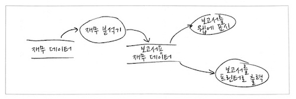
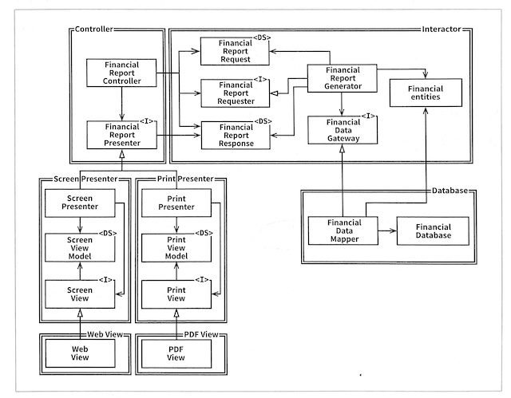

# 8장 OCP: 개방-폐쇄 원칙

> 소프트웨어 개체<sup>artifact</sup>는 확장에는 열려 있어야 하고, 변경에는 닫혀 있어야 한다.

OCP 얘기가 나오면 개인적으로, 로버트 마틴의 [OCP: The Open-Closed Principle](https://drive.google.com/file/d/0BwhCYaYDn8EgN2M5MTkwM2EtNWFkZC00ZTI3LWFjZTUtNTFhZGZiYmUzODc1/view)에 있는 예제를 가장 먼저 떠올리곤 했음. 참고로, 코드는 아래와 같음.

```java
public class Drawer {
   public void draw(List<Shape> shapes) {
       shapes.forEach(shape -> {
           shape.draw();
       });
   }
}

public interface Shape {
   void draw();
}

public class Circle implements Shape {
   public void draw() {
       System.out.print("circle-draw");
   }
}

public class Rectangle implements Shape {
   public void draw() {
       System.out.print("rectangle-draw");
   }
}
````

그런데, 이번 책에 나온 예제가 더 좋다고 생각됨. 게다가 아키텍처 컴포넌트 수준도 함께 다루고 있어 더 의미있게 다가옴.

일단, 아래 그림은 SRP를 적용해 만들어진 결과물. 이렇게 하면 보고서 생성이 두 개의 책임으로 분리되고, 한 쪽 보고서의 변경이 나머지 한 쪽으로 전파되지 않음.



> 서로 다른 목적으로 변경되는 요소를 적절하게 분리하고(SRP), 이들 요소 사이의 의존성을 체계화함으로써(DIP) 변경량을 최소화할 수 있다.

분리를 했다면, 이제 의존성도 조직화해야 함. 클래스 단위에서 나아가 컴포넌트 단위의 고민도 필요. 아래 그림은 그 결과물.



위 그림에서 특징적인 부분 몇 가지 기록.

- 클래스 간의 의존성은 단방향.
- 컴포넌트(위 그림에서 이중선으로 구분됨) 간의 의존성도 단방향.
- 이로 인해, `Presenter`의 변경으로부터 `Controller`가, `View`의 변경으로부터 `Presenter`가 보호됨.
- 무엇보다 `Interactor`는 다른 모든 곳의 변경으로부터 보호됨. 상위 수준의 업무 규칙, 정책이 보호되는 것.
- `FinancialDataGateway`는 의존성 역전의 결과물.
- `FinancialReportRequester`는 `Interactor` 내부를 너무 많이 알지 않게 하기 위함. 여기서는 추이 의존성(transitive dependency) 방지. 개인적으로, 실효성에 대해서는 의문.
