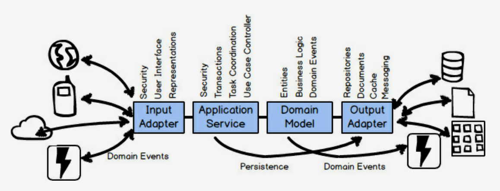

# Domain-Driven Design Distilled

> 원서로 다시 읽고 다시 기록.

# Strategic Design with Bounded Contexts and the Ubiquitous Language

## Challenge and Unify

확장을 거듭하며 통제를 벗어난, 앞서 소개된 모델을 바꿔보는 시도. 가장 먼저, Ubiquitous Language를 사용. 기존 용어들을 스크럼에서 실제 사용되는 용어들로 바꿈.

- `Tenant` -> `Team`
- `User`, `Permission` -> `ProductOwner`, `TeamMember`

그리고 나서, 스크럼 프로젝트 관리와 관련성이 적은 것들을 컨텍스트에서 분리해 냄. `SupportPlans`, `Payments`, `ResourceManager`, `TimeConsumingResource` 들이 그 대상. 반대로, 누락되어 있던 개념인 `Volunteer`를 컨텍스트에 추가. 한편, `Discussions`을 핵심 모델에 추가하긴 했지만, Collaboration 컨텍스트에서  구현될 예정이며, 이 컨텍스트와의 연동을 통해 지원될 예정.

## Developing a Ubiquitous Language

Ubiquitous Language를 만들어내는 재료로 시나리오를 사용. 여기서의 시나리오란, 도메인 모델이 어떻게 동작해야 하는지에 관한 것. 예를 들면 아래와 같음. (참고로, 저자는 개발자들이 너무 명사에 주목하는 현상을 비판하고 있음)

> Allow each backlog item to be committed to a spring. The backlog item may be committed only if it is already scheduled for release. If it is already committed to a different spring, it must be uncommitted first. When the commit completes, notify interested parties.

시작점으로 괜찮으나 who를 추가하는 것이 좋음. 모델에 대한 이해가 깊어지고, 시나리오는 아래와 같이 좀 더 구체적이 될 것. 덕분에, 정족수 팀 멤버의 승인이 필요함이 발견됨. 전체 문장은 아래와 같음.

> The product owner commits a backlog item to a sprint. The backlog item may be committed only if it is already scheduled for release, and if a quorum of team members have approved commitment. If it is already committed to a different sprint, it must be uncommitted first. When the commitment completes, notify the sprint from which it was uncommitted and the sprint to which it is now committed.

### Putting Scenarios to Work

위에서 소개된 시나리오를 실행 가능한 명세로 바꾸는 것에 대해 이야기. 일종의 인수테스트. Specification by Example이나 Behavior-Driven Development 같은 것들이 한 예. 물론, 단위 테스트로 이를 만족시킬 수도 있음. 상대적으로 가독성이 떨어지므로 개발자의 도움이 더 필요할 뿐.

몇 줄만 써 보면 아래와 같음.

```
Scenario:
  The product owner commits a backlog item to a sprint
    Given a backlog item that is scheduled for release
    And the product owner of the backlog item
    And ...
    When ...
    Then ...
```

### What about the Long Haul?

유지보수 모드로 돌입한다고 해서 UL(너무 길어서 이제부터는 Ubiquitous Language를 줄여서 기록)의 지원이 필요 없거나 하는 것은 아님. 오히려, UL은 지속적으로 발전(꽤나 오랫동안). 따라서, 지속적인 노력이 필요. 그렇지 않다면 차별화가 필요한 핵심 도메인이 정말 맞는지를 반문.

## Architecture

BC(마찬가지로 Bounded Context가 너무 길어서 이제부터는 줄여서 기록) 안에는 무엇이 있나? Ports and Adapters 아키텍처 다이어그램에서 보듯, 도메인 모델 이상의 것들로 이뤄져 있음.


- Input Adapter: REST 엔드포인트, 메시지 리스너
- Application Services: 유스 케이스 오케스트레이션, 트랜잭션 관리
- Domain Model (참고로, 이곳은 Technology-Free 구역!)
- Output Adapters: 영속성 관리나 메시지 센더



# Strategic Design with Subdomains

- DDD 프로젝트를 하면 여러 개의 BC가 있기 마련.
- BC 중 하나는 핵심 도메인이 될 것이고,
- 나머지 BC들에는 여러 서브 도메인이 있을 것.
- 책에서는 BC와 서브 도메인이 1:1로 대응되는 것을 이상적으로 간주.

## What is a Subdomain?

먼저, IDDD 책에 나오는 아래 문장을 먼저 보는 게 더 도움이 될 것.

> the subdomains live in the problem space and the bounded contexts in the solution space

- 간단히 말하면, 서브 도메인은 사업 전체 도메인의 부분.
- 대부분의 비즈니스 도메인은 크기가 크고 복잡하기 때문에,
- 서브 도메인 하나씩 나누어 살피는 것이 이해하는 데 도움이 됨.

> Subdomains can be used to logically break up your whole business domain so that you can understand your problem space on a large, complext project.

- 한편, 서브 도메인은 전문 영역이기도 함.
- 이는 서브 도메인에 한 명 이상의 도메인 전문가가 있음을 암시함.

참고로, BC와 서브 도메인의 차이를 이해하는 데에는 아래의 글이 도움이 되었음.

http://gorodinski.com/blog/2013/04/29/sub-domains-and-bounded-contexts-in-domain-driven-design-ddd/

## Types of Subdomains

**Core Domain**

- 사업의 차별화와 경쟁력을 가져오는 도메인.
- 모든 분야에서 잘 할 수 없기 때문에, 이런 경쟁력을 가져오는 핵심 도메인이 있기 마련.
- 전략적 투자와 잘 정제된 도메인 모델이 필요한 곳이며,
- 명확한 BC 경계와 함께 UL을 잘 만들어가야 하는 부분.

**Supporting Subdomain**

- 핵심 도메인은 아니지만, 성공적인 핵심 도메인을 지원하기 위해 필요한 영역.
- 기성 솔루션이 존재하지 않으므로, 직접 만들거나,
- 핵심 도메인에 집중하기 위해, 아웃소싱을 할 수도.

**Generic Subdomain**

- 집중하고 싶은 서브도메인이 아니면서,
- 기성 솔루션이 존재하는 영역.

## Dealing with Complexity

- 소프트웨어를 구매했거나, 레거시 시스템의 경우, 경계가 그어져 있지 않은(unbounded) 경우들이 존재.
- 하지만, 내부에 논리적으로 구분된 도메인 모델들은 존재할 것.
- 이들을 서브 도메인으로 생각하면 도움이 됨.
- 예컨대, 규모 있는 시스템의 복잡성을 쪼개서 다룰 수 있게 함(서브 도메인이므로 특히 문제 영역을 말이다).
- 어느 도메인에 집중해야 하는지도 알려줌.
- 도메인 간의 관계와 의존성을 이해하는 데도 도움.
- 만약, 어떤 이유로 BC와 서브 도메인을 분리할 수 없다면,
- 모듈(DDD에서의 모듈은 Java나 Scala에서의 패키지를 가리킴)을 통해 구분하자.

# Strategic Design with Contet Mapping

- BC 간의 통합(integrate)을 가리켜 Context Mapping(앞으로 CM으로 줄여서 기록) 이라고 함.
- 서로 다른 BC에는 서로 다른 UL이 존재하므로, BC 간의 연결에는 번역이 필요.
- 한편, 번역은 비용이 많이 들어가는 일.
- 명확한 경계와 계약은 변화를 잘 지원할 것.

## Kinds of Mappings

- Partnership
- Shared Kernel
- Customer-Supplier
- Conformist
- Anticorruption Layer
- Open Host Service
- Published Language
- Separate Ways
- Big Ball of Mud

### Partnership

- 서로의 성공과 실패가 서로에게 의존된 상황.
- 강하게 의존된 만큼 자주 만나서 계획을 동기화하고 지속적 통합을 진행.
- 오랫동안 지속되기 어려운 만큼, 비용이 더 크다고 느낄 땐, 다시 관계를 맺는 것이 좋음.

### Shared Kernel

- 작고 공통된 모델을 '공유'
- 한 팀에서 코드를 작성/빌드/테스트 한 뒤, 다른 팀에게 공유할 수도.
- 공유하는 모델에 대해, 열려 있는 커뮤니케이션과 지속적 동의가 필요하므로, 유지하기가 어려울 수 있음.
- 하지만 Separate Ways보다 낫다고 판단될 때도.

### Customer-Supplier

- Customer: 업스트림
- Supplier: 다운스트림.
- Supplier가 Customer가 필요로 하는 것을 제공.
- 하지만 결국 Supplier가 무엇을 언제 제공할지 결정하는 구조.
- 매우 일반적이고 실용적인 관계. 같은 조직 내에서도 있을 수 있는.

### Conformist

- 업스트림, 다운스트림 모두 존재하지만,
- 업스트림이 다운스트림에 대한 특정 요구를 지원할 동기가 없고,
- 다운스트림은 매번 UL을 번역할 노력을 감수할 수 없어,
- 업스트림의 UL을 그대로 따라야 하는 경우임.
- Amazon.com의 모델을 셀러들이 따라는 경우가 그 예.

### Anticorruption Layer

- 가장 방어적인 CM 관계.
- 다운스트림 팀이 번역 레이어를 만듦.
- 가능한 이 계층을 만들기를 권장.
- 모델을 필요에 맞게 생성하고, 외부로부터의 독립성을 유지하기 위함.
- 하지만 비용이 드는 일.

### Open Host Service

- 자신의 BC에 대해 접근할 수 있도록 프로토콜이나 인터페이스를 만들어 서비스로 제공.
- 이 프로토콜은 "열려"있음. 언제든 사용해서 BC와의 통합을 꾀할 수 있음.
- 잘 작성된 문서와 함께 API로 제공.

### Published Language

- 잘 문서화된 정보 교환 언어.
- 여러 BC들이 쉽게 소비하고 번역하도록 도움.
- Open Host Service에서 이런 Published Language를 주로 사용.

### Separte Ways

- 통합이 이뤄지지 않음.
- 각자의 해결책들을 만들어 사용.

### Big Ball of Mud

- 계속 언급되는 내용.
- 이로 인한 문제로 3가지 언급.
- 부적절한 연결과 의존성으로 인한, 교차 오염(cross-contamination)된 애그리거트의 증가.
- 일부의 변경이 여러 곳으로 전파되어 발생하는 "whack-a-mole(한 곳을 고치면 다른 곳에서 문제가 생기는)" 이슈.
- 드러나지 않은 지식이나 일부 영웅(모든 언어를 한 번에 하는)만이 완전한 붕괴로부터 시스템을 구함.

## Making Good Use of Context Mapping

- 어떤 인터페이스로 BC 통합을 할지는 팀에 따라 다름.
- RPC, SOAP, REST, 메시징.
- 다만, 데이터베이스나 파일 시스템을 통한 통합은 피할 것.
- RPC, REST, 메시징을 하나씩 살펴볼 것.
- 이는 강건함(robust)의 정도가 높아지는 순서.

### RPC with SOAP

- 사용하기 쉬움. 로컬 메서드나 프로시저를 호출하는 것 처럼.
- 그러나, 강건함<sup>robustness</sup>이 부족. 네트워크가 실패한다면?
- Published Language와 함께 Open Host Service가 제공된다면 관심 있게 고려해 볼 수 있는 대상.
- 물론 Anticorruption Layer를 두는 것도 가능.

### RESTful HTTP

- BC 간에 주고 받는 리소스에 집중.
- POST, GET, PUT, DELETE를 활용해 좋은 API를 설계.
- 마찬가지로, PL, OHS, ACL을 함께 사용.
- RPC와 같이, 네트워크나 서비스 제공자의 장애 등으로 문제가 발생할 수 있으나, 이를 극복할 수 있는 메커니즘들이 있음.
- 강건함(신뢰성, 확장성 등)에서 유리.
- 한편, ACL에 대해 충분히 풀어서 설명하는 부분이 있어 그대로 기록.

> A common mistake made when using REST is to design resources that directly reflect the Aggregates in the domain model. Doing this forces every client into a Conformist relationship, where if the model changes shpae the resources will also. So you don't wnat to do that. Instead, resources should be designed synthetically to follow client-driven use cases. By "synthetic" I mean that to the client the resources provided must have the shape and composition of what they need, not what the actual domain model looks like. Sometimes the model will look just like what the client needs. But what the client needs is what drives the design of the resources, and not the model's current composition.

### Messaging

- 가장 강건함.
- 시간적 결합을 낮추기 때문.
- 메시지 교환에 대한 지연을 이미 감수. 즉각 결과를 기대하지 X
- 물론 REST 기반의 폴링을 통해 비동기 메시징을 구현할 수는 있음.
- Train Wreks라는 용어도 소개하고 있음. A -> B -> C 요청이 모두 블럭킹으로 처리.
- 일반적으로는 BC의 애그리거트가 도메인 이벤트를 발행.
- 다수의 관심 있는 곳에서 이를 소비.
- 이벤트의 타입이나 값을 보고 특정 행위를 취할지 여부를 결정.
- 이벤트가 발행하는 곳의 의해 만들어지는 것이긴 하지만,
- 때로는 이벤트를 발행하는 곳에 커맨드 메시지를 명시적으로 보내기도 함.
- 이 경우에도 클라이언트 BC는 결과를 도메인 이벤트로 받게 됨.
- 메시징 메커니즘에는 반드시 At-Least-Once Delivery가 보장 되어야 함.
- 이는 구독 BC가 Idempotent Receiver로 구현되어 있음을 의미하기도.
- 한편, 요청을 하고 응답을 받기까지 어느 정도 지연이 있기 마련임을 전제. (Eventual Consistency)

## An Example in Context Mapping

- 2장에서 얘기한 `Policy` 타입으로 예를 들고 있음.
- Underwriting, Claims, Inspection BC에서 모두 `Policy`가 존재.
- 이 중에서 어디에 주 소속이 되는지는 회사의 상황(부서 구조 등)마다 다르지만,
- 여기서는 일단 Underwriting에 속한다고 전제.
- 일단, Underwriting BC에서 `Policy`가 발급(issue).
- `PolicyIssued`라는 도메인 이벤트를 발행(publish).
- 여기에는 `Policy`에 대한 식별자가 담김. 바로 `issuedPolicyId`.
- 이벤트를 구독하는 곳에서는 추적을 위해 이 식별자를 유지.
- 추가 정보가 필요하면 이 식별자를 사용해서 추가 질의를 던질 수도.
- 이 때의 질의는 RESTful Open Host Service와 Published Language를 통해 이뤄짐.
- `issuedPolicyId`로 `IssuedPolicyData`를 얻어 오는 HTTP GET 요청을 던짐.

# Tactical Design with Aggregates

지금까지 BC(Bounded Context), SD(Subdomain), CM(Context Mapping)에 대해서 알아 봤음. 이는 전략적<sup>strategic</sup> 설계. 그렇다면 BC 안은 어떨까?

## Why Used

Aggregate가 뭔지, `Product`, `BacklogItem`, `Release`, `Sprint`는 어떻게 모델링 하는지 살펴 볼 예정. 먼저, Aggregate에 대한 설명들.

- 각 Aggregate는 1개 이상의 Entity로 구성.
- 이 중에서 특정 Entity가 Aggregate Root로 불림.
- 이 Root Entity가 나머지들을 소유함.
- Root Entity 이름 = Aggregate의 개념적 이름
- 물론, Aggregate는 Value Object를 가지기도.
- 각 Aggregate는 트랜잭션의 일관성<sup>consistency</sup> 경계를 형성해야 함.
- Aggregate 안에서는 모든 부분이 사업 규칙에 따라 일관성을 유지해야 한다는 의미.
- 참고로, 여기서의 트랜잭션의 의미는 아래와 같음.

> Either way, what I mean by "transaction" is how modifications to an Aggregate are isolated and how business invariants - the rules to which the software must always adhere - are guaranteed to be consistent following each business operation.

- 아래와 같은 말도 있는데 이는 좀 더 생각해 볼 일.

> only one of the two should be committed in a single transaction.

참고로, Entity와 Value Object를 설명하는 글이 있어 비교 형식으로 간단히 기록.

- Entity는 고유 식별성을 가짐.
- "models an individual thing"
- 같은 타입이든 아니든, 다른 엔티티와의 구분이 가능.
- 대부분 mutable(제약은 아님).
- 한편, Value Object는 immutable.
- 고유 식별성을 가지지 않음.
- 현재 어떤 값들을 가지고 있는가로 동등성이 결정됨.
- "models an immutable conceptual whole"
- Entity를 묘사, 수량화, 측정하는 데 사용됨.
