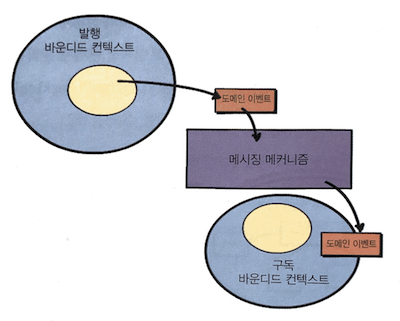

# 책 소개

- [도메인 주도 설계 핵심<sup>Domain-Driven Design Distilled</sup>](http://acornpub.co.kr/book/domain-driven-design-distilled)
- 반 버논<sup>Vaughn Vernon</sup>
- 이전 책에 비해 핵심 내용만을 간추려 설명. 전술적 설계에 초점을 두고 있음.

# 나에게 도메인 주도 설계는

> 여러분이 만든 소프트웨어를 이용해 비즈니스가 새로운 차원에서 경쟁하게 만들고 싶을 것이다.

비즈니스가 계속 변화하고 커질 수 있도록 돕고 싶은 것이 목표. DDD는 이를 위한 하나의 수단. DDD 그 자체가 목적이 아님. 그리고 개인적으로 많은 도움을 받음. 적어도 아직까지는 좋은 도구라 생각. 물론, 개인의 역량과 더불어 환경 또한 중요한 기반 요소.

# 바운디드 컨텍스트 및 보편언어와 전략적 설계

바운디드 컨텍스트에 대해서 여러 설명을 하지만, 개인적으로는 [Confused abount Boundex Contexts and Sub Domains, Stack Overflow](https://stackoverflow.com/questions/18625576/confused-about-bounded-contexts-and-subdomains)의 아래 내용이 와닿음. 바로 "*보편 언어가 일관성을 유지하는 경계*".

> In general a bounded context is a boundary within which the ubiquitous language is consistent.

책에서 언급되는 내용들. (바운디드 컨텍스트를 *BC*라고 줄여서 기록함)

1. 의미적으로 동일한 컨텍스트의 범위를 표현.
2. 이 안에 존재하는 컴포넌트들은 *BC*에 특화되고, *BC* 안에서 의미가 살아남.
3. 모델이 구현되는 곳. *BC*마다 각각 분리된 산출물이 나옴.
4. *BC* 안에서 일하는 팀이 모델을 생성. 이 때 팀 구성원이 사용하는 언어가 반영됨. 보편 언어라 불림. 클래스가 될 수도.
5. 이렇게 분리된 *BC*는 핵심 도메인 여부인지가 구분됨. 중요한 것과 그렇지 않은 것을 판단하는 주요 기준이 됨.
6. *BC*는 마치 언어의 경계와 유사. 특정 국가에서의 공용어가 경계를 넘어가면 바뀌고 번역이 필요한 것과 같음.
7. *BC*는 단일 팀에만 할당. 한 팀이 다수의 *BC*를 수행할 수도. 반대는 X.
8. 독립적인 소스 코드 리파지토리가 존재. 코드와 데이터베이스 스키마도 분리.
9. 이런 구분이 없다면 모델 내의 언어는 모호해짐. 혼란은 물론 확장, 테스트 등의 어려움이 따름.
10. 반대로 말하면, 각 사업 기능이 같은 단어에 대해 서로 다른 정의를 가질 수 있는 경우 *BC*가 필요할 수 있음.

# 컨텍스트 매핑과 전략적 설계

## 정의

- 서로 다른 BC의 **통합**.
- 서로 다른 BC에 존재하는 각 보편언어 사이의 **통역**.
- 또한, 각 언어를 사용하는 팀간의 **관계**이기도.

### 종류

- **Partnership**: Each team is responsible for one *BC*.
- **Shared Kernel**
  - Intersection of the two *BC*.
  - A small but common model share.
  - 한 팀에서 코드를 유지, 테스트, 빌드하는 것도 가능.
- **Customer-Supplier**
  - Supplier-Upstream. Customer-Downstream.
  - 소비자가 필요한 것을 요청하고, 제공자가 언제 무엇을 제공할지 결정.
  - Typical and practical relationship.
- **Conformist**
  - Upstream team has no motivation to support the specific needs of the downstream team.
  - 제휴 판매자가 아마존의 모델을 따르는 것이 한 예.
- **Anticorruption Layer**
  - Downstream에서 Upstream의 보편 언어를 번역하는 계층을 생성.
  - 가능한 이 계층을 생성하기를 저자는 권장함.
  - 필요에 맞는 모델 생성하고 외부 개념으로부터 독립성을 유지할 수 있기 때문.
  - 한편, 비용이 높아질 수 있음.
- **Open Host Service**
  - BC에 접근할 수 있도록 공개된 프로토콜 또는 인터페이스를 제공. 
  - 왜 갑자기 논리적인 관계를 이야기하다가, 기술적인 관계를 이야기하는지는 의문.
- **Published Language**: Open Host Service에서 주고 받는 데이터를 가리키는 것으로 보임.
- **Seperate Ways**: 통합이 이뤄지지 않고 각자 해결.
- **Big Ball of Mud**: 이런 통합이 필요 없는 모든 것이 한 곳에 있는 것을 이야기 함. 문제점 강조를 목적으로 함께 언급됨.

현실 세계에서는 Big Ball of Mud가 그 크기에 상관 없이 존재할 가능성이 높고, 이 경우에 대한 접근으로 다음을 이야기.

> If you must integrate with one or more, try to create an *Anticorruption Layer*against each legacy system in order to protect your own model from the cruft that would otherwise pollute your model with the incomprehensible morass. Whatever you do, *don’t speak that language!*

## 방법과 사례

매핑의 기술적 측면으로 RPC, HTTP, 이벤트 메시지를 소개함. 사례도 함께 다룸. 특별한 내용 아님. 기록 생략.

# 애그리게잇과 전술적 설계

## 왜 필요할까

설명이 잘 되어 있지는 않다고 생각함. 차라리 <에릭 에반스, 도메인 주도 설계>에 나온 아래 내용이 도움이 됨.

> 먼저 우리는 모델 내의 참조에 대한 캡슐화를 추상화할 필요가 있다. AGGREGATE는 우리가 데이터 변경의 단위로 다루는 연관 객체의 묶음을 말한다. 각 AGGREGATE에는 루트<sup>ROOT</sup>와 경계<sup>BOUNDARY</sup>가 있다. 경계는 AGGREGATE에 무엇이 포함되고 포함되지 않는지를 정의한다. 루트는 단 하나만 존재하며, AGGREGATE에 포함된 특정 ENTITY를 가리킨다. 경계 안의 객체는 서로 참조할 수 있지만, 경계 바깥의 객체는 해당 AGGREGATE의 구성요소 가운데 루트만 참조할 수 있다. 루트 이외의 ENTITY는 지역 식별성<sup>LOCAL IDENTITY</sup>을 지니며, 지역 식별성은 AGGREGATE 내에서만 구분되면 된다. 이는 해당 AGGREGATE의 경계 밖에 위치한 객체는 루트 ENTITY의 컨텍스트 말고는 AGGREGATE의 내부를 볼 수 없기 때문이다.

그래도 책에 나온 내용들을 정리해보면 다음과 같음.

- 애그리게잇은 트랜잭션의 일관성을 만드는 경계.
- 즉, 트랜잭션 커밋 시, 애그리게잇 내의 모든 구성 요소는 불변식이 보장됨. (불변식은 에릭 에반스 책에서 언급된 내용)
- 불변식이란, 데이터가 변경될 때 마다 유지되야 하는 일관성 규칙.

하지만, 과연 일관성 유지 단위가 트랜잭션이어야 할까? 트랜잭션 커밋 시점에 유지되야 하는 일관성을 부정하는 것은 아님. 그러나 트랜잭션 안에서 데이터가 변경될 때에도 일관성이 유지되야 하는 것 아닐까?

## 애그리게잇 경험 법칙

저자가 말하는 애그리게잇 설계의 4가지 기본 규칙

**애그리게잇 경계 내에서 비즈니스 불변사항들을 보호.**

- 애그리게잇 설계의 배경이기도 함. 목적과 수단이 역전된 경우가 아닌 한 걱정은 X.
- 여기서의 비즈니스 불변사항들이란, 예를 들어 아래와 같음.

> "모든 `Task` 인스턴스의 `hoursRemaining`이 0일 때, `BacklogItem`의 `status`는 반드시 `DONE`으로 설정해야 한다."


**작은 애그리게잇을 설계.**

- 애그리게잇 단위가 크다는 것은 트랜잭션 단위가 크다는 것.
- 트랜잭션 단위가 클수록 실패의 가능성도 높아짐.
- 동시성, 성능, 메모리, GC, 테스트의 어려움 등 실패의 이유는 다양.
- SRP도 함께 언급. 인지 과부하를 넘어, 변경에 유연하기 위함.

**오직 ID를 통해 다른 애그리게잇을 참고.**

- 애그리게잇을 작게 유지하기 위한 하나의 수단이자,
- 단일 트랜잭션 내에 다수의 애그리게잇이 수정될 가능성을 낮춰줌. 일관성을 지키기 위한 노력.
- 저장 메커니즘의 기술적 선택도 자유로워짐. 하지만 단지 부수효과.

**결과적 일관성을 사용해 다른 애그리게잇을 갱신.**

- 애그리게잇 간의 연관관계가 얼마든지 있을 수 있음.
- 작은 애그리게잇과 ID를 통한 타 애그리게잇 참고를 준수하기 위한 하나의 수단이기도.
- 아래 그림처럼, 도메인 이벤트와 메시징 메커니즘이 활용됨.



## 애그리게잇 모델링

비즈니스가 당장 요구하는, 혹은 비즈니스 전문가의 멘탈 모델에 따라 보편언어를 모델링하지 않고, 지나친 추상화를 추구할 때의 문제점.

다른 내용은 생략하고, 애그리게잇 경계를 결정해 나가는 단계를 제시하는 부분이 흥미로웠음.

1. 오직 1개의 엔티티만을 갖는 애그리게잇을 생성. 2개의 엔티티 두는 것은 일단 생각 X.
2. 1개의 엔티티가 갱신될 때, 함께 갱신되야 하는 것들이 무엇인지 도메인 전문가를 통해 확인.
3. 함께 갱신되야 하는 것들의 타이밍을 확인. 즉시인가, 아니면 N초/분/시간/일 정도가 허용되는가.
4. 즉시 처리되야 하는 것들은 애그리게잇으로 통합하는 것을 긍정적으로 검토.
5. 어느 정도의 시간이 허용 되는 것들은 결과적 일관성을 활용.

참고로, 애그리게잇 경계 설정의 기준에 대해서는 역시나 <에릭 에반스, 도메인 주도 설계>에 잘 설명되어 있음. 아래는 개인적으로 정리한 내용 중 도움되는 부분.

> "일단 자동차는 전역 식별성을 가지는 ENTITY이다. 자동차를 세상의 다른 모든 자동차와 구별하고 싶기 때문이다. 이를 위해 차량식별번호를 활용할 수 있다. 조금 더 나아가서 자동차 타이어의 마모 정도, 사용기간, 주행거리 등을 알고 싶을 수도 있다. 이 경우 자동차의 어느 타이어를 대상으로 정보를 조회할 것인지 결정해야 하므로 즉, 타이어는 식별성을 가지는 대상이므로 타이어 또한 ENTITY가 될 수 있다. 하지만 자동차와 타이어는 조금 다르다. 자동차 외부의 컨텍스트에서는 일반적으로 타이어가 관심의 대상이 아니다. 예를 들어, 타이어가 낡아서 재활용 센터에 보낸다고 하면, 이제 더 이상 그 타이어는 관심의 대상이 아니다. 자동차 컨텍스트 안에서만 의미가 있는 것이다. 물론 재활용 센터 컨텍스트에서는 타이어가 다른 타이어들과 식별성을 가지는 대상이 되겠지만 말이다. 특정 타이어가 어느 자동차에 부착되어 있는지를 찾는다기 보다, 자동차를 먼저 조회한 후 부착된 타이어를 일시적으로 참조할 것이다. 이 차이가 바로 AGGREGATE의 ROOT인지 아닌지를 결정한다. 한편, 엔진부에는 몸체에 일련번호가 새겨져 있으며, 때때로 그 일련번호를 통해 차량과는 무관하게 추적되기도 한다. 이로 인해 그림 상에서와 같이 엔진이 자체적인 AGGREGATE가 되는 것이다."

# 도메인 이벤트와 전술적 설계

## 도메인 이벤트

- 바운디드 컨텍스트 내의 비즈니스 관점에서 중요한 사항들에 대한 기록
- 전략적 설계를 위한 중요한 도구

## 인과관계 일관성

아래는 오퍼레이션의 인과관계를 나타냄.

1. 수가 `내 지갑을 잃어버렸어!`라는 메시지를 보낸다.
2. 개리가 그 메시지에 `큰일났네!`라고 답한다.
3. 수가 `걱정마, 지갑을 찾았어!`라고 메시지를 보낸다.
4. 개리가 `잘됐다!`라고 답장을 보낸다.

분산된 시스템에서 이벤트를 사용할 경우, 오퍼레이션이 전달되는 순서는 보장되지 않을 수 있음. 이 때, 인과관계를 보장하지 못하면, `내 지갑을 잃어버렸어!`라는 메시지에 `잘됐다!`라는 답장이 전달될 수 있음.

## 도메인 이벤트 설계

### 네이밍

도메인 모델의 보편언어를 반영. 모델 안에서 발생하는 사건과 모델 밖을 이어주는 다리. 원활한 의사소통에 도움.

아래는 예시.

- `ProductCreated`
- `ReleaseScheduled`
- `SprintScheduled`
- `BacklogItemPlanned`
- `BacklogItemCommitted`

### 속성

`OccurredOn`을 기본적으로 포함하길 권장함. 유용하게 쓰이는 상황이 자주 있음.

```c#
public interface DomainEvent
{
  public Date OccurredOn
  {
    get;
  }
}
```

명령이 제공하는 모든 프로퍼티를 담고 있어야 함.

- 이벤트 구독자들에게 모델 안에서 무슨 일이 벌어졌는지를 온전히 알릴 수 있음.
- 예컨대, `CreateProduct`라는 커맨드에 `tenantId`, `productId`, `name`, `description`이 있었다면,
- `ProductCreated`라는 이벤트에도 이 속성들이 담김.

도메인 이벤트에 풍부한 추가 데이터를 담을 수 있음.

- 구독자가 추가 데이터를 얻기 위해 쿼리를 다시 날리지 않아도 됨.
- 그러나 의미를 잃을 정도로 너무 많은 데이터를 담지는 않아야 함.
- 또한, `BacklogItemUpdated`에 `BacklogItem`의 전체 상태를 보낼 경우,
- 어떤 변경이 있었는지 알기 위해 이전의 `BacklogItemUpdated`와 비교해야 하는 부담이 있을 수도 있음.

### 영속

아래 내용을 읽고 잠시 의문이 생겼으나,

> 어느 쪽이든, 도메인 이벤트를 이벤트 리파지토리에 유지하는 것은 도메인 모델 간에 발생한 것에 대한 인과관계의 순서를 지속시켜준다.

뒤이어 바로 잡아줌.

> 다만, 도메인 이벤트를 인과관계의 순서에 따라 저장하는 것이 같은 요청 내에 분산돼 있는 다른 노드들에 도달할 것을 보장하는 것은 아니다. 이에 따른 적절한 인과관계를 파악하는 것 또한 이를 소비하는 바운디드 컨텍스트가 가져야 할 책임이다.

### 발생자

누가 이벤트를 발생시키는가?

- 보통은 사용자 인터페이스에 의해 발현되는 사용자 기반 명령.
- 때로는 시간 만료와 같은 이벤트. 이 때는 이벤트를 발생시키는 명령이 존재하지 않음.

