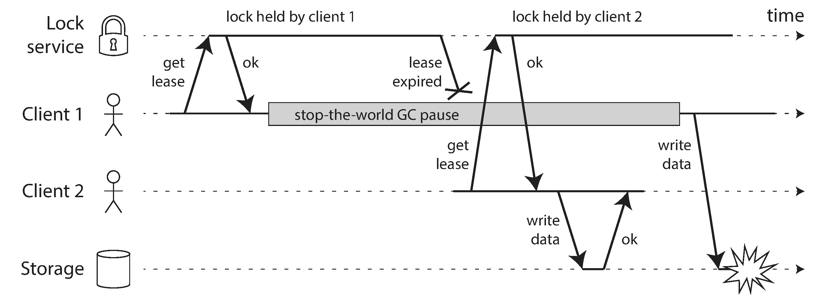
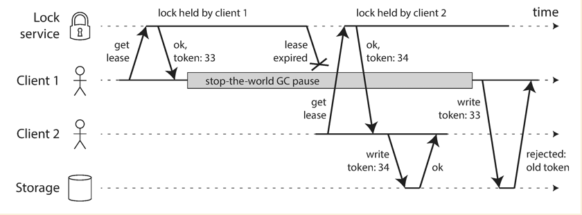
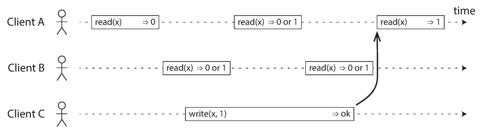
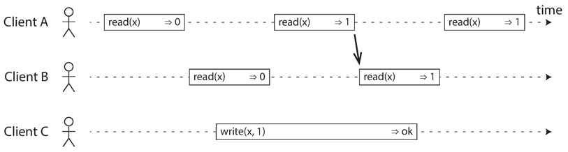
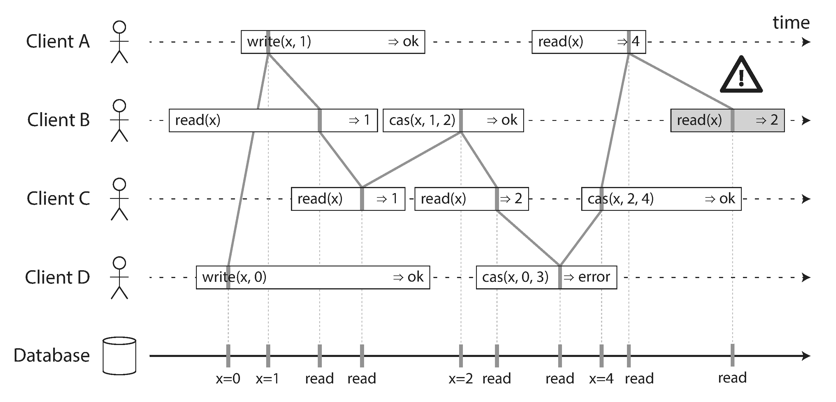
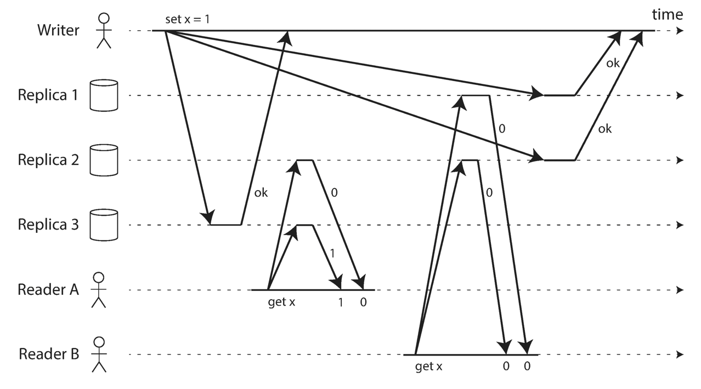

# Part II. Distributed Data

Part I 이 데이터가 단일 노드에 저장될 때의 관점이라면, Part II는 여러 머신에서 일어나는 저장과 조회에 관한 것. 여러 머신에 데이터를 분산하려는 이유는 여러 가지가 있음.

- Scalability: 데이터 볼륨, 읽기 부하, 쓰기 부하가 커지면 하나의 머신으로는 다루기 어려움.
- Fault tolerance/high availabilty: 한 개의 장비가 고장나더라도 작업을 계속할 수 있는 가용성.
- Latency: 사용자가 전세계에 걸쳐 있다면, 지역적으로 가까운 데이터센터들을 제공할 수 있음.

## Scaling to Higher Load

### Shared-memory Architecture

- 더 많은 부하를 다루는 가장 쉬운 방법은 좀 더 강한 머신을 사는 것.
- 많은 CPU, RAM 칩, 디스크들은 하나의 OS에 묶일 수 있고,
- 서로 연결<sup>interconnect</sup>되어 CPU가 접근하게 할 수 있음.
- 문제점은 비용이 많이 증가한다는 것.
- 또한, 장애 내성이 높지 않다.

### Shared-disk Architecture

- 여러 머신들 사이에서 공유되는 디스크 배열에 데이터를 저장하는 것.
- 이들 디스크들은 빠른 네트워크로 연결됨.
- 데이터 웨어하우징 작업부하를 위해 사용되지만,
- 경합과 잠금 오버헤드는 확장성을 제한하는 요소가 됨.

### Shared-nothing Architectures

이 책에서는 이 접근법에 초점을 둠. 최선의 선택이어서가 아니라, 어플리케이션 개발자들이 신경써야 하는 것이 가장 많은 접근법이기 때문.

- 수평적 스케일링 또는 스케일링 아웃이라고 불리는 방법.
- DB 소프트웨어를 실행시키는 각 머신 또는 가상 머신은 노드<sup>node</sup>라고 부름.
- 각 노드는 자신의 CPU, RAM, 디스크를 독립적으로 사용.
- 노드 간의 조율은 소프트웨어 레벨에서 이뤄지고, 평범함 네트워크를 사용함.

### Replication Versus Partitioning

데이터가 여러 노드에 분산되는 방식에는 2가지가 존재. 이 둘은 별개의 메커니즘이지만, (당연하게도) 함께 사용될 수 있음.

**Replication**

- 서로 다른 위치에 있는 몇 개의 서로 다른 노드에 동일한 데이터의 복제본을 유지하는 것.
- 이는 redundancy를 제공함. 즉, 한 노드가 가용하지 않더라도, 다른 노드를 통해 데이터를 제공 받을 수 있음.
- 또한, 성능을 높여주기도.

**Partitioning**

- 큰 DB를 파티션이라고 불리는 몇 개의 부분집합으로 나누는 것.
- 이 부분집합은 서로 다른 노드에 할당됨.

# Replication

데이터 레플리케이션이란, 같은 데이터의 복제본을, 네트워크로 연결된 여러 머신에 유지하는 것. 레플리케이션의 이유는 여러 가지가 있음.

- 지역적으로 사용자에게 가까운 데이터를 제공하기 위해서.
- 일부가 고장나더라도 시스템은 계속 동작할 수 있게 하기 위해서.
- 읽기 전용 머신을 제공해서 읽기 성능을 높이기 위해서.

레플리케이션의 어려움은 복제된 데이터의 변경을 다루는 것에 있음. 노드간의 변경을 복제하는, 널리 알려진 3가지 알고리즘은 single-leader, multi-leader, leaderless(대부분의 분산 데이터베이스가 이 중 하나를 사용함).

레플리케이션 시 고려해야 하는 트레이드 오프는 다양함. 예컨대, 동기/비동기 복제, 실패한 레플리카를 어떻게 다룰 것인가 등.

## Leaders and Followers

DB의 복사본을 저장하는 각 노드를 가리켜 레플리카<sup>replica</sup>라고 부름. 여러 레플리카가 있다면, 아래 질문은 필수불가결.

> how do we ensure that all the data ends up on all the replicas?

DB에 대한 모든 쓰기는 모든 레플리카에서도 함께 처리되어야 함. 그렇지 않으면 같은 데이터를 가지고 있을 수 없음. 가장 흔한 해결책은 leader-based replication. 이는 active/passive 또는 master-slave replication이라고도 알려져 있음.


1. 레플리카 중 하나가 리더로 지정됨. 클라이언트의 요청을 이 리더가 받게 됨.
2. 나머지 레플리카는 팔로워(read replicas, slaves, secondaries, hot standbys). 리더가 새로운 데이터를 저장할 때면, 이 변경사항을 레플리케이션 로그<sup>replication log</sup> 또는 변경 스트림<sup>change stream</sup>의 일부로써 모든 팔로워에게 전달함.
3. 읽기는 리더나 팔로워 중 누구에게나 할 수 있음. 하지만 쓰기는 리더에게만 이뤄져야 함.

많은 관계형 DB들이 이 기능을 기본으로 제공함. 또한, Kafka나 RabbitMQ와 같은 분산 메시지 브로커들도 제공. 네트워크 파일시스템이나 복제된 블럭 디바이스들도 이를 제공.

### Synchronous Versus Asynchronous Replication

아래 이미지는 동기 그리고 비동기 레플리케이션을 보여줌. 참고로, [PostgreSQL Replication Master Server Configuration](https://www.postgresql.org/docs/10/static/runtime-config-replication.html#RUNTIME-CONFIG-REPLICATION-MASTER)을 보면, 특정 노드만을 동기적 레플리케이션 대상으로 지정 가능함.


**semi-synchronous**

동기로 할 경우 대부분 빠른 시간(1초 이내)에 레플리케이션이 끝나지만, 얼마나 더 걸릴 수도 있는지는 모르는 일. 예컨대, 팔로워 서버가 고장 나서 몇 분간 회복되고 있을 수도 있음. 그렇다고 모든 노드를 비동기로 하면, 리더 노드가 고장 났을 때, 최신 복제본을 가진 다른 노드가 있음을 보장하지 못함. 따라서, 1개의 팔로워만을 동기로 레플리케이션하는 것이 실용적. 최신 복제본을 가진 노드를 적어도 2개를 유지하면서, 팔로워들의 고장이 리더에게 미치는 영향을 최소화. 이를 가리켜 *semi-synchronous*라고 부름.

많은 리더 기반 레플리케이션이 완전한 비동기로 설정된다고 함. 내구성이 약해지는 문제<sup>weakining durability</sup>에도 불구. 특히, 팔로워가 많거나 지역적으로 분산된 경우에 더더욱.

데이터를 잃지 않으면서도 좋은 성능과 가용성을 보장하는 방법은 계속 연구중이고, chain replication은 그 결과물 중 하나. Microsoft Azure Storage 등에서 사용된다고 함.

### Setting Up New Followers

새로운 팔로워를 셋업해야 할 수 있음. 단순히 데이터를 복사하는 것으로는 충분치 않음. 데이터를 복사하는 중간에 리더 노드에 새로운 변경사항이 생길 수 있기 때문. 잠금을 사용하는 것은 가용성 측면에서 좋은 선택은 아님. 대신, 아래와 같이 해볼 수 있다.

1. 지속적으로 리더 DB의 스냅샷을 생성.
2. 새로운 팔로워 노드로 스냅샷을 복사.
3. 팔로워는 리더에게 특정 스냅샷 이후로 생긴 모든 데이터 변경을 요청. *log sequence number*(PostgreSQL) 또는 *binlog coordinates*(MySQL)라고 불리는 레플리케이션 로그의 정확한 위치를 알고 있어야 함.
4. 모든 변경을 다 따라잡았다면 클러스터로 투입.

위 절차는 DB마다 상당한 차이를 보일 수도 있음.

### Handling Node Outages

개별 노드가 고장나더라도 전체 시스템은 계속 동작하면서, 노드의 고장이 미치는 영향을 최소화하는 방법은 뭘까? 그러니까, 리더 기반 레플리케이션이 높은 가용성을 가지게 하려면 어떻게 해야 하는가?

#### Follower Failure: Catch-Up Recovery

팔로워 노드에 크래시가 일어나거나, 리더로부터의 네트워크가 단절되는 등의 문제가 있을 수 있음. 반영을 실패한 데이터 로그 지점부터 다시 반영을 시작하거나, 데이터 로그가 부족하다면 새로 추가된 데이터 로그를 리더로부터 받아오면 됨.

#### Leader Failure: Failover

페일오버<sup>failover</sup>는 까다로운 일. 보통 아래 절차를 밟음.

1. 리더가 고장났는지 여부를 판단.
   - 완전하게 고장을 파악할 수 있는 방법은 없으나,
   - 일반적으로 타임아웃을 사용.
2. 새로운 리더 선출.
   - 선거<sup>election</sup>(남아 있는 레플리카들에 의해 결정),
   - 또는 임명<sup>appoint</sup>(미리 지정된 컨트롤러 노드에 의해 결정)을 통해 선출됨.
   - 가장 좋은 후보는 가장 최신 데이터를 가진 레플리카.
3. 새로운 리더를 사용하도록 시스템 재설정.
   - 클라이언트는 새로운 리더에게 쓰기 요청을 보내야 함.
   - 만약, 오래된 리더가 다시 돌아오면, 시스템이 이를 팔로워라고 인식시켜 주어야 함.

페일오버는 다음과 같은 문제를 일으킬 수 있음.

- 비동기 레플리케이션이라면, 이전 리더의 데이터가 일부 유실될 수 있음. 가장 흔한 해결책(?)은 이 데이터를 버리는 것. 하지만, 이는 클라이언트의 내구성 기대를 위반.
- DB 데이터가 공유되는 또 다른 시스템이 있다면, 이러한 데이터 버림은 위험할 수 있음. [Github availability this week](https://blog.github.com/2012-09-14-github-availability-this-week/) 사례 참고.
- 두 개의 노드가 모두 스스로를 리더라고 생각하는 문제도 있음. 이렇게 되면 데이터가 유실되거나 충돌되기도 함. 이를 피하는 방법 중의 하나로, 두 개의 리더가 감지되면 하나를 중단시킴(단, 두 개의 노드가 모두 중단되는 위험도 있음).
- 리더가 죽었는지를 판별하는 타임아웃은 얼마가 적정한가? 긴 타임아웃은 복구하는 시간이 길다는 것을 의미. 반면, 너무 짧으면 (순간적인 부하 증가나 네트워크의 일시적 단절 등의 이유로) 불필요한 페일오버를 일으킬 수 있음.

어느 하나 쉬운 해결책이 없으며, 이런 이유로 어떤 운영팀은 수동 페일오버를 선호하기도 함. 노드 실패, 신뢰할 수 없는 네트워크, 레플리카 일관성에 대한 트레이드 오프, 내구성, 가용성, 응답 지연은 모두 분산 시스템이 가진 근본적 문제. 8장과 9장에서 이들을 좀 더 깊이 있게 다룰 예정.

### Implementation of Replication Logs

리더 기반 레플리케이션은 어떻게 동작하는가?

#### Statement-Based Replication

리더가 모든 쓰기 요청(명령문<sup>statement</sup>)을 로깅하고, 이를 팔로워들에게 보냄. 관계형 DB의 경우 `INSERT`, `DELETE` 등의 명령문이 여기에 해당. 가장 합리적인 선택으로 보이지만 아래와 같은 문제들이 발생할 수 있음.

- `NOW()`, `RAND()` 등의 비결정적 함수는 레플리카에서 다른 값을 만들어 냄.
- 명령문이 자동증가 컬럼을 사용하거나, `UPDATE ... WHERE ...`과 같이 존재하는 데이터에 의존하는 경우, 명령문은 레플리카에서 동일한 순서로 실행되어야 함. 이는 복수의 트랜잭션을 동시에 실행시키지 못하게 하는 제약.

이런 문제를 회피할 수 있긴 함. 에를 들어, 비결정적인 함수들의 호출을 고정된 명령문으로 치환해서 로그로 남길 수도 있음. 하지만 이외에도 여러 가지 엣지 케이스<sup>edge case</sup>들이 많아서 다른 방식들이 많이 사용됨. MySQL 5.1 이전 버전에서는 이 방식이 기본으로 사용되었음. 하지만, 현재는 로우 기반 레플리케이션이 기본값. VoltDB는 명령어 기반 레플리케이션을 사용하긴 하지만, 트랜잭션이 결정적이도록 요구.

#### Write-Ahead Log (WAL) Shipping

저장소 엔진은 모든 쓰기를 로그에 덧붙임. 로그 구조화 저장소 엔진은 이 방식이 기본이고, B 트리인 경우에도 이 WAL에 모든 변경이 가장 먼저 기록됨. 이 데이터를 레플리케이션 하는 것. 단점은 매우 저수준의 데이터라는 것. 즉, 레플리케이션이 특정 저장소와 강하게 결합됨. 버전 차이도 이런 문제를 만들 수 있음. 따라서, 다운 타임 없이는 버전 업그레이드가 불가.

#### Logical (Row-Based) Log Replication

한 가지 대안은 레플리케이션과 저장소를 위한 각각의 로그 포맷을 사용하는 것. 이를 가리켜 *logical log*라고 부름. 저장소 엔진의 물리적 데이터 표현과 구분하기 위함. 이 논리적 로그는 DB 테이블에 대한 쓰기를 표현하는 순차적 레코드.

- 삽입된 로우 − 모든 컬럼들에 대한 새로운 값을 로그가 포함함.
- 삭제된 로우 − 로우를 충분히 식별할 수 있을 정도의 정보를 가짐.
- 갱신된 로우 − 로우를 충분히 식별할 수 있을 정도의 정보와 모든 컬럼에 대한 새로운 값을 포함.

여러 행을 수정하는 트랜잭션은 이런 로그 레코드들을 여러 개 생성. 그리고 트랜잭션이 커밋되었음을 가리키는 레코드를 뒤이어 남김. [MySQL의 *binlog*](https://dev.mysql.com/doc/internals/en/binary-log-overview.html)는 이 접근법을 사용함.

저장소 엔진 내부와의 결합도가 낮기 때문에, 버전 차이는 물론이거니와 서로 다른 저장소 엔진 간에도 호환이 가능. 외부 애플리케이션이 파싱하는 것도 쉽다. 오프라인 분석을 위해 데이터 웨어하우스 같은 외부 시스템에 데이터를 보낼 때 유리. 종종 이를 가리켜 *change data capture*라고 부름.

#### Trigger-Based Replication

지금까지 살펴본 방식보다도 더 높은 유연성이 요구된다면, 애플리케이션 코드가 레플리케이션의 역할을 수행하게 할 수도 있음. 많은 관계형 데이터베이스에서는 *trigger* 그리고 *stored procedure*가 사용됨. *trigger*는 데이터 변경이 발생하면 등록된 커스텀 애플리케이션 코드를 자동으로 실행시켜줌. 레플리케이션에 바로 이 *trigger*를 사용할 수 있음. 하지만, 일반적으로 훨씬 더 큰 부하를 수반함. 버그도 많을 수 있고, 한계도 많음.

## Problems with Replication Lag

앞서 계속 설명된 것 처럼, 레플리케이션의 이유는 아래와 같음.

1. fault tolerance (한 머신이 고장나도 다른 머신이 작업을 대체)
2. scalability (하나의 머신에서 다룰 수 있는 것 보다 큰 요청을 처리)
3. latency (사용자에게 지역적으로 가까운 곳에 레플리카를 위치)

이를 위해 여러 팔로워를 추가할 수 있으며, 이 때는 레플리케이션을 동기로 할지 비동기로 할지 선택해야 함.

1. synchronous − 팔로워 중 하나라도 문제 있는 경우 쓰기가 동작할 수 없음. 팔로워가 늘어날 수록 이 문제의 가능성은 커짐.
2. asnychronous − 팔로워 노드에서 최신 데이터를 제공함을 보장하지 못함. 이러한 비일관성은 일시적이긴 함. 결과적 일관성<sup>eventual consistency</sup>.

참고로, "eventually"라는 용어는 의도적으로 모호함을 가짐. 그러니까, 레플리케이션 지연<sup>replication lag</sup>이 얼마나 될지에 대한 일반적인 제약이 없다는 의미. 네트워크 상황이나 가용한 OS 리소스 상태에 따라 수초에서 수분까지 걸릴 수도.

동기 옵션은 사용 X. 최대 1대까지만을 동기로 고려. 뒤이어 다루는 내용도 모두 비동기를 사용하는 것을 전제로 하고 있음.

### Reading Your Own Writes

아래 그림은 쓰기 데이터가 바로 보이지 않을 수도 있는 비일관성을 나타냄.


이를 해결하기 위해 *read-after-write consistency*(혹은 *read-your-writes consistency*)가 필요함. 사용자가 스스로가 만든 변경 사항은 항상 최신으로 보여주는 것. 구현하는 방법은 몇 가지가 있다.

- 자신이 수정할 수 있는 대상은 리더로부터 불러들임. 예컨대, A라는 사용자가 접속한 경우, A의 프로필은 리더로부터 가져오고, 그 외의 것은 팔로워로부터 가져옴.
- 하지만, 데이터가 여러 사용자에 의해 수정될 수 있다면 위 접근법은 비효과적. 대부분 리더로부터 가져오게 될 테니까. 대신, 마지막 갱신 시간을 추적해서, 갱신된 지 1분 이내라면 리더로부터 데이터를 가져올 수도 있음.
- 마지막으로 갱신이 일어난 타임스탬프까지 팔로워들이 따라잡도록 할 수도 있음. 만약, 어떤 레플리카가 충분히 최신이 아니라면, 다른 레플리카로 리드 요청을 처리하거나, 레플리카가 충분히 따라잡을 때까지 요청을 대기. 참고로, 이때의 타임스탬프는 논리적 타임스탬프<sup>logical timestamp</sup>(쓰기 순서 등)일 수 있음.

데이터센터가 지역적으로 분산되어 있는 경우에는 이 복잡성이 더 커짐. 또한, 같은 사용자가 여러 디바이스를 통해 접근하는 경우에도 복잡성은 높아진다.

### Monotonic Reads

같은 리드 요청이 여러 팔로워들에 분산될 때도 비일관성 문제가 발생함.


Monotonic reads는 한 가지 해결책. 최신 데이터를 보지는 못할 수도 있지만, 한 번 읽어 들인 시점보다 과거의 데이터를 제공하지는 않는 것. 강한 일관성<sup>strong consistency</sup> 보다는 약하고, 결과적 일관성<sup>eventual consistency</sup> 보다는 강한 보장.

이를 달성하는 한 가지 방법은 각 사용자는 항상 같은 레플리카를 보게 하는 것. 예컨대, 사용자 ID의 해시(랜돔이 아니고)에 기반하여 레플리카를 선택하게 함. 그리고 만약 대상 레플리카가 장애가 났다면, 다른 레플리카로 재 라우팅.

### Consistent Prefix Reads

A, B가 순서대로 발생했지만, 레플리케이션 지연에 의해 B, A 순서로 이벤트가 발생한 것 처럼 보이는 현상. 이 문제는 파티션 된(혹은 샤드가 된) 데이터베이스의 특수한 문제라고 함. 쓰기 순서를 전역적으로 보장할 수 있는 방법이 없기 때문.


Consistent prefix reads는 한 가지 해결책. 쓰기가 발생한 순서대로 데이터를 읽게 하는 것. 이를 위해, 관련 있는 데이터는 같은 파티션에 둘 수도 있음. 하지만 일부 애플리케이션에서는 이를 효율적으로 수행하기가 어려움. 이런 인과적 의존성을 추적할 수 있는 알고리즘도 있음. 뒤에서 다룰 예정.

### Solutions for Replication Lag

- "레플리케이션 지연이 증가되면 애플리케이션에 문제가 있을까?"를 먼저 질문.
- 아무런 문제도 없다고 할 수도 있음. 그러면 끝.
- 문제가 있다면, 위에서 살펴 본 좀 더 강한 보장을 시스템에서 제공.
- 하지만, 이는 애플리케이션 코드의 복잡성을 높이고 잘못되기도 쉽다.
- 그런 면에서는 개발자가 이 문제에 신경을 안 쓰게 하는 것이 가장 좋아 보임.
- 단일 노드에서 트랜잭션이 존재하는 이유이기도 함.
- 하지만, 분산된 시스템에서는 이러한 보장이 되지 않음. 성능과 가용성 측면에서 너무 비싸다며 오히려 포기한 상태.
- 대신, 결과적 일관성이 확장 가능한 시스템에서는 필수 불가결이라고 주장.
- 어느 정도는 사실이지만, 책의 나머지 부분에 대해서는 조금씩 다른 관점들을 다룰 예정.

## Multi-Leader Replication

지금까지 리더 기반 레플리케이션 모델에 대해서 알아봄. 이번에는 다중 리더<sup>multi-leader</sup>(master-master 또는 active/active) 레플리케이션에 대해서 살펴볼 예정. 리더가 하나이면 이 리더가 문제가 있을 경우 쓰기가 불가. 리더가 복수이면 이 문제를 어느 정도 극복. 이 리더들은 기본적으로 리더처럼 동작하지만, 다른 리더에 대해서는 팔로워처럼 동작함.

### Use Cases for Multi-Leader Replication

하나의 데이터센터에서 다중 리더 설정을 하는 것을 일반적으로 비합리적. 복잡성이 너무 높기 때문. 하지만, 몇 가지 이득이 되는 경우가 있음.

#### Multi-Datacenter Operation

각 데이터 센터에 한 개의 리더를 두는 것. 그림은 [여기](https://www.safaribooksonline.com/library/view/designing-data-intensive-applications/9781491903063/assets/ddia_0506.png) 참고. 리더에 사용자의 쓰기 요청이 들어오면, 이를 우선 자신의 데이터 센터에 있는 레플리카로 보내고, 동시에 다른 데이터 센터에 있는 *confilict resoultion*에게도 전달함. 충돌 문제가 없다면 그 데이터 센터의 리더에게 전달.

아래는 데이터 센터가 여러 개일 때 단일 리더와 복수 리더 설정의 차이.

*Performance*

- 읽기의 차이는 없을 것.
- 단일 리더 − A 데이터 센터에 가까운 쓰기 요청이, 리더가 있는 B 데이터 센터에 먼저 전달되고, 다시 A 데이터 센터로 레플리케이션 되는 시간적 비용은 상당함.
- 복수 리더 − 쓰기 요청은 각 지역의 데이터 센터로 보내지므로, 단일 리더에 비해 성능은 좋음.

*Tolerance of datacenter outages*

- 단일 리더 − 리더가 있던 데이터 센터에 장애가 나면, 다른 데이터 센터의 한 팔로워를 리더로 승격시켜야 함.
- 복수 리더 − 장애가 나지 않은 데이터 센터는 계속 운영이 가능. 물론, 데이터 센터가 정상화 되면, 레플리케이션을 따라 잡아야 함.

*Tolerance of network problem*

- 데이터 센터 간의 네트워크는 주로 퍼블릭. 이는 로컬 네트워크에 비해 낮은 신뢰성을 가짐.
- 단일 리더 − 쓰기 요청이 이 퍼블릭 링크를 통해 동기적으로 이뤄지므로 신뢰성이 낮을 수 있음.
- 복수 리더 − 비동기적으로 레플리케이션이 이뤄짐. 일시적 네트워크 문제는 견뎌낼 수 있음.

일부 데이터베이스는 복수 리더 설정을 기본으로 제공함. 또는 MySQL에는 Tungsten, PosgtreSQL에는 BDR, Oracle에는 GoldenGate 등 외부 도구들도 존재.

#### Clients With Offline Operation

애플리케이션이 인터넷으로부터 연결이 끊겼음에도 동작해야 할 필요가 있을 때, 복수 리더 레플리케이션을 사용할 수 있다고 함. 하지만, 중간의 내용을 보면, "데이터센터 간의 네트워크 연결이 신뢰하기 어려운 상황에서"라고 되어 있음. 개인적으로는 이 표현이 올바르다고 생각함.

일정 시간 네트워크가 동작하지 않을 수 있고, 이로 인해 얼마 간의 데이터를 동기화해야 하는 작업이 필요한데, 이 작업이 만만한 것은 아님. 이런 설정을 쉽게 할 수 있도록 도와주는 도구들이 있음. 예컨대, CouchDB는 이런 운영 모드를 위해 설계되었다고 함.

#### Collaborative Editing

복수의 사용자가 동시에 하나의 문서를 편집하는 것과 데이터베이스 레플리케이션은 비슷한 점이 많음. 오프라인 편집 사용 사례도 같은 맥락. 큰 단위(e.g 문서)의 락 대신, 작은 단위(e.g 단일 키스트로크)를 유지하고, 충돌 해결 전략을 함께 제공.

### Handling Writes Conflicts

복수 리더 레플리케이션의 최대 문제. 쓰기 충돌. 표로 나타내면 다음과 같음.

| A 데이터센터 마스터                              | B 데이터센터 마스터                          |
| ------------------------------------------------ | -------------------------------------------- |
| `insert into user (id, name) values (1, 'foo');` |                                              |
|                                                  | A로부터 레코드 `1`이 레플리케이션 됨         |
|                                                  | `update user set name = 'bar' where id = 1;` |
| `update user set name = 'baz' where id = 1;`     |                                              |
| B로부터 레코드 `1`이 레플리케이션 된다면?        |                                              |

*"Q. B로부터 레코드 `1`이 레플리케이션 된다면, `name`은 `bar`인가 `baz`인가?"*

단일 리더 데이터베이스에서는, 첫 번째 쓰기가 완료될 때 까지, 두 번째 작성자를 대기시킬 수 있음. 혹은, 두 번째 작성자에게 재시도를 안내하면서 진행중이던 트랜잭션을 종료시킬 수도. 반면, 복수 리더 설정에서는, 두 개의 쓰기가 모두 성공함. 충돌은 일정 시간이 지난 뒤 비동기적으로 감지될 뿐. 사용자에게 충돌 해결을 요구하기에는 너무 늦어버렸을 수도.

#### Synchronous Versus Asynchronous Conflict Detection

특정 리더에 쓰기 요청이 들어오면, 다른 데이터센터의 리더에 레플리케이션 될 때까지 쓰기 완료를 대기시킬 수 있음. 그러나 위에서 이야기한 것처럼, 네트워크 상황에 따라 쓰기의 신뢰성이 낮아질 수 있음. 책에서는 권장하지 않는 방식.

#### Conflict Avoidance

아예 충돌을 회피하는 방법을 취할 수도 있음. 예를 들어, 레코드 별로 쓰기가 가능한 리더를 할당하고, 같은 리더만 접근을 허용. 복수 리더 레플리케이션의 충돌을 다루는 많은 구현들이 부실하기 때문에 자주 사용되는 접근 방식.

하지만, 레코드에 할당된 리더를 변경해야 할 수도. 특정 데이터 센터에 장애가 발생했거나, 사용자가 다른 지역으로 이동하는 바람에 지역적으로 가까운 데이터 센터가 바뀌었다던가 하는 등의 이유로 말이다. 충돌 회피가 깨질 수도 있는 것. 하지만 개인적으로는 충돌 회피가 왜 깨지는지 이해X. 라우팅 설정을 바꾸는 사이에 쓰기 요청이 들어오는 경우를 말하는 건가?

#### Converging Toward a Consistent State

단일 리더 데이터베이스에서는 쓰기가 순서대로 이뤄짐. 같은 필드에 여러 번의 갱신이 있다면, 마지막 쓰기가 그 필드의 마지막 값임. 하지만, 복수 리더 설정에서는 쓰기의 순서가 정의되지 않음. A 데이터 센터에는 1이라는 값이, B 데이터 센터에는 2라는 값이 있는 상태에서, 어떻게 결과적으로 모든 레플리카가 같은 값을 가지도록 보장할 수 있을까?

수렴 충돌 해결<sup>convergent conflict resolution</sup>을 해결하는 방법에는 여러 가지가 있음.

- 각 쓰기에 고유 ID(e.g 타임스탬프, 긴 랜덤 숫자, UUID, 키와 값의 해시)를 부여. 가장 높은 ID를 가진 쓰기가 승자. 나머지는 모두 버림. 타임스탬프가 사용되었다면, 이런 기법을 가리켜 LWW(Last Write Wins)라고 함. 이 방법이 널리 퍼져 있긴 하지만, 데이터 유실이 발생할 수 있음.
- 각 레플리카에 고유 ID를 부여. 그리고 쓰기를 수행할 레플리카를 선택할 때, 가장 높은 숫자가 부여된 노드를 선택. 이 또한 데이터 유실 가능성 내포.
- 어떻게든 값을 병합. 예컨대, 1과 3이라는 값이 각 리더에 있다면, 1/3이라는 값으로 만듦.
- 명시적인 데이터 구조에 충돌을 기록하고, 어플리케이션에서 이를 해결하도록 함. 사용자에게 충돌 해결을 위임할 수도.

#### Custom Conflict Resolution Logic

올바른 충돌 해결은 애플리케이션에 따라 다르므로, 대부분의 복수 리더 레플리케이션 도구들은 애플리케이션 코드를 통해 충돌 해결 로직을 작성할 수 있게 함. 이 코드는 쓰기 또는 읽기 시점에 수행.

##### 쓰기 시점

- 레플리케이션 된 변경 로그에서 충돌이 감지되는 즉시 충돌 핸들러 호출.
- 백그라운드 프로세스로 빠르게 처리됨.
- 따라서, 사용자에게는 안내 되지 않는 것이 일반적.

##### 읽기 시점

- 충돌 나는 쓰기라고 해도 일단 저장.
- 이 충돌 데이터에 대한 읽기가 발생하면, 데이터의 여러 버전을 애플리케이션에 반환.
- 애플리케이션에서는 이를 직접 해결하고 그 결과를 데이터베이스로 보내줄 수도 있고,
- 충돌을 사용자에게 안내하여 해결을 유도할 수도 있음.

참고로, 충돌 해결의 단위는 전체 트랜잭션이 아니라, 개별 로우 또는 도큐먼트에 대해 이뤄지는 것이 일반적.

### Multi-Leader Replication Topologies

레플리케이션 토폴로지<sup>replication topologiy</sup>는 노드 간에 쓰기 레플리케이션이 이뤄지는 커뮤니케이션 경로를 표현. circular topology, start topology, all-to-all topology가 그 예. [여기 그림](https://www.safaribooksonline.com/library/view/designing-data-intensive-applications/9781491903063/assets/ddia_0508.png) 함께 참고.

- 가장 일반적인 토폴로지는 all-to-all.
- MySQL은 circular 만을 기본으로 지원.
- circular 그리고 star 토폴로지는 쓰기가 몇 개의 노드를 거쳐가기도. 이 때 발생할 수 있는 무한 루프를 방지하기 위해, 각 노드는 고유 식별자를 가지고 있으며, 이 식별자를 각 쓰기에 태깅함.
- circular 그리고 star 토폴로지는 한 노드에 장애가 생기면, 경로가 끊어지게 되고, 따라서 재설정 되어야 함.
- All-to-all에서도 문제가 있음. 바로 "추월<sup>overtake</sup>". [그림](https://www.safaribooksonline.com/library/view/designing-data-intensive-applications/9781491903063/assets/ddia_0509.png) 참고.
- 이런 순서 이슈를 해결하기 위해 버전 벡터<sup>version vectors</sup> 같은 것이 사용되기도 함(뒤이어 다뤄지는 내용). 하지만, 충돌 감지 기술은 많은 시스템에서 부실하게 구현되어 있다는 것에 주의.

## Leaderless Replication

'Sloppy Quorums and Hinted Handoff'에서 리더 없는 레플리케이션을 잘 정리하는 문단이 있어서 함께 기록.

> Databases with appropriately configured quorums can tolerate the failure of indivisual nodes without the need for failover. They can also tolerate individual nodes going slow, because requests don't have to wait for all n nodes to respond―they can return when w or r nodes have responded. These characteristics make databases with leaderless replication appealing for use cases that require high availability and low latency, and that can tolerate occasional stale reads.

관계형 데이터베이스 시대 동안 리더 없는 레플리케이션은 잊혀짐. 그러다가 Amazon이 인하우스 Dynamo 시스템에 이 모델을 사용하면서 점점 다른 곳에서도 사용. Riak, Cassandra, Voldemort가 그 예. 이 때문에 이 모델을 가리켜 Dynamo-style이라고도 부름.

이 모델에서는 클라이언트가 특정 노드가 아닌 임의의 레플리카로 쓰기 요청을 보냄. 또는, 코디네이터 노드가 이 역할을 대신 수행하거나.

### Writing to the Database When a node Is Down

리더 없는 레플리케이션은 노드의 장애복구<sup>failover</sup>가 필요 없음. 대신, 아래와 같은 방식으로 쓰기와 읽기 요청을 처리함. [여기 그림](https://www.safaribooksonline.com/library/view/designing-data-intensive-applications/9781491903063/assets/ddia_0510.png) 함께 참고.

- 클라이언트는 쓰기 요청을 모든 레플리카에게 병렬로 보냄.
- 이 중 한 노드가 업데이트로 인해 중단 되었다고 가정.
- 그러면, 클라이언트는 나머지 정상 노드로부터만 응답을 받음.
- 그러다가 중단 되었던 노드가 다시 클러스터로 복귀.
- 클라이언트는 읽기를 위해 모든 레플리카에게 병렬로 요청을 보냄.
- 중단 되었던 노드로부터는 오래된<sup>stale</sup> 데이터를 받을 수 있음.
- 클라이언트는 버전 번호를 통해 어떤 값이 최신인지를 스스로 판단.

#### Read Repair And Anti-Entropy

문제가 되던 노드가 정상화 되면, 이 노드는 최신 쓰기를 어떻게 따라잡을까? read repiar 그리고 anti-entropy process 이렇게 두 가지 방법이 주로 사용된다고 함.

먼저, read repair.

- 클라이언트가 읽기 요청을 여러 노드에 동시에 날렸다면,
- 최신 데이터와 오래된 데이터를 감지할 수 있으며,
- 오래된 데이터를 반환한 노드에게 최신 데이터를 보내 쓰기 요청.
- 자주 읽히는 값일 때 잘 동작한다고 함.

다음으로, anti-entropy process.

- 백그라운드 프로세스가 있고,
- 레플리카 간의 데이터 차이를 찾아다니다가,
- 누락된 데이터가 있으면 이를 복제함.
- 리더 기반 레플리케이션에서의 레플리케이션 로그와 다르게,
- 쓰기를 순서대로 복제하지 않음.
- 따라서, 데이터가 복제가 심각할 정도로 지연될 수도 있음.

위에서 언급했던, 코디네이터 노드가 없다면 read repair 방식은 애플리케이션 입장에서는 너무 부담. anti-entropy process 방식이 더 낫지 않을까 함. 데이터 복제가 심각할 정도로 지연된다는 것은 무엇일까. 레플리카가 많을 수록 데이터 복제의 지연은 문제가 될 가능성은 낮아 보임. 하지만, 데이터 크기가 많아질 수록 문제가 될 수도 있을 것 같기도 하고. 그렇다고, 이를 보완하는 방법이 아예 없을 것 같지도 않고. 여러모로 추가 확인이 필요해 보임.

#### Quorums for Reading And Writing

- 전체 노드의 갯수가 n,
- 쓰기가 가능한 노드의 갯수를 w,
- 읽기가 가능한 노드의 갯수를 r이라고 할 때,
- w + r > n을 만족시켜야 함.
- 일반적으로 n은 홀수로 두며,
- w = r = (n + 1) / 2 (반올림)으로 설정.
- [여기 그림](https://www.safaribooksonline.com/library/view/designing-data-intensive-applications/9781491903063/assets/ddia_0511.png)처럼, 적어도 하나의 노드로부터 최신 데이터를 읽어 들일 수 있기 때문.
- 여기서 중요한 건, w와 r은 얼마나 많은 노드로부터 응답을 기다려야 하는지를 결정하는 값이라는 것.

### Limitations of Quorum Consistency

좀 더 유연한 설정도 가능함.

- w + r ≦ n 값을 설정할 수도 있음.
- 오래된 값을 읽어 들일 가능성은 높아짐.
- 하지만, 응답 지연이 낮고 가용성은 높아짐.

참고로, w + r > n에서도 오래된 값이 나올 가능성이 있음. 책에서는 몇 가지 시나리오를 언급하지만, 잘 이해되지 않아 기록하지는 않음. 추후 다시 살펴볼 것. 어쨌든 실제로는 쿼럼 수가 항상 최신 값 읽기를 보장하지는 못한다는 것. Dynamo 스타일 데이터베이스는 일반적으로 결과적 일관성에 최적화 되어 있음.

#### Monitoring Staleness

- 데이터베이스가 최신 값을 반환하는지 모니터링 하는 것은 중요.
- 리더 기반 레플리케이션에서는 레플리케이션 지연 메트릭을 제공하는 것이 쉬움. 쓰기가 팔로워들에게 같은 순서로 적용되기 때문.
- 하지만, 리더 없는 레플리케이션에서는 쓰기가 적용되는 순서가 유동적. 만약, read repair만 사용한다면 지연을 추적하는 것은 더더욱 어려움.
- 리더 없는 레플리케이션에서의 이런 문제를 해결하기 위한 연구들이 진행중. 그러나 실제로 잘 쓰이지는 않는 상태.

### Sloppy Quorums and Hinted Handoff

1. w 또는 r 쿼럼을 만족시키지 못한다면, 에러를 반환하는 게 좋을까?
2. 아니면, n개 이외의 별도의 노드를 두고, 이 별도의 노드까지 포함하여 w를 만족시킨다면, 이를 허용해 주는 게 좋을까?

후자를 가리켜 *sloppy quorum*이라고 함. 굳이 번역하면, 날림 정족수? 그리고 이렇게 임시로 한 노드가 받은 쓰기를 다시 "집(n개로 지정됐었던)" 노드로 보내는 것을 가리켜, *hinted handoff*라고 부름.

sloppy quorums는 쓰기 가용성을 높일 때 유용함. 다만, w + r > n이 만족하더라도 최신 값을 읽어들이지 못할 수도 있음. 바깥 노드에 최신 데이터가 있을 수도 있기 때문. 따라서, sloppy quorums의 quroum은 전통적인 의미라기 보다, 내구성을 보장해주는 정도의 것.

모든 Dynamo 구현에서는 이것이 선택적임. Riak에서는 기본으로 활성화 되어 있고, Cassandra와 Voldemort에서는 기본으로 비활성화.

#### Multi-Datacenter Operation

리더 없는 레플리케이션은 복수 데이터 센터 운영에 적합함. 동시 쓰기의 충돌, 네트워크 단절, 응답 지연 스파이크 등에 내성을 갖도록 설계되었기 때문.

### Detecting Concurrent Writes

Dynamo 스타일 데이터베이스는 같은 키에 대한 여러 클라이언트의 동시 쓰기를 허용. 따라서, 강한 정족수<sup>quorum</sup>가 사용된다고 해도, 충돌은 발생할 수 있음. 다중 리더 레플리케이션에서도 이는 마찬가지. 다만, 차이점은 Dynamo 스타일에서는 read repair 또는 hinted handoff에서 발생. "[Concurrent writes in a Dynamo-style datastore: there is no well-defined ordering](https://www.safaribooksonline.com/library/view/designing-data-intensive-applications/9781491903063/assets/ddia_0512.png)"에서 이 문제를 잘 표현하고 있음. "Handling Write Conflicts"에서 한 번 다루긴 했지만, 이번에 좀 더 자세히 설명.

#### Last Write Wins (Discarding Concurrent Writes)

PostgreSQL 다중 리더 레플리케이션 사용 시 선택할 수 있는 옵션이었던 것으로 기억함.

- 레플리카들은 오직 최신 값 만을 저장.
- 최신 값을 결정하는 기준으로 타임스탬프(쓰기 시점에 부여) 등을 활용.
- 이런 충돌 해결 알고리즘을 가리켜 LWW(Last Write Wins)라고 부름.
- Cassandra에서는 이 방법만을 유일하게 지원함. Riak에서는 선택적 피처.
- 이 방식의 문제점은 내구성<sup>durability</sup>. 즉, 같은 키에 대한 여러 쓰기가 동시에 발생하면, 심지어 어떤 경우에는 동시가 아니더라도, 클라이언트에게는 성공했다고 안내되고, 실제로는 오직 하나의 최신 값만이 살아남음.
- 만약, LWW를 쓰면서 데이터 유실까지 방지하고 싶다면, 오직 한 번만 쓰고, 그 값은 불변으로 유지. 즉, 같은 키에 대한 동시 쓰기를 피하는 것.

#### The "Happens-Before" Relationship and Concurrency

갑자기 동시성<sup>concurrency</sup>에 대한 정의를 내리고 있음. 어쨌든, 시간이 아닌, 의존성을 기준으로 판단한다는 것.

> For defining concurrency, exact time doesn't matter: we simply call two operations concurrent if they are both unaware of each other, regardless of the physical time at which they occurred.

#### Capturing the Happens-Before Relationship

"[Capturing causal dependencies between two clients concurrently editing a shopping cart](https://www.safaribooksonline.com/library/view/designing-data-intensive-applications/9781491903063/assets/ddia_0513.png)"는 두 클라이언트가 cart라는 키에 아이템 목록을 동시에 저장하는 과정을 보여줌. 그림과 같은 방식을 이용하면, 값을 읽어들이지 않고도, 버전 번호만을 통해 동시 작업이었는지 여부를 판별할 수 있음. 읽기 시 반환된 버전의 값들을 병합하고, 이전 쓰기에서 응답 받은 버전 번호와 함께 쓰기를 요청. 서버는 해당 버전보다 위 번호를 가진 값들은 유지하고, 버전에 해당하는 값만을 갱신하고 새로운 버전을 부여. 감지하는 것 뿐만 아니라, 병합하는 것 까지 설명하고 있음에 유의.

#### Merging Concurrently Written Values

어떤 데이터도 조용히 사라지는 것을 방지하는 접근법. 하지만, 클라이언트가 충돌 데이터를 직접 다루는 부담이 발생함.

복수 리더 쓰기에서 다뤘던 것 처럼, 버전 번호나 타임스탬프를 이용할 수도 있음. 하지만, 이는 데이터 유실 가능성을 내재. 따라서, 쇼핑 카트 예제처럼, 값을 병합하는 방식으로 접근. 단, 위 예제와 다르게, 사람들은 아이템을 제거할 수도 있는데, 이 때는 단순 병합으로는 어렵고, 삭제된 아이템에 대해 DB에서는 마커를 남김. 버전 번호와 함께. 그리고 병합에 활용. 이런 마커를 *tombstone*이라고 부른다고 함.

참고로, Riak에서는 이 동시 값들을 가리켜 *siblings*라고 부름. 또한, CRDT라고 부르는 데이터 구조체를 제공하고, 자동으로 *siblings*을 병합시켜줌. 아무래도 애플리케이션에서 이런 일들을 직접 하는 것이 좋은지는 의문.

#### Version Vectors

"[Capturing causal dependencies between two clients concurrently editing a shopping cart](https://www.safaribooksonline.com/library/view/designing-data-intensive-applications/9781491903063/assets/ddia_0513.png)" 예시는 레플리카가 하나만 있을 때를 다룸. 하지만, 여러 대의 레플리카가 있을 수 있음(물론, 리더 없이). 이럴 경우에는 키 별로, 그리고 *레플리카 별로* 버전 번호를 사용. 이 번호는 당연히 어떤 값을 덮어 써야 하고, 어떤 값을 *sibling*으로 유지하는지 판별하기 위해 사용됨.

# Partitioning

레플리케이션은 지역적으로 가까운 데이터의 제공, 장애 내성, 읽기 성능 향상을 제공. 하지만, 매우 큰 데이터 셋을 가지고 있거나, 쿼리 처리량이 매우 높아야 하는 경우에는 레플리케이션 만으로는 어려움. 따라서, 데이터를 여러 파티션들로 나눌 필요가 있음. 샤딩이라고도 알려짐.

책에서 주로 다룰 내용은, 각각의 파티셔닝 접근법, 파티셔닝에서의 데이터 인덱싱, 리밸런싱, 그리고 요청 라우팅.

## Partitioning and Replication

"[Combining replication and partitioning: each node acts as leader for some partitions and follower for other partitions](https://www.safaribooksonline.com/library/view/designing-data-intensive-applications/9781491903063/assets/ddia_0601.png)"에 나와 있는 것과 같이, 레플리케이션과 파티셔닝을 조합할 수 있다는 얘기. 레플리케이션과 파티셔닝은 서로 거의 독립적이라서, 조합의 방법은 다양함.

## Partitioning of Key-Value Data

데이터를 파티션 하기로 했다면, 레코드를 저장할 노드를 어떤 기준으로 선택해야 할까?

파티셔닝의 목적은 데이터와 쿼리 부하를 여러 노드에 고르게 분산시키는 것. 따라서, 잘 분산되어 있다면,  분산된 노드의 수 만큼, 많은 양의 데이터를 다룰 수 있고, 읽기와 쓰기 처리량도 역시 늘어남. 반대로, 잘 분산되어 있지 않다면 파티셔닝의 효과는 줄어듦. 이렇게 잘 분산되어 있지 않은 경우를 가리켜 *skewed*, 불균형으로 인해 부하가 집중된 파티션을 가리켜 *hot spot*이라고 부름.

hot spot을 피하는 가장 단순한 방법은 레코드가 저장될 노드를 무작위로 고르는 것. 하지만, 이렇게 되면 나중에 레코드를 읽으려 할 때, 어디에 있는지 알 수 없게 되고(매핑 키를 두면 되지 않나?), 따라서 여러 노드에 동시에 질의를 던져야 함.

### Partitioning by Key Range

[A print encyclopedia is partitioned by key range](https://www.safaribooksonline.com/library/view/designing-data-intensive-applications/9781491903063/assets/ddia_0602.png)에서 보는 것처럼, 키를 여러 개의 구간으로 나누고, 구간별로 노드를 지정한 뒤, 값을 저장하는 것. 나중에 값을 찾을 때도, 키가 어느 구간에 속하는지만 알면, 해당 노드에 바로 질의할 수 있음. 예컨대, 타임스탬프를 기준으로 데이터가 각 노드에 분산되어 있고, 특정 월의 데이터가 필요하면 해당 노드에 바로 질의.

하지만, 데이터가 고르게 분배되지 않을 수도 있음. 예를 들어, 2017년 7월에만 데이터가 엄청 몰려 있을 수도. 즉, hot spot. 이런 문제를 피하기 위해, 파티션 경계는 데이터의 상황을 잘 고려해야 함. 따라서, 타임스탬프 대신, 노드 분배 기준을 기기 이름과 타임스탬프의 조합으로 할 수도 있음. 기기 이름 별로 데이터가 잘 분산된다는 가정하에 말이다. 참고로, 파티션 경계는 어드민이 직접 수동으로 결정하거나, 데이터베이스가 자동으로 선택하게 할 수도 있음. Bigtable, RethinkDB, MongoDB 등에서 이런 파티셔닝 전략을 사용한다고 함.

### Partitioning by Hash of Key

이런 skew와 hot spot 때문에, 많은 분산 데이터베이스들은 키의 파티션 결정에 해시 함수를 사용. [Partitioning by hash of key](https://www.safaribooksonline.com/library/view/designing-data-intensive-applications/9781491903063/assets/ddia_0603.png) 그림 참고.

해시 함수는 암호 수준이 높을 필요는 없음. MongoDB에서는 MD5를, Cassandra는 Murmur3를, Vodemort는 Fowler-Noll-Vo 함수를 사용. Java의 `Object.hashCode()`나 Ruby의 `Object#hash` 등 프로그래밍 언어에서 기본으로 제공하는 해시 함수는 적절치 않을 수도. [Java's hashCode is not safe for distributed system](https://martin.kleppmann.com/2012/06/18/java-hashcode-unsafe-for-distributed-systems.html)에서 보듯 같은 키지만, 해싱의 결과가 달라지는 경우가 있기 때문.

하지만, 범위 검색이 어려움. 데이터들이 순차적으로 분산되어 있지 않기 때문. 이로 인해, MongoDB에서는 범위 검색 요청을 모든 파티션에 보냄. Riak, Couchbase, Voldemort에서는 기본 키에 대한 범위 검색을 아예 지원하지 않음. Cassandra는 테이블에 대해 복수 개의 컬럼으로 구성된 *compound primary key*를 선언할 수 있게 함. 이 키의 첫 번째 요소는 파티션을 결정하는 데 쓰이고, 나머지 컬럼들은 Cassandra의 SSTable 데이터를 정렬하기 위한 연결 인덱스로 사용. 따라서, 첫 번째 컬럼 값이 정해져 있기만 하면, 나머지 컬럼을 이용한 범위 검색이 가능.

### Skewed Workloads and Relieving Hot Spots

키를 해싱하는 것 만으로는도 균형 잡기가 어려울 수 있음. 만약, 사용자의 아이디를 해싱해서 파티셔닝 하고, 특정 파티션의 특정 사용자의 데이터만 많아진다면, 이는 결국 불균형.

그리고 이런 불균형<sup>skew</sup>을 피하는 것은 애플리케이션의 책임(데이터 시스템이 해주지 않음). 예를 들어, 파티션 키의 뒷 부분에 랜돔 숫자를 붙여서 다른 곳으로 파티셔닝 되게 할 수도 있음. 하지만, 데이터 읽는 것이 어려워짐. 랜돔 숫자의 자릿수가 2자리였다면, 데이터 읽기 시 원래의 키에 100개의 숫자를 붙여 100개의 키를 만들고, 이 키에 대한 결과를 모두 조회해서 병합해야 함. 따라서, 주요 키(hot spot 대상)에 대해서 별도의 관리를 하고, 이 키에 대한 조회가 발생했을 때만 추가적인 작업을 수행하게 해야 함. 데이터가 많지 않은 대부분의 키에 대해서 이런 추가 작업을 하는 것은 불필요한 자원 낭비이므로.

## Partitioning and Secondary Indexes

보조 인덱스가 파티셔닝에 함께 개입되면 상황은 좀 더 복잡해짐. 보조 인덱스는 레코드를 유일하게 식별할 수 없고, 따라서 기본키 만큼의 명확한 파티션 구분이 어렵기 때문. 보조 인덱스로 파티셔닝을 하는 방법은 2가지. 문서 기반<sup>document-based</sup>, 그리고 용어 기반<sup>term-based</sup> 파티셔닝.

### Partitioning Secondary Indexes by Document

문서 기반 방식의 원리는 간단. "[Partitioning secondary indexes by document](https://www.safaribooksonline.com/library/view/designing-data-intensive-applications/9781491903063/assets/ddia_0604.png)" 그림을 참고. 간단히 설명하면, 파티션 별로 보조 인덱스를 독립적으로 관리하는 것. 이런 이유로 로컬 인덱스(글로벌 인덱스와 대조적)라고 불리기도 함.

주의할 것은, 보조 인덱스들이 파티션 마다 독립적으로 존재하기에, 모든 파티션에게 질의를 던지고 또 결과를 병합해야 한다는 것. 이런 방식을 *scatter/gatter*라고 부른다고 함. 당연하게도, 부담이 큼. 지연시간 증폭<sup>latency amplification</sup>이 나타날 수도 있고. 그럼에도 불구하고 MongoDB, Riak, Cassandra, Elasticsearch, SolrCloud, VoltDB 등에서 사용중. 그래도, 이 벤더들은 가능한 단일 파티션에서 보조 인덱스 질의가 수행될 수 있도록 파티션을 구성하라고 권장.

### Partitioning Secondary Indexes by Term

각 파티션에 보조 인덱스를 독립적으로 구축하는 대신, 모든 파티션에 대한 글로벌 인덱스를 생성할 수 있음(개인적으로는 글로벌이라는 용어가 좋아 보이지는 않음). "[Partitioning secondary indexes by term](https://www.safaribooksonline.com/library/view/designing-data-intensive-applications/9781491903063/assets/ddia_0605.png)" 그림을 보면 이해하기 쉬움. 보조 인덱스를 일정 범위로 나누고 각 파티션에 위치시키는 것. 여기서 보조 인덱스를 그대로 저장할 수도 있고(범위 검색에 유리), 해싱해서 저장할 수도 있음(고르게 분산). 참고로, *term*이라는 용어는 *full-text* 인덱스로부터 나왔다고 함. term은 문서에 존재하는 단어를 가리킴.

글로벌 인덱스의 장점은 읽기가 좀 더 효율적으로 된다는 것. 모든 파티션에 대해 매번 질의를 요청할 필요가 없기 때문. 단점은 글로벌 인덱스의 쓰기가 다소 느려지고 복잡해진다는 것. 인덱스가 항상 최신이려면, 이런 글로벌 인덱스 처리 방식으로 인해, 모든 파티션에 대한 분산 트랜잭션이 필요. 하지만, 데이터베이스들은 이를 지원하지 않고, 따라서 보조 인덱스는 종종 비동기로 갱신됨. 다소 지연이 발생할 수도 있음.

## Rebalancing Partitions

리밸런싱이 단순히 데이터를 이동시키는 것인 줄 알았는데, 책에서는 아래와 같이 정의함. 부하를 이동시키는 것이 꼭 데이터 이동을 의미하는 건 아닐 수도 있을 듯 한데 아무튼 궁금.

> All ot these changes call for data and requests to be moved from one node to another. THe process of moving load from one node in the cluster to another is called *rebalancing*.

그리고 이런 리밸런싱은 적어도 아래의 요구사항을 만족시켜야 한다고 함.

- 리밸런싱이 되면, 클러스터의 각 노드에 부하<sup>load</sup>가 고르게 분배되어야 함.
- 리밸런싱이 일어나는 동안 데이터베이스는 읽기와 쓰기 요청을 계속 받을 수 있어야 함.
- 필요한 만큼의 데이터만을 노드 간에 이동시켜야 함. 리밸런싱을 빠르게 끝내고, 네트워크와 디스크 I/O를 최소화하기 위해서.

#### Strategies for Rebalancing

##### How Not to Do It: Hash Mod N

앞선 파티셔닝에서, 해시 값을 범위 별로 나눴었음. 그런데, 왜 해시 값을 `mod` 연산하여 파티션을 지정하지 않았을까? 간단한 방법 아닌가? 노드의 갯수가 변경되면, 대부분의 데이터들이 리밸런싱 되기 때문. 필요한 만큼만 데이터를 이동시키는 것이 좋음.

##### Fixed Number of Partitions

"[Adding a new node to a databse cluster with multiple partitions per node](https://www.safaribooksonline.com/library/view/designing-data-intensive-applications/9781491903063/assets/ddia_0606.png)" 그림에서 보듯, 노드 별로 여러 개의 파티션을 미리 할당해 두고, 새로운 노드가 추가 되면, 각 노드에서 일부 파티션만을 새로운 노드로 재할당. 모든 데이터가 아닌, 노드 별로 일부 데이터만 이동하면 됨. 노드가 제거될 때는 반대로 진행.

이 방식에서는 파티션의 갯수도 변경되지 않고(그래서 제목이 Fixed Number of Patitions), 파티션에 대한 키 할당도 변경되지 않음. 오직, 노드에 할당되는 파티션만 바뀜. 파티션 분할이 없으면, 운영적인 측면에서 용이함.

파티션의 갯수를 최대한 크게 잡는 것이 좋아 보일지 모르지만, 각 파티션의 관리는 부담으로 다가옴. 리밸런싱과 노드 장애 복구 비용이 커진다고 함. 그렇다고 너무 작게 유지하는 것은 역시 또 부담(이유는 언급되지 않았지만, 고르게 분할될 가능성도 낮아지고, 파티션 분할도 때에 따라서는 해야 하기 때문이 아닐까 추측해 봄).

참고로, 이 방식은 Riak, Elasticsearch, Couchbase, Voldemort에서 사용된다고 함.

##### Dynamic Partitioning

고정된 파티션 수<sup>fixed number of partitions</sup> 방식에 고정된 경계를 부여하는 경우, 특정 파티션에만 데이터가 몰릴 수 있고, 이 경계를 일일이 조정하는 것은 성가신 일임. 이런 이유로, HBase나 RethinkDB 등의 키 범위로 파티션 된 데이터베이스들은 파티션을 동적으로 만듦. 만약 파티션의 크기가 일정 수준 이상으로 넘어가면 2개로 나누고, 반대로 데이터 삭제로 파티션 크기가 일정 임계치 아래로 내려가면 다른 파티션과 병합한다. B-트리의 최상위 레벨에서 일어나는 일과 유사.

이 방식의 장점은 파티션의 수가 전체 데이터 볼륨에 적응적이라는 것. 예컨대, 데이터가 작으면 파티션 수를 작게 유지하므로 불필요한 파티션 관리 오버헤드가 줄어듦. 주의할 점은 빈 데이터베이스는 단일 파티션으로 시작한다는 것. 경계를 나눌 만한 정보가 없기 때문. 이런 문제(이게 왜 문제일까. 오히려 초창기에는 데이터가 적으므로, 파티션이 필요 없고, 따라서 효율적인 것 아닌가)를 완화하기 위해, HBase와 MongoDB는 초기 파티션 수를 지정할 수 있게 해 둠. *pre-splitting*이라고 불리고, 이를 위해서는 키 분배가 어떻게 이뤄질지 미리 어느 정도 예측해야 함.

동적 파티셔닝은 키 범위 파티셔닝 데이터뿐만 아니라, 해시 파티셔닝 데이터에도 잘 들어맞음. MongoDB는 2.4 이후로, 키 범위와 해시 파티셔닝을 모두 지원하고, 두 방식에서 모두 파티션을 동적으로 분할한다고 함.

##### Partitioning Proportionally to Nodes

동적 파티셔닝에서는 파티션의 수가 데이터 셋의 크기에 비례했고, 고정된 파티션 수에서는 각 파티션의 크기가 데이터 셋의 크기에 비례했음. 두 가지 접근법 모두 파티션의 수는 노드 수와는 독립적.

세 번째 옵션은 파티션의 수를 노드의 수에 비례하도록 하는 것. 다시 말해, 노드 별로 파티션의 수를 고정하는 것. Cassandra와 Ketama에서 사용하는 방식. 이 방식에서는, 노드의 수가 변하지 않을 때는 파티션의 크기가 데이터 셋 크기에 비례하여 증가하고, 노드의 수가 늘어나면 파티션의 크기는 다시 작아짐.

새로운 노드가 클러스터에 합류하면, 일정 수의 파티션을 무작위로 고르고, 선택한 각 파티션의 절반만을 자신에게 이동시킴. 무작위로 선택하기는 하지만, 파티셔닝을 여러 번 하기 때문에 고르게 분배됨. 이는 consistent hashing의 원래(?) 정의에 거의 근접함.

#### Operations: Automatic or Manual Rebalancing

리밸런싱은 수동으로 하는 것이 좋을까, 자동으로 하는 것이 좋을까?

완전 자동화 된 방식은 물론 편함. 하지만, 예측하기 어려움. 리밸런싱은 비용이 큰 작업이다. 요청을 라우팅해야 하고, 많은 양의 데이터를 옮겨야 하기 때문. 이는 네트워크의 부담을 가중시키고, 노드가 다른 요청을 처리하는 성능을 저하시킬 수 있음. 게다가, 자동화된 장애 감지와 함께 사용되면, 장애 전파로 이어질 수도 있음. 예를 들어, 한 노드가 부하가 걸렸고, 다른 노드들이 이 노드를 죽은 것으로 간주하게 되고, 자동으로 리밸런싱이 시작되면, 부하 걸린 노드에 더 큰 부하를 주게 되는 것. 네트워크에게도 추가적인 부담이고. 이게 바로 장애 전파<sup>cascading failure</sup>.

이런 이유로, 리밸런싱에는 사람이 개입되는 것이 좋음. 자동화 된 방식에 비해 다소 느릴지 몰라도, 운영상의 리스크를 줄이는 데 도움이 됨.

### Request Routing

각 파티션들은 노드에 분산되어 있는데, 클라이언트는 요청을 보낼 노드를 어떻게 알 수 있을까? 이는 *service discovery*라고 불리는 일반화 된 문제의 한 사례. 데이터베이스에 국한된 문제도 아님.

여기에 대한 몇 가지 접근법이 있음. "[Three different ways of routing a request to the right node](https://www.safaribooksonline.com/library/view/designing-data-intensive-applications/9781491903063/assets/ddia_0607.png)" 그림 함께 참고.

1. 클라이언트는 임의의 노드로 요청을 보냄. 요청을 받은 노드는 자신에게 데이터가 있으면 바로 응답. 그렇지 않다면 요청을 적절한 노드로 포워딩. 포워딩한 노드로부터 응답을 받으면, 그 응답을 클라이언트에게 그대로 반환.
2. 라우팅 계층이 클라이언트의 요청을 받음. 이 계층에서 요청의 분배를 적절히 수행. partition-aware load balancer.
3. 클라이언트가 어느 노드에 파티션이 할당되어 있는지를 인지.

각 접근법의 공통된 주요 문제는, 파티션이 할당된 노드가 바뀐 것을 어떻게 인지할 수 있느냐임.

많은 분산 데이터 시스템들은 ZooKeeper와 같은 별도의 코디네이션 서비스를 사용. Cassandra와 Riak은 조금 다름. 노드 간에 *gossip protocol*이라는 프로토콜을 사용해서, 클러스터 상태의 변경을 감지함. 이 프로토콜은 위에서 언급한 접근법 중에 첫 번째 것과 유사한 방식임. ZooKeeper 등의 외부 서비스로부터 독립적이긴 하지만, 데이터베이스에 복잡성이 가중됨.

# Transactions

다음은 현실 속의 데이터 시스템에서 얼마든지 일어날 수 있는 일들.

1. DB 소프트웨어나 하드웨어의 장애<sup>fail</sup>
2. 애플리케이션의 충돌<sup>crash</sup>
3. 네트워크 중단에 의한, DB와 애플리케이션 또는 DB 노드들 간의 통신 단절
4. 여러 클라이언트의 DB 동시 쓰기로 인한 변경 사항 유실
5. 부분적 업데이트로 인한 비일관적인 읽기
6. 클라이언트 간의 레이스 컨디션으로 인한 예상치 못한 버그

트랜잭션은 이런 이슈들을 단순화하기 위한 목적으로 사용됨. 여기서의 트랜잭션은 아래와 같이 정의.

> A transaction is a way for an application to group several reads and writes together into a logical unit.

이는 부분적 성공 또는 실패를 없애는 일이고, 따라서 이로 인해 벌어질 수 있는 다양한 영향을 차단함. 

## The Slippery Concept of a Transaction

"트랜잭션은 확장성에 대립하고, 크게 확장된 시스템은 어느 것이든 좋은 성능과 높은 가용성을 위해 트랜잭션을 포기해야 한다" 혹은 그 반대의 말은 과대 선전이고 너무 과장됐다고 얘기함. 실제로는 이렇게 간단하지 않으며, 따라서 트랜잭션이 보장해 주는 것들을 자세히 살펴볼 필요가 있음.

### The Meaning of ACID

트랜잭션에 의해 보장되는 안전은 흔히 ACID로 설명됨. 하지만 ACID의 구현은 DB마다 다름. 특히 isolation.

#### Atomicity

일반적으로 *atomic*은 더 이상 작은 단위로 쪼갤 수 없는 것을 가리킴. 하지만 어느 문맥에서 사용되느냐에 따라 조금씩 다른 의미를 가짐. 예컨대, 멀티 스레드 프로그래밍에서 어떤 연산이 *atomic*이라고 함은, 다른 스레드가 연산의 중간 상태를 알 수 없음을 가리킴. 하지만 ACID에서 *atomic*은 동시성에 관한 것이 아님(isolation이 동시성에 관한 것). 대신, 트랜잭션 실행 도중 어떤 문제가 생기면 모두 버리고 원래대로 돌아감을 의미함. 문제가 생긴 상태를 그대로 두면, 이를 해결하는 것이 복잡해짐. 하지만, 전체를 다시 돌리면, 애플리케이션은 이를 감지하고 단지 재시도를 하면 됨.

*abortability*라는 단어가 차라리 낫지 않았을까 하는 개인적 얘기도 있음.

#### Consistency

이 단어는 너무 중의적.

1. replica consistency, eventual consistency
2. 리밸런싱에 관한 consistent hashing
3. CAP 이론에서의 consistency
4. ACID에서의 consistency

ACID에서의 consistency는 트랜잭션이 완료됐을 때 항상 invariants가 만족됨을 보장하는 것. 하지만 이를 보장해야 하는 것은 결국은 애플리케이션의 역할(물론, DB의 invariants가 도움이 될 때도 있음)이 큼.

#### Isolation

둘 이상의 클라이언트가 동시에 같은 DB 부분에 쓰기와 읽기를 발생시키면 동시성 문제(레이스 컨디션)가 발생함. 뒤에서 자세하게 다뤄지므로 기록은 생략.

#### Durability

커밋된 데이터가 유실되지 않게 하는 것. 하드웨어 장애나 데이터베이스 충돌에도 불구하고 말이다. 일단 비휘발성 저장소에 저장되는 것이고, write-ahead 로그나 B 트리 이야기에서 다뤘던 것들을 포함하는 것이기도 함. 또한, 레플리케이션을 포함할 수도. 하지만 이미 앞서 언급했던 것 처럼, 완벽한 내구성은 존재하지 않음.

### Single-Object and Multi-Object Operations

Atomicity와 Isolation에 대해 다시 언급. 클라이언트가 하나의 트랜잭션 안에서 여러 개의 쓰기를 발생시킬 때 데이터베이스가 해야 하는 것들 중 하나. 예컨대, 아래와 같은 SQL이 있다고 해보자.

```sql
SELECT COUNT(*) FROM emails WHERE recipient_id = 2 AND unread_flag = true
```

하지만 email이 너무 많아서 쿼리가 너무 느려질 수 있음. 이 때, 읽지 않은 메시지 수를 별도의 테이블 필드에서 관리할 수 있음(일종의 비정규화).

```sql
insert into emails (recipient_id, body, unread_flag) values (2, 'hello', true)
update mailboxes set unread = unread + 1 where recipient_id = 2
```

이 때, insert와 udpate 사이에 읽지 않은 메시지 수를 조회하는 query를 호출하면, "dirty read"로 인해 *isolation*이 보장되지 않을 수 있음. 또한, `update mailboxes` 문장만 실패한다면 *atomicity*가 보장되지 않는 것.

#### Single-object writes

스토리지 엔진은 단일 오브젝트(키-밸류 페어 같은)에 대한 *atomicity*와 *isolation*을 제공할 수 있음. *atomicity*는 충돌 복구를 위한 로그를 통해서, *isolation*은 각 객체에 대한 락을 이용해서. 일부 데이터베이스는 좀 더 복잡한 원자적 연산을 제공함. increment 또는 compare-and-set 연산이 그 예. 하지만 이들은 트랜잭션으로 보기 어려움. 다수의 객체에 대한 다수의 연산들을 그룹으로 묶을 수 있어야 함.

#### The need for multi-object transactions

특별한 내용 없음.

#### Handling errors and aborts

중간에 문제가 생기면 작업 내용을 모두 버리고 재시도를 하는 것도 하나의 방법. 단순하고 효과적인 에러 핸들링이긴 하지만 완벽한 것은 아님.

1. 트랜잭션을 실제로 성공했지만, 네트워크 실패로 클라이언트가 오류 응답을 받을 수도 있음. 애플리케이션 차원에서 중복 데이터에 대한 별다른 처리가 없다면, 재시도는 여러가지 문제를 야기할 수 있음.
2. 과부하로 인한 에러인 경우, 트랜잭션의 재시도는 문제를 더 악화시킴. 이 때는 재시도 횟수를 제한하거나, 백오프<sup>exponential backoff</sup>를 사용하거나, 부하 관련 에러는 다른 에러와는 조금 다르게 처리할 수도 있음.
3. 데드락, 격리 위반, 순간적인 네트워크 오류, 페일오버 등 일시적인 에러에 대한 재시도만이 가치가 있음.
4. 재시도는 데이터베이스 바깥에 사이드 이펙트를 유발할 수도. 이메일 중복 전송 등 말이다. 2PC가 도움이 될 수도 있을 것.
5. 재시도 중에 클라이언트의 프로세스가 실패한다면, 데이터베이스에 쓰려던 데이터가 유실 될 수도.

## Weak Isolation Levels

다른 내용은 익숙한 것들이라 생략. 생소한 Write Skew and Phantoms에 대해서만 기록.

### Write Skew and Phantoms

*dirty writes*와 *lost updates*와 유사하지만 조금 다른 개념. 둘 이상의 트랜잭션의 서로 다른 객체들을 업데이트 하기 때문. DB의 레코드 차원에서는 레이스 컨디션이 아니지만, 애플리케이션 요구사항 차원에서는 일종의 충돌이자 레이스 컨디션. 이를 극복하는 몇 가지 방안도 소개하고 있음. *lost updates* 보다는 까다로움.

1. 진짜 serializable isolation을 사용하거나,
2. 트리거 또는 materalized view를 사용해서, 여러 객체를 별도의 한 객체로 모은 다음, 제약사항 설정으로 자동 검사를 실행하거나,
3. SELECT FOR UPDATE로 락을 걸거나.

#### More examples of write skew

생각보다 많은 곳에서 이슈가 될 수 있음을 이야기. 여러 예시 중 회의실 예약 시스템만 기록. 이 경우는 snapshot isolation으로는 예방 불가. serializable isolation 필요.

```sql
BEGIN TRANSACTION;

SELECT COUNT(*)
  FROM bookings
  WHERE room_id = 123 AND
    end_time > '2015-01-01 12:00' AND
    start_time < '2015-01-01 13:00';
INSERT INTO bookings
  (room_id, start_time, end_time, user_id)
  VALUES (123, '2015-01-01 12:00', '2015-01-01 13:00', 666);

COMMIT;
```

#### Phantoms causing write skew

*write skew*의 원인을 일반화하면 *phantom*이라는 것.

> This effect, where a write in one transaction changes the result of a search query in another transaction, is called a *phantom*.

#### Materializing conflicts

phantoms의 문제가 락을 지정할 수 있는 대상 객체가 없는 것이라면, 이를 위한 가공의 객체를 하나 추가하면 되지 않을까?

> For example, in the meeting room booking case you could imagine creating a table of time slots and rooms. Each row in this table corresponds to a particualr room for a particular time period (say, 15 minutes). You create rows for all possible combinations of rooms and time periods ahead of time, e.g. for the next six months.

이제 SELECT FOR UPDATE가 가능함.

## Summary

일단, isolation level에 대한 내용이 어김 없이 나올 뿐만 아니라, 상당 부분이 이 내용에 할애됨.

1. Dirty reads
2. Dirty writes
3. Read skew (nonrepeatable reads)
4. Lost updates
5. Write skew
6. Phantom reads

높은 격리 수준인 serializable을 구현하기 위한 방법으로 3가지를 언급.

1. Literally executing transactions in a serial order: 트랜잭션을 매우 빠르게 처리할 수 있고, 단일 CPU 코어로도 충분히 감당할 만한 낮은 처리량을 가진다면, 간단하고 효과적인 선택지.
2. Two-phase locking: 수 년간 serializability를 구현하기 위한 표준적인 방법으로 사용되어 옴. 하지만 성능적 한계로 많이 사용되지 않음.
3. Serializable snapshot isolation (SSI): 앞서의 두 가지 문제를 피하는 비교적 최근의 알고리즘. 낙관적 접근법을 사용하며, 따라서 블로킹 없이 트랜잭션을 처리함. 트랜잭션 커밋 시 체크를 하고, serializable을 달성할 수 없다면 종료시킴.

이번 장에서 다룬 것은 단일 장비 위의 데이터베이스에 대한 것이었음. 분산 데이터베이스는 새로운 도전 과제들을 동반하며, 이어지는 2개의 챕터에서 다룬다고 함.

# The trouble with Distributed Systems

레플리카 페일오버, 레플리케이션 지연, 트랜잭션의 동시 제어 등 시스템에서 일어날 수 있는 문제들에 대해 반복적으로 언급. 하지만 현실은 이보다 더 어둡다고 함. 이번 장에서는 비관적 회로를 최대한 활성화 시키고, 어느 것이든 잘못될 수 있고, 또 잘못될 거라고 가정. 특히 분산 시스템에 대한 이야기. 이번 장이 끝나면 이들 문제를 어떻게 극복할 수 있는지에 대해 다룰 예정.

## Faults and Partial Failures

단일 장비에서는 전체가 잘 되거나 전체가 안 되거나 둘 중에 하나. 이는 의도적인 컴퓨터의 설계 결정. 더 다루기 쉽기 때문. 하지만 몇 개의 컴퓨터가 네트워크로 연결된 분산 시스템에서는 수 많은 중간 지점이 존재. 책에서는 이를 가리켜 *partial failure*라고 부름. 게다가 이 문제는 비결정적<sup>nondeterministic</sup>. 어떨 때는 되고 어떨 때는 되지 않음. 메시지가 네트워크를 가로 질러 여행하는 시간 또한 비결정적이므로, 성공했는지 여부조차 알기 어려울 때도 있음.

비결정성 그리고 부분 실패의 가능성이 바로 분산 시스템의 어려움.

### Cloud Computing and Supercomputing

대규모 확장이 가능한 시스템을 만드는 철학 스펙트럼이 존재.

- HPC(high-performance computing). 날씨 예측 등의 과학적 컴퓨팅 작업들을 다루는, 수천 개의 CPU를 가진 슈퍼 컴퓨터.
- cloud computing. 멀티 테넌트 데이터센터, IP 네트워크로 연결된 commodity 컴퓨터들, 엘라스틱/온디맨드 리소스 할당, 사용한 만큼 지불 등.
- 이런 양극단 사이에 위치하는, 전통적인 엔터프라이즈 데이터센터.

분산 시스템이 동작하게 만들기를 원한다면, 부분적 실패의 가능성을 인정하고, 실패를 극복할 수 있는<sup>fault-tolerance</sup> 메커니즘을 소프트웨어 안에 만들어야 함. 신뢰할 수 없는 컴포넌트로부터 신뢰할 수 있는 시스템을 만들어야 함. 분산 시스템에서는 의심<sup>suspicion</sup>, 비관<sup>pessimism</sup>, 과대망상증<sup>paranoia</sup>이 도움이 됨.

## Unreliable Networks

책에서 집중하려는 분산 시스템은 shared-nothing 시스템. 장비들은 오로지 네트워크를 통해 커뮤니케이션. 그런데, 인터넷과 대부분의 데이터센터 내부 네트워크는 비동기 패킷 네트워크. 즉, 다른 노드에 메시지를 보내긴 하지만, 언제 도착할지 또는 도착은 되는지를 보장 X.

1. 요청이 유실될 수 있음. (누군가가 네트워크 케이블을 뽑았을지도 모름)
2. 요청이 큐에 대기중이고 나중에서야 전달될 수 있음. (네트워크나 수신자가 부하 상태일 수도)
3. 원격 노드가 장애 중일 수도.
4. 원격 노드가 일시적으로 응답을 못하고 있지만 곧 응답을 재개할 수도.
5. 원격 노드가 요청을 처리했지만, 응답이 네트워크 상에서 유실되었을 수도.
6. 원격 노드가 요청을 처리했지만, 응답이 지연되는 상태이고 이후에 전달될 수 있음.

이런 문제들을 다루는 일반적인 방법은 타임아웃. 하지만, 원격 노드가 요청을 받았는지는 여전히 알 수 없음.

### Network Faults in Practice

수십년 간 컴퓨터 네트워크가 발달해 왔지만, 여전히 신뢰할 수 있는 상황은 아님. 오히려 네트워크 문제가 놀라울 정도로 흔하다는 것을 발견할 뿐. 클라우드나 데이터센터나 모두 정도의 차이만 존재. 이런 문제에 준비가 되어 있지 않다면 여러 가지 심각한 문제들이 발생 가능. 꼭 *tolerating*일 필요는 없음. 시스템이 복구만 될 수 있다면야.

### Detecting Faults

문제가 있는 노드를 자동으로 알아낼 수 있어야 함.

1. 로드 밸런서는 죽은 노드에게 요청을 전달하지 않아야 함.
2. 단일 리더 레플리케이션에서, 리더가 죽으면 다른 노드가 새로운 리더로 승격될 수 있어야 함.

하지만 네트워크의 불확실성 때문에 노드가 동작하는지 여부를 알리기 어려움.

1. 노드는 동작하고 있지만, 프로세스 충돌 등의 이유로 리스닝 포트가 없을 수도 있음. OS는 RST 또는 FIN 패킷을 담은 응답을 보내 TCP 연결을 거부하거나 종료시킬 수 있음. 하지만, 만약 요청을 처리하는 도중에 노드가 충돌됐다면, 요청 데이터가 얼마나 처리가 됐는지 알 수가 없음.
2. 노드 프로세스가 죽었지만 노드의 OS가 여전히 동작한다면, 스크립트로 다른 노드에게 이를 알리고, 다른 노드가 인수인계를 해서, 타임아웃 이내에 요청을 처리해 줄 수도 있음. HBase가 이렇게 한다고 함.
3. 데이터센터의 네트워크 스위치 관리 인터페이스에 접근할 수 있다면, 하드웨어 수준의 링크 실패는 없는지 감지하기 위해 질의를 던질 수 있음. 하지만 인터넷을 통해 접속한다던가, 스위치 자체에 접근 불가한 공용 데이터 센터를 사용하거나, 네트워크 문제로 관리 인터페이스에 접근할 수 없다면 이 선택지는 배제해야 함.
4. 접속하려는 IP 주소에 접근이 불가하다고 라우터가 판단하면, ICMP Destination Unrechable 패킷을 응답할 것. 하지만, 라우터 역시 실패 감지에는 제약이 존재함.

### Timeouts and Unbounded Delays

타임아웃이 장애를 감지할 수 있는 유일한 방법이라면, 타임아웃은 얼마나 길어야 할까?

섣부르게 노드가 죽었다고 판단하는 것은 위험. 노드가 실제로는 살아 있고, 어떤 작업을 처리하고 있는 중인데, 다른 노드가 인계를 받으면, 작업이 중복으로 이뤄질 수 있음. 부하가 심한 작업이라서 생긴 타임아웃이라면, 다른 시스템에도 부하를 줄 수도. 일종의 연쇄 실패.

하지만 꼭 인계할 필요는 없어 보임. 인계를 받지 않고 사용자에게 타임아웃을 안내하고 다시 확인해 보라고 할 수도 있지 않을까? 아니면 이 상황을 큐에 쌓아두고, 짧은 시간 내에 처리 상황을 확인한 뒤, 고객에게 다시 안내를 할 수도 있지 않을까?

#### Network congestion and queueing

자동차 운전할 때 교통 혼잡이 운전 시간을 주로 늘리는 것 처럼, 패킷 전달 지연의 이유는 주로 큐. 이러한 큐는 다양한 지점에 존재.

1. 다수의 노드가 하나의 목적지로 패킷을 동시에 보내려고 한다면 네트워크 스위치는 이 패킷들을 큐에 쌓아두고 하나씩 네트워크 링크를 통해 제공.
2. 패킷이 목적지 장비에 도착했지만, 모든 CPU 코어가 바쁘다면, OS 큐에 잠시 대기. 애플리케이션이 이를 처리할 수 있을 때까지.
3. 가상화 환경에서는 다른 VM이 CPU 코어를 사용하고 있는 동안 OS가 10ms 동안 멈추게 됨. 이 때는 VM이 네트워크로부터의 데이터를 소비할 수 없고, 따라서 VM monitor라는 곳에 데이터카 큐잉됨.
4. TCP는 flow control(congestion avoidance 또는 backpressure라고도 알려진)을 수행함. 보내는 측의 큐잉인 것.
5. 또한 TCP 자체적으로 타임아웃 시 패킷 전송을 재시도 하기도 함. 애플리케이션 입장에서 인지할 수는 없지만 이것 역시 일종의 지연.

## Unreliable Clocks

- 분산 시스템에서, 시간은 참 어려운 문제.
- 메시지는 장비간의 네트워크를 통해 이동하고, 
- 네트워크에는 다양한 지연이 발생할 수 있기 때문.
- 정확히 언제 보냈는지는 알기 어려움.
- 게다가, 네트워크 상의 장비들은 각자의 시계를 가지고 있음. (quartz crystal oscillator라고 함)
- 서로 약간씩 빠르거나 느릴 수 있음.
- 물론, 어느 정도까지 시계를 동기화하는 것은 가능.
- 가장 흔하게 쓰이는 메커니즘은 NTP(Network Time Protocol).

### Monotonic Versus Time-of-Day Clocks

현대 컴퓨터들은 적어도 두 가지 종류의 시계를 가지고 있음.

1. time-of-day clock
2. monotonic clock

#### Time-of-day clocks

- 우리가 일반적으로 생각하는, 날짜와 시간을 반환하는 시계.
- Linux의 `clock_gettime`, Java의 `System.currentTimeMillis()`가 그 예.
- 보통 NTP와 동기화를 함.
- 이로 인한 여러 문제들이 존재. 예를 들면 아래와 같음.
    - 특정 서버의 시간이 NTP보다 앞서게 됨.
    - NTP를 통해 시간이 동기화 됨.
    - 서버 입장에서는 갑자기 시간이 뒤로 가게 된 것. 시간이 꼬일 수 있음.
- 따라서, 경과 시간을 측정하는 데는 알맞지 않음.

> These jumps, as well as the fact that they often ignore leap seconds, make time-of-day clocks unsuitable for measuring elapsed time.

- 다행이 최근의 시스템들에서는 이 문제가 크지 않음.

### Monotonic clocks

- time-of-day clock과 다르게 시간이 뒤로 가는 일이 없음.
- 그러다 보니 기간을 측정하는 데 적합.
- 타임아웃, 서비스 응답 시간 등.
- Linux의 `clock_gettime`, Java의 `System.nanoTime()`이 그 예.
- 다만, 이 시간 값으로 절대적인 시간을 알 수는 없음.
- monotonic clock도 NTP를 통해 제어.
- 다만, 시간을 되돌리지는 않고, 앞으로 가는 속도만을 제어.

### Clock Synchronization and Accuracy

- time-of-day clock은 NTP를 통해 동기화 되지만 원하는 만큼의 정확도를 보장 X.
- 왜 보장하기 어려운지 여러 이유들을 열거.
- 그래서, MiFID II 같은 규제에서는 적어도 100ms 마다 동기화 하는 것을 요구함.

### Relying on Synchronized Clocks

- 시계를 사용하는 것은 생각보다 단순하지 않음.
- 하루가 정확히 86,400초를 가지지 않을 수도 있고,
- 시간이 뒤로 갈 수도 있으며,
- 노드 간의 시간이 서로 다를 수도 있음.
- 시간이 중요한 시스템이라면 이런 부정확성을 잘 다룰 수 있어야 함.
- 일단, 모든 장비간의 시간 오프셋을 모니터링 해야하고,
- 만약, 특정 노드의 시간이 너무 멀어졌다면 죽은 노드로 간주하고 클러스터에서 제외.

#### Timestamps for ordering events

나중에 발생한 이벤트가 오히려 앞서 일어났다고 잘못 판단되는 사례를 소개.

- 노드 간 시계는 0.3ms 차이가 있었고,
- Riak, Cassandra 등과 같이, 멀티 리더 또는 리더 없는 리플리케이션에서 LWW(Last Write Wins)가 사용되는 상황.
- 어떤 경우에는 클라이언트에서 타임스탬프를 제공하기도 하지만 근본적인 해결책은 X.

어떻게 이벤트의 순서를 잘 보장할 수 있을까?

- NTP 동기화는 이런 부정확성 극복 X. 네트워크 왕복 시간(RTT) 때문.
- 대신, 논리적 시계(카운트 증가)가 도움이 됨.
- 동시성 감지에서 사용 됐던 방식. (Detecting Concurrent Writes 참고)
- 이는 monotonic clock도 아니고 time-of-day clock도 아님.
- 단지 이벤트의 상대적인 순서만을 측정.

#### Clock readings have a confidence interval

- 퍼블릭 인터넷에 있는 NTP 서버로는 10ms 정도의 오차를 가지게 됨.
- 네트워크가 혼잡한 경우에는 100ms 까지도 치솟기도.
- 따라서, 시간을 읽을 때 정확한 시간을 읽는다고 생각하기 보다,
- 어느 정도 오차 범위를 내포한 값이라고 생각해야 함.

#### Synchronized clocks for global snapshots

- snapshot isolation에서는 monotonic하게 증가하는 트랜잭션 ID가 필요.
- 분산 시스템에서 코디네이션을 통해 이 ID를 증가시켜줄 수 있으나 병목이 되기 쉽상.
- 그렇다고 로컬의 time-of-day 시계를 사용하면 정확한 시간 보장이 X.
- Spanner는 시계의 TrueTime API를 통해 보고되는 confidence interval을 사용한다고 함. (바로 위에서 소개했던)
- A와 B가 있을 때 각각의 confidence interval은 [A earliest, A latest], [B earliest, B latest]
- 이 경우 반드시 두 interval이 오버랩 되지 않는 경우에 한해 누가 더 먼저 일어났는지 결정한다고 함. (A earliest < A latest < B earliest < B latest)
- 그렇지 않은 경우에는 확신할 수 없다고 판단.

### Process Pauses

DB가 파티션 별로 단일 리더를 가지고 있다고 해보자. 어떤 노드가 여전히 리더인지를, 그리고 쓰기를 안전하게 받아주고 있는지를 어떻게 알 수 있을까? 한 가지 방법은 리더가 *lease*를 소유하는 것. 한 번에 한 노드만 lease를 소유할 수 있고, 일정 시간이 지나면 만료가 됨. 그리고 리더는 만료가 되기 전에 주기적으로 *lease*를 갱신. 만료가 되어버리면, 다른 노드들이 리더를 인수인계 함.

```java
while (true) {
  request = getIncomingRequest();
  if (lease.expiryTimeMillis - System.currentTimeMillis() < 10000) {
    lease = lease.renew();
  }
  
  if (lease.isValid()) {
    process(request);
  }
}
```

위 코드에서 무엇이 문제일까?

- 첫 번째로, synchronized clock에 의존하고 있음.
- 동기화가 어긋나기 시작하면 이상한 행동을 할 수도 있음.
- 두 번째로, 로컬 monotonic clock을 사용하게 한다고 하더라도,
- `lease.isValid()`에서 15초 이상 소요된다면,
- 다른 노드가 이미 인수인계를 받게 되고,
- 원래의 리더는 아무 것도 인지하지 못한 채 `process(request)`를 수행하게 됨.

단일 시스템 내에서는 이런 문제를 극복하기 위한 도구가 많지만 분산 시스템에서는 그렇지 않음. 결국, 프로세스나 스레드의 실행이 일정 시간 동안 멈출 수 있음을 전제해야 함. 또한, 잠시 멈춘 노드를 죽었다고 판단해도, 그 사실을 인지하지 못한 채 하던 행위를 계속 할 수도 있음을 또한 전제해야 함.

#### Limiting the impact of garbage collection

프로세스 중단의 영향을 줄이기 위한 노력들을 소개.

- GC 멈춤을 노드의 계획된 정전으로 간주하기도 함.
- 그리고 GC 멈춤이 곧 일어날거라면 이를 다른 곳에 알려서,
- 자신에게 요청 보내는 것을 잠시 멈추게 함.
- 지연시간에 민감한 금융 트레이딩 시스템 등에서 이 방식을 사용.
- 이 방식의 변형으로, 가바지 컬렉터를 짧은 생애의 객체에만 사용하기도 함.
- 그리고 풀 GC가 일어나기 전에 프로세스를 주기적으로 재시작.
- 롤릴 업그레이드처럼, 재시작 동안에는 요청을 받지는 않음.
- 이런 방식들이 가비지 컬렉션에 의한 멈춤을 완전히 막지는 못함. 하지만 영향을 꽤 줄여줌.

## Knowledge, Truth, and Lies

### The Truth Is Defined by the Majority

- 많은 분산 알고리즘들은 정족수<sup>quorum</sup>에 의존.
- 단일 노드에 의존할 수 없기 때문.
- 노드는 언제든 실패할 수 있음. GC 멈춤, 네트워크 단절, …
- 9장의 consensus algorithms에서 좀 더 자세히 다룰 예정.

#### The leader and the lock

- A라는 노드가 리더였지만, 다수에 의해 A는 강등되고 B가 리더로 승격됨.
- 하지만, A는 이 사실을 인지하지 못하고, 여전히 자신이 리더인 듯 행동.
- 이 경우 여러 충돌 문제가 생길 수 있음. 아래는 그 예시.



- Process Pauses에서 살펴봤듯이, `isValid`와 `process` 사이에 GC가 발생하면 일어날 수 있는 일.

```java
if (lease.isValid()) {
  process(request);
}
```

#### Fencing tokens

- 리소스에 대한 접근을 보호하고자 lock이나 lease를 사용한다면,
- split brain(false belief of being "the chosen one")이 문제가 되지 않음을 보장해 줘야 함.
- 한 가지 방법은 fencing. 아래 그림 참고.



- 잠금 서버가 lock 또는 lease를 승인하는 것에 더해,
- *fencing token*이라 불리는 것을 반환하는 것.
- 클라이언트는 잠금을 획득하면서 이 토큰을 얻게 되고,
- 쓰기 요청을 보낼 때 이 토큰을 같이 보냄.
- ZooKeeper를 사용한다면, zxid(트랜잭션 ID)나 cversion(노드 버전)을 fencing token으로 사용할 수 있음.
-  monotonically increasing이 보장되는 값.

### Byzantine Faults

- *fencing token*을 통해 잘못된 노드를 감지하고 차단할 수 있지만,
- 의도적으로 거짓된 *fencing token*을 메시지에 담아서 보낼 수도 있음.
- 그 동안 다룬 분산시스템에서는 노드를 신뢰할 순 없어도 적어도 진실하다고 가정했음.
- 그러나 이런 식으로 노드가 "거짓말"을 할 수 있다면,
- 분산 시스템은 더 어려운 문제들을 마주하게 됨.
- 이런 문제를 가리켜 *Byzantine fault*라고 부르며,
- 이 환경에서 합의를 이끌어 내는 것을 *Byzantine Generals Problem*이라 부름.
- 그리고, 일부 노드가 오동작을 하거나 프로토콜을 준수하지 않는 상황에서도,
- 혹은 악성 공격자가 네트워크를 방해하는 경우에도,g
- 정상적으로 운영되는 시스템을 가리켜 *Byzantine fault-tolerant* 시스템이라 부름.
- 일반적인 웹 애플리케이션에서는 이것이 문제가 되지는 않음.
- 하지만 중앙 권력<sup>central authority</sup>이 없는 P2P 네트워크에서는 문제가 될 수도.
- 참고로, 같은 소프트웨어가 여러 노드에 배포된 경우에는
- *Byzantine fault tolerant* 알고리즘이 도움 X.
- 다수에 의한 옳고 그름 판정을 할 수 있어야 하며,
- 따라서 같은 소프트웨어지만 서로 독립적인 구현체여야 함.
- 물론, 일부 구현만 문제가 되는 경우에만 도움 됨.
- 그리고 여전히 전통적인 방어 메커니즘(인증, 인가, 인크립션, 방화벽 등)은 필요.
- Weak forms of lying 정도는 극복 가능.

### System Model and Reality

> 전반적으로 잘 와닿지 않는 부분. 나중에 시간 내어 다시 한 번 읽어 볼 것.

분산 시스템의 다양한 문제를 견뎌내는 알고리즘들이 존재. 이 알고리즘들은 하드웨어나 소프트웨어 설정의 지나친 세부 사항에 의존하는 대신, *system model*을 이용.

타이밍에 관한 가정으로는 아래 3가지 시스템 모델을 주로 사용.

1. *Synchronous model*
   - 네트워크 지연, 프로세스 멈춤, 시간 오류를 일정 범위까지 인정.
   - 하지만, 현실적인 모델은 아님. 범위를 벗어나는 지연과 멈춤 등은 일어나기 때문.
2. *Partially synchronous model*
   - 대부분의 경우에는 synchronous sytem 같이 동작하나,
   - 가끔은 네트워크 지연, 프로세스 멈춤, 시간 오류가 지정된 범위를 넘기도 함.
3. *Asynchronous model*
   - 타이밍에 관한 어떠한 가정도 하지 않음.
   - 심지어 시계도 가지고 있지 않음(따라서, 타임아웃을 사용하지도 못함).

노드 실패에 대해서도 고려해야 함. 마찬가지로 3가지 모델이 존재.

1. *Cash-stop faults*
   - 노드는 오직 고장(crashing)에 의해서만 실패(fail)한다는 모델.
   - 즉, 노드는 갑자기 응답을 멈췄다면 영원히 돌아오지 않음을 의미.
2. *Crash-recovery faults*
   - 고장(crash)이 나도 어느 정도 시간(unknown time)이 지나면 다시 응답.
   - 이 모델은 노드들이 (고장이 났을 때도) 안정적인 스토리지를 가지고 있다고 가정함.
3. *Byzantine (arbitrary) faults*
   - 노드들이 속임수도 쓰고 다른 노드를 속이기도 하는 등,
   - 노드는 어느 것이든 할 수 있다고 가정함.

현실에서는 *partially synchronous model*과 *crash-recovery faults*의 혼합 모델이 가장 일반적. 그런데 분산 알고리즘에서는 이 모델을 어떻게 다루고 있을까?

#### Correctness of an algorithm

알고리즘이 *정확하다<sup>correct</sup>*는 것을 정의하기 위해 그것의 *속성<sup>properties</sup>* 을 기술하기도 함. 예컨대, 정렬 알고리즘의 결과는 아래의 속성을 가짐.

1. 결과 목록에서 임의의 서로 다른 두 개의 엘리먼트에 대해,
2. 왼 쪽의 값은 오른 쪽의 값보다 더 작다.

분산 알고리즘에서도 마찬가지이며, fencing tokens을 만드는 알고리즘은 아래의 속성을 가짐.

1. *Uniqueness*.
   -  2개 이상의 요청이
   - 서로 같은 fencing token 값을 얻어낼 수 없다.
2. *Monotonic sequence*.
   - x 요청이 t<sub>x</sub> 토큰을 반환했고,
   - y 요청이 t<sub>y</sub> 토큰을 반환했고,
   - y가 시작되기 전에 x가 먼저 완료됐다면,
   - t<sub>x</sub> < t<sub>y</sub>를 만족한다.
3. *Availability*.
   - fencing token을 요청한 노드가
   - 죽지만<sup>crash</sup> 않는다면,
   - 결국 응답을 받게 된다.

이런 속성들을 어떤 상황에서건 모두 만족시킨다면 우리는 그 알고리즘을 정확하다고 말함. 하지만, 모든 노드에 충돌이 일어나거나, 모든 네트워크가 갑자기 무한으로 지연된다면, 어느 알고리즘도 일을 완수할 수 없음.

#### Safety and liveness

우선, *safety*와 *liveness* 속성을 서로 구분할 필요가 있음. 예컨대, fencing token 예시에서는 아래 표와 같음.

| fencing token property | kind of properties |
| ---------------------- | ------------------ |
| uniqueness             | safety             |
| monotonic sequence     | safety             |
| availability           | liveness           |

이 둘을 구분하는 한 가지 방법이 있음. liveness 속성은 종종 그 정의 안에 "결과적<sup>eventually</sup>" 이라는 단어가 들어간다는 것. 약식으로 각각이 정의되기도 함. *safety*는 *nothing bad happens*, *liveness*는 *something good eventually happens*. 하지만, 약식의 정의들은 읽지 않는 것이 좋음. 모호하기 때문. 대신, 실제 *safety*와 *liveness*의 정의는 정확하고 수학적.

*safety*

- safety 속성이 위배되었다면, 우리는 그것이 깨진 지점을 가리킬 수 있음.
- 예컨대, 유일성 속성을 위배되었다면, 중복된 fencing token을 반환한 연산을 식별할 수 있음.
- 또한, safety 속성이 위배되었다면 되돌릴 수 없음. 비가역적.

*liveness*

- 약간 다른 방식으로 동작함.
- 특정 시점을 가리킬 수 없음.
- 다만, 미래에 속성이 충족될 것이라는 기대만 있을 뿐.
- 요청에 대한 응답을 아직 받지 않은 경우가 그 예.

이런 차이를 이해하고 나면 어려운 시스템 모델을 다루는 데 도움이 됨. 뒤이어 나온 내용을 요약하면, 분산 알고리즘에서는 safety 속성은 항상 만족시키고, liveness에 대해서는 약간의 예외를 허용한다는 것.

#### Mapping system models to the real world

- safety, liveness 속성과 시스템 모델이 분산 알고리즘의 정확성을 이해하는 데 도움이 되긴 하지만,
- 실제로 알고리즘을 구현하다보면 지저분한 현실을 다시 마주하게 됨.
- 디스크의 손상, 하드웨어의 오류로 인한 데이터 유실.
- 펌웨어 버그로 인한 재시작 시의 하드 드라이브 인식 실패.
- 노드의 기억상실로 인한 정족수 판단 불가 등.
- 따라서, 실제 알고리즘의 구현에는 가정에 위배될 수 있음을 고려해야.
- 예컨대, `printf("Sucks to be you")`와 더불어 `exit(666)` 등.
- 사람으로 하여금 뒷 처리를 할 수 있도록.
- 물론, 추상화된 시스템 모델이 가치가 없다는 것은 아님.
- 오히려 반대. 현실의 복잡한 문제의 이해를 돕고, 시스템 적으로 문제를 풀 수 있게 도와줌.

# Consistency and Consensus

> 앞 장에서 소개된 분산 시스템의 여러가지 문제를 어떻게 극복할 수 있는지를 기대하며 읽음.

분산 시스템의 여러 문제들을 소개했었음. 이에 대한 가장 쉬운 해결책은 그냥 실패하게 내버려 두는 것. 그리고 사용자에게 에러 메시지를 보여주면 됨. 하지만 이를 받아들일 수 없는 경우가 대부분. 결국 장애 내성<sup>tolerating faults</sup>을 위한 방법을 찾아야 함. 일부가 결함이 있다고 하더라도, 서비스는 정상 동작을 지속하는 것.

이번 장에서는 fault tolerant distributed system을 만들기 위한 프로토콜과 알고리즘들을 소개. 이 방법들은 일단 다음과 같은 문제들이 발생할 수 있다고 가정.

- 패킷의 손실, 꼬임, 중복, 지연.
- 시계는 정확할 수 없음. 기껏해야 근사치.
- 노드는 멈추거나 혹은 언제든 충돌날 수 있음.

## Consistency Guarantees

어떤 방식의 리플리케이션(single/multi/leaderless)이든 데이터 비일관성은 일어남. 동시에 두 개 이상의 서로 다른 노드에서 서로 다른 데이터를 보게 되는 것. 그래도 결과적 일관성은 제공. 수렴<sup>convergence</sup>이란 이름이 더 적합할지도. 결과적으로 모든 레플리카는 같은 값으로 수렴하기 때문. 하지만 이는 매우 약한 보장. 언제 수렴하는지는 말하지 않기 때문. 이는 애플리케이션 개발을 매우 힘들게 만듦. 여러 이유를 소개하고 있음. 이번 장에서는 강한 일관성 모델을 살펴볼 예정. 물론, 이 모델들은 좀 더 안 좋은 성능을 가지거나, 장애 내성이 약할 수 있음. 그럼에도 불구하고 정확한 사용을 돕기 때문에 매력적.

참고로, 트랜잭션의 격리 레벨과 유사하게 느낄 수 있으나 분명 독립적인 영역. 트랜잭션 격리는 동시에 실행되는 트랜잭션 간의 레이스 컨디션을 피하기 위한 것인 반면, 분산 일관성은 딜레이나 장애 등의 상황에서 레플리카 상태를 어떻게 조정하는지에 관한 것.

이어지는 내용들은 총 3개

1. 가장 강한 일관성 모델 중 하나인 linearizability.
2. 분산 시스템에서 이벤트들의 순서를 어떻게 보장할 것인가.
3. 분산 트랜잭션을 어떻게 원자적으로 커밋할지. 이는 결국 합의 문제에 대한 것.

## Linearizability

두 개의 서로 다른 레플리카에게 동시에 질의를 던지면 서로 다른 대답이 돌아올 수 있음. 이는 혼란스러움. 하지만, 레플리카 지연이 있다고 하더라도, 클라이언트들이 같은 데이터를 볼 수 있다면? 마치 하나의 데이터 카피만 존재하는 것 처럼 보여준다면 훨씬 간단해 질 것. 이것이 *linearizability*의 기본 아이디어라고 함. *atomic consistency*, *strong consistency*, *immediate consistency*, *external consistency*라고도 불린다고.

읽어 들인 값이 가장 최신임을 보장한다는 얘기도 나옴. (정말?)

> In a linearizable system, as soon as one client successfully completes a write, all clients reading from the database must be able to see the value just written.

그리고 이 값들은 오래된 캐시나 레플리카에서 오지 않음. 그래서 *linearizability*는 *recency guarantee*라고도 불림. 

### What Makes a System Linearizable?

linearizable 예시를 몇 개 더 소개하면서 개념적 이해를 돕고 있음. 먼저, 아래는 non-linearizable 시스템의 예.



한편, 아래 그림은 linearizable.

1. 일단 한 클라이언트가 새로운 값을 받았다면,
2. 뒤 이은 읽기들도 모두 새로운 값을 반환함. (쓰기 요청에 대한 응답을 받지 않았다고 하더라도 말이다)
3. "데이터의 단일 복사본"을 기대하는 시스템을 그대로 보여줌.



아래 그림은 좀 더 복잡하고 상세한 예시.

1. 수직으로 그려진 선들은 DB 연산이 실제로 수행된 시간.
2. 이런 마커들은 앞으로만 갈 뿐 뒤로는 가지 않음.
3. 참고로, 여기서의 cas(x, v old, v new) ⇒ r는 compare and set 연산을 가리킴.
4. 최신 값인 경우에만 값 설정이 되는 것.
5. 또한, 이 모델에서는 어떤 트랜잭션 격리도 가정하지 않음.
6. 그리고, 마지막 경고 표시는 linearizable이 깨진 모습.
7. 그림이 이해되지 않는다면 책을 다시 한 번 볼 것.



잠시, Serializability과 Linearizability의 차이에 대해서 소개.

Serializability

1. 트랜잭션의 격리 속성.
2. 이 트랜잭션은 여러 객체를 읽고 쓰기도 함.
3. 트랜잭션이 마치 순차적(some serial order)으로 실행된 것 처럼 작동.

Linearizability

1. 레지스터(register, 그러니까 개별 객체)에 대한 읽기와 쓰기의 recency guarantee.
2. 객체들을 하나의 트랜잭션으로 묶지는 않음.
3. write skew 같은 문제를 해결하지는 못함.

### Relying on Linearizability

1. 언제 linearizability가 유용할까?
2. 시스템이 올바르게 동작하기 위해 linearizability가 중요한 요건인 영역이 일부 있음.

#### Locking and leader election

1. single-leader replication은 한 개의 리더만을 허용.
2. 리더를 선출하는 한 가지 방법은 잠금<sup>lock</sup>.
3. 모든 노드는 시작할 때 잠금을 얻으려고 시도하고,
4. 이에 성공한 하나의 노드만이 리더가 됨.
5. 잠금이 어떻게 구현되든 반드시 linearizable이어야 함.
6. 어떤 노드가 잠금을 소유할지를 모든 노드가 동의해야 하는 것.
7. ZooKeeper와 etcd 같은 코디네이션 서비스가 분산 잠금과 리더 선출에 주로 사용됨.

#### Constraints and uniqueness guarantees

1. DB의 컬럼 유니크 제약이나,
2. 파일 저장 서비스에서 두 개의 파일이 같은 경로와 이름을 가질 수 없는 것 등이 여기에 해당.
3. 잠금이나 원자적 compare-and-set과 매우 유사.
4. 은행 계좌 잔액이나 상품의 재고, 비행기 좌석 예약도 같은 이슈를 가짐.
5. 물론, 이들을 좀 더 느슨하게 처리할 수도 있음. "Timeliness and Integrity"에서 다룰 예정.
6. 하지만, DB의 유니크 제약이나, 외부키, 속성 제약 등은 linearizability 없이 구현 불가.

#### Cross-channel timing dependencies

1. 커뮤니케이션 채널이 여러개이기에 linearizability 위반이 드러나는 것.
2. 몇 가지 사례 소개. 당연한 얘기. 기록은 생략. 

### Implementing Linearizable Systems

가장 궁금한 부분. 개념에 대한 이해도 높아질 것으로 기대. 일단, linearizability 의미 다시 언급.

> behave as though there is only a single copy of the data, and all operations on it are atomic

가장 쉬운 방법은 진짜로 단일 카피의 데이터를 사용하는 것. 하지만, 이 방식은 장애 내성이 약함. 데이터를 가진 노드에 장애가 생긴다면, 영원히 데이터가 유실되거나, 적어도 노드가 정상화 될 때까지 이용이 불가. 가장 흔한 해결책은 리플리케션. 그래서 5장에서 소개된 리플리케이션 방식들을 살펴보며, 각각이 linearizability는 가능한지에 대해서도 알아봄.

*Single-leader replication (potentially linearizable)*

1. 리더로부터, 혹은 동기적으로 업데이트 된 팔로워로부터 데이터를 읽어 들일 수 있다면 linearizable.
2. 하지만, 모든 단일 리더 DB가 설계상 또는 동시성 버그로 인해 linearizable인 것은 아님.
3. 또한, 서로 다른 노드가 서로 리더라고 주장할 수도 있음.
4. 비동기 리플리케이션에서는 페일오버로 인해 쓰기가 유실될 수도 있음. 이는 duarbility와 linearizability 모두 위반.

*Consensus algorithms (linearizable)*

1. 합의 알고리즘은 단일 리더 리플리케이션과 닮아 있음.
2. 그러나 split brain과 stale replac를 막는 방안을 가지고 있고,
3. 이로 인해 linearizable 저장소 구현이 가능.
4. ZooKeepr나 etcd가 동작하는 방식임.

*Multi-leader replication (not linearizable)*

1. 일반적으로 linearizable 아님.
2. 여러 노드가 동시에 쓰기 요청을 받고,
3. 서로 비동기적으로 리플리케이션하기 때문.
4. 이따금 충돌이 일어나기도.

*Leaderless replication (probably not linearizable)*

1. 이전에도 언급했지만 DynamoDB가 여기에 해당.
2. 정족수 읽기와 쓰기(w + r > n)를 통해 강한 일관성이 가능하다는 주장들이 있음.
3. 일단, 설정을 어떻게 하느냐에 따라 일관성 보장이 어려울 수 있음.
4. 또한, "Last write wins" 충돌 해결 방식은 time-of-day clock(시간 불일치 이슈)을 기반으로 하기 때문에 nonlinearizable.
5. sloppy quorums 또한 linearizability 위반.
6. 다시 한 번 말하지만, sloppy quorum은 바깥 노드에 최신 데이터가 있을 수 있기 때문에, 최신 값을 제공하지 못할 수도 있음. 기본적으로는 내구성을 위한 수단.
7. 아무리 강한 정족수라고 하더라도 linearizability는 어려움. 뒤이어 설명.

#### Linearizability and quorums

직관적으로는 강한 정족수 읽기/쓰기가 linearizability를 달성할 것 같아 보임(Dynamo 같은 모델). 그러나 다양한 네트워크 지연 때문에, 레이스 컨디션이 일어날 수도 있음. 아래 그림이 그 예시.



이해를 돕기 위해, 위에서 기록했던 quorum 개념을 다시 한 번 적음.

- 전체 노드의 갯수가 n,
- 쓰기가 가능한 노드의 갯수를 w,
- 읽기가 가능한 노드의 갯수를 r이라고 할 때,
- w + r > n을 만족시켜야 함.
- 일반적으로 n은 홀수로 두며,
- w = r = (n + 1) / 2 (반올림)으로 설정.
- [여기 그림](https://www.safaribooksonline.com/library/view/designing-data-intensive-applications/9781491903063/assets/ddia_0511.png)처럼, 적어도 하나의 노드로부터 최신 데이터를 읽어 들일 수 있기 때문.
- 여기서 중요한 건, w와 r은 얼마나 많은 노드로부터 응답을 기다려야 하는지를 결정하는 값이라는 것.

동기적으로 read repair를 하여 linearizability를 높일 수는 있음. 하지만 성능상의 문제가 있어서, Riak은 read repair 사용 X. Cassandra는 쿼럼 읽기를 끝내기 전에 read repair를 기다린다고 함. 하지만, 같은 키에 대한 동시 쓰기가 발생한다면, last-write-wins의 충돌 해결이 가진 근본적 한계 때문에 lineariazability 달성 어려움.

### The Cost of Linearizability

snigle-leader와 multi-leader 환경에서 네트워크 단절이 있는 경우를 이야기. 특별한 내용은 없다.

#### The CAP theorem

이는 단지 single-leader와 multi-leader 만의 문제는 아님. 네트워크가 신뢰할 수 없다면 어디서든 일어날 수 있는 일. 심지어 하나의 데이터 센터 내에서도. 이 경우의 트레이드 오프는 다음과 같음.

*linearizable but unavilable*

1. linearizability가 꼭 필요하다면,
2. 일부 레플리카들이 다른 레플리카들과 단절된 경우,
3. 일부 레플리카들은 단절된 기간 동안 요청을 처리할 수 없음.
4. 에러를 반환하거나 문제가 해결될 때까지 요청을 대기시켜야 함.

*available but not linearizable*

1. linearizability가 꼭 필요하지 않다면,
2. 네트워크 단절이 있다고 하더라도,
3. 각 레플리카들은 독립적으로 요청을 처리할 수 있음. 

참고로, CAP 이론이 데이터베이스에게 선택지를 제공했고, 새로운 NoSQL 들의 탄생을 이끌었다는 점에서는 칭찬할 만 하지만, 그 정의로 하여금 혼동을 일으키기 때문에 사용을 피하자고 주장하고 있음. "either Consistent or Available when Partitioned"라는 표현이 더 정확하고, CAP의 A가 말하는 바가 실제 데이터베이스들의 구현과는 거리가 있으며, 네트워크 지연이나 죽은 노드 등의 여러 트레이드 오프는 무시한 채 너무 작은 범위만을 다루고, ...

#### Linearizability and network delays

linearizability가 매우 유용한 보장이긴 하지만, 매우 적은 데이터베이스들만이 이를 제공함. 심지어 현대의 멀티 코어 CPU에 있는 RAM 조차 linearizable X. 그리고 이런 선택의 이유는 장애 내성<sup>fault tolerance</sup>라기 보다는 성능. 

## Ordering Guarantees

### Ordering and Causality

#### The causal order is not a total order

- *total order*라는 용어를 사용하고 있음.
- 어떤 두 수도 서로 비교될 수 있는, 예를 들면 자연수.
- 하지만 수학적 집합은 not totally ordered. {a, b} < {b, c} ?
- 이를 가리켜 *incomparable*, *partial order*라고 부름.
- linearizability는 total order. 하나의 데이터 카피만 있는 것처럼 동작하고, 모든 연산은 원자적이므로.
- causality는 partial order. 인과적 관계가 있다면 ordered, 동시(서로를 모르는) 실행인 경우는 incomparable.
- DB에서의 lock과 MVCC가 떠오름. (잘못된 연상인가?)
- concurrency를 가리켜 분기하고 병합되는 타임라인이라 부르는 부분도 재밌음. 즉, incomparable.

#### Linearizability is stronger than causal consistency

- linearizability이 causal을 내포하는 것으로 관계를 설명.
- linearizability가 이해하기 쉽고 매력적으로 보일지 모르지만,
- 계속 언급했듯이 성능과 가용성 측면에서 비용이 큼.
- causal consistency가 너무 느려지지도 않으면서 네트워크 실패에도 살아남을 수 있는 가장 강한 일관성 모델.
- linearizabilty가 필요해 보이는 시스템도 실은 causal consistency가 필요한 경우가 많음. 

#### Capturing causal depdencies

- causality를 유지하려면, 서로 다른 연산이 'happened before' 관계인지를 알 수 있어야 함.
- 참고로, 동시에 일어난 연산은 순서 보장 X. 즉, partial order.
- 반면, 'happened before' 관계라면, 연산이 실행되는 관계를 보장해 줌.
- 예를 들어, 먼저 일어난 연산이 아직 실행중이라면 뒤이은 연산들은 대기.
- 여기서 causal dependencies는 아래 기준으로 판단하면 됨.

> If a  node had already seen the value X when it issued the write Y, then X and Y may be cusally related.

- 이 causal dependencies를 파악하는 방법은 "Detecting Concurrent Writes"에서 다룬 내용과 유사.
- 다만, 단일 키에 대해서가 아니라 전체 데이터베이스를 가로 질러 causal dependencies를 추적.
- 이를 위해 애플리케이션이 읽어들인 데이터의 버전이 무엇이었는지를 데이터베이스가 알아야 함.
- 데이터베이스에 쓰기 요청을 보낼 때, 이전 연산에서 받은 버전 번호를 함께 보내야 하는 이유가 됨.
- "Serializable Snapshot Isolation (SSI)"에서도 비슷한 아이디어를 다룸.

### Sequence Number Ordering

- causality가 중요한 이론적 개념이긴 하지만,
- 모든 causal dependencies를 추적하는 것은 실용적이지 않을 수도.
- 많은 애플리케이셔에서 데이터 쓰기에 앞서 많은 읽기가 일어나는데, 이 많은 읽기에 대해 추적하는 것이 큰 부하가 될 수도 (왜? 버전만 보면 되는 것 아닌가?)
- 대안으로 시퀀스 넘버나 타임스탬프를 이용해 이벤트의 순서를 매길 수 있음.
- time-of-day clock이 아닌 logical clock(매 연산마다 값이 증가하는 카운터를 주로 사용)을 사용
- 시퀀스 넘버나 타임스탬프는 공간을 적게 차지함(몇 바이트 안 됨)
- 또한, total order를 제공. 즉, 모든 연산이 고유한 번호를 가지며, 두 개의 번호는 항상 비교(누가 더 큰가)가 가능함.
- 싱글 리더 리플리케이션 데이터베이스에서는 리플리케이션 로그가 쓰기 연산의 total order가 될 수 있음. causality로도 쓰일 수 있음.

#### Noncausal sequence number generators

싱글 리더 리플리케이션이 아니라면 좀 더 복잡해지는데, 아래와 같은 방법들을 생각해 볼 수 있음.

1. 각 노드가 서로 독립적인 시퀀스 넘버 집합을 가짐. 예컨대, 홀수 짝수로 나누는 것. 이를 좀 더 일반화하면 바이너리 표현에서 특정 비트를 미리 예약.
2. time-of-day clock (physical clock)을 사용할 수도. 타임스탬프가 꼭 순차적인 것은 아니지만, 충분히 해상도가 높기만 하다면, totally order operations으로 적합할 수도. 앞서, last write wins conflict resolution 방식에서도 사용됐었음.
3. 시퀀스 넘버 블럭을 미리 할당할 수도. 예컨대, 1에서 1,000은 A 노드가, 1,001에서 2,000은 B 노드가 가져가는 것.

이 3가지 방식은 더 나은 성능과 더 나은 확장성을 가짐. 단일 리더를 통해서 모든 연산을 하면서 카운터를 증가시키는 방식에 비해서 말이다. 하지만 문제가 있음. not consistent with causality. 노드 간에 연산의 순서를 정확히 알아차릴 수 없기 때문.

1. 노드가 각각 홀수와 짝수를 생성하고, 초당 여러 연산을 처리하는데, 짝수 카운터가 홀수 카운터보다 뒤쳐질 수 있고 그 반대일 수도 있음. 이 때 어떤 것이 먼저 일어났는지를 정확히 말하기 어렵다.
2. physical clock으로부터의 타임스탬프는 clock skew로 인해 causality를 보장하지 못함.
3. 블럭 단위의 할당도 독립적 시퀀스 넘버 집합을 가질 때와 마찬가지 문제가 발생함.

#### Lamport timestamps

- Lamport timestamp. causality를 만족시키는 시퀀스 넘버 생성 방법.
- 각 노드는 고유 식별자와 카운터(몇 개의 연산이 실행됐는지에 대한)를 가짐.
- 즉, (counter, node ID) 쌍을 가지는 것.
- 이로 인해, 두 노드가 동일한 카운터 값을 가지게 되더라도, node ID가 다르므로 고유하게 식별됨.
- 또한, total ordering도 만족하게 됨.
    - 타임스탬프를 비교할 때,
    - 카운터 값이 크면 타임스탬프가 더 큰 것이고,
    - 카운터 값이 같을 때는 node ID가 큰 값이 더 큰 타임스탬프가 됨.
- causality가 어떻게 보장되는지는 카운터가 업데이트 되는 방식을 이해하면 됨.
    - 모든 노드와 모든 클라이언트는 각자 자신이 본 최대 카운터 값을 추적.
	- 그리고 이 카운터 값을 매 요청에 담아서 보냄.
	- 노드가 가진 카운터보다 큰 값으로 요청이 들어오거나,
	- 클라이언트가 가진 카운터보다 큰 값으로 응답을 받는다면,
	- 각자의 카운터를 이보다 큰 값으로 갱신(추적)함.
	- 책에서는 그림 9-8에서 잘 설명되고 있음.
- 버전 벡터와 유사하지만, 서로 다른 목적을 가짐.
    - 버전 벡터: 두 연산이 concurrent인지 causally dependent인지 판단 가능.
    - Lamport timestamp: 항상 total ordering을 강제함. concurrent 여부 모름. 대신 좀 더 더 간결.

#### Timestamp ordering is not sufficient

Lamport timestamp가 causality와 함께 total order를 만족시키긴 하지만, 분산 시스템의 여러 문제를 해결하기에는 충분치 않음.

- 예를 들어, 사용자 이름이 고유한 시스템을 생각해 보자.
- 두 사용자가 같은 이름의 계정을 동시에 생성하려고 하면,
- 한 사용자는 성공해야 하고 나머지 사용자는 실패해야 함.
- 만약 특정 노드가 한 사용자의 요청을 받았고,
- 이 요청을 성공시키거나 실패시키려면,
- 다른 노드에 같은 이름의 계정 생성이 처리 중인지,
- 처리 중이라면 그 요청의 타임스탬프는 얼마인지를 알아야 함.
- 하지만, 네트워크 문제로 인해 다른 노드와 통신할 수 없다면,
- 시스템은 중단될지도 모르며, 이런 시스템은 장애 내성을 가진다고 말할 수 없음.

따라서, 고유성 제약 등이 구현되어야 한다면, 연산의 total ordering 만으로는 충분치 않음. total order가 완료<sup>finalized</sup>되었는지도 알아야 함. 이 아이디어는 뒤이은 *total order broadcast*에서 다룸.

### Total Order Broadcast

단일 CPU 코어에서는 total ordering을 만족시키기 쉬움. 하지만 분산 시스템에서는 모든 노드가 동의하는 total ordering을 만족시키기 어려움. 타임스탬프 또는 시퀀스 넘버를 이용한 순서 부여에 대해서 알아봤으나, 싱글 리더 리플레케이션만큼 강력하지 않다는 것도 알게 됨. 물론, 싱글 리더는 처리량이 많아지거나, 리더 실패 시 페일오버를 다뤄야 할 때 문제가 됨. 이를 극복하기 위해 *total order broadcast* 혹은 *atomic broadcast*라고 불리는 접근법을 살펴볼 예정.

total order broadcast는 종종 노드 간 메시지 교환 프로토콜로 설명됨. 약식으로는, 아래의 두 가지 속성이 항상 만족해야 함.

1. *Reliable delivery*. 메시지 유실 없음. 한 노드로 메시지가 전달됐다면 다른 모든 노드에도 전달된 것.
2. *Totally ordered delivery*. 메시지는 모든 노드에 같은 순서로 전달됨.

#### Using total order broadcast

1. ZooKeeper나 etcd 같은 컨센서스 서비스<sup>consensus service</sup>는 total order broadcast를 구현하고 있음.
2. 참고로, total order broadcast는 consensus와 깊은 연관이 있음.
3. total order bradcast는 데이터베이스 리플리케이션에서 필요로 하는 것과 완전히 일치.
4. 데이터베이스에 대한 쓰기가 일어나면, 모든 레플리카들은 같은 순서로 같은 쓰기를 수행함. 레플리카들은 서로 일관된 상태를 유지하게 됨. *state machine replication*이라고 알려져 있음.
5. total order broadcast도 마찬가지 방식을 사용.
6. 여기서 중요한 건 메시지가 전달될 때 순서가 고정된다는 것.
7. 이 순서로 인해 데이터 삽입의 소급 적용은 불가.
8. 타임스탬프 순서 지정보다 강력한 이유가 됨.
9. total order broadcast를 로그 생성 방법으로 이해할 수도 있음.
10. 메시지 전달을 로그 어펜딩으로 보는 것.
11. total order broadcast는 fencing token을 제공하는 잠금 서비스에서도 유용하게 쓰임.
12. 내용은 생략. ZooKeeper에서의 zxid 참고.

#### Implementing linearizable storage using total order broadcast

linearizable 시스템에서는 연산이 total order 함. 하지만 이 둘이 완전히 같지는 않음. 일단, total order broadcast는 비동기. 메시지가 고정된 순서와 함께 전달되긴 하지만, 메시지가 언제 도착하는지는 보장하지 않음. 반면, linearizability는 recency guarantee. 즉, 가장 최근에 쓰인 값이 읽힘을 보장.

하지만, total order broadcast를 사용해서 linearizable 저장소를 만들 수 있음. 예를 들어, 사용자 계정의 이름이 고유하다는 제약을 만족시킬 수 있음. total order broadcast를 append-only 로그처럼 사용해서 linearizable compare-and-set 연산을 구현하는 것.

1. 메시지를 로그에 추가<sup>append</sup>. 예컨대, 특정 사용자 이름을 내가 사용하겠다는 메시지.
2. 내가 추가한 메시지를 만날 때까지 로그를 읽어들임.
3. 특정 사용자 이름을 사용한다는 첫 번째 메시지가 바로 내가 작성했던 메시지라면 성공.
4. 메시지를 커밋하고 클라이언트에게 이를 알림.
5. 다른 이가 작성한 메시지라면 나의 연산은 중단시킴.

이 절차가 linearizable 쓰기를 보장하긴 하지만, linearizable 읽기는 보장하지 않음에 유의.

> if you read from a store that is asynchronously updated from the log, it may be stale.

정확히 말하면 위 절차는 *sequential consistency*(*timeline consistency*라고도 알려짐. linearizable보다는 좀 더 약한 보장)를 제공하는 것. 만약, 읽기도 linearizable 하게 하고 싶다면 몇 가지 방법이 있음.

1. 읽기도 log를 통해 수행. 읽기 요청이 들어오면 이 또한 메시지로 간주하여 로그에 추가한 뒤, 로그를 읽어들이고, 추가했던 읽기 메시지가 읽어들여지면 읽기 요청에 대한 처리를 수행. 로그 상의 메시지 위치가 언제 읽기를 수행할지에 대한 마킹. etcd의 quorum read에서 사용된다고 함.
2. 최신 로그 메시지의 위치가 어딘지 구하고, 이 위치까지 모두 읽어들여지면, 읽기 요청에 대한 처리를 함. ZooKeeper에서의 sync() 연산 원리.
3. 쓰기를 동기적으로 레플리카에 복제할 수도 있음. 체인 리플리케이션에서 사용.

#### Implementing total order broadcast using linearizable storage

total order broadcast를 이용해 linearizble compare-and-set 연산을 만들 수 있는지 알아보았음. 이번에는 바꿔서 linearizable 스토리지를 가지고 있다고 가정하고, total order broadcast를 어떻게 이룰 수 있는지 살펴봄.

가장 간단한 방법은 원자적으로 increment-and-get 연산을 할 수 있는 linearizable 레지스터를 가지는 것. 혹은 compare-and-set. 알고리즘은 아래와 같음.

1. 레지스터를 통해 정수를 linearizable하게 increment-and-get.
2. 결과 값을 total order broadcast 할 메시지에 추가하여 시퀀스로 사용.
3. 그리고 이 메시지를 모든 노드에 전달.
4. 수신자는 시퀀스 넘버에 따라 순차적으로 메시지들을 처리.

lamport timestamp와 다르게 시퀀스 넘버에 갭이 없음에 유의. 따라서 4번 다음에 6번 메시지를 받았다면, 5번 메시지를 기다려야 함을 알 수 있음.

일련의 절차가 실패하지 않는다면 매우 쉽다. 하지만, 문제는 노드간의 커뮤니케이션이 실패할 때임. 노드가 실패했을 때 값을 복구하는 것도 문제. 결국 합의 알고리즘을 고민하게 됨. 바로 뒤이어 살필 내용.

## Distributed Transactions and Consensus

합의<sup>consensus</sup>는 분산 컴퓨팅에 있어 가장 중요하고 근본적인 문제. 언듯 보기에 쉬워보일지 모르지만, 많은 시스템들이 이런 믿음으로 인해 잘못 만들어졌다고 주장. 노드 간에 합의가 중요한 사례는 아래와 같음.

1. leader election
2. atomic commit

먼저 리더 선출. 싱글 리더 리플리케이션에서, 모든 노드는 어떤 노드가 리더인지 합의되어야 함. 네트워크 단절 등의 문제가 발생하면, 어떤 노드가 리더인지에 대해 경쟁이 일어날 수 있고, 합의가 제대로 이뤄지지 않으면 잘못된 페일오버로 이어짐. split brain. 이렇게 되면 둘 이상의 노드가 쓰기를 받아들이게 되고, 데이터가 분기되기 시작하며, 비일관성과 데이터 유실로 이어지기도.

다음으로 원자적 커밋. 여러 노드 또는 파티션에 걸쳐 트랜잭션을 지원해야 할 때, 일부는 성공하고 일부는 실패할 수 있음. 트랜잭션의 원자성<sup>atomicity</sup>을 유지해야 한다면, 모든 노드가 트랜잭션의 결과에 동의할 수 있어야 함. 모두가 커밋 또는 모두가 롤백. *atomic commit* 문제라고 알려져 있다고 함.

FLP(Fischer, Lynch, Paterson 이름을 따서 만들어진, 합의를 언제나 만족시키는 알고리즘은 없다는)는 정말일까? 이는 타임아웃도 사용할 수 없고, 시계도 사용할 수 없는, 비동기 시스템 모델에서 입증된 개념. 만약, 타임아웃을 사용할 수 있거나, 충돌이 의심되는 노드를 식별을 수 있는 대안이 있다면, 합의는 가능함.

### Atomic Commit and Two-Phase Commit (2PC)

- 원자성은 실패한 트랜잭션이 절반만 변경된 채로 데이터베이스를 더럽히는 일을 방지해 줌.
- 트랜잭션이 여러 오브젝트에 걸쳐 일어나거나, 보조 인덱스를 유지해야 할 때, 원자성은 특히 더 중요.

#### From single-node to distributed atomic commit

단일 데이터베이스 노드에서 트랜잭션을 수행할 때는 스토리지 엔진에 의해 원자성이 보장됨.

- 클라이언트가 데이터베이스 노드에게 트랜잭션을 커밋하라고 요청하면,
- 데이터베이스는 트랜잭션 쓰기를 일단 WAL 같은 곳에 남겨 내구성을 가지게 하고,
- 그리고 나서 커밋 레코드를 디스크 상의 로그에 추가함.
- 이 과정 도중에 데이터베이스에 장애가 생기면,
- 노드 재시작 시 로그를 통해 트랜잭션을 복구하는데,
- 커밋 레코드가 디스크에 성공적으로 쓰여졌다면 트랜잭션은 커밋된 것으로 간주하고,
- 그렇지 않다면 롤백 되었다고 간주함.

하지만 여러 노드가 트랜잭션에 참여하게 되면 어떻게 될까? 예컨대, 파티셔닝 된 데이터베이스에서의 여러 객체에 대한 트랜잭션. 혹은 term-partitioned secondary index([여기 그림](https://notes.shichao.io/dda/figure_6-5.png) 함께 참고).

- 단순히 생각하면, 커밋 요청을 모든 노드에 보내고 각자 트랜잭션을 커밋하면 될 것 같아 보임.
- 하지만, 어떤 노드는 성공하고 어떤 노드는 실패하면 원자성 X.
- 서로 간의 비일관성이기도 하고.
- 특정 노드의 실패가 감지된다고 해서, 성공했던 다른 노드의 커밋을 취소할 수도 없는 일.
- *read committed* 격리 등을 어기게 되는 것. 데이터를 신뢰하기 어려워짐.

#### Introduction to two-phase commit

- 2PC(two-phase commit)는 여러 노드에 대한 원자적 트랜잭션 커밋을 위한 알고리즘.
- 절차는 아래 그림 참고. 커밋/중단 프로세스가 두 개의 페이즈로 나뉜 것.


- 2PC는 *coordinator(transaction manager라고도 불리는)*를 사용(싱글 노드 트랜잭션에서는 사용 X).
- 2PC 트랜잭션은 여러 데이터베이스 노드에 있는 데이터를 읽고 쓰는 것으로 시작.
- 애플리케이션이 커밋할 준비가 되면 coordinator는 1 페이즈를 시작.
- 즉, *prepare* 요청을 각 노드로 보내서, 커밋할 준비가 됐는지를 확인.
- 만약, 모든 노드로부터 "yes" 응답을 받으면, 페이즈 2에서 *commit* 요청을 보냄.
- "no" 응답을 하나라도 받으면, 페이즈 2에서 *abort* 요청을 보냄.

#### A system of promises

어떻게 2PC가 원자성을 보장하는지 이해하려면 2PC 절차를 좀 더 깊게 살펴봐야 함.

1. 애플리케이션에서 분산 트랜잭션을 시작하려면, 코디네이터로에게 트랜잭션 ID를 요청해야 함.
2. 그리고 나서 각 노드에 싱글-노드 트랜잭션을 실행시키고, 코디네이터에게 받은 ID를 첨부.
3. 그리고 나서 애플리케이션이 커밋할 준비가 되면, 코디네이터가 모든 참여자(노드)에게 트랜잭션 ID와 함께 prepare 요청을 보냄. 만약 요청이 하나라도 실패하거나 타임아웃이 일어나면, 코디네이터는 트랜잭션 ID에 대한 abort 요청을 모든 참여자에게 보냄.
4. 참여자들이 prepare 요청을 받으면, 트랜잭션 커밋이 가능한지를 확인. 트랜잭션 데이터를 디스크에  쓰는 것 부터 시작해서, 충돌이나 제약 위반이 없는지 등을 확인하는 것. 이는 참여자들이 트랜잭션을 종료할 권리를 포기하는 것과 같음.
5. 코디네이터가 prepare 요청에 대한 응답을 모두 받았다면, 트랜잭션을 커밋할지 종료할지 결정해야 함. 그리고 코디네이터는 이 결정을 디스크 상의 트랜잭션 로그에 기록해야 함. 장애가 나더라도 어떻게 결정됐는지를 알기 위함. 이를 *commit point*라고 부름.
6. 코디네이터의 결정이 디스크에 쓰여지면, 커밋 또는 종료 요청이 모든 참여자들에게 전달됨. 이 요청이 실패하거나 타임아웃 되면, 코디네이터는 요청이 성공할 때까지 영원히 재시도(헐). 노드가 중간에 장애가 난다면, 복구되고 나서 트랜잭션이 커밋되게 될 것. 참여자가 "yes"라고 투표했기에, 복구되었을 때도 커밋을 거부할 수 없음.

이 프로토콜은 2개의 결정적인 "돌아올 수 없는 지점(points of no return)"을 가짐. 하나는 참여자들이 "yes"라고 투표하는 것. 이는 참여자가 나중에라도 무조건 커밋을 하겠다는 것을 가리킴. 또 다른 하나는 코디네이터가 한 번 결정하면 이 결정은 돌이킬 수 없음(irrecovable). 이 약속들이 바로 2PC의 원자성을 보장(싱글-노드 원자 커밋에서는 이 2개의 이벤트가 1개의 이벤트로 합쳐져 있음. 트랜잭션 로그에 커밋을 기록하는 것).

#### Coordinator failure

바로 위에서 2PC 동안 참여자 또는 네트워크가 실패하는 경우에 대해 얘기했음.

1. *prepare* 요청이 하나라도 실패하거나 타임아웃 되면, 코디네이터는 트랜잭션을 중단.
2. *commit* 또는 *abort* 요청이 실패하면, 코디네이터는 이 작업을 무한으로 재시도.

하지만, 코디네이터에 장애가 생긴 경우에 대해서는 명확히 다루지 않았음.

- 우선, *prepare* 요청을 던지기 전에 코디네이터가 실패한 경우. 이 때는 참여자들이 안전하게 트랜잭션을 종료시킬 수 있음.
- 하지만, 일단 참여자들이 *prepare* 요청을 받았고 "yes"라고 투표했으면 일방적으로 종료시킬 수 없음. 코디네이터의 결정을 기다려야 함.
- 이 시점에 코디네이터에 장애가 생기면 참여자들은 아무것도 못하고 기다리게 되는 것.
- 이런 상태에 놓인 트랜잭션을 가리켜 *in doubt* 또는 *uncertain*이라고 부름.

2 페이즈에서 코디네이터가 1개 노드로는 커밋 요청을 보냈고, 나머지 노드로 커밋 요청을 보내려 하다가 장애가 난 경우를 예로 들어 생각해 보자. 이 경우를 대응하기 위한 몇 가지 방법을 생각해 볼 수 있음.

- 타임아웃을 생각해 볼 수 있으나 도움되지 않음. 만약 데이터베이스 1이 타임아웃이 지나고 독단적으로 트랜잭션을 종료시키면 데이터베이스 2와 일관성이 깨짐. 마찬가지로 독단적으로 커밋하는 것 역시 비일관성을 만들 가능성 O.
- 코디네이터를 기다리지 않고 참여자들끼리 통신해서 투표를 할 수도 있음. 하지만 이는 2PC 프로토콜이 아님.
- 결국, 코디네이터가 복구될 때까지 기다릴 수 밖에 없음. 코디네이터가 *commit* 또는 *abort* 결정을 디스크 상의 트랜잭션 로그에 남기는 이유가 바로 이 때문.

