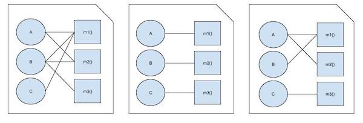

# Fundamentals of Software Architecture

- 시작부터 아키텍트 정의가 나와 거부감이 들었으나,
- 중간중간 생각해 볼만한 내용들이 나와 기록하면서 읽어보기로.

# CH1. 서론

## 비즈니스 도메인 지식을 보유한다

- 도메인 지식이 없으면 문제점, 목표, 요구사항 이해가 어려움.
- 따라서 요구사항을 수용하는 효율적 아키텍처 설계도 X.
- 금융 기관에서 일하는데 평균 방향성 지수, 사행 계약, 무순위 채무 같은 평범한 금융 용어를 모른다면.
- 도메인 지식이 있어야 여러 이해관계자와 효과적으로 소통.

## 대인 관계 기술이 뛰어나다

> 그들이 당신에게 뭐라고 말하든 항상 사람이 문제입니다

- 팀워크, 조정, 리더십 등의 대인관계 기술 역시 중요.
- 여러 이유가 있지만 적어도 아키텍처 결정 배경을 효과적으로 설명하고 전달할 수 있어야 하기에.

## 정치를 이해하고 처세를 잘한다

- 회사 내부의 정치적 분위기를 이해하고 적절히 처신할 줄 알아야.
- 예컨대, 어떤 아키텍처 결정을 내리면 사람들의 반발을 사기 마련이며,
- 이 때 사람들이 변화를 잘 수용할 수 있도록 협상 기술을 잘 발휘해야(혹은 반대에 부딪히며 나아가야).

# CH2. 아키텍처 사고

아키텍트에게 필요한 사고들에 대해 이야기.

## 아키텍처 대 설계

- 사실은 개발팀과 어떻게 협력해야 하는지에 대한 이야기.
- 여기서 아키텍처는 아키텍트가 다루는 것이고 설계는 개발자가 다루는 것을 구분짓는 용도로 사용됨.
- 아키텍트는 전통적 방식이, 아니라 개발자와 아키텍트를 가르는 가상의 물리적 장벽을 허물고, 서로 끊임 없이 소통하는 관계를 정립해야 함.
- 상황이 계속 변하고 이에 대응하고자 이터레이션 방식으로 개발도 하기 때문.

## 기술 폭

- 개발자는 A를 늘려가며 기술의 깊이를 쌓아야 하고,
- 아키텍트는 B를 넓혀 기술 폭을 늘려야 함.
- 한 가지 해결 방식을 자세히 알고 있기 보다,
- 문제 해결에 필요한 5가지 솔루션을 알고,
- 주어진 제약과 목적에 따라 올바른 선택을 할 수 있어야 함.

```
       /\
      /  \
     / A  \
    /------\
   /   B    \
  /----------\
 /     C      \
/______________\

A: 내가 알고 있는 것
B: 내가 모른다는 사실을 아는 것
C: 내가 모른다는 사실조차 모르는 것
```

## 트레이드오프 분석

> 아키텍처는 구글링해도 안 되는 것이다

- 배포 환경, 비즈니스 동인, 회사 문화, 예산, 기간, 개발자 스킬 세트 등 각자에게 주어진 상황은 다 다름.
- 이런 개별 환경, 상황, 문제에 따라 트레이드오프가 다르며 따라서 해결책도 다름.
- 구글링을 통해 정답을 알 수 없는 이유임.
- 그리고 어떤 해결책에서 단점을 발견하지 못한다면 좀 더 분석이 필요한 한 가지 지표.
- 예컨대 아래 그림에서 언뜻 보기에 topic 활용한 방식이 좋아 보임.

```
# 토픽을 이용한 서비스 간 통신
bid producer ------> 매물 topic -----> bid capture
                           | ∟-----> bid tracking
                           ㄴ-------> bid analytics

# 큐를 이용한 서비스 간 통신
bid producer -----> 매물 queue -----> bid capture
       | ㄴ-------> 매물 queue ------> bid tracking
       ㄴ---------> 매물 queue ------> bid analytics
```

- 일단 토픽 방식은 확장성에 유리.
- 새로운 이력 서비스가 필요하더라도 bid producer에 변경은 필요 없음.
- bid history 서비스가 토픽을 새로 구독하기만 하면 됨.
- 이는 bid producer가 구독 서비스가 뭐가 있는지 몰라도 되는 디커플링이기도.

> 프로그래머는 장점을 잘 알지만 트레이드오프는 하나도 모른다.

- 하지만 토픽 방식에서는 누구나 입찰 데이터에 액세스 할 수 있어 보안 측면에 문제가 될 수 있음.
- 또한 토픽에서는 한 가지 데이터 계약만 지원하므로 어느 한 서비스에서 추가 데이터가 필요하면 나머지 모든 서비스도 함께 영향 받음.
- 더불어 토픽의 메시지 개수 모니터링과 오토 스케일링 제약도 존재.
- 그 외에도 주어진 상황에 따라 여러 장단점 도출 될 수 있음.

## 비즈니스 동인의 이해

- 비즈니스 동인을 이해하고,
- 요구사항을 아키텍처 특성으로 해석하고 번역함.
- 따라서 도메인 지식이 있어야 하며,
- 비즈니스 이해 관계자들과 원만하고 협력적 관계를 유지해야 함.

# CH3. 모듈성

> 물리학에 비유하자면, 소프트웨어 시스템은 엔트로피가 증가하는 방향으로 움직이는 복잡한 시스템을 모델링합니다. 질서를 유지하려면 물리적 시스템에 에너지를 투입해야 하는데, 소프트웨어 시스템도 마찬가지입니다. 아키텍트는 끊임없이 에너지를 소비해서 시스템을 구조적으로 탄탄하게 유지해야 합니다.

## 정의

- 클래스, 함수처럼 코드를 모아 둔 덩어리.
- 이는 물리적이 아닌 논리적 구분.
- 프로그래밍 언어에서 패키징 메커니즘은 다양.
- 함수/메서드, 클래스, 패키지/네임스페이스, 메타 오프젝트 프로토콜, ...

## 모듈성 측정

3가지 핵심 개념인 응집, 커플링, 커네이선스 이야기.

### 응집

- 한 모듈의 구성 요소가 동일한 모듈 내에 얼마나 포함되어 있는지를 나타냄.
- 기능적 > 순차적 > 소통적 > 절차적 > 일시적 > 논리적 > 동시적 응집.
- 아래와 같은 모듈 기능이 있다고 가정.

```
# 고객 관리

1. 고객 추가
2. 고객 수정
3. 고객 조회
4. 고객 알림
5. 고객 주문 조회
6. 고객 주문 취소
```

- 1-6을 한 모듈로 두는 게 좋을까 아니면 1-4와 5-6을 나누는 게 좋을까?
- 이는 경우에 따라 다름. 결국 트레이드 오프.
- LCOM(메서드의 응집 결여도)는 모듈의 구조적 응집도를 나타냄.
- 정의는 '공유 필드를 통해 공유되지 않는 메서드의 총 개수'.
- 식으로 나타내면 `LCOM96b = \frac{1}{a} \sum_{j=1}^a \frac{m - u(Aj)}{m}\`.
- 아래 그림에서 첫 번째가 응집도가 가장 높고, 두 번째는 메서드를 각자 클래스로 분리해도 상관 없을 정도로 낮은 응집도.



### 커플링

- 커플링 측정 도구는 많다고 함.
- 메서드의 호출과 반환이 호출 그래프를 형성하므로 수학적 접근이 용이하기에.
- 구심 커플링, 원심 커플링이 한 예.

### 추상도, 불안정도

`추상도 A = \frac{\sum m^a}{\sum m^c}`

- 추상도는 추상 아티팩트와 구상 아티팩트의 비율, 즉 구현 대비 추상화 정도 나타냄.
- 위 식에서 m^a는 추상 요소, m^c는 구상 요소.
- 한 예로 main() 메서드 안에 모든 코드가 담긴다면 추상도는 0에 가까움.

`불안정도 I = \frac{C^e}{C^e + C^a}`

- 불안정도는 코드베이스의 변동성을 의미함.
- C^a는 안으로 들어오는 커플링, C^e는 바깥으로 나가는 커플링.
- 구심 커플링과 원심 커플링의 합에 비해 원심 커플링이 얼마나 되는가.

### 메인 시퀀스로부터의 거리

`D = |A + I - 1|`

- A는 추상도, I는 불안정도를 나타냄.
- 두 값 모두 비율이므로 거리 역시 0과 1사이의 값.
- 이는 추상도와 불안정도 사이의 이상적 관계를 나타내는 식.
- 그래프 위의 선이 메인시퀀스이고,
- 여기서 아래쪽으로 멀어질수록 구현 코드만 잔뜩 있고 추상화가 없어 고통스러우며,
- 위로 멀어질수록 복잡하지도 않은 곳에 잔뜩 추상화만 적용되어 있어 쓸모 없는 영역.


### 커네이선스

> 두 컴포넌트 중 한쪽이 변경될 경우 다른 쪽도 변경해야 전체 시스템의 정합성이 맞는다면 이들은 커네이선스를 갖고 있는 것이다.

- 밀러 페이지-존스가 구심/원심 커플링 메트릭을 좀 더 발전시켜 커네이선스<sup>connascence</sup> 개념을 만듦.
- 그리고 이 커네이선스를 정적인 것과 동적인 것으로 분류.

#### 정적 커네이선스

- 실행 시간이 아닌 소스 코드 레벨의 커플링.
- 명칭 커네이선스(CoN): 여러 컴포넌트의 엔티티명 일치.
- 타입 커네이선스(CoT): 여러 컴포넌트의 엔티티 타입 일치.
- 의미 커네이선스(CoM): 또는 관례 커네이선스(CoC): 여러 컴포넌트에 걸쳐 값의 의미 일치. 예컨대 `int TRUE = 1;`.
- 위치 커네이선스(CoP): 여러 컴포넌트의 값 순서 일치. 예컨대 메서드 매개변수 순서.
- 알고리즘 커네이선스(CoA): 여러 컴포넌트에서 특정 알고리즘의 일치. 서버/클라이언트의 사용자 인증을 위한 보안 해시 알고리즘이 그 예.

#### 동적 커네이선스

- 런타임 호출에서의 분석.
- 실행 커네이선스(CoE): 여러 컴포넌트의 실행 순서 제약.

```
email = new Email();
email.setRecipient("foo@bar.com");
email.send();
email.setSubject("whoops");
```

- 시점 커네이선스(CoT): 여러 컴포넌트의 실행 시점. 두 스레드의 경합 조건이 한 예.
- 값 커네이선스(CoV): 서로 연관된 다수 값들의 동시 변경 제약. 꼭지점 4개 값으로 사각형을 정의할 때 하나만 바꿀 때의 위험을 생각해 보면 됨.
- 식별 커네이선스(CoI): 여러 컴포넌트가 동일한 엔티티를 참조할 때 발생. 두 컴포넌트가 분산 큐로 자료 구조를 공유해서 업데이트 하는 경우.

#### 커네이선스 속성

- 강도<sup>strength</sup>: 커네이선스를 얼마나 리팩토링하기 어려운지. 예컨대 동적에 비해 정적 커네이선스가 개선하기 쉬움.
- 지역성<sup>locality</sup>: 모듈들이 서로 얼마나 가까이 있는가. 보통 근접한 코드가 더 높은 커네이선스를 가짐. 커플링 문제가 되는 것들을 한 곳에 두는 식으로 문제 해결할 수도.
- 정도<sup>degree</sup>: 커네이선스가 미치는 영향 범위. 예컨대 1개 클래스냐 여러 클래스냐. 모듈이 몇 개 안 된다면 커네이선스 높아도 그리 해가 되지 않음. 물론, 일반적으로 코드베이스는 점점 커지기 마련.
- 짐 웨이리치는 아래와 같이 조언.

> 정도의 규칙: 강한 형태의 커네이선스를 보다 약한 형태의 커네이선스로 전환하라.<br/>
> 지역성의 규칙: 소프트웨어 엘리먼트 간의 거리가 멀어질수록 보다 약한 형태의 커네이선스를 사용하라.

# CH4. 아키텍처 특성 정의

아키텍처 특성은, 소프트웨어에서 도메인 기능과 직접적 관련이 없는 것들을 가리키며, 아래 3가지 기준을 충족. (크게 중요한 내용은 아니라서 상세 내용 기록은 X)

1. 비도메인 설계 고려 사항을 명시한다
2. 설계의 구조적 측면에 영향을 미친다
3. 애플리케이션 성공에 (절대적으로) 중요하다

## 아키텍처 특성 (일부) 목록

### 운영 아키텍처 특성

| 특성 | 설명 |
| --- | --- |
| 가용성<sup>availability</sup> | 얼마나 오랫동안 사용 가능한지. 24/7 등. |
| 연속성<sup>continuity</sup> | 재해 복구 능력이라고 함. |
| 성능<sup>performance</sup> | 스트레스 테스트, 피크 분석, 기능 사용 빈도 분석, 필요 용량, 응답 시간 등. 수 개월간 소요된다고. |
| 복구성<sup>recoverability</sup> | 장애 발생 시 얼마나 신속히 시스템 재가동 시켜야 하는지에 관함. 백업, 하드웨어 다중화 요건 등이 관련. |
| 신뢰성/안전<sup>reliability/safety</sup> | 페일 세이프. 실패 시 거액의 손실이 발생하는지 등. |
| 견고성<sup>robustness</sup> | 인터넷 접속 끊김, 정전, 하드웨터 실패 등의 에러나 경계 조건을 감당하는 능력. |
| 확장성<sup>scalability</sup> | 유저 수, 요청 수가 늘어나도 감당할 수 있는지. |

### 구조 아키텍처 특성

| 특성 | 설명 |
| --- | --- |
| 설정성<sup>configurability</sup> | 엔드 유저가 설정을 쉽게 바꿀 수 있는지 |
| 신장성<sup>extensbility</sup> | 새로운 기능을 얼마나 쉽게 추가할 수 있는지 |
| 설치성<sup>instability</sup> | 시스템을 필요한 환경에 얼마나 쉽게 설치할 수 있는지 |
| 활용성/재사용<sup>leverageability/reuse</sup> | 공통 컴포넌트를 여러 제품에서 활용할 수 있는지 |
| 지역성<sup>locality</sup> | 다국어 지원 |
| 유지보수성<sup>maintainability</sup> | 시스템을 얼마나 쉽게 변경/개선할 수 있는지 |
| 이식성<sup>portability</sup> | 여러 플랫폼에서 시스템 실행할 수 있는지 |
| 지원성<sup>supportability</sup> | 어느 정도의 기술 지원을 필요로 하는지 |
| 업그레이드성<sup>upgradeability</sup> | 새 버전으로 얼마나 쉽고 빠르게 업그레이드할 수 있는지 |

### 아키텍처 공통 특성

| 특성 | 설명 |
| --- | --- |
| 접근성<sup>accessibility</sup> | 장애인 등 모든 유저의 접근이 편한지 |
| 보관성<sup>archivability</sup> | 데이터 아카이빙 필요성이나 얼마의 시간 지난 뒤 삭제해야 하는지 |
| 인증<sup>authentication</sup> | 유저가 본인이 맞음을 증명하기 위한 보안 요구사항 |
| 인가<sup>authorization</sup> | 유저가 정해진 기능만 사용할 수 있도록 강제 |
| 합법성<sup>legal</sup> | 법적 제약조건 |
| 프라이버시<sup>privacy</sup> | 회사 내부 트랜잭션을 외부에 드러내지 않기 |
| 보안<sup>security</sup> | 데이터베이스 데이터 암호화, 네트워크 통신 암호화 등 |
| 사용성/성취성<sup>usability/achievability</sup> | 사용자가 애플리케이션을 사용하여 원하는 목적을 달성하기 위해 필요한 교육/훈련 수준 |

## 트레이드오프 및 나쁜 것 중에서 제일 나은 아키텍처

- 모든 아키텍처 특성을 만족시키기 어려움.
- 예컨대 보안 관련 노력을 기울이다 보면 성능 특성이 약해지기도.
- 최고의 아키텍처 말고, 나쁜 것 중에서 제일 나은 아키텍처 선정하라는 이야기.

# CH6. 아키텍처 특성의 측정 및 거버넌스

## 아키텍처 특성 측정

아키텍처 특성들의 특징 먼저 언급.

- 대부분 의미가 모호. 민첩성, 배포성, ...
- 정의가 다양. 예를 들어, 성능의 의미가 다양해서, 통일 없이는 원활한 의사소통 어려움.
- 복합적. 대부분 더 작은 여러 특성으로 나누는 것이 도움이 됨. 예컨대, 민첩성은 모듈성, 배포성, 시험성 등으로 세분화.

책에서는 이런 특성들의 운영적 측정, 구조적 측정, 프로세스 측정을 소개.

- 운영적 측정은 성능이나 확장성 측정.
- 성능은 해석이 중요. 평균으로 잡아 내기 어려운 특이점들 모니터링이 필요할 수도.
- 또한 달성하기 어려운 성능 수치보다는 통계 분석 결과에 기반해서 평소와 다른 이상 징후를 발견하기도.
- 구조적 측정은 코드 복잡도(순환 복잡도) 등 코드 품질 측정.
- 프로세스 측정은 시험성과 배포성 측정.
- 얼마나 테스트가 잘 되고 있는지, 배포 성공/롤백률이나 배포 시 발생한 이슈 버그 등의 통계 등을 측정하는 것.

## 거버넌스와 피트니스 함수

### 아키텍처 특성 관리

- 거버넌스<sup>governance</sup>는 kubernan(이끌다)이라는 그리스어에서 유래.
- 아키텍트 거버넌스는 소프트웨어의 모든 개발 프로세스를 포괄.
- 조직 내부의 소프트웨어 품질 보장 업무는 아키텍처 범주에 포함되므로 아키텍처 거버넌스 항목.
- 이런 거버넌스 활동의 자동화를 위해 피트니스 함수 기법이 있음.

### 피트니스 함수

- 아키텍처 피트니스 함수: 어떤 아키텍처 특성의 객관적인 무결성을 평가하는 모든 메커니즘.
- 순환 의존성: 아래 예시와 같이 피트니스 함수로 순환 참조 여부 확인.

```java
var jdepend = new JDepend();
jdepend.addDirectory("/path");
jdepend.analyze();
assertFalse(jdepend.containsCycles());
```

- 메인 시퀀스로부터의 거리 피트니스 함수

```java
var ideal = 0.0;
var tolerance = 0.5;
var packages = jdepend.analyze();
var iter = packages.iterator();
while (iter.hasNext()) {
  p = (JavaPackage) iter.next();
  assertEquals(ideal, p.distance(), tolerance);
}
```

- 아크 유닛 얘기도 언급.
- 그 외 카오스 몽키, 시미안 아미 등도 피트니스 함수 응용 사례.

# CH7. 아키텍처 특성 범위

## 커플링과 커네이선스

- 구심/원심 커플링 같은 코드 레벨의 커플링 메트릭은,
- 아키텍처 분석용으로는 너무 세분도가 높다고 함.
- 그래서 커네이선스라는 새로운 커플링 메트릭 등장.

> 두 컴포넌트 중 한쪽이 변경될 경우 다른 쪽도 변경해야 전체 세스템의 정합성이 맞는다면 이들은 커네이선스를 갖고 있는 것이다.

- 예를 들어, 두 MS가 동일한 클래스를 공유한다면 정적 커네이선스.
- 동적 커네이선스에는 동기와 비동기가 있음.
- 분산 시스템들이 이벤트 기반으로 통신하면 비동기.

## 아키텍처 퀀텀과 세분도

- 소프트웨어는 컴포넌트 레벨의 커플링뿐만아니라,
- 여러 시스템 부분들이 비즈니스 개념으로 서로 한데 엮여 응집함.
- 성공적 소프트웨어를 위해서는 문제가 될 만한 커플링들을 모두 살펴봐야 함.
- 일단, 아키텍처 퀀텀이라는 용어를 아래와 같이 정의.

> 높은 기능 응집도와 동기적 커네이선스를 가진, 독립적으로 배포 가능한 아티팩트.

- 퀀텀은 말 그대로 물리 입자 가운데 가장 작은 양인 양자를 가리키는 것.
- 이를 아키텍처에 적용한 것.
- 잘 정의된 MS를 아키텍처 퀀텀으로 보면 될 것으로 보임.

# CH8. 컴포넌트 기반 사고

- 컴포넌트를 연관된 코드의 묶음으로 바라볼 수도 있지만,
- 아키텍트는 모듈을 물리적으로 구현한 컴포넌트로 생각.
- 자바 jar, 닷넷 dll, 루비 gem 파일 등.

## 컴포넌트 범위

- 가장 단순한 컴포넌트는, 클래스를 한 단계 높은 수준의 모듈로 래핑한 것. 보통 라이브러리로 부름.
- 한편, 서브시스템이나 레이어 형태로도 나타남.
- MS의 서비스도 역시 컴포넌트.

## 아키텍처 역할

- 레이어드 아키텍처와 모듈러 모놀리스 소개.
- 각 트레이드오프는 2부에서 다룰 예정이고(만사가 트레이드오프),
- 여기선 아키텍처 분할을 설명하기 위한 소개.
- 레이어드는 기술에 의한 분할이고,
- 모듈러 모놀리스는 도메인에 의한 분할.
- 아래와 같이 간단히 비교는 하고 있으나 기록은 생략.

그 외 특별한 내용 없음.

# CH9. 기초

여러가지 아키텍처 스타일을 다루기에 앞서, 몇 가지 근본적인 패턴들을 소개.

## 9.1 기초 패턴

### 진흙잡탕

- 내부 구조라고 할 만한 것은 없고,
- 데이터베이스를 직접 호출하는 이벤트 핸들러들의 스크립팅 애플리케이션.
- 강한 커플링이 얽히고 얽힘.
- 아직도 존재하는 유형.

### 유니터리 아키텍처

- 분산형(클라이언트 서버 같은) 시스템 이전의, 단일되고 통일된 시스템.
- 임베디드 시스템과 같은 일부 환경에만 제한적 사용.

### 클라이언트/서버

- 프론트엔드와 백엔드로 분리(또는 클라이언트 서버라고 명명).
- 요즘은 데이터베이스, 애플리케이션, 프론트 이렇게 3티어 사용.

## 9.2 모놀리식 대 분산 아키텍처

- 모놀리식은 전체 코드를 단일 단위로 배포.
- 분산형은 여러 단위로 배포.
- 뒤에서 다룰 레이어드, 파이프라인, 마이크로커널 아키텍처가 모놀리식.
- 서비스 기반, 이벤트 기반, 공간 기반, 서비스 지향, 마이크로서비스 아키텍처가 분산형.
- 분산형은 성능, 확장성, 가용성 측면에서 유리.
- 하지만 큰 트레이드오프 존재.

### 분산 컴퓨팅의 오류<sup>the fallacies of distributed computing</sup>

1. 네트워크는 믿을 수 있다
2. 레이턴시는 0이다
3. 대역폭은 무한하다
4. 네트워크는 안전하다
5. 토폴로지는 절대 안 바뀐다
6. 관리자는 한 사람뿐이다
7. 운송비는 0이다
8. 네트워크는 균일하다

### 다른 분산 아키텍처 고려 사항

- 위의 8가지 문제 외에도 분산 아키텍처에서 해결해야 하는 과제들이 있음.
- 먼저, 분산 로깅. 로그 위치나 포맷이 제각각이라 문제 추적이 어려움.
- 다음으로, 분산 트랜잭션. 분산 아키텍처에서는 최종 일관성 개념을 이용.
- 확장성, 성능, 가용성을 얻는 대신 데이터 일관성과 무결성을 희생한는 것.
- 마지막으로, 계약 생성이나 유지보수, 버저닝 역시 만만치 않은 문제들.

# CH10. 레이어드 아키텍처 스타일

- 단순하고 대중적이며 비용 적음.
- 많은 조직들의 구조와 잘 맞아 떨어짐(콘웨이 법칙).
- 하지만 묵시적 아키텍처 안티패턴, 우발적 아키텍처 안티패턴 등 몇 안티패턴 범주에 속함.

## 토폴로지

- 프레젠테이션 레이어
- 비즈니스 레이어
- 퍼시스턴스 레이어
- 데이터베이스 레이어
- 인메모리 DB를 이용해서 4개를 한 배포 모듈로 묶기도.
- 혹은 DB만 별도로 구축하거나, 여기에 더해 프레젠테이션도 분리하기도.
- 기술 별로 관심사 분리가 이뤄짐.
- 하지만 도메인 변경에는 여러 레이어가 영향 받는 단점.

## 레이어 격리

- 각 레이어는 폐쇄 또는 개방 상태로 유지.
- 상위 레이어에서 무조건 바로 아래 레이어만 접근 가능하다면 폐쇄.
- 바로 아래 레이어를 건너 뛰고 더 아래 레이어에도 접근 가능하다면 개방.
- 레이어의 변경은 바로 위 레이어로 영향을 국소화 할 수 있다는 점이 폐쇄의 장점.

## 레이어 추가

- 하지만 어떤 경우에는 개방이 더 합리적이기도.
- 예를 들어, 날짜나 문자열 유틸리티처럼 공통 비즈니스 객체를 공유하고 싶을 수도.
- 그러나 이를 위해 프레젠테이션이 비즈니스 레이어에 접근할 수 있다면, 폐쇄의 장점을 잃어버릴 수도 있음.
- 그래서 레이어를 하나 추가하고 여기에 공유할 객체들을 모아두고 개방.
- 프레젠테이션(폐쇄), 비즈니스(폐쇄), 서비스(개방), 퍼시스턴스(폐쇄), 데이터베이스(폐쇄).

## 기타 고려 사항

- 아키텍처 싱크홀 안티패턴 이야기.
- 레이어를 거치지만 아무것도 하지 않는게 많은 것을 가리킴.
- 고객 데이터를 단순히 조회하는 경우가 그 예.
- 하지만 레이어가 폐쇄이다 보니 객체 생성과 단순 연계 반복.
- 이런 싱크홀이 아예 없을 순 없겠지만, 이런 비중이 커지는 것은 문제.
- 이 문제를 막기 위한 한 가지 방법은 레이어를 개방으로 유지하는 것.
- 하지만 트레이드 오프가 있음을 분명하게 인지해야.

## 왜 이 아키텍처 스타일을 사용하는가

- 작고 단순한 애플리케이션에 적합.
- 예산과 일정이 빠듯할 때 출발점으로 괜찮음.
- 혹은 어떤 아키텍처 스타일이 적합한지 아직 판단하지 못한 경우.
- 하지만 규모가 커질수록 유지보수성, 민첩성, 시험성, 배포성 등에 불리.
- 모듈러한 아키텍처 스타일 고민이 필요할 때.

# CH11. 파이프라인 아키텍처 스타일

## 토폴로지

- 다수의 파이프와 필터로 구성.
- 자바의 스트림 파이프라인 생각하면 쉬움.

```
         파이프             파이프             파이프
| 필터 | -------> | 필터 | --------> | 필터 | - - - -> | 필터 |
```

### 파이프

- 필터 간 통신 채널.
- 한 소스에서 입력을 받아 다른 소스로 출력.
- 보통 단방향, 점대점<sup>point-to-point</sup> 방식으로 구성.
- 고성능에 유리한 적은 양의 데이터 선호.

### 필터

- self-contained, 다른 필터와 독립적, stateless.
- 한 필터는 한 가지 태스크만 수행.
- 필터의 종류는 4개.
  - producer: 프로세스의 시작점. 아웃바운드 소스(들어오는 것 없고 나가는 것만 있음)
  - transformer: 입력을 받고 필요에 따라 데이터를 변환하여 아웃바운드 파이프로 전달. 맵<sup>map</sup>이라 부르기도.
  - tester: 하나 이상의 기준<sup>criteria</sup>에 대해 테스트 하고 그 결과에 따라 필요하면 결과를 생산. 리듀스<sup>reduce</sup>로도 불림.
  - consumer: 파이프라인의 종착지. 파이프라인 최종 결과를 DB에 저장하거나 UI에 표현.
- 쉘 코드가 흔한 예제.

```sh
tr -cs A-Za-z '\n' |
tr A-Z a-z |
sort |
uniq -c |
sort -rn |
sed ${1}q
```

## 아키텍처 특성 등급

- 분산환경에서도 파이프라인 구성이 가능한데,
- 일단 저자는 모놀리스 환경에서의 파이프라인 이야기로 한정.
- 모놀리식이므로 단순하고, 알기 쉬우며, 구축과 유지보수가 쉬움.
- 필터 별로 관심사 분리되어 있으므로 모듈성 확보.
- 특성 별 별점 작성한 표가 있는데, 레이어드 아키텍처와 동일한 점수들.

# CH12. 마이크로커널 아키텍처 스타일

- 보통 제품 기반 애플리케이션에 적합.
- 제품 기반 = 단일 모놀리식 배포 단위로 다운로드와 설치가 가능하고, 고객 사이트에 서드파티 제품으로 설치되곤 함.
- 이클립스 IDE, PMD, 지라, 젠킨스 등이 이 아키텍처를 사용.
- 토폴로지는 코어 시스템과 플로그인 컴포넌트 요소로 구성.
- 코어 시스템은 어떤 플러그인을 어떻게 사용할 수 있는지를 레지스트리를 통해 확인.
- 플러그인과 코어 간의 계약은 도메인 단위로 표준화 되어 있고 입출력은 계약에 명시됨.

```java
public interface AssessmentPlugin {
       public AssessmentOutput access();
       public String register();
       public String deregister();
}

public class AssessmentOutput {
       public String assessmentReport;
       public Boolean resell;
       public Double value;
       public Double resellPrice;
}
```

# CH14. 이벤트 기반 아키텍처 스타일

확장성이 뛰어난 고성능 애플리케이션 개발에 널리 쓰이는 비동기 분산 아키텍처 스타일.

## 토폴로지

- 중재자 토폴로지: 이벤트 처리 워크플로우를 제어해야 할 경우 사용.
- 브로커 토폴로지: 신속한 응답과 동적 이벤트 처리 제어가 필요할 때 사용.

## 브로커 토폴로지

- 중앙에 이벤트 중재자가 없음.
- 브로커를 통해 이벤트 프로세서 컴포넌트로 메시지 브로드캐스팅.
- 아키텍처 컴포넌트는 4가지.
  - 시작 이벤트: 전체 이벤트 흐름을 개시하는 이벤트.
  - 이벤트 브로커: 브로커는 이 이벤트를 채널로 받고 프로세서들에게 전달.
  - 이벤트 프로세서: 브로커로부터 이벤트를 받아 자신의 일을 수행.
  - 처리 이벤트: 프로세서가 자신의 일을 끝내고, 나머지 프로세스들에게 처리 이벤트 발행하여 알림.
- 이 이벤트의 흐름은 발행된 이벤트를 아무도 관심 없어 할 때까지 이어짐.
- 이벤트 발행 시에는 프로세서가 관심 있는지 여부와 상관 없이 모두에게 전달하는 것이 좋음.
- 불필요한 리소스 사용이라 볼 수도 있으나, 추후 기능 확장에 유리하기 때문.
- 브로커 토폴로지는 성능, 응답성, 확장성 측면에서 장점.
- 하지만, 전체 워크플로우 제어가 어려움.
- 예컨대, 주문 트랜잭션이 언제 끝났는지 각 파트에서는 알기 어려움.
- 또한, 중간에 문제가 되었을 경우의 대응도 어려워짐.

## 중재자 토폴로지

### 중재자 토폴로지의 5가지 컴포넌트

1. 시작 이벤트
2. 이벤트 큐
3. 이벤트 중재자
4. 이벤트 채널
5. 이벤트 프로세서

### 중재자 토폴로지 흐름

- 시작 이벤트를 중재자의 이벤트 큐로 받고,
- 중재자는 이벤트 처리에 대한 단계 정보를 기반으로 관련 프로세스에게 이벤트 전달.
- 이벤트 채널을 거쳐 이벤트를 받은 프로세서는 자신의 일을 수행.
- 자신의 일이 다 끝나면 다시 중재자의 큐로 이벤트 발행.

### 중재자의 수

- 중재자는 보통 도메인이나 이벤트 그룹 별로 여럿 존재.
- 이를 통해 SPF를 줄이고 전체 처리량과 성능을 높임.
- 예컨대 고객 중재자, 주문 중재자, ...

### 중재자 주문 예시

- 아래는 5단계로 주문을 처리하는 중재자의 예.
- 2, 3, 4단계의 세부 작업들은 모두 동시에 이뤄짐.
- 각 세부 작업들이 모두 성공해야 다음 단계로 나갈 수 있음.

```
1단계: 주문을 한다
 ㄴ 주문을 생성한다
2단계: 주문을 처리한다
 ㄴ 주문이 접수됐다고 고객에게 이메일로 알린다
 ㄴ 결제를 한다
 ㄴ 재고를 차감한다
3단계: 주문을 이행한다
 ㄴ 주문한 물품을 포장한다
 ㄴ 필요시 추가 주문하여 재고를 늘린다
4단계: 주문을 배송한다
 ㄴ 주문한 물품의 배송 준비가 됐다고 고객에게 이메일로 알린다
 ㄴ 고객에게 물품을 배송한다
5단계: 고객에게 알린다
 ㄴ 주문한 물품을 배송했다고 고객에게 이메일로 알린다
```

### 중재자의 실패 처리

- 위 단계에서 만약 결제가 실패한다면,
- 중재자는 이 사실을 통보 받고,
- 워크플로우를 중단시키고 데이터 저장소에 요청 상태를 기록함.
- 나중에 결제 처리가 완료되면 중단된 지점부터 워크플로우를 다시 시작.

### 중재자와 브로커 차이

- 중재자에서는 place-order, fulfill-order 같은 처리 이벤트가 이미 일어난 사건이 아니고 커맨드.
- 중재자에서는 처리 이벤트가 반드시 처리되어야 하는 이벤트인 반면 브로커에서는 무시해도 됨.
- 중재자가 실패 처리 등 워크플로우를 통제할 수 있지만 단점도 존재.
- 먼저, 복잡한 이벤트 흐름의 동적 처리를 선언적으로 모델링하기 어려움(복잡한 경우는 중재자+브로커 하이브리드로).
- 둘째, 확장시 중재자도 함께 확장해야 하므로 상대적으로 병목.
- 셋째, 이벤트 처리가 중재자로 커플링 되어 상대적으로 성능이 약함.

## 비동기 통신

- 시스템 응답성(!=성능)을 높임.
- 더불어 복잡도도 올라감.
- 댓글 등록하는 API를 예로 들어 설명.
- 어떤 애플리케이션에서 댓글 등록 요청을 받으면,
- 여기에 비속어가 있는지 등을 검사해서 등록 여부를 결정하는데,
- 이 검사에 3,000ms가 걸린다고 가정.
- 이 API를 비동기로 처리하면 사용자는 3,000ms를 기다리지 않아도 됨.
- 참고로, 검사에 들어가는 시간은 여전히 동일하기에 성능이 아닌 응답성만 개선된 것.
- 문제는 에러가 발생했을 때임.
- 비속어가 발견 되어 댓글이 결과적으로 등록 실패한다면?
- 별도로 사용자에게 댓글 실패를 알려줘야 함.

## 에러 처리

- 비동기 통신의 에러 처리를 위한 한 가지 방법으로,
- 리액티브 아키텍처의 워크플로 이벤트 패턴을 소개.
- 응답성을 높이면서도<sup>responsive</sup> 에러에 탄력적으로 대응하는<sup>resilient</sup> 아키텍처.
- 기본적으로, 이벤트 프로듀서가 메시지 채널을 통해 이벤트 컨슈머에게 메시지를 비동기로 전달.
- 컨슈머는 데이터를 처리하다가 에러를 만나면 이를 워크플로우 프로세서에게 위임.
- 그리고 이벤트 큐에 있는 다음 메시지를 읽어들여 처리를 진행.
- 에러를 손수 처리하지 않고 바로 다음 메시지로 넘어가니 다른 메시지들의 응답성은 유지.
- 한편, 워크플로 프로세서는 문제된 메시지의 에러 원인을 정정 후 메시지 채널로 재전달.
- 또는, 원인 해결이 어렵다면 다른 메시지 채널로 전송하여 사람의 개입을 안내할 수도.
- 이런 에러 처리 방식은 문제된 메시지의 처리 순서가 꼬일 수 있다는 것.
- 순서가 보장되어야 하는 메시지들만 별도 큐로 적재 후 에러 해결 후 순차 처리하는 등으로 해결 가능.

## 데이터 소실 방지

- 비동기 통신에서 데이터 소실은 언제나 중요한 관심사.
- 그래서 비동기 메시지의 소실을 막는 몇 가지 방법을 소개.
- 일단, 이벤트 프로세서 A가 큐에 메시지를 비동기로 전송하고,
- 이벤트 프로세서 B가 이 메시지를 받아 DB에 삽입한다고 가정.
- 데이터 소실은 다음 2가지 경우에 발생할 수 있음.
- 원래 3가지 제시했는데 3번째 것은 관련 없어 보여 생략.
- 첫째, A의 메시지가 큐로 전달되지 않음. 혹은 B가 메시지를 꺼내기 전에 브로커 장애.
- 둘째, B가 큐에서 메시지를 꺼냈으나 이를 처리하기 전에 장애 발생.
- 첫 번째 문제는 synchronous send와 persistent 메시지 큐로 해결.
- 두 번재 문제는 client acknowledge mode로 해결.

## 요청-응답

- 이벤트 프로듀서와 컨슈머 간의 동기 처리가 필요한 경우의 이야기.
- 2가지 방법을 제시하는데 1가지는 CID(Correlation ID) 활용이고,
- 다른 1가지는 임시 큐를 매 요청마다 생성/삭제하는 방법.

# CH15. 공간 기반 아키텍처 스타일

- 동시 요청 수가 많으면 웹 서버, 애플리케이션 서버, DB까지도 부하 일어날 수 있음.
- 공간 기반 아키텍처 스타일은 높은 확장성, 탄력성, 동시성을 가짐.
- 극단적이고 가변적인 확장성 문제는 DB 확장이나 아키텍처 적 해결이 더 나음(캐시 적용보다는).

## 토폴로지

- 시스템에서 동기 제약조건인 중앙 DB 대신, 복제된 인메모리 데이터 그리드를 사용.
- [위키피디아의 Space-based architecture](https://en.wikipedia.org/wiki/Space-based_architecture) 문서를 보면 전체 구조가 그림으로 나와 있음.
- 구성 요소는 크게 5개.
  - 처리 장치
  - 가상 미들웨어
    
  - 데이터 펌프: 업데이트된 데이터를 DB에 비동기 전송.
  - 데이터 라이터: 데이터 펌프에서 데이터를 받아 업데이트 수행.
  - 데이터 리더: 처리 장치가 시작되지마자 DB의 데이터를 읽어 전달.

### 처리 장치

- 애플리케이션 코드가 구현된 곳.
- 더불어, Hazelcast, Apache Ignite 등 인메모리 데이터 그리드와 복제 엔진 포함.

### 가상 미들웨어

- 처리 장치를 관리/조정.
- 메시징 그리드, 데이터 그리드, 처리 그리드, 배포 관리자로 구성.

**메시징 그리드**

- 메시징 그리드는 가상 미들웨어에 유입된 요청을 적절한 활성 처리 장치로 전달함.
- 단순 RR부터 요청 처리 상태를 추적하는 복잡한 알고리즘도 사용.

**데이터 그리드**

- 요즘은 처리 장치에 데이터 그리드가 복제 캐시로써 위치하고 있긴 함.
- 하지만, 복제 캐시 구현체가 외부 컨트롤러를 필요로 하거나, 분산 캐시를 사용할 수 있음.
- 이 때 데이터 그리드는 가상 미들웨어 내부의 데이터 그리드와 처리 장치 모두에 위치.
- 방식에 관계 없이 결국 하는 일은 인메모리 데이터의 동기화.
- 인스턴스가 추가/삭제 되는 경우에도 이런 동기화를 지원할 수 있어야 함.

**처리 그리드**

- 다수의 처리 장치가 단일 비즈니스 요청을 처리할 경우 요청 처리를 오케스트레이션.
- 혹은 서로 다른 종류의 처리 장치(예컨대 주문과 결제) 사이에 조정이 필요할 경우 중재/조정함.

**배포 관리자**

- 부하 조건에 따라 처리 장치 인스턴스를 동적으로 시작/종료.
- 여러 조건을 기반으로 확장성과 탄력성을 지원함.

### 데이터 펌프

- 처리 장치는 직접 데이터를 DB에 읽기/저장 X.
- 데이터 펌프가 데이터를 다른 프로세서에 보내 DB를 업데이트.
- 항상 비동기로 동작하며, 캐시와 DB의 최종 일관성을 실현.
- 보통 메시징 기법으로 구현한다고 함.
- 따라서, DB가 잠시 불능 상태가 되더라도 처리 장치는 계속 작동.
- 데이터 펌프는 도메인이나 서브도메인 별로 여러 개를 둠.
- CustomerProfile, CustomerWishlist 수준으로 분리하거나 Customer로 통합하기도.

### 데이터 라이터

- 데이터 펌프에서 메시지를 받아 그에 맞게 DB를 업데이트.
- 이는 서비스나 애플리케이션, Ab Initio 같은 데이터 허브로 구현.
- Customer 같은 도메인 단위로 둘 수도 있고,
- CustomerProfile, CustomerWishlist 같은 수준으로 세분화 해서 둘 수도 있음.

### 데이터 리더

- DB에서 데이터를 읽어 리버스 데이터 펌프를 통해 처리 장치로 전달.
- 데이터 리더는 3가지 경우에만 동작한다고 함.
- 첫째, 동일한 이름의 캐시를 가진 모든 처리 장치 인스턴스가 실패하는 경우.
- 둘째, 동일한 이름의 캐시 안에서 모든 처리 장치를 재배포 하는 경우.
- 셋째, 복제 캐시에 들어있지 않은 아카이브 데이터를 조회하는 경우.

## 데이터 충돌

- 당연하게도 복제 지연으로 인해 데이터 충돌 발생할 수 있음.
- 여기서 충돌은, 한 캐시 인스턴스가 데이터를 업데이트를 했지만,
- 아직 다른 캐시 인스턴스로 복제되기 전일 때, 다른 캐시에 그 데이터 업데이트가 일어나는 경우를 가리킴.
- 여기서는 데이터 충돌률을 공식으로 나타내고 있음.

```
충돌률 = N * (UR^2 / S) * RL
```

- N: 동일한 이름의 캐시를 사용하는(region을 얘기하는 것 같음) 서비스 인스턴스 수.
- UR: 밀리초 당 업데이트율.
- S: 캐시 크기(로우 개수).
- RL: 캐시 제품의 복제 대기 시간.

## 클라우드 대 온프레미스 구현

- 이 아키텍처에서는 클라우드와 온프레미스를 적절히 섞을 수 있음.
- 예컨대, 물리 DB는 온프레미스에 두고, 클라우드의 매니지드 환경에서 처리 장치와 가상 미들웨어를 두는 것.

## 복제 캐시 대 분산 캐시

- 복제 캐시는 속도가 매우 빠르고 장애 내성이 높으며 SPOF도 없음.
- 하지만 데이터량(캐시 크기)이 매우 많거나 너무 빈번하게 캐시 업데이트가 일어난다면 분산 캐시 고려.
- 분산 캐시는 데이터가 한 곳에 있어 복제할 필요가 없고 따라서 높은 수준의 데이터 일관성 보장.
- 하지만 캐시 데이터를 원격에서 가져와야 함로 성능이 낮고 시스템 전체적으로 지연이 높아짐.

## 니어 캐시

- 분산 캐시와 인메모리 데이터 그리드의 하이브리드 형식.
- 이 구성에서 분산 캐시는 full backing cache,
- 인메모리 데이터 그리드는 front cache라 부름.
- front cache는 full backing cache에 비해 항상 적은 서브 세트를 담음.
- 그리고 eviction policy로 옛 항목을 삭제 후 최근 항목 추가.
- MRU나 MFU 캐시로 사용하는 것(혹은 RR<sup>Random Replacement</sup>).
- front cache는 full backing cache와 동기화 되지만,
- 각 처리 장치에 포함된 front cache 끼리는 동기화 안 됨.
- 이로 인해 처리 장치마다 서로 다른 데이터를 갖게 되고,
- 처리 장치 간 성능과 응답성이 비일관적이 되므로,
- 이 모델을 권장하지는 않는다고 함.

# CH17. 마이크로서비스 아키텍처 스타일

## 역사

- MSA는 DDD의 사상, 그 중에서도 디커플링 스타일을 나타낸 바운디드 컨텍스트에 많은 영향을 받음.
- 경계 컨텍스트 내에서는 코드, 데이터 스키마 같은 내부 요소들이 함께 연결되어 작동.
- 경계 컨텍스트 외부의 것들은 전혀 커플링 되지 않음.
- 재사용은 유익하지만 커플링이 되면 문제.
- 디커플링을 목표로 할 때는 재사용보다 중복을 우선하기도.

## 분산

- 인프라 측면에서도 재사용보다는 디커플링.
- 육중한 인프라 제약으로부터 좀 더 자유로움.
- 하지만 이로 인해 성능은 다소 부정적.
- 로컬 호출보다 네트워크 호출 비용이 더 크고,
- 보안 절차도 더 있을 수 있기에.
- 따라서 서비스 세분도를 잘 결정해야 하고,
- 불필요하게 경계를 넘나드는 트랜잭션을 방지해야.

## 경계 컨텍스트

- MSA는 도메인 분할 개념을 극도로 우려낸 결과물.
- `Address` 같은 클래스를 재사용하는 대신 분할을 위해 중복.

### 세분도

> '마이크로서비스'라는 용어는 명칭(label)이지, 명세(description)가 아니다. - 마틴 파울러

- 종종 서비스를 너무 잘게 나누는 실수를 하기도.
- '마이크로'라는 용어는 당시 지배적이었던 '거대 서비스'에 대비를 위한 용어.
- 책에서는 적절한 세분도를 위해 목적, 트랜잭션, 코레오그래피를 언급.
- 먼저, 목적. 각 MS는 기능적으로 매우 응집되어 있고, 전체 애플리케이션을 대표하여 하나의 핵심 기능을 제공해야 함.
- 다음으로, 트랜잭션. 여러 엔티티가 함께 개입하여 하나의 트랜잭션을 이룬다면 좋은 경계 후보.
- 마지막으로, 코레오그래피. 도메인 격리는 잘 되어 있지만, 서로 광범위한 통신이 필요한 대상들을 다시 뭉쳐서 더 큰 서비스로 만드는 것을 고려해야 할 수도.

### 데이터 격리

- SSOT(Single Source of Truth)를 만드는 것과 오히려 반대.
- 데이터를 분산하고 필요하면 데이터를 복제해서 따로 관리하기도.
- 이렇게 해서 단일 DB 속박에서 벗어나고,
- 좀 더 자율적인 결정과 변경이 가능.

## API 레이어

- UI 앞에 위치하거나, 다른 시스템 호출 시, API 레이어를 둘 수 있음.
- 네이밍 서비스를 활용하거나 내부 시스템들의 존재를 추상화 하는 용도 등으로 사용.
- 그러나 여기에 도메인 로직을 넣거나 중재자 역할을 부여하면 X.

## 운영 재사용

- 사이드카 패턴 소개.
- MSA가 커플링보다 복제를 선호하긴 하지만,
- 모니터링이나 회로 차단기 또는 로깅 등의 공통 관심사 처리는 공통화 하기도.
- 각 서비스에 사이드카가 포함되어 있으면 공통 관심사를 아키텍처 전체적으로 일원화 할 수 있음.

## 프런트엔드

- UI는 모놀리식으로 구성할 수도 있음.
- 혹은 UI도 컴포넌트로 나누고 각각에 대응하는 MSA랑 통신할 수도.

## 통신

- 서비스간 통신을 동기로 할지 비동기로 할지 결정해야 함.
- 일반적으로 MSA에서는 프로토콜 인지 이종 간 상호 운용성<sup>protocol-aware heterogeneous interoperability</sup>를 활용한다고 함(?).
- 프로토콜 인지: 각 서비스가 호출하려는 서비스의 프로토콜을 알아야 함을 의미. 보통은 서비스 호출 방식을 표준화.
- 이종: 각 서비스마다 구현 기술 스택이 다른 폴리글랏.
- 상호 운용성: 여러 서비스가 서로 호출하며 협력함.
- 그 외에 코레오그래피와 오케스트레이션, 트랜잭션과 사가 잠시 언급함.

# CH22. 개발팀을 효율적으로

너무 뻔하거나 잘 와닿지는 않는 내용들이 많은데, 그래도 의식적으로 한 번 더 생각해 보고자 기록까지.

## 팀 경계

- 제약 조건을 너무 많이 설정하면, 시스템의 효과적 구현에 필요한 도구나 라이브러리 또는 프랙틱스 사용이 어려움. 답답함을 느끼며 떠날 수도.
- 제약을 너무 느슨하게 설정하면, 직접 POC를 하고 지침 없이 설계 결정을 놓고 싸우며 혼란과 불만 속에 비생산적.
- 이 장의 나머지 얘기들은 이 적절한 경계의 설정에 관한 내용이라고 함.

## 아키텍트 성향

### 내 맘대로 아키텍트

- 제약 조건을 빡빡하게 설정하는 아키텍트를 가리킴.
- 이 아키텍트의 결정은 세부적이고 저수준에 관한 내용이라서 개발팀에 과도한 제약을 초래.
- 서드 파티 라이브러리의 선택, 명명 규칙, 클래스 설계, 메서드 길이 등의 제한이 그 예.
- 개발자에서 아키텍트로 전향한 사람들이 종종 겪는 실수라고.
- 아키텍트의 역할은 애플리케이션의 구성 요소를 식별하고 컴포넌트 간 상호 작용을 결정하는 일.
- 개발자의 역할은 이런 구성 요소에 대한 설계를 하고 최선의 구현을 결정하는 일.
- 필요에 따라서는 내 맘대로 아키텍트가 되어야 하지만 일반적이지는 않음.

### 유체이탈 아키텍트

```
____________          ____________
| 거래 플랫폼 | -------> | 정산 시스템 |
------------          ------------
      |       ________________
      ------> | 컴플라이언스 엔진 |
              ----------------
```

- 위 아키텍처는 너무 고수준.
- 비즈니스 문제/영역에 대한 이해가 부족하거나,
- 개발 실무 경력 부족이나 실제 쓰이는 기술에 대한 관심 부족 등이 원인.
- 이렇게 되면, 정해진 것을 해석하는 과정에서 여러 혼선이 생기기도 하고,
- 개발팀에서 결정하고 해야하는 일들이 너무 많아져 생산성이 떨어지게 됨.

### 유능한 아키텍트

- 적절한 제약조건과 경계를 설정.
- 팀원들이 서로 잘 협력할 수 있도록 독려.
- 올바른 수준의 가이드 제공.
- 팀이 용도에 맞는 도구와 기술을 보유하고 있는지 확인.
- 개발자들이 목표를 달성하는 데 걸림돌이 될 만한 요소를 제거.

## 얼마나 제어해야 하나?

제어의 수준 결정에 도움이 되는 다섯 가지 팩터 소개.

- 팀원 간 친밀도: 팀이 서로 잘 아는 사이라면 자기조직화가 잘 되므로 제어가 덜 필요.
- 팀 규모: 팀이 커질수록 더 많은 제어가 필요.
- 전체적인 경험: 시니어가 많으면 멘토가 아닌 조정자 역할로 충분.
- 프로젝트 복잡도: 복잡할수록 제어의 수준도 올라감.
- 프로젝트 기간: 기간이 길수록 제어 수준 올라감.

## 팀의 이상 징후

개발팀의 효율적 규모는 아래 3가지로 결정.

- 프로세스 손실
  - 맨먼스 미신 이야기.
  - 그룹 포텐셜 = 실제 생산성 + 프로세스 손실
  - 프로레스 손실의 예로는 커밋 시 병합 충돌.
  - 병렬 작업이 가능한 환경을 유지해야 함.
- 다원적 무지
  - 자신이 뭔가 놓치고 있을 거라는 불안감으로,
  - 어떤 표준이나 결정에 순수히 따르는 현상.
  - 덴마크 동화인 '황제의 새옷'을 떠올리게 함.
- 책임 확산
  - 사람이 많아지면, 내가 아닌 다른 사람이 하겠지라는 생각을 하기 쉬움.
