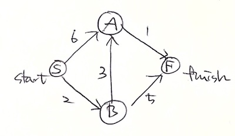
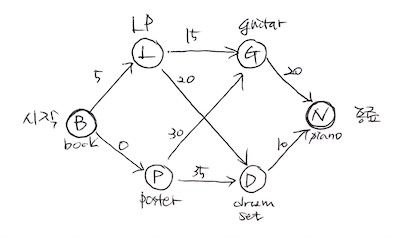

# Grokking Algorithms

# Chapter 5. Quicksort

- 알고리즘은 하나의 유형만을 해결.
- 한편 D&C(Divide and Conquer)는 문제 해결의 생각 도구.
- 어려운 문제를 만나면 "D&C를 쓸 수는 없을까?"를 떠올리기.
- 퀵정렬는 대표적인 D&C.

## Divide & conquer

아래의 농장을 정사각형 모양으로 균등하게 나누고 싶음. 이 정사각형은 가능한 커야 함.


D&C는 크게 2가지 단계.

1. 기저 사례<sup>base case</sup>(가장 단순한 경우) 찾기.
2. 문제가 기저 사례가 될 때까지 문제를 나누고 줄이기.

이를 농장 문제에 적용.

- 일단 기저 사례부터 찾자.
- 세로가 가로의 2배가 되는 경우도 단순.
- 이제 재귀 사례를 생각해 내야 함.
- 1680x640 농장이라고 가정.
- 640x640으로 나눠보면, 400x640 공간이 남게 됨.
- 그럼 이 공간을 대상으로 다시 또 400x400으로 나눠보기. 반복.
- 1680x640 → 400x640 → 240x400 → 160x240 → 80x160 → 0x0
- 마지막에 만난 80x160이 기저 사례.

한 가지 예제 더 다룸. `[2, 4, 6]` 같은 정수형 배열이 주어졌을 때, 이 값들의 총합을 반환.

```py
def sum(arr):
    total = 0
    for x in arr:
        total += x
    return total

print sum([1, 2, 3, 4])
```

위와 같이 할 수도 있겠지만, 재귀 함수를 써보자.

1. Step 1: 기저 사례 찾기. 0 또는 1개 원소만 있는 경우.
2. Step 2: 문제를 기저 사례만큼 계속 나눠보기.


## Quicksort

일단 기저 사례는 2가지.

- 빈 배열
- 원소가 1개인 배열

코드로 나타내면 아래와 같음.

```py
def quicksort(array):
    if len(array) < 2:
        return array
```

2개인 경우를 고민.

- 만약 첫 번째 원소가,
- 두 번째 원소보다 작다면 그대로 두고,
- 크다면 서로 교체.

3개면 어떻게 될까?

- D&C를 사용하고 있으므로,
- 기저 사례가 될 때까지 쪼개기.

이제 퀵정렬를 소개.

- 배열에서 한 원소를 고름.
- 이를 피벗<sup>pivot</sup>이라 부름.
- 이제 이 원소보다 작은 것은 왼쪽으로,
- 큰 것은 오른쪽으로 보냄.
- 이는 파티셔닝이라 불림.
- `[33,15,10]`에서 `33`을 피벗으로 고르면,
- `[15,10]`과 `[]`로 파티셔닝 됨.
- 만약 파티셔닝 된 서브 배열들이 정렬되어 있다면,
- 이 둘을 합치는 것으로 전체 정렬이 됨.
- 원소가 2개인 `[15,10]` 배열과,
- 빈 배열인 `[]`에 대해서는,
- 위에서 얘기한 것처럼 정렬하면 됨.

[GeeksforGeeks에 나온 수도코드](https://www.geeksforgeeks.org/quick-sort/).

```
/* low  --> Starting index,  high  --> Ending index */
quickSort(arr[], low, high)
{
    if (low < high)
    {
        /* pi is partitioning index, arr[pi] is now
           at right place */
        pi = partition(arr, low, high);

        quickSort(arr, low, pi - 1);  // Before pi
        quickSort(arr, pi + 1, high); // After pi
    }
}
```

[코틀린으로 작성했었던 퀵정렬](https://github.com/codehumane/algorithm/blob/master/src/main/kotlin/basic/sort/quicksort.kt)도 참고.

## Big O notation revisited

- 퀵정렬는 피벗으로 무엇을 선택했느냐에 따라 성능이 달라짐.
- 최악의 경우는 O(n^2).
- 선택정렬과 같은 것.
- 평균적으로는 O(n·logn) 소요.
- 한편 병합정렬은 항상 O(n·logn).
- 그렇다면 병합정렬을 써야 하는 건 아닌지 의아할 것.

### Merge sort vs. quicksort

- O(n)의 실제 의미는 c x n.
- 여기서 c는 some fixed amount of time.
- 일반적으로는 c는 의미 없음.
- 그러나 때로는 큰 차이를 만들기도 함.
- 퀵정렬과 병합정렬에서도 이 차이가 의미 있는 수준.
- 둘 다 O(n·logn)이지만 퀵정렬이 빠름.
- 왜 그런지는 [여기](https://www.geeksforgeeks.org/quicksort-better-mergesort/)에 좀 더 설명 되어 있음.
- 부가적 공간이 필요 없고, 최악 케이스는 발생 가능성 적고, 참조 국소성 때문.
- 한편, 병합정렬이 큰 데이터 구조체에서는 더 낫다고 함. 
- 게다가 퀵정렬은 최악의 케이스(n^2)보단 평균 케이스(n·logn)가 주로 일어남.
- 병합정렬 코드는 [여기](https://github.com/codehumane/algorithm/blob/master/src/main/java/sort/MergeSort.java), 퀵정렬은 [여기](https://github.com/codehumane/algorithm/blob/master/src/main/kotlin/basic/sort/quicksort.kt) 참고.

### Average case vs. worst case

- 피벗으로 첫 번째 것을 고르면 느림.
- 가운데 것을 고르면 빠름.
- 이미 정렬된 `[1,2,3,4,5,6,7,8]` 배열이 있다고 가정.
- 첫 번째를 피벗으로 고르면 8번의 콜 스택 발생.
- 가운데 값을 피벗으로 고르면 4번의 콜 스택.
- 그래서 O(n·logn).

# Chapter 7. Dijkstra's algorithm

- 그래프에서 A에서 B로 가는 방법 이야기.
- 경로가 가장 빠른 것과 가장 짧은 것은 서로 다름.
- 만약 각 선마다 소요 시간을 추가한다면,
- 가장 짧은 시간이 걸리는 경로를 찾을 수 있음.
- 더 많은 선을 거치더라도 더 빠를 수 있음.
- 가장 적은 선을 거치는 경로는 BFS로 찾을 수 있음.
- 반면 가장 빠른 경로에는 Dijkstra 알고리즘을 사용.

## Working with Dijkstra's algorithm



Dijkstra 알고리즘은 4단계.

1. 가장 저렴한 노드 찾기
2. 이 노드 이웃들의 비용을 업데이트
3. 그래프의 모든 노드에 대해 이 작업을 반복
4. 최종 경로 계산

이렇게만 보면 다소 어려움. 하나씩 구체적으로 살펴봄.

### Step 1

- 가장 저렴한 노드 찾기.
- 시작점인 S에 있다고 가정.
- A로는 6분이 걸리고,
- B로는 2분이 걸림.
- F까지는 얼마나 걸릴지 아직 알 수 없으니 무한.
- 일단은 B가 가장 가까운 노드.
- 표로 나타내면 아래와 같음.

| node | time to node |
| ---- | ------------ |
| A    | 6            |
| B    | 2            |
| F    | ∞            |

### Step 2

- 이제 B에서 B의 이웃에게 가는 시간을 계산.
- B에서 A로 가는 시간은 3이고,
- B에서 F로 가는 시간은 이제 7임을 알 수 있음.
- 그리고 A로 가는 시간이 S -> A보다 S -> B -> A가 더 적음을 발견.
- 그래서 아래 표와 같이 갱신.
- 이런 식으로 좀 더 짧은 시간이 발견되면 계속 갱신.

| node | time to node |
| ---- | ------------ |
| A    | 6 -> 5       |
| B    | 2            |
| F    | ∞ -> 7       |

### Step 3

- 일단 Step 1을 반복.
- 이제 B 다음으로 가장 비용 적은 노드 찾기.
- 그럼 A.
- 이제 A의 이웃 노드들에 대한 비용 계산.
- 갱신이 일어나야 하는 곳은 A에서 F로의 경로.
- 표에서 F가 7이었는데 A를 거치면 6으로 충분.
- 따라서 아래와 같이 갱신.

| node | time to node |
| ---- | ------------ |
| A    | 6 -> 5       |
| B    | 2            |
| F    | ∞ -> 7 -> 6  |

- 이제 모든 노드에 대해 Dijkstra 알고리즘을 수행한 것.
- F 노드에 대해서는 안 해도 됨.

### Step 4

- 지금까지의 결과로 최종 경로를 계산할 수 있음.
- S -> B -> A -> F

## Terminology

몇 가지 예시를 더 들기에 앞서 용어 정리. 참고로, Dijkstra 알고리즘은 순환이 없는 그래프에서만 동작함. 순환이 없다는 것은 유향 그래프라는 얘기이기도 함.

- 그래프의 각 간선<sup>edge</sup>에 번호가 있었음.
- 이는 가중치<sup>weight</sup>라 부름.
- 그리고 이런 그래프를 가중 그래프라 부름.
- 그래프는 또한 순환<sup>cycle</sup>을 갖기도함.
- 이는 처음 시작한 곳으로 다시 도달할 수 있는 그래프를 말함.
- 마지막으로 유향<sup>directed</sup>과 무향<sup>undirected</sup> 그래프 이야기도.

## Trading for a piano

결국 아래 그림에서 book을 piano로 바꾸는 데 들이는 적은 비용을 찾는 것.



일단 시작 점의 간선 비용들부터 측정. 더불어 이번엔 parent도 함께 관리.

| parent | node | cost |
| ------ | ---- | ---- |
| B      | L    | 5    |
| B      | P    | 0    |
| -      | G    | ∞    |
| -      | D    | ∞    |
| -      | N    | ∞    |

**Step 1**

- 가장 저렴한 노드 찾아야 함.
- 지금은 P.

**Step 2**

- 이제 P에서 이웃 노드로의 비용 측정.
- G, D로의 비용 측정이 가능하며, 이를 표에 반영하면 아래와 같음.

| parent | node | cost |
| ------ | ---- | ---- |
| B      | L    | 5    |
| B      | P    | 0    |
| P      | G    | 30   |
| P      | D    | 35   |
| -      | N    | ∞    |

**Step 1 again**

- P다음으로 저렴한 노드 찾기.
- 5를 가진 L.

**Step 2 again**

- L의 이웃 값들을 모두 갱신.
- 그럼 G와 D인데,
- L에서 G와 D로 가는 값이,
- 기존 비용보다 저렴하므로,
- G, D의 parent와 cost를 모두 갱신.
- 결과는 아래와 같음.

| parent | node | cost |
| ------ | ---- | ---- |
| B      | L    | 5    |
| B      | P    | 0    |
| L      | G    | 20   |
| L      | D    | 25   |
| -      | N    | ∞    |

- 이제 L, P 다음으로 저렴한 G에 대해 Step 1, 2 반복.
- 그럼 N이 아래와 같이 갱신됨.

| parent | node | cost |
| ------ | ---- | ---- |
| B      | L    | 5    |
| B      | P    | 0    |
| L      | G    | 20   |
| L      | D    | 25   |
| G      | N    | 40   |

- 이제 D에 대해 Step 1, 2 반복.
- 이번에도 N이 갱신됨.

| parent | node | cost |
| ------ | ---- | ---- |
| B      | L    | 5    |
| B      | P    | 0    |
| L      | G    | 20   |
| L      | D    | 25   |
| D      | N    | 35   |

- 가장 저렴하게 피아노를 얻으면 35 달러가 됨을 알 수 있고,
- 표의 parent를 보고 경로도 완성할 수 있음.
- B → L → D → N

## Implementation

```py
node = find_lowest_cost_node(costs)

while node is not None:
    cost = costs[node]
    neighbors = graph[node]
    for n in neighbors.keys():
        new_cost = cost + neighbors[n]
        if costs[n] > new_cost:
            costs[n] = new_cost
            parents[n] = node
    processed.append(node)
    node = find_lowest_cost_node(costs)

def find_lowest_cost_node(costs):
    lowest_cost = float("inf")
    lowest_cost_node = None
    for node in costs:
        cost = costs[node]
        if cost < lowest_cost and node not in processed:
            lowest_cost = cost
            lowest_cost_node = node
    return lowest_cost_node
```

# Chapter 8. Greedy algorithms

## The classroom scheduling problem

아래의 수업 목록이 있을 때 가장 많은 수업을 듣기 위한 방법은?

| class | start | end   |
| ----- | ----- | ----- |
| art   | 9     | 10    |
| eng   | 9:30  | 10:30 |
| math  | 10    | 11    |
| cs    | 10:30 | 11:30 |
| music | 11    | 12    |

방법은 간단.

1. 가장 먼저 끝나는 수업을 선택
2. 그 수업이 끝난 뒤 시작하는 것을 고르는데, 이 때도 마찬가지로 가장 먼저 끝나는 대상을 고르면 됨

탐욕 알고리즘은 쉽다고 함. 각 단계에서 최적의 선택을 고르면 됨.

> In technical terms: at each step you pick the locally optimal solution, and in the end you're left with the globally optimal solution.

## The knapsack problem

- 가능한 비싼 물건들을 가방에 넣어야 한다고 가정.
- 35 파운드까지 넣을 수 있는데, 주위를 보니 물건은 총 3개.
- 스테레오 = 3,000달러 30파운드
- 랩탑 = 2,000달러 20파운드
- 기타 = 1,500달러 15파운드
- 앞서 배운 탐욕 알고리즘 대로,
- 일단 가장 비싼 스테레오를 가방에 담음.
- 가방엔 10파운드만 남기에 더 담을 수 없음.
- 그러나 이는 랩탑과 기타를 담은 것 보다 덜 비싼 가격.
- 때로는 완벽함이 적이 됨.
- 괜찮은 정도로 문제를 해결하는 방법이 오히려 도움 될 때도.

## The set-covering problem

문제 설명.

- 미국에서 라디오 쇼를 시작한다고 해보자.
- 가능한 50개 주의 많은 사람들이 듣기를 바람.
- 이를 위해 라디오 스테이션을 선택해야 하는데,
- 스테이션 별로 전송이 가능한 주 집합을 가지고 있음.
- 가장 적은 스테이션을 선택해서 50개 주에 모두 전송하려면?

그리고 한 가지 가능한 방법 이야기.

- 먼저, 스테이션들의 모든 부분 집합을 구하기.
- 이를 멱집합<sup>power set</sup>이라 함.
- 총 2^n 개의 부분 집합이 나오게 됨(2^n - 1 아닌가).
- 이 부분 집합에서, 50개 주를 포함하면서, 가장 적은 수의 스테이션을 가진 것을 선택.
- 하지만 이 방법은 모든 스테이션의 부분 집합을 구해야 하므로,
- 오랜 시간이 걸린다는 단점이 있음.

### Approximate algorithms

근사치 알고리즘.

- 오랜 시간이 걸린다면, 탐욕 알고리즘 생각해 볼 수 있음.
- 우선, 포함되지 않은 주를 가장 많이 다루는 스테이션 고르기.
- 이미 포함된 주를 다시 다루는 것은 상관 없음.
- 다음으로, 모든 주를 다룰 때까지 이를 반복.
- 이를 근사치<sup>approximation</sup> 알고리즘이라고 부름.
- 정확한 해결책을 위해 너무 많은 시간이 필요하다면, 이 근사치 알고리즘이 도움 될 수도.

근사치 알고리즘의 평가.

- 얼마나 빠른지.
- 최적 해결책과 얼마나 근접한지.

정리.

- 위 문제에서는 탐욕 알고리즘이 O(n^2) 시간이 소요.
- 정확한 해결책에서는 O(2^n)이었음.
- 여기서의 n은 라디오 스테이션을 가리킴.
- 탐욕 알고리즘은 간단하므로 생각하기 쉽고,
- 간단하다는 것은 일반적으로 빠르다는 것을 나타냄.

#### Code for setup

- 이 예제에서는 간단함을 위해, 주 부분 집합과 스테이션 부분 집합을 이용.
- 먼저, 포함하고 싶은 주의 목록을 set으로 작성.

```py
states_needed = set(["mt", "wa", "or", "id", "nv", "ut", "ca", "az"])
```

- 다음으로 해시를 이용해 주 별 스테이션 목록을 작성.

```py
stations = {}
stations["kone"] = set(["id", "nv", "ut"])
stations["ktwo"] = set(["wa", "id", "mt"])
stations["kthree"] = set(["or", "nv", "ca"])
stations["kfour"] = set(["nv", "ut"])
stations["kfive"] = set(["ca", "az"])
```

- 그리고 최종 스테이션 집합을 담을 곳이 필요.

```py
final_stations = set()
```

#### Calculating the answer

- 정확한 해결책은 1개 이상.
- 모든 스테이션을 돌며 아직 범위에 포함되지 않은 주를 가장 많이 다루는 것을 선택.

```py
best_station = None
states_covered = set()

for station, states_for_station in stations.items():
    
    #set intersection
    covered = states_needed & states_for_station

    if len(covered) > len(states_covered):
        best_station = station
        states_covered = covered
```

#### Sets

- 셋은 리스트와 유사. 다만 중복 허용 X.
- 셋에 대해 union, inntersection, difference 연산 가능.

#### Back to the code

- 루프 전체 코드는 아래와 같음.

```py
while states_needed:
    best_station = None
    states_covered = set()

    for station, states_for_station in stations.items():
        
        #set intersection
        covered = states_needed & states_for_station

        if len(covered) > len(states_covered):
            best_station = station
            states_covered = covered
    
    states_needed -= states_covered
    final_stations.add(best_station)
```

## NP-complete problems

- set-covering 문제에서 모든 가능한 집합을 계산했었음.
- 이는 1장에서의 여행하는 판매원 문제와 유사.
- 판매원은 5개의 서로 다른 도시를 방문해야 했는데,
- 가장 짧은 경로를 알아내야 했었고,
- 이를 위해 모든 가능한 경로를 계산.

### Traveling salesperson, step by step

- 작게 시작해보자.
- 오직 2개 도시만 있다고 가정.
- 그럼 가능한 경로가 2개가 됨.
- 참고로 시작 도시가 정해져 있는 것은 아님.

### 3 cities

- 도시를 하나 더 추가해보자.
- 그럼 가능한 경로가 6개가 됨.
- 3! 아닌가.

### 4 cities

- 여기서 하나 더 추가해보자.
- 도시가 3개일 때와 비슷한 패턴이 있음.
- 한 도시에서 출발하면, 나머지 3개 도시를 방문하는 것은, 3개의 도시만 있을 때와 동일.
- 4 * (3개 도시의 경우의 수) = 24
- 발견된 패턴은 아래와 같음.

| 도시의 수 | 라우팅 |
| ------- | ---- |
| 1 | 1 |
| 2 | 2 * 1일 때의 라우팅 = 2 |
| 3 | 3 * 2일 때의 라우팅 = 6 |
| 4 | 4 * 3일 때의 라우팅 = 24 |
| 5 | 5 * 4일 때의 라우팅 = 120 |

- 팩토리얼 함수.
- 따라서 N이 커질수록 가능한 라우팅 수는 폭발적으로 늘어남.
- 이것이 왜 정확한 해결책을 찾기 어려운지를 설명.
- 이런 문제들을 가리켜 NP-완전이라 부름.
- NP가 무슨 약어인지 찾아보니 "Nondeterministic Polynomial-time"라고 함.

### How do you tell if a problem is NP-complete?

NP-완전 문제인지 판별은 쉽지 않지만, 다른 문제들과 매우 작은 차이가 있음.

1. 알고리즘이 작은 수의 아이템에 대해선 빠르게 동작하지만, 아이템이 많아질 수록 그 성능이 급격히 낮아짐.
2. "X의 모든 조합"은 종종 NP-완전 문제를 가리킴.
3. 더 작은 조각으로 쪼갤 수 없어 "X의 모든 가능한 버전"을 계산해야 한다면 NP-완전 문제일 수도.
4. 문제가 순서(방문하는 도시 순서 등)를 포함하고 있고 풀기 어려운 경우.
5. 문제가 셋<sup>set</sup>을 가지며 풀기 어려운 경우.
6.set-covering이나 여행하는 판매원 문제로 재해석 할 수 있는 경우.

# Chapter 9. Dynamic programming

## The knapsack problem

- 배낭 문제 다시 소개.
- 가방에 물건들을 넣어 가장 비싼 금액이 되게 하기.
- 용량 제한이 있음에 유의.

| 물건 | 금액 | 무게 |
| --- | --- | --- |
|GUITAR| 1,500 | 1 |
|STEREO| 3,000 | 4 |
|LAPTOP| 2,000 | 3 |

### The simple solution

- brute force.
- 모든 조합을 해보라는 것.
- 물론 느림.
- O(2^n).

### Dynamic programming

- 동적 프로그래밍은 하위 문제들을 먼저 풀어 나가며 전체를 해결하는 방식.
- 위 문제는 이 동적 프로그래밍으로 풀 수 있음.
- 하위 문제 = 좀 더 작은 배낭
- 모든 동적 프로그래밍은 그리드로 시작.
- 아래 그리드에서 컬럼은 배낭의 사이즈(1-4).

|  | 1 | 2 | 3 | 4 |
|--|---|---|---|---|
|GUITAR| | | | |
|STEREO| | | | |
|LAPTOP| | | | |

### The guitar row

기타를 각 크기의 배낭에 넣었을 때 가치를 표에 채우면 됨.

|  | 1 | 2 | 3 | 4 |
|--|---|---|---|---|
|GUITAR| 1,500 | 1,500 | 1,500 | 1,500 |
|STEREO| | | | |
|LAPTOP| | | | |

### The stereo row

- 기타 그리고/또는 스테레오를,
- 각 사이즈에 담았을 때 얻을 수 있는 최대 가격을 넣어주면 됨.
- 첫 번째 로우는 OLD ESTIMATE가 되고,
- 두 번째 로우는 NEW ESTIMATE이며,
- 세 번째 로우가 FINAL SOLUTION이 될 것.

|  | 1 | 2 | 3 | 4 |
|--|---|---|---|---|
|GUITAR| 1,500 | 1,500 | 1,500 | 1,500 |
|STEREO| 1,500 | 1,500 | 1,500 | 3,500 |
|LAPTOP| | | | |

### The laptop row

|  | 1 | 2 | 3 | 4 |
|--|---|---|---|---|
|GUITAR| 1,500 | 1,500 | 1,500 | 1,500 |
|STEREO| 1,500 | 1,500 | 1,500 | 3,000 |
|LAPTOP| 1,500 | 1,500 | 2,000 | 3,500 |

칸(i-row, j-column)을 채우는 공식은 아래와 같음.

```
1. 가 = cell[i-1][j]
2. 나 = 현재아이템가격 + cell[i-1][j-현재아이템무게]
3. max(가, 나)
```

## Knapsack problem FAQ

### What happens if you add an item?

- 갑자기 아이폰이라는 물건을 발견하게 되더라도,
- 동적 프로그래밍의 특성 상 이전 결과를 활용해 아이폰만 다시 계산하면 됨.
- 아이폰 가격이 아래와 같이 추가된다고 가정.

| 물건 | 금액 | 무게 |
| --- | --- | --- |
|GUITAR| 1,500 | 1 |
|STEREO| 3,000 | 4 |
|LAPTOP| 2,000 | 3 |
|IPHONE| 2,000 | 1 |

- 그럼 그리드는 아래와 같이 업데이트 됨.

|  | 1 | 2 | 3 | 4 |
|--|---|---|---|---|
|GUITAR| 1,500 | 1,500 | 1,500 | 1,500 |
|STEREO| 1,500 | 1,500 | 1,500 | 3,000 |
|LAPTOP| 1,500 | 1,500 | 2,000 | 3,500 |
|IPHONE| 2,000 | 3,500 | 3,500 | 4,000 |

### What happens if you change the order of the rows?

상관 없음. 아래는 예시.

|      | 1    | 2    | 3    | 4    |
|------|------|------|------|------|
|STEREO| 0    | 0    | 0    | 3000 |
|LAPTOP| 0    | 0    | 2000 | 3000 |
|GUITAR| 1500 | 1500 | 2000 | 3500 |

### Can you fill in the grid column-wise instead of row-wise?

상관 없음.

### What happens if you add a smaller item?

- 목걸이도 훔칠 수 있다고 가정.
- 근데 이 목걸이는 무게가 0.5이고 가격은 1,000.
- 그럼 단위를 0.5로 하면 됨.
- 기존: 1, 2, 3, 4
- 변경: 0.5, 1, 1.5, ..., 4

### Can you steal fractions of an item?

- 만약 쌀을 훔친다고 했을 때,
- 쌀이 200만큼 있고 가방엔 100만 담을 수 있다면?
- 기존엔 무게가 넘어가는 건 가방에 담을 수 없었음.
- 그러나 쌀은 100만큼만 덜어서 담을 수 있음.
- 이런 경우는 동적 프로그래밍 불가.
- 하지만 탐욕 알고리즘으로 가능.
- 가장 비싼 것을 먼저 최대한 담고, 남은 공간에 그 다음으로 비싼 것을 담고, ...

### Optimizing your travel itinerary

- 배낭 문제의 다른 버전.
- 2일간 런던에서 보낸다고 가정.
- 일단, 할 수 있는 것들의 목록을 아래와 같이 소요시간과 평점으로 정리.

| ATTRACTION | TIME | RATING |
| ---------- | ---- | ------ |
| W          | 0.5  | 7      |
| G          | 0.5  | 6      |
| N          | 1    | 9      |
| B          | 2    | 9      |
| S          | 0.5  | 8      |

- 그리고 동적 프로그래밍을 통해 24점 확인.

|   | 0.5 | 1   | 1.5 | 2   |
| - | --- | --- | --- | --- |
| W | 7   | 7   | 7   | 7   |
| G | 7   | 13  | 13  | 13  |
| N | 7   | 13  | 16  | 21  |
| B | 7   | 13  | 16  | 21  |
| S | 8   | 15  | 21  | 24  |

### Handling items that depend on each other

- A, B 장소가 있고 각각은 1.5일이 걸린다고 가정.
- 그런데 만약 이미 A에 있다면 B로 가는 것은 1일 밖에 안 걸림.
- 즉, A를 먼저 가면 B의 비용이 작아지는 것.
- 이런 종속성이 있는 경우 동적 프로그래밍을 모델링 할 수 있는가?
- 불가능.
- 동적 프로그래밍은 각각의 하위문제가 서로 구분될 때만 가능.

### Is it possible that the solution will require more than two sub-knapsacks?

- 배낭을 하위 배낭 2개를 가질 순 있지만,
- 하위 배낭을 3개를 가질 수 없다는 이야기.
- 하위 배낭이 또 2개의 하위 배낭을 가지는 것은 가능.
- 예컨대 `((a, b) c)` 요런 식.
- `(a, b, c)`는 불가.

### Is it possible that the best solution doesn't fill the knapsack completely?

- 엄청 비싼 무게 3.5짜리 다이아몬드가 있다고 가정.
- 이걸 담으면 비록 0.5 무게가 남지만, 가장 비싼 금액을 채운 것.

## Longest common substring

일단, 동적 프로그래밍 정리.

1. 동적 프로그래밍은 제약이 있는 문제를 최적화 할 때 유용. 배낭 문제에서는 크게 제한이 있는 상태에서, 가장 가격을 높이는 문제였음.
2. 하위 문제로 쪼갤 수 있고 서로 의존성이 없을 때 동적 프로그래밍 사용 가능.

그리고 동적 프로그래밍 해결책이 적용될 만한지 판단하는 데 필요한 팁 이야기.

1. 모든 동적 프로그래밍 해결책은 그리드를 포함.
2. 그리드의 셀 값은 보통 최적화하려는 대상. 배낭 문제에서는 물건들의 가격.
3. 각 셀은 하위 문제이므로, 문제를 하위 문제로 어떻게 나눌지 고민하면 좋음.

이제 다른 예제 소개. 제목처럼 longest common substring이므로 설명은 생략.

### Making the grid

그리드를 어떻게 그릴지 생각하려면, 아래 3개자 질문에 답해야 함.

1. 셀의 값은 뭘까?
2. 문제를 어떻게 하위 문제로 쪼갤까?
3. 그리드의 X-축은 뭘까?

일단 셀의 값.

- 앞에서 얘기했듯이 최적화 하려는 값.
- 여기선 일치하는 연속된 문자열의 길이.

다음으로 하위 문제 쪼개기.

- 하위문자열<sup>substring</sup> 비교.
- hish와 fish 대신 his와 fis를 먼저 비교할 수 있음.

### Filling in the grid

|   | H | I | S | H |
| - | - | - | - | - |
| F | 0 | 0 | 0 | 0 |
| I | 0 | 1 | 0 | 0 |
| S | 0 | 0 | 2 | 0 |
| H | 1 | 0 | 0 | 3 |

### The solution

```
if word_a[i] == word_b[j]:
    cell[i][j] = cell[i-1][j-1] + 1
else:
    cell[i][j] = 0
```

### Longest common subsequence

- 이번엔 substring 말고 subsequence 풀이.
- FOSH와 FISH에 대해 표를 작성하면 아래와 같음.
- 책이랑은 좀 다르게 작성했지만 무관하다고 생각.

|   | F | O | S | H |
| - | - | - | - | - |
| F | 1 | 1 | 1 | 1 |
| I | 0 | 1 | 1 | 1 |
| S | 0 | 0 | 2 | 2 |
| H | 0 | 0 | 0 | 3 |


- 하지만 무관하지 않음. 문제가 됨.
- 아래의 경우를 생각하면 됨.

| \ | a | c | e |
| - | - | - | - |
| a | 1 | 1 | 1 |
| b | 1 | 1 | 1 |
| c | 1 | 2 | 2 |
| d | 1 | 2 | 2 |
| e | 1 | 2 | 3 |

- 책에서 제시하는 공식은 아래와 같음.

```
if word_a[i] == word_b[j]:
    cell[i][j] = cell[i-1][j-1] + 1
else:
    cell[i][j] = max(cell[i-1][j], cell[i][j-1])
```

## Recap

- 동적 프로그래밍은 제약이 있는 문제를 최적화하는데 유용.
- 문제를 서로 독립된 하위 문제로 쪼갤 수 있을 때 동적 프로그래밍 사용 가능.
- 모든 동적 프로그래밍 해결책은 그리드를 가짐.
- 셀의 값은 일반적으로 최적화하려는 대상.
- 각 셀은 하위 문제이므로, 문제를 어떻게 하위 문제로 쪼갤지 생각해야 함.
- 동적 프로그래밍의 모든 문제를 계산하는 단 1개의 공식 같은 것은 없음.

# Chapter 10. K-nearest neighbors
