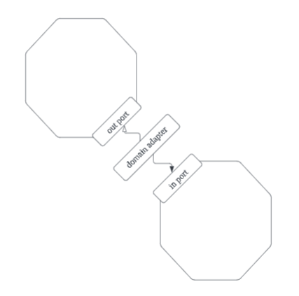

# Get Your Hands Dirty on Clean Architecture 2E

- [1판](../gyhdca/README.md)에 이어 2판도 간단히 정리.
- 달라진 부분만 볼 예정.

# CH1. Maintainability

- 아키텍처의 한 가지 정의는 시스템의 구조.
- 아키텍처는 목적을 가지고 구조를 설계하는 것.
- 목적은 요구사항의 충족.
- 요구사항에는 기능적인 것과 비기능적인 것이 있음.
- 비기능적인 것 중 하나가 유지보수성maintainability.
- 그런데 만약 유지보수성이 기능보다 중요하다면?
- 그리고 비기능적인 것 중에서도 가장 중요하다고 한다면?

## What does maintainability even mean?

- 이상하다고 생각하며 책 덮기 전에,
- 유지보수성이 뭔지 설명할 수 있게 해달라고 하고 있음.
- 유지보수성은 여러 품질 요구사항 중 하나.
- 하지만 매우 특별.
- 챗 GPT가 답변한 품질 요구사항들이 있는데,
- 유지보수성을 챙기면 이 목록들이 어떻게 함께 달성할 수 있는지 설명하고 있음.
- 일단, 유지보수성이 높으면, 바꾸기 쉬움.
- 다른 말로, 비용이 적음.
- 그러니, 필요할 때 확장성, 보안성, 신뢰성, 성능을 높일 수 있음.
- 다른 시스템과의 상호운용성을 갖추기도 쉬움.
- 테스트하기도 쉬움. 작고 단순한 컴포넌트들로 설계 됐을 가능성이 높기 때문.
- 그 외에도 어떤 속성이든 유지보수성과 연결 지을 수 있음.
- 진화하기 쉬우면, 어느 방향이든, 기능적인 것이든 비기능적인 것이든, 쉽게 나아갈 수 있기 때문.
- 소프트웨어 시스템 생애주기에서 변경은 매우 흔한 일.

## Maintainability enables functionality

- 제품 사람들에게(비엔지니어를 가리키는 듯),
- 소프트웨어 프로젝트에 있어 가장 중요한 걸 묻는다면,
- 사용자들에게 전달하는 가치를 꼽음.
- 하지만 이것의 대가가 유지보수성이면 안 됨.
- 유지보수성은 기능의 키 서포터.
- 나쁜 유지보수성은 기능 변경을 점점 어렵게 만듦.
- 예외적인 보이는 경우도 있으나 실체를 알려주고 있음.
- 유지보수성을 위해 꾸준히 작은 사전 설계를 하라는 얘기도 함께 함.
- 큰 사전 설계(BDUFbig design up front)가 아니라.

## Maintainability generates developer joy

- 유지보수성이 개발자를 행복하게 만드는 이점도 있다는 이야기.
- 저자는 여기서 이를 developer joy라 부르는데,
- developer experience 또는 developer enablement라고도 알려져 있다고 함.
- 이는 생산성에 직결되며, 생산성과 만족감은 서로에게 영향.
- 회사에 오래 다니게 만드는 동인이기도.

## Maintainability supports decision-making

- 문제 해결을 위한 선택지는 매우 다양.
- 우리는 매일 직관적으로 어떤 선택을 내리는데,
- 무의식적으로 유지보수성을 고려한 선택을 하고 있음.
- 좀 더 나아가서, 의식적으로 결정할 때에도, 유지보수성을 의사 결정 도구로 사용해 볼 수 있음.

## Maintaing maintainability

- 코드를 바꿀 때 유지보수성을 높이는지 어떻게 알 수 있을까?
- 유지보수성을 꾸준히 관리하려면 어떻게 해야 할까?
- 유지보수성 높은 코드를 만드는 아키텍처를 사용하면 됨.
- 좋은 아키텍처는 코드 베이스를 탐색하기 편하게 만듦.
- 이는 기존 코드를 수정하기에도, 기능을 추가하기에도 좋음.
- 컴포넌트 간 의존성이 단순하고 명확함.
- 즉, 좋은 아키텍처가 유지보수성을 높임.
- 이를 위한 방법으로 헥사고널을 쭉 얘기할 것.
- 당연히 은총알은 없음.
- 소개되는 아이디어를 보고,
- 이를 수정하고 당신의 것으로 만들기를 권장.

# CH13. Managing Multiple Bounded Contexts

- BC는 서로 다른 도메인 간 경계가 있어야 함을 이야기.
- 경계가 없으면 도메인간 의존성이 높아지고,
- 서로 격리되어 발전하지 못하고,
- 함께 변경될 수 밖에 없음.
- 개발자들이 레거시로부터 고통 받는 경우를 보면,
- 불분명한 경계에서 비롯되는 경우가 많음.
- BC를 어떻게 관리해야 할지를 이어서 설명.

## One hexagon per bounded context?

- 일단 BC 별로 헥사고널을 두는 방법이 있음.
- 서로 다른 BC 간 통신에는 출력 포트, 도메인 어댑터, 입력 포트를 사용.

- 글만 보면 매우 명확한 방법.
- 의존을 위해서는 몇 가지 절차를 거치니,
- "by accident" 의존성이 생길 가능성도 낮음.
- 하지만 이 방법은 확장성이 낮음.
- n개의 BC에 대한 의존성은 n-1 + n-2 + ... + 1로 늘어남.
- 2개일 땐 1, 3개일 땐 3, 4개일 땐 6, ...
- 참고로, 순환 참조가 없는 방식일 때의 계산.
- 각 BC를 각자의 헥사고널로 감싸는 것은,
- 그것들이 별개의 애플리케이션(서비스)으로 분리될 준비를 할 때는 합리적.
- 일반적으로는 포트 어댑터가 전체 애플리케이션을 감싸고 있어야.

## Decoupled bounded contexts

- 그렇다면, BC를 서로 어떻게 분리된 상태로 유지할 수 있을까?
- 서로 통신하지 않는 BC들이라면 매우 간단.
- 각자가 전용 in/out 포트를 가지면 됨.
- 어댑터가 BC의 입력 포트들을 알고 호출하는 것.
- 한편, 하나의 "넓은" 입력 포트를 가질 수도 있음.
- 이 경우엔 외부에 BC의 경계가 드러나지 않음.
- 상황에 따라 선택지들을 고르면 됨.
- 하지만, BC 별 입력 포트를 나누는 건 선택적인 것에 반해,
- 출력 포트는 BC 별로 분리해 둘 것을 강력하게 권장.
- 각 BC는 각자의 퍼시스턴트를 가짐.
- 출력 포트를 나누지 않는다면 결합도 문제.
- 데이터베이스 모델이 공유되어 있다면 나중에 BC를 떼어내기 어려움.
- 물리적으로 같은 데이터베이스를 사용하더라도,
- 테이블이나 스키마 단위로 BC의 논리적 구분은 필수.

## Appropriately coupled bounded contexts

- 커플링을 피하면 좋겠지만 실제 세상은 BC간 커뮤니케이션이 일어남.
- 돈거래를 하는 예시로 돌아와 보자.
- 만약, 보안의 이유로, 거래 시 사용자 정보를 로깅해야 한다면?
- 이는 거래 관리 BC에서 사용자 정보를 알아야 한다는 이야기.
- 하지만 사용자 관리 BC에 강하게 결합될 필요는 없음.
- 거래 관리 BC에서는 사용자 정보 전체 대신 ID만 알아도 됨.
- send money 유스 케이스에서는 사용자의 ID만을 받는 것.
- 하지만 거래가 가능한 사용자인지 검증해야 할 수도 있음.
- 그렇다면 사용자의 상태가 바뀔 때 사용자 관리 BC가 도메인 이벤트를 발행하면 됨.
- 거래 관리 BC에서는 이벤트를 수신하다가 검증에 활용할 수 있음.
- 또 다른 방법으로 사용자와 거래 BC간 중재를 담당하는 애플리케이션 서비스를 도입할 수도.
- 이 애플리케이션은 send money 입력 포트를 구현하며,
- 가장 먼저 사용자 관리 BC에게 사용자 상태를 묻고,
- 이 결과를 거래 BC의 send money 유스케이스로 넘겨줄 수 있음.

## How does this help me build maintainable software?

- 코드가 커지면 경계는 반드시 필요.
- 격리된 상태로 두어야 함.
- 헥사고널 아키텍처는 애플리케이션과 외부 세상의 경계를 관리.
- 입출력 포트를 생각하면 됨.
- 하지만, 애플리케이션 내의 경계를 관리하는 것은 아님.
- 육각형 안에서는 자유로움.
- 따라서, 이 안에서 DDD를 활용해 경계를 관리해 나가야 함.

# CH14. A Component-Based Approach to Software Architecture

- 소프트웨어는 미리 요구사항을 알기 어렵고 변하기 쉽상.
- 그래서 우리 아키텍처가 소프트웨어를 유지보수성 있게 만드는지 확인해야 함.
- 유지보수성 있는 코드는 시간이 지나면서 진화하고 외부 요인에 적응.
- 헥사고널 아키텍처는 유지보수성을 위한 큰 전진.
- 애플리케이션과 바깥 세상의 경계를 만들기 때문.
- 애플리케이션 내에서 도메인 코드를 두고,
- 이들을 전용 포트를 통해 바깥 세계에 제공.
- 어댑터는 애플리케이션과 바깥 세상의 언어를 통역.
- 이렇게 함으로써 애플리케이션이 바깥 세상과 독립적으로 진화할 수 있게 함.
- 하지만 헥사고널 아키텍처는 애플리케이션 내의 경계에 대해서는 다루지 않음(다른 아키텍처가 필요).
- 또한 처음 시작하는 이들에겐 헥사고널 아키텍처가 어렵기도 함.
- 그래서 좀 더 단순한 아키텍처 스타일로 시작하기를 권장.
- 바로 컴포넌트 기반 아키텍처.

## Modularity through components

- 유지보수성를 이끄는 주요 동인 중 하나는 모듈화.
- 모듈화는 소프트웨어 시스템을 더 단순한 모듈로 쪼개어 복잡성을 낮춤.
- 모듈은 멘탈 메모리의 크기에 더 적합할 가능성이 높고,
- 인터페이스만 명확히 정의되어 있다면 서로 독립적으로 변화.
- 그런데 모듈이란 무엇일까?
- 모듈이란 용어가 너무 남발되고 있어,
- 저자는 컴포넌트라는 용어를 더 선호한다고 함.
- 이는 특정 기능을 구현하기 위해 충분히 고민 후 모여진 클래스들의 묶음을 가리킴.
- 그리고 이들이 모여 복잡한 시스템을 만들어 냄.
- 다른 컴포넌트들과의 상호작용 시에는 명확히 정의된 API를 활용.
- 외부에 컴포넌트 세부 사항이 노출되지는 않음.
- 컴포넌트는 더 작은 컴포넌트들로 구성될 수도 있음.
- 그림으로 나타내면 아래와 같음.

- 컴포넌트 기반 아키텍처를 아래의 4개 규칙으로 요약.
- 1. 컴포넌트는 전용 네임스페이스가 있고 접근 가능함addressable.
- 2. 컴포넌트는 전용 API와 내부를 가짐.
- 3. 컴포넌트의 API는 바깥에서 호출될 수 있으나 내부는 그렇지 않음.
- 4. 컴포넌트는 내부 요소로 서브 컴포넌트들을 가질 수 있음.

## Case study - building a "Check Engine" component

- 이런 저런 설명인데 그냥 앞선 개념의 구체화.
- [저자의 컴포넌트 예시](https://github.com/thombergs/components-example)도 함께 제공.
- 실제 소프트웨어 프로젝트에서 사용하던 컴포넌트 일부만 가져온 것이라 함.
