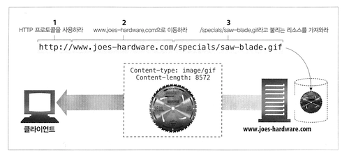
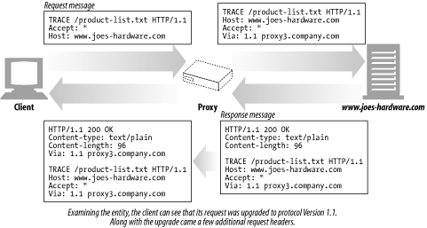
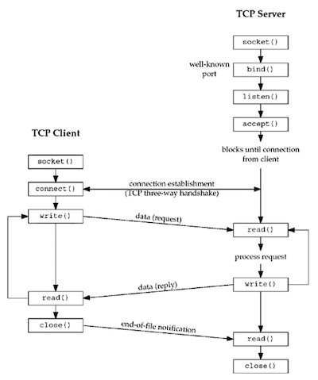
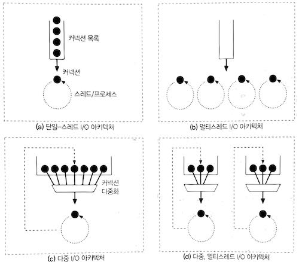

# HTTP 개관

## 웹 클라이언트와 서버 기본 동작

-  `http://www.oreilly.com/index.html` 페이지를 열어볼 때,
-  웹 브라우저는 HTTP를 사용하기로 결정한 뒤,
-  `www.oreilly.com` 서버로 요청을 보냄.
-  서버는 요청 받은 객체인 `/index.html`을 찾고,
-  성공하면 타입과 길이 정보와 함께 HTTP 응답으로 반환.



## 미디어 타입 (MIME)

-  메일의 MIME 방식을 채택해 미디어 타입을 제공.
-  주 타입<sup>primary object type</sup>과 부 타입<sup>specific subtype</sup>으로 이루어짐.

## URI

-  Uniform Resource Identifier의 약어.
-  정보 리소스를 고유하게 식별하고 위치를 지정할 수 있음.
-  결국 클라이언트가 관심 있는 리소스를 쉽게 지목 가능.
-  URL과 URN이 존재함.

## 메시지

-  시작줄, 헤더, 본문으로 이루어짐.
-  시작줄에는 요청의 경우 무엇을 해야 하는지, 응답의 경우 무슨 일이 일어났는지를 명시함.
-  헤더는 0개 이상의 헤더 필드로 이루어짐.


## 브라우저가 멀리 떨어진 서버의 리소스를 사용자에게 보여주는 과정

-  서버의 URL에서 호스트 명 추출.
-  서버의 호스트 명을 IP로 변환.
-  URL에서 포트 번호 추출.
-  웹 서버와 TCP 커넥션 연결.
-  서버에 HTTP 요청 전달.
-  서버로부터 HTTP 응답 수신.
-  커넥션이 닫히면 브라우저에 문서를 보여줌.

## 웹의 구성요소

-  프록시: 클라이언트 요청을 서버에 전달하는 중재자. 주로 보안 목적. 애플리케이션 통합, 성능 최적화 등에도 사용됨.
-  캐시: 프록시에서 자주 찾는 것들을 저장하는 특수한 프록시. 성능 목적.
-  게이트웨이: HTTP 트래픽을 다른 프로토콜로 변환. HTTP 요청을 받아 FTP로 변환하는 등.
-  터널: 두 커넥션 사이의 데이터에 관여치 않고 그대로 전달. 대표적으로, SSL 요청을 받아 뒷 단의 서버에 HTTP로 전달.
-  에이전트: 설명 생략.

# URL과 리소스

## URI, URN 비교

-  개인적으로는 [여기](https://stackoverflow.com/questions/176264/what-is-the-difference-between-a-uri-a-url-and-a-urn) 설명이 좋음.
-  URL은 식별자이고, URI와 URN은 URL의 특수한 형태.
-  URI이 사람 이름이라면, URL은 이 사람을 찾기 위한 주소 같은 것.
-  URN은 이 사람의 이름이 시간과 공간을 초월하여 식별성(유일함)을 가지는 것.

## URL 문법

-  `<스킴>://<사용자 이름>:<비밀번호>@<호스트>:<포트>;<파라미터>?<질의>#<프래그먼트>`
-  여기서 **파라미터**만 좀 더 설명해보면 다음과 같음.
   -  많은 스킴들이 호스트나 경로 정보만으로는 리소스를 찾지 못함.
   -  예컨대, 바이너리와 텍스트를 지원하는 FTP에서, 사용자는 바이너리 이미지가 텍스트 형식으로 전송되지 않길 바람.
   -  이 때, 파라미터를 사용하여 형식을 지정할 수 있음.
   -  파라미터가 사용된 한 예: `http://www.joes-hardware.com/hammers;sale=false/index.html;graphics=true`
   -  `hammers` 경로 조각은 값이 `false`인 `sale` 파라미터를 가짐. `index.html`에는 `graphics`라는 파라미터 사용.

## 상대 URL 해석

-  이 때는 가장 먼저 기저 URL을 찾음. `<BASE>` HTML 태그나 해당 리소스의 URL을 사용.
-  상대 참조 해석에는 **URL 분해하기** 과정을 거치는 등 RFC 2396에 명시된 알고리즘 사용.

## URL의 안전한 전송

-  안전하게 전송되고 가독성을 가질 수 있도록, URL은 알파벳 문자만을 포함해야 함.
-  안전하다는 것은 서로 다른 장치 간의 통신에도 URL 정보가 유실될 위험이 없다는 것.
-  하지만, 알파벳(안전한) 이외의 문자도 전송하고자 하는 요구가 있었음. 이스케이프라는 기능을 추가함.
-  이스케이프: 알파벳 이외의 문자를 변환. 그 결과는 `%` 기호로 시작하는 ASCII 코드로 표현되는 두 개의 16진수 숫자.
-  따라서, `/, ., .., #, ?` 등은 반드시 인코딩 해서 URL로 사용해야 함.
-  이는 이동성과 완성도 모두를 높인 것.
-  가끔 안전하지 않은 문자가 이용되는 것은 잘못된 것.
-  클라이언트 어플리케이션은 안전하지 않은 모든 URL 문자를 인코딩 해야 함.
-  해석하는 측은 URL 디코드.
-  마지막으로, URL의 미래 이야기하면서 URN 언급.

# HTTP 메시지

## 메시지의 흐름

- 트랜잭션 방향을 표현하기 위해 인바운드, 아웃바운드 용어 사용.
- 인바운드와 아웃바운드와 관계 없이, 발송자와 수신자를 구분하기 위해 업스트림, 다운스트림 용어 사용.

## 메시지의 구성

- 시작줄은 이것이 어떤 메시지인지를 서술. 헤더 블럭은 메시지 속성. 본문은 텍스트나 이진 데이터지만, 아예 없을 수도.
- 시작줄과 헤더는 줄 단위로 분리된 아스키 문자열. [CRLF](https://zetawiki.com/wiki/%EA%B0%9C%ED%96%89%EB%AC%B8%EC%9E%90,_%EB%9D%BC%EC%9D%B8%ED%94%BC%EB%93%9C,_%EC%BA%90%EB%A6%AC%EC%A7%80%EB%A6%AC%ED%84%B4) 참고.
  - 각 줄은 캐리지 리턴(ASCII 13)과 개행 문자(ASCII 10)로 구성된 줄바꿈 문자열로 끝남.
  - 견고한 어플리케이션이라면 CR 없는 LF도 받아들일 수 있어야.
- 요청 메시지와 응답 메시지의 형식은 각각 아래와 같음.

```http
GET /hello/world.gif HTTP/1.0
Host: www.joe.com

<메서드> <요청 URL> <버전>
<헤더>

<엔티티 본문>
```

```http
HTTP/1.0 200 OK
Content-Type: image/gif
Content-Length: 8572

<버전> <상태 코드> <사유 구절>
<헤더>

<엔티티 본문>
```

- 버전: `HTTP/<메이저>.<마이너>`로 구성.
- 상태 코드: 첫 번째 자리는 성공이나 에러 등의 일반적 분류.
- 사유 구절<sup>reason-phrase</sup>: 오로지 사람에게 읽히기 위해 존재하는 상태 코드 설명 문구.
- 헤더들: 이름, 콜론(:), 선택적인 공백, 값, CRLF가 순서대로 나타나는 0개 이상의 헤더들.
- 엔티티 본문
  - HTTP가 수송하도록 설계된 것들. 이미지, 비디오, HTML 문서, SW 어플리케이션, 신용카드 트랜잭션, 전자우편 등.
  - 선택적이므로 종종 CRLF로 끝나게 됨. CRLF가 의무지만 호환을 위해 CRLF가 없더라도 받아들여야 함.
- 헤더 분류: 일반/요청/응답/엔티티/확장 헤더. 이 중 엔티티 헤더는 본문 크기와 컨텐츠, 리소스 그 자체 등을 서술.
- 헤더는 아래 처럼 여러 줄로 표현 가능함. 이 때는 최소 하나의 스페이스 혹은 탭 문자 와야 함.

```http
HTTP/1.0 200 OK
Content-Type: image/gif
Content-Length: 8572
Server: Test Server
  Version 1.0
```

## 메서드

- HTTP 버전 1.1과 호환되야 한다면, GET과 HEAD 메서드 구현만으로 충분.
- 안전한 메서드<sup>Safe Method</sup>란, HTTP 요청 결과로 인해 서버에 어떤 작용도 없음을 의미.
- GET, HEAD가 안전한 메서드일 수 있음. 보장은 아님.
- HTTP를 확장한(따라서 HTTP/1.1 명세에 없는) 메서드 정의 가능. CalDAV 구현시에는 `MKCAL`, `REPORT` 등을 봤음.

### HEAD

- HEAD는 GET처럼 행동. 단, 응답으로 헤더만을 돌려줌.
- 따라서, 서버 개발 시 HEAD의 응답 헤더가 GET의 그것과 정확히 일치되도록 해야 함.
- HEAD가 존재하는 이유는 아래와 같음.
    - 리소스를 가져오지 않고도 타입 등을 알아내거나,
    - 상태 코드로 개체의 존재 여부를 확인하거나,
    - 리소스 변경 여부를 알 수 있음.

### TRACE

-  클라이언트가 자신의 요청이 서버에 어떻게 전달되고 돌아오는지를 진단.
-  TRACE 요청은 목적지 서버에서 [루프백<sup>loopback</sup>](http://www.terms.co.kr/loopback.htm) 진단을 시작.
-  진단을 위한 사용은 괜찮지만, 중간 애플리케이션이 요청을 일관되게 다룬다고 가정하는 문제가 있음.
-  예를 들어, 프락시는 POST 요청은 서버로 통과시키고 GET 요청은 웹 캐시 같은 다른 서버로 전달하기도 함.
-  아래는 TRACE 과정을 보여주는 그림. 출처는 [여기](http://webreference.com/programming/http/chap3/2/3.html).



### OPTIONS

- 특정 리소스가 어떤 메서드를 지원하는지 질의.
- 아래는 서버의 모든 리소스에 대한 클라이언트 질의의며, 서버는 자신의 리소스에 지원되는 메소드의 목록을 반환.

```http
OPTIONS * HTTP/1.1
Host: www.joe.come
Accept: *
```

```http
HTTP/1.1 200 OK
Allow: GET, POST, PUT, OPTIONS
Context-length: 0
```

## 상태 코드

### 2XX

201 Created
- 리소스 생성 요청(PUT 등)에 대한 응답.
- 생성된 리소스에 대해 `Location` 헤더와 함께 참조를 위한 URL들을 엔티티 본문에 담아야 함.

202 Accepted
- 요청은 받아들여 졌으나, 아직 서버는 요청 받은 동작을 수행 X.
- 언제 완료할지 보장 없음. 단지 요청을 받아들이기에 적법함을 나타냄.
- 본문 엔티티에 가급적 언제 요청 처리가 완료될지 추정이라도 명시해야.

204 No Content
- 엔티티 본문 포함하지 않음. 웹브라우저를 새 문서로 이동시키지 않고 갱신하는 경우 사용.

205 Reset Content
- 브라우저를 위해 사용되는 또 하나의 코드. 현재 HTML 폼에 채워진 값을 비우라는 명령.

206 Partial Content
- 부분 또는 범위 요청이 성공함을 알림.
- `Content-Range, Date`은 반드시 포함.
- `Etag, Content-Location ` 중의 하나도 반드시 포함해야 함.

### 3XX

- 리소스를 얻을 수 있는 다른 위치를 알려주거나, 리소스 내용 대신 다른 응답 제공.
- 리소스가 옮겨진 경우 `Location` 헤더를 명시해 위치를 알려줌. 브라우저는 이를 해석 후 알아서 이동.

300 Multiple Choices
- 동시에 여러 리소스를 가리키는 URL을 요청한 경우, 리소스의 목록과 함께 응답.
- HTML 문서를 영어, 프랑스어 등의 버전으로 제공하는 경우 유용.
- 사용자는 이 중 하나를 선택. 서버가 권장하는 URL을 `Location`에 명시할 수도.

301 Moved Permanently
- 요청한 URL이 옮겨짐을 알림. `Location` 헤더에 현재 리소스가 위치한 URL 명시.

302 Found
- 301과 동일하지만, `Location`의 값은 임시.
- 이후의 요청에서는 원래 URL 사용해야 함.

303 See Other
- 주로 POST에 의해 생성된 새로운 리소스 위치를 알려주는 용도.

304 Not Modified
- [여기](https://developer.mozilla.org/ko/docs/Web/HTTP/Status/304) 설명이 더 괜찮음.

> The HTTP 304 Not Modified client redirection response code indicates that there is no need to retransmit the requested resources. It is an implicit redirection to a cached resource. This happens when the request method is safe, like a GET or a HEAD request, or when the request is conditional and uses a If-None-Match or a If-Modified-Since header.
>
> The equivalent 200 OK response would have included the headers `Cache-Control`, `Content-Location`, `Date`, `ETag`, `Expires`, and `Vary`.

305 Use Proxy

- 리소스가 반드시 프락시를 통해 접근되야 함을 명시.

307 Temporary Redirect

- 302와 유사. 차이는 [여기](https://developer.mozilla.org/ko/docs/Web/HTTP/Status/307) 잘 설명됨.
- POST 요청시 303을 받으면, `Location`에 명시된 URL을 GET으로 호출 가능. 307 응답되면, 원래의 메서드 유지해야 함.

> The only difference between 307 and 302 is that 307 guarantees that the method and the body will not be changed when the redirected request is made.

### 4XX

405 Method Not Allowed

- 요청에 `Allow` 헤더를 포함하여 요청한 리소스에 어떤 메서드가 사용 가능한지 질의 가능.

406 Not Acceptable

- 요청에 명시된 종류의 리소스를 서버가 반환할 수 없음.
- 이 매개변수는 [`Accept-Charset`](https://developer.mozilla.org/en-US/docs/Web/HTTP/Headers/Accept-Charset) 혹은 [`Accept-Language`](https://developer.mozilla.org/en-US/docs/Web/HTTP/Headers/Accept-Language)에 명시됨.

408 Request Timeout

- 요청을 완수하기엔 너무 시간이 많이 걸림.
- 서버마다 타임아웃 값이 다르지만, 대개 충분한 길이를 허용한다.

409 Conflit

- 요청이 리소스에 대해 일으킬 수 있는 충돌을 가리킴.
- 예컨대, 업로드 하려는 파일의 버전이 서버의 버전보다 낮은 경우.

410 Gone

- 404와 같지만 한 때 그 리소스가 존재했음.
- 리소스의 부재가 일시적인지 영구적인지 알 수 없다면 404를 사용해야 함. 여기 [참고](https://developer.mozilla.org/ko/docs/Web/HTTP/Status/410).

411 Length Required

- 요청에 `Content-Length`가 있을 것을 서버가 요구.

그 외

- 413 Request Entity Too Large
- 414 Request URI Too Long
- 415 Unsupported Media Type: 지원되지 않는 페이로드 포맷.
- 416 Request Range Not Satisfiable

### 5XX

- 4XX가 클라이언트 요청이 잘못됨을 나타내는 데 반해,
- 5XX는 서버에서 에러가 발생했음을 가리킴.

501 Not Implemented

- 요청한 메서드를 서버가 지원하지 않음.
- 405는 리소스에 대한 메서드를 지원하지 않음에 유의.

502 Bad Gateway

- 게이트웨이나 프록시 서버가 업스트림 서버로부터 비정상 응답을 받음.

503 Service Unavailable

- 현재 서버가 요청을 처리할 수 없음. 나중에는 가능함.
- 로드 밸런서의 용량이 부족하거나, 등록된 혹은 정상적인 인스턴스가 없음.
- `Retry-After` 헤더를 응답에 포함시켜 언제 리소스가 사용 가능한지 명시 가능.

504 Gateway Timeout

- 408과 유사. 게이트웨이나 프록시 서버가 업스트림 서버에서 응답을 기다리다가 타임아웃 발생.

505 Version Not Supported

- 지원하지 않는 버전의 프로토콜 요청을 받음.

## 헤더

### 일반헤더

- 클라이언트와 서버 모두에서 사용되는 일반적인 헤더.
- `Date`: 메시지가 만들어진 날짜와 시간.
- `Connection`: 현재 전송이 완료된 후의 네트워크 접속 유지 여부. 예컨대, `keep-alive`, `close`.
- `Transfer-Encoding`: 수신자에게 엔티티에 어떤 인코딩이 적용되었는지 알림. `chunked`, `deflate`, `gzip` 등. 1개 이상 나열할 때는 쉼표로 구분. [여기](https://developer.mozilla.org/ko/docs/Web/HTTP/Headers/Transfer-Encoding) 자세히 설명됨.
- `Via`: 메시지가 어떤 중개자(프록시, 게이트웨이)를 거쳐 왔는지 보여줌.
- `Cache-Control`: 캐시 지시자<sup>directive</sup>를 지정하기 위한 메커니즘. 단방향성. 즉, 요청의 지시자와 응답의 그것이 같음을 보장하지 않음. HTTP/1.1에서 정의됨.
  - `public`, `private`
    - 단일 사용자를 위한 캐시인지 여부.
    - 단일 사용자를 위한 것이 아니라면, 브라우저가 아닌 프록시나 CDN 등에서 캐시 가능함.
    - 아래 그림이 이해에 도움됨.
  - `no-cache`, `no-store`
    - `no-store`는 항상 원 서버에서 리소스를 다운로드 함.
    - `no-cache`는 복사된 사본을 보여주기 전에, 유효성 검사 토큰(ETag)을 이용해 원 서버로 재검증 요청을 보냄.
  - `max-age=<second>`
    - 리소스를 요청한 시간으로부터 최대 몇 초까지 재활용할 수 있는지를 명시.
  - `must-revalidate`
    - 캐시 사용에 앞서 리소스의 신선 여부를 검증할 것.


*그림 출처: https://mdn.mozillademos.org/files/13769/HTTPVary.png

### 요청헤더

- `Host`, `Client-IP`, `Referer`, `User-Agent` 등.
- Accept 관련 헤더
  - 서버에게 자신의 선호와 능력을 알림.
  - 서버는 좀 더 똑똑한 대응 가능하며 양측 모두에 이익.
  - `Accept`: 서버가 보내도 되는 미디어 종류를 알려줌.
  - 그 외 `Accept-Charset`, `Accept-Encoding`, `Accept-Language` 등.
- 조건부 요청 헤더
  - 요청에 제약을 명시. 예컨대, 자신이 가진 리소스와 달라진 경우에만 응답을 달라고 명시하기도.
  - `If-Match`: 문서의 엔티티 태그가 주어진 엔티티 태그와 일치하는 경우에만 문서 가져옴.
  - `If-Modified-Since`: 주어진 날짜 이후 리소스가 변경된 경우만 문서 가져옴.`
  - `If-None-Match`: 문서의 엔티티 태그가 주어진 그것과 일치하지 않는 경우에만 문서 가져옴.
  - `If-Range`: 문서의 특정 범위에 대한 요청.
  - `Range`: 서버가 범위 요청을 지원한다면, 리소스의 특정 범위를 요청.
- 요청 보안 헤더
  - HTTP가 자체적으로 가진 인증요구/응답 체계를 활용.
  - `Authorization`: 클라이언트가 서버에게 제공하는 인증 그 자체의 정보를 담음.
  - `Cookie`: 클라이언트가 서버에게 토큰 전달 시 사용. 진짜 보안 헤더는 아님. 하지만 보안에 영향.
  - `Cookie2`: 요청자가 지원하는 쿠키의 버전 명시.
  - 아래는 `github.com`에 요청 날린 경우의 요청 헤더 `Cookie` 값.

```http
Cookie:_octo=GH1.1.1719295668.1500787962; logged_in=yes; dotcom_user=XXX; _ga=GA1.2.169219981.1500787962; user_session=XXX; __Host-user_session_same_site=XXX; tz=Asia%2FSeoul; _gh_sess=XXX
```

### 응답 헤더

- 클라이언트에게 부가 정보를 제공. 누가 보낸 응답인지, 능력은 어떻게 되는지 등.
- `Age`: 응답이 얼마나 오래되었는가.
- `Retry-After`: 현재 리소스가 사용 불가이며, 언제 가능한지를 명시하는 날짜 혹은 시각.
- `Server`: 서버 어플리케이션의 이름과 버전.
- `Vary`: 서버가 확인해 봐야 하는, 그렇기 때문에 응답에 영향을 줄 수 있는 헤더들의 목록.
  - `github.com` 응답 헤더에는 `Vary:X-PJAX Vary:Accept-Encoding`가 포함됨.
- `Proxy-Authenticate`: 프록시에서 클라이언트로 보낸 인증요구 목록.
- `Set-Cookie`, `Set-Cookie2`
- `Allow`: 현재 엔티티에 대해 수행될 수 있는 요청 메소드 나열.
- `Location`: 엔티티가 실제로 위치한 URL 등의 정보.
- `Content-Type`, `Content-Encoding`, `Content-Language`, `Content-Length`, `Content-Location`, `Content-MD5`, `Content-Range`
- `ETag`: 엔티티 태그
- `Expires`: 이 엔티티가 더 이상 유효치 않아 원본을 다시 받아와야 하는 일시.
- `Last-Modified`: 엔티티가 변경된 가장 최근 일시.


# 커넥션 관리

## TCP 커넥션

-  몇몇 사용 규칙을 제외하곤 HTTP 커넥션은 TCP 커넥션에 불과.
-  프로토콜 계층은 HTTP/TCP/IP/Network Interface로 이루어짐.
-  TLS 또는 SSL은 HTTP와 TCP 사이에 있는 암호화<sup>cryptographic encryption</sup> 계층.
-  TCP는 HTTP에게 신뢰할 만한(한쪽의 바이트들을 반대쪽으로 순서에 맞게 정확히 전달) 통신 방식 제공.
-  TCP는 데이터 스트림을 세그먼트라는 단위로 나눔.
-  이를 IP 패킷(또는 IP 데이터그램)이라는 봉투에 담아 인터넷을 통해 데이터 전달.
-  다르게 표현하면, 각 TCP 세그먼트는 하나의 IP 주소에서 다른 IP 주소로 IP 패킷에 담겨 전달.
-  IP 패킷의 구성은 다음과 같음.
   -  IP 패킷 헤더: 보통 20바이트. 발신자와 목적지 IP 주소, 크기, 기타 플래그를 가짐.
   -  TCP 세그먼트: 보통 20바이트. TCP 포트 번호, TCP 제어 플래그, 데이터의 순서와 무결성 검사 목적의 숫자 값 포함.
   -  TCP 데이터 조각: 0 이상의 바이트. 말 그대로 데이터.
-  TCP 커넥션의 식별: `<발신지 IP 주소, 발신지 포트, 수신지 IP 주소, 수신지 포트>`
-  TCP 소켓 인터페이스를 사용한 클라이언트와 서버의 상호작용은 아래 그림 참고.



*출처: https://notes.shichao.io/unp/figure_4.1.png

이 때 사용된 소켓 API 각각을 아래 표 참고.

| 소켓 API                       | 설명                                                       |
| ------------------------------ | ---------------------------------------------------------- |
| `s=socket(<parameters>)`       | 연결되지 않은 익명의 새로운 소켓 생성                      |
| `bind(s, <local IP:port>)`     | 소켓에 로컬 포트 번호와 인터페이스 할당                    |
| `connect(s, <remote IP:port>)` | 로컬의 소켓과 원격의 호스트 및 포트 사이에 TCP 커넥션 생성 |
| `listen(s, ...)`               | 커넥션 받아들이기를 허용함을 로컬 소켓에 표시              |
| `s2 = accept(s)`               | 누군가 로컬 포트에 커넥션 맺기를 기다림                    |
| `n = read(s, buffer, n)`       | 소켓으로부터 버퍼에 `n`바f이트 읽기 시도                   |
| `n = write(s, buffer, n)`      | 소켓으로부터 버퍼에 `n`바이트 쓰기 시도                    |
| `close(s)`                     | TCP 커넥션을 완전히 끊음                                   |
| `shutdown(s, <side>)`          | TCP 커넥션의 입출력만 닫음                                 |
| `getsockopt(s, ...)`           | 내부 소켓 설정 옵션값 읽기                                 |
| `setsockopt(s, ...)`           | 내부 소켓 설정 옵션값 설정                                 |

## TCP의 성능에 대한 고려

### HTTP 트랜잭션 지연

-  대부분의 HTTP 지연은 TCP 네트워크 지연 때문에 발생한다고 함.
-  클라이언트 혹은 서버가 너무 많은 데이터를 내려받거나, 복잡하고 동적인 자원을 실행하지 않는 한.
-  HTTP 트랜잭션이 처리되는 절차는 아래와 같음. 그림 함께 참고.
   1. 최근 방문한 호스트가 아니라면, DNS resolution 인프라를 이용해 호스트를 IP로 변환해야 함.
   2. TCP 커넥션 요청을 서버에게 보내고, 허가 응답을 회신하기를 기다림.
   3. 커넥션이 맺어지면 새로 생성된 TCP 파이프라인을 통해 HTTP 요청을 전송함.
   4. 서버는 전달받은 HTTP 요청을 처리함. 그리고 처리 결과를 클라이언트에게 응답.


*그림 출처: http://blog.catchpoint.com/2010/09/17/anatomyhttp/

### 성능 관련 주요 요소

1. TCP 커넥션 핸드셰이크 지연
2. 인터넷 혼잡을 제어하기 위한 TCP 느린 시작<sup>slow-start</sup>
3. 데이터를 한데 모아 전송하기 위한 네이글<sup>nagle</sup> 알고리즘
4. TCP의 편승<sup>piggyback</sup>을 위한 확인응답<sup>acknowledgment</sup> 지연 알고리즘
5. TIME_WAIT 지연과 포트 고갈

### TCP 커넥션 핸드셰이크 지연


*그림 출처: http://asfirstalways.tistory.com/356

-  위 그림은 TCP 핸드셰이크 과정을 표현함.
   1. 커넥션 생성을 요청한다는 의미로, `SYN`이라는 플래그가 담긴 작은 TCP 패킷(보통 40~60바이트)을 서버에게 보냄.
   2. 서버는 몇 가지 커넥션 매개변수 산출 뒤, `SYN`과 `ACK` 플래그가 포함된 TCP 패킷을 응답하여, 커넥션 요청이 받아들여졌음을 알림.
   3. 클라이언트는 커넥션이 잘 맺어졌음을 알리기 위해 서버에게 다시 확인응답 신호를 보냄.
-  다만, 오늘날의 TCP에서는 클라이언트가 확인응답 패킷과 함께 데이터를 보낼 수 있음.
-  ACK 패킷은 작은 이미지가 담긴 HTML 또는 304 Not Modified 데이터를 담을 수 있을 만큼 크기가 큼.
-  즉, 커넥션 핸드셰이크의 비용이 결코 작지 않음.


### 확인응답 지연

-  인터넷은 패킷 전송을 완벽하게 보장 X. 예컨대, 인터넷 라우터는 과부하 시, 패킷을 마음대로 파기 가능.
-  그래서 TCP는 데이터 전송 보장을 위해 자체적으로 확인 체계 사용.
   -  세그먼트에 순번과 데이터 무결성을 위한 체크섬 포함.
   -  세그먼트를 온전히 받은 수신자는 확인응답 패킷을 송신자에게 반환.
   -  일정 시간 안에 확인응답을 받지 못한 송신자는 문제가 있다고 판단하고 데이터를 다시 전송.
-  이 때의 확인전송을 효과적으로 하기 위해, [확인응답 지연<sup>TCP delayed acknowledgement</sup>](https://en.wikipedia.org/wiki/TCP_delayed_acknowledgment) 알고리즘 사용.
   -  크기가 작은 확인응답을 데이터 패킷에 편승<sup>piggyback</sup>시키는 것.
   -  확인응답을 버퍼에 저장하고 송출 데이터 기다림.
   -  일정 시간(0.1 ~ 0.2초) 이내에 발견되면 편승. 그렇지 못하면 확인응답만 송출.
-  하지만 HTTP는 요청과 응답으로만 이뤄짐. 오히려 지연이 발생됨.

### TCP 느린 시작(Slow Start)

-  인터넷의 급작스러운 부하와 혼잡 방지를 위해, TCP가 한 번에 전송할 수 있는 패킷 수를 제한.
-  패킷이 성공적으로 전달될 때 마다 전송 가능 수를 늘릴 수 있음. 1 -> 2 -> 4 -> ...
-  책에서는 이를 가리켜, '혼잡 윈도우를 연다<sup>opening the congestion window</sup>'고 표현.
-  [Slow Start](https://en.wikipedia.org/wiki/TCP_congestion_control#Slow_start), [Congestion Window](https://en.wikipedia.org/wiki/TCP_congestion_control#Congestion_window) 함께 참고.

### 네이글(Nagle) 알고리즘과 TCP_NODELAY

-  TCP 세그먼트에는 40바이트 상당의 플래그와 헤더가 포함됨.
-  따라서, 크기 1바이트를 TCP 스택으로 전송하는 것은 비효율적일 수 있음.
-  [Silly window Syndrome](https://en.wikipedia.org/wiki/Silly_window_syndrome)라는 용어는 1바이트의 패킷을 대량으로 전송하는 것을 가리킴.
-  이를 극복하기 위해 만들어진 것이 [Nagle 알고리즘](https://en.wikipedia.org/wiki/Nagle%27s_algorithm).
   -  세그먼트가 최대 크기(LAN 상으로 1,500, 인터넷 상으로 수백 바이트)가 되지 않으면 전송하지 않음.
   -  단, 모든 패킷이 확인응답을 받은 경우는 최대 크기 이하의 패킷 전송 허용.
-  하지만 크기가 작은 HTTP 패킷에게는 불필요한 기다림이 될 수도. 추가적인 요청이 없을지도 모르니.
-  확인응답 지연과 결합되면 더 큰 지연이 발생.
-  Nagle 알고리즘 비활성시키고자, HTTP 스택에 TCP_NODELAY 파라미터 값을 설정하기도 함.

### TIME_WAIT의 누적과 포트 고갈

-  TCP 커넥션 종단에서는 커넥션이 끊겼을 때 커넥션의 IP 주소와 포트 번호를 메모리의 작은 제어영역에 기록.
-  같은 주소와 포트 번호의 TCP 커넥션을 재사용하기 위함.
-  이 커넥션은 보통 2분(`2MSL`라고 불리는 기간) 동안 유지.
-  일반적으로는 문제 안되지만, 한 개의 클라이언트와 웹 서버가 있고, 성능 테스트를 한다고 가정.
-  TCP 커넥션을 위한 값(`<발신지 IP 주소, 발신지 포트, 목적지 IP 주소, 목적지 포트`) 중에서 달라질 수 있는 유일한 부분은 `발신지 포트`임.
-  하지만, 사용할 수 있는 발신지의 포트는 제한되어 있음.
-  2MSL초 동안 커넥션 재사용이 불가하므로, 발신지 포트가 60,000개라고 가정할 때, 초당 500개로 커넥션이 제한됨. (60,000 / 120 = 500)

## HTTP 커넥션 관리

### 종종 잘못 이해되는 Connection 헤더

-  [`Connection` 헤더](https://developer.mozilla.org/en-US/docs/Web/HTTP/Headers/Connection)는 현재 커넥션 만을 위한 정보. [홉별<sup>hop-by-hop</sup>](https://en.wikipedia.org/wiki/Hop-by-hop_transport) 헤더라고도 표현.
-  따라서, 첫 번째 프록시(혹은 그 외의 홉)는 이 헤더를 소비해야 하며, 다운스트림으로 포워딩 X.
-  그 외 홉 헤더로는 [`Keep-Alive`](https://developer.mozilla.org/ko/docs/Web/HTTP/Headers/Keep-Alive), [`Transfer-Encoding`](https://developer.mozilla.org/ko/docs/Web/HTTP/Headers/Transfer-Encoding), [`TE`](https://developer.mozilla.org/ko/docs/Web/HTTP/Headers/TE), [`Connection`](https://developer.mozilla.org/ko/docs/Web/HTTP/Headers/Connection), [`Trailer`](https://developer.mozilla.org/ko/docs/Web/HTTP/Headers/Trailer), [`Upgrade`](https://developer.mozilla.org/ko/docs/Web/HTTP/Headers/Upgrade), [`Proxy-Authorization`](https://developer.mozilla.org/ko/docs/Web/HTTP/Headers/Proxy-Authorization) 그리고 [`Proxy-Authenticate`](https://developer.mozilla.org/ko/docs/Web/HTTP/Headers/Proxy-Authenticate)가 있음.


### 순차적 트랜잭션 처리에 의한 지연

-  앞서 설명한 것처럼 매번 커넥션을 맺고 끊는 것은 비용.
-  또한, 사용자는 이미지 등의 리소스가 동시에 로드 되는 것을 선호. 비록 총 소요시간이 더 길지라도.
-  특정 브라우저는 객체의 크기를 알아야 화면에 배치할 수 있음. 즉, 모든 리소스 받을 때까지 텅빈 화면.
-  그래서 4가지 기법 소개.
   -  병렬<sup>parallel</sup> 커넥션: 여러 개의 TCP 커넥션
   -  지속<sup>persistence</sup> 커넥션: TCP 커넥션 재사용
   -  파이프라인<sup>pipeline</sup> 커넥션: 공유 TCP 커넥션을 통한 병렬 HTTP 요청
   -  다중<sup>multiplexed</sup> 커넥션: 요청과 응답들에 대한 중재 (experimental)

## 병렬 커넥션

-  당연히 더 빠르지만, 항상 그런 것은 아님.
-  예를 들어, 네트워크 대역폭이 좁거나, 응답 서버 혹은 프록시의 커넥션이 부족할 수 있음.
-  또한, TCP 느린 시작으로 인한 성능 저하, 메모리 소모도 발생.
-  특정 클라이언트로부터 과도한 커넥션이 맺어진 경우, 서버는 이를 임의로 끊어버릴 수도.
-  브라우저는 병렬 커넥션을 사용함. 하지만, 대부분 6~8개 정도만을 허용. [여기](https://odetocode.com/articles/743.aspx) 내용 참고.

>  These days we don't have to work quite as hard to achieve more than 2 parallel connections because most user agents use a different set of heuristics when deciding on how many parallel connections to establish.

## 지속 커넥션

-  웹 클라이언트는 사이트 지역성<sup>site locality</sup>을 가짐.
-  이는 다수의 리소스를 가져올 때 대부분 동일한 서버로 요청함을 가리킴.
-  HTTP 요청이 끝나도 커넥션을 계속 유지하는 것을 가리켜 [지속<sup>persistence</sup> 커넥션](https://en.wikipedia.org/wiki/HTTP_persistent_connection)이라 부름.
-  병렬 커넥션에 비해 다음과 같은 장점이 있음.
   -  커넥션 맺기 위한 사전 작업과 지연을 줄여줌.
   -  튜닝된 커넥션을 유지함. (TCP 느린 시작이 끝났으므로)
   -  커넥션 수도 줄여줌.
-  하지만, 잘못 관리할 경우 수많은 커넥션이 쌓일 가능성 있음.
-  이는 클라이언트와 서버 모두 불필요한 리소스 낭비.
-  따라서, 적은 수의 병렬 커넥션만을 맺고 그것을 유지하는 것이 일반적.
-  HTTP/1.0+에서는 Keep-Alive 커넥션을, HTTP/1.1에서는 '지속' 커넥션을 이용함.

### HTTP/1.0+의 Keep-Alive 커넥션

-  `keep-alive`는 HTTP/1.1 명세에서 빠짐. 하지만 많은 웹 애플리케이션이 하위호환을 지원.
-  클라이언트는 요청 헤더에 `Connection: Keep-Alive` 포함.
-  서버에서 커넥션 유지를 허용하고자 할 경우 응답 헤더에 동일한 필드를 포함시킴.
-  허용한다고 하더라도 언제든지 끊을 수 있고, 허용하는 트랜잭션 수를 제한할 수도.
-  `timeout`이나 `max`등의 `Keep-Alive` 헤더를 추가로 사용하기도.
-  참고로, 본문의 길이를 정확히 알아야 커넥션을 유지할 수 있음.
-  다시 말해서, 정확한 `Content-Length` 값과 함께 멀티파트 미디어 형식<sup>multiplart media type</sup>을 가지거나,
-  청크 전송 인코딩<sup>chunked transfer encoding</sup>으로 인코드 되야 함을 의미.
-  멍청한<sup>dumb</sup> 프록시를 우회하기 위해 `Proxy-Connection`을 활용하기도 함.

```properties
Connection: Keep-Alive
Keep-Alive: max=5, timeout=120
```

### HTTP/1.1의 지속 커넥션

-  HTTP/1.1에서는 지속 커넥션이 기본으로 활성화.
-  커넥션을 끊기 위해서는 `Connection: close` 헤더를 명시해야 함.

## 파이프라인 커넥션

-  지속 커넥션을 이용. 여러 개의 요청을 보내고, 응답이 오기 전까지 큐에 넣어둠.
-  자세한 내용과 그림은 [여기](https://developer.mozilla.org/ko/docs/Web/HTTP/Connection_management_in_HTTP_1.x) 참고.
-  파이프라인의 사용에는 많은 제약이 따름.
-  당연히 지속 커넥션을 사용할 수 있어야 하고,
-  HTTP는 메시지에 순번을 매길 수 없으므로 요청 순서와 맞게 응답이 와야 하며,
-  실패시 언제든 요청은 재생될 수 있으므로 멱등성을 보장하는 메소드(GET, HEAD, PUT, DELETE 등)를 사용해야 함.
-  또한, 많은 프록시와 서버들이 파이프라이닝을 제대로 지원하지 못함. 이로 인해, 모던 브라우저들은 이 기능을 활성화 시키지 않음.

## 커넥션 끊기에 대한 미스터리

- 어떠한 HTTP 클라이언트, 서버, 프락시든 언제든지 TCP 커넥션을 끊을 수 있음.
- 예컨대, 지속 커넥션이 일정 시간 유휴상태에 빠지면 서버는 커넥션을 끊음.
- 하지만, 클라이언트가 데이터 전송을 하지 않음을 보장할 수 X.
- HTTP 응답은 본문의 크기를 정확히 나타내는 `Content-Length` 헤더를 포함해야 함.
- 커넥션은 언제든 끊어질 수 있으므로, 응답을 받았을 때 정상적으로 받은 것인지 확인하기 위함.
- 트랜잭션을 처리하는 도중에 커넥션이 끊길 수 있으므로, 커넥션을 다시 맺고 트랜잭션을 재시도하는 메커니즘 필요.
- 다만, 여러 번 실행되더라도 같은 결과를 보장하는 멱등성<sup>idempotent</sup>이 보장되어야.
- TCP의 `close()` 호출은 입력과 출력 채널 모두를 끊는 '전체 끊기'.
- TCP의 `shutdown()` 호출은 입력이나 출력 채널 하나만을 끊는 '절반 끊기'.
- 일반적으로는 커넥션의 출력 채널만을 '절반 끊기'하는 것이 안전함.
- 책에서 '우아한 커넥션 끊기'라 부르는 것은 '서버 출력의 절반 끊기'를 말함.
- 이미 끊긴 입력 채널에 클라이언트가 데이터를 전송하면, 서버의 OS는 `connection reset by peer`라는 메시지를 응답.
- 대부분의 OS는 이를 심각한 에러로 취급하여 버퍼에 저장된, 아직 읽히지 않은 모든 데이터를 삭제함.


# 웹 서버

## 간단한 펄 웹서버

```perl
#!/usr/bin/perl

use Socket;
use Carp;
use FileHandle;

# (1) 8080 포트를 기본으로 사용. 명령줄로 덮어쓰기 가능.
$port = (@ARGV ? $ARGV[0] : 8080);

# (2) 로컬 TCP 소켓을 생성하고 커넥션을 LISTEN
$proto = getprotobyname('tcp');
socket(S, PF_INET, SOCK_STREAM, $proto) || die;
setsockopt(S, SOL_SOCKET, SO_REUSEADDR, pack("l", 1)) || die;
bind(S, sockaddr_in($port, INADDR_ANY)) || die;
listen(S, SOMAXCONN) || die;

# (3) 시작 메시지 출력
printf("    <<Type-O-Serve Accepting on Port %d>>>\n\n", $port);

while (1)
{
    # (4) 커넥션 C를 기다림
    $cport_caddr = accept(C, S);
    ($cport,$caddr) = sockaddr_in($cport_caddr);
    C->autoflush(1);
    
    # (5) 누구로부터의 커넥션인지 출력
    $cname = gethostbyaddr($caddr, AF_INET);
    printf("    <<<Request From '%s'>>>\n", $cname);
    
    # (6) 빈 줄이 나올 때까지 요청 메시지 읽어서 출력
    while ($line = <C>)
    {
        print $line;
        if ($line =~ /^\r/) { last; }
    }
    
    # (7) 응답 메시지를 위한 프롬프트 만들고, 응답줄을 입력 받음
    #     "." 하나만으로 된 줄이 입력되기 전까지, 입력된 줄을 클라이언트에게 응답
    printf("    <<<Type Response Followed by '.'>>>\n");
    
    while ($line = <STDIN>)
    {
        $line =~ S/\r//;
        $line =~ S/n//;
        if ($line =~ /^\./) { last; }
        print C $line . "\r\n";
    }
    
    close(C);
}
```

## 웹 서버가 하는 일

**단계 1: 클라이언트 커넥션 수락**

- 웹 서버는 TCP 커넥션을 요청 받으면 이를 수락하고, 어떤 클라이언트인지 확인을 위해 IP를 추출.
- 새 커넥션이 맺어지고 받아들여지면, 커넥션 목록에 연결된 커넥션을 추가하고, 오가는 데이터를 지켜보기 위한 준비.
- 어떤 커넥션이든 마음대로 거절하거나 닫을 수 있음.
- 어떤 웹 서버들은 클라이언트 IP 주소나 호스트 명이 인가되지 않았거나 악의적인 것으로 알려진 경우 커넥션을 닫음.
- 웹 서버는 일반적으로 리버스 DNS를 사용해서 클라이언트의 IP 주소를 호스트 명으로 변환.
- 이 호스트로 접근 제어와 로깅에 활용하기도.
- 하지만 hostname lookup은 많은 시간이 걸림.
- 그래서 대용량 웹 서버는 호스트 명 분석을 꺼두거나 특정 컨텐츠에 대해서만 허용.
- IETF ident 프로토콜로 사용자 이름을 확인하기도 하나 많은 클라이언트 PC가 이를 지원하지 않고 HTTP 트랜잭션을 유의미하게 지연시키는 등의 여러 이유로 공공 인터넷에서는 동작 X.

**단계 2: 요청 메시지 수신**

- 커넥션에 데이터가 도착하면, 데이터를 읽어 들이고 파싱하여 요청 메시지를 구성.
  - 메서드, URI, 버전번호(HTTP/1.1)을 찾음. 각 값은 스페이스로 구분. CRLF로 끝남.
  - 메시지 헤더들을 읽어들임. 각 메시지 헤더 또한 CRLF로 종료.
  - 헤더의 끝은 CRLF로 끝나는 빈줄임.
  - 요청 본문이 있으면 읽어들임. 길이는 `Content-Length` 헤더로 명시.
  - 요청 메시지를 파싱할 때, 웹 서버는 입력 데이터를 네트워크로부터 불규칙적으로 받음. 또한 네트워크 커넥션은 언제라도 무효화 될 수 있음. 그래서, 파싱해서 이해 가능한 수준의 분량을 확보할 때까지 메시지 일부를 메모리에 임시 저장할 필요가 있음.
- 메시지 내부 표현. 읽어들인 메시지를 효율적으로 다루기 위한 자료구조에 저장.
- 서버마다 여러 커넥션을 처리하기 위한 아키텍처를 선택함. 아래 그림 참고. 주로 다중 I/O 아키텍처 선택.



**단계 3: 요청 처리**

- 요청으로부터 메서드, 리소스, 헤더, 본문을 얻어내어 처리.
- POST를 비롯한 몇몇 메서드는 요청 메시지에 엔티티 본문이 있는 것을 요구.
- OPTIONS를 비롯한 다수의 메서드는 본문을 허용하되 요구는 X.
- GET과 같이 본문을 금지하는 메서드도 있음.

**단계 4: 리소스 매핑, 접근**

- 리소스 매핑의 가장 단순한 형태는 요청 URI를 웹 서버의 파일 시스템 안에 있는 파일 이름으로 사용.
  - 일반적으로 웹 서버 파일 시스템의 특정 폴더를 웹 컨텐츠를 위해 예약. docroot라 불림.
  - URI를 이 문서 루트에 붙여서 파일을 찾음.
  - 가상 호스팅 된 docroot. 하나의 서버에서 URI나 Host 헤더 등으로 문서 루트를 식별하고 하위에서 컨텐츠 찾음.
  - 사용자 홈 디렉토리 docroots 방식도 있음. 특별한 것은 아님.
  - 디렉토리를 가리키는 URL 요청을 받으면 아래 중 하나를 취함.
    - 에러 반환.
    - 디렉토리 대신 특별한 '색인 파일' 반환.
    - 디렉토리 탐색 내용을 HTML 페이지로 반환.
    - 대부분은 디렉토리 안에 있는 `index.html`을 찾아서 반환.
    - 혹은 아파치 웹 서버 등에서 이 특별한 '색인 파일'을 `DirectoryIndex index.html index.htm home.html home.htm index.cgi`와 같이 명시하기도 함.
    - 편하긴 하지만, 드러나지 않아도 될 파일이 노출될 위험이 있음.
- URI를 동적 컨텐츠 리소스 매핑에 사용할 수도. 흔히 아는 그것.
- [SSI](https://httpd.apache.org/docs/2.4/ko/howto/ssi.html)<sup>Server-Side Includes</sup>. 내용은 생략.
- 웹 서버는 리소스에 접근 제어를 할당할 수도. 클라이언트의 IP 주소에 근거하여 제어할 수도 있고, 리소스 접근을 위한 비밀번호를 물어볼 수도 있음.

**단계 5: 응답 만들기**

- 리소스가 식별 되었으면, 서버는 요청 메서드로 서술되는 동작을 수행한 뒤 응답 메시지 반환.
- 응답 엔티티
  - 트랜잭션이 응답 본문을 생성할 수도.
  - 본문이 있다면 아래 2가지 헤더도 함께 메시지에 포함.
    - 본문의 MIME 타입을 서술하는 Content-Type 헤더.
    - 본문의 길이를 서술하는 Content-Length 헤더.
- MIME 타입
  - 웹 서버에게는 응답 본문의 [MIME 타입](https://developer.mozilla.org/ko/docs/Web/HTTP/Basics_of_HTTP/MIME_types)을 결정해야 하는 책임이 있음.
  - 아래는 MIME 타입과 리소스를 연결하는 4가지 방법.
    - mime.types: 파일 이름의 확장자로 MIME 타입을 판단.
    - 매직 타이핑<sup>Magic typing</sup>: 파일 내용을 검사하여 알려진 패턴에 대한 테이블(매직 파일)이 있는지 확인. 느리긴 하지만 표준 확장자 없이 이름 지어진 경우에 유리.
    - 유형 명시<sup>Explicit typing</sup>: 파일 확장자나 내용에 상관 없이 어떤 MIME 타입을 갖도록 명시.
    - 유형 협상<sup>Type negotiation</sup>: 웹 서버가 한 리소스가 여러 종류의 문서 형식에 속하도록 설정할 수 있는데, 이 때 사용자와의 협상을 통해 가장 좋은 형식을 제공.
- 리다이렉션
  - 종종 성공 메시지 대신 리다이렉션 응답을 반환.
  - 요청 수행을 위해 브라우저가 다른 곳으로 가도록 안내하는 것.
  - 응답 상태 코드는 3XX.
  - Location 응답 헤더에 새로운 또는 선호하는 위치의 URI를 포함.
  - 리다이렉트는 아래 경우에 유용.
    - 영구히 리소스가 옮겨진 경우. 301 Moved Permanently.
    - 임시로 리소스가 옮겨진 경우. 303 See Other 또는 307 Temporary Redirect.
    - URL 증강. 종종 문맥 정보를 포함시키기 위해 재 작성된 URL로 리다이렉트 하는 것. 303 See Other 또는 307 Temporary Redirect.
    - 부하 균형. 현재 서버가 과부하라면, 부하가 덜 걸린 서버로 리다이렉트 할 수도. 303 See Other 또는 307 Temporary Redirect.
    - 웹 서버가 사용자에 대한 정보를 가지고 있을 수도 있는데, 서버가 클라이언트의 정보를 가진 다른 서버로 안내하기도. 303 See Other 또는 307 Temporary Redirect.
    - 디렉터리 이름 정규화. 디렉터리 이름에 대한 URI를 요청하는데 끝에 /를 빠뜨렸다면 이를 추가한 URI로 리다이렉트.

**단계 6: 응답 보내기**

- 서버는 여러 클라이언트에 대한 많은 커넥션을 가질 수 있음.
- 어떤 연결은 아무것도 하지 않고 있고, 어떤 것은 서버로 데이터를 보내고 있으며, 어떤 것은 클라이언트로 응답을 내리고 있을 수도.
- 서버는 커넥션 상태를 추적해야 하고 비지속적 커넥션이라면 메시지를 모두 전송했을 때 커넥션을 닫으면 됨.
- 지속적 커넥션이라면 서버가 Content-Length를 바르게 계산하기 위해 특별한 주의를 필요로 하는 경우거나, 클라이언트가 응답이 언제 끝나는지 알 수 없는 경우, 커넥션은 열린 상태 유지.

**단계 7: 로깅**

- 트랜잭션이 완료되면 로그를 로그파일에 기록.

# 캐시

## 캐시가 주는 이점

- 불필요 데이터 전송을 줄임.
- 네트워크 병목을 줄임.
- 갑작스런 요청 쇄도에 의한 과부하를 줄임.
- 거리로 인한 지연 감소.

## 캐시 히트와 미스

### 재검사<sup>revalidation</sup>

- 원 서버 컨텐츠는 변경될 수 있음.
- 따라서 사본이 여전히 최신인지를 서버를 통해 때때로 점검해야.
- 이러한 '신선도 검사'를 HTTP 재검사라 부름.
- 캐시(서버)는 원한다면 언제든 사본 재검사 가능.
- 하지만 문서를 수백만 개씩 가지곤 하는데 비해 네트워크 대역폭은 부족.
- 따라서 사본이 검사를 할 필요가 있을 정도로 충분히 오래된 경우에만 재검사.
- 재검사 요청을 보냈지만 컨텐츠가 바뀌지 않았다면, 원 서버는 304 Not Modified를 응답.
- 캐시는 사본이 신선함을 알 수 있게 되고 이 사본을 클라이언트에 제공.
- 이를 재검사 적중 또는 느린 적중이라 부름.
- 원 서버와 함께 검사를 하기 때문.
- 순수 캐시 적중보다는 느린 것.
- 물론 캐시 부적중<sup>miss</sup> 보다는 빠름.
- HTTP는 캐시된 객체 확인을 위해 If-Modified-Since 헤더를 주로 사용.
- 서버에게 보내는 GET 요청에 이 헤더를 추가하면 캐시된 이후에 변경된 경우에만 사본을 보내달라는 의미.

### 적중률

- 책에서는 오늘날 적중률 40%면 웹 캐시로 괜찮은 편이라고 소개.
- 정말? 주어진 상황마다 기대값이 다를테니 참고 정도로만.
- 문서 적중률과 더불어 바이트 적중률도 이야기.
- 경우에 따라서 바이트 단위 적중률이 더 의미 있을 수도.

### 적중과 부적중의 구별

- HTTP는 클라이언트에게 응답이 캐시 적중이었는지 아니면 원 서버 접근이었는지를 말해주지 않음.
- 개인적으로는 필요한지도 의문.
- 두 경우 모두 200 OK 응답.
- 어떤 서버들은 Via 헤더에 추가 정보를 붙이기도.
- 또 한 가지 방법은 Date 헤더를 이용하는 것.
- 응답의 Date 헤더 값(응답의 생성일)을 현재 시각과 비교하는 것.
- 혹은 응답이 얼마나 오래되었는지를 알려주는 Age 헤더를 이용.

## 캐시 토폴로지

- 개인 전용 캐시와 공용 캐시로 나눌 수 있음.
- 개인 전용은 한 명에게만 할당된 캐시. 예컨대, 웹 브라우저.
- 공용 캐시는 사용자 집단에게 자주 쓰이는 페이지를 담음. 주로 프락시 서버를 사용.
- 프락시 계층을 둘 수도 있음.
- 같은 지역 네트워크를 사용하는 레벨 1에서 캐시를 먼저 찾고, 없으면 광역 통신망의 레벨 2 캐시에서 찾는 것. 여기에도 없으면 광역 통신망의 원 서버에게 질의.

## 캐시 처리 단계

1. 요청 받기 - 도착한 요청 메시지를 캐시가 읽어 들임.
2. 파싱 - 메시지 파싱해서 URL과 헤더 추출.
3. 검색 - 로컬 복사본이 있는지 검사. 없으면 사본을 받아와서 로컬에 저장.
4. 신선도 검사 - 사본이 충분히 신선한지 검사. 신선하지 않다면 서버에게 변경사항을 질의.
5. 응답 생성 - 클라이언트에 맞추어, 새로운 헤더와 캐시된 본문으로 응답 메시지 생성. 참고로, Date 헤더는 객체가 원 서버에서 최초로 생겨난 일시를 표현해야 함.
6. 발송 - 응답을 클라이언트에게 전송.
7. 로깅 - 트랜잭션을 로그파일에 선택적으로 남김. 캐시 적중과 부적중 횟수, URL 등.

## 사본을 신선하게 유지하기

- HTTP는 어떤 캐시가 사본을 갖고 있는지 서버가 기억하지 않더라도,
- 캐시된 사본이 서버와 충분히 일치하도록 유지하게 해주는 단순한 메커니즘을 갖고 있음.
- 바로 문서 만료와 서버 재검사.

### 문서 만료, 유효기간, 나이

- [Cache-Control](https://developer.mozilla.org/ko/docs/Web/HTTP/Headers/Cache-Control)과 [Expires](https://developer.mozilla.org/ko/docs/Web/HTTP/Headers/Expires) 헤더를 통해 문서의 유효기간을 나타낼 수 있음.
- 컨텐츠가 얼마나 오랫동안 신선한 상태를 보일 수 있는지를 좌우.

### 재검사

- 캐시된 문서가 만료 != 원 서버에 현재 존재하는 것과 복사본이 다름
- 대신, 이제 검사할 시간이 되었음을 나타냄.
- 이 검사를 '서버 재검사'라고 부름.
- 재검사 결과 변경이 있었다면, 캐시는 그 문서의 새로운 사본을 가져와 저장한 뒤 클라이언트에 반환.
- 재검사 결과 변경이 없었다면, 캐시는 새 만료일 등의 새 헤더들만 가져와서 캐시 안의 헤더들을 갱신.
- HTTP의 '조건부 GET' 요청 사용하여, 원 서버와 캐시가 갖고 있는 것이 서로 다른 경우에만 객체 본문을 보내달라고 할 수 있음.
- 예를 들어, [If-Modified-Since](https://developer.mozilla.org/ko/docs/Web/HTTP/Headers/If-Modified-Since)를 사용.
- IMS<sup>If-Modified-Since</sup>는 원 서버 응답 헤더의 `Last-Modified` 헤더와 함께 동작.
- 이 때의 비교는 날짜 비교가 아닌, 단순히 문자열 일치 여부를 비교하는 것임에 유의.
- "이 날짜 이후로 변경되었다면"이 아니라, "정확히 이 날짜에 마지막 변경이 일어난 것이 아니라면"인 것.
- IMS는 다음의 몇 가지 제약이 있음.
  - 어떤 문서는 일정 시간 간격으로 다시 쓰여지지만 실제로는 같은 데이터일 수 있음.
  - 어떤 문서들의 변경은 전 세계의 캐시들이 새로 읽어들이기에는 너무 사소한 것일 수 있음. (철자나 주석의 변경)
  - 어떤 서버들은 변경 일시를 정확하게 판별할 수 없음.
  - 1초보다 작은 간격으로 갱신되는 문서를 제공할 때는 1초의 정밀도가 부족할 수 있음.
- 이를 극복하기 위해 날짜 대신 엔티티의 버전 값을 사용하기도.
- 바로 [ETag](https://developer.mozilla.org/en-US/docs/Web/HTTP/Headers/ETag).
- 헤더는 [If-None-Match](https://developer.mozilla.org/ko/docs/Web/HTTP/Headers/If-None-Match).

### 캐시 제어

- `Cache-Control`에 `no-cache` 또는 `no-store`를 지정하면, 캐시가 응답의 사본을 만드는 것을 금지.
- 더 정확히는, 로컬 캐시에는 저장되더라도 서버와 먼저 재검사 하지 않고는 클라이언트로 제공할 수 없음.
- "Do-Not-Serve-From-Cache-Without-Revalidation" 이름이 더 나은 이름 아니었을지.
- `max-age`에 대한 설명은 [여기](https://developers.google.com/web/fundamentals/performance/optimizing-content-efficiency/http-caching?hl=ko#max-age)가 더 좋다고 생각됨.
- 이 값을 0으로 설정하면 캐시가 매 접근마다 문서를 캐시하거나 리프레시 하지 않도록 요청할 수 있음.
- `Expires` 헤더는 초 단위의 시간 대신 실제 만료 날짜를 명시.
- 많은 서버들이 동기화가 안 되어 있거나 부정확한 시계를 갖고 있다는 점에서 유용.
- 캐시가 성능 개선을 이유로 만료된 객체를 제공할 수도 있음.
- 만약, 엄격하게 만료 정보를 따르길 원한다면 `must-revalidate`을 사용.
- 캐시가 must-revalidate 신선도 검사 시도 시, 원 서버가 사용 불가한 상태라면 캐시는 504 Gateway Timeout error를 반환해야 함.
- `Cache-Control: max-age`나 `Expires` 헤더 모두 없다면 캐시는 경험적인 방법<sup>heuristic</sup>으로 최대 나이를 계산.
- 예컨대, LM 인자 알고리즘은, 문서에 최근 변경 일시가 포함된 경우, 이 값이 얼마나 자주 바뀌는지를 추정에 사용.
- 마지막 변경 일자가 오래 되었다면, 안정적 문서로 간주하고 캐시에 오래 보관. 최근에 변경되었다면 자주 변경된다고 추정 후 짧은 기간만 캐시.