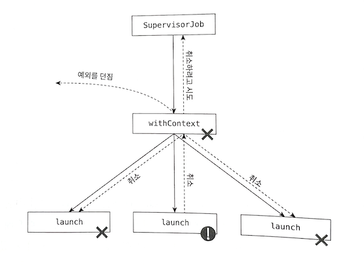

# 코틀린 코루틴

별 기대 없이 읽었는데, 8장까지 읽어도 계속 재밌어서, 기록도 함께 진행.

# 6장. 코루틴 빌더

- 중단 함수는 컨티뉴에이션 객채를 다른 중단 함수로 전달해야 함.
- 따라서, 중단 함수의 일반 함수 호출은 가능하지만, 일반 함수의 중단 함수 호출은 불가.
- 중단 함수를 시작하는 지점이 바로 코루틴 빌더.
- launch, runBlocking, async

## launch 빌더

```kt
fun main() {
    GlobalScope.launch {
        delay(1000L)
        println("World!")
    }
    GlobalScope.launch {
        delay(1000L)
        println("World!")
    }
    GlobalScope.launch {
        delay(1000L)
        println("World!")
    }
    println("Hello,")
    Thread.sleep(2000L)
}
// Hello,
// 1초 경과
// World!
// World!
// World!
```

- launch 함수는 CoroutineScope 인터페이스의 확장 함수.
- CoroutineScope 인터페이스는 구조화된 동시성의 핵심.
- 다만, 현업에서는 GlobalScope 사용을 지양해야 함.

## runBlocking 빌더

- 코루틴은 스레드를 블로킹하지 않고 작업을 중단시키기만 하는 것이 일반적.
- 하지만 때로는 블로킹이 필요하며, 이 때 runBlocking 사용.
- 새로운 코루틴 실행 후 이것이 완료될 때까지 현재 스레드를 중단.
- 하지만 현재는 거의 사용되지 않음.
- 단위 테스트에서도 runTest가 주로 사용됨.
- 메인 함수는 runBlocking 대신 suspend를 붙여 중단 함수로 만드는 것이 일반적.

## async 빌더

- launch와 비슷한데 값을 생성하도록 설계.
- Deferred<T>를 반환함.
- Deferred는 await를 가짐.
- 아래 출력 시간 주의.

```kt
fun main() = runBlocking {
    val res1 = GlobalScope.async {
        delay(1000L)
        "Text 1"
    }
    val res2 = GlobalScope.async {
        delay(3000L)
        "Text 2"
    }
    val res1 = GlobalScope.async {
        delay(2000L)
        "Text 3"
    }
    println(res1.await())
    println(res2.await())
    println(res3.await())
}
// 1초 후
// Text 1
// 2초 후
// Text 2
// Text 3
```

# 9장. 취소

- 단순히 스레드를 죽이면 연결을 닫고 자원을 해제할 수 없음.
- 상태가 여전히 액티브인지 자주 확인하는 것도 좋지 않음.
- 코루틴이 제시하는 취소<sup>cancellation</sup>은 간단하고 편리하고 안전.

## 기본적인 취소

- `Job` 인터페이스는 `cancel` 메서드를 가짐.
- 이는 아래의 효과를 가짐.
  - 첫 번째 중단점에서 잡을 끝냄.
  - 자식 잡이 있다면 함께 취소. 부모는 영향 X.
  - 취소된 잡은 새로운 코루틴의 부모로 사용될 수 없음.
  - Cancelling 상태였다가 Cancelled 상태로 바뀜.
- `CancelationException`의 서브 타입을 함께 인자로 넘겨줄 수 있음.
- `cancel` 후 `join`을 호출하는 것이 일반적이며, 취소가 완료될 때까지 중단됨.
- 이것 없으면 경쟁 상태가 발생할 수도.
- `Job#cancelAndJoin`이라는 편의성 확장 함수도 있음.
- `Job()` 팩토리 함수로 생성된 잡도 같은 방법으로 취소할 수 있으며,
- 잡에 딸린 여러 코루틴을 한 번에 취소할 때 자주 사용됨.

## 취소는 어떻게 작동하는가?

- 잡이 취소되면 'Cancelling' 상태로 바뀌고,
- 상태 바뀐 뒤의 첫 번째 중단점에서 `CancellationException` 예외를 던짐.
- `finally` 블럭에서 이 예외를 잡아 자원을 정리하는 것이 좋음.

## 취소 중 코루틴을 한 번 더 호출하기

- 코루틴 취소 후처리 과정에 제한이 있을까?
- 자원을 정리해야 한다면 계속해서 실행될 수 있음.
- 그러나 정리 과정 중 중단을 허용치는 않음.
- 'Cancelling' 상태에서 중단이나 다른 코루틴 시작 불가.
- 시작하려고 하면 무시됨.
- 그런데 만약 DB 롤백 등 중단 함수를 호출해야 한다면?
- 이 때는 `withContext(Noncancellable)`로 포장.

```kt
suspend fun main(): Unit = coroutineScope {
    val job = Job()
    lanch(job) {
        try {
            delay(200)
            println("Coroutine finished")
        } finally {
            println("Finally")
            withContext(NonCancellable) {
                delay(1000L)
                println("Cleanup done")
            }
        }
    }
    delay(100)
    job.cancelAndJoin()
    println("Done")
}
// Finally
// Cleanup done
// Done
```

## invokeOnCompletion

- 자원 해제의 또 하나의 방법.
- `Job#invokeOnCompletion` 호출하기.
- Completed나 Cancelled 같은 마지막 상태 도달 시 호출될 핸들러를 지정하는 것.

```kt
suspend fun main(): Unit = coroutineScope {
    val job = lanch {
        delay(1000)
    }
    job.invokeOnCompletion { exception: Throwable? ->
        println("Finished")
    }
    delay(400)
    job.cancelAndJoin()
}
// Finished
```

## 중단될 수 없는 걸 중단하기

- 중단점이 없어서 취소가 불가한 경우의 대응을 이야기.
- 아래 코드는 `delay`` 대신 `Thread.sleep`을 사용해서 중단점이 없음.

```kt
supend fun main(): Unit = coroutineScope {
    val job = Job()
    lanch(job) {
        repeat(1_000) { i ->
            Thread.sleep(200) // 이 대신 파일 읽기나 무거운 연산이 있어도 마찬가지
            println("Prnting $i")
        }
    }
    delay(1000)
    job.cancelAndJoin()
    println("Cancelled successfully")
    delay(1000)
}
// 중단점이 없기에,
// Printing이 1초까지만 찍히지 않고,
// 3분 넘게 계속 일어남.
```

- 이런 상황에 대한 대처법 중 하나로, 주기적인 `yield()` 호출이 있음.
- 중단점을 강제로 중간 중간 넣어주는 것.
- 다른 방법은, 잡의 상태를 추적하는 것.
- `CoroutineScope#isActive`를 이용.
- 마지막 방법은, 잡이 액티브 상태가 아닐 경우 `CancellationException`을 던지는 `ensureActive()` 함수를 사용하는 것.
- `yield`에 비해서는 `ensureActive()`의 역할이 더 경량이므로 좀 더 선호됨.
- `yield`는 스코프가 필요치 않고, 중단하고 재개하는 일을 하므로, 스레드 풀을 가진 디스패처 사용 시 스레드가 바뀔 수 있는 문제 있음.

## suspendCancellableCoroutine

- `suspendCoroutine`과 비슷하지만,
- 컨티뉴에이션 객체를 `CancellableContinuation<T>`로 래핑함.
- 몇 가지 메서드가 추가된 래핑이며 `invokeOnCancellation` 메서드가 가장 중요.
- 라이브러리의 실행을 취소하거나 자원 해제 시 사용함.

```kt
suspend fun someTask() = suspendCancellableCoroutine { cont ->
    cont.invokeOnCancellation {
        // 정리 작업 수행
    }
    // 나머지 구현
}
```

# 10장. 예외 처리

- 코루틴은 예외가 발생하면 자기 자신을 취소하고 부모로 전파(launch).
- 부모는 자기 자신과 자식들을 모두 취소 후 부모에게 예외 전파(runBlocking).
- runBlocking은 부모가 없기에 프로그램을 종료시킴. 그리고 예외를 바깥으로 다시 던짐.

## 코루틴 종료 멈추기

- 예외로 인해 코틀린이 종료될 수 있는데, 이 종료를 멈추는 방법에 대한 이야기.
- 당연한 얘기지만, 코루틴 빌더를 try-catch로 래핑하는 건 도움 안 됨.

```kt
fun main(): Unit = runBlocking {
    try {
        launch {
            delay(1000)
            throw Error("Error")
        }
    } catch (e: Throwable) {
        println("이건 출력 안 됨")
    }

    launch {
        delay(2000)
        println("이것도 출력 안 됨")
    }
}
```

### SupervisorJob

- 코루틴 종료를 멈추는 방법으로 SupervisorJob을 권장.
- 이를 이용하면 자식에서 발생한 모든 예외를 무시할 수 있음.
- 위험해 보이기도 함. 언제 써야 할지, 언제 쓰지 말아야 할지, 고민해야 함.

```kt
fun main(): Unit = runBlocking {
    val scope = CoroutineScope(SupervisorJob())

    scope.launch {
        delay(1000)
        throw Error("Some error")
    }

    scope.launch {
        delay(2000)
        println("Will be printed")
    }

    delay(3000)
}
// Exception...
// Will be printed
```

- 혹은 아래와 같이 할 수도.

```kt
fun main(): Unit = runBlocking {
    val job = SupervisorJob()

    launch(job) {
        delay(1000)
        throw Error("Some error")
    }

    launch(job) {
        delay(2000)
        println("출력 됨")
    }

    job.join()
}
```

- 아래는 안 됨.
- SupervisorJob은 단 하나의 자식만 가짐.

```kt
fun main(): Unit = runBlocking {
    launch(SupervisorJob()) {
        launch {
            delay(1000)
            throw Error("Some error")
        }

        launch {
            delay(2000)
            println("출력 안 됨")
        }
    }

    delay(3000)    
}
// Exception
```

### SupervisorScope

- 또 다른 방법으로 코루틴 빌더를 SupervisorScope로 래핑하는 것이 있음.
- 부모와의 연결은 유지하면서 다른 코루틴에서 발생한 예외는 무시할 수 있어 편리.

```kt
fun main(): Unit = runBlocking {
    supervisorScope {
        launch {
            delay(1000)
            throw Error("에러")
        }

        launch {
            delay(2000)
            println("출력 됨")
        }
    }

    delay(3000)
    println("완료")
}
// Exception...
// 출력 됨
// 1초 후
// 완료
```

- `withContext(SupervisorJob())`이 supervisorScope을 대체할 수 없음을 표현하는 그림이 재밌음.



## await

- 특별한 건 없음.
- 단지 await를 함께 사용했을 때의 모습을 보여줌.
- 아래 코드에서 await가 `MyException`을 던지지만,
- supervisorScope이 사용되어 다른 async는 중단되지 않고 끝까지 실행됨.

```kt
class MyException : Throwable()

suspend fun main() = supervisorScope {
    val str1 = async<String> {
        delay(1000)
        throw MyException()
    }

    val str2 = async {
        delay(2000)
        "Text2"
    }

    try {
        println(str1.await())
    } catch (e: MyException) {
        println(e)
    }

    println(str2.await())
}
// MyException
// Text2
```

## CancellationException은 부모까지 전파되지 않는다

- 이런 메카니즘도 역시 있구나.
- `CancellationException`의 서브 클래스는 부모로 전파되지 않음.
- 현재 코루틴을 취소시킬 뿐임.

## 코루틴 예외 핸들러

- `CoroutineExceptionHandler`도 있음.
- 예외 전파를 중단시키지는 않음.
- 다만, 예외 발생 시 해야 할 것들을 정의하는데 사용.
- 예컨대, 예외 스택 트레이스.
- 안드로이드에서는 사용자에게 대화창이나 에러 메시지를 보여줄 때 사용한다고 함.

```kt
val handler = CoroutineExceptionHandler { ctx, exception ->
    println("Caught $exception")
}

val scope = CoroutineScope(SupervisorJob() + handlers)
scope.launch {
    ...
}

// ...
```

# 11장. 코루틴 스코프 함수

- 여러 엔드포인트에서 데이터를 동시에 얻어야 하는 중단 함수 생각해 보기.
- 일단 차선책부터 이야기.

## 코루틴 스코프 함수가 소개되기 전에 사용한 방법들

- 중단 함수에서 중단 함수 호출하는 것이 첫 번째 방법.
- 하지만 작업이 동시에 진행되지 않음.

```kt
suspend fun getUserProfile(): UserProfileData {
    val user = getUserData() // 1초 걸리고
    val notifications = getNotifications() // 앞선 작업 기다린 뒤 또 1초를 기다림

    return UserProfileData(
        user = user,
        notifications = notifications,
    )
}
```

- 두 개의 중단 함수를 async로 래핑하는 것을 고려해 볼 수 있으나 이는 위험.
- async는 스코프를 필요로 하며, GlobalScope 사용은 좋지 않음.
- GlobalScope는 단지 EmptyCoroutineContext를 가진 스코프.
- 부모 코루틴과 아무 관계 없고, 부모의 취소에도 실행 중인 async로 취소될 수 없으며 작업 끝날 때까지 낭비되며, 부모 컨텍스트 무시됨.
- 이는 메모리 누수와 CPU 낭비, 단위 테스트 어려움으로 이어짐.
- 그래서 스코프를 인자로 넘기는 방법도 있음.
- 위 단점은 사라지지만, 스코프가 함수로 전달되며 예상치 못한 부작용 발생 가능.
- 예컨대, async에서 예외 발생하면 모든 스코프가 닫히게 됨(SupervisorJob이 아닌 Job 사용한다고 가정).

```kt
data class Details(val name: String, val followers: Int)
data class Tweet(val text: String)

fun getFollowersNumber(): Int =
    throw Error("Service exception")

suspend fun getUserName(): String {
    delay(500)
    return "mmm"
}

suspend fun getTweets(): List<Tweet> {
    return listOf(Tweet("Hello, world"))
}

suspend fun CoroutineScope.getUserDetails(): Details {
    val userName = async { getUserName() }
    val followersNumber = async { getFollowersNumber() }
    return Details(userName.await(), followersNumber.await())
}

fun main() = runBlocking {
    val details = try {
        getUserDetails()
    } catch (e: Error) {
        null
    }

    val tweets = async { getTweets() }
    println("User: $details")
    println("Tweets: ${tweets.await()}")
}

// 예외만 발생
```

- 사용자 세부사항을 가져오는 데 문제가 있더라도 트윗은 볼 수 있을 것 같지만,
- getFollowersNumber에서 발생한 예외가 async를 종료시키고,
- 전체 스포크가 종료되는 걸로 이어져 프로그램이 끝남.
- 예외가 발생하면 종료보다는 예외를 그대로 던지는 함수가 더 나음.

## coroutineScope

```kt
suspend fun <R> coroutineScope(
    block: suspend CoroutineScope.() -> R
): R
```

- coroutineScope는 스코프를 시작하는 중단 함수.
- 인자로 들어온 함수가 생성한 값을 반환.
- async, launch와 달리 리시버 없는 Supplier.
- coroutineScope는 새로운 코루틴을 생성하지만,
- 새로운 코루틴의 종료를 호출자가 기다리게 함.

```kt
fun main() = runBlocking {
    val a = coroutineScope {
        delay(1000)
        10
    }
    println("a is calculated")
    val b = coroutineScope {
        delay(1000)
        20
    }
    println(a) // 10
    println(b) // 20
}

// 1초 후
// a is calculated
// 1초 후
// 10
// 20
```

- coroutineScope는 부모로부터 컨텍스트를 상속 받음.
- coroutineScope는 자신의 작업을 끝내기 전까지 모든 자식을 기다림.
- coroutineScope는 부모가 취소되면 자식들 모두를 취소함.
- 기존의 중단 컨텍스트에서 벗어난 새로운 스코프를 만들고,
- 부모로부터 스코프를 상속 받아 구조화된 동시성을 지원하는 것.

```kt
data class Details(val name: String, val followers: Int)
data class Tweet(val text: String)

class ApiException(
    val code: Int,
    message: String
) : Throwable(message)

fun getFollowersNumber(): Int =
    throw ApiException(500, "Service unavailable")

suspend fun getUserName(): String {
    delay(500)
    return "mmm"
}

suspend fun getTweets(): List<Tweet> {
    return listOf(Tweet("Hello, world"))
}

suspend fun getUserDetails(): Details = coroutineScope {
    val userName = async { getUserName() }
    val followersNumber = async { getFollowersNumber() }
    return Details(userName.await(), followersNumber.await())
}

fun main() = runBlocking {
    val details = try {
        getUserDetails()
    } catch (e: Error) {
        null
    }

    val tweets = async { getTweets() }
    println("User: $details")
    println("Tweets: ${tweets.await()}")
}

// User: null
// Tweets: [Tweet(text=hello, world)]
```

- 11장 맨 처음 봤던 예제는 아래와 같이 바꿀 수 있음.

```kt
suspend fun getUserProfile(): UserProfileData = coroutineScope {
    val user = getUserData()
    val notifications = getNotifications()

    return UserProfileData(
        user = user,
        notifications = notifications,
    )
}
```

## 코루틴 스코프 함수

- 스코프 만드는 다양한 함수 존재.
- coroutineScope와 비슷하게 동작.
- supervisorScope은 Job 대신 SupervisorJob을 사용.
- withContext는 코루틴 컨텍스트를 바꿀 수 있는 coroutineScope.
- withTimeout은 타임아웃이 있는 coroutineScope.
- 이들을 모두 코루틴 스코프 함수라 부름.
- 코루틴 스코프 함수와 코루틴 빌더가 혼동될 수 있어서 표로 정리.

| 코루틴 빌더 | 코루틴 스코프 함수 |
| -- | -- |
| launch, async, produce | coroutineScope, supervisorScope, withContext, withTimeout |
| CoroutineScope의 확장 함수 | 중단 함수 |
| CoroutineScope 리시버의 코루틴 컨텍스트 사용 | 중단 함수의 컨티뉴에이션 객체가 가진 코루틴 컨텍스트를 사용 |
| 예외는 Job을 통해 부모로 전파됨 | 일반 함수와 같은 방식으로 예외를 던짐 |
| 비동기인 코루틴을 시작함 | 코루틴 빌더가 호출된 곳에서 코루틴을 시작함 |

- runBlocking은 코루틴 빌더보다 코루틴 스코프  함수와 더 비슷.
- runBlocking 또한 함수 본체를 곧바로 호출하고 그 결과를 반환.
- 하지만 runBlocking은 블록킹 함수고, 코루틴 스코프는 중단 함수.

## 추가적인 연산

- 일단 안 좋은 방식.

```kt
class ShowUserDataUseCase(
    private val repo: UserDataRepository,
    private val view: UserDataView,
) {
    suspend fun showUserData() = coroutineScope {
        val name = async { repo.getName() }
        val friends = async { repo.getFriends() }
        val profile = async { repo.getProfile() }
        val user = User(
            name = name.await(),
            friends = friends.await(),
            profile = profile.await()
        )
        view.show(user)
        launch { repo.notifyProfileShown() }
    }
}
```

- 2가지 문제가 있음.
- 일단, showUserData가 launch까지 기다려야 함. 부가적 일을 기다리는 게 의미 없음.
- 다음으로, launch 내의 실패가 전체 실패로 이어짐. 부가적 일 때문에 전체가 실패하는 건 문제.
- 그래서 아래와 같이 할 것을 권장.

```kt
class ShowUserDataUseCase(
    private val repo: UserDataRepository,
    private val view: UserDataView,
    private val analyticsScope: CoroutineScope,
) {
    suspend fun showUserData() = coroutineScope {
        val name = async { repo.getName() }
        val friends = async { repo.getFriends() }
        val profile = async { repo.getProfile() }
        val user = User(
            name = name.await(),
            friends = friends.await(),
            profile = profile.await()
        )
        view.show(user)
        analyticsScope.launch { repo.notifyProfileShown() }
    }
}
```

# 12장. 디스패처

- RxJava의 스케쥴러와 비슷한 개념.
- 코루틴이 실행되어야 할 스레드(또는 스레드 풀)을 결정.
- CoroutineContext가 이를 결정함.

## 기본 디스패처

- 기본 디스패처는 Dispatchers.Default.
- CPU 개수와 동일한 수의 스레드 풀을 가짐.
- 스레드를 효율적으로 사용한다면 이론적으로는 최적의 스레드 수.

## 기본 디스패처를 제한하기

- [limitedParallelism](https://kotlinlang.org/api/kotlinx.coroutines/kotlinx-coroutines-core/kotlinx.coroutines/-coroutine-dispatcher/limited-parallelism.html).
- 디스패처가 같은 스레드 풀을 사용하지만,
- 같은 시간에 특정 수 이상의 스레드를 사용하지 못하도록 제한.

## 메인 디스패처

- 안드로이드 등의 프레임워크는 메인과 UI 스레드 개념을 가짐.
- 메인 스레드는 UI와 상호작용하는 데 사용하는 유일한 스레드.
- 당연히, 메인 스레드가 블럭킹 되면 안 됨.
- Dispatchers.Main과 Dispatchers.Default는 서로 다름.
- CPU 집약적인 작업 수행 시 활용.

## IO 디스패처

- I/O 연산으로 스레드 블록킹 시 사용하기 위한 용도.
- 같은 시간에 64개 (또는 더 많은 코어가 있다면 그 코어 수)의 스레드를 사용 가능.

```kt
suspend fun main() = coroutineScope {
    repeat(1000) {
        launch(Dispatchers.IO) {
            Thread.sleep(200)

            val threadName = Thread.currentThread().name
            println("Running on thread: $threadName)
        }
    }
}
// Running on thread: DefaultDispatcher-worker-1
// ...
// Running on thread: DefaultDispatcher-worker-53
// Running on thread: DefaultDispatcher-worker-14
```

- Dispatchers.Default와 Dispatchers.IO는 같은 스레드 풀을 공유.
- 하지만 한도가 서로 독립적이므로, 서로 다른 디스패처에 의한 스레드 고갈은 없음.
- Dispatchers.IO에서 64개 스레드를 모두 사용중이고, Dispatchers.Default도 주어진 8개를 모두 사용중이라면, 활성화된 스레드 개수는 72개.

## 커스텀 스레드 풀을 사용하는 IO 디스패처

- Dispatchers.IO의 limitedParallelism과 Dispatchers.Default의 그것은 동작이 다름.
- 아래 그림 참고.


