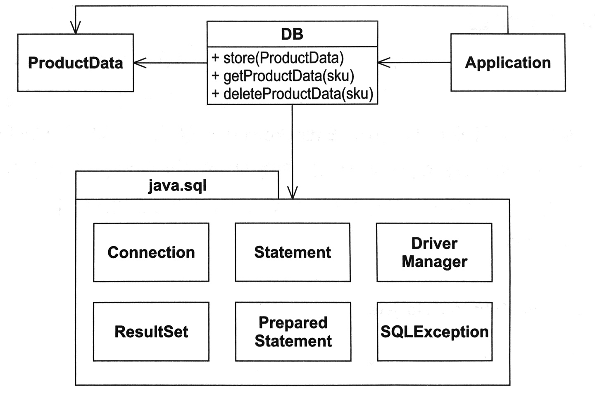
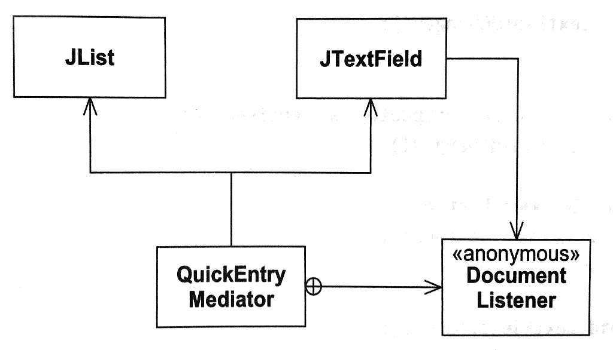

# 책소개

로버트 C. 마틴, [클린 소프트웨어 (애자일 원칙과 패턴, 그리고 실천 방법)](http://jpub.tistory.com/682)

# COMMAND

함수를 클래스보다 강조한다는 점에서 OOP 패러다임과 부딪힘. 하지만 유용함. 게다가 매우 간단함. 아래 그림은 적용 예시. 커맨드 자체에 대한 설명은 생략.


무엇이 좋은가?

- `Command`를 사용하는 곳에서 어떤 구현체들이 있는지 알 필요 없음. 단지 `Command`의 `do`를 실행함.
- `명령`의 개념이 캡슐화 된 것. 호출부와 실행부의 논리적 상호 연결이 분리됨.
- 물리적 분리 외에 시간적 분리도 가능함. 명령의 유효성을 검증하고 저장한 후, 필요한 시점에 실행 가능함.
- `Command`에 `undo`를 추가하기도 함. 명령을 취소하는 코드가 명령을 수행하는 코드와 함께 있을 수 있음.

# ACTIVE OBJECT

먼저 책의 구현부를 재작성함.

```java
class ActiveObjectEngineTest {

    @Test
    public void run() throws Exception {
        final ActiveObjectEngine engine = new ActiveObjectEngine();
        engine.add(new SleepCommand(1000, engine, new WakeupCommand()));
        engine.run();
    }
}

class ActiveObjectEngine {

    LinkedList<Command> commands = new LinkedList<>();

    void add(Command command) {
        commands.add(command);
    }

    void run() throws Exception {
        while (!commands.isEmpty()) {
            final Command command = commands.getFirst();
            commands.removeFirst();
            command.execute();
        }
    }
}

class SleepCommand implements Command {

    // 생략

    @Override
    public void execute() throws Exception {
        long currentTime = System.currentTimeMillis();
        if (!started) {
            started = true;
            startTime = currentTime;
            engine.add(this); // 자기 자신을 등록
            System.out.println("start");
        } else if ((currentTime - startTime) < sleepTime) {
            engine.add(this); // 자기 자신을 등록
        } else {
            engine.add(wakeupCommand);
            System.out.println("wakeup");
        }
    }
}

class WakeupCommand implements Command {

    @Override
    public void execute() throws Exception {
        // 실제로는 아무것도 하지 않음. SleepCommand와 다르게 자기 자신을 engine에 등록하지 않을 뿐.
    }
}
```

간단히 내용을 정리함.

- 커맨드 패턴의 응용 중 하나.
- 다중 제어 스레드 구현을 위한 오래된 기법.
- 스레드가 블록되지 않음.
- RTC<sup>run-to-complete</sup>라고 불림. 다음 작업이 시작되기 전에 현재 작업이 완료됨.

# TEMPLATE METHOD, STRATEGY

개념 자체에 대한 설명과 코드는 생략. 둘의 비교만 정리함. [Abstract Methods and Classes](http://docs.oracle.com/javase/tutorial/java/IandI/abstract.html)의 "Abstract Classes Compared to Interface"을 함께 보는 것도 괜찮아 보임.

1. 두 방식 모두 구체적 내용으로부터 일반적 알고리즘을 분리(일종의 특화)함.
2. 템플릿 메소드는 상속을, 스트래터지는 위임을 사용함.
3. 참고로 위임<sup>delegation</sup>, 구성<sup>composition</sup>, 상속<sup>inheritance</sup>의 개념을 서로 구분하여 사용하고 있음.
4. 스트래터지는 약간의 복잡성(클래스 수가 늘어나는 것을 이야기)을 유발함.
5. 더불어, 메모리 및 실행 시간 비용을 수반(유의미한 차이인지는 의문).
6. 한편, 템플릿 메소드는 부분적으로 [DIP](https://en.wikipedia.org/wiki/Dependency_inversion_principle)를 위반함.
7. 아래 코드처럼 `IntSorter`가 버블 정렬이 아닌 다른 정렬을 사용하고 싶을 때 내부를 수정할 수 밖에 없음.
8. (책에 언급되지는 않았지만) 특화의 결정 시점이 템플릿은 컴파일 타임, 스트래터지는 런타임.

```java
abstract class BubbleSorter {
  protected int sort() { // 생략 }
  protected abstract void swap(int index);
}

class IntSorter extends BubbleSorter {
  int sort(int[] ary) { return sort(); }
  protected void swap(int index) { // 생략 }
}
```

# FACADE, MEDIATOR

둘을 비교해가며 각각을 설명함. 먼저, 퍼사드.

- 복잡하고 일반적인 인터페이스를 가진 객체 그룹에 **간단하고 구체적인** 인터페이스를 제공함.
- 아래 그림에서 `ProductData`는 범용적 목적으로 제공되는 `java.sql`을 모두 알 필요 없음.
- 어플리케이션 혹은 적어도 `ProductData`의 특수한 목적을 만족시키는 `DB` 클래스만 알면 됨.
- 게다가 `DB`의 인터페이스는 훨씬 간단함. 또한 추상화 됨.



다음으로 미디에이터.

- 퍼사드와 마찬가지로 정책을 적용함.
- 하지만 객체의 **사용자가 인지하지 못한채** 정책이 적용됨.
- 책에서는 아래 그림으로 설명함.
- 이 때의 사용자는 `JList`와 `JTextField`의 호출부이며, `QuickEntryMediator`에 대해 알지 못함.
- 그런데, 어떻게 사용자가 미디에이터의 존재를 모르게 할 수 있는가? 궁금하다면 [여기](https://en.wikipedia.org/wiki/Mediator_pattern)코드를 참고.



# NULL OBJECT

```java
Employee e = DB.getEmployee("Bob");
if (e != null && e.isTimeToPay(today))
  e.pay()
```

- 이런 식의 관용적인 표현은 흔히 볼 수 있음. 하지만 보기 싫고 에러가 발생하기 쉬움.
- null 반환 대신, 예외를 발생시킬 수도 있음. 에러가 발생할 위험은 줄어들 수 있으나, try/catch 블록이 더 보기 싫을 수도 있음.
- 널 오브젝트를 적용하면, 위 코드를 아래와 같이 바꿀 수 있음.

```java
Employee e = DB.getEmployee("Bob");
if (e.isTimeToPay(today))
  e.pay()
```

- 널 오브젝트는 메소드 내부에서 아무런 행위도 하지 않도록 구현됨.
- 만약, 오직 하나의 인스턴스만 가지도록 하면, `e == Employee.NULL` 같은 비교도 가능해짐.
- 구현은 아래 코드 참고.

```java
public interface Employee {
  
  public boolean isTimeToPay(Date payDate);
  public void pay();
  
  public static final Employee NULL = new Employee() {
    public boolean isTimeToPay(Date payDate) {
      return false;
    }
    public void pay() {
    }
  }
}
```

- 최근에 살펴봤던 Spring Cloud Hystrix의 [AbstractCommand](https://github.com/Netflix/Hystrix/blob/master/hystrix-core/src/main/java/com/netflix/hystrix/AbstractCommand.java)에서도 볼 수 있는 방식임.
- [Semaphore](https://github.com/Netflix/Hystrix/wiki/configuration#thread-or-semaphore) 방식인 경우는 의미있는 인스턴스가 사용되고, 그렇지 않은 경우는 아래의 `TryableSemaphoreNoOp.DEFAULT` 인스턴스가 반복적으로 사용되고 있음.

```java
static class TryableSemaphoreNoOp implements TryableSemaphore {

  public static final TryableSemaphore DEFAULT = new TryableSemaphoreNoOp();

  @Override
  public boolean tryAcquire() {
    return true;
  }

  @Override
  public void release() {
  }

  @Override
  public int getNumberOfPermitsUsed() {
    return 0;
  }
}
```


