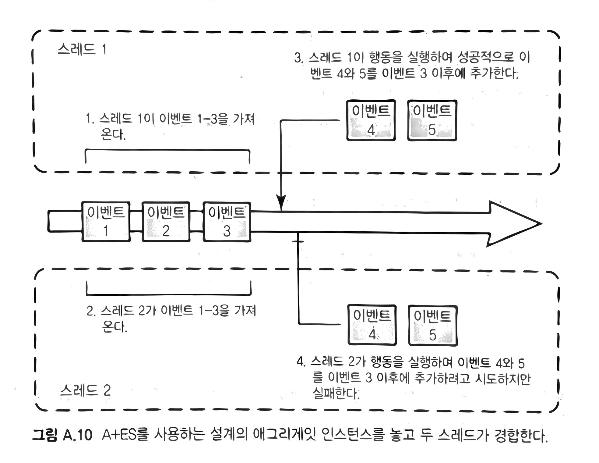

# 책소개

- [도메인 주도 설계 구현](http://www.acornpub.co.kr/book/implement-ddd)<sup>Implementing Domain-Driven Design</sup>
- 반 버논<sup>Vaughn Vernon</sup>

# 8장. 도메인 이벤트

## 언제 그리고 왜 도메인 이벤트를 사용할까

> 도메인 전문가가 관심을 갖고 있는 어떤 사건이 발생했다.
>
> 연속된 개별 이벤트를 묶어서 도메인에서 일어나는 활동의 정보를 모델링하자. 각 이벤트를 도메인 객체로 표현하자···. 도메인 이벤트는 도메인 모델을 완벽히 지원하며 도메인에서 일어난 어떤 사건을 나타낸다. [Evans, Ref. 20쪽]

- 도메인 전문가로부터 "**…하면 저에게 알려주세요.**" 혹은 "**그런 일이 일어나면…**"와 같은 말이 언급된다면, 이벤트를 모델링 해야 할 여지가 큼.
- 도메인 이벤트는 결합 분리를 가져옴. 글로벌 트랜잭션 대신, 결과적 일관성. 그리고 높은 확장성과 성능. 하지만 지연 시간을 감안.
- 시스템 배치는 트랜잭션이 커서 주로 사용량이 적은 시간대에 수행됨. 도메인 이벤트를 활용하면 이로부터 해방.
- 하지만 모든 상황에 가능한 것은 아님. [여기](https://github.com/codehumane/what-i-learned/blob/master/spring-ms/README.md#analyze-dependencies)의 "Events as opposed to query" 내용 참고.

## 이벤트 모델링

- 이름: 도메인 이벤트의 발생 원인이 된 커맨드 오퍼레이션을 표현.
- 속성: 이벤트가 발생한 시간, 이벤트를 발생시킨 인스턴스와 그 식별자, 그 외 유용한 속성들.
- 행동: 이벤트는 보통 불변으로 설계됨. 따라서 행동 설계는 간단. 이벤트가 전달되는 동안 상태가 바뀐다고 생각해보면 아 끔찍하다.

```java
@Value
public class BacklogItemCommitted implements DomainEvent {
  private Date occurredOn;
  private BacklogItemId backlogItemId;
  private SprintId committedToSprintId;
  private TenantId tenantId;
  ...
}
```

- 때로는 클라이언트가 직접 요청한 내용이 이벤트가 되기도 함.
  - 이런 이벤트들은 고유한 리포지토리를 가질 수 있음.
  - 과거에 일어난 사건을 나타내기 때문에 삭제는 비허용.
- 고유 식별자를 부여하기도 함.
  - 일반적으로는 구별의 필요성도 없으며,
  - 발생시간을 포함한 값객체이기 때문에 대부분 식별이 가능.
  - 하지만 메시지 재발송에 대비하기 위해서는 식별자가 필요할 수도 있음.
  - 일부 메시징 인프라는 헤더/인벨롭<sup>envelope</sup>의 일부로 메시지 식별자를 제공.

# 10장. AGGREGATE

## 규칙. 진짜 고정자를 일관성 경계 안에 모델링하라.

- 고정자란, "언제나 일관성을 유지해야만 한다는 비즈니스 규칙"을 가리킴.
- 이 때의 일관성이 트랜잭션<sup>transactional</sup> 일관성임에 유의.
- 결과적<sup>eventual</sup> 일관성은 AGGREGATE의 범위를 넘어감.
- 성능, 확장성과 일관성 사이의 균형을 유지하기 위한 노력.

## 규칙. 작은 AGGREGATE으로 설계하라.

- 일관성을 위해 AGGREGATE 범위를 늘려가다 보면,
- 성능과 확장성이 문제가 되는 임계치를 만남.
- 그렇다면, 얼마나 작아야 하는가?
- 책에서는 "루트 엔티티와 최소한의 특성이나 값 타입의 속성으로 제한"하자고 함.
- 또한, 엔티티를 만들기 전에 아래 질문을 고민하다 보면, 상당수가 값 객체로 충분하게 됨.

> 이것이 시간에 따라 변화<sup>change</sup>하는지, 아니면 변경이 필요할 때 완전히 대체<sup>replace</sup>시키면 되는지 생각해보자.

- 결과적으로 AGGREGATE은 주로 하나의 엔티티가 됨.
- 또한, 아래 내용도 경계 설정에 있어 생각해 볼 거리.

> 단순히 하나의 트랜잭션 내에서 일관성을 유지해주길 기대하는 유스케이스가 주어졌다고 해서 이를 반드시 지켜야 하는 것은 아니다. 이런 경우는 대부분 AGGREGATE 사이의 결과적 일관성을 통해 비즈니스 목표를 달성할 수 있다.

## 규칙. ID로 다른 AGGREGATE을 참조하라

- 아래 코드에서는 `BacklogItem`이라는 AGGREGATE 루트가 다른 AGGREGATE 루트인 `Product`를 참조.
- 하나의 AGGREGATE는 참조된 AGGREGATE을 같은 트랜잭션에서 수정하면 X.
- 단지 조회만을 위해 참조를 할 수 있음. 그러나 언제든 수정하고픈 유혹이 생길 수 있음.
- 객체 참조가 아닌, 전역 고유 식별자 즉, ID 참조가 한 가지 방법이 됨.
- 추론 객체 참조<sup>inferred object reference</sup>라고도 부름.
- 결과적으로 AGGREGATE는 작아짐. 성능과 리소스 측면에서 효율적.

```java
public class BacklogItem extends ConcurrencySafeEntity {
  private Product product; // 객체 참조
  private ProductId productId; // ID(전역 고유 식별자) 참조.
}
```

- 한편, ID를 참조하는 경우 모델 탐색은 어떻게 하는가?
- 첫 번째 방법은 단절된 도메인 모델<sup>Diconnected Domain Model</sup>. AGGREGATE 내부에서 REPOSITORY를 사용. 일종의 지연 로딩.
- 두 번째 방법. AGGREGATE 호출에 앞서 DOMAIN SERVICE를 통해 의존 관계 주입.

```java
public class ProductBacklogItemService ... {
  
  @Transactional
  public void assingTeamMemberToTask(
      String aTenantId,
      String aBacklogItemId,
      String aTaskId,
      String aTeamMemberId) {
    
    val backlogItem = backlogItemRepository.backlogItemOfId(
      new TenantId(aTenantId),
      new BacklogItemItd(aBacklogItemId)
    );
    
    val ofTeam = teamRepository.teamOfId(
      backlogItem.tenantId(),
      backlogItem.teamId()
    );
    
    backlogItem.assignTeamMemberToTask(
      new TeamMemberId(aTeamMemberId),
      ofTeam,
      new TaskId(aTaskId)
    );
  }
}
```

- 세 번째 방법. 복잡한 도메인 별 의존성을 해결하기 위해서는, DOMAIN SERVICE를 AGGREGATE의 커맨드 메소드로 전달.
- AGGREGATE는 참조를 엮어주기 위해 [이중 디스패치<sup>double dispatch</sup>](https://en.wikipedia.org/wiki/Double_dispatch)를 수행할 수 있음.
- 책에서 언급되지는 않았지만, 캐싱 메커니즘에 대한 고려까지 함께 필요.

## 규칙. 경계의 밖에선 결과적 일관성을 사용하라

- 2개 이상의 AGGREGATE에서 함께 비즈니스 규칙이 수행되야 한다면 결과적 일관성을 사용하라는 이야기.
- 트랜잭션 일관성과 결과적 일관성 중 어느 것을 선택해야 하는가? 에릭 에반스의 기준을 제시하고 있음.
- 데이터 일관성 보장 주체가 유스케이스를 수행하는 사용자인가?
- 아니면 다른 사용자나 시스템이 해야 하는 일인가?
- 전자는 트랜잭션, 후자는 결과적 일관성을 사용.
- DDD에서 결과적 일관성을 위해 비동기 구독자에게 도메인 이벤트를 발행함.

```java
public class BacklogItem extends ConcurrencySafeEntity {
  
  DomainEventPublisher
    .instance()
    .publish(new BacklogItemCommitted(
      this.tenantId(),
      this.backlogItemId(),
      this.sprintId()
    ));
}
```

# 11장. 팩토리

-  복잡한 생성 로직을 숨길 수 있음.
-  일관성을 보장할 수도 있음. 예컨대, AGGREGATE 생성 시 일부 세부 사항은 잘못된 상태를 갖지 않도록 보호.
-  생성자만으로는 표현할 수 없는 유비쿼터스 언어를 나타낼 수도 있음.
-  예제 코드 하나만 기록.

```java
public class Forum extends Entity {
  public Discussion startDiscussion(
      DiscussionId aDiscussionId,
      Author anAuthor,
      String aSubject) {
    
    if (this.isClosed())
      throw new IllegalStateException("Forum is closed");
    
    Discussion discussion = new Discussion(
      this.tenant(),
      this.forumId(),
      aDiscussionId,
      anAuthor,
      aSubject);
    );
    
    DomainEventPublisher
      .instance()
      .publish(new DiscussionStarted(...));
    
    return discussion;
  }
}
```

# 12장. 리포지토리

TBD

# 애그리게잇과 이벤트 소싱(A+ES)

## 어플리케이션의 내부

>  일단 변경하는 행동이 완료된 후에는 반드시 `Changes` 컬렉션을 이벤트 저장소로 커밋해야 한다. 쓰기 스레드와 동시성 충돌이 발생하지 않음을 보장하는 가운데, 새로운 변경을 모두 추가한다. `Load()`에서 `Append()` 메소드로 동시성 버전 변수를 넘겨주기 때문에 이를 보장할 수 있다.

-  **690p**에 보면 위와 같이 이벤트 저장소와 동시성 이야기가 언급됨.
-  하지만, "쓰기 스레드와 동시성 충돌이 발생하지 않음을 보장"한다는 말이 무슨 말일까?
-  동일한 객체를 수정하는 둘 이상의 스레드가 동시에 존재하지 않는다는 말로 이해되는데,
-  정말 그렇다면, 이것이 굳이 언급해야 할 만한 장점일까?
-  "동시성 버전"이라는 용어가 사용된 것을 보니, 여전히 낙관적 잠금을 사용하고 있기도 하고.

## 커맨드 핸들러

>  커맨드 객체는 직렬화할 수 있기 때문에 해당하는 텍스트나 바이너리 표현을 메세지 큐를 통해 메시지로 보낼 수 있다. (중략) 어쨌든 클라이언트와 서비스 사이의 결합을 분리하면 로드밸런싱을 개선하고 경쟁적 컨슈머를 사용하고 시스템 파티셔닝을 지원할 수 있다.

-  **693p**의 내용. 애그리게잇에 커맨드와 커맨드 핸들러를 적용할 때의 장점인데,
-  가독성이나 유연성 같은 코드 상의 이점이 아니라, 시스템 상의 이점을 언급하는 것이 흥미로움.
-  요약하면, 쓰기 작업의 로드밸런싱, 경쟁적 컨슈머, 시스템 파티셔닝.
-  또한, 아래 그림처럼 시간 분리<sup>temporal decoupling</sup>도 가능.
-  그리고 짤막하게 소개되었지만, 기존 코드의 영향을 최소화하며, 관점(감사, 로깅, 인증, 유효성 검증 등)을 추가할 수 있다는 것도 와닿는 장점.


## 동시성 제어



-  위 그림은 둘 이상의 스레드가 이벤트 스트림에 접근하면서 발생할 수 있는 경합 문제를 설명함.
-  가장 쉬운 접근법은 예외를 던지고 사용자에게 재시도를 가이드.
-  두 번째 접근법은 시스템 상에서 충돌 감지 후 재시도.
-  그리고 아래는 충돌 발생 시 재시도를 하는 코드.

```c#
try {
  _eventStore.AppendToStream(
    id, eventStream.Version, customer.Changes);
  return;
}
catch (EventStoreConcurrencyException ex) {
  foreach (var failedEvent in customer.Changes) {
    foreach (var succededEvent in ex.ActualEvents) {
      if (ConflictsWith(failedEvent, succededEvent)) {
        var msg = string.format("Conflict between {0} and {1}",
          failedEvent, succededEvent);
        throw new RealConcurrencyException(msg, ex);
      }
    }
  }
  // 충돌 없으면 추가
  _eventStore.AppendToStream(
    id, eventStream.Version, customer.Changes);
}
```

-  이 때의 충돌은 보통 같은 타입의 이벤트에 대해서만 발생하므로 `ConflictsWith`의 내부는 아래와 같음.

```c#
bool ConflictsWith(IEvent event1, IEvent event2) {
  return event1.GetType() == event2.GetType();
}
```

