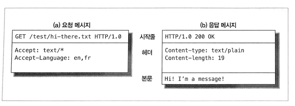

# HTTP 개관

## 웹 클라이언트와 서버 기본 동작

-  `http://www.oreilly.com/index.html` 페이지를 열어볼 때,
-  웹 브라우저는 HTTP를 사용하기로 결정한 뒤,
-  `www.oreilly.com` 서버로 요청을 보냄.
-  서버는 요청 받은 객체인 `/index.html`을 찾고,
-  성공하면 타입과 길이 정보와 함께 HTTP 응답으로 반환.


## 미디어 타입 (MIME)

-  메일의 MIME 방식을 채택해 미디어 타입을 제공.
-  주 타입<sup>primary object type</sup>과 부 타입<sup>specific subtype</sup>으로 이루어짐.

## URI

-  Uniform Resource Identifier의 약어.
-  정보 리소스를 고유하게 식별하고 위치를 지정할 수 있음.
-  결국 클라이언트가 관심 있는 리소스를 쉽게 지목 가능.
-  URL과 URN이 존재함.

## 메시지

-  시작줄, 헤더, 본문으로 이루어짐.
-  시작줄에는 요청의 경우 무엇을 해야 하는지, 응답의 경우 무슨 일이 일어났는지를 명시함.
-  헤더는 0개 이상의 헤더 필드로 이루어짐.



## 브라우저가 멀리 떨어진 서버의 리소스를 사용자에게 보여주는 과정

-  서버의 URL에서 호스트 명 추출.
-  서버의 호스트 명을 IP로 변환.
-  URL에서 포트 번호 추출.
-  웹 서버와 TCP 커넥션 연결.
-  서버에 HTTP 요청 전달.
-  서버로부터 HTTP 응답 수신.
-  커넥션이 닫히면 브라우저에 문서를 보여줌.

## 웹의 구성요소

-  프록시: 클라이언트 요청을 서버에 전달하는 중재자. 주로 보안 목적. 애플리케이션 통합, 성능 최적화 등에도 사용됨.
-  캐시: 프록시에서 자주 찾는 것들을 저장하는 특수한 프록시. 성능 목적.
-  게이트웨이: HTTP 트래픽을 다른 프로토콜로 변환. HTTP 요청을 받아 FTP로 변환하는 등.
-  터널: 두 커넥션 사이의 데이터에 관여치 않고 그대로 전달. 대표적으로, SSL 요청을 받아 뒷 단의 서버에 HTTP로 전달.
-  에이전트: 설명 생략.

# URL과 리소스

## URI, URN 비교

-  개인적으로는 [여기](https://stackoverflow.com/questions/176264/what-is-the-difference-between-a-uri-a-url-and-a-urn) 설명이 좋음.
-  URL은 식별자이고, URI와 URN은 URL의 특수한 형태.
-  URI이 사람 이름이라면, URL은 이 사람을 찾기 위한 주소 같은 것.
-  URN은 이 사람의 이름이 시간과 공간을 초월하여 식별성(유일함)을 가지는 것.

## URL 문법

-  `<스킴>://<사용자 이름>:<비밀번호>@<호스트>:<포트>;<파라미터>?<질의>#<프래그먼트>`
-  여기서 **파라미터**만 좀 더 설명해보면 다음과 같음.
   -  많은 스킴들이 호스트나 경로 정보만으로는 리소스를 찾지 못함.
   -  예컨대, 바이너리와 텍스트를 지원하는 FTP에서, 사용자는 바이너리 이미지가 텍스트 형식으로 전송되지 않길 바람.
   -  이 때, 파라미터를 사용하여 형식을 지정할 수 있음.
   -  파라미터가 사용된 한 예: `http://www.joes-hardware.com/hammers;sale=false/index.html;graphics=true`
   -  `hammers` 경로 조각은 값이 `false`인 `sale` 파라미터를 가짐. `index.html`에는 `graphics`라는 파라미터 사용.

## 상대 URL 해석

-  이 때는 가장 먼저 기저 URL을 찾음. `<BASE>` HTML 태그나 해당 리소스의 URL을 사용.
-  상대 참조 해석에는 **URL 분해하기** 과정을 거치는 등 RFC 2396에 명시된 알고리즘 사용.

## URL의 안전한 전송

-  안전하게 전송되고 가독성을 가질 수 있도록, URL은 알파벳 문자만을 포함해야 함.
-  안전하다는 것은 서로 다른 장치 간의 통신에도 URL 정보가 유실될 위험이 없다는 것.
-  하지만, 알파벳(안전한) 이외의 문자도 전송하고자 하는 요구가 있었음. 이스케이프라는 기능을 추가함.
-  이스케이프: 알파벳 이외의 문자를 변환. 그 결과는 `%` 기호로 시작하는 ASCII 코드로 표현되는 두 개의 16진수 숫자.
-  따라서, `/, ., .., #, ?` 등은 반드시 인코딩 해서 URL로 사용해야 함.
-  이는 이동성과 완성도 모두를 높인 것.
-  가끔 안전하지 않은 문자가 이용되는 것은 잘못된 것.
-  클라이언트 어플리케이션은 안전하지 않은 모든 URL 문자를 인코딩 해야 함.
-  해석하는 측은 URL 디코드.
-  마지막으로, URL의 미래 이야기하면서 URN 언급.

# HTTP 메시지

## 메시지의 흐름

- 트랜잭션 방향을 표현하기 위해 인바운드, 아웃바운드 용어 사용.
- 인바운드와 아웃바운드와 관계 없이, 발송자와 수신자를 구분하기 위해 업스트림, 다운스트림 용어 사용.

## 메시지의 구성

- 시작줄은 이것이 어떤 메시지인지를 서술. 헤더 블럭은 메시지 속성. 본문은 텍스트나 이진 데이터지만, 아예 없을 수도.
- 시작줄과 헤더는 줄 단위로 분리된 아스키 문자열. [CRLF](https://zetawiki.com/wiki/%EA%B0%9C%ED%96%89%EB%AC%B8%EC%9E%90,_%EB%9D%BC%EC%9D%B8%ED%94%BC%EB%93%9C,_%EC%BA%90%EB%A6%AC%EC%A7%80%EB%A6%AC%ED%84%B4) 참고.
  - 각 줄은 캐리지 리턴(ASCII 13)과 개행 문자(ASCII 10)로 구성된 줄바꿈 문자열로 끝남.
  - 견고한 어플리케이션이라면 CR 없는 LF도 받아들일 수 있어야.
- 요청 메시지와 응답 메시지의 형식은 각각 아래와 같음.

```http
GET /hello/world.gif HTTP/1.0
Host: www.joe.com

<메서드> <요청 URL> <버전>
<헤더>

<엔티티 본문>
```

```http
HTTP/1.0 200 OK
Content-Type: image/gif
Content-Length: 8572

<버전> <상태 코드> <사유 구절>
<헤더>

<엔티티 본문>
```

- 버전: `HTTP/<메이저>.<마이너>`로 구성.
- 상태 코드: 첫 번째 자리는 성공이나 에러 등의 일반적 분류.
- 사유 구절<sup>reason-phrase</sup>: 오로지 사람에게 읽히기 위해 존재하는 상태 코드 설명 문구.
- 헤더들: 이름, 콜론(:), 선택적인 공백, 값, CRLF가 순서대로 나타나는 0개 이상의 헤더들.
- 엔티티 본문
  - HTTP가 수송하도록 설계된 것들. 이미지, 비디오, HTML 문서, SW 어플리케이션, 신용카드 트랜잭션, 전자우편 등.
  - 선택적이므로 종종 CRLF로 끝나게 됨. CRLF가 의무지만 호환을 위해 CRLF가 없더라도 받아들여야 함.
- 헤더 분류: 일반/요청/응답/엔티티/확장 헤더. 이 중 엔티티 헤더는 본문 크기와 컨텐츠, 리소스 그 자체 등을 서술.
- 헤더는 아래 처럼 여러 줄로 표현 가능함. 이 때는 최소 하나의 스페이스 혹은 탭 문자 와야 함.

```http
HTTP/1.0 200 OK
Content-Type: image/gif
Content-Length: 8572
Server: Test Server
  Version 1.0
```

## 메서드

- HTTP 버전 1.1과 호환되야 한다면, GET과 HEAD 메서드 구현만으로 충분.
- 안전한 메서드<sup>Safe Method</sup>란, HTTP 요청 결과로 인해 서버에 어떤 작용도 없음을 의미.
- GET, HEAD가 안전한 메서드일 수 있음. 보장은 아님.
- HTTP를 확장한(따라서 HTTP/1.1 명세에 없는) 메서드 정의 가능. CalDAV 구현시에는 `MKCAL`, `REPORT` 등을 봤음.

### HEAD

- HEAD는 GET처럼 행동. 단, 응답으로 헤더만을 돌려줌.
- 따라서, 서버 개발 시 HEAD의 응답 헤더가 GET의 그것과 정확히 일치되도록 해야 함.
- HEAD가 존재하는 이유는 아래와 같음.
    - 리소스를 가져오지 않고도 타입 등을 알아내거나,
    - 상태 코드로 개체의 존재 여부를 확인하거나,
    - 리소스 변경 여부를 알 수 있음.

### TRACE

-  클라이언트가 자신의 요청이 서버에 어떻게 전달되고 돌아오는지를 진단.
-  TRACE 요청은 목적지 서버에서 [루프백<sup>loopback</sup>](http://www.terms.co.kr/loopback.htm) 진단을 시작.
-  진단을 위한 사용은 괜찮지만, 중간 애플리케이션이 요청을 일관되게 다룬다고 가정하는 문제가 있음.
-  예를 들어, 프락시는 POST 요청은 서버로 통과시키고 GET 요청은 웹 캐시 같은 다른 서버로 전달하기도 함.
-  아래는 TRACE 과정을 보여주는 그림. 출처는 [여기](http://webreference.com/programming/http/chap3/2/3.html).


### OPTIONS

- 특정 리소스가 어떤 메서드를 지원하는지 질의.
- 아래는 서버의 모든 리소스에 대한 클라이언트 질의의며, 서버는 자신의 리소스에 지원되는 메소드의 목록을 반환.

```http
OPTIONS * HTTP/1.1
Host: www.joe.come
Accept: *
```

```http
HTTP/1.1 200 OK
Allow: GET, POST, PUT, OPTIONS
Context-length: 0
```

## 상태 코드

### 2XX

201 Created
- 리소스 생성 요청(PUT 등)에 대한 응답.
- 생성된 리소스에 대해 `Location` 헤더와 함께 참조를 위한 URL들을 엔티티 본문에 담아야 함.

202 Accepted
- 요청은 받아들여 졌으나, 아직 서버는 요청 받은 동작을 수행 X.
- 언제 완료할지 보장 없음. 단지 요청을 받아들이기에 적법함을 나타냄.
- 본문 엔티티에 가급적 언제 요청 처리가 완료될지 추정이라도 명시해야.

204 No Content
- 엔티티 본문 포함하지 않음. 웹브라우저를 새 문서로 이동시키지 않고 갱신하는 경우 사용.

205 Reset Content
- 브라우저를 위해 사용되는 또 하나의 코드. 현재 HTML 폼에 채워진 값을 비우라는 명령.

206 Partial Content
- 부분 또는 범위 요청이 성공함을 알림.
- `Content-Range, Date`은 반드시 포함.
- `Etag, Content-Location ` 중의 하나도 반드시 포함해야 함.

### 3XX

- 리소스를 얻을 수 있는 다른 위치를 알려주거나, 리소스 내용 대신 다른 응답 제공.
- 리소스가 옮겨진 경우 `Location` 헤더를 명시해 위치를 알려줌. 브라우저는 이를 해석 후 알아서 이동.

300 Multiple Choices
- 동시에 여러 리소스를 가리키는 URL을 요청한 경우, 리소스의 목록과 함께 응답.
- HTML 문서를 영어, 프랑스어 등의 버전으로 제공하는 경우 유용.
- 사용자는 이 중 하나를 선택. 서버가 권장하는 URL을 `Location`에 명시할 수도.

301 Moved Permanently
- 요청한 URL이 옮겨짐을 알림. `Location` 헤더에 현재 리소스가 위치한 URL 명시.

302 Found
- 301과 동일하지만, `Location`의 값은 임시.
- 이후의 요청에서는 원래 URL 사용해야 함.

303 See Other
- 주로 POST에 의해 생성된 새로운 리소스 위치를 알려주는 용도.

304 Not Modified
- [여기](https://developer.mozilla.org/ko/docs/Web/HTTP/Status/304) 설명이 더 괜찮음.

> The HTTP 304 Not Modified client redirection response code indicates that there is no need to retransmit the requested resources. It is an implicit redirection to a cached resource. This happens when the request method is safe, like a GET or a HEAD request, or when the request is conditional and uses a If-None-Match or a If-Modified-Since header.
>
> The equivalent 200 OK response would have included the headers `Cache-Control`, `Content-Location`, `Date`, `ETag`, `Expires`, and `Vary`.

305 Use Proxy

- 리소스가 반드시 프락시를 통해 접근되야 함을 명시.

307 Temporary Redirect

- 302와 유사. 차이는 [여기](https://developer.mozilla.org/ko/docs/Web/HTTP/Status/307) 잘 설명됨.
- POST 요청시 303을 받으면, `Location`에 명시된 URL을 GET으로 호출 가능. 307 응답되면, 원래의 메서드 유지해야 함.

> The only difference between 307 and 302 is that 307 guarantees that the method and the body will not be changed when the redirected request is made.

### 4XX

405 Method Not Allowed

- 요청에 `Allow` 헤더를 포함하여 요청한 리소스에 어떤 메서드가 사용 가능한지 질의 가능.

406 Not Acceptable

- 요청에 명시된 종류의 리소스를 서버가 반환할 수 없음.
- 이 매개변수는 [`Accept-Charset`](https://developer.mozilla.org/en-US/docs/Web/HTTP/Headers/Accept-Charset) 혹은 [`Accept-Language`](https://developer.mozilla.org/en-US/docs/Web/HTTP/Headers/Accept-Language)에 명시됨.

408 Request Timeout

- 요청을 완수하기엔 너무 시간이 많이 걸림.
- 서버마다 타임아웃 값이 다르지만, 대개 충분한 길이를 허용한다.

409 Conflit

- 요청이 리소스에 대해 일으킬 수 있는 충돌을 가리킴.
- 예컨대, 업로드 하려는 파일의 버전이 서버의 버전보다 낮은 경우.

410 Gone

- 404와 같지만 한 때 그 리소스가 존재했음.
- 리소스의 부재가 일시적인지 영구적인지 알 수 없다면 404를 사용해야 함. 여기 [참고](https://developer.mozilla.org/ko/docs/Web/HTTP/Status/410).

411 Length Required

- 요청에 `Content-Length`가 있을 것을 서버가 요구.

그 외

- 413 Request Entity Too Large
- 414 Request URI Too Long
- 415 Unsupported Media Type: 지원되지 않는 페이로드 포맷.
- 416 Request Range Not Satisfiable

### 5XX

- 4XX가 클라이언트 요청이 잘못됨을 나타내는 데 반해,
- 5XX는 서버에서 에러가 발생했음을 가리킴.

501 Not Implemented

- 요청한 메서드를 서버가 지원하지 않음.
- 405는 리소스에 대한 메서드를 지원하지 않음에 유의.

502 Bad Gateway

- 게이트웨이나 프록시 서버가 업스트림 서버로부터 비정상 응답을 받음.

503 Service Unavailable

- 현재 서버가 요청을 처리할 수 없음. 나중에는 가능함.
- 로드 밸런서의 용량이 부족하거나, 등록된 혹은 정상적인 인스턴스가 없음.
- `Retry-After` 헤더를 응답에 포함시켜 언제 리소스가 사용 가능한지 명시 가능.

504 Gateway Timeout

- 408과 유사. 게이트웨이나 프록시 서버가 업스트림 서버에서 응답을 기다리다가 타임아웃 발생.

505 Version Not Supported

- 지원하지 않는 버전의 프로토콜 요청을 받음.

## 헤더

### 일반헤더

- 클라이언트와 서버 모두에서 사용되는 일반적인 헤더.
- `Date`: 메시지가 만들어진 날짜와 시간.
- `Connection`: 현재 전송이 완료된 후의 네트워크 접속 유지 여부. 예컨대, `keep-alive`, `close`.
- `Transfer-Encoding`: 수신자에게 엔티티에 어떤 인코딩이 적용되었는지 알림. `chunked`, `deflate`, `gzip` 등. 1개 이상 나열할 때는 쉼표로 구분. [여기](https://developer.mozilla.org/ko/docs/Web/HTTP/Headers/Transfer-Encoding) 자세히 설명됨.
- `Via`: 메시지가 어떤 중개자(프록시, 게이트웨이)를 거쳐 왔는지 보여줌.
- `Cache-Control`: 캐시 지시자<sup>directive</sup>를 지정하기 위한 메커니즘. 단방향성. 즉, 요청의 지시자와 응답의 그것이 같음을 보장하지 않음. HTTP/1.1에서 정의됨.
  - `public`, `private`
    - 단일 사용자를 위한 캐시인지 여부.
    - 단일 사용자를 위한 것이 아니라면, 브라우저가 아닌 프록시나 CDN 등에서 캐시 가능함.
    - 아래 그림이 이해에 도움됨.
  - `no-cache`, `no-store`
    - `no-store`는 항상 원 서버에서 리소스를 다운로드 함.
    - `no-cache`는 복사된 사본을 보여주기 전에, 유효성 검사 토큰(ETag)을 이용해 원 서버로 재검증 요청을 보냄.
  - `max-age=<second>`
    - 리소스를 요청한 시간으로부터 최대 몇 초까지 재활용할 수 있는지를 명시.
  - `must-revalidate`
    - 캐시 사용에 앞서 리소스의 신선 여부를 검증할 것.


*그림 출처: https://mdn.mozillademos.org/files/13769/HTTPVary.png

### 요청헤더

- `Host`, `Client-IP`, `Referer`, `User-Agent` 등.
- Accept 관련 헤더
  - 서버에게 자신의 선호와 능력을 알림.
  - 서버는 좀 더 똑똑한 대응 가능하며 양측 모두에 이익.
  - `Accept`: 서버가 보내도 되는 미디어 종류를 알려줌.
  - 그 외 `Accept-Charset`, `Accept-Encoding`, `Accept-Language` 등.
- 조건부 요청 헤더
  - 요청에 제약을 명시. 예컨대, 자신이 가진 리소스와 달라진 경우에만 응답을 달라고 명시하기도.
  - `If-Match`: 문서의 엔티티 태그가 주어진 엔티티 태그와 일치하는 경우에만 문서 가져옴.
  - `If-Modified-Since`: 주어진 날짜 이후 리소스가 변경된 경우만 문서 가져옴.
  - `If-None-Match`: 문서의 엔티티 태그가 주어진 그것과 일치하지 않는 경우에만 문서 가져옴.
  - `If-Range`: 문서의 특정 범위에 대한 요청.
  - `Range`: 서버가 범위 요청을 지원한다면, 리소스의 특정 범위를 요청.
- 요청 보안 헤더
  - HTTP가 자체적으로 가진 인증요구/응답 체계를 활용.
  - `Authorization`: 클라이언트가 서버에게 제공하는 인증 그 자체의 정보를 담음.
  - `Cookie`: 클라이언트가 서버에게 토큰 전달 시 사용. 진짜 보안 헤더는 아님. 하지만 보안에 영향.
  - `Cookie2`: 요청자가 지원하는 쿠키의 버전 명시.
  - 아래는 `github.com`에 요청 날린 경우의 요청 헤더 `Cookie` 값.

```http
Cookie:_octo=GH1.1.1719295668.1500787962; logged_in=yes; dotcom_user=XXX; _ga=GA1.2.169219981.1500787962; user_session=XXX; __Host-user_session_same_site=XXX; tz=Asia%2FSeoul; _gh_sess=XXX
```

### 응답 헤더

- 클라이언트에게 부가 정보를 제공. 누가 보낸 응답인지, 능력은 어떻게 되는지 등.
- `Age`: 응답이 얼마나 오래되었는가.
- `Retry-After`: 현재 리소스가 사용 불가이며, 언제 가능한지를 명시하는 날짜 혹은 시각.
- `Server`: 서버 어플리케이션의 이름과 버전.
- `Vary`: 서버가 확인해 봐야 하는, 그렇기 때문에 응답에 영향을 줄 수 있는 헤더들의 목록.
  - `github.com` 응답 헤더에는 `Vary:X-PJAX Vary:Accept-Encoding`가 포함됨.
- `Proxy-Authenticate`: 프록시에서 클라이언트로 보낸 인증요구 목록.
- `Set-Cookie`, `Set-Cookie2`
- `Allow`: 현재 엔티티에 대해 수행될 수 있는 요청 메소드 나열.
- `Location`: 엔티티가 실제로 위치한 URL 등의 정보.
- `Content-Type`, `Content-Encoding`, `Content-Language`, `Content-Length`, `Content-Location`, `Content-MD5`, `Content-Range`
- `ETag`: 엔티티 태그
- `Expires`: 이 엔티티가 더 이상 유효치 않아 원본을 다시 받아와야 하는 일시.
- `Last-Modified`: 엔티티가 변경된 가장 최근 일시.


# 커넥션 관리

## TCP 커넥션

-  몇몇 사용 규칙을 제외하곤 HTTP 커넥션은 TCP 커넥션에 불과.
-  프로토콜 계층은 HTTP/TCP/IP/Network Interface로 이루어짐.
-  TLS 또는 SSL은 HTTP와 TCP 사이에 있는 암호화<sup>cryptographic encryption</sup> 계층.
-  TCP는 HTTP에게 신뢰할 만한(한쪽의 바이트들을 반대쪽으로 순서에 맞게 정확히 전달) 통신 방식 제공.
-  TCP는 데이터 스트림을 세그먼트라는 단위로 나눔.
-  이를 IP 패킷(또는 IP 데이터그램)이라는 봉투에 담아 인터넷을 통해 데이터 전달.
-  다르게 표현하면, 각 TCP 세그먼트는 하나의 IP 주소에서 다른 IP 주소로 IP 패킷에 담겨 전달.
-  IP 패킷의 구성은 다음과 같음.
   -  IP 패킷 헤더: 보통 20바이트. 발신자와 목적지 IP 주소, 크기, 기타 플래그를 가짐.
   -  TCP 세그먼트: 보통 20바이트. TCP 포트 번호, TCP 제어 플래그, 데이터의 순서와 무결성 검사 목적의 숫자 값 포함.
   -  TCP 데이터 조각: 0 이상의 바이트. 말 그대로 데이터.
-  TCP 커넥션의 식별: `<발신지 IP 주소, 발신지 포트, 수신지 IP 주소, 수신지 포트>`
-  TCP 소켓 인터페이스를 사용한 클라이언트와 서버의 상호작용은 아래 그림 참고.


*출처: https://notes.shichao.io/unp/figure_4.1.png

이 때 사용된 소켓 API 각각을 아래 표 참고.

| 소켓 API                         | 설명                                  |
| ------------------------------ | ----------------------------------- |
| `s=socket(<parameters>)`       | 연결되지 않은 익명의 새로운 소켓 생성               |
| `bind(s, <local IP:port>)`     | 소켓에 로컬 포트 번호와 인터페이스 할당              |
| `connect(s, <remote IP:port>)` | 로컬의 소켓과 원격의 호스트 및 포트 사이에 TCP 커넥션 생성 |
| `listen(s, ...)`               | 커넥션 받아들이기를 허용함을 로컬 소켓에 표시           |
| `s2 = accept(s)`               | 누군가 로컬 포트에 커넥션 맺기를 기다림              |
| `n = read(s, buffer, n)`       | 소켓으로부터 버퍼에 `n`바이트 읽기 시도             |
| `n = write(s, buffer, n)`      | 소켓으로부터 버퍼에 `n`바이트 쓰기 시도             |
| `close(s)`                     | TCP 커넥션을 완전히 끊음                     |
| `shutdown(s, <side>)`          | TCP 커넥션의 입출력만 닫음                    |
| `getsockopt(s, ...)`           | 내부 소켓 설정 옵션값 읽기                     |
| `setsockopt(s, ...)`           | 내부 소켓 설정 옵션값 설정                     |

