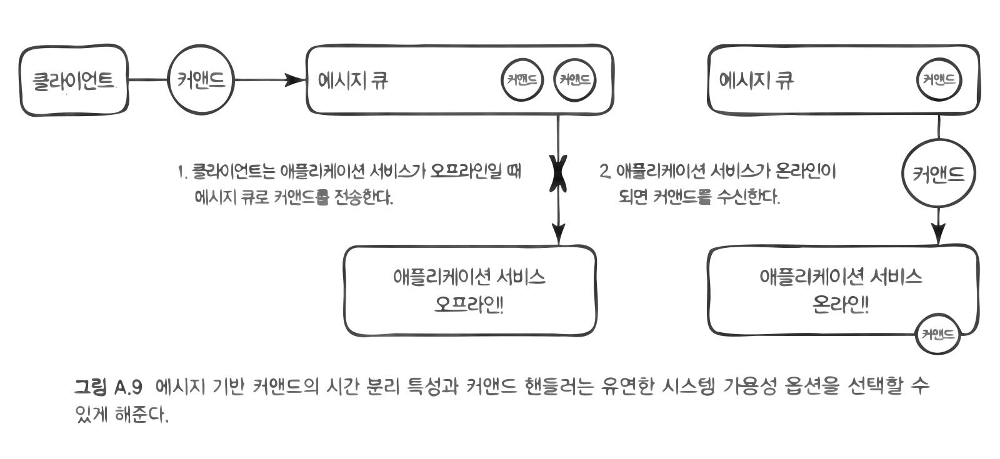

# 책소개

- [도메인 주도 설계 구현](http://www.acornpub.co.kr/book/implement-ddd)<sup>Implementing Domain-Driven Design</sup>
- 반 버논<sup>Vaughn Vernon</sup>

# 2장. 도메인, 서브도메인, 바운디드 컨텍스트

하나의 도메인을 모두 포괄하는 모델을 만드는 것이 왜 문제인지를 책의 생명주기에 빗대어 설명.

-  아래는 책의 생명주기를 다양한 단계로 나눈 것.

```
1. 책을 개념화하고 제안
2. 저자와 계약
3. 책의 저작권 및 편집 프로세스 관리
4. 그림 등 책의 레이아웃 디자인
5. ... 중략
6. 대리점과 소비자들에게 실제 책을 배송
```

-  그리고 아래는 각 단계별로 책이 다뤄지는 방식을 설명.

```
- 책은 계약 시점에 이르러서야 책 제목을 가질 수 있으며, 이 마저도 임시일 가능성이 높음.
- 저술과 편집 과정에서 책의 내용이 채워지며, 코멘트와 많은 수정이 오고감.
- 인쇄 팀은 레이아웃, 인쇄 이미지를 위한 청사진 등에만 관심 있음. 
- 배송에는 책의 식별자, 재고, 위치, 사이즈, 무게와 같은 정보만이 필요함.
```

-  이 모든 아우르는 단일 모델을 만들기에는 혼란, 의견 불일치, 변경의 어려움 등이 따름.
-  대신, 각 수명주기마다 개별적인 바운디드 컨텍스트를 사용.
-  책 객체는 거의 혹은 모든 컨텍스트에서 식별자만을 공유.
-  그리고 각 컨텍스트 마다 책의 모델은 서로 다름.

단일 모델을 피하기 위해 도메인, 서브 도메인, 바운디드 컨텍스트가 필요. 각각의 개념을 간단히 정리하면 다음과 같음.

-  **도메인**: 넓은 의미에서, 한 조직이 행하는 일과 그 조직 안의 세계.
-  **서브 도메인**: 온라인 소매상의 도메인은 상품 카탈로그, 주문, 송장, 배송 등의 주요 서브 도메인으로 이루어짐.
-  **바운디드 컨텍스트**: 그 안에 도메인 모델이 존재하는 명시적 경계. 이 경계 안에서 모든 유비쿼터스 언어의 용어와 구문이 구체적인 의미를 갖게 되고, 정확성을 보장하며 언어를 반영.

그리고 마지막으로 간단한 코드로 이해를 돕고 있음. 아래는 나쁜 설계의 코드.

```java
public class Forum extends Entity {

  public Discussion startDiscussion(String aUsername, String aSubject) {
    if (this.isClosed()) {
      throw new IllegalStateException("Forum is closed.");
    }
    
    User user = userRepository.userFor(this.tenantId(), aUsername);
    if (!user.hasPermissionTo(Permission.Forum.StartDiscussion)) {
      throw new IllegalStateException("User may not start forum discussion.");
    }
    
    String authorUser = user.username();
    String authorName = user.person().name().asFormattedName();
    String authorEmailAddress = user.person().emailAddress();
    
    Discussion discussion = new Discussion(
      this.tenant(),
      this.forumId(),
      DomainRegistry.discussionRepository().nextIdentity(),
      authorUser,
      authorName,
      authorEmailAddress,
      aSubject
    );
    
    return discussion;
  }
}
```

무엇이 나쁜 설계일까?

-  `UserRepository` 뿐만 아니라, `User`를 참조하고 있음.
-  심지어 `Permission`과의 결합도 존재.
-  `Author`와 같은 개념의 모델링 부재.
-  연관된 세 가지 특성(`authorUser`, `authorName`, `authorEmailAddress`)을 명시적인 값 객체로 모으지 않음.

수정된 코드는 아래와 같음.

```java
public class Forum extends Entity {
  
  public Discussion startDiscussionFor(
      ForumNavigationService aForumNavigationService,
      Author anAuthor,
      String aSubject) {
    
    if (this.isClosed()) {
      throw new IllegalStateException("Forum is closed.");
    }
    
    Discussion discussion = new Discussion(
      this.tenant(),
      this.forumId(),
      aForumNavigationService.nextDiscussionId(),
      anAuthor,
      aSujbect
    );
    
    DomainEventPublisher
      .instance()
      .publish(new DiscussionStarted(
        discussion.tenant(),
        discussion.forumId(),
        discussion.discussionId(),
        discussion.subject()
      ));
    
    return discussion;
  }
}

public class ForumApplicationService ... {
  
  @Transactional
  public Discussion startDiscussion(
      String aTenantId, String aUsername,
      String aForumId, String aSubject) {
    
    Tenant tenant = new Tenant(aTenantId);
    ForumId forumId = new ForumId(aForumId);
    Forum forum = this.forum(tenant, forumId);
    
    if (forum == null) {
      throw new IllegalStateException("Forum does not exist.");
    }
    
    Author author = this.collaboratorService
      .authorFrom(tenant, anAuthorId);
    
    Discussion newDiscussion = 
      forum.startDiscussion(
        this.forumNavigationService(),
        author,
        aSubject);
    
    this.discussionRepository.add(newDiscussion);
    return newDiscussion;
  }
}
```

참고로, 보안과 권한을 중앙집중화하라는 이야기도. 이를 **식별자와 액세스 컨텍스트**라고 부름. 여러 다른 바운디드 컨텍스트에서 사용되므로, 이 컨텍스트는 범용 서브 도메인이기도 함.


# 8장. 도메인 이벤트

## 언제 그리고 왜 도메인 이벤트를 사용할까

> 도메인 전문가가 관심을 갖고 있는 어떤 사건이 발생했다.
>
> 연속된 개별 이벤트를 묶어서 도메인에서 일어나는 활동의 정보를 모델링하자. 각 이벤트를 도메인 객체로 표현하자···. 도메인 이벤트는 도메인 모델을 완벽히 지원하며 도메인에서 일어난 어떤 사건을 나타낸다. [Evans, Ref. 20쪽]

- 도메인 전문가로부터 "**…하면 저에게 알려주세요.**" 혹은 "**그런 일이 일어나면…**"와 같은 말이 언급된다면, 이벤트를 모델링 해야 할 여지가 큼.
- 도메인 이벤트는 결합 분리를 가져옴. 글로벌 트랜잭션 대신, 결과적 일관성. 그리고 높은 확장성과 성능. 하지만 지연 시간을 감안.
- 시스템 배치는 트랜잭션이 커서 주로 사용량이 적은 시간대에 수행됨. 도메인 이벤트를 활용하면 이로부터 해방.
- 하지만 모든 상황에 가능한 것은 아님. [여기](https://github.com/codehumane/what-i-learned/blob/master/spring-ms/README.md#analyze-dependencies)의 "Events as opposed to query" 내용 참고.

## 이벤트 모델링

- 이름: 도메인 이벤트의 발생 원인이 된 커맨드 오퍼레이션을 표현.
- 속성: 이벤트가 발생한 시간, 이벤트를 발생시킨 인스턴스와 그 식별자, 그 외 유용한 속성들.
- 행동: 이벤트는 보통 불변으로 설계됨. 따라서 행동 설계는 간단. 이벤트가 전달되는 동안 상태가 바뀐다고 생각해보면 아 끔찍하다.

```java
@Value
public class BacklogItemCommitted implements DomainEvent {
  private Date occurredOn;
  private BacklogItemId backlogItemId;
  private SprintId committedToSprintId;
  private TenantId tenantId;
  ...
}
```

- 때로는 클라이언트가 직접 요청한 내용이 이벤트가 되기도 함.
  - 이런 이벤트들은 고유한 리포지토리를 가질 수 있음.
  - 과거에 일어난 사건을 나타내기 때문에 삭제는 비허용.
- 고유 식별자를 부여하기도 함.
  - 일반적으로는 구별의 필요성도 없으며,
  - 발생시간을 포함한 값객체이기 때문에 대부분 식별이 가능.
  - 하지만 메시지 재발송에 대비하기 위해서는 식별자가 필요할 수도 있음.
  - 일부 메시징 인프라는 헤더/인벨롭<sup>envelope</sup>의 일부로 메시지 식별자를 제공.

## 도메인 모델에서 이벤트를 발행하기

중요하기 보다는 재미있게 읽은 부분. 아래는 발행자 코드.

```java
public class DomainEventPublisher {
  
  @SuppressWarnings("unchecked")
  private static final ThreadLocal<List> subscribers = new ThreadLocal<List>();
  
  private static final ThreadLocal<Boolean> publishing = new ThreadLocal<Boolean>() {
    protected Boolean initialValue() {
      return Boolean.FALSE;
    }
  }
  
  public static DomainEventPublisher instance() {
    return new DomainEventPublisher();
  }
  
  public DomainEventPublisher() {
    super();
  }
  
  @SuppressWarnings("unchecked")
  public <T> void publish(final T aDomainEvent) {
    if (publishing.get()) return;

    try {
      publishing.set(Boolean.TRUE);
      List<DomainEventSubscriber<T>> registeredSubscribers =
        subscribers.get();
      
      if (registeredSubscribers != null) {
        Class<?> eventType = aDomainEvent.getClass();
        for (DomainEventSubscriber<T> subscriber : registeredSubscribers) {
          Class<?> subscribedTo = subscriber
            .subscribedToEventType();
          
          if (subscribedTo == eventType ||
              subscribedTo == DomainEvent.class) {
            subscriber.handleEvent(aDomainEvent);
          }
        }
      }
    } finally {
      publishing.set(Boolean.FALSE);
    }
  }
  
  //...
  
  @SuppressWarnings("unchecked")
  public <T> void subscribe(DomainEventSubscriber<T> aSubscriber) {
    
    if (publishing.get()) return;
    List<DomainEventSubscriber<T>> registeredSubscribers =
      subscribers.get();

    if (registeredSubscribers == null) {
      registeredSubscribers = new ArrayList<DomainEventSbuscrbier<T>>();
      subscribers.set(registeredSubscribers);
    }
    
    registeredSubscribers.add(aSubscriber);
  }
}
```

그리고 아래 그림을 보면 어떻게 사용하는지를 알 수 있음.


## 뉴스를 원격 바운디드 컨텍스트로 전파하기

### 메시징 인프라의 일관성

2가지에 대한 일관성 유지가 필요.

1. 하나는 도메인 모델의 영속성 저장소
2. 다른 하나는 모델이 발행한 이벤트를 전달하는 메시징 인프라의 영속성 저장소

> 이는 모델 변경의 저장이 이벤트의 전달을 보장하고, 메시징을 통한 이벤트의 전달이 해당 이벤트를 발행한 모델에 실제 상황이 반영됐음을 보장하기 위해 필요하다.

이를 위한 방법으로는 3가지를 제시함.

1. 도메인 모델과 메시징 인프라가 같은 영속성 저장소를 공유. 공간적 제약이긴 하지만, 로컬 트랜잭션이므로 성능에 유리.
2. XA 트랜잭션 하에 제어됨. 공간적 제약 없지만, 글로벌 트랜잭션을 위한 특별한 지원이 필요. 고비용이고 성능이 나쁨. 호환성 문제.
3. 같은 저장소를 **이벤트 저장소**로 활용한다는 점에서 1번과 같지만, 메시징 메커니즘이 아닌 바운디드 컨텍스트가 소유하고 제어함.

개인적으로는 [<스프링 마이크로서비스> 책](https://github.com/codehumane/what-i-learned/blob/master/spring-ms/README.md)의 [Handling Exception](https://github.com/codehumane/what-i-learned/blob/master/spring-ms/README.md#handling-exception) 내용이 더 좋은 가이드라고 생각함.

### 자치 서비스와 시스템

도메인 이벤트를 사용하면 자치<sup>autonomy</sup> 서비스(다른 서비스로부터 상당한 독립성을 갖고 동작)를 달성할 수 있다는 이야기. 의존 서비스의 장애로부터 격리 수준이 높아짐. 이런 저런 얘기 중 아래 내용에 공감.

> 실제로 일부 데이터는 시스템 사이에서 복사될 수 있다. 적어도 복사된 데이터는 외부 애그리케잇의 고유 식별자를 포함하게 된다. 그렇지만 한 시스템의 객체가 주변 객체로 정확하게 복사되는 일은 거의 없다. 이런 모델링 에러가 존재한다면, 바운디드 컨텍스트와 컨텍스트 맵을 참고해서 문제가 되는 이유와 해결 방법을 확인하자. 사실 도메인 이벤트가 제대로 설계하면, 그 상태의 한 부분으로 전체 객체를 운반할 일은 거의 없다.

## 이벤트 저장소

이벤트 저장소의 사용은 몇 가지 이점을 가져다 줌.

1. 이벤트 저장소를 큐로 활용. 바운디드 컨텍스트 사이의 통합이 가능. 원격 구독자는 필요에 따라 반응.
2. 폴링 중인 클라이언트에게 REST 기반 이벤트 알림도 가능.
3. 디버깅에 유리.
4. 데이터 분석에 활용. 특정 데이터의 필요성을 뒤늦게 깨닫더라도 활용 가능.
5. 이벤트 소싱에도 활용 가능.

# 10장. AGGREGATE

## 규칙. 진짜 고정자를 일관성 경계 안에 모델링하라.

- 고정자란, "언제나 일관성을 유지해야만 한다는 비즈니스 규칙"을 가리킴.
- 이 때의 일관성이 트랜잭션<sup>transactional</sup> 일관성임에 유의.
- 결과적<sup>eventual</sup> 일관성은 AGGREGATE의 범위를 넘어감.
- 성능, 확장성과 일관성 사이의 균형을 유지하기 위한 노력.

## 규칙. 작은 AGGREGATE으로 설계하라.

- 일관성을 위해 AGGREGATE 범위를 늘려가다 보면,
- 성능과 확장성이 문제가 되는 임계치를 만남.
- 그렇다면, 얼마나 작아야 하는가?
- 책에서는 "루트 엔티티와 최소한의 특성이나 값 타입의 속성으로 제한"하자고 함.
- 또한, 엔티티를 만들기 전에 아래 질문을 고민하다 보면, 상당수가 값 객체로 충분하게 됨.

> 이것이 시간에 따라 변화<sup>change</sup>하는지, 아니면 변경이 필요할 때 완전히 대체<sup>replace</sup>시키면 되는지 생각해보자.

- 결과적으로 AGGREGATE은 주로 하나의 엔티티가 됨.
- 또한, 아래 내용도 경계 설정에 있어 생각해 볼 거리.

> 단순히 하나의 트랜잭션 내에서 일관성을 유지해주길 기대하는 유스케이스가 주어졌다고 해서 이를 반드시 지켜야 하는 것은 아니다. 이런 경우는 대부분 AGGREGATE 사이의 결과적 일관성을 통해 비즈니스 목표를 달성할 수 있다.

## 규칙. ID로 다른 AGGREGATE을 참조하라

- 아래 코드에서는 `BacklogItem`이라는 AGGREGATE 루트가 다른 AGGREGATE 루트인 `Product`를 참조.
- 하나의 AGGREGATE는 참조된 AGGREGATE을 같은 트랜잭션에서 수정하면 X.
- 단지 조회만을 위해 참조를 할 수 있음. 그러나 언제든 수정하고픈 유혹이 생길 수 있음.
- 객체 참조가 아닌, 전역 고유 식별자 즉, ID 참조가 한 가지 방법이 됨.
- 추론 객체 참조<sup>inferred object reference</sup>라고도 부름.
- 결과적으로 AGGREGATE는 작아짐. 성능과 리소스 측면에서 효율적.

```java
public class BacklogItem extends ConcurrencySafeEntity {
  private Product product; // 객체 참조
  private ProductId productId; // ID(전역 고유 식별자) 참조.
}
```

- 한편, ID를 참조하는 경우 모델 탐색은 어떻게 하는가?
- 첫 번째 방법은 단절된 도메인 모델<sup>Diconnected Domain Model</sup>. AGGREGATE 내부에서 REPOSITORY를 사용. 일종의 지연 로딩.
- 두 번째 방법. AGGREGATE 호출에 앞서 DOMAIN SERVICE를 통해 의존 관계 주입.

```java
public class ProductBacklogItemService ... {
  
  @Transactional
  public void assingTeamMemberToTask(
      String aTenantId,
      String aBacklogItemId,
      String aTaskId,
      String aTeamMemberId) {
    
    val backlogItem = backlogItemRepository.backlogItemOfId(
      new TenantId(aTenantId),
      new BacklogItemItd(aBacklogItemId)
    );
    
    val ofTeam = teamRepository.teamOfId(
      backlogItem.tenantId(),
      backlogItem.teamId()
    );
    
    backlogItem.assignTeamMemberToTask(
      new TeamMemberId(aTeamMemberId),
      ofTeam,
      new TaskId(aTaskId)
    );
  }
}
```

- 세 번째 방법. 복잡한 도메인 별 의존성을 해결하기 위해서는, DOMAIN SERVICE를 AGGREGATE의 커맨드 메소드로 전달.
- AGGREGATE는 참조를 엮어주기 위해 [이중 디스패치<sup>double dispatch</sup>](https://en.wikipedia.org/wiki/Double_dispatch)를 수행할 수 있음.
- 책에서 언급되지는 않았지만, 캐싱 메커니즘에 대한 고려까지 함께 필요.

## 규칙. 경계의 밖에선 결과적 일관성을 사용하라

- 2개 이상의 AGGREGATE에서 함께 비즈니스 규칙이 수행되야 한다면 결과적 일관성을 사용하라는 이야기.
- 트랜잭션 일관성과 결과적 일관성 중 어느 것을 선택해야 하는가? 에릭 에반스의 기준을 제시하고 있음.
- 데이터 일관성 보장 주체가 유스케이스를 수행하는 사용자인가?
- 아니면 다른 사용자나 시스템이 해야 하는 일인가?
- 전자는 트랜잭션, 후자는 결과적 일관성을 사용.
- DDD에서 결과적 일관성을 위해 비동기 구독자에게 도메인 이벤트를 발행함.

```java
public class BacklogItem extends ConcurrencySafeEntity {
  
  DomainEventPublisher
    .instance()
    .publish(new BacklogItemCommitted(
      this.tenantId(),
      this.backlogItemId(),
      this.sprintId()
    ));
}
```

# 11장. 팩토리

-  복잡한 생성 로직을 숨길 수 있음.
-  일관성을 보장할 수도 있음. 예컨대, AGGREGATE 생성 시 일부 세부 사항은 잘못된 상태를 갖지 않도록 보호.
-  생성자만으로는 표현할 수 없는 유비쿼터스 언어를 나타낼 수도 있음.
-  예제 코드 하나만 기록.

```java
public class Forum extends Entity {
  public Discussion startDiscussion(
      DiscussionId aDiscussionId,
      Author anAuthor,
      String aSubject) {
    
    if (this.isClosed())
      throw new IllegalStateException("Forum is closed");
    
    Discussion discussion = new Discussion(
      this.tenant(),
      this.forumId(),
      aDiscussionId,
      anAuthor,
      aSubject);
    );
    
    DomainEventPublisher
      .instance()
      .publish(new DiscussionStarted(...));
    
    return discussion;
  }
}
```

# 14장. 애플리케이션

일단, "애플리케이션이란 무엇인가?"에 대한 이야기.

> What's an Application?
>
> To boil it down, I am using the term **application** to mean the finest set of components that are assembled to interact with and support a **Core Domain** model. This generally means the domain model itself, a user interface, internally used Application Services, and infrastructural components. What exactly fits into each of those compartments will vary from application to application and will depend on the specific Architectures in use.

Application Service는 도메인 모델의 개념을 보여주고, 이에 대한 다양한 행동을 취할 수 있게 도와줌. 좀 더 와닿는 표현은 다음과 같다.

> Keep Application Services thin, using them only to coordinate tasks on the model.

아래는 좀 더 구체적인 예시.

- use case tasks coordinate
- transaction management
- necessary security authorizations assert

그 외 설명은 좀 아쉽다. 예시 코드만을 기록하는 것으로 마무리. 출처는 [여기](https://github.com/VaughnVernon/IDDD_Samples/blob/master/iddd_identityaccess/src/main/java/com/saasovation/identityaccess/application/IdentityApplicationService.java).

```java
@Transactional
public class IdentityApplicationService {
    
    // ...

    @Transactional
    public void activateTenant(ActivateTenantCommand aCommand) {
        Tenant tenant = this.existingTenant(aCommand.getTenantId());

        tenant.activate();
    }
    
    @Transactional
    public void addGroupToGroup(AddGroupToGroupCommand aCommand) {
        Group parentGroup =
                this.existingGroup(
                        aCommand.getTenantId(),
                        aCommand.getParentGroupName());

        Group childGroup =
                this.existingGroup(
                        aCommand.getTenantId(),
                        aCommand.getChildGroupName());

        parentGroup.addGroup(childGroup, this.groupMemberService());
    }
    
    // ...
}
```

Application Service가 호출한 도메인 엔티티인 `Group#addGroup` 부분의 코드는 아래와 같음.

```java
public class Group extends ConcurrencySafeEntity {

    public void addGroup(Group aGroup, GroupMemberService aGroupMemberService) {
        this.assertArgumentNotNull(aGroup, "Group must not be null.");
        this.assertArgumentEquals(this.tenantId(), aGroup.tenantId(), "Wrong tenant for this group.");
        this.assertArgumentFalse(aGroupMemberService.isMemberGroup(aGroup, this.toGroupMember()), "Group recurrsion.");

        if (this.groupMembers().add(aGroup.toGroupMember()) && !this.isInternalGroup()) {
            DomainEventPublisher
                .instance()
                .publish(new GroupGroupAdded(
                        this.tenantId(),
                        this.name(),
                        aGroup.name()));
        }
    }
}
```

그리고 여기서 사용된 도메인 서비스 `GroupMemberService#isMemberGroup` 부분.

```java
public class GroupMemberService {
    public boolean isMemberGroup(Group aGroup, GroupMember aMemberGroup) {
        boolean isMember = false;

        Iterator<GroupMember> iter =
            aGroup.groupMembers().iterator();

        while (!isMember && iter.hasNext()) {
            GroupMember member = iter.next();
            if (member.isGroup()) {
                if (aMemberGroup.equals(member)) {
                    isMember = true;
                } else {
                    Group group =
                        this.groupRepository()
                            .groupNamed(member.tenantId(), member.name());
                    if (group != null) {
                        isMember = this.isMemberGroup(group, aMemberGroup);
                    }
                }
            }
        }

        return isMember;
    }
}
```

# 애그리게잇과 이벤트 소싱(A+ES)

## 어플리케이션의 내부

>  일단 변경하는 행동이 완료된 후에는 반드시 `Changes` 컬렉션을 이벤트 저장소로 커밋해야 한다. 쓰기 스레드와 동시성 충돌이 발생하지 않음을 보장하는 가운데, 새로운 변경을 모두 추가한다. `Load()`에서 `Append()` 메소드로 동시성 버전 변수를 넘겨주기 때문에 이를 보장할 수 있다.

-  **690p**에 보면 위와 같이 이벤트 저장소와 동시성 이야기가 언급됨.
-  하지만, "쓰기 스레드와 동시성 충돌이 발생하지 않음을 보장"한다는 말이 무슨 말일까?
-  동일한 객체를 수정하는 둘 이상의 스레드가 동시에 존재하지 않는다는 말로 이해되는데,
-  정말 그렇다면, 이것이 굳이 언급해야 할 만한 장점일까?
-  "동시성 버전"이라는 용어가 사용된 것을 보니, 여전히 낙관적 잠금을 사용하고 있기도 하고.

## 커맨드 핸들러

>  커맨드 객체는 직렬화할 수 있기 때문에 해당하는 텍스트나 바이너리 표현을 메세지 큐를 통해 메시지로 보낼 수 있다. (중략) 어쨌든 클라이언트와 서비스 사이의 결합을 분리하면 로드밸런싱을 개선하고 경쟁적 컨슈머를 사용하고 시스템 파티셔닝을 지원할 수 있다.

-  **693p**의 내용. 애그리게잇에 커맨드와 커맨드 핸들러를 적용할 때의 장점인데,
-  가독성이나 유연성 같은 코드 상의 이점이 아니라, 시스템 상의 이점을 언급하는 것이 흥미로움.
-  요약하면, 쓰기 작업의 로드밸런싱, 경쟁적 컨슈머, 시스템 파티셔닝.
-  또한, 아래 그림처럼 시간 분리<sup>temporal decoupling</sup>도 가능.
-  그리고 짤막하게 소개되었지만, 기존 코드의 영향을 최소화하며, 관점(감사, 로깅, 인증, 유효성 검증 등)을 추가할 수 있다는 것도 와닿는 장점.



## 동시성 제어


-  위 그림은 둘 이상의 스레드가 이벤트 스트림에 접근하면서 발생할 수 있는 경합 문제를 설명함.
-  가장 쉬운 접근법은 예외를 던지고 사용자에게 재시도를 가이드.
-  두 번째 접근법은 시스템 상에서 충돌 감지 후 재시도.
-  그리고 아래는 충돌 발생 시 재시도를 하는 코드.

```c#
try {
  _eventStore.AppendToStream(
    id, eventStream.Version, customer.Changes);
  return;
}
catch (EventStoreConcurrencyException ex) {
  foreach (var failedEvent in customer.Changes) {
    foreach (var succededEvent in ex.ActualEvents) {
      if (ConflictsWith(failedEvent, succededEvent)) {
        var msg = string.format("Conflict between {0} and {1}",
          failedEvent, succededEvent);
        throw new RealConcurrencyException(msg, ex);
      }
    }
  }
  // 충돌 없으면 추가
  _eventStore.AppendToStream(
    id, eventStream.Version, customer.Changes);
}
```

-  이 때의 충돌은 보통 같은 타입의 이벤트에 대해서만 발생하므로 `ConflictsWith`의 내부는 아래와 같음.

```c#
bool ConflictsWith(IEvent event1, IEvent event2) {
  return event1.GetType() == event2.GetType();
}
```

