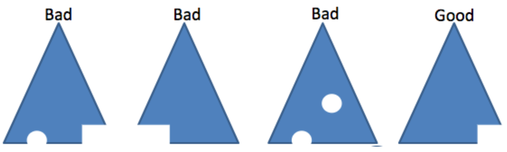

## 책소개

- [생각하는 프로그래밍<sup>Programming Pearls</sup>](http://www.insightbook.co.kr/%EB%8F%84%EC%84%9C-%EB%AA%A9%EB%A1%9D/ppp-%EC%8B%9C%EB%A6%AC%EC%A6%88/%EC%83%9D%EA%B0%81%ED%95%98%EB%8A%94-%ED%94%84%EB%A1%9C%EA%B7%B8%EB%9E%98%EB%B0%8D)
- 지은이: 존 벤틀리

# 아하! 알고리즘

문제를 해결하려고 바로 달려들기 보다는, 문제에 대해 좀 더 생각해보고 영감을 얻자는 이야기. 더불어 약간의 게으름을 강조함. 관련하여 두 가지 재미있었던 부분을 기록. 하나는 반전을 활용한 회전 알고리즘이고, 하나는 동치관계에서 원소들을 표시하는 방법.

## 반전을 활용한 회전 알고리즘

텍스트 편집기에서 6\~10번째 라인을 1\~5번째 라인과 바꾸는 기능을 구현한다고 가정해보자. 이때 필요한 알고리즘이 책에서 말하는 회전 알고리즘이며, 아래와 같이 반전을 활용한 해결책을 소개하고 있다. 참고로, 반전 코드는 메모리 사용량이 적고 빠르다고 한다. 게다가 짧고 간단하다.

> 위의 문제를 배열 ab를 변환하여 ba로 만드는 문제라고 생각해 보자. 그리고 배열의 특정 부분의 원소들을 반전시키는 함수가 이미 존재한다고 가정하면, ab에서 시작하여 a를 반전한 a<sup>r</sup>b를 얻을 수 있고, 다시 b를 반전하여 a<sup>r</sup>b<sup>r</sup>을 얻게 된다. a<sup>r</sup>b<sup>r</sup> 전체를 반전하면 (a<sup>r</sup>b<sup>r</sup>)<sup>r</sup>이 되는데, 이것은 정확히 ba와 같다.

그림으로 보면 다음과 같다.


이 아이디어가 집합의 연산 규칙을 연상시킨다는 점이 흥미롭기도 했고, 알고리즘이 현실과 그리 멀리 떨어져 있지 않음을 느끼게 해주는 점이 인상 깊다. 실제로 Brian Kernighan과 P.J Plauger라는 사람이 1981년에 텍스트 편집기의 줄 옮기기 기능 구현에 이 알고리즘을 사용했다고 한다.

코드는 간단하다.

```
reverse(0, 4); // 앞 쪽의 5개 라인 반전
reverse(5, 9); // 뒤 쪽의 5개 라인 반전
reverse(0, 9); // 전체 라인 반전
```

## 동치관계에서 원소들을 표현하는 방법

[동치관계<sup>equivalence relation</sup>](https://ko.wikipedia.org/wiki/%EB%8F%99%EC%B9%98%EA%B4%80%EA%B3%84)를 표현할 때, 집합에 포함되는 원소가 같은 표기를 갖도록 하는 부분이 재미있었다. 여기서는 [전철어구](https://ko.wikipedia.org/wiki/어구전철)를 예로 들고 있는데, 내용은 아래와 같다.

> 단어 내의 문자를 정렬하여 하나의 전철어구 집합에 대한 표시를 만들 수 있다. 정렬을 한 후 같은 문자의 개수를 나타내는 것도 표시가 될 수 있다. "Mississippi"의 표시는 "i4m1p2s4" 또는, 1을 생략하여 간단히 "i4mp2s4"로 정의할 수 있다. 또는 26개의 정수로 이루어진 배열을 사용하여 포함된 각 문자의 개수를 표시할 수도 있다. 이런 표시는 FBI에서 지문을 인덱싱하는 방법과, 소리는 같지만 철자는 다른 이름을 구별하기 위해 사용하는 사운덱스<sup>Soundex</sup> 휴리스틱에서도 응용된다.

# 프로그램의 구조를 결정하는 데이터

사용하는 데이터 구조를 올바르게 결정하면, 좀 더 효율적이고 오류가 적은 프로그램이 만들어질 수 있다는 이야기. 제목과 다소 상관성은 떨어진다고 생각하지만, 그래도 생각할 거리를 던져 주었던 "에러 메시지"에 대해 기록함.

## 에러 메시지

그동안 다루던 시스템들은 항상 다국어 처리가 필요했다. 하지만 최근엔 다국어가 필요 없는, 그리고 정말로 앞으로도 없을 것만 같은 시스템을 다루고 있다. 이 경우 [Spring의 MessageSource](http://docs.spring.io/spring/docs/current/javadoc-api/org/springframework/context/MessageSource.html)와 같이 메시지 처리를 일원화하는 것이 꼭 필요할까? 개인적으로는 이런 상황에서도, 메시지를 한 곳에서 관리하는 것이 여러 가지 이점을 가져다준다고 믿는다. 하지만 어떤 측면에서는 분명 번거로운 일이기는 하다. 이런 와중에 아래 내용이 이런저런 생각을 다시 하게끔 만들어 준다.

> 지저분한 시스템은 수백 개의 에러 메시지가 코드 여기저기에 흩어져 있고, 다른 출력문과 섞여 있다. (중략) 다음 작업을 수행하는 데 있어서의 어려움을 생각해보라.
>
> - 모든 가능한 에러 메시지에 대한 리스트를 만들라.
> - 모든 "심각한" 에러 메시지에 대해 경고음을 발생시키도록 변경하라.
> - 에러 메시지를 프랑스어나 독일어로 번역하라.

# 봉투 뒷면에 하는 간단한 계산

간단한 계산을 통해 퍼포먼스나 메모리 효율 등 결과를 추정해 보는 것의 중요성을 이야기함. 더불어 Einstein의 유명한 충고를 인용하며, 간단한 계산을 할 때의 주의점도 언급하고 있음.

> 모든 것은 가능한 단순해져야 하지만, 그 이상 단순해지면 안 된다.

## 주먹 구구식 계산<sup>Rules of thumb</sup>

주먹 구구식 계산<sup>Rules of thumb</sup>의 하나로, "76의 법칙"이 간단히 소개되고 있다. 연리가 `r%`이고 투자 기간이 `y년`이라고 할 때, `r * y = 72`가 되면 투자한 돈이 2배가 된다는 이야기다. 간단한 돈 계산에 사용해볼 수 있겠다는 생각에 재밌기도 했지만, 프로그램 수행 시간을 추정해 볼 때도 도움 되겠다는 생각이 들었다. 지수적으로 증가하는 값을 종종 만나기 때문이다. 만약, 입력의 크기 n이 1씩 증가할 때마다 수행 속도가 3%씩 느려진다고 가정해보자. `y = 3`이므로 `r = 24` 일 때 즉, 입력 크기 n이 24일 때 수행 시간이 2배가 된다. 입력 크기가 `24 * x` 이면, 수행 시간은 `2 ^ x` 배가 된다.

## 안전 계수<sup>Safety Factors</sup>

주먹구구식 계산이 도움되는 것은 분명하지만, 지나친 확신을 가지는 것은 위험하다. 아래는 Vyssotsky의 안전 계수<sup>Safety Factors</sup>에 관한 충고이다.

> 여러분 대부분은 아마 'Galloping Gettie', 즉 1940년에 폭풍으로 붕괴되어 버린 Tacoma Narrows Bridge의 사진을 기억하고 있을 것입니다. (중략) 1950년대가 되기 전에는 이것을 정확하게 하는 방법을 자세히 아는 사람은 아무도 없었습니다. 그렇다면 Brooklyn Bridge는 왜 Galloping Gettie와 같이 붕괴되지 않았을까요?
>
> 그것은 John Roebling이 자신이 무엇을 모르는지를 인지하는 데 충분한 센스를 가졌기 때문이었습니다. Brooklyn Bridge의 설계에 대한 그의 노트와 편지가 아직도 남아있는데, 이것은 자신의 지식의 한계를 인식하고 있는 훌륭한 엔지니어의 좋은 예가 됩니다. 그는 현수교에 작용하는 공기역학적 양력을 보아왔기 때문에 그것을 알고 있었습니다. 그리고 그는 자신이 그것을 모델링할 수 있을 정도로 충분히 알지 못한다는 것도 알고 있었습니다. 그래서 그는 Brooklyn Bridge의 노면 트러스에 대한 강도를 그때까지 알려진 정적, 동적 부하를 기초로 한 일반적인 계산 결과가 요구하는 것의 6배가 되도록 하였습니다. 그리고 그는 노면 밑으로 이어지는 대각선 방향의 내구력 네트워크를 지정하여 전체 교량 구조를 강화하였습니다. 시간이 되면 직접 가서 보십시오. 거의 유일한 구조입니다.
>
> (중략)
>
> Roebling은 훌륭한 엔지니어였고, 그가 모르는 부분을 보충하기 위해 안전 계수를 크게 잡아 훌륭한 다리를 만들었습니다. 우리도 그렇게 하고 있습니까? 저는 여러분에게 실시간 소프트웨어의 퍼포먼스를 계산할 때 우리가 모르는 부분을 보충하기 위해 결과를 두 배, 네 배, 혹은 여섯 배 느리게 할 것을 제안합니다. 신뢰성/가용성에 대한 어떤 목표치를 만족시키려 할 때 모르는 부분을 보충하기 위해 우리는 그 목표로부터 한발 물러서서 우리가 그 목표의 열 배로 만족시킬 수 있을지를 생각해야 합니다. 크기, 비용, 스케쥴을 추정할 때, 우리가 모르는 부분을 보충하기 위해 두 배, 또는 네 배 더 보수적이 되어야 합니다. 우리는 John Roebling처럼 설계를 해야 하지, 그가 살던 시대의 다른 사람들과 같이 해서는 안됩니다. 제가 알기로는 Roebling이 살던 시대의 다른 사람들에 의해 미국에 세워진 현수교 중 지금까지 남아 있는 것은 없고, 1870년대에 미국에서 건설된 모든 형태의 교량 중 1/4이 세워진지 10년이 안되어 붕괴되었습니다.
>
> 우리는 John Roebling과 같은 엔지니어일까요? 저는 궁금합니다.

# 힙<sup>Heaps</sup>

힙<sup>Heaps</sup>에 대해 설명함. 그리고 힙을 이용해 정렬과 우선순위 큐를 구현함. 이들 오퍼레이션은 힙의 특성으로 인해 O(n log n) 시간 복잡도를 가짐.

개인적으로는 <[알고리즘 문제해결전략](http://book.algospot.com/)>의 23장에 나온 힙 설명이 더 좋았음.

## 2가지 속성

1. 순서: 모든 노드의 값은 그 자식 노드의 값보다 작거나 같다.
2. 모양: 마지막 레이어를 제외한 모든 레이어는 완전하다. 그리고 마지막 레이어는 왼쪽부터 채워진다.



출처: [Algorithms and Data Structures Vassilis Athitosos, University of Texas at Arlington](http://slideplayer.com/slide/10453907/)

위 그림이 힙의 두 번째 속성(구멍도 없고, 마지막 레이어는 왼쪽부터 채워짐)을 잘 설명하고 있음. 이로 인해, 모든 노드는 루트로부터의 거리가 ln(n) 이내가 됨.

## Heapify

책에서는 "두 가지 중요한 함수"라는 이름을 사용함. 이 함수들은 주어진 배열이 힙 속성을 만족시키도록 원소들의 순서를 조정함. `Heapify` 용어가 이 동작을 잘 나타낸다고 생각하여 제목으로 사용함. 어쨋든 이를 위해 2가지 함수를 소개하고 있는데, 하나는 상향식이고 나머지 하나는 하향식 구현임. 방법의 차이일 뿐 효율성은 동일함. 상향식 구현은 아래와 같음.

```
void siftup(n)
    pre n > 0 && heap(1, n-1)
    post heap(1, n)
  i = n
  loop
    if i == 1
      break
    p = i / 2
    if x[p] <= x[i]
      break
    swap(p, i)
    i = p
```

## 우선순위 큐와 정렬

이제 O(n log n) 시간복잡도를 가지는 우선순위 큐와 정렬 구현이 가능함. 따로 기록하지는 않음. 생각해 볼 것.