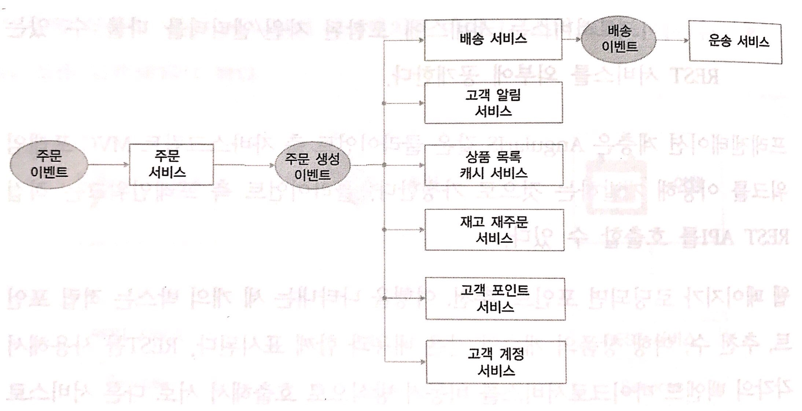
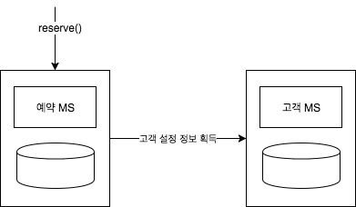
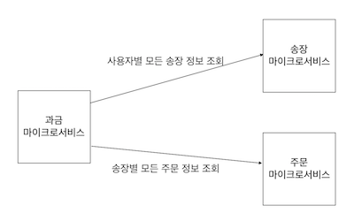

# 책소개

라제시 RV(Rajesh RV), [스프링 마이크로서비스](http://www.acornpub.co.kr/book/spring-microservices)

# Demistifying Microservices
기술적 매력이나 한계가 아닌, "비즈니스적 요구"로 책을 시작하는 것이 인상깊음. 아래 문장도 흥미로움.

> 많은 조직들이 고객을 사로잡는 핵심 비즈니스 애플리케이션에만 마이크로서비스를 사용하고, 나머지는 기존의 레거시 일체형 애플리케이션을 그대로 두는 방식을 취하기도 한다는 점도 기억해둘만 하다.

아래 그림은 마이크로서비스의 한 예시.

1. 주문 이벤트 접수되면 `주문 서비스`에서 먼저 처리되고, 주문 상세 정보다 데이터베이스에 담김.
2. 주문 저장이 성공하면 `주문 생성 이벤트`가 발생함.
3. `주문 생성 이벤트`는 순차 혹은 병렬적으로 다른 서비스들에 의해 처리됨.
4. `배송 서비스`는 `주문 생성 이벤트`를 받아, 고객에게 배송하기 위한 기록을 남긴 후 `배송 이벤트`를 전파.
5. `운송 서비스`는 `배송 이벤트`를 받아 운송 계획 생성함.
6. `고객 알림 서비스`는 주문 결과를 고객에게 이메일, 문자 등으로 알림.
7. `상품 목록 캐시 서비스`는 주문 후 남아 있는 상품 개수를 갱신함.
8. `재고 재주문 서비스`는 재고를 조사하고 필요하다면 `재고 고갈 이벤트`를 생성함.
9. `고객 포인트 서비스`는 구매로 발생한 적립 포인트를 누적시킴.
10. `고객 계정 서비스`는 고객 계정의 주문 이력을 업데이트.

마이크로 서비스 적용하기에 좋은 경우와 그렇지 않은 경우도 이야기함. 요약하면 아래와 같음.

1. 수명이 다한 무거운 레거시 재작성. 전부 새롭게 만드는 대신, 점진적으로 하나씩 이관함. 비즈니스 위험을 분산시킬 수 있음.
2. 독립적인 무상태 컴퓨팅 단위. 최적화, 예보, 가격 산정, 제안, 암호화, 인증 서비스 등이 해당함.
3. 재사용 단위. 결제, 로그인, 고객 프로파일, 알림 서비스 등.
4. 빠른 변경과 배포 속도가 필요하거나, 실험적인 애플리케이션도 대상.
5. 비즈니스 로직을 ESB와 같은 무거운 중앙 집중적 컴포넌트에서 관리해야 하는 경우는 적합치 않음.
6. 조직의 문화가 폴포수 모델이거나 무거운 출시 절차 등을 가지거나, 인프라스트럭처 자동 구성 부재 등의 경우도 적합치 않음.

# Applying Microservices Concepts

## Patterns and common design decisions

### Establishing appropriate boundaries

> 많은 조직에서는 비즈니스 본연의 성격보다는 서비스 제공 채널에 바탕을 두고 조직을 구성한다. 이런 경우라면 조직도는 서비스 경계에 대한 정확한 정보를 제공해 주지 못한다.

- Autonomous Functions
  - 외부 기능에 대한 의존도가 낮아, 입력을 받으면 내부 로직과 데이터로 결과 반환 가능함.
  - 암호화 엔진, 알림 엔진, (주문을 받아 처리하고 운송 서비스에 알려주는) 배송 서비스, (좌석 현황 정보를 캐시해 서비스하는) 온라인 항공편 검색 기능.
- Size of deployable unit
- Polyglot architecture
  - 다양한 비기능/기능적 요구 사항을 충족시키기 위한 고유 기술 선택.
  - 예약은 ACID 준수하는 MySQL 사용. 검색은 Cassandra 같은 NoSQL 사용.
- Selective scaling
  - 예컨대, 예약 시스템에서 요청의 절반을 차지하는 검색을 분리.
- Single Responsibility
- Replicability or changeability
- Coupling and cohesion
  - 가장 중요한 요소.
  - 기능 분해도나 의존 관계 트리가 도움이 됨.

### Designing communication styles

#### Synchronous

- 공유 메시지 서버 같은 인프라 관리 비용이 없음.
- 어떤 단계에서 에러가 발생해도 데이터 일관성 보장.
- 불필요한 대기 시간이 발생하기도 함.
- 고정적인 의존 관계가 명시됨.
- 하나의 서비스 체인 문제가 전체로 이어지기도 함.
- 실패 시나리오의 많은 부분은 타임아웃 및 이벤트 루프로 해결 가능.

#### Asynchronous

- 동기 방식에 비해 더 고수준의 확장성 제공.
- 특정 서비스의 문제가 전체로 이어질 가능성 낮아짐(비동기 방식에서도 [Catastrophical Failover](https://martinfowler.com/bliki/CatastrophicFailover.html)는 발생함).
- 외부의 메시징 서버에 의존하게 됨.
  - 메시징 서버가 장애를 견딜 수 있게 하는 것은 쉽지 않음.
  - 메시징은 활성/비활성 기준으로 동작. 그래서 지속적 가용성 확보가 쉽지 않음.
  - 일반적으로 영속성을 사용하므로, 더 높은 수준의 I/O 처리와 튜닝이 필요함.

비동기 방식 중에서 잘 이해 안되는 부분이 있음.

> 이 방식에서는 서비스가 독립적이고, 요청을 처리하는 스레드를 내부적으로 재생산해서 부하의 증가를 처리할 수 있기 때문에 더 고수준의 확장성을 제공한다.

여기서 `요청을 처리하는 스레드를 내부적으로 재생산해서 부하의 증가를 처리`의 의미는 Non-Blocking을 의미하는가 싶다.

#### Which style to choose

아래 문장이 내용을 대표한다고 생각함.

> 일반적으로 마이크로서비스 세상에서는 비동기 방식이 더 나은 경우가 많지만, 장단점을 잘 따져서 적합한 패턴을 선별하는 것이 중요하다. 비동기 방식의 트랜잭션이 아무런 장점이 없어 보이는 비즈니스라면 비동기 방식의 장점이 보일때까지 동기 방식을 사용하면 된다.

- 고객의 정보를 단순히 DB에서 가져오는 데 비동기를 사용하는 경우가 잘못된 사례로 소개됨.
- 방식은 비동기지만 사용자에게 결과를 보여주기 전까지는 결국 블럭되어 대기하게 됨.
- 참고로, 리액티브 프로그래밍은 비동기 방식의 복잡성을 다룰 수 있도록 도와줌.

### Orchestration

- **Composability** ∈ { **Orchestration**, **Choreography** }
- 마이크로서비스는 자율적. 기능이 실행되는 데 필요한 모든 컴포넌트가 서비스 내에 존재.
- 이벤트(메시지)의 소비는 소비자 스스로 결정.

여기까지는 어찌보면 뻔한 내용. 하지만 뒤이어 현실적인 내용이 언급됨. 이 책의 전반적 장점 중 하나.

> 하지만 모든 사례에 대해 연출 방식으로 모델링하는 것은 불가능하다

아래 그림은 예약 진행을 위해 고객 정보를 획득해야 하는 경우.

1. 동기적 호출도 한 가지 방법
2. 고객 MS를 예약 MS로 이동. 교류가 필요 없어짐. 이런식이면 또 다른 일체형이 만들어질 수 있음.
3. 비동기적 호출. 하지만 고객 정보를 얻어야 예약 진행이 가능하므로, 의미가 없음.
4. 오케스트레이션 부분만을 담당하는 MS 추가. 자율적이지 않은 MS들. 너무 잘게 나눠진 MS 가능성들.
5. 고객 설정 정보 복사본을 예약 MS에 두기. 빈틈없는 분석 선행되야 하고, 결국 복잡도가 높아짐.

### Data stores share

> 처음에는 좋을 수도 있지만, 복잡한 마이크로서비스를 개발하다 보면 데이터 모델 사이에 계속 관계를 추가하고, 조인 쿼리를 만들어내게 된다. 이는 단단하게 결합된 물리 데이터 모델이 될 수도 있다.

일반적인 DB 분리의 이야기. 더불어 아래의 내용도 함께 언급.

> 서비스가 많지 않은 수의 테이블만 갖고 있다면 오라클 데이터베이스 인스턴스와 같은 전체 DB 인스턴스를 사용하는 것은 낭비에 가깝다. 그런 경우에는 스키마 수준의 분리만으로도 시작하기에는 충분하다.

### Transaction boundaries

Eventual Consistency를 적용하여 오버헤드를 줄이곤 한다. 이 경우 문제될 수 있는 부분과 각각의 해결책 언급.

1. 남아 있는 호텔 방 1개를 3명의 사용자가 동시에 예약 시도하는 경우
   - 해결책만 언급됨. 문제는 소개되지 않음.
   - 예약 가능한 방이 없는 경우는 `예약 확정 대기`라는 상태를 둠.
   - 비즈니스 모델 자체를 바꾸는 경우 문제가 쉬워지는 사례라고 함.
2. 하나의 트랜잭션으로 묶인 여러 데이터를 다루는 경우
   - NoSQL에서는 모든 데이터를 JSON으로 한 곳에 입력.
   - 명시적인 트랜잭션 경계가 필요 없음.
3. 비행기 예약 요청(A 서비스)에서 휠체어 예약(B 서비스) 메시지 전송 후, 비행기 예약이 실패하는 경우
   - 가능한 휠체어 예약 메시지 전송을 뒤로 미룸.
   - 그럼에도 불구하고 비행기 예약이 실패하는 경우는, 휠체어 예약을 취소해 달라는 후처리 필요함.

### Endpoint design

다른 내용이 아닌, 계약 설계Contract Design 내용만을 정리함.

- 가장 중요한 것은 단순함. **KISS**, **YAGNI**.
- **CDCConsumer Driven Contract**
  - 클라이언트가 그들의 기대를 테스트 케이스로 만들어 프로바이더에게 제공함.
  - 프로바이더들은 계약이 변경될 때 마다 이 테스트 케이스를 수행하여 영향 범위를 확인함.
- **Postel's Law**도 언급되지만, KISS와 YAGNI 뒤에 언급되고 있음에 유의.

### Shared libraries

- 서비스 간에 중복된 기능이 존재할 수 있음.
- 여기서는 적격성 검사 규칙(Eligibility Rules)을 사례로 들고 있음.
- 한 가지 방법은 마이크로서비스를 추가하는 것.
- 하지만 의존관계가 하나 추가되며, 서비스 출시 관리나 성능 면에서 부정적.
- 한 가지 대안은 라이브러리를 복제하는 것.
- 요소 기술을 다루는 라이브러리나 기능 컴포넌트로 한정하고 있음에 유의.

### Versioning

- 서비스 진화를 돕는 요소로써, 미리 고려해야 하는 사항.
- 시맨틱 버전이 널리 사용됨.
  - 메이저, 마이너, 패치로 구성.
  - 메이저: API 호환이 안 될 수도 있는 대규모 변경.
  - 마이너: 하위 호환을 유지하는 한도 내에서의 변경.
  - 패치: 하위 호환을 유지하는 버그 수정.
- 서비스 버저닝은 불변 서비스immutable service의 의미

> 서비스 버전 번호는 서비스 내의 단위 기능 수준에서 적용하는 것보다 서비스 수준에서 적용하는 것이 언제나 더 간단하다. 단위 기능이 변하면 단위 기능의 버전을 V2로 하는 것보다, 서비스의 버전 번호를 V2로 하는 것이 관리하기 좋다.

그런데, 어떤 면에서 관리하기 좋다고 하는 것인지 궁금. 하나의 기능 변화로 버전 전체를 올려야 한다면, 그 만큼 코드 작업을 해줘야 함. 이 비용을 넘어서는 이점이 무엇일까?

### Shared reference data

여러 마이크로서비스에서 공유하는 레퍼런스(혹은 마스터) 데이터를 어떻게 관리할 것인가?

1. **hardcode**: relatively static, never chaning data
2. **microservice**: 별도의 마이크로서비스로 분리
   - "good, clean, and neat"이라고 표현함.
   - 다만, 각 서비스들에서 여러 번 호출될 수 있음.
3. **replication**: 각 서비스들이 데이터를 복제해서 소유함.
   - 변경이 발생하면, 다른 서비스들에도 반영.
   - "extremely performance friendly"
   - 모든 서비스에서 데이터를 동기화하는 것의 부담.
   - 코드 베이스와 데이터가 단순하거나, 데이터가 비교적 정적인 경우에 적합.
4. **cache locally**: 로컬에 캐시하여 소유. 마스터 데이터를 많은 수의 서비스가 의존하는 경우 많이 사용됨.

### Bulk operation

서로 다른 서비스의 데이터 스토어에서 조인 SQL을 사용할 수 없음. 대신, 다른 마이크로서비스로의 요청이 너무 많아짐.

두 가지 대안.

1. **pre-aggregation**
   - 주문 생성시 과금 마이크로서비스에 이벤트 발송됨.
   - 과금 마이크로서비스는 월별 정산을 위해 내부적으로 데이터를 집계.
   - 외부로 요청 보내지 않아도 됨.
   - 데이터 중복은 단점.
2. **batch API**
   - 첫 번째 방식이 어려운 경우에 사용.
   - 제목만 보면 이해가 되지만, 내용을 보면 오히려 이해 안됨. 원서를 봐도 마찬가지.

## Challanges

### Data island

- 각각의 서비스가 서로 다른 형태(ElasticSearch, Neo4j 등)로 데이터를 저장.
- 이를 조합해서 데이터를 분석해야 하려면 어떻게 해야 하는가.
- 여기서는 데이터 호수data lake를 언급.
- 어떤 데이터가 처리되면 이벤트를 발생시켜 호수에 전파.
- 전통적 데이터 웨어하우스와는 다르게, 데이터가 어떻게 사용될지에 대한 아무런 가정 없이 있는 그대로 저장.
- BI 툴에서 표현할 데이터는 이런 데이터 호수 개념을 활용하면 어떨까 함.

### Testing

- 의존 서비스의 가상화 혹은 모킹mocking
- 깊은 의존 관계가 형성된 경우 위 방식으로는 한계.
- 서비스 사용자 주도 계약consumer driven contract가 하나의 대안.
- 그 외 테스트 자동화, 성능 테스팅, A/B 테스팅 미래 깃발future flag, 카나리아 테스팅, 블루/그린 배포, 레드/블랙 배포를 언급.

# Microservices Evolution – A Case Study

여기서부터는 번역서 내려 두고, 원서만 읽음. 잘못된 정리 가능성에 유의.

3장에서 언급됐던, 마이크로서비스가 갖추어야 하는 기능capabilities 모델 그림이 다시 소개됨. 여기서 기능들은 크게 4가지(Core, Supporting, Process & Governance, Infrastructure)로 구분됨. 이 4가지 분류도 흥미롭고, 각각의 항목들을 현재 담당하는 서비스와 비교하는 것도 재미있음. 글로 간단히 정리.

**Core Capabilities**

User Interfaces, API Gateway, Service Endpoints & Communication Protocols, Business Capability Definitions, Event Source, Storage Capabilities: Physical / In-Memory, Service Listener: HTTP / Message

**Supporting Capabilities**

Software Defined Loadbalancer, Central Log Management, Service Registry, Monitoring & Dashboards, Security Service, Dependency Management, Configuration Service, Data Lake, Testing Tools, Reliable Messaging

**Infrastructure Capabilities**

Private/Public Cloud (IaaS), Container/Virtual Machine, Cluster Control & Provisioning, Application Lifecycle Management

**Process & Governance Capailities**

DevOps, DevOps Tools, Microservices Repository, Reference Architecture & Libraries

## Unerstanding the PSS application

PSS라는 가상의 항공편 제공 시스템을 사례로 들고 있음. 가장 먼저, 이 시스템을 기능적 측면과 아키텍처 측면으로 간략히 소개하고 있는데, 그 중에서 기능적 측면을 관심있게 살펴봄. IT 서적들에서는 주로 기술적 어려움만을 다루기 때문임. 비록 아주 간단하게 설명하고 있지만, 이 마저도 반가움.

1. **Search**: Search, Flight, Fare
2. **Reservation**: Book, Inventory, Payment
3. **Check-in**: Check-in, Boarding, Seating, Baggage, Loyalty
4. **Back Office**: CRM, Data Analysis, Revenue Management(Fare calculation based on forecasts), Accounting (Invocing and Billing)
5. **Data Management**: Reference Data, Customer
6. **Cross Cutting**: User Management, Notification

개인적으로는 Data Management, Reference Data의 명칭과 분류가 아쉬움.

## Death of the monolith

처음엔 잘 동작하지만, 사용량이 많아지면서 생기는 모놀리스의 문제들을 소개.

### Pain Points

1. 안정성Stability
   - DB 테이블 락 -> 스레드 잠식stuck threads -> 요청 처리 능력 제한
   - 메모리 이슈
   - 리소스 사용이 많은 동작들
2. 정전Outages
   - EAR 크기 증가 -> 서버 시작 시간 증가 -> outage window 증가 -> 정전 사이에 쌓인 메시지로 인해, 서버 시작 직후 부담 증가
   - 작은 변화에도 전체 배포
   - 무중단 배포의 복잡성 + 서버 기동 시간 -> 정전 수와 시간 증가
3. 민첩성Agility
   - 변화를 구현해 내는 역량의 부족 등 다양한 이유로 코드 복잡성 증대 -> 분석 어려움 -> 동작하는 코드를 깨뜨림. 잦은 픽스 -> 변화 어려움.
   - 빌드 시간 증대 -> 개발 생산성 하락, 빌드 자동화와 단위 테스트 등을 어렵게 만듦.

### Stop gap fix

제목을 어떻게 번역했을지 궁금. 어쨋든 정리하면,

1. 스케일 업으로 일부 문제들 해결
2. 하지만 곧 스케일 아웃 진행
3. 얼마 지나지 않아 DB가 병목이 됨
4. Oracle의 RAC를 통해 해결
5. 하지만 복잡성과 소유 비용cost of ownership(?) 증가
6. 기술 부채 역시 지속적으로 증가
7. 재작성만이 이를 해결할 수 있는 수준이 됨

### Retrospection

왜 잘 설계된 어플리케이션이 실패했을까?

**SHARED DATA**

1. 거의 모든 기능 모듈들이 필요로 하는 참조 데이터들이 있음. 도시, 나라, 환율, 비행기 등.
2. 이들을 각각의 독립적인 서브시스템으로 나눌 수 있음. 하지만 성능 이슈.
3. 공유 라이브러리로 이 참조 데이터들을 사용하기로 함.
4. JPA의 엔티티 관계를 생각하면 됨.

**SINGLE DATABASE**

1. 하지만 결국은 하나의 DB를 사용함.
2. JDBC SQL들을 직접 사용하면 좋은 성능을 얻을 수 있음.
3. 서로 다른 서브시스템들이 소유한 DB 테이블들을 직접 참조하기 시작함.
4. 예를 들어, N+1 문제를 피하기 위해 타 시스템 테이블들을 직접 참조하여 조인함.
5. 시스템 간의 강결합이 되고, 문서화도 되지 않으며, 발견하기도 어려움.
6. 이는 Native queries에 대한 이야기이며, Stored procedures도 마찬가지.

**DOMAIN BOUNDARIES**

1. 도메인 간의 경계가 잘 설정되어 있긴 하지만, 모두 EAR 파일 하나로 패키징 됨.
2. 빠른 배포 압박, 복잡성 증대 등의 이유로 개발자들은 쉽고 빠른 해결책들을 쫓게 됨.
3. 원래의 의도와는 다르게 모듈간의 결합도가 점점 높아짐.

## The business case

마이크로서비스에서는 모놀리스 방식에서의 이슈들을 어떻게 극복하는가? 1장에서 충분힌 소개되었지만, 지금 사례에서 중요한 4가지를 다시 언급.

1. **Service dependencies**: 마이크로서비스로 전환하면서 의존성들이 드러나게 됨. 더 나은 시스템 설계에 도움이 됨.
2. **Physical boundaries**: 물리적인 수준으로 경계가 나눠짐. 심지어 기술 스택이 다를 수 있음. 강결합을 더 적극적으로 피할 수 있음.
3. **Selective scaling**: Y-scale 접근법에 비해 좀 더 cost-effective scaling 가능함.
4. **Technology obsolescense**: 기술 전환의 단위가 작아짐. 좀 더 쉽고 빠르게 전환 가능함.

