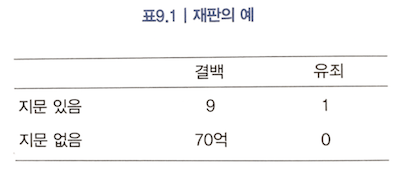

# 책 소개

신은 주사위 놀이를 하지 않는다. 원제는 The Improbability Principle (Why Coincidences, Miracles, and Rare Events).

> 왜 일어날 것 같지 않은 일이 일어날 수 밖에 없는지를 설명함. 이미 많이 보던 내용을 담고 있을 것 같아, 읽지 않으려 했으나, 막상 읽어보니 한참 재미있게 읽음.

# 결국 일어나게 되어 있다

- 필연성의 법칙law of inevitability: 만일 당신이 가능한 모든 결과들의 목록을 완전하게 작성한다면, 그 결과들 중 하나는 반드시 나타난다.
- 선택의 법칙: 만일 어떤 결과가 나올 때까지 기다릴 수 있다면, 그 결과가 나오리라고 확신할 수 있다는 것이다.

# 참 많기도 하다

- 큰 수의 법칙: 아주 많은 기회가 있으면, 아무리 드문 일도 일어날 가능성이 높다.
- 조합의 법칙law of combinations

조합의 법칙 설명에는 흔히 인용되는 생일 이야기가 사용됨. 방 안에 있는 사람들 중 생일이 똑같은 두 사람이 ‘있을 가능성’이 ‘없을 가능성’보다 높으려면 얼마나 많은 사람들이 있어야 할까? 답은 23명.

`1 - 364/365 x 363/365 x … x 342/363 = 0.51`

## 주사위 이야기

주사위 이야기를 재밌게 시작하고 있어 그대로 기록.

> "내 주사위들 중 하나는 똑같은 면 10개를 가졌고 전체적으로 대칭이어서 꽤 특별하다. 하지만 입체기하학에 정통한 이라면 내가 거짓말을 한다고 의심할지도 모르겠다. 똑같은 면 10개를 가진 대칭적인 3차원 도형은 존재하지 않으니까 말이다. 그러므로 신뢰를 회복하기 위해 그 주사위가 실은 십각 기둥 모양이라는 점을 밝히겠다. 그 주사위는 횡단면이 정십각형이고 양끝이 둥글게 처리된 기둥의 형태다.”

## 평균에 관한 농담

> “발이 오븐 안에 있고 머리가 냉장고 안에 있으면 평균 체온은 정상이다”

# 과녁을 나중에 그린다면

어떤 사건이 일어난 뒤에 선택한다면, 확률을 원하는 만큼 높일 수 있다는 선택의 법칙을 설명.

> “똑같은 이치를 보여주는 오래된 이야기를 하나 더 들려주겠다. 어떤 사람이 시골길을 걷다가 헛간 앞을 지나쳤다. 헛간 벽에는 활쏘기 표적이 여러 개 그려져 있었는데, 각 표적의 정중앙마다 화살이 꽂혀 있었다. “우아! 누군지 몰라도 정말 대단한 궁사인걸!” 그는 감탄하며 헛간을 지나쳐 계속 걸었다. 그러다가 고개를 돌려 헛간의 다른 벽을 바라보니, 거기에도 많은 화살이 꽂혀 있었다. 그리고 한 남자가 각 화살을 중심으로 부지런히 활쏘기 표적을 그리고 있는 것을 목격했다. 이 이야기 역시 만일 사후에 데이터를 ‘선택'한다면 확률을 원래와 전혀 다르게 보이도록 만들 수 있음을 보여준다.”

## 선택 법칙의 특수화

- [사후 설명 편향hindsight bias](https://en.wikipedia.org/wiki/Hindsight_bias): “자, 이걸 보라고. 위험 징후가 우리 눈앞에 있었어!”
- [인간 원리anthropic principle](https://en.wikipedia.org/wiki/Anthropic_principle)
- [하킹HARKing](http://journals.sagepub.com/doi/abs/10.1207/s15327957pspr0203_4): 결과를 안 다음에 가설을 정하기hypothesizing after the results are known의 축약형
- [출판 편향publication bias](https://en.wikipedia.org/wiki/Publication_bias) 혹은 서류함 효과file drawer effect: 어떤 현상을 보여주는 데 실패했다는 내용의 논문이 성공했다는 내용의 논문보다 덜 선호되어, 저널에 실리지 못하고 서류함에 담기고 만다는 얘기.
- 선택적 설문 조사self-selected survey
- 탈퇴 편향dropout bias
- [기간 편향Length-time bias](https://en.wikipedia.org/wiki/Length_time_bias)

## 애매성과 충분함의 법칙

어떤 사람이 말한 내용과 실제로 일어난 사건 사이의 일치성은 없더라도, 크게 어긋나지만 않으면 양쪽이 일치한다고 간주할 수 있는 위험성을 이야기. 내용뿐만이 아니다. 꿈이 실제 사건의 예언으로 간주되려면 둘 사이의 간격은 얼마나 짧아야 하는가? 하루, 일주일, 그리고 일년이 될 수도 있다. ‘미래 예측의 핵심은 자주하는 것’이라는 말이 어느 정도는 이해가 됨.

> “2장에서 설명한 예언의 원리를 돌이켜보라. 그릇된 개연성 평가의 핵심에는 대개 애매성이 놓여 있음을 새삼 실감할 것이다. 더 나아가 애매성은 내가 ‘충분함의 법칙law of near enough’이라고 부르는 우연의 법칙의 또 다른 가닥의 핵심이기도 하다.”

<신기관>이라는 책 내용을 인용하기도 함.

> “사람들이 어떤 이에게 교회 벽에 걸린 그림을 보여주었다. 그림에는 신 앞에 신앙을 고백한 덕에 난파를 당하고도 살아남은 사람들이 그려져 있었다. 사람들은 그에게 이제 신의 능력을 인정하겠느냐고 물었다. 그러자 그는 ‘그럼요, 당연합죠’라고 답하면서 이렇게 반문했다. ‘그런데 고백하고도 빠져 죽은 사람들은 어디에 그려져 있나요?’ 훌륭한 대답이었다.”

그리고 아래와 같이 코멘트.

> “오직 난파를 당하고 살아남은 자들만이 자기네가 신 앞에 신앙을 고백했다고 증언할 수 있다.”

## 평균으로의 회귀 형태를 가진 선택의 법칙과 무작위 대조 실험

선택의 법칙은 평균으로의 회귀 형태로도 나타난다. 카메라를 설치했을 때 사고 건수가 준 것은, 단지 평균으로의 회귀일 수도 있다. 물론, 사고 건수를 줄이기 위한 노력이고, 또한 실제로 효과가 있다(세금을 거두기 위한 것이 아니라고 한다). 그러나 선택의 법칙을 간과하면 카메라의 효과가 과대평가 될 수 있음. 그 외에도 여러 가지 사례를 소개.

- 영화의 속편이 성공하지 못하는 이유
- 시간이 지나면 자연적으로 치유될 수 있는 병에 걸렸는데, 약을 먹어서 회복되었다고 착각.
- 성적이 좋은 조종사에게는 칭찬을 했더니 결과가 나빠지고, 성적이 좋지 않은 조종사에게 비판을 했더니 결과가 좋아지는 것을 보고, 칭찬을 하면 안된다고 착각.

[무작위 대조 실험randomized controlled tiral](https://en.wikipedia.org/wiki/Randomized_controlled_trial)은 이런 위험 극복을 도와줌. 동등한 대상을 두 집단으로 나누는 것이 필수. 약을 실험할 경우를 예로 들면, 동등한 조건의 환자를 두 집단으로 나눈 뒤, 한 집단에게는 약을 주고, 나머지 한 집단에게는 약을 주지 않는 것. 그러면 시간이 지나서 회복이 된 것인지, 약을 먹어서 회복이 된 것인지를 비교할 수 있다.

# 나비의 날갯짓

‘상황이 미세하게 바뀌면 확률이 엄청나게 달라질 수 있다는 것’이 저자가 명명한 확률 지렛대의 법칙이다. 여기서 말하는 ‘상황이 미세하게 바뀌는’의 예를 들면, ‘정규 확률 분포를 감안할 때’라는 전제가 ‘코시 분포를 감안할 때'라고 바뀌는 것이다. 이 두 그래프는 아래 그림처럼 매우 유사하지만, 어떤 그래프를 전제했느냐에 따라 4.2 \* 10^21(책에서 언급한 사례의 경우이다)의 차이가 날 수도 있다.

## 관찰된 분포가 절대로 정확한 정규분포가 될 수 없는 이유

왜 정확히 정규분포인 경우가 절대로 없는지를 설명함. 그리고 이 이유 때문에, 엄청난 차이의 결과를 가져올 수 있음을 경고.

- 실제 분포가 정규분포를 벗어나는 흔한 이유 중의 하나는 오염contamination.
  - 한 집단이라고 여기던 것이 실은 서로 다른 부분 집단들의 합.
- 선택의 법칙으로 인한 정규분포로부터의 이탈.
  - 별들의 어떤 속성이 이론적으로 정규분포를 이룬다고 가정.
  - 현실에서는 가깝거나 밝은 별들을 관찰할 가능성이 그렇지 않은 별들의 관찰 가능성보다 높음.
  - 관찰 결과 데이터의 분포는 대칭성을 잃고 정규분포를 벗어날 것.
  - 이 이탈은 데이터 수집 과정에서 미미할지라도, 확률 추정에는 엄청난 영향을 미칠 수 있음.

## 잘못된 확률 추정으로 살인 판결을 받은 엄마

먼저, 샐리 클라크가 유죄 판결을 받게 되는 메도우의 확률 계산.

- 평균적으로 아기가 영아돌연사증후군으로 사망할 확률은 약 1,300분의 1.
- 샐리 클라크가 비흡연자이며 부유하고 젊기 때문에, 메도우는 훨씬 더 작은 확률인 8,4543분의 1을 적용.
- 여기까지는 적절.
- 하지만 클라크의 두 아기가 모두 남자였다는 사실을 간과.
- 사실은 남자아이인 경우 발생 확률이 더 높음.
- 또한, 한 가정에서 영아돌연사증후군이 발생하는 것은 이미 발생했는지 여부와 독립적이라고 전제.
- 만일, 독립적이라면 한 가정에서 이 사건이 두 번 발생할 확률은 (1/8543)^2.
- 그리고 메도우는 법정에서 이렇게 낮은 확률의 사건은 100년에 한 번 일어난다고 진술.
- 하지만, 한 데이터에 따르면, 동생도 영아돌연사증후군으로 죽을 확률은 평균보다 약 10배 더 높음.

하지만, 타당한 결론에 도달하려면, 두 아기가 살해되었을 확률과 영아돌연사증후군으로 사망했을 확률을 비교해야 한다고 함. 영국 샐퍼드 대학의 레이 힐Ray Hill 교수가 계산한 바로는 다음과 같음.

> “한 가정에서 영아돌연사증후군 사례가 한 번 나올 확률은 영아 살해가 한 번 일어날 확률의 약 17배. 그 사례가 두 번 나올 확률은 영아 살해가 두 번 일어날 확률의 약 9배. 그 사례가 세 번 나올 확률은 영아 살해가 세 번 일어날 확률의 약 2배다.”

그리고 이렇게 덧붙임.

> “‘100년에 한 번 일어난다’는 증언 대신에, 한 가정 내의 두 번째 영아돌연사증후군 사례는 1년에 약 네다섯 건 발생하며 실제로 두 번째 영아 살해 사건보다 오히려 더 자주 발생한다는 증언을 들었다면, 클라크 소송의 재판부가 과연 유죄 판결을 내렸을지 의문이다.”

1999년 종신형에 처해진 샐리 클라크는 2003년이 되어서야 석방되었다고 한다.

# 그냥 맞는다고 치자

충분함의 법칙. 유사한 사건들은 동일하다고 간주된다. 실은 유사할 뿐인 것들이 일치하는 것들로 받아들여짐. 결국, 잠재적 일치의 개수를 증가시킴.

# 오해의 동물, 인간

## 결합 오류

아래 2개 항목 중에 옳을 확률이 더 높은 것은?

A. 존은 결혼했고 두 아이를 두었다.

B. 존은 결혼했고 두 아이를 두었으며 저녁에 수학 퍼즐을 풀고 컴퓨터게임을 하면서 시간을 보낸다.

사람들은 종종 독립 사건 2개의 조합이 독립 사건 각각보다 확률이 더 높다고 느껴진다. 이런 직관의 오류를 가리켜 결합 오류conjunction fallacy라고 부름.

## 뒤집기의 오류

결합 오류에 또 다른 설명도 있음. 사람들은 A나 B를 출발점으로 삼아 존에 대한 서술이 옳을 확률을 따진다는 것. [검사의 오류prosecutor’s fallacy](https://en.wikipedia.org/wiki/Prosecutor%27s_fallacy) 또는 뒤집힌 조건문의 법칙으로 불림. 아래는 이런 뒤집기 오류의 한 예.

> “재판에서 검사는 피고가 결백하다면 범죄 현장에 그의 지문이 있을 개연성이 아주 낮다고 주장할 수 있다. 그런데 거기에 피고의 지문이 있으므로 이는 그가 유죄라는 증거라고 말이다.”

하지만 피고가 결백하다는 조건하에 그의 지문이 범죄 현장에 있을 확률 대신, 피고의 지문이 범죄 현장에 있다는 조건하에 그가 결백할 확률을 봐야함.

# 우연의 법칙을 어떻게 사용해야 할까?

먼저, [그럴 법함의 법칙law of likelihood](https://en.wikipedia.org/wiki/Likelihood_principle#The_law_of_likelihood)에 대한 이야기.

> 관찰된 결과가 한 설명이 옳다는 전제하에서 나올 확률과, 다른 설명이 옳다는 전제하에서 나올 확률을 비교하는 것은 통계학의 기본 원리다. 우리는 데이터를 살펴보고, 그 데이터가 경쟁하는 설명들 각각에서 발생할 확률을 계산한다. 관찰된 데이터를 산출할 확률이 가장 높은 설명은 가장 큰 신뢰를 받는다. 통계학자들은 이것을 '그럴 법함의 법칙law of likelihood'이라고 한다.

그리고 이와 관련된 표절 예방 전략.

- 출판사는 아주 드문 오류들을 포함한 표를 삽입하기도.
- 단, 이로 인한 악영향은 미미한 수준.
- 그리고 이 오류가 다른 출판사의 표에도 동일하게 발생할 확률은 매우 낮음.
- 그런데 이 사건이 만약 동일하게 발생했다면?
- 사건의 개연성을 높이는 다른 설명을 모색할 수 있음.
- 그 중 한가지는 다른 출판사가 첫 번째 출판사의 표를 베꼈다는 것.
- 이 설명을 채택하면 오류가 동일할 확률은 1이 됨.
- 그럴 법함의 법칙에 따라 베끼기가 발생했다는 설명을 강하게 선호할 수 있음.

그리고 베이즈적 접근법Bayesian approach 이야기로 마무리.

> 확률을 실제 세계의 객관적 속성으로 간주하지 않고 당신의 주관적인 믿음의 정도로 간주하는 해석에 기초하여 여러 설명 중 하나를 선택하는 태도를 일컬어 '베이즈적 접근법Bayesian approach'이라고 한다.