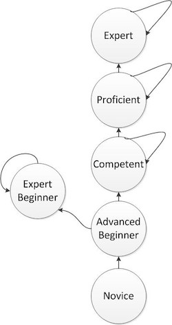

# 08/29

## NewRelic Custom Instrumentation
- NewRelic이 지원하는 프레임워크가 아닌 경우에는 [Custom Instrumentation](https://docs.newrelic.com/docs/agents/manage-apm-agents/agent-data/custom-instrumentation)이 필요함.
- 사용중인 프레임워크는 [Spring Zuul](https://github.com/Netflix/zuul) 이었으며, 이 때 [ZuulProperties](https://github.com/spring-cloud/spring-cloud-netflix/blob/master/spring-cloud-netflix-core/src/main/java/org/springframework/cloud/netflix/zuul/filters/ZuulProperties.java)가 코딩량 줄이기에 도움이 됨.
- 프레임워크 내부 코드 열어보는 것은 거의 매번 도움이 됨.

## AWS Elastic Beanstalk Leader Instance
- EB 인스턴스 leader 종종 실종. AutoScalingGroup에서 termination policy가 OldestInstance이기 때문임.
- 운영 환경의 특성상 NewestInstance로 바꾸면 해결됨.

# 08/30

## AWS Beanstalk Auto Scaling Trigger Setting
- Scaling Trigger 설정을 통해 불필요한 인스턴스 비용 절약
- 평소 관리하는 성능 테스트 지표가 도움이 됨
- `Measurement period`,  `Breach duration`, `Upper threshold`, `Lower threshold`의 의미와 관계 이해 및 값 변경
- 참고
  - [AWS Developer Forums: Autoscaling Configuration in Elastic ...](https://forums.aws.amazon.com/thread.jspa?threadID=61883)
  - [Configuring Auto Scaling with Elastic Beanstalk - AWS Elastic Beanstalk](http://docs.aws.amazon.com/elasticbeanstalk/latest/dg/using-features.managing.as.html)

## AWS RDS Configuration
- RDS의 높은 CPU Utilization의 원인을 추정함. 실험 후 결과 궁금.
- RDS 설정(`slow_query_log`, `long_query_time`, `log_output option`) 이해. 좀 더 나은 모니터링을 위해 설정 변경 예정. 궁금함.
- `SELECT * FROM mysql.slow_log ORDER BY start_time DESC LIMIT 300;`

## Java 8 Optional map Performance
- [forEach](https://docs.oracle.com/javase/8/docs/api/java/lang/Iterable.html)가 특정 경우에 performance 저하(상황에 따라 유의미하기도 함)를 가져왔던 것과 다르게, [Optional](https://docs.oracle.com/javase/8/docs/api/java/util/Optional.html)의 map은 유의미한 차이를 가져오지는 않음. 코드 배포함. 덕분에 간결하고 읽기 쉬움. (나만?)

# 09/02

## Trivial Java Tip
- selection을 통해 median을 찾는 알고리즘 작성하다가 실수한 것들.
- `int ary = new int[3];`을 하면 `ary`의 원소들은 0으로 채워짐.
- `new Random().nextInt()`은 음수가 반환될 수 있음.
- `new Random().nextInt(bound)`로 하면, 0~bound 사이의 값을 반환해 줌. 그래서인지 0 이하를 지정하는 경우 예외를 던지는 코드가 내부에 존재함.

# 09/04

## TDD & PP
- TC를 얼마나 작성해야 하느냐? 사례가 일반화 된 수 만큼. FizzBuzz의 경우는 8개 정도. 그런 면에서, TDD가 도움이 됨.
- FizzBuzz 구현을 TDD로 아주 세밀한 단계까지 나누어 수행. 이 정도까지 나눌 필요는 없지만, 이 정도까지 나눌 수 있다는 게 중요해 보임. 문제의 난이도에 따라 도움이 됨. Baby Step 이라고도 부름. 라이브 코딩 면접 시 안정감을 주기도 함.
- 요구사항이 추가되거나 수정되는 것은 별로 문제가 되지 않음. 이보다는 인터페이스가 바뀌는 경우가 어려움. 예컨대, 문자열이 아닌 다른 자료구조를 반환해야 한다면, TC에서 전체를 바꿔야 함. 한 가지 해결책은 헬퍼 메소드. 의존 라이브러리를 래퍼<sup>wrapper</sup> 객체를 두어 사용하는 느낌. 결국은 의존성을 한 곳으로 모는 것.
- TDD & PP를 하면서 코드를 **연구**한다는 느낌을 받음. 중요 부분에는 TDD & PP를 고려.

# 09/05

## Spring Boot Externalized Configuration
- [@ConfigurationProperties vs. @Value](https://docs.spring.io/spring-boot/docs/current/reference/html/boot-features-external-config.html#boot-features-external-config-vs-value) 문서에 따르면, `@Value`는 [Relaxed binding](https://docs.spring.io/spring-boot/docs/current/reference/html/boot-features-external-config.html#boot-features-external-config-relaxed-binding)을 지원하지 않는다고 나옴. 삽질한 적 있음. 주의.
- `@ConfigurationProperties` 사용시에는 주로 `@EnableConfigurationProperties` 함께 사용됨.

## AWS Beanstalk Deploy
- `Failed to deploy application.` 외에 별다른 메시지도 없이 deploy 실패함.
- `/var/log/` 파일들에 특별히 남겨지는 로그도 없음.
- 이전에는 Rebuild Environment를 했었음. 만약, Live 장비라면?
- Auto Scaling Group에서 특정 EC Instance를 제거함과 동시에 투입하는 방법을 사용.

## AWS Beanstalk Auto Scaling Group Termination Policy
- 기본으로 설정된 값은 `Default`임.
- 기존에는 `Default` == `OldestInstance`라고 오해했음.
- `Default`에 대한 동작 방식은 [Controlling Which Instances Auto Scaling Terminates During Scale In - Auto Scaling](http://docs.aws.amazon.com/autoscaling/latest/userguide/as-instance-termination.html) 문서에 잘 나와 있음.

## ETC
- [BFF](http://samnewman.io/patterns/architectural/bff/) 용도로 사용하고 있는 API Gateway의 Aggregate 필요성에 대해 다시 한번 고민하게 됨. 조심.
- 스프링 부트가 개발자를 바보로 만든다는 비판. 하지만 잘 사용한다면 좋은 측면이 더 많음. 오히려 실수도 줄여주고, 부가적 기능도 설정만으로 간단하게 추가하는 등. Back to the Basic이라는 말은 남용되면 안됨.


# 09/05

## Zuul Service
- [Zuul](https://github.com/Netflix/zuul) 인증 라우팅에 커넥션 타임아웃을 늘리자는 고민을 같이 하다보니,
- Zuul에 명시하는 의존 서비스는 논리적 단위.
- 반드시 물리적 서버(하나의 인스턴스 혹은 인스턴스 그룹)에 대응할 필요 없음.
- 같은 물리적 서버로의 라우팅이지만, 독립적인 정책을 가져가야 한다면, 서비스를 구분.

## ETC
- 단순화. Queue를 사용하지 않고, 동기적 호출에서 발생할 수 있는 문제를 극복하는 것을 봄. 이런 저런 생각을 하게 됨.

# 09/13

## Ribbon (Client Side Load Balancer)

- Discovery를 사용하지 않는다면, [@LoadBalanced](https://github.com/spring-cloud/spring-cloud-commons/blob/master/spring-cloud-commons/src/main/java/org/springframework/cloud/client/loadbalancer/LoadBalanced.java) 보다 [LoadBalancerClient](https://github.com/spring-cloud/spring-cloud-commons/blob/master/spring-cloud-commons/src/main/java/org/springframework/cloud/client/loadbalancer/LoadBalancerClient.java)를 더 선호. 더 명시적이고, 단순함의 수준은 비슷.
- [AbstractRibbonCommand](https://github.com/spring-cloud/spring-cloud-netflix/blob/master/spring-cloud-netflix-core/src/main/java/org/springframework/cloud/netflix/zuul/filters/route/support/AbstractRibbonCommand.java#L90)는 [HystrixCommand](https://github.com/Netflix/Hystrix/blob/master/hystrix-core/src/main/java/com/netflix/hystrix/HystrixCommand.java)의 [HystrixCommandGroupKey](https://netflix.github.io/Hystrix/javadoc/com/netflix/hystrix/HystrixCommandGroupKey.html) 값으로 "RibbonCommand"를 명시.
- 결국, Ribbon을 통한 Hystrix는 기본적으로 격리 X. 반대로, 스레드 풀 등을 공유해서 사용.
- 한편, Ribbon에서의 [HystrixCommandKey](https://netflix.github.io/Hystrix/javadoc/com/netflix/hystrix/HystrixCommandKey.html)는 의존 서비스 아이디를 값으로 함.
- 그룹과 커맨드의 단위가 이게 좋은가에 대해서는 의문.

## Java

- [Consumer](https://docs.oracle.com/javase/8/docs/api/java/util/function/Consumer.html), [Supplier](https://docs.oracle.com/javase/8/docs/api/java/util/function/Supplier.html), [Function](https://docs.oracle.com/javase/8/docs/api/java/util/function/Function.html)에 대해 다시 한 번 살펴봄.

## Non-Blocking, Asynchronous

- Blocking/NonBlocking: 호출/응답 사이에 다른 일을 할 수 있는지 여부
- Synchronous/Asynchronous: 호출/응답의 시작/종료 시간이 동일한지 여부
- 참고 자료
    - [Blocking-NonBlocking-Synchronous-Asynchronous](http://homoefficio.github.io/2017/02/19/Blocking-NonBlocking-Synchronous-Asynchronous/).
    - [Async & Spring](https://docs.com/toby-lee/6428)


# 09/14

## Git Merge Commit Revert

- `git revert`의 `-n(--no-commit)`: revert 시 자동 수행되는 commit을 하지 않음.
- `git revert`의 `-m(--mainline)`: merge commit revert 시 mainline을 지정함.
- Revert of Revert (참고: [Undoing Merges](https://git-scm.com/blog/2010/03/02/undoing-merges.html))

## Back to the Basic

- 문제 생겼을 때 빠르게 확인할 수 있는 TC 혹은 replay의 필요성에 대해 다시 한번 절실히 느낌.
- 얽히고 섥혀 있는 시스템을 보며, 기본적인 OCP도 지키지 못하는 시스템의 고달픔을 다시 한번 절실히 느낌.
- `getXXX`류의 함수를 열었는데, 내부에서 몰래 값을 할당하고 있는 시스템에 당혹감을 느끼며, SCP가 이렇게 중요하구나를 또다시 체감함.

# 09/15

## Hystrix Thread Timeout

- 다수의 Hystrix 비동기/병렬 호출 시, 별도의 스레드를 사용하는데, 분리된 스레드에서의 타임아웃은?
- Hystrix에 의해 감싸진 녀석이 `InteruptedException`을 해석하지 않으면 멈추지 않음.
- 출처: https://github.com/Netflix/Hystrix/wiki/How-it-Works#6-hystrixobservablecommandconstruct-or-hystrixcommandrun

> Please note that there's no way to force the latent thread to stop work - the  best Hystrix can do on the JVM is to throw it an InterruptedException. If the work wrapped by Hystrix does not respect InterruptedExceptions, the thread in the Hystrix thread pool will continue its work, though the client already received a TimeoutException. This behavior can saturate the Hystrix thread pool, though the load is 'correctly shed'. Most Java HTTP client libraries do not interpret InterruptedExceptions. So make sure to correctly configure connection and read/write timeouts on the HTTP clients.

## RestTemplate

- [RestTemplate](https://docs.spring.io/spring-framework/docs/current/javadoc-api/org/springframework/web/client/RestTemplate.html)의 기본 타임아웃은 무려 `0`(무한).
- `setErrorHandler`, `setInterceptor`  등의 인터페이스가 존재함.
- `HttpComponentsClientHttpRequestFactory`를 통해 Pooling, Timeout 등의 설정 가능
- 호스트 별로 여러개의 `RestTemplate` 인스턴스를 두어 사용할수도.


# 09/25

## Endpoint Version Design

- 서비스 엔드포인트의 versioning은 불변 서비스<sup>immutable service</sup>의 의미
- 서비스 내의 단위 기능 수준보다, 서비스 수준에서 버전을 적용하는 것이 언제나 더 간단하다는 이야기에 여러 가지 생각.

## Planning & Analisys

- 하루 종일 플래닝, 설계를 진행. 이것 저것 따져가며 리스크를 찾아내는데, 자꾸만 조금만 더, 조금만 더, 하는 욕구가 생겨남.
- 집에 오는 길에 읽고 있던 <호모데우스, 유발하라리> 내용 중 아래 문구가 눈에 들어옴.

> 당신이 추구하는 어떤 이상이 애초에 결함을 품고 있다면, 대게 그 이상의 실현 단계에 와서야 그러한 결함을 알게 된다.

## Run TID like a Machine

- 성장하기 위해, 단순히 어떤 일을 반복하기보다는 [의도적 수련<sup>deliberate practice</sup>](https://en.wikipedia.org/wiki/Practice_(learning_method)#Deliberate_practice)이 필요.
- (매일 같이 하지는 못하지만, 그리고 이제 막 시작했지만) TID는 스스로 얼마나 나아가는지를 돌아보는 피드백이 됨.
- 아래는 이와 관련하여 떠오른 [Management Priciples, Ray Dailo](http://www.businessinsider.com/ray-dalios-bridgewater-management-principles-2014-11)의 그림과 내용 일부.

> 1) understanding how well your people and designs are operating to achieve your goals, and 2) constantly improving them.


# 09/26

## API Endpoint Design

- API 설계에 있어서도 [Uniform Access Design](https://martinfowler.com/bliki/UniformAccessPrinciple.html)은  마찬가지 아닐까.

# 09/27

## Code Smell (Vulnerability)

- 아래 코드는 여러 가지 문제점을 가짐.
- 그 중의 한 가지는, 주로 값객체로 사용되는 mutable 객체를 그대로 반환한다는 것.

```
@Data
public class Hello {
  private Date date;
}
```

## Gradle FindBugs

- [Gradle의 FindBugsExtension 문서](https://docs.gradle.org/4.1/dsl/org.gradle.api.plugins.quality.FindBugsExtension.html)가 도움이 됨.

# 09/28

## try-with-resource

- 이미 예전부터 제공되던 기능
- [The try-with-resource Statement](https://docs.oracle.com/javase/tutorial/essential/exceptions/tryResourceClose.html)

```java
final FileOutputStream outputStream = new FileOutputStream(file);
try {
  workbook.write(outputStream);
} finally {
  outputStream.close();
}
```

```java
try (FileOutputStream outputStream = new FileOutputStream(file)) {
  workbook.write(outputStream);
}
```

- Java9에서는 더 나아진다(고 생각됨).

```
try {
  workbook.write(outputStream);
}
```

# 10/05

## Maven BOM

- Maven을 안 쓴지 꽤 되었지만, BOM(Bill Of Material)에 대해서 이제야 알게 됨.
- [Introduction to the Depedency Mechanism 문서](https://maven.apache.org/guides/introduction/introduction-to-dependency-mechanism.html)의 ["Importing Depdencies"]() 항목에 잘 설명됨.
- [spring-boot-starter-parent](https://repo.maven.apache.org/maven2/org/springframework/boot/spring-boot-starter-parent/1.2.5.RELEASE/spring-boot-starter-parent-1.2.5.RELEASE.pom)는 일종의 BOM.
- gradle에서는 `spring-boot` 플러그인으로 이런 역할을 수행. [여기](https://docs.spring.io/spring-boot/docs/current/reference/html/build-tool-plugins-gradle-plugin.html#build-tool-plugins-gradle-dependency-management)를 참고.


# 10/06

## Spring Context

- [@Lazy](https://docs.spring.io/spring/docs/current/javadoc-api/org/springframework/context/annotation/Lazy.html)라는 녀석이 존재함. 얼마나 유용할지는 모르겠음.

## Gradle Multi Module Project

- 오랜만에 다시 한 번 Multi Module 관련 문서를 읽음.
- [Gradle User Guide > Multi Project Build](https://docs.gradle.org/current/userguide/multi_project_builds.html)
- [Srping Getting Started > Multi Module](https://spring.io/guides/gs/multi-module/)


# 10/12

## Spring ObjectProvider

- Spring에서 제공되는 [ObjectProvider](https://docs.spring.io/spring-framework/docs/current/javadoc-api/org/springframework/beans/factory/ObjectProvider.html)라는 것이 있음.
- `getIfAvailable`이나 `getIfUnique` 등의 편의 기능들이 제공됨. 코딩량을 꽤나 줄이는데 도움이 됨.
- 아주 오래된 기능인 줄 알았으나, [Spring Framework 4.3이 되어서야 도입된 것이라고 함](https://spring.io/blog/2016/03/04/core-container-refinements-in-spring-framework-4-3).
- [Implicit constructor injection for single-constructor scenarios](https://spring.io/blog/2016/03/04/core-container-refinements-in-spring-framework-4-3#implicit-constructor-injection-for-single-constructor-scenarios)도 이때 생긴 것.

## Spring Database Popluation

- [ResourceDatabasePopulation](https://docs.spring.io/spring-framework/docs/current/javadoc-api/org/springframework/jdbc/datasource/init/ResourceDatabasePopulator.html)과 [DatabasePopulatorUtils](https://docs.spring.io/spring/docs/current/javadoc-api/org/springframework/jdbc/datasource/init/DatabasePopulatorUtils.html)를 이용하면, 좀 더 자유로운 DB 준비 작업(DDL, DML 등)이 가능함.
- Auto Configuration의 하나인 [DataSourceInitializer](https://docs.spring.io/spring/docs/current/javadoc-api/org/springframework/jdbc/datasource/init/DataSourceInitializer.html)는 좋은 예시가 됨.

## Meta-Annotation Support for Testing

- 중복된 테스팅 환경 설정 선언들을, 커스텀 애노테이션을 생성하여 재사용 할 수 있음.
- 반드시 인과관계가 있는 것도 아니고 부산물이긴 하지만, 테스트 컨텍스트 캐시에도 유리해 보임.
- 내용은 [여기](https://docs.spring.io/spring/docs/current/spring-framework-reference/testing.html#integration-testing-annotations-meta)를 참고.


# 10/15

## Complex Number

- 켤레 복소수, 복소수의 절대값, 복소평면(가우스 평면)의 개념.
- 복소수의 극형식(극좌표 표시) `z = r(cosθ + i·sinθ)`
- 편각 `θ = arg(z)`
- 복소수의 곱과 나눗셈. 극형식과 [삼각함수의 덧셈정리](https://ko.wikipedia.org/wiki/%EC%82%BC%EA%B0%81%ED%95%A8%EC%88%98%EC%9D%98_%EB%8D%A7%EC%85%88%EC%A0%95%EB%A6%AC)를 활용.
- 예컨대, i의 극형식은 `cos(\frac{\pi}{2}) + i \cdot sin(\frac{\pi}{2})`이므로,
- '복소수 z에 i를 곱한다'는 것은 90˚ 회전시킨다는 것과 같음.
- [드무아브르의 공식](https://ko.wikipedia.org/wiki/%EB%93%9C%EB%AC%B4%EC%95%84%EB%B8%8C%EB%A5%B4%EC%9D%98_%EA%B3%B5%EC%8B%9D)은 수학적 귀납법을 이용.
- 이 때, `cos2θ = cos^2θ - sin^2θ`와 `sin2θ = 2sinθcosθ`  성질을 이용함.

# 10/22

## Java Set Interface Bulk Operations

- [Set Interface](https://docs.oracle.com/javase/7/docs/api/java/util/Set.html)를 살펴보니, 교집합, 부분집합, 합집합, 여집합에 대한 처리가 잘 되어 있음.
- [Oracle Tutorior](https://docs.oracle.com/javase/tutorial/collections/interfaces/set.html)에서도 이들이 집합 대수<sup>set-algebraic</sup> 연산을 잘 수행한다고 명시되어 있음.
- 처음에 사용하려 했던 비트 연산보다, 여러모로 좋은 선택으로 보임.

| Set-algebraic Operation | Set Interface                            |
| ----------------------- | ---------------------------------------- |
| subset                  | [containsAll](https://docs.oracle.com/javase/8/docs/api/java/util/Set.html#containsAll-java.util.Collection-) |
| union                   | [addAll](https://docs.oracle.com/javase/8/docs/api/java/util/Set.html#addAll-java.util.Collection-) |
| intersection            | [retainAll](https://docs.oracle.com/javase/8/docs/api/java/util/Set.html#retainAll-java.util.Collection-) |
| complement              | [removeAll](https://docs.oracle.com/javase/8/docs/api/java/util/Set.html#removeAll-java.util.Collection-) |
| cartesian product       | 없는 것 같다.                                 |

## Java HTTP Connection Close

- HTTP 응답을 처리하는 데 있어, `close`가 명시적으로 필요할 수 있음.
- 예컨대, [Ribbon RestClient의 618라인](https://github.com/Netflix/ribbon/blob/master/ribbon-httpclient/src/main/java/com/netflix/niws/client/http/RestClient.java#L618)에서는,
- 결국 아래의 [Jersey WebResource](http://javadox.com/com.sun.jersey/jersey-bundle/1.18/com/sun/jersey/api/client/WebResource.html) 코드를 호출하게 되는데,
- 이 때 class type이 `ClientResponse`이므로 `close`되지 않고 그대로 반환됨.

```java
private <T> T handle(Class<T> c, ClientRequest ro) throws UniformInterfaceException, ClientHandlerException {
    setProperties(ro);
    ClientResponse r = getHeadHandler().handle(ro);
    if (c == ClientResponse.class) return c.cast(r);
    if (r.getStatus() < 300) return r.getEntity(c);
    throw new UniformInterfaceException(r,
            ro.getPropertyAsFeature(ClientConfig.PROPERTY_BUFFER_RESPONSE_ENTITY_ON_EXCEPTION, true));
}
```

- 참고로, 위 코드에서 `r.getEntity(c)` 내부에서는 알아서 `close`가 호출됨.
- Jersey의 `ClientResponse` 코드를 보다보면, `Closeable` 녀석들은 close가 필요하다고 함.
- 다른 문서나 코드에서도 비슷한 내용들을 찾을 수 있음.

> ```
> If the entity is not an instance of Closeable then this response
> * is closed (you cannot read it more than once, any subsequent
> * call will produce {@link ClientHandlerException}).
> ```

# 10/31

TID인데, 1주일 간격으로 작성 중. 반성.

## Collecting Parameter

-  함수 파라미터로 객체를 넘겨주고, 함수는 이 객체에게 질의도 하고 값 설정도 하게 만듦.
-  효율성을 이유로 이렇게 만들었으나, 아무래도 다른 사람이 보기에 좀 더 쉽게 작성할 수는 없을지 고민하게 됨.
-  마침 "[Move accumulation to Collecting Parameter](https://www.industriallogic.com/xp/refactoring/accumulationToCollection.html)"가 생각남.
-  [리팩토링](http://www.yes24.co.kr/24/goods/267290) 책에 나왔던 것 같음. 출처는 확인 필요.
-  옆 동료와 한참을 이야기 함. 그리고 파라미터로 넘어온 객체의 상태를 바꾸는 것을 허용하기로 함.
-  참고로 [여기](http://wiki.c2.com/?CollectingParameter)서는 이것이 일반적으로는 안티 패턴이라고 소개함.

>  A variation on this pattern occurs when the [CollectingParameter](http://wiki.c2.com/?CollectingParameter) is not a collection, but is an object with various properties. As the object is passed around, various actors get and set properties on the [ParameterObject](http://wiki.c2.com/?ParameterObject). I think this version of the pattern is generally an [AntiPattern](http://wiki.c2.com/?AntiPattern), but may be useful when refactoring from the use of globals.

## The Expert Beginner

-  [How Developers Stop Learning: Rise of the Expert Beginner](https://www.daedtech.com/how-developers-stop-learning-rise-of-the-expert-beginner/)에 대한 [번역글](https://medium.com/@jwyeom63/%EB%8D%94-%EC%9D%B4%EC%83%81-%EB%B0%B0%EC%9A%B0%EB%A0%A4-%ED%95%98%EC%A7%80-%EC%95%8A%EB%8A%94-%EA%B0%9C%EB%B0%9C%EC%9E%90-expert-beginner%EC%9D%98-%EB%93%B1%EC%9E%A5-dd40)을 보게 됨.
-  아래 그림이 인상 깊어서 기록함.



# 11/01

## Java Access Modifier

| Modifier    | Class | Package | Subclass | World |
| ----------- | ----- | ------- | -------- | ----- |
| public      | Y     | Y       | Y        | Y     |
| protected   | Y     | Y       | Y        | N     |
| no modifier | Y     | Y       | N        | N     |
| private     | Y     | N       | N        | N     |

-  출처는 오라클의 [Controlling Access to Members of a Class](https://docs.oracle.com/javase/tutorial/java/javaOO/accesscontrol.html) 문서.
-  default 접근자를 진짜 많이 사용하는데, 참 모르고 (혹은 까먹고) 쓰고 있었구나를 느낌.
-  `protecetd`가 `no modifier`보다 더 개방적.

## Java NavigableMap

-  https://docs.oracle.com/javase/7/docs/api/java/util/NavigableMap.html
-  [SortedMap](https://docs.oracle.com/javase/7/docs/api/java/util/SortedMap.html)의 확장 인터페이스이며, [navigableKeySet](https://docs.oracle.com/javase/7/docs/api/java/util/NavigableMap.html#navigableKeySet()) 등의 편의 API들을 상당수 제공함.

## API Endpoint Versioning

-  1개의 서비스에서 20개의 API 엔드포인트를 제공한다고 가정.
-  이 엔드포인트들은 여러 서비스에서 사용됨.
-  그런데, 특정 엔드포인트가 변경되야 한다고 하자.
-  이 엔드포인트의 버전만 올려야 할까, 아니면 전체 엔드포인트의 버전을 함께 올려야 할까?
-  혹은, 얼마만큼의 변경이 있을때 버전을 올리는가?
-  그러니까, 버전이 뭔가? 왜 하는가?
-  많은 접근법들이 있구나 알게 됨.

## API GW, Shared Client Library

-  [Mastering Chaos, A Netflix Guide to Microservices](https://www.youtube.com/watch?v=OczG5FQIcXw&feature=youtu.be)
-  위 영상의 20분 즈음에는 GW가 또 다른 레거시가 되는 이야기가 나옴.
-  물론, GW 자체의 문제라기보다 공유 라이브러리에 의한 것. 재미있음.
-  여러 서비스 간의 공유 라이브러리에 대한 실제 문제 사례가 이런저런 생각을 하게 만듦.

# 11/03

## Depedencies - Ordering, Filtering

사용자가 상품들을 장바구니에 담았음. 그리고 이제 배송일자를 골라야 함. 이 때, 각종 정책에 의해 불가능한 날짜를 제거하고, 가능한 날짜들만 사용자에게 알려줘야 함.

그래서 만든 것들 중 주요한 것은 아래 2개

- `DeliveryDateChecker` : 불가능한 날짜 제거하는 인터페이스. 그리고 이들의 구현체가 10개 정도 존재.
- `DeliveryCalendarService` : 배송 가능한 날짜들로 캘린더 만들어 주는 녀석. 구현은 아래와 같음.

```java
@Serivce
class DeliveryCalendarService {

  private final List<DeliveryDateChecker> checkers;

  DevlieryCalendarService(List<DeliveryDateChecker> checkers) {
    this.checkers = checkers;
  }
  
  DeliveryCalendar get(Set<Product> products, LocalDate startDate) {
    return checkers
      .stream()
      .map(c -> c.check(products, startDate))
      .reduce(toCalendar());
  }
}
```

그런데, `OrderConfirmationService` 라는 녀석을 만들어야 함. 사용자가 선택한 날짜들로, 다시 한 번 배송 가능한 지 확인하는 녀석. 그런데, `DeliveryCalendarService`와 "**의존성**" 관련 요구사항이 조금 다름.

1. 모든 `DeliveryAvailabilityChecker` 구현체가 아닌, 2개의 구현체만 필요함.
2. `DeliveryAvailabilityChecker`를 호출하는 순서가 달라야 함.

조금 더 풀어서 설명하면, 다음과 같다.

> `DeliveryCalendarService`에서는 `DeliveryAvailabilityChecker`의 구현체인 A, B, C, D를 차례로 호출한 반면, `OrderConfirmationService`에서는 D, C를 차례로 호출해야 함.

여러 방법들이 있음. 그러나, 어떻게 하는 게 가장 좋을까?