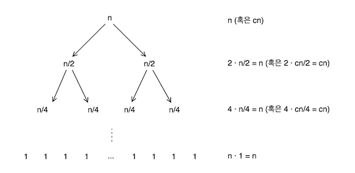

# 11/01

## Java Access Modifier

| Modifier    | Class | Package | Subclass | World |
| ----------- | ----- | ------- | -------- | ----- |
| public      | Y     | Y       | Y        | Y     |
| protected   | Y     | Y       | Y        | N     |
| no modifier | Y     | Y       | N        | N     |
| private     | Y     | N       | N        | N     |

- 출처는 오라클의 [Controlling Access to Members of a Class](https://docs.oracle.com/javase/tutorial/java/javaOO/accesscontrol.html) 문서.
- default 접근자를 진짜 많이 사용하는데, 참 모르고 (혹은 까먹고) 쓰고 있었구나를 느낌.
- `protecetd`가 `no modifier`보다 더 개방적.

## Java NavigableMap

- https://docs.oracle.com/javase/7/docs/api/java/util/NavigableMap.html
- [SortedMap](https://docs.oracle.com/javase/7/docs/api/java/util/SortedMap.html)의 확장 인터페이스이며, [navigableKeySet](https://docs.oracle.com/javase/7/docs/api/java/util/NavigableMap.html#navigableKeySet()) 등의 편의 API들을 상당수 제공함.

## API Endpoint Versioning

- 1개의 서비스에서 20개의 API 엔드포인트를 제공한다고 가정.
- 이 엔드포인트들은 여러 서비스에서 사용됨.
- 그런데, 특정 엔드포인트가 변경되야 한다고 하자.
- 이 엔드포인트의 버전만 올려야 할까, 아니면 전체 엔드포인트의 버전을 함께 올려야 할까?
- 혹은, 얼마만큼의 변경이 있을때 버전을 올리는가?
- 그러니까, 버전이 뭔가? 왜 하는가?
- 많은 접근법들이 있구나 알게 됨.

## API GW, Shared Client Library

- [Mastering Chaos, A Netflix Guide to Microservices](https://www.youtube.com/watch?v=OczG5FQIcXw&feature=youtu.be)
- 위 영상의 20분 즈음에는 GW가 또 다른 레거시가 되는 이야기가 나옴.
- 물론, GW 자체의 문제라기보다 공유 라이브러리에 의한 것. 재미있음.
- 여러 서비스 간의 공유 라이브러리에 대한 실제 문제 사례가 이런저런 생각을 하게 만듦.

# 11/02

## Divide-and-Conquer

- 짧지 않은 시간 동안 레거시를 몇 개의 서비스로 나누어 감. 주요했던 교훈은, 배포의 단위를 얼마나 잘게 쪼갤 수 있느냐.
- 다시 말하면, 얼마나 리스크를 분산시킬 수 있느냐. 잘못된 상태로 너무 많이 나아가지 않을 수 있는가(혹은 다시 돌아올 수 있는가).
- 일종의 분할 정복<sup>Divide-and-Conquer</sup>? 돌다리?
- 마차의 바퀴를 몽땅 갈아치우고 싶은 욕심에, 달리는 마차를 멈출 수는 없는 노릇.
- 그런 의미에서 [Strangler Application Pattern](https://www.martinfowler.com/bliki/StranglerApplication.html)은 단순하지만 강력한 접근법. ([Big-Bang](https://en.wikipedia.org/wiki/Big_bang_adoption)은 노노)
- [Feature Toggle](https://martinfowler.com/articles/feature-toggles.html)이나, 데이터 이중화 등이 도움이 됨.
- 하지만 차후 사용되지 Feature들의 정리는 또다른 부담. 역시나 좋은 습관의 중요성.

> "Leave the campground cleaner than you found it." - Clean Code

## Value

- 이런 저런 이유로 떠올랐던 오늘의 문장. 출처는 [이 곳](http://pragmaticstory.com/attachment/cfile25.uf@1654D0124BCFBE0C2F6182.pdf).

> "수술은 성공했습니다. 하지만 환자는 죽었습니다. 무엇이 성공한 것입니까"

# 11/03

## Depedencies - Ordering, Filtering

사용자가 상품들을 장바구니에 담았음. 그리고 이제 배송일자를 골라야 함. 이 때, 각종 정책에 의해 불가능한 날짜를 제거하고, 가능한 날짜들만 사용자에게 알려줘야 함.

그래서 만든 것들 중 주요한 것은 아래 2개

- `DeliveryDateChecker` : 불가능한 날짜 제거하는 인터페이스. 그리고 이들의 구현체가 10개 정도 존재.
- `DeliveryCalendarService` : 배송 가능한 날짜들로 캘린더 만들어 주는 녀석. 구현은 아래와 같음.

```java
@Serivce
class DeliveryCalendarService {

  private final List<DeliveryDateChecker> checkers;

  DevlieryCalendarService(List<DeliveryDateChecker> checkers) {
    this.checkers = checkers;
  }
  
  DeliveryCalendar get(Set<Product> products, LocalDate startDate) {
    return checkers
      .stream()
      .map(c -> c.check(products, startDate))
      .reduce(toCalendar());
  }
}
```

그런데, `OrderConfirmationService` 라는 녀석을 만들어야 함. 사용자가 선택한 날짜들로, 다시 한 번 배송 가능한 지 확인하는 녀석. 그런데, `DeliveryCalendarService`와 "**의존성**" 관련 요구사항이 조금 다름.

1. 모든 `DeliveryAvailabilityChecker` 구현체가 아닌, 2개의 구현체만 필요함.
2. `DeliveryAvailabilityChecker`를 호출하는 순서가 달라야 함.

조금 더 풀어서 설명하면, 다음과 같다.

> `DeliveryCalendarService`에서는 `DeliveryAvailabilityChecker`의 구현체인 A, B, C, D를 차례로 호출한 반면, `OrderConfirmationService`에서는 D, C를 차례로 호출해야 함.

여러 방법들이 있음. 그러나, 어떻게 하는 게 가장 좋을까?

# 11/07

- [I interviewed at five top companies in Silicon Valley in five days, and luckily got five job offers](http://www.looah.com/article/view/2070)
- 위 글에서 아래 두 문장이 마음 깊은 곳을 찌름.
- 꿈보다 해몽인가. 참으로 평범한 문장들임에도 불구하고 말이다.

> Understand the requirements first, then lay out the high-level design, and finally drill down to the implementation details. Don’t jump to the details right away without figuring out what the requirements are.

> There are no perfect system designs. Make the right trade-off for what is needed.

# 11/08

- [통계적 유의성](https://ko.wikipedia.org/wiki/%ED%86%B5%EA%B3%84%EC%A0%81_%EC%9C%A0%EC%9D%98%EC%84%B1)의 표준은 관행상 p값([유의 수준](https://ko.wikipedia.org/wiki/%EC%9C%A0%EC%9D%98_%EC%88%98%EC%A4%80))을 0.05로 잡는다고 함.
- [틀리지 않는 법 (수학적 사고의 힘)](http://www.aladin.co.kr/shop/wproduct.aspx?ItemId=74921141)에서는 이를 비판하는 내용이 상당히 많이 나옴.
- 아래는 책에서 인용된 [xkcd](https://xkcd.com/882/)의 한 그림.


# 11/11

## Merge Sort

- 오랜만에 작성해 본 [병합정렬](https://en.wikipedia.org/wiki/Merge_sort).
- 생각보다 오래 걸렸고, 시간 복잡도도 높게 나옴.
- 약간의 공간복잡도를 포기하면 될 것을, 무의식적으로 모 아니면 도라고 생각한 듯.
- 잘못된 구현은 [여기](https://github.com/codehumane/learn-algorithm-in-java/commit/5db9aacaf333996c1379a0673ba23c815f689065)에 기록함.
- 약간의 공간 복잡도 포기한, 하지만 시간 복잡도는 O(n · ln(n)) 혹은 Θ(n · ln(n))을 달성한 구현. 여기에 병렬 처리까지 추가한 코드는 [이 곳](https://github.com/codehumane/learn-algorithm-in-java/commit/b498cac6b324a25d6707bb94035a541ddb5682f6)을 참고.

## Merge Sort Time Complexity

- 병합정렬의 내부는 분할, 정복, 병합으로 이루어짐.
- 여기서 분할, 병합의 실행 시간은 n + 1이며, cn으로 표기 가능함(c는 상수).
- 그리고 아래와 같이 트리 그림으로 표현하면, 모든 트리의 깊이에서 n의 실행시간을 가진다는 것을 알 수 있음.
- 자꾸 잊어버려서, [블로그에 기록](http://codehumane.github.io/2017/11/11/%EB%B3%91%ED%95%A9%EC%A0%95%EB%A0%AC-%EC%8B%9C%EA%B0%84%EB%B3%B5%EC%9E%A1%EB%8F%84-%EA%B5%AC%ED%95%98%EA%B8%B0/)함.



# 11/12

## Median Find

- 오늘은 [중위수 찾기 알고리즘을 구현함](https://github.com/codehumane/learn-algorithm-in-java/commit/fba07a0bedac08998ee62d77885ce7ddfdd249f8).
- 쉽게 생각하면, 병합 정렬로 숫자를 정렬한 뒤, 가운데 값을 추출하면 됨.
- 이 때의 시간 복잡도는 당연히 O(n · ln(n))가 됨.
- 하지만, 선택<sup>selection</sup>을 사용하면 좀 더 쉽고 빠르다.
- [여기](https://brilliant.org/wiki/median-finding-algorithm/)에 설명이 잘 나와 있다고 생각함.
- 수행 시간에 대한 기댓값은 T(n) ≤ T(3n/4) + O(n).
- 따라서, 평균적으로 O(n)의 수행시간을 가짐.

# 11/13

## Spring Cloud Stream & AWS

- 스프링에서 [SQS](https://aws.amazon.com/ko/sqs/), [SNS](https://aws.amazon.com/ko/sns/)를 사용할 일이 있어 [Spring Cloud Stream](https://cloud.spring.io/spring-cloud-stream/)을 떠올렸으나,
- [Binder Implementation](https://github.com/spring-cloud/spring-cloud-stream#binder-implementations)을 살펴보니 아직까지는 [Kafaka](https://github.com/spring-cloud/spring-cloud-stream-binder-kafka)와 [RabbitMQ](https://github.com/spring-cloud/spring-cloud-stream-binder-rabbit)만을 지원함.
- 대신, [Spring Cloud AWS](https://cloud.spring.io/spring-cloud-aws/)가 존재함.
- SQS, ElastiCache, SNS, CloudFormation, RDS, S3를 위한 편의 기능들을 제공.
- 레퍼런스는 [여기](http://cloud.spring.io/spring-cloud-static/spring-cloud-aws/1.2.1.RELEASE/)를 참고.

## When the Optimizer Considers a Full Table Scan

- index가 걸려 있는 컬럼이라고 하더라도, SELECT 범위가 크다면 Sequential(Full) Scan이 발생할 수 있음.
- [Full table scan](https://en.wikipedia.org/wiki/Full_table_scan), [Why does PostgreSQL perform sequential scan on indexed column?](https://stackoverflow.com/questions/5203755/why-does-postgresql-perform-sequential-scan-on-indexed-column) 문서 참고.

# 11/14

## Spring Cloud AWS Messaging

> ... enables developers to receive and send messages with the [Simple Queueing Service](https://aws.amazon.com/sqs/) for point-to-point communication. Publish-subscribe messaging is supported with the integration of the [Simple Notification Service](https://aws.amazon.com/sns/).

\- [Spring Cloud AWS Reference](http://cloud.spring.io/spring-cloud-static/spring-cloud-aws/1.2.1.RELEASE/)

## AWS SQS, SNS

- [SQS](https://aws.amazon.com/ko/sqs/)는 대기열 서비스. 메시지 전달 안정성(fault tolerant). 2가지 대기열 (표준, FIFO)
- [SNS](https://aws.amazon.com/sns/?nc1=h_ls)는 [토픽](http://docs.aws.amazon.com/sns/latest/dg/CreateTopic.html) 사용. 발신자 수신자 간의 결합도 낮춤. [Fanout](https://en.wikipedia.org/wiki/Fan-out_(software)). 폴링 처리 제거. ([Pub/Sub Messaging Basics](https://aws.amazon.com/pub-sub-messaging/))
- [Common Amazon SNS Scenarios](http://docs.aws.amazon.com/sns/latest/dg/SNS_Scenarios.html)에 보면 Fanout을 개발 환경에서 프로덕션 환경의 데이터를 받는 용도로도 사용함.
- [What is the difference between Amazon SNS and Amazon SQS?](https://stackoverflow.com/questions/13681213/what-is-the-difference-between-amazon-sns-and-amazon-sqs)

| SQS                              | SNS                                   |
| -------------------------------- | ------------------------------------- |
| queueing system                  | pub/sub system (topic)                |
| polling (+ process, delete)      | push                                  |
| some latency                     | send time-critical (immediate)        |
| point-to-point (one receiver)    | fanout (multiple reciever)            |
| concurrency decoupling (persist) | publisher decoupling from subscribers |

- [SQS Queues and SNS Notification - Now Best Friends](https://aws.amazon.com/blogs/aws/queues-and-notifications-now-best-friends/) 문서에서는 이 둘을 "glue" 컴포넌트라고 표현.

## Deployment

- Snowflake vs. [Phoenix Server](https://www.thoughtworks.com/insights/blog/moving-to-phoenix-server-pattern-introduction), [Immutable Server](https://martinfowler.com/bliki/ImmutableServer.html)
- [Blue/Green Deployment](https://martinfowler.com/bliki/BlueGreenDeployment.html), [Canary Release](https://martinfowler.com/bliki/CanaryRelease.html), [A/B Testing](https://en.wikipedia.org/wiki/A/B_testing)

## AWS SDK Credentials Configuration

- [Simple credentials configuration](http://cloud.spring.io/spring-cloud-static/spring-cloud-aws/1.2.1.RELEASE/#_simple_credentials_configuration)
- [Instance profile configuration](http://cloud.spring.io/spring-cloud-static/spring-cloud-aws/1.2.1.RELEASE/#_instance_profile_configuration) with [Using Instance Profile](https://docs.aws.amazon.com/IAM/latest/UserGuide/id_roles_use_switch-role-ec2_instance-profiles.html)
- [결합된 방식](http://cloud.spring.io/spring-cloud-static/spring-cloud-aws/1.2.1.RELEASE/#_mixing_both_security_configurations)을 권장하기도.

# 11/15

## AWS Instance Metadata

- [EC2 Instance Metadata](https://docs.aws.amazon.com/AWSEC2/latest/UserGuide/ec2-instance-metadata.html)
- [Instance Metadata Categories](https://docs.aws.amazon.com/AWSEC2/latest/UserGuide/ec2-instance-metadata.html#instancedata-data-categories)

### Spring Cloud AWS Region Configuration

- [Automatic Region Configuration](http://cloud.spring.io/spring-cloud-static/spring-cloud-aws/1.2.1.RELEASE/#_automatic_region_configuration)
- EC2 instance에서는 Automatic Configuration을 **사용할 수 있다**가 아니라, **사용해야 한다**구나.

> "If the application context is started inside an EC2 instance, then the region can automatically be fetched from the [instance metadata](https://docs.aws.amazon.com/AWSEC2/latest/UserGuide/ec2-instance-metadata.html) and therefore must not be configured statically."

## Spring Cloud Instance Metadata Retrieve

- [Retrieving Instance Metadata](http://cloud.spring.io/spring-cloud-static/spring-cloud-aws/1.2.1.RELEASE/#_retrieving_instance_metadata)
- property placeholder 등을 통한 인스턴스 메타데이터 접근 가능. HTTP Service 호출 X
- EC2에서 동작하는 부트의 경우에는 자동으로 사용 가능함.
- [Tags](http://cloud.spring.io/spring-cloud-static/spring-cloud-aws/1.2.1.RELEASE/#_using_instance_tags), [User Data](http://cloud.spring.io/spring-cloud-static/spring-cloud-aws/1.2.1.RELEASE/#_using_instance_user_data)에도 접근 가능.

## Spring Cloud Messaging

- SQS의 몇 가지 제약사항. [SQS Support](http://cloud.spring.io/spring-cloud-static/spring-cloud-aws/1.2.1.RELEASE/#_sqs_support) 참고.
  - String payload only.
  - No transaction support. 메시지는 두 번 폴링 될 수 있음.
  - 256kb 크기 제한.
- SQS에 대한 [Message Reply](http://cloud.spring.io/spring-cloud-static/spring-cloud-aws/1.2.1.RELEASE/#_message_reply) 기능도 제공.

```java
@SqsListener("treeQueue")
@SendTo("leafsQueue")
public List<Leaf> extractLeafs(Tree tree) {
	// ...
}
```

# 11/16

- [새빨간 거짓말, 통계 (책)](https://github.com/codehumane/what-i-learned/blob/master/how-to-lie-with-statistics/README.md)
- [언제나 의심스러운 여론조사](https://github.com/codehumane/what-i-learned/tree/master/how-to-lie-with-statistics#언제나-의심스러운-여론조사)
- [평균은 하나가 아니다](https://github.com/codehumane/what-i-learned/tree/master/how-to-lie-with-statistics#평균은-하나가-아니다)
- [통계도 논리이다](https://github.com/codehumane/what-i-learned/tree/master/how-to-lie-with-statistics#숫자로-장난치기)
- [백분율 더하기](https://github.com/codehumane/what-i-learned/tree/master/how-to-lie-with-statistics#백분율-더하기)
- [백분율, 백분율점, 백분위수](https://github.com/codehumane/what-i-learned/tree/master/how-to-lie-with-statistics#백분율-백분율점-백분위수)

# 11/20

## Workflow Subscriptions & Event Broker Terminology

[여기](https://docs.vmware.com/en/vRealize-Automation/7.0/com.vmware.vra.extensibility.doc/GUID-594E5327-E3B4-467A-AFB8-839450798161.html)서 설명하는 토픽과 이벤트의 관계, 그리고 메시지/페이로드/이벤트의 구분이 기억에 남음.

| 용어          | 설명                                       |
| ----------- | ---------------------------------------- |
| Event Topic | 이벤트 집합. 모든 이벤트는 이벤트 토픽의 한 인스턴스.          |
| Event       | 상태의 변화. 이벤트 발생에 대한 정보를 기록하고 있는 엔티티.      |
| Payload     | 이벤트 데이터.                                 |
| Message     | 관련자들끼리 주고받는, 이벤트에 대한 운송 정보.              |
| 그 외         | Event Broker Service, Subscription, Subscriber, Provider, Producer |

## AWS SNS Protocol - Application

- [SNS Topic Subscription](http://docs.aws.amazon.com/ko_kr/sns/latest/dg/SubscribeTopic.html)의 가능한 프로토콜 중에 `Application`이라는 것이 있음.
- 이게 뭔가 했는데, [여기](https://stackoverflow.com/questions/33488224/what-is-application-protocol-of-sns-subscription)를 보니, 모바일 앱과 디바이스를 위한 것.

> delivery of JSON-encoded message to an EndpointArn for a mobile app and device.

## AWS SNS Retry Policy

- http://docs.aws.amazon.com/ko_kr/sns/latest/dg/DeliveryPolicies.html
- 다른 프로토콜과 다르게, HTTP와 HTTPS는 전송 정책을 제공함.
- 먼저, 전송 실패에 대한 기본적인 정의가 있음.
- 재시도는 최대 100회, 최대 1시간 이내에만 허용됨.
- 단계는 총 4가지
  - Retries with no delay, Pre-Backoff Phase, Backoff Phase, Post-Backoff Phase
- 최대 수신 속도 또한 지정 가능함.

## Spring Composite Injection

- Bean 주입에 Composite을 적용.
- [Spring: Injecting Lists, Maps, Optionals and getBeansOfType() Pitfalls](https://dzone.com/articles/spring-injecting-lists-maps) 참고함.

```java
@Component
@Primary
public class CompositeRunner implements Runnable {
  
  private final List<Runnable> runnables;  
  CompositeRunner(List<Runnable> runnables) {
    this.runnables = runnables;
  }
 
  @Override
  public void run() {
    return runnables
      .forEach(Runnable::run);
    }
}
```

## Articles

- [내 멋대로 구현한 이벤트 드리븐](http://www.popit.kr/%EB%82%B4-%EB%A9%8B%EB%8C%80%EB%A1%9C-%EA%B5%AC%ED%98%84%ED%95%9C-%EC%9D%B4%EB%B2%A4%ED%8A%B8-%EB%93%9C%EB%A6%AC%EB%B8%90/)
- [[MySQL] 인덱스 정리 및 팁](http://jojoldu.tistory.com/243)

# 11/23

## Book

- Spring Microservices
  - [Autoscaling Microservices](https://github.com/codehumane/what-i-learned/tree/master/spring-ms#autoscaling-microservices)
  - [Spring Microservices with Spring Cloud](https://github.com/codehumane/what-i-learned/tree/master/spring-ms#scaling-microservices-with-spring-cloud-1)
  - [Understanding the concept of autoscaling](https://github.com/codehumane/what-i-learned/tree/master/spring-ms#understanding-the-concept-of-autoscaling)
  - [Autoscaling Approaches](https://github.com/codehumane/what-i-learned/tree/master/spring-ms#autoscaling-approaches)
- 도메인 주도 설계 구현
  - [11장. 팩토리](https://github.com/codehumane/what-i-learned/tree/master/dddi#11장-팩토리)

# 11/25

## Book

- 도메인 주도 설계 구현
  - [도메인 이벤트](https://github.com/codehumane/what-i-learned/blob/master/dddi/README.md#8장-도메인-이벤트)
  - [언제 그리고 왜 도메인 이벤트를 사용할까](https://github.com/codehumane/what-i-learned/blob/master/dddi/README.md#언제-그리고-왜-도메인-이벤트를-사용할까)
  - [이벤트 모델링](https://github.com/codehumane/what-i-learned/blob/master/dddi/README.md#이벤트-모델링)
  - [도메인 모델에서 이벤트를 발행하기](https://github.com/codehumane/what-i-learned/blob/master/dddi/README.md#도메인-모델에서-이벤트를-발행하기)
  - [원격 바운디드 컨텍스트로 이벤트 전파하기](https://github.com/codehumane/what-i-learned/blob/master/dddi/README.md#뉴스를-원격-바운디드-컨텍스트로-전파하기)
  - [이벤트 저장소](https://github.com/codehumane/what-i-learned/blob/master/dddi/README.md#이벤트-저장소)

# 11/28

## AWS SNS, SQS

- AWS JDK로 큐 메시지 수신하는 방법에 대해서는 [여기](http://docs.aws.amazon.com/sdk-for-java/v1/developer-guide/examples-sqs-messages.html) 참고.
- Spring의 [@SqsListener](https://github.com/spring-cloud/spring-cloud-aws/blob/master/spring-cloud-aws-messaging/src/main/java/org/springframework/cloud/aws/messaging/listener/annotation/SqsListener.java)로 수신하는 방법에 대해서는 [여기](http://cloud.spring.io/spring-cloud-static/spring-cloud-aws/1.1.0.RELEASE/#_annotation_driven_listener_endpoints) 참고.
- 이 녀석의 동작 방식을 이해하는 데는 [SimpleMessageListenerContainer](https://github.com/spring-cloud/spring-cloud-aws/blob/master/spring-cloud-aws-messaging/src/main/java/org/springframework/cloud/aws/messaging/listener/SimpleMessageListenerContainer.java), [SimpleMessageListenerContainerFactory](https://github.com/spring-cloud/spring-cloud-aws/blob/master/spring-cloud-aws-messaging/src/main/java/org/springframework/cloud/aws/messaging/config/SimpleMessageListenerContainerFactory.java) 코드와 [Spring Cloud AWS 문서](http://cloud.spring.io/spring-cloud-static/spring-cloud-aws/1.1.0.RELEASE/#_annotation_driven_listener_endpoints)가 도움이 됨. 한 예로, 아래의 문장.

> By default the `SimpleMessageListenerContainer` creates a `ThreadPoolTaskExecutor` with computed values for the core and max pool sizes. The core pool size is set to twice the number of queues and the max pool size is obtained by multiplying the number of queues by the value of the `maxNumberOfMessages` field. If these default values do not meet the need of the application, a custom task executor can be set with the `task-executor` attribute (see example below).

- SNS에서 SQS로 전송 시, 메시지 유실 가능성은 존재하는 것으로 보임. [여기](https://stackoverflow.com/questions/30750033/amazon-sns-delivery-retry-policies-for-sqs) 참고.
- [SNS Monitor](http://docs.aws.amazon.com/ko_kr/sns/latest/dg/MonitorSNSwithCloudWatch.html) 등을 통한 유실 모니터링 필요.

# 11/30

## AWS SNS, SQS Message Loss

SNS, SQS로 메시징 인프라 구축 시, 메시지가 유실될 수 있는 구간은 총 3개.

1. Application to SNS
2. SNS to SQS
3. SQS to Application

가장 쉽게 떠올랐고 일단 실행하고 있는 유실 대응 방안은 다음과 같음.

1. 일단, 1번 구간은 애플리케이션이 보장.
   - SNS 호출 실패 시 트랜잭션 전체를 롤백하거나,
   - retry를 위해 Queue를 이용해서 잠시 후 다시 시도 등
2. SNS로 전달된 모든 메시지는 영속화.
3. 2번 구간과 3번 구간은 메시지 유실을 모니터링.
4. 메시지 유실 시, 영속된 메시지를 다시 SNS로 전달(replay).
5. 단, 모든 수신 애플리케이션은 멱등성을 보장.

# 