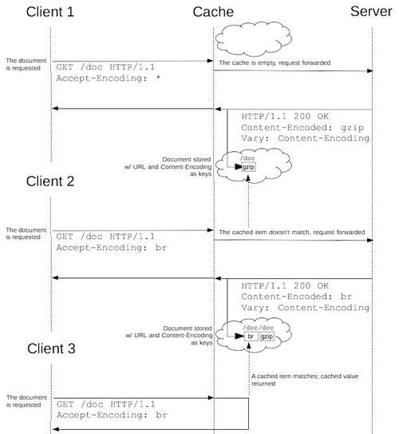
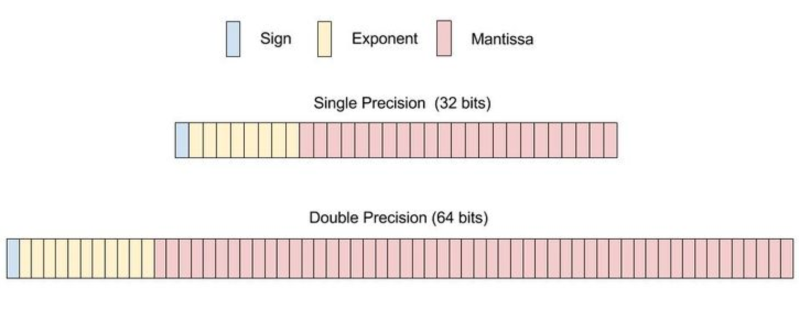

# 02/01 - 04

## HTTP



- [HTTP 완벽 가이드 - HTTP 개관](https://github.com/codehumane/what-i-learned/tree/master/http-definitive-guide#http-%EA%B0%9C%EA%B4%80)
- [HTTP 완벽 가이드 - URL과 리소스](https://github.com/codehumane/what-i-learned/tree/master/http-definitive-guide#url%EA%B3%BC-%EB%A6%AC%EC%86%8C%EC%8A%A4)
- [HTTP 완벽 가이드 - HTTP 메시지](https://github.com/codehumane/what-i-learned/tree/master/http-definitive-guide#http-%EB%A9%94%EC%8B%9C%EC%A7%80)
- [OddOccurencesInArray](https://github.com/codehumane/learn-algorithm-in-java/commit/235411d90e3436ce90398078bd201227c44e868e)
- [CyclicRotation by reverse](https://github.com/codehumane/learn-algorithm-in-java/commit/7f3f670f000a3253fb0ae0f3872d327292b0a278)

# 02/06

- [학이불사즉망(學而不思則罔)](http://hanja.naver.com/word?query=%E5%AD%B8%E8%80%8C%EF%A5%A7%E6%80%9D%E5%89%87%E7%BD%94): 배우기만 하고 생각하지 않으면 막연하여 얻는 것이 없다.

# 02/07

## Codility

- [TapeEquilibrium](https://github.com/codehumane/learn-algorithm-in-java/commit/c6a5f8bf77e9c947894d0a3dd7d1100fbccbcb72)
- [FrogJump](https://github.com/codehumane/learn-algorithm-in-java/commit/bd411522951deba6e159cee5bbc00af119df0d70)
- [PermMissingElement](https://github.com/codehumane/learn-algorithm-in-java/commit/7c891cee4ffe35651588e3ac392e08ec0a4fa371)

## Article

- [Terraform101](https://mooyoul.github.io/2016/12/19/Terraform-101/)
- [HTTPS 전환 과정에서 read timeout 오류 해결 과정](http://d2.naver.com/helloworld/1469717)

# 02/09

## Codility

- [MaxCounters](https://app.codility.com/programmers/lessons/4-counting_elements/max_counters/) 퀴즈의 [O(N*M) 구현](https://github.com/codehumane/learn-algorithm-in-java/commit/adf152ad1001e23b95df863df3b945c7ebda69a7)
- [MaxCounters](https://app.codility.com/programmers/lessons/4-counting_elements/max_counters/) 퀴즈의 [O(N+M) 구현](https://github.com/codehumane/learn-algorithm-in-java/commit/e25f85ea3259ec5eccb18ac58b144101cd9a7de6)

## Spock

- 편하긴 하지만 단점도 분명한. 같이 일하는 사람들이 필요성에 공감하고 있으니 한 번 더 적용해 보고 판단하는 걸로.

```groovy
def "substring"() {
    
    expect:
    StringUtil.substring(target, from, to) == expected
    
    where:
    target                 | from | to  || expected
    "12345678901234567890" | 0    | 100 || "12345678901234567890"
    "12345678901234567890" | 0    | 20  || "12345678901234567890"
    "12345678901234567890" | 5    | 100 || "678901234567890"
    "12345678901234567890" | 0    | 3   || "123"
    "12345678901234567890" | 1    | 3   || "23"
}
```

## Terraform

- "[Terraform](https://www.terraform.io/)과 [Vault](https://www.vaultproject.io/) 도입과 활용"이라는 사내 강의 들음.
- 많은 의문이 해소됨. 특히 어떤 시점에서 도입이 의미 있을까에 대한.
- 인상 깊었던 문구는 "소프트웨어 개발의 경험을 인프라스트럭처 관리에 녹아낸다".
- 버전 관리, 코드 리뷰, 반복 가능성, 동작하는 문서 등.
- 더 좋았던 건 고민거리나 삽질 경험등의 공유.
- 빨리 핵심(비즈니스)으로 돌아오는 데 도움이 되는 이야기들이다.

# 02/18

## Codility

- [MinAvgTwoSlice](https://app.codility.com/programmers/lessons/5-prefix_sums/min_avg_two_slice/) [구현](https://github.com/codehumane/learn-algorithm-in-java/commit/b09da9f5ebbc399c4af59f12b219f63e3cdb6b81)

# 02/20

## Codility

- [GenomicRangeQuery](https://app.codility.com/programmers/lessons/5-prefix_sums/genomic_range_query/)의 [O(M*N) 구현](https://github.com/codehumane/learn-algorithm-in-java/commit/46add671cee7d59b2fec435119fe9a303f3d4dea)과 [O(M+N) 구현](https://github.com/codehumane/learn-algorithm-in-java/commit/82ce99ed5600cbff27b5a07f9b04b31317062db7)

## Java Primitive Number Data Types

종종 잊어버리는 숫자 관련 primitive types에 대해 간단히 기록. 당연한 이야기지만, `byte`나 `short`는 큰 배열 등 사용시 메모리를 효율적으로 활용하기 위함. 더불어, 한계를 명시하는 문서의 역할도. long도 마찬가지. 범위가 다를 뿐.

참고로, `int`, `long`, `float`은 Java SE 8 이후부터 `divideUnsigned`, `parseUnsignedInt` 등을 통해 unsigned로 활용 가능.

| type   | description                              |
| ------ | ---------------------------------------- |
| byte   | 8-bit signed [two's complement](https://en.wikipedia.org/wiki/Two%27s_complement) integer |
| short  | 16-bit signed two's complement integer   |
| int    | 32-bit signed two's complement integer (by default) |
| long   | 64-bit signed two's complement integer (by default) |
| float  | 32-bit [IEEE 754](https://ko.wikipedia.org/wiki/IEEE_754) floating point (1:8:23) |
| double | 64-bit IEEE 754 floating point (1:11:52) |

아래 그림은 `float`과 `double`의 IEEE 754 표기를 각각 그림으로 나타낸 것. 출처는 [여기](https://www.wikihow.com/Convert-a-Number-from-Decimal-to-IEEE-754-Floating-Point-Representation).



# 02/21

## 프로젝트 이야기 주저리

- 레거시 시스템으로부터 신규 서비스 분리하는 작업을 오랜만에 시작.
- 스스로 이 작업이 왜 필요한지를 묻고 답하는 것이 제일 힘들었음. 서로 다른 기대치들을 어느 정도 일치시키는 것보다 더.
- 왜를 물어보는 단계는 어느 정도 끝났고, 이제 어떻게 할지 고민하는 단계.
- 기억하면 좋을 만한 것들을 몇 가지 기록하면 아래와 같음.
- 브랜치, 배포, 피처 토글 단위는 사용자 트랜잭션 단위로 진행할 예정.
- 배포가 곧 피처 적용을 의미하지는 않음. 피처의 적용은 배포된 피처들 중 QA 완료된 것들부터 순차적으로.
- 새로운 서비스로 잘 이전되고 있나를 지속적으로 검증할 수 있는 도구나 지표가 필요.
- 이를 기반으로 언제든 복구 또는 방향 조절이 가능해야 함.
- 어느 정도 검증 전략을 세움. 그러나 더 좋은 방법은 없는지 계속 의문.
- 더불어, 함께하는 사람들은 어떤 성장을 할 수 있을까 고민.
- 그 외 적지 못하는 다양한 고민들. 프로젝트가 진행되면서 이 고민들이 유효했는지를 돌아보는 것이 기대됨.

## Codility

- [Distinct](https://app.codility.com/programmers/lessons/6-sorting/distinct/)의 [O(N^2) 시간복잡도 구현](https://github.com/codehumane/learn-algorithm-in-java/commit/205d0dffd152b1adfe08abc5d15bfa8da6e86295)과 [O(N*log(N)) 시간복잡도 구현](https://github.com/codehumane/learn-algorithm-in-java/commit/5f5650f8487793e63387751465ad825a1c9ad9e1)
- 요즘 퀴즈 푸는 재미가 쏠쏠함.

# 02/25

- [NumberOfDiscIntersections](https://app.codility.com/programmers/lessons/6-sorting/number_of_disc_intersections/)의 [O(N^2) 구현](https://github.com/codehumane/learn-algorithm-in-java/commit/77fdb65dffb7b4260546745f0d3117149a7631e0) 후 [overflow fix](https://github.com/codehumane/learn-algorithm-in-java/commit/02eb262eb689d274c93312e8831586c65afd9a3f). 그리고 [O(N*log(N))으로 추가 구현](https://github.com/codehumane/learn-algorithm-in-java/commit/2012dc5a03c3a4341797033ea0f059ce003792f0).
- O(N*log(N)) 구현은 [여기](https://stackoverflow.com/questions/4801242/algorithm-to-calculate-number-of-intersecting-discs) 참고. 더불어, [여기](http://www.lucainvernizzi.net/blog/2014/11/21/codility-beta-challenge-number-of-disc-intersections/) 그림이 아이디어를 직관적으로 잘 설명함.

# 02/26

- [Brackets](https://app.codility.com/programmers/lessons/7-stacks_and_queues/brackets/)의 [O(N) 구현](https://github.com/codehumane/learn-algorithm-in-java/commit/c2927107855fd9cbdc7dbe3023ad8bfa3fa01895)
- HTTP 완벽 가이드, [간단한 펄 웹서버](https://github.com/codehumane/what-i-learned/tree/master/http-definitive-guide#%EA%B0%84%EB%8B%A8%ED%95%9C-%ED%8E%84-%EC%9B%B9%EC%84%9C%EB%B2%84)


# 02/27

- [Fish](https://app.codility.com/programmers/lessons/7-stacks_and_queues/fish/)의 [O(N) 구현](https://github.com/codehumane/learn-algorithm-in-java/commit/d4d662bd428e04e347cddb481c153018aa3bd8f7)

# 02/28

- 오랜만에 살펴본 DDD 개념과 코드들
- [MS의 DDD 마이크로 서비스의 계층 설명](https://docs.microsoft.com/ko-kr/dotnet/standard/microservices-architecture/microservice-ddd-cqrs-patterns/ddd-oriented-microservice)
- [IDDD 저자인 Vaughn Vernon의 DDD 샘플 코드](https://github.com/VaughnVernon/IDDD_Samples/)
- [최범균 님의 DDD Start 예시 중에서 주문 취소 Application Command Service](https://github.com/madvirus/ddd-start/blob/master/src/main/java/com/myshop/order/command/application/CancelOrderService.java)
- [Uncle Bob, The Clean Architecture](https://8thlight.com/blog/uncle-bob/2012/08/13/the-clean-architecture.html)
