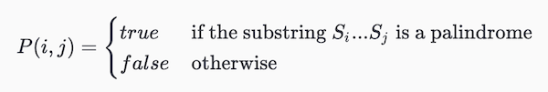
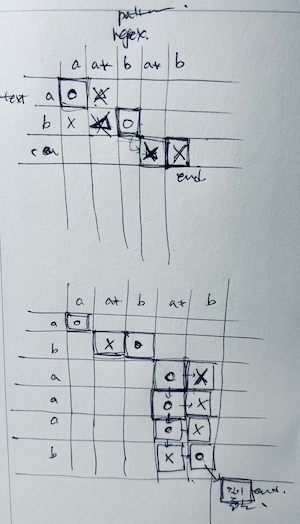
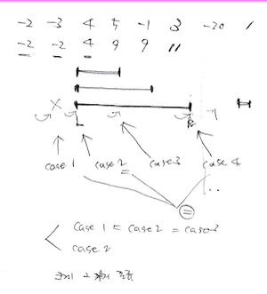
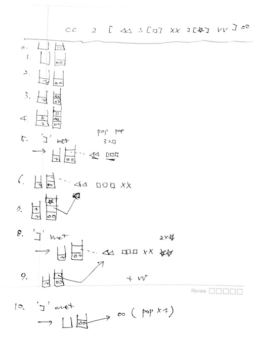

# 01/01

## TMP

[Chapter 3. Tech Lead](https://github.com/codehumane/what-i-learned/blob/master/book/tmp/README.md#chapter-3-tech-lead)

- [All Great Tech Leads Know This One Weird Trick](https://github.com/codehumane/what-i-learned/blob/master/book/tmp/README.md#all-great-tech-leads-know-this-one-weird-trick)
- [Being a Tech Lead 101](https://github.com/codehumane/what-i-learned/blob/master/book/tmp/README.md#being-a-tech-lead-101)
- [Managing Projects](https://github.com/codehumane/what-i-learned/blob/master/book/tmp/README.md#managing-projects)
- [Managing a Project](https://github.com/codehumane/what-i-learned/blob/master/book/tmp/README.md#managing-a-project)

아마존 기술서적에서 이렇게 평점이 많으면서 점수도 높은 것은 드묾. 그런데 개인적으로는 책이 너무 깊이가 부족하고, 일반적인 얘기들만 반복해서 하는 것으로 느껴짐. 이 책은 여기까지만 읽는 것으로.

# 01/02

## TPP 2E

[Chapter 4. Pragmatic Paranoia](https://github.com/codehumane/what-i-learned/blob/master/book/tpp-2e/README.md#chapter-4-pragmatic-paranoia)

- [Topic 23. Design by Contract](https://github.com/codehumane/what-i-learned/blob/master/book/tpp-2e/README.md#topic-23-design-by-contract)
    - [DBC](https://github.com/codehumane/what-i-learned/blob/master/book/tpp-2e/README.md#dbc)
    - [Implementing DBC](https://github.com/codehumane/what-i-learned/blob/master/book/tpp-2e/README.md#implementing-dbc)
    - [DBC and Crashing Early](https://github.com/codehumane/what-i-learned/blob/master/book/tpp-2e/README.md#dbc-and-crashing-early)
    - [Semantic Invariants](https://github.com/codehumane/what-i-learned/blob/master/book/tpp-2e/README.md#semantic-invariants)
    - [Dynamic Contracts and Agents](https://github.com/codehumane/what-i-learned/blob/master/book/tpp-2e/README.md#dynamic-contracts-and-agents)

# 01/03

## TPP 2E

[Chapter 4. Pragmatic Paranoia](https://github.com/codehumane/what-i-learned/blob/master/book/tpp-2e/README.md#chapter-4-pragmatic-paranoia)

- [Topic 24. Dead Programs Tell No Lies](https://github.com/codehumane/what-i-learned/blob/master/book/tpp-2e/README.md#topic-24-dead-programs-tell-no-lies)
  - [Catch and Release Is for Fish](https://github.com/codehumane/what-i-learned/blob/master/book/tpp-2e/README.md#catch-and-release-is-for-fish)
  - [Crash, Don't Trash](https://github.com/codehumane/what-i-learned/blob/master/book/tpp-2e/README.md#crash-dont-trash)

# 01/05

## TPP 2E

[Chapter 4. Pragmatic Paranoia](https://github.com/codehumane/what-i-learned/blob/master/book/tpp-2e/README.md#chapter-4-pragmatic-paranoia)

- [Topic 25. Assertive Programming](https://github.com/codehumane/what-i-learned/blob/master/book/tpp-2e/README.md#topic-25-assertive-programming)
    - [Assertions and Side Effects](https://github.com/codehumane/what-i-learned/blob/master/book/tpp-2e/README.md#assertions-and-side-effects)
    - [Leave Assertions Turned On](https://github.com/codehumane/what-i-learned/blob/master/book/tpp-2e/README.md#leave-assertions-turned-on)
- [Topic 26. How to Balance Resources](https://github.com/codehumane/what-i-learned/blob/master/book/tpp-2e/README.md#topic-26-how-to-balance-resources)
    - [Nest Allocations](https://github.com/codehumane/what-i-learned/blob/master/book/tpp-2e/README.md#nest-allocations)
    - [Objects and Exceptions](https://github.com/codehumane/what-i-learned/blob/master/book/tpp-2e/README.md#objects-and-exceptions)
    - [Balancing and Exceptions](https://github.com/codehumane/what-i-learned/blob/master/book/tpp-2e/README.md#balancing-and-exceptions)
    - [Checking the Balance](https://github.com/codehumane/what-i-learned/blob/master/book/tpp-2e/README.md#checking-the-balance)

# 01/06

## TPP 2E

[Chapter 4. Pragmatic Paranoia](https://github.com/codehumane/what-i-learned/blob/master/book/tpp-2e/README.md#chapter-4-pragmatic-paranoia) 정리 끝.

- [Topic 27. Don't Outrun Your Headlights](https://github.com/codehumane/what-i-learned/blob/master/book/tpp-2e/README.md#topic-27-dont-outrun-your-headlights)
- [Black Swans](https://github.com/codehumane/what-i-learned/blob/master/book/tpp-2e/README.md#black-swans)

# 01/07

## TPP 2E

[Chapter 5. Bend, or Break](https://github.com/codehumane/what-i-learned/blob/master/book/tpp-2e/README.md#chapter-5-bend-or-break) 정리 시작.

- [Topic 28. Decoupling](https://github.com/codehumane/what-i-learned/blob/master/book/tpp-2e/README.md#topic-28-decoupling)
    - [Train Wrecks](https://github.com/codehumane/what-i-learned/blob/master/book/tpp-2e/README.md#train-wrecks)
    - [The Evils of Globalization](https://github.com/codehumane/what-i-learned/blob/master/book/tpp-2e/README.md#the-evils-of-globalization)
    - [Inheritance Adds Coupling](https://github.com/codehumane/what-i-learned/blob/master/book/tpp-2e/README.md#inheritance-adds-coupling)
    - [Again, It's All About Change](https://github.com/codehumane/what-i-learned/blob/master/book/tpp-2e/README.md#again-its-all-about-change)

# 01/09

## TPP 2E

[Chapter 5. Bend, or Break](https://github.com/codehumane/what-i-learned/blob/master/book/tpp-2e/README.md#chapter-5-bend-or-break)

- [Topic 29. Juggling the Real World](https://github.com/codehumane/what-i-learned/blob/master/book/tpp-2e/README.md#topic-29-juggling-the-real-world)
    - [Events](https://github.com/codehumane/what-i-learned/blob/master/book/tpp-2e/README.md#events)
    - [Finite State Machines](https://github.com/codehumane/what-i-learned/blob/master/book/tpp-2e/README.md#finite-state-machines)
    - [The Observer Pattern](https://github.com/codehumane/what-i-learned/blob/master/book/tpp-2e/README.md#the-observer-pattern)
    - [Publish/Subscribe](https://github.com/codehumane/what-i-learned/blob/master/book/tpp-2e/README.md#publishsubscribe)
    - [Reactive Programming, Streams, and Events](https://github.com/codehumane/what-i-learned/blob/master/book/tpp-2e/README.md#reactive-programming-streams-and-events)
    - [Events Are Ubiquitous](https://github.com/codehumane/what-i-learned/blob/master/book/tpp-2e/README.md#events-are-ubiquitous)

# 01/10

## TPP 2E

[Chapter 5. Bend, or Break](https://github.com/codehumane/what-i-learned/blob/master/book/tpp-2e/README.md#chapter-5-bend-or-break)

- [Topic 30. Transforming Programming](https://github.com/codehumane/what-i-learned/blob/master/book/tpp-2e/README.md#topic-30-transforming-programming)
    - [Finding Transformations](https://github.com/codehumane/what-i-learned/blob/master/book/tpp-2e/README.md#finding-transformations)
    - [Why Is This So Great?](https://github.com/codehumane/what-i-learned/blob/master/book/tpp-2e/README.md#why-is-this-so-great)
    - [What About Error Handling?](https://github.com/codehumane/what-i-learned/blob/master/book/tpp-2e/README.md#what-about-error-handling)

# 01/11

## TPP 2E

[Chapter 5. Bend, or Break](https://github.com/codehumane/what-i-learned/blob/master/book/tpp-2e/README.md#chapter-5-bend-or-break)

- [Topic 31. Inheritance Tax](https://github.com/codehumane/what-i-learned/blob/master/book/tpp-2e/README.md#topic-31-inheritance-tax)
    - [Some Background](https://github.com/codehumane/what-i-learned/blob/master/book/tpp-2e/README.md#some-background)
    - [Problems Using Inheritance to Share Code](https://github.com/codehumane/what-i-learned/blob/master/book/tpp-2e/README.md#problems-using-inheritance-to-share-code)
    - [The Alternatives Are Better](https://github.com/codehumane/what-i-learned/blob/master/book/tpp-2e/README.md#the-alternatives-are-better)

# 01/12

## TPP 2E

[Chapter 5. Bend, or Break](https://github.com/codehumane/what-i-learned/blob/master/book/tpp-2e/README.md#chapter-5-bend-or-break)

- [Topic 32. Configuration](https://github.com/codehumane/what-i-learned/blob/master/book/tpp-2e/README.md#topic-32-configuration)
    - [Static Configuration](https://github.com/codehumane/what-i-learned/blob/master/book/tpp-2e/README.md#static-configuration)
    - [Configuration-As-A-Service](https://github.com/codehumane/what-i-learned/blob/master/book/tpp-2e/README.md#configuration-as-a-service)
    - [Don't Write Dodo-Code](https://github.com/codehumane/what-i-learned/blob/master/book/tpp-2e/README.md#dont-write-dodo-code)

[Chapter 6. Concurrency](https://github.com/codehumane/what-i-learned/blob/master/book/tpp-2e/README.md#chapter-6-concurrency)

- [Topic 33. Breaking Temporal Coupling](https://github.com/codehumane/what-i-learned/blob/master/book/tpp-2e/README.md#topic-33-breaking-temporal-coupling)
    - [Looking for Concurrency](https://github.com/codehumane/what-i-learned/blob/master/book/tpp-2e/README.md#looking-for-concurrency)
    - [Opportunities for Concurrency](https://github.com/codehumane/what-i-learned/blob/master/book/tpp-2e/README.md#opportunities-for-concurrency)
    - [Opportunities for Paralleism](https://github.com/codehumane/what-i-learned/blob/master/book/tpp-2e/README.md#opportunities-for-parallelism)
    - [Identifying Opportunities Is the Eash Part](https://github.com/codehumane/what-i-learned/blob/master/book/tpp-2e/README.md#identifying-opportunities-is-the-easy-part)
- [Topic 34. Shared State Is Incorrect State](https://github.com/codehumane/what-i-learned/blob/master/book/tpp-2e/README.md#topic-34-shared-state-is-incorrect-state)
    - [Nonatomic Updates](https://github.com/codehumane/what-i-learned/blob/master/book/tpp-2e/README.md#nonatomic-updates)
    - [Multiple Resource Transactions](https://github.com/codehumane/what-i-learned/blob/master/book/tpp-2e/README.md#multiple-resource-transactions)
    - [Non-Transactional Updates](https://github.com/codehumane/what-i-learned/blob/master/book/tpp-2e/README.md#non-transactional-updates)
    - [Other Kinds of Exclusive Access](https://github.com/codehumane/what-i-learned/blob/master/book/tpp-2e/README.md#other-kinds-of-exclusive-access)

# 01/13

## TPP 2E

[Chapter 6. Concurrency](https://github.com/codehumane/what-i-learned/blob/master/book/tpp-2e/README.md#chapter-6-concurrency)

- [Topic 35. Actors and Processes](https://github.com/codehumane/what-i-learned/blob/master/book/tpp-2e/README.md#topic-35-actors-and-processes)
  - [Actors Can Only Be Concurrent](https://github.com/codehumane/what-i-learned/blob/master/book/tpp-2e/README.md#actors-can-only-be-concurrent)
  - [A Simple Actor](https://github.com/codehumane/what-i-learned/blob/master/book/tpp-2e/README.md#a-simple-actor)
  - [No Explicit Concurrency](https://github.com/codehumane/what-i-learned/blob/master/book/tpp-2e/README.md#no-explicit-concurrency)
  - [Erlang Sets the Stage](https://github.com/codehumane/what-i-learned/blob/master/book/tpp-2e/README.md#erlang-sets-the-stage)
- [Topic 36. Blackboards](https://github.com/codehumane/what-i-learned/blob/master/book/tpp-2e/README.md#topic-36-blackboards)

# 01/14

## TPP 2E

[Chapter 7. While You Are Coding](https://github.com/codehumane/what-i-learned/blob/master/book/tpp-2e/README.md#chapter-7-while-you-are-coding)

- [Topic 37. Listen to Your Lizard Brain](https://github.com/codehumane/what-i-learned/blob/master/book/tpp-2e/README.md#topic-37-listen-to-your-lizard-brain)
  - [Fear of the Blank Page](https://github.com/codehumane/what-i-learned/blob/master/book/tpp-2e/README.md#fear-of-the-blank-page)
  - [Fighting Yourself](https://github.com/codehumane/what-i-learned/blob/master/book/tpp-2e/README.md#fighting-yourself)
  - [How to Talk Lizard](https://github.com/codehumane/what-i-learned/blob/master/book/tpp-2e/README.md#how-to-talk-lizard)
  - [It's Playtime!](https://github.com/codehumane/what-i-learned/blob/master/book/tpp-2e/README.md#its-playtime)

# 01/15

## TPP 2E

[Chapter 7. While You Are Coding](https://github.com/codehumane/what-i-learned/blob/master/book/tpp-2e/README.md#chapter-7-while-you-are-coding)

- [Topic 38. Programming by Coincidence](https://github.com/codehumane/what-i-learned/blob/master/book/tpp-2e/README.md#topic-38-programming-by-coincidence)
  - [How to Program by Coincidence](https://github.com/codehumane/what-i-learned/blob/master/book/tpp-2e/README.md#how-to-program-by-coincidence)
  - [How to Program Deliberately](https://github.com/codehumane/what-i-learned/blob/master/book/tpp-2e/README.md#how-to-program-deliberately)

# 01/17

## TPP 2E

[Chapter 7. While You Are Coding](https://github.com/codehumane/what-i-learned/blob/master/book/tpp-2e/README.md#chapter-7-while-you-are-coding)

- [Topic 40. Refactoring](https://github.com/codehumane/what-i-learned/blob/master/book/tpp-2e/README.md#topic-40-refactoring)
  - [Real-World Complications](https://github.com/codehumane/what-i-learned/blob/master/book/tpp-2e/README.md#real-world-complications)
  - [How Do You Refactor?](https://github.com/codehumane/what-i-learned/blob/master/book/tpp-2e/README.md#how-do-you-refactor)
- [Topic 41. Test to Code](https://github.com/codehumane/what-i-learned/blob/master/book/tpp-2e/README.md#topic-41-test-to-code)
  - [Thinking About Tests](https://github.com/codehumane/what-i-learned/blob/master/book/tpp-2e/README.md#thinking-about-tests)
  - [Tests Drive Coding](https://github.com/codehumane/what-i-learned/blob/master/book/tpp-2e/README.md#tests-drive-coding)

# 01/18

## TPP 2E

[Chapter 7. While You Are Coding](https://github.com/codehumane/what-i-learned/blob/master/book/tpp-2e/README.md#chapter-7-while-you-are-coding)

- [Topic 41. Test to Code](https://github.com/codehumane/what-i-learned/blob/master/book/tpp-2e/README.md#topic-41-test-to-code)
  - [TDD: You Need to Know Where You're Going](https://github.com/codehumane/what-i-learned/blob/master/book/tpp-2e/README.md#tdd-you-need-to-know-where-youre-going)
  - [Back to the Code](https://github.com/codehumane/what-i-learned/blob/master/book/tpp-2e/README.md#back-to-the-code)
  - [Unit Testing](https://github.com/codehumane/what-i-learned/blob/master/book/tpp-2e/README.md#unit-testing)
  - [Testing Against Contract](https://github.com/codehumane/what-i-learned/blob/master/book/tpp-2e/README.md#testing-against-contract)
  - [Ad Hoc Testing](https://github.com/codehumane/what-i-learned/blob/master/book/tpp-2e/README.md#ad-hoc-testing)
  - [Build a Test Window](https://github.com/codehumane/what-i-learned/blob/master/book/tpp-2e/README.md#build-a-test-window)
  - [A Culture of Testing](https://github.com/codehumane/what-i-learned/blob/master/book/tpp-2e/README.md#a-culture-of-testing)

# 01/19

## TPP 2E

[Chapter 7. While You Are Coding](https://github.com/codehumane/what-i-learned/blob/master/book/tpp-2e/README.md#chapter-7-while-you-are-coding)

- [Topic 42. Property-Based Testing](https://github.com/codehumane/what-i-learned/blob/master/book/tpp-2e/README.md#topic-42-property-based-testing)
  - [Topic 42. Contracts, Invariants, and Properties](https://github.com/codehumane/what-i-learned/blob/master/book/tpp-2e/README.md#contracts-invariants-and-properties)
  - [Topic 42. Test Data Generation](https://github.com/codehumane/what-i-learned/blob/master/book/tpp-2e/README.md#test-data-generation)
  - [Topic 42. Finding Bad Assumptions](https://github.com/codehumane/what-i-learned/blob/master/book/tpp-2e/README.md#finding-bad-assumptions)
- [Topic 43. Stay Safe Out There](https://github.com/codehumane/what-i-learned/blob/master/book/tpp-2e/README.md#topic-43-stay-safe-out-there)
  - [Topic 43. The Other 90](https://github.com/codehumane/what-i-learned/blob/master/book/tpp-2e/README.md#the-other-90)
  - [Topic 43. Security Basic Principles](https://github.com/codehumane/what-i-learned/blob/master/book/tpp-2e/README.md#security-basic-principles)
  - [Topic 43. Common Sense vs Crypto](https://github.com/codehumane/what-i-learned/blob/master/book/tpp-2e/README.md#common-sense-vs-crypto)

# 01/21

## TPP 2E

[Chapter 7. While You Are Coding](https://github.com/codehumane/what-i-learned/blob/master/book/tpp-2e/README.md#chapter-7-while-you-are-coding)

- [Topic 44. Naming Things](https://github.com/codehumane/what-i-learned/blob/master/book/tpp-2e/README.md#topic-44-naming-things)
  - [Honor the Culture](https://github.com/codehumane/what-i-learned/blob/master/book/tpp-2e/README.md#honor-the-culture)
  - [Consistency](https://github.com/codehumane/what-i-learned/blob/master/book/tpp-2e/README.md#consistency)
  - [Renaming Is Even Harder](https://github.com/codehumane/what-i-learned/blob/master/book/tpp-2e/README.md#renaming-is-even-harder)

# 01/22

## TPP 2E

[Chapter 8. Before the Project](https://github.com/codehumane/what-i-learned/blob/master/book/tpp-2e/README.md#chapter-8-before-the-project)

- [Topic 45. The Requirements Pit](https://github.com/codehumane/what-i-learned/blob/master/book/tpp-2e/README.md#topic-45-the-requirements-pit)
  - [The Requirements Myth](https://github.com/codehumane/what-i-learned/blob/master/book/tpp-2e/README.md#the-requirements-myth)
  - [Programming as Therapy](https://github.com/codehumane/what-i-learned/blob/master/book/tpp-2e/README.md#programming-as-therapy)
  - [Requirements Are a Process](https://github.com/codehumane/what-i-learned/blob/master/book/tpp-2e/README.md#requirements-are-a-process)
  - [Walk in Your Client's Shoes](https://github.com/codehumane/what-i-learned/blob/master/book/tpp-2e/README.md#walk-in-your-clients-shoes)
  - [Requirements vs. Policy](https://github.com/codehumane/what-i-learned/blob/master/book/tpp-2e/README.md#requirements-vs-policy)
  - [Requirements vs. Reality](https://github.com/codehumane/what-i-learned/blob/master/book/tpp-2e/README.md#requirements-vs-reality)
  - [Documenting Requirements](https://github.com/codehumane/what-i-learned/blob/master/book/tpp-2e/README.md#documenting-requirements)
  - [Overspecification](https://github.com/codehumane/what-i-learned/blob/master/book/tpp-2e/README.md#overspecification)
  - [Just One More Wafer-Thin Mint...](https://github.com/codehumane/what-i-learned/blob/master/book/tpp-2e/README.md#just-one-more-wafer-thin-mint)

아래 2 문장이 인상적.

> Good requirements are abstract.<br/>
> Requirements are not architecture. Requirements are not design, nor are they the user interface. Requirements are need.

# 01/23

## TPP 2E

[Chapter 8. Before the Project](https://github.com/codehumane/what-i-learned/blob/master/book/tpp-2e/README.md#chapter-8-before-the-project)

- [Topic 46. Solving Impossible Puzzles](https://github.com/codehumane/what-i-learned/blob/master/book/tpp-2e/README.md#topic-46-solving-impossible-puzzles)
  - [Degrees of Freedom](https://github.com/codehumane/what-i-learned/blob/master/book/tpp-2e/README.md#degrees-of-freedom)
  - [Get Out of Your Own Way!](https://github.com/codehumane/what-i-learned/blob/master/book/tpp-2e/README.md#get-out-of-your-own-way)
  - [Fortune Favors the Prepared Mind](https://github.com/codehumane/what-i-learned/blob/master/book/tpp-2e/README.md#fortune-favors-the-prepared-mind)
- [Topic 47. Working Together](https://github.com/codehumane/what-i-learned/blob/master/book/tpp-2e/README.md#topic-47-working-together)
  - [Pair Programming](https://github.com/codehumane/what-i-learned/blob/master/book/tpp-2e/README.md#pair-programming)
  - [Mob Programming](https://github.com/codehumane/what-i-learned/blob/master/book/tpp-2e/README.md#mob-programming)
  - [What Should I Do?](https://github.com/codehumane/what-i-learned/blob/master/book/tpp-2e/README.md#what-should-i-do)

몇 토픽에 걸쳐 평이한 내용들이 반복되고 있어서, 책 정리는 여기서 마무리. 1판을 사회생활 초반에 읽었던지라 처음 생각이 많이 남. 다시금 마음을 울린 내용이 있었다는 점에서 수확.

# 01/24

## Grokking Algorithms

- [Chapter 5. Quicksort](https://github.com/codehumane/what-i-learned/blob/master/book/grokking-algorithms/README.md#chapter-5-quicksort)
- [Divide & conquer](https://github.com/codehumane/what-i-learned/blob/master/book/grokking-algorithms/README.md#chapter-5-quicksort)

# 01/26

## Grokking Algorithms

[Chapter 5. Quicksort](https://github.com/codehumane/what-i-learned/blob/master/book/grokking-algorithms/README.md#chapter-5-quicksort)

- [Quicksort](https://github.com/codehumane/what-i-learned/blob/master/book/grokking-algorithms/README.md#quicksort)
- [Big O notation revisited](https://github.com/codehumane/what-i-learned/blob/master/book/grokking-algorithms/README.md#big-o-notation-revisited)
  - [Merge sort vs. quicksort](https://github.com/codehumane/what-i-learned/blob/master/book/grokking-algorithms/README.md#merge-sort-vs-quicksort)
  - [Average case vs. worst case](https://github.com/codehumane/what-i-learned/blob/master/book/grokking-algorithms/README.md#average-case-vs-worst-case)

# 01/27

## Grokking Algorithms

[Chapter 7. Dijkstra's algorithm](https://github.com/codehumane/what-i-learned/blob/master/book/grokking-algorithms/README.md#chapter-7-dijkstras-algorithm)

- [Working with Dijkstra's algorithm](https://github.com/codehumane/what-i-learned/blob/master/book/grokking-algorithms/README.md#working-with-dijkstras-algorithm)

# 01/28

## Grokking Algorithms

[Chapter 7. Dijkstra's algorithm](https://github.com/codehumane/what-i-learned/blob/master/book/grokking-algorithms/README.md#chapter-7-dijkstras-algorithm)

- [Terminology](https://github.com/codehumane/what-i-learned/tree/master/book/grokking-algorithms#terminology)
- [Trading for a piano](https://github.com/codehumane/what-i-learned/tree/master/book/grokking-algorithms#trading-for-a-piano)
- [Implementation](https://github.com/codehumane/what-i-learned/tree/master/book/grokking-algorithms#implementation)

## LeetCode

Dijkstra 읽는 김에 오랜만에 LeetCode 풀이.

- [Networking Delay Time 문제](https://leetcode.com/problems/network-delay-time/)
- [DFS 이용한 풀이](f925e7d4e5929d98f4797e242e57fbf0143b64f6)
- [Dijkstra 비스무리한 방법 이용한 풀이](98263ce41438687ab932472528fc6869307f5073)
- [Dijkstra 그대로 이용한 풀이](59dc7db86af75482c85452faf923878543f1781f)

# 01/29

[LeetCode에서 Dijkstra 관련된 문제들 목록](https://leetcode.com/discuss/interview-question/731911/please-share-dijkstras-algorithm-questions)

1. [Path With Maximum Probability](https://leetcode.com/problems/path-with-maximum-probability/)
2. [Network Delay Time](https://leetcode.com/problems/network-delay-time/)
3. [The Maze II](https://leetcode.com/problems/the-maze-ii/)
4. [The Maze III](https://leetcode.com/problems/the-maze-iii/)
5. [Path With Minimum Effort](https://leetcode.com/problems/path-with-minimum-effort/)
6. [Find The City With The Smallest Number Of Neighbors At A Threshold Distance](https://leetcode.com/problems/find-the-city-with-the-smallest-number-of-neighbors-at-a-threshold-distance/)

# 02/01

## LeetCode

[Network Delay Time](https://leetcode.com/problems/network-delay-time/)

- [Dijkstra에 더해 heap을 이용해서 풀이](https://github.com/codehumane/algorithm/commit/94062c418739852583825a61b75c50e442de5b53)

[Path With Minimum Effort](https://leetcode.com/problems/path-with-minimum-effort/)

- [Dijkstra를 이용해 풀이](https://github.com/codehumane/algorithm/commit/0847397521ddef58289dfdd32f913476f490728c) - Time Limit Exceeded
- [Dijkstra에 더해 heap 이용해 풀이](https://github.com/codehumane/algorithm/commit/559b308800de6d3e8c4709f3175a6042ef938a7b) - Accepted

## Grokking Algorithms

[Chapter 8. Greedy algorithms](https://github.com/codehumane/what-i-learned/blob/master/book/grokking-algorithms/README.md#chapter-8-greedy-algorithms)

- [The classroom scheduling problem](https://github.com/codehumane/what-i-learned/blob/master/book/grokking-algorithms/README.md#the-classroom-scheduling-problem)
- [The knapsack problem](https://github.com/codehumane/what-i-learned/blob/master/book/grokking-algorithms/README.md#the-knapsack-problem)

# 02/02

## Grokking Algorithms

[Chapter 8. Greedy algorithms](https://github.com/codehumane/what-i-learned/blob/master/book/grokking-algorithms/README.md#chapter-8-greedy-algorithms)

- [The set-covering problem](https://github.com/codehumane/what-i-learned/blob/master/book/grokking-algorithms/README.md#the-set-covering-problem)
- [Approximate algorithms](https://github.com/codehumane/what-i-learned/blob/master/book/grokking-algorithms/README.md#approximate-algorithms)
  - [Code for setup](https://github.com/codehumane/what-i-learned/blob/master/book/grokking-algorithms/README.md#code-for-setup)
  - [Calculating the answer](https://github.com/codehumane/what-i-learned/blob/master/book/grokking-algorithms/README.md#calculating-the-answer)
  - [Sets](https://github.com/codehumane/what-i-learned/blob/master/book/grokking-algorithms/README.md#sets)
  - [Back to the code](https://github.com/codehumane/what-i-learned/blob/master/book/grokking-algorithms/README.md#back-to-the-code)
- [NP-complete problems](https://github.com/codehumane/what-i-learned/blob/master/book/grokking-algorithms/README.md#np-complete-problems)
  - [Traveling salesperson, step by step](https://github.com/codehumane/what-i-learned/blob/master/book/grokking-algorithms/README.md#traveling-salesperson-step-by-step)
  - [3 cities](https://github.com/codehumane/what-i-learned/blob/master/book/grokking-algorithms/README.md#3-cities)
  - [4 cities](https://github.com/codehumane/what-i-learned/blob/master/book/grokking-algorithms/README.md#4-cities)
  - [How do you tell if a problem is NP-complete?](https://github.com/codehumane/what-i-learned/blob/master/book/grokking-algorithms/README.md#how-do-you-tell-if-a-problem-is-np-complete)

# 02/03

- [Greedy와 Dynamic 알고리즘 차이](https://www.geeksforgeeks.org/greedy-approach-vs-dynamic-programming/)

# 02/04

## Grokking Algorithms

[Chapter 9. Dynamic programming](https://github.com/codehumane/what-i-learned/blob/master/book/grokking-algorithms/README.md#chapter-9-dynamic-programming)

- [The knapsack problem](https://github.com/codehumane/what-i-learned/blob/master/book/grokking-algorithms/README.md#the-knapsack-problem-1)
  - [The simple solution](https://github.com/codehumane/what-i-learned/blob/master/book/grokking-algorithms/README.md#the-simple-solution)
  - [Dynamic programming](https://github.com/codehumane/what-i-learned/blob/master/book/grokking-algorithms/README.md#dynamic-programming)
  - [The guitar row](https://github.com/codehumane/what-i-learned/blob/master/book/grokking-algorithms/README.md#the-guitar-row)
  - [The laptop row](https://github.com/codehumane/what-i-learned/blob/master/book/grokking-algorithms/README.md#the-laptop-row)
- [Knapsack problem FAQ](https://github.com/codehumane/what-i-learned/blob/master/book/grokking-algorithms/README.md#knapsack-problem-faq)
  - [What happens if you add an item?](https://github.com/codehumane/what-i-learned/blob/master/book/grokking-algorithms/README.md#what-happens-if-you-add-an-item)
  - [What happens if you change the order of the rows?](https://github.com/codehumane/what-i-learned/blob/master/book/grokking-algorithms/README.md#what-happens-if-you-change-the-order-of-the-rows)
  - [Can you fill in the grid column-wise instead of row-wise?](https://github.com/codehumane/what-i-learned/blob/master/book/grokking-algorithms/README.md#can-you-fill-in-the-grid-column-wise-instead-of-row-wise)
  - [What happens if you add a smaller item?](https://github.com/codehumane/what-i-learned/blob/master/book/grokking-algorithms/README.md#what-happens-if-you-add-a-smaller-item)
  - [Can you steal fractions of an item?](https://github.com/codehumane/what-i-learned/blob/master/book/grokking-algorithms/README.md#can-you-steal-fractions-of-an-item)
  - [Optimizing your travel itinerary](https://github.com/codehumane/what-i-learned/blob/master/book/grokking-algorithms/README.md#optimizing-your-travel-itinerary)
  - [Handling items that depend on each other](https://github.com/codehumane/what-i-learned/blob/master/book/grokking-algorithms/README.md#handling-items-that-depend-on-each-other)
  - [Is it possible that the solution will require more than two sub-knapsacks?](https://github.com/codehumane/what-i-learned/blob/master/book/grokking-algorithms/README.md#is-it-possible-that-the-solution-will-require-more-than-two-sub-knapsacks)
  - [Is it possible that the best solution doesn't fill the knapsack completely?](https://github.com/codehumane/what-i-learned/blob/master/book/grokking-algorithms/README.md#is-it-possible-that-the-best-solution-doesnt-fill-the-knapsack-completely)

# 02/05

## Grokking Algorithms

[Chapter 9. Dynamic programming](https://github.com/codehumane/what-i-learned/blob/master/book/grokking-algorithms/README.md#chapter-9-dynamic-programming)

- [Longest common substring](https://github.com/codehumane/what-i-learned/blob/master/book/grokking-algorithms/README.md#longest-common-substring)
- [Recap](https://github.com/codehumane/what-i-learned/blob/master/book/grokking-algorithms/README.md#recap)
- [Longest common substing에 관해 잘못 생각했던 오류 정정](https://github.com/codehumane/what-i-learned/commit/3f41a05d5bf7513c2642de33937cf0b1b5437b19)

## LeetCode

- [Longest Common Subsequence 문제](https://leetcode.com/problems/longest-common-subsequence/)
- [동적 프로그래밍 이용한 풀이](https://github.com/codehumane/algorithm/commit/6082ad9713e72e71505b70bf497135d10f50aba5)

# 02/06

## Junit 5

- [알고리즘 프로젝트의 JUnit을 4에서 5로 업그레이드](https://github.com/codehumane/algorithm/commit/37a9ed13146cc40611b07e88bd349e3f67dabf18).
- 너무 노가다라서, 시작하고 나서 바로 후회함. 하지만 다 바꿔두니 후련.
- 요즘엔 테스트 코드의 양도 어마어마하고, 개발 조직 규모도 상당하기에,
- 작은 명확성이나 가독성 등의 차이가, 운영 리소스의 큰 차이로 이어짐.
- 이 점에서 JUnit 5로의 이전은 의미 있다고 여겨짐.
- 여러 변화가 있지만, [오늘 작성한 단위 테스트](https://github.com/codehumane/algorithm/blob/a648de95930f1ba6a365812ab248b76b937c5760/src/test/java/quiz/dynamic/LongestPalindromicSubstringTest.java)처럼, `@ParameterizedTest` 작성이 훨씬 쉬워짐.

## LeetCode

- [Longest Palindromic Substring 문제](https://leetcode.com/problems/longest-palindromic-substring/)
- [동적 프로그래밍 그리드를 이용한 풀이](https://github.com/codehumane/algorithm/commit/a648de95930f1ba6a365812ab248b76b937c5760)
- 너무 어려웠음 @_@

# 02/07

## LeetCode

[Longest Palindromic Substring](https://leetcode.com/problems/longest-palindromic-substring/)의 [Solution](https://leetcode.com/problems/longest-palindromic-substring/solution/) 살펴보기.

**Longest Common Substring**

- 흔한 오해라고 함.
- 문자열 S를 뒤집은 S'를 만들고,
- S와 S'의 가장 긴 공통 하위문자열을 찾는 것.
- 반례는 `abacdfgdcaba`이고, 이 경우 `abacd`가 답이 되어 버림.
- `AAABAAA` 같이 가운데만 다르고 앞 뒤가 다른 것을 생각해 볼 수 있음.

**Dynamic Programming**

- 불필요 재연산을 피하는 방법을 찾아야 함.
- `ababa`의 경우 `bab`가 회문임을 안다면 `ababa`도 회문임이 분명.
- 그래서 P(i,j)를 아래와 같이 정의.



따라서..

$$P(i,j) = (P(i+1,j-1) \text{ and } S_{i} == S_{j}$$

그리고 베이스 케이스를 아래 2개로 잡고 있음.

$$P(i,j) = true$$
$$P(i,i+1) = (S_{i} == S_{i+1})$$

참고로, [여기 풀이](https://myinterview.guru/leetcode-5-longest-palindromic-substring-17717b5db2c2)를 보면 가운데 대각선을 시작으로, 오른쪽 한 칸씩 대각선을 더해서 채우고 있음.

**Expand Around Center**

- DP 방식은 시간 복잡도와 공간 복잡도가 모두 O(n^2)인데 비해,
- 이 방식은 시간 복잡도만 O(n^2)이고 공간 복잡도는 상수.
- 회문열이 가운데를 중심으로 주변이 미러링 된다는 특징을 이용.
- [간단히 구현](https://github.com/codehumane/algorithm/commit/b3d29577568bed63e5fc399067b9e77da5374298)해 봤고 Accepted.

# 02/09

## LeetCode

- [Longest Valid Parentheses 문제](https://leetcode.com/problems/longest-valid-parentheses/)
- [O(N)이긴 한데 사알짝 비효율인, 하지만 코드는 적은 방식으로 풀이](https://github.com/codehumane/algorithm/commit/16eade99df7b6904ccde25abba1bbeddb222e8b6)

# 02/12

## LeetCode

- [Longest Valid Parentheses 문제](https://leetcode.com/problems/longest-valid-parentheses/) 다시 살펴봄.
- 일단 [기존 풀이](https://github.com/codehumane/algorithm/commit/16eade99df7b6904ccde25abba1bbeddb222e8b6)에서 오류 발견.
- 왼쪽 결과를 더하는 경우를 고려 못 했던 것인데, 한 번 더하는 경우뿐만 아니라, 여러 번 누적된 경우까지 고려해야 하고, 결국 상수 공간복잡도로는 불가.
- [동적 프로그래밍 활용한 풀이](https://github.com/codehumane/algorithm/commit/2f57a4021f5bec7e28cef702a08c936172411493).
- [Stack 이용한 풀이](https://github.com/codehumane/algorithm/commit/e5260495c078b3f456c48245516a6924b4be68fe).
- [2 Pointer를 역으로도 한 번 더 수행하는 풀이](https://github.com/codehumane/algorithm/commit/8e018c88209f75435ead0753814228b10386de3b).
- DP나 Stack 이용한 풀이는 괜찮은데, 2 Pointer를 역으로도 한 번 더 수행해야 하는 마지막 풀이는 생각하기 너무 어려움.
- 너무 너무 안 풀릴 때 혹시 역으로 한 번 더 해보면 되려나.. 이런 생각을 할 수 있을런지.

# 02/13

## LeetCode

- [Jump Game 문제](https://leetcode.com/problems/jump-game/)
- [DP 이용해 풀었더니 Time Limit Exceeded](https://github.com/codehumane/algorithm/commit/aaada1d2962c4e2d251220a63cd42294a5ca9837)
- [혹시나 해서 불필요한 스트림 연산 한 번을 줄였으나 여전히 Time Limit Exceeded](https://github.com/codehumane/algorithm/commit/615de923834290962a0a3b77f5bee432e5d783b5)
- [좀 더 살펴보니, 2차 배열까지 필요 없을 듯 하여 상수 공간복잡도로 낮추고, 오른쪽으로의 검사를 좀 더 보수적으로 제한했더니, Accepted](https://github.com/codehumane/algorithm/commit/d300bacdf8340cb702b5b462d70afc3f8da23c8a)

# 02/14

## Grokking Algorithms

[Chapter 10. K-nearest neighbors](https://github.com/codehumane/what-i-learned/blob/master/book/grokking-algorithms/README.md#chapter-10-k-nearest-neighbors)

- [Classifying oranges vs. grapefruit](https://github.com/codehumane/what-i-learned/blob/master/book/grokking-algorithms/README.md#classifying-oranges-vs-grapefruit)
- [Building a recommendations system](https://github.com/codehumane/what-i-learned/blob/master/book/grokking-algorithms/README.md#building-a-recommendations-system)
  - [Feature extraction](https://github.com/codehumane/what-i-learned/blob/master/book/grokking-algorithms/README.md#feature-extraction)
  - [Regression](https://github.com/codehumane/what-i-learned/blob/master/book/grokking-algorithms/README.md#regression)
  - [Picking good features](https://github.com/codehumane/what-i-learned/blob/master/book/grokking-algorithms/README.md#picking-good-features)
- [Introduction to machine learning](https://github.com/codehumane/what-i-learned/blob/master/book/grokking-algorithms/README.md#introduction-to-machine-learning)

# 02/16

## LeetCode

- [Regular Expression Matching 문제](https://leetcode.com/problems/regular-expression-matching/)
- [개인적으로 작성한 TC를 모두 통과하긴 하나 문제 자체를 잘못 이해](https://github.com/codehumane/algorithm/commit/9cf6e89519b9da3ce2b5b3fa98d953c0f3a3205d0)

# 02/18

## LeetCode

- [Regular Expression Matching 문제](https://leetcode.com/problems/regular-expression-matching/)
- [재귀로 다시 풀이](https://github.com/codehumane/algorithm/commit/216e4cbac75eda49480b14f30710dca4186c47b6)
- [그리고 DP 풀이](https://github.com/codehumane/algorithm/commit/c6c3773e45dc2a818687dd4aa3ece48eee27f2cb)
- DP 풀이는 아래 표 그려서 이해하는 게 쉬움.



## Wildcard vs Regex

- LeetCode Regular Expression Matching 문제를 잘못 이해했던 이유가 Wildcard와 Regex를 혼동해서.
- [여기](https://reqchecker.eu/manual/extract_syntax.html)에 그 차이가 잘 나와 있음.

> With regular expressions the meaning of ? and * is different from that of wildcards. The equivalent of wildcard ? is the regex . and the equivalent of wildcard * is the regex .*. To remember that this option is enabled, the field is displayed in orange color.

# 02/20

## LeetCode

- [Wildcard Matching 문제](https://leetcode.com/problems/wildcard-matching/).
- [O(m x n)으로 풀었으나 Time Limit Exceeded](https://github.com/codehumane/algorithm/commit/1c711112dbeebeed9832a78f25fe0fbd6b352aef).
- [TLE가 발생한 테스트 케이스](https://github.com/codehumane/algorithm/commit/f58843ee6a156af13489ef0c5f8e6a5ba7aedc9e).
- DP 그리드에서 불필요한 앞뒤 연산을 줄이면 통과할 것으로 보임.
- 내일 마저 해보기.

# 02/21

## Building Mciroservices, 2nd Edition

두 번 읽었던 책인데 2판 나왔길래 아래 챕터들만 다시 읽어보려 함.

- CH1. What Are Microservices?
- CH2. How to Model Microservices?
- CH3. Splitting The Monolith
- CH6. Workflow
- CH10. From Monitoring to Observability
- CH12. Resiliency
- CH13. Scaling
- CH14. User Interfaces
- CH15. Organizational Structures

[Chapter 1. Whare Are Microservices?](https://github.com/codehumane/what-i-learned/blob/master/book/building-microservices-2e/README.md#chapter-1-what-are-microservices)

- [Microservices at a Glance](https://github.com/codehumane/what-i-learned/blob/master/book/building-microservices-2e/README.md#microservices-at-a-glance)
- [Key Concepts of Microservices](https://github.com/codehumane/what-i-learned/blob/master/book/building-microservices-2e/README.md#key-concepts-of-microservices)
  - [Independent Deployability](https://github.com/codehumane/what-i-learned/blob/master/book/building-microservices-2e/README.md#independent-deployability)
  - [Modeled Around a Business Domain](https://github.com/codehumane/what-i-learned/blob/master/book/building-microservices-2e/README.md#modeled-around-a-business-domain)
  - [Owning Their Own State](https://github.com/codehumane/what-i-learned/blob/master/book/building-microservices-2e/README.md#owning-their-own-state)
  - [Size](https://github.com/codehumane/what-i-learned/blob/master/book/building-microservices-2e/README.md#size)
  - [Flexibility](https://github.com/codehumane/what-i-learned/blob/master/book/building-microservices-2e/README.md#flexibility)
  - [Alignment of Architecture and Organization](https://github.com/codehumane/what-i-learned/blob/master/book/building-microservices-2e/README.md#alignment-of-architecture-and-organization)

## LeetCode

- [Wildcard Matching 문제](https://leetcode.com/problems/wildcard-matching/).
- [O(m x n)에 더해, DP 그리드의 불필요한 앞뒤 연산 줄여서 Accepted](https://github.com/codehumane/algorithm/commit/7b9c6e2c213c53a087c6816f572399820ed14b6f).

# 02/22

## Building Mciroservices, 2nd Edition

[Chapter 1. Whare Are Microservices?](https://github.com/codehumane/what-i-learned/blob/master/book/building-microservices-2e/README.md#chapter-1-what-are-microservices)

- [The Monolith](https://github.com/codehumane/what-i-learned/blob/master/book/building-microservices-2e/README.md#the-monolith)
  - [The Single-Process Monolith](https://github.com/codehumane/what-i-learned/blob/master/book/building-microservices-2e/README.md#the-single-process-monolith)
  - [The Modular Monolith](https://github.com/codehumane/what-i-learned/blob/master/book/building-microservices-2e/README.md#the-modular-monolith)
  - [The Distributed Monolith](https://github.com/codehumane/what-i-learned/blob/master/book/building-microservices-2e/README.md#the-distributed-monolith)
  - [Monoliths and Delivery Contention](https://github.com/codehumane/what-i-learned/blob/master/book/building-microservices-2e/README.md#monoliths-and-delivery-contention)
  - [Advantages of Monoliths](https://github.com/codehumane/what-i-learned/blob/master/book/building-microservices-2e/README.md#advantages-of-monoliths)
- [Enabling Technology](https://github.com/codehumane/what-i-learned/blob/master/book/building-microservices-2e/README.md#enabling-technology)
  - [Log Aggregation and Distributed Tracing](https://github.com/codehumane/what-i-learned/blob/master/book/building-microservices-2e/README.md#log-aggregation-and-distributed-tracing)
  - [Containers and Kubernetes](https://github.com/codehumane/what-i-learned/blob/master/book/building-microservices-2e/README.md#containers-and-kubernetes)
  - [Streaming](https://github.com/codehumane/what-i-learned/blob/master/book/building-microservices-2e/README.md#streaming)
  - [Public Cloud and Serverless](https://github.com/codehumane/what-i-learned/blob/master/book/building-microservices-2e/README.md#public-cloud-and-serverless)
- [Advantages of Microservices](https://github.com/codehumane/what-i-learned/blob/master/book/building-microservices-2e/README.md#advantages-of-microservices)
  - [Technology Heterogeneity](https://github.com/codehumane/what-i-learned/blob/master/book/building-microservices-2e/README.md#technology-heterogeneity)
  - [Robustness](https://github.com/codehumane/what-i-learned/blob/master/book/building-microservices-2e/README.md#robustness)
  - [Scaling](https://github.com/codehumane/what-i-learned/blob/master/book/building-microservices-2e/README.md#scaling)
  - [Ease of Deployment](https://github.com/codehumane/what-i-learned/blob/master/book/building-microservices-2e/README.md#ease-of-deployment)
  - [Organizational Alignment](https://github.com/codehumane/what-i-learned/blob/master/book/building-microservices-2e/README.md#organizational-alignment)
  - [Composability](https://github.com/codehumane/what-i-learned/blob/master/book/building-microservices-2e/README.md#composability)
- [Microservice Pain Points](https://github.com/codehumane/what-i-learned/blob/master/book/building-microservices-2e/README.md#microservice-pain-points)
  - [Developer Experience](https://github.com/codehumane/what-i-learned/blob/master/book/building-microservices-2e/README.md#developer-experience)
  - [Technology Overload](https://github.com/codehumane/what-i-learned/blob/master/book/building-microservices-2e/README.md#technology-overload)
  - [Cost](https://github.com/codehumane/what-i-learned/blob/master/book/building-microservices-2e/README.md#cost)
  - [Reporting](https://github.com/codehumane/what-i-learned/blob/master/book/building-microservices-2e/README.md#reporting)
  - [Monitoring and Troubleshooting](https://github.com/codehumane/what-i-learned/blob/master/book/building-microservices-2e/README.md#monitoring-and-troubleshooting)
  - [Security](https://github.com/codehumane/what-i-learned/blob/master/book/building-microservices-2e/README.md#security)
  - [Testing](https://github.com/codehumane/what-i-learned/blob/master/book/building-microservices-2e/README.md#testing)
  - [Latency](https://github.com/codehumane/what-i-learned/blob/master/book/building-microservices-2e/README.md#latency)
  - [Data Consistency](https://github.com/codehumane/what-i-learned/blob/master/book/building-microservices-2e/README.md#data-consistency)

# 02/24

## LeetCode

- [Word Break 문제](https://leetcode.com/problems/word-break/).
- [재귀 풀이 - Time Limit Exceeded](https://github.com/codehumane/algorithm/commit/bdb42e13cf0e84908a6dd11a2e21a3e95b569d2b).

# 02/25

## LeetCode

- [Word Break 문제](https://leetcode.com/problems/word-break/) 시간복잡도 개선을 위해,
- [DP 풀이로 변경했더니 Accepted](https://github.com/codehumane/algorithm/commit/719369d43c5b2b7bb29b69888f69e925c8fc9fed).

# 02/26

## LeetCode

[Word Break](https://leetcode.com/problems/word-break/)

- [ProgramCreek의 Word Break 풀이](https://www.programcreek.com/2012/12/leetcode-solution-word-break/)에서,
- [Simple and Efficient라고 불리는 풀이](https://github.com/codehumane/algorithm/commit/75ab7ac271e5013a2150f8417bf5b8f4ecf7b092) 추가.
- 첫 번째 재귀 풀이 방식은 O(n!) 수준이고,
- DP 풀이는 O(문자열x사전수)이며,
- ProgramCreek 풀이는 O(문자열^2).
- 사전의 크기가 큰 경우의 대안으로 제시됨.

# 02/27

## LeetCode

- [Maximum Subarray 문제](https://leetcode.com/problems/maximum-subarray/)
- [Maximum Subarray O(n) 풀이](https://github.com/codehumane/algorithm/commit/ed83a9dbd2b2075ec4254f4bbc518b2ea14753be)



# 02/28

## LeetCode

- 어제 풀었던 [Maximum Subarray 문제](https://leetcode.com/problems/maximum-subarray/)를,
- [Divide and Conquer 방식으로 다시 풀어봄](https://github.com/codehumane/algorithm/commit/63e923e001d21a385b7a49d638aef904be4847d0).
- DP 방식이 O(N)인데 비해 DAC 방식은 O(N·logN).
- 문제 설명에서 O(N)으로 풀었으면 DAC로도 풀어보라고 하여 굳이 풀어봄.

# 02/29

## LeetCode

- Grokking Algorithms 읽더니, 오랜만에 계속 문제 풀며 노는 중 @_@
- 오늘은 [Find Leaves of Binary Tree 문제](https://leetcode.com/problems/find-leaves-of-binary-tree/).
- [일단 생각나는 데로 O(N^2)로 풀었고](https://github.com/codehumane/algorithm/commit/01df28373fe7e8766bd0000149e6290b504e260b),
- [DFS로 높이를 계산한 뒤 이 높이로 정렬해서 결과값 얻는 방식 풀이](https://github.com/codehumane/algorithm/commit/ef981d02fafa305ff374664ce73a3cafd73c45a2).
- DFS 탐색은 O(N)이지만 마지막에 정렬하는 것 때문에 O(N·logN).
- 좀 더 나아가면, [높이 별로 노드를 모아둔 `Map`이 있으니, 굳이 정렬 안 하고 높이 1부터 추출하면 됨](https://github.com/codehumane/algorithm/commit/885918ac557d9bdfeea7459aef49d9cf72c00617).
- [그리고 여기서 더 나아가 `Map` 조차 필요 없이 바로 `List`에 높이 탐색하면서 결과 값 넣기](https://github.com/codehumane/algorithm/commit/047e1f207c8808fae64f0b203f7e2bc2b636128e).

# 03/01

## LeetCode

- [Median of Two Sorted Arrays 문제](https://leetcode.com/problems/median-of-two-sorted-arrays/).
- [병합 정렬에서 병합하는 로직으로 풀이](https://github.com/codehumane/algorithm/commit/a477b9dfb515e3e67d4a7eac803705c58ef049ad).
- 시간복잡도와 공간복잡도는 모두 O(N).
- 난이도가 Hard라고 되어 있고 Acceptance도 30%인 것이 이상함.
- 게다가 이 문제는 solution도 따로 제공하지 않고 있음.
- [좀 더 나아가서 공간 복잡도를 O(1)로 개선해 봄](https://github.com/codehumane/algorithm/commit/0de3b0977078f4d85e3b97219d10588b46fff5cc).

# 03/02

## LeetCode

- [Reverse Integer 문제](https://leetcode.com/problems/reverse-integer/).
- Difficulty가 Medium인데 Acceptance가 26.5% 밖에 안 되길래 풀어봄.
- 실제 난이도는 낮음. 아마도 LeetCode 시작할 때 많이 나오는 문제인 듯.
- [일단 간단하게 먼저 풀어보고](https://github.com/codehumane/algorithm/commit/4a53be00f35cf24cc542ae2844880bf5c084334c),
- [조금 장황해지긴 하지만 아이디어가 명시적으로 드러나도록 Composed Method Pattern으로 정리](https://github.com/codehumane/algorithm/commit/80316adadf0ea833ccb0e44f0d8e1f7dad8cc22e).

# 03/03

## LeetCode

[Shortest Path in a Grid with Obstacles Elimination](https://leetcode.com/problems/shortest-path-in-a-grid-with-obstacles-elimination/)

- 제거할 수 있는 장애물의 조합을 먼저 구한 뒤,
- 각 조합 별로 dfs를 수행하면 되겠다고 생각함.
- [그래서 일단 장애물 제거 조합을 구하는 로직을 먼저 구현](https://github.com/codehumane/algorithm/commit/cf878a21211d83c22f7be45c7d76568b2e575f2b).
- 조합 원소의 수가 고정이 아니라 동적이기에 재귀를 이용.
- 조합 구하는 것부터 복잡 @_@

# 03/04

## LeetCode

[Shortest Path in a Grid with Obstacles Elimination](https://leetcode.com/problems/shortest-path-in-a-grid-with-obstacles-elimination/)

- [어제 생각한 대로, 조합을 구하고, 각 조합 별로 dfs 수행한 뒤, 최소 이동 거리 구하기](https://github.com/codehumane/algorithm/commit/57ba7c4647886b1bbc8131ddc3b6193882b078b0).
- [모든 조합에 대해 dfs 수행할 필요 없기에, k개의 조합에 대해서만 수행](https://github.com/codehumane/algorithm/commit/2b6accfaae9e571566d45331d64d7851976a3ff8).
- [좀 더 유리한 bfs로도 변경해 봄](https://github.com/codehumane/algorithm/commit/a95a29c945b24b475d89562ffd66d9f133ded2f0).
- 위 방식들 모두 Time Limit Exceeded.
- [그래서 모든 조합 별로 탐색 하는 대신, 탐색하면서 장애물을 제거하는 방식으로 변경](https://github.com/codehumane/algorithm/commit/59edb97ebb7457a160c092a8321121d09d958ad6).
- [bfs 특성을 고려하여 목적지 도착하면 바로 return하도록 개선하고](https://github.com/codehumane/algorithm/commit/49c9cde2f51136f231b4dabdba0ee86ebdcb136b),
- [방문 여부 판단도 간소화 함](https://github.com/codehumane/algorithm/commit/1752e0059076cd9414c7f8d92b875bc3c93d81d5).
- 그래도 여전히 Time Limit Exceeded.
- [좀 더 나아가서, 구현의 복잡성을 좀 더 높이되, 불필요한 queue 삽입을 줄이는 방식으로 개선](https://github.com/codehumane/algorithm/commit/fa1df54805344c1cd5a0f1ff9cef63d9c5c71369).
- 이제서야 Accepted.
- 힘들다 @_@

# 03/05

## LeetCode

[Shortest Path in a Grid with Obstacles Elimination](https://leetcode.com/problems/shortest-path-in-a-grid-with-obstacles-elimination/)

- [Solution 내용](https://leetcode.com/problems/shortest-path-in-a-grid-with-obstacles-elimination/solution/) 보면,
- [A* search algorithm](https://en.wikipedia.org/wiki/A*_search_algorithm) 이용한 풀이도 있음.
- 무조건 4방향으로 퍼지는 bfs를 좀 더 개선하여,
- 목적지에 가까운 곳부터 우선순위를 높여 탐색하는 것.
- [아이디어 보고 간단히 구현해 봄](https://github.com/codehumane/algorithm/commit/f884cf3f548fd3612f5142d2258778e9de50af5b).
- 첫 번째 bfs 풀이는 O(N·k)이고, 두 번째 풀이는 O(N⋅k⋅log(N⋅k)).
- N개 노드를 탐색할 때마다 queue 적재 시 정렬이 일어나기 때문.
- 재밌음.

[Maximum Number of Points with Cost](https://leetcode.com/problems/maximum-number-of-points-with-cost/)

- [가능성 있는 경로에 대해서만 비용과 합계를 계산](https://github.com/codehumane/algorithm/commit/807141c74846e2780f117d278f7d45c61e09e0c4).
- 이 문제도 따로 solution을 제공하고 있지 않음. 왜 이런 문제들이 있는 건지 @_@

[Logger Rate Limiter](https://leetcode.com/problems/logger-rate-limiter/)

- [먼저 Map 이용한 방식으로 풀이](https://github.com/codehumane/algorithm/commit/e1513adb0cfc3f6c0828dcdb2eb700dd9bef6d17).
- [Solution](https://leetcode.com/problems/logger-rate-limiter/solution/)을 보니 Set과 Queue를 이용한 방식을 먼저 소개하고 있음.
- [그래서 Set, Queue 이용한 풀이 추가](https://github.com/codehumane/algorithm/commit/13cad939fb56293f07cfc7c8841948a0acf874d8).
- 두 번쨰 풀이를 보니, Map 이용한 방식에서 Map 사이즈가 계속 커질 수 있는 문제를 발견.
- [그래서 이 공간을 적절한 시점에 비워주는 로직으로 변경](https://github.com/codehumane/algorithm/commit/b739d8f55187ce1279d20a9aae54fd547a754587).

# 03/06

## LeetCode

[Longest String Chain](https://leetcode.com/problems/longest-string-chain/)

- 먼저, [DFS를 이용한 풀이](https://github.com/codehumane/algorithm/commit/1829fa378d4cc2e6e76620aa7874170fbf976aab)
- 가장 작은 길이부터 시작하는 것이,
- 가장 긴 체이닝을 보장하는 것은 아니므로,
- 모든 단어들에 대해 DFS를 수행해햐 함에 유의.
- [predecessor의 특성을 이용하여, 자식 탐색 시 불필요한 for loop 횟수를 줄임](https://github.com/codehumane/algorithm/commit/0ca513fe231258de28d708a93a75689bae9df9ad).

# 03/07

## LeetCode

[Number of Matching Subsequences](https://leetcode.com/problems/number-of-matching-subsequences/)

- [일단 모든 단어에 대해 subsequence 여부 판단](https://github.com/codehumane/algorithm/commit/541cc8856dbfa402c0d6a39ea79da18cc448f721) (Time Limit Exceeded)
- [이미 subsequence로 판명난 것들에 대한 중복 연산 제거](https://github.com/codehumane/algorithm/commit/c62f3517741a19b85da7a6d0a5012b1d3cf82430) (Time Limit Exceeded)
- [subsequence가 아니라고 판명난 것들에 대해서도 중복 연산 제거](https://github.com/codehumane/algorithm/commit/9ceafe150f711ad700c51b434a98a84745245ae2) (Accepted)
- 그런데 [solution](https://leetcode.com/problems/number-of-matching-subsequences/solution/)을 보니 문자의 포인터를 이용한 풀이가 나옴.
- word의 갯수에 비해 S가 많이 큰 경우에 유리.
- [S를 기준으로 한 매칭 로직을 간단히 구현해 보고 (Time Limit Exceeded)](https://github.com/codehumane/algorithm/commit/2dd02e06fbe1e59a3e1fb5e00152cf3982e103b0),
- [이를 좀 더 최적화 (Accepted)](https://github.com/codehumane/algorithm/commit/60efbaa323b6a24e75972e629f1fe652d805af6c).

# 03/08

## Building Mciroservices, 2nd Edition

[Chapter 2. How to Model Microservices](https://github.com/codehumane/what-i-learned/blob/master/book/building-microservices-2e/README.md#chapter-2-how-to-model-microservices)

- [What Makes a Good Microservice Boundary?](https://github.com/codehumane/what-i-learned/blob/master/book/building-microservices-2e/README.md#what-makes-a-good-microservice-boundary)
  - [Information Hiding](https://github.com/codehumane/what-i-learned/blob/master/book/building-microservices-2e/README.md#information-hiding)
  - [Cohesion](https://github.com/codehumane/what-i-learned/blob/master/book/building-microservices-2e/README.md#cohesion)
  - [Coupling](https://github.com/codehumane/what-i-learned/blob/master/book/building-microservices-2e/README.md#coupling)
  - [The Interplay of Coupling and Cohesion](https://github.com/codehumane/what-i-learned/blob/master/book/building-microservices-2e/README.md#the-interplay-of-coupling-and-cohesion)
- [Types of Coupling](https://github.com/codehumane/what-i-learned/blob/master/book/building-microservices-2e/README.md#types-of-coupling)
  - [Domain Coupling](https://github.com/codehumane/what-i-learned/blob/master/book/building-microservices-2e/README.md#domain-coupling)
  - [Pass-Through Coupling](https://github.com/codehumane/what-i-learned/blob/master/book/building-microservices-2e/README.md#pass-through-coupling)
  - [Common Coupling](https://github.com/codehumane/what-i-learned/blob/master/book/building-microservices-2e/README.md#common-coupling)
  - [Content Coupling](https://github.com/codehumane/what-i-learned/blob/master/book/building-microservices-2e/README.md#content-coupling)

# 03/09

## LeetCode

[Decode String](https://leetcode.com/problems/decode-string/)

- [재귀 이용한 풀이](https://github.com/codehumane/algorithm/commit/906479fdeebee6adbff82f1a44aa163debfd4854) (Accepted)
- [2개의 스택을 이용한 풀이](https://github.com/codehumane/algorithm/commit/3257dc75fc3b7627ae742bd38d7c650b8470c231) (Accepted)



# 03/10

## Building Mciroservices, 2nd Edition

[Chapter 2. How to Model Microservices](https://github.com/codehumane/what-i-learned/blob/master/book/building-microservices-2e/README.md#chapter-2-how-to-model-microservices)

- [Just Enough Domain-Driven Design](https://github.com/codehumane/what-i-learned/blob/master/book/building-microservices-2e/README.md#just-enough-domain-driven-design)
  - [Ubiquitous Language](https://github.com/codehumane/what-i-learned/blob/master/book/building-microservices-2e/README.md#ubiquitous-language)
  - [Aggregate](https://github.com/codehumane/what-i-learned/blob/master/book/building-microservices-2e/README.md#aggregate)
  - [Bounded Context](https://github.com/codehumane/what-i-learned/blob/master/book/building-microservices-2e/README.md#bounded-context)
    - [Hidden models](https://github.com/codehumane/what-i-learned/blob/master/book/building-microservices-2e/README.md#hidden-models)
    - [Shared models](https://github.com/codehumane/what-i-learned/blob/master/book/building-microservices-2e/README.md#shared-models)
  - [Mapping Aggregate and Bounded Context to Microservices](https://github.com/codehumane/what-i-learned/blob/master/book/building-microservices-2e/README.md#mapping-aggregate-and-bounded-contexts-to-microservices)
    - [Turtles all the way down](https://github.com/codehumane/what-i-learned/blob/master/book/building-microservices-2e/README.md#turtles-all-the-way-down)

# 03/11

## LeetCode

[Minimum Size Subarray Sum](https://leetcode.com/problems/minimum-size-subarray-sum/)

- 오랜만에 [Prefix Sum](https://leetcode.com/tag/prefix-sum/) 문제들 살펴봄.
- 그 중에 [Minimum Size Subarray Sum](https://leetcode.com/problems/minimum-size-subarray-sum/) 고름.
- 분명 풀어봤을 문제인데 풀이는 떠오르지 않음 @_@
- 이것 저것 해보며 귀납으로 규칙 찾음.
- [일단 생각나는 데로 풀고](https://github.com/codehumane/algorithm/commit/09d6eb6e7490c06570a431a875c646de2fe83454),
- [불필요한 코드들 제거해서 간소화](https://github.com/codehumane/algorithm/commit/e05870f73ce8632b3fe2e604cfb27b00ee7844b5).
- solution에도 나와 있듯 2 포인터 풀이임.

[Random Pick With Weight](https://leetcode.com/problems/random-pick-with-weight/)

- [맨 처음엔 문제를 잘못 이해한 풀이](https://github.com/codehumane/algorithm/commit/788ea3779d4594c59c292c3526de440eb7c43204) - Wrong Answer
- [문제 이해 후 실제 pick 된 것들을 통계로 쌓는 방식으로 풀이](https://github.com/codehumane/algorithm/commit/c283c735f0737d65ca236880f43aa2b59ca24d31) - Accepted
- [여기에 문제에 언급 됐던 randomly 요소를 추가함](https://github.com/codehumane/algorithm/commit/fe01beb5a940ebc6f4193bfcbce38406c6f49c00) - Accepted
- [분포가 대략적으로 고른, Prefix Sum with Linear Search 풀이](https://github.com/codehumane/algorithm/commit/34c83dca7b74b9ad082fbe826829748a3c6a052c) - Accepted
- `Math#random`은 [javadoc](https://docs.oracle.com/javase/8/docs/api/java/lang/Math.html#random--)에 나와 있듯, 대략적으로 분포가 고른 pseudorandomly 난수 발생임.
- [마지막으로 순차 검색 대신 바이너리 검색으로 풀이](https://github.com/codehumane/algorithm/commit/c156e51bc1d93a3a646ab024d20f89d199db728b) - Accepted

> Returned values are chosen pseudorandomly with (approximately) uniform distribution from that range.

# 03/12

## Building Mciroservices, 2nd Edition

[Chapter 2. How to Model Microservices](https://github.com/codehumane/what-i-learned/blob/master/book/building-microservices-2e/README.md#chapter-2-how-to-model-microservices)

- [Event Storming](https://github.com/codehumane/what-i-learned/blob/master/book/building-microservices-2e/README.md#event-storming)
  - [Logistics](https://github.com/codehumane/what-i-learned/blob/master/book/building-microservices-2e/README.md#logistics)
  - [The process](https://github.com/codehumane/what-i-learned/blob/master/book/building-microservices-2e/README.md#the-process)

# 03/14

## Building Mciroservices, 2nd Edition

[Chapter 2. How to Model Microservices](https://github.com/codehumane/what-i-learned/blob/master/book/building-microservices-2e/README.md#chapter-2-how-to-model-microservices)

- [Alternatives to Business Domain Boundaries](https://github.com/codehumane/what-i-learned/blob/master/book/building-microservices-2e/README.md#alternatives-to-business-domain-boundaries)
  - [Volatility](https://github.com/codehumane/what-i-learned/blob/master/book/building-microservices-2e/README.md#volatility)
  - [Data](https://github.com/codehumane/what-i-learned/blob/master/book/building-microservices-2e/README.md#data)
  - [Technology](https://github.com/codehumane/what-i-learned/blob/master/book/building-microservices-2e/README.md#technology)
  - [Organizational](https://github.com/codehumane/what-i-learned/blob/master/book/building-microservices-2e/README.md#organizational)

[Chapter 3. Splitting the Monolith](https://github.com/codehumane/what-i-learned/blob/master/book/building-microservices-2e/README.md#chapter-3-splitting-the-monolith)

- [Have a Goal](https://github.com/codehumane/what-i-learned/blob/master/book/building-microservices-2e/README.md#have-a-goal)
- [Incremental Migration](https://github.com/codehumane/what-i-learned/blob/master/book/building-microservices-2e/README.md#incremental-migration)
- [The Monnolith Is Rarely the Enemy](https://github.com/codehumane/what-i-learned/blob/master/book/building-microservices-2e/README.md#the-monolith-is-rarely-the-enemy)
  - [The Dangers of Premature Decomposition](https://github.com/codehumane/what-i-learned/blob/master/book/building-microservices-2e/README.md#the-dangers-of-premature-decomposition)
- [What to Split First?](https://github.com/codehumane/what-i-learned/blob/master/book/building-microservices-2e/README.md#what-to-split-first)

# 03/15

## LeetCode

- [Product of Array Except Self](https://leetcode.com/problems/product-of-array-except-self/) 문제.
- 앞에서 뒤로 prefix sum 처럼 값을 쌓고,
- 뒤에서 앞으로 같은 방식으로 값을 한 번 쌓으면 됨.
- 가끔 이렇게 앞 뒤로 순회하는 것이 답인 경우가 있었어서 도움이 됐음.

## Building Mciroservices, 2nd Edition

[Chapter 3. Splitting the Monolith](https://github.com/codehumane/what-i-learned/blob/master/book/building-microservices-2e/README.md#chapter-3-splitting-the-monolith)

- [Decomposition by Layer](https://github.com/codehumane/what-i-learned/blob/master/book/building-microservices-2e/README.md#decomposition-by-layer)
- [Useful Decompositional Patterns](https://github.com/codehumane/what-i-learned/blob/master/book/building-microservices-2e/README.md#useful-decompositional-patterns)
- [Data Decomposition Concerns](https://github.com/codehumane/what-i-learned/blob/master/book/building-microservices-2e/README.md#data-decomposition-concerns)

# 03/16

## LeetCode

- [Jump Game II](https://leetcode.com/problems/jump-game-ii/)
- [DP 이용한 풀이](https://github.com/codehumane/algorithm/commit/66f432fb9bf802905fb1d0291db297f9142bf4d4) - Accepted
- O(N^2)에 O(N) 풀이.
- [이를 Greedy로 변환](https://github.com/codehumane/algorithm/commit/92d7bc5cfe633e96a9315b0cdf450eda8cf325b8) - Accepted
- 이는 O(N)에 O(1).

# 03/17

## LeetCode

- [Find Duplicate Subtrees](https://leetcode.com/problems/find-duplicate-subtrees/)
- [inorder와 해시맵을 이용한 풀이](https://github.com/codehumane/algorithm/commit/a210b877662364d61c6b21c581129fd3d259d4b4) - Accepted
- 이게 inorder로만 경로를 고유하게 식별할 수 있음.
- preorder, postorder로는 안 됨.
- 그 사례를 표로 설명하면 아래와 같음.

```
# 그래프1
   a
 /
b

# 그래프2
 a
  \
   b
```

| 순서       | 그래프1  | 그래프2 | 식별 |
| --------- | ------ | ------ | -- |
| inorder   | ((b)a) | (a(b)) | O  |
| preorder  | (a(b)) | (a(b)) | X  |
| postorder | ((b)a) | ((b)a) | X  |

# 03/18

## LeetCode

[Employee Importance](https://leetcode.com/problems/employee-importance/)

- [구현은 간단](https://github.com/codehumane/algorithm/commit/20f8db8aa8270cfcfe8e6657113e2ec71e764daa)

[Snapshot Array](https://leetcode.com/problems/snapshot-array/)

- 재밌는 문제.
- [생각나는 대로 풀어봄](https://github.com/codehumane/algorithm/commit/63aef4cee62a9edce3b76c10d6500e77e2509bba) - Time Limit Exceeded
- [불필요한 저장 공간 제거해 봄](https://github.com/codehumane/algorithm/commit/b72ea3fb845e9088a1b7d446a1bacf4f1f56dfbc) - Time Limit Exceeded
- [TreeMap 이용한 풀이로 set에 걸리는 시간을 살짝 포기하고 get에 걸리는 시간을 단축](https://github.com/codehumane/algorithm/commit/1751d84386893d8de0542a9dcebb21548db4c202) - Accepted

# 03/19

## Building Mciroservices, 2nd Edition

[Chapter 6. Workflow](https://github.com/codehumane/what-i-learned/blob/master/book/building-microservices-2e/README.md#chapter-6-workflow)

- [Database Transactions](https://github.com/codehumane/what-i-learned/blob/master/book/building-microservices-2e/README.md#database-transactions)
  - [ACID Transactions](https://github.com/codehumane/what-i-learned/blob/master/book/building-microservices-2e/README.md#acid-transactions)
  - [Still ACID, but Lacking Atomicity?](https://github.com/codehumane/what-i-learned/blob/master/book/building-microservices-2e/README.md#still-acid-but-lacking-atomicity)
- [Distributed Transactions Two-Phase Commits](https://github.com/codehumane/what-i-learned/blob/master/book/building-microservices-2e/README.md#distributed-transactions-two-phase-commits)
- [Distributed Transactions - Just Say No](https://github.com/codehumane/what-i-learned/blob/master/book/building-microservices-2e/README.md#distributed-transactions---just-say-no)

# 03/20

## Building Mciroservices, 2nd Edition

[Chapter 6. Workflow](https://github.com/codehumane/what-i-learned/blob/master/book/building-microservices-2e/README.md#chapter-6-workflow)

- [Sagas](https://github.com/codehumane/what-i-learned/blob/master/book/building-microservices-2e/README.md#sagas)
  - [Saga Failure Modes](https://github.com/codehumane/what-i-learned/blob/master/book/building-microservices-2e/README.md#saga-failure-modes)
    - [Saga rollbacks](https://github.com/codehumane/what-i-learned/blob/master/book/building-microservices-2e/README.md#saga-rollbacks)
    - [Reordering workflow steps to reduce rollbacks](https://github.com/codehumane/what-i-learned/blob/master/book/building-microservices-2e/README.md#reordering-workflow-steps-to-reduce-rollbacks)
    - [Mixing fail-backward and fail-forward situations](https://github.com/codehumane/what-i-learned/blob/master/book/building-microservices-2e/README.md#mixing-fail-backward-and-fail-forward-situations)

# 03/21

## Building Mciroservices, 2nd Edition

[Chapter 6. Workflow](https://github.com/codehumane/what-i-learned/blob/master/book/building-microservices-2e/README.md#chapter-6-workflow)

- [Sagas](https://github.com/codehumane/what-i-learned/blob/master/book/building-microservices-2e/README.md#sagas)
  - [Implementing Sagas](https://github.com/codehumane/what-i-learned/blob/master/book/building-microservices-2e/README.md#implementing-sagas)
    - [Orchestrated sagas](https://github.com/codehumane/what-i-learned/blob/master/book/building-microservices-2e/README.md#orchestrated-sagas)
    - [Choreographed sagas](https://github.com/codehumane/what-i-learned/blob/master/book/building-microservices-2e/README.md#choreographed-sagas)
    - [Mixing styles](https://github.com/codehumane/what-i-learned/blob/master/book/building-microservices-2e/README.md#mixing-styles)
    - [Should I use choreography or orchestration (or a mix)?](https://github.com/codehumane/what-i-learned/blob/master/book/building-microservices-2e/README.md#should-i-use-choreography-or-orchestration-or-a-mix)
  - [Sagas Versus Distributed Transactions](https://github.com/codehumane/what-i-learned/blob/master/book/building-microservices-2e/README.md#sagas-versus-distributed-transactions)

# 03/22

## LeetCode

[Robot Room Cleaner](https://leetcode.com/problems/robot-room-cleaner/)

- [풀이](https://github.com/codehumane/algorithm/commit/c574bf5c2a2657e561eb59c6d5fb49817c85796f)
- 아이디어가 생각나지 않아 solution 참고함.
- solution에 보면 크게 2가지 아이디어 제시.
- constrained programming과 backtracking.
- constrained는 움직이면서 제약을 추가하는 것이고,
- 이를 통해 고려해야 하는 경우의 수를 줄일 수 있음.
- 여기서는 한 번 방문한 곳은 표시를 하고 가상의 장애물로 인식하는 것.
- backtracking은 다시 원래 자리로 돌아와서 안 갔던 길을 다시 탐색하는 것을 가리킴.
- 빠짐 없이 쏄을 방문하기 위한 것.
- [right-hand rule](https://en.wikipedia.org/wiki/Maze-solving_algorithm#Wall_follower)이라는 maze solving algorithm이라고 함.
- 앞으로 전진하고, 청소하고 방문했다고 표기.
- 장애물 만나면 오른쪽으로 돌고 다시 전진.
- 항상 오른쪽 방향으로 돌고 앞으로 전진해야 함.
- 이미 방문한 노드는 가상의 장애물로 인식.
- 재미있음.

## Building Mciroservices, 2nd Edition

[Chapter 10. From Monitoring to Observability](https://github.com/codehumane/what-i-learned/blob/master/book/building-microservices-2e/README.md#chapter-10-from-monitoring-to-observability)

- [Disruption, Panic, and Confusion](https://github.com/codehumane/what-i-learned/blob/master/book/building-microservices-2e/README.md#disruption-panic-and-confusion)
- [Single Microservice, Single Server](https://github.com/codehumane/what-i-learned/blob/master/book/building-microservices-2e/README.md#single-microservice-single-server)
- [Single Microservice, Multiple Servers](https://github.com/codehumane/what-i-learned/blob/master/book/building-microservices-2e/README.md#single-microservice-multiple-servers)
- [Multiple Services, Multiple Servers](https://github.com/codehumane/what-i-learned/blob/master/book/building-microservices-2e/README.md#multiple-services-multiple-servers)
- [Observability Versus Monitoring](https://github.com/codehumane/what-i-learned/blob/master/book/building-microservices-2e/README.md#observability-versus-monitoring)
  - [The Pillars of Observability? Not So Fast](https://github.com/codehumane/what-i-learned/blob/master/book/building-microservices-2e/README.md#the-pillars-of-observability-not-so-fast)
- [Building Blocks for Observability](https://github.com/codehumane/what-i-learned/blob/master/book/building-microservices-2e/README.md#building-blocks-for-observability)

# 03/23

## Building Mciroservices, 2nd Edition

[Chapter 10. From Monitoring to Observability](https://github.com/codehumane/what-i-learned/blob/master/book/building-microservices-2e/README.md#chapter-10-from-monitoring-to-observability)

- [Building Blocks for Observability](https://github.com/codehumane/what-i-learned/blob/master/book/building-microservices-2e/README.md#building-blocks-for-observability)
  - [Log Aggregation](https://github.com/codehumane/what-i-learned/blob/master/book/building-microservices-2e/README.md#log-aggregation)
    - [Common format](https://github.com/codehumane/what-i-learned/blob/master/book/building-microservices-2e/README.md#common-format)
    - [Correlating log lines](https://github.com/codehumane/what-i-learned/blob/master/book/building-microservices-2e/README.md#correlating-log-lines)
    - [Timing](https://github.com/codehumane/what-i-learned/blob/master/book/building-microservices-2e/README.md#timing)
    - [Implementations](https://github.com/codehumane/what-i-learned/blob/master/book/building-microservices-2e/README.md#implementations)
    - [Shortcomings](https://github.com/codehumane/what-i-learned/blob/master/book/building-microservices-2e/README.md#shortcomings)
  - [Metric Aggregation](https://github.com/codehumane/what-i-learned/blob/master/book/building-microservices-2e/README.md#metric-aggregation)
    - [Low versus high cardinality](https://github.com/codehumane/what-i-learned/blob/master/book/building-microservices-2e/README.md#low-versus-high-cardinality)
    - [Implementations](https://github.com/codehumane/what-i-learned/blob/master/book/building-microservices-2e/README.md#implementations-1)
  - [Distributed Tracing](https://github.com/codehumane/what-i-learned/blob/master/book/building-microservices-2e/README.md#distributed-tracing)
  - [Are We Doing OK?](https://github.com/codehumane/what-i-learned/blob/master/book/building-microservices-2e/README.md#are-we-doing-ok)
    - [Service-level agreement](https://github.com/codehumane/what-i-learned/blob/master/book/building-microservices-2e/README.md#service-level-agreement)
    - [Service-level objectives](https://github.com/codehumane/what-i-learned/blob/master/book/building-microservices-2e/README.md#service-level-objectives)
    - [Service-level indicators](https://github.com/codehumane/what-i-learned/blob/master/book/building-microservices-2e/README.md#service-level-indicators)
    - [Error budgets](https://github.com/codehumane/what-i-learned/blob/master/book/building-microservices-2e/README.md#error-budgets)

# 03/24

## Building Mciroservices, 2nd Edition

[Chapter 10. From Monitoring to Observability](https://github.com/codehumane/what-i-learned/blob/master/book/building-microservices-2e/README.md#chapter-10-from-monitoring-to-observability)

- [Building Blocks for Observability](https://github.com/codehumane/what-i-learned/blob/master/book/building-microservices-2e/README.md#building-blocks-for-observability) (cont.)
  - [Alerting](https://github.com/codehumane/what-i-learned/blob/master/book/building-microservices-2e/README.md#alerting)
    - [Some problems are worse than others](https://github.com/codehumane/what-i-learned/blob/master/book/building-microservices-2e/README.md#some-problems-are-worse-than-others)
    - [Alert fatigue](https://github.com/codehumane/what-i-learned/blob/master/book/building-microservices-2e/README.md#alert-fatigue)
    - [Toward better alerting](https://github.com/codehumane/what-i-learned/blob/master/book/building-microservices-2e/README.md#toward-better-alerting)
  - [Semantic Monitoring](https://github.com/codehumane/what-i-learned/blob/master/book/building-microservices-2e/README.md#semantic-monitoring)
    - [Real user monitoring](https://github.com/codehumane/what-i-learned/blob/master/book/building-microservices-2e/README.md#real-user-monitoring)
  - [Testing in Production](https://github.com/codehumane/what-i-learned/blob/master/book/building-microservices-2e/README.md#testing-in-production)
    - [Synthetic transactions](https://github.com/codehumane/what-i-learned/blob/master/book/building-microservices-2e/README.md#synthetic-transactions)
      - [Implementing synthetic transactions](https://github.com/codehumane/what-i-learned/blob/master/book/building-microservices-2e/README.md#implementing-synthetic-transactions)
    - [그 외](https://github.com/codehumane/what-i-learned/blob/master/book/building-microservices-2e/README.md#%EA%B7%B8-%EC%99%B8)

10장 정리도 끝.

## LeetCode

[Maximum Points You Can Obatin From Cards](https://leetcode.com/problems/maximum-points-you-can-obtain-from-cards/)

- [왼쪽의 합을 모두 구하고 하나씩 오른쪽 끝으로 바꿔보는 풀이](https://github.com/codehumane/algorithm/commit/1b291103caeef858453b2bda45c24ca3b70377ae) - Accepted
- [가운데 합의 최소값을 구해서 전체에서 빼는 Sliding Window 풀이](https://github.com/codehumane/algorithm/commit/3b4f5343871e5390a7c0fce2a506b2ab36d95081) - Accepted
- 첫 번째 풀이는 DP이며 O(K)이고, 두 번째 풀이는 O(N)임.
- 첫 번째 풀이가 효율은 살짝 더 좋고, 두 번째 풀이는 좀 더 재미있음.

# 03/25

## Building Mciroservices, 2nd Edition

[Chapter 11. Security](https://github.com/codehumane/what-i-learned/blob/master/book/building-microservices-2e/README.md#chapter-11-security)

- [Core Principles](https://github.com/codehumane/what-i-learned/blob/master/book/building-microservices-2e/README.md#core-principles)
  - [Principle of Least Privilege](https://github.com/codehumane/what-i-learned/blob/master/book/building-microservices-2e/README.md#principle-of-least-privilege)
  - [Defense in Depth](https://github.com/codehumane/what-i-learned/blob/master/book/building-microservices-2e/README.md#defense-in-depth)
  - [Automation](https://github.com/codehumane/what-i-learned/blob/master/book/building-microservices-2e/README.md#automation)
  - [Build Security into the Delivery Process](https://github.com/codehumane/what-i-learned/blob/master/book/building-microservices-2e/README.md#build-security-into-the-delivery-process)
- [The Five Functions of Cybersecurity](https://github.com/codehumane/what-i-learned/blob/master/book/building-microservices-2e/README.md#the-five-functions-of-cybersecurity)
  - [Identify](https://github.com/codehumane/what-i-learned/blob/master/book/building-microservices-2e/README.md#identify)
  - [Protect](https://github.com/codehumane/what-i-learned/blob/master/book/building-microservices-2e/README.md#protect)
  - [Detect](https://github.com/codehumane/what-i-learned/blob/master/book/building-microservices-2e/README.md#detect)
  - [Respond](https://github.com/codehumane/what-i-learned/blob/master/book/building-microservices-2e/README.md#respond)
  - [Recover](https://github.com/codehumane/what-i-learned/blob/master/book/building-microservices-2e/README.md#recover)
- [Foundations of Application Security](https://github.com/codehumane/what-i-learned/blob/master/book/building-microservices-2e/README.md#foundations-of-application-security)
  - [Credentials](https://github.com/codehumane/what-i-learned/blob/master/book/building-microservices-2e/README.md#credentials)
    - [User credentials](https://github.com/codehumane/what-i-learned/blob/master/book/building-microservices-2e/README.md#user-credentials)
    - [Secrets](https://github.com/codehumane/what-i-learned/blob/master/book/building-microservices-2e/README.md#secrets)
    - [Rotation](https://github.com/codehumane/what-i-learned/blob/master/book/building-microservices-2e/README.md#rotation)
    - [Revocation](https://github.com/codehumane/what-i-learned/blob/master/book/building-microservices-2e/README.md#revocation)
    - [Limiting scope](https://github.com/codehumane/what-i-learned/blob/master/book/building-microservices-2e/README.md#limiting-scope)
  - [Patching](https://github.com/codehumane/what-i-learned/blob/master/book/building-microservices-2e/README.md#patching)
  - [Backups](https://github.com/codehumane/what-i-learned/blob/master/book/building-microservices-2e/README.md#backups)
  - [Rebuild](https://github.com/codehumane/what-i-learned/blob/master/book/building-microservices-2e/README.md#rebuild)
