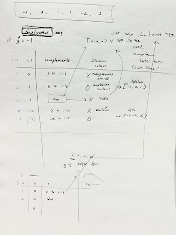

# 01/01

## LeetCode

- [3 Sums](https://leetcode.com/problems/3sum/description/)
- LinkedList 활용하는 [Add Two Sums](https://leetcode.com/problems/add-two-numbers/)와는 관련 없는 문제
- [brute force 풀이](https://github.com/codehumane/algorithm/commit/612f8e18159ed98e92937fe0c7a734c9cd7bb97f)
- [1차 풀이 - Time Limit Exceeded](https://github.com/codehumane/algorithm/commit/9c4aaad1b31f93cbabf4992969258d5bacbbe43c)
- [HashSet 이용한 풀이 - Accepted](https://github.com/codehumane/algorithm/commit/93ded48bf31328280972fe029e749bd2afa56e6d)
- [풀이에 나와 있는 2 pointers 풀이도 해 봄](https://github.com/codehumane/algorithm/commit/997ddbf50acf7a3a2da0e7858d325245d4e0a744)
- [마지막 정렬 없는 풀이](https://github.com/codehumane/algorithm/commit/946c64c44df960b292aa84c0a5ff56a5926aeb7f) - solution 아이디어 이해한 뒤에 직접 작성해 봄 어렵

# 01/02

## Software Architecture: The Hard Parts

- [9.3 공통 오너십](https://github.com/codehumane/what-i-learned/blob/master/book/sathp/README.md#93-%EA%B3%B5%ED%86%B5-%EC%98%A4%EB%84%88%EC%8B%AD)
- [9.4 공동 오너십](https://github.com/codehumane/what-i-learned/blob/master/book/sathp/README.md#94-%EA%B3%B5%EB%8F%99-%EC%98%A4%EB%84%88%EC%8B%AD)
  - [9.4.1 테이블 분할 기법](https://github.com/codehumane/what-i-learned/blob/master/book/sathp/README.md#941-%ED%85%8C%EC%9D%B4%EB%B8%94-%EB%B6%84%ED%95%A0-%EA%B8%B0%EB%B2%95)

# 01/03

## Software Architecture: The Hard Parts

- [9.4 공동 오너십](https://github.com/codehumane/what-i-learned/blob/master/book/sathp/README.md#94-%EA%B3%B5%EB%8F%99-%EC%98%A4%EB%84%88%EC%8B%AD) cont.
  - [9.4.2 데이터 도메인 기법](https://github.com/codehumane/what-i-learned/blob/master/book/sathp/README.md#942-%EB%8D%B0%EC%9D%B4%ED%84%B0-%EB%8F%84%EB%A9%94%EC%9D%B8-%EA%B8%B0%EB%B2%95)
  - [9.4.3 대리자 기법](https://github.com/codehumane/what-i-learned/blob/master/book/sathp/README.md#943-%EB%8C%80%EB%A6%AC%EC%9E%90-%EA%B8%B0%EB%B2%95)
- [9.5 서비스 통합 기법](https://github.com/codehumane/what-i-learned/blob/master/book/sathp/README.md#95-%EC%84%9C%EB%B9%84%EC%8A%A4-%ED%86%B5%ED%95%A9-%EA%B8%B0%EB%B2%95)
- [9.6 데이터 오너십 요약](https://github.com/codehumane/what-i-learned/blob/master/book/sathp/README.md#96-%EB%8D%B0%EC%9D%B4%ED%84%B0-%EC%98%A4%EB%84%88%EC%8B%AD-%EC%9A%94%EC%95%BD)

# 01/04

## Software Architecture: The Hard Parts

- [9.7 분산 트랜잭션](https://github.com/codehumane/what-i-learned/blob/master/book/sathp/README.md#97-%EB%B6%84%EC%82%B0-%ED%8A%B8%EB%9E%9C%EC%9E%AD%EC%85%98)

# 01/05

## Software Architecture: The Hard Parts

- [9.8 최종 일관성 패턴](https://github.com/codehumane/what-i-learned/blob/master/book/sathp/README.md#98-%EC%B5%9C%EC%A2%85-%EC%9D%BC%EA%B4%80%EC%84%B1-%ED%8C%A8%ED%84%B4)
  - [9.8.1 백그라운드 동기화 패턴](https://github.com/codehumane/what-i-learned/blob/master/book/sathp/README.md#981-%EB%B0%B1%EA%B7%B8%EB%9D%BC%EC%9A%B4%EB%93%9C-%EB%8F%99%EA%B8%B0%ED%99%94-%ED%8C%A8%ED%84%B4)
  - [9.8.2 오케스트레이티드 요청 기반 패턴](https://github.com/codehumane/what-i-learned/blob/master/book/sathp/README.md#982-%EC%98%A4%EC%BC%80%EC%8A%A4%ED%8A%B8%EB%A0%88%EC%9D%B4%ED%8B%B0%EB%93%9C-%EC%9A%94%EC%B2%AD-%EA%B8%B0%EB%B0%98-%ED%8C%A8%ED%84%B4)
  - [9.8.3 이벤트 기반 패턴](https://github.com/codehumane/what-i-learned/blob/master/book/sathp/README.md#983-%EC%9D%B4%EB%B2%A4%ED%8A%B8-%EA%B8%B0%EB%B0%98-%ED%8C%A8%ED%84%B4)

# 01/07

## Software Architecture: The Hard Parts

- [CH10. 분산 데이터 액세스](https://github.com/codehumane/what-i-learned/blob/master/book/sathp/README.md#ch10-%EB%B6%84%EC%82%B0-%EB%8D%B0%EC%9D%B4%ED%84%B0-%EC%95%A1%EC%84%B8%EC%8A%A4)
  - [10.1 서비스 간 통신 패턴](https://github.com/codehumane/what-i-learned/blob/master/book/sathp/README.md#101-%EC%84%9C%EB%B9%84%EC%8A%A4-%EA%B0%84-%ED%86%B5%EC%8B%A0-%ED%8C%A8%ED%84%B4)
  - [10.2 컬럼 스키마 복제 패턴](https://github.com/codehumane/what-i-learned/blob/master/book/sathp/README.md#102-%EC%BB%AC%EB%9F%BC-%EC%8A%A4%ED%82%A4%EB%A7%88-%EB%B3%B5%EC%A0%9C-%ED%8C%A8%ED%84%B4)
  - [10.3 복제 캐싱 패턴](https://github.com/codehumane/what-i-learned/blob/master/book/sathp/README.md#103-%EB%B3%B5%EC%A0%9C-%EC%BA%90%EC%8B%B1-%ED%8C%A8%ED%84%B4)
  - [10.4 데이터 도메인 패턴](https://github.com/codehumane/what-i-learned/blob/master/book/sathp/README.md#104-%EB%8D%B0%EC%9D%B4%ED%84%B0-%EB%8F%84%EB%A9%94%EC%9D%B8-%ED%8C%A8%ED%84%B4)
- [CH11. 분산 워크플로우 관리](https://github.com/codehumane/what-i-learned/blob/master/book/sathp/README.md#ch11-%EB%B6%84%EC%82%B0-%EC%9B%8C%ED%81%AC%ED%94%8C%EB%A1%9C-%EA%B4%80%EB%A6%AC)
  - [11.1 오케스트레이션 통신 스타일](https://github.com/codehumane/what-i-learned/blob/master/book/sathp/README.md#111-%EC%98%A4%EC%BC%80%EC%8A%A4%ED%8A%B8%EB%A0%88%EC%9D%B4%EC%85%98-%ED%86%B5%EC%8B%A0-%EC%8A%A4%ED%83%80%EC%9D%BC)
  - [11.2 코레오그래피 통신 스타일](https://github.com/codehumane/what-i-learned/blob/master/book/sathp/README.md#112-%EC%BD%94%EB%A0%88%EC%98%A4%EA%B7%B8%EB%9E%98%ED%94%BC-%ED%86%B5%EC%8B%A0-%EC%8A%A4%ED%83%80%EC%9D%BC)
    - [11.2.1 워크플로 상태 관리](https://github.com/codehumane/what-i-learned/blob/master/book/sathp/README.md#1121-%EC%9B%8C%ED%81%AC%ED%94%8C%EB%A1%9C-%EC%83%81%ED%83%9C-%EA%B4%80%EB%A6%AC)

# 01/08

## Software Architecture: The Hard Parts

- [CH11. 분산 워크플로우 관리](https://github.com/codehumane/what-i-learned/blob/master/book/sathp/README.md#ch11-%EB%B6%84%EC%82%B0-%EC%9B%8C%ED%81%AC%ED%94%8C%EB%A1%9C-%EA%B4%80%EB%A6%AC) cont.
  - [11.3 오케스트레이션과 코레오그래피의 트레이드오프](https://github.com/codehumane/what-i-learned/blob/master/book/sathp/README.md#113-%EC%98%A4%EC%BC%80%EC%8A%A4%ED%8A%B8%EB%A0%88%EC%9D%B4%EC%85%98%EA%B3%BC-%EC%BD%94%EB%A0%88%EC%98%A4%EA%B7%B8%EB%9E%98%ED%94%BC%EC%9D%98-%ED%8A%B8%EB%A0%88%EC%9D%B4%EB%93%9C%EC%98%A4%ED%94%84)
    - [11.3.1 상태 오너 및 커플링](https://github.com/codehumane/what-i-learned/blob/master/book/sathp/README.md#1131-%EC%83%81%ED%83%9C-%EC%98%A4%EB%84%88-%EB%B0%8F-%EC%BB%A4%ED%94%8C%EB%A7%81)
- [CH12. 트랜잭셔널 사가](https://github.com/codehumane/what-i-learned/blob/master/book/sathp/README.md#ch12-%ED%8A%B8%EB%9E%9C%EC%9E%AD%EC%85%94%EB%84%90-%EC%82%AC%EA%B0%80)
  - [12.1 트랜잭셔널 사가 패턴](https://github.com/codehumane/what-i-learned/blob/master/book/sathp/README.md#121-%ED%8A%B8%EB%9E%9C%EC%9E%AD%EC%85%94%EB%84%90-%EC%82%AC%EA%B0%80-%ED%8C%A8%ED%84%B4)
    - [12.1.1 SAO](https://github.com/codehumane/what-i-learned/blob/master/book/sathp/README.md#1211-sao)
    - [12.1.2 SAC](https://github.com/codehumane/what-i-learned/blob/master/book/sathp/README.md#1212-sac)
    - [12.1.3 SEO](https://github.com/codehumane/what-i-learned/blob/master/book/sathp/README.md#1213-seo)
    - [12.1.4 SEC](https://github.com/codehumane/what-i-learned/blob/master/book/sathp/README.md#1214-sec)
    - [12.1.5 AAO](https://github.com/codehumane/what-i-learned/blob/master/book/sathp/README.md#1215-aao)
    - [12.1.6 AAC](https://github.com/codehumane/what-i-learned/blob/master/book/sathp/README.md#1216-aac)
    - [12.1.7 AEO](https://github.com/codehumane/what-i-learned/blob/master/book/sathp/README.md#1217-aeo)
    - [12.1.8 AEC](https://github.com/codehumane/what-i-learned/blob/master/book/sathp/README.md#1218-aec)
  - [12.2 상태 관리와 최종 일관성](https://github.com/codehumane/what-i-learned/blob/master/book/sathp/README.md#122-%EC%83%81%ED%83%9C-%EA%B4%80%EB%A6%AC%EC%99%80-%EC%B5%9C%EC%A2%85-%EC%9D%BC%EA%B4%80%EC%84%B1)
    - [12.2.1 사가 상태 기계](https://github.com/codehumane/what-i-learned/blob/master/book/sathp/README.md#1221-%EC%82%AC%EA%B0%80-%EC%83%81%ED%83%9C-%EA%B8%B0%EA%B3%84)
  - [12.3 사가 관리 기법](https://github.com/codehumane/what-i-learned/blob/master/book/sathp/README.md#123-%EC%82%AC%EA%B0%80-%EA%B4%80%EB%A6%AC-%EA%B8%B0%EB%B2%95)

| 패턴       | SAO | SAC | SEO | SEC | AAO | AAC | AEO | AEC |
| --------- | --- | --- | --- | --- | --- | --- | --- | --- |
| 결합도      | 5   | 4   | 4   | 3   | 4   | 3   | 2   | 1   |
| 복잡도      | 2   | 4   | 1   | 2   | 4   | 5   | 2   | 4   |
| 응답성/가용성 | 2   | 2   | 3   | 3   | 2   | 2   | 4   | 4   |
| 확장성/탄력성 | 1   | 2   | 4   | 4   | 2   | 3   | 4   | 5   |

- [CH13. 계약](https://github.com/codehumane/what-i-learned/blob/master/book/sathp/README.md#ch13-%EA%B3%84%EC%95%BD)
  - [13.1 엄격한 계약 vs. 느슨한 계약](https://github.com/codehumane/what-i-learned/blob/master/book/sathp/README.md#131-%EC%97%84%EA%B2%A9%ED%95%9C-%EA%B3%84%EC%95%BD-vs-%EB%8A%90%EC%8A%A8%ED%95%9C-%EA%B3%84%EC%95%BD)
    - [13.1.1 엄격한 계약과 느슨한 계약의 트레이드오프](https://github.com/codehumane/what-i-learned/blob/master/book/sathp/README.md#1311-%EC%97%84%EA%B2%A9%ED%95%9C-%EA%B3%84%EC%95%BD%EA%B3%BC-%EB%8A%90%EC%8A%A8%ED%95%9C-%EA%B3%84%EC%95%BD%EC%9D%98-%ED%8A%B8%EB%A0%88%EC%9D%B4%EB%93%9C%EC%98%A4%ED%94%84)
    - [13.1.2 마이크로서비스에서의 계약](https://github.com/codehumane/what-i-learned/blob/master/book/sathp/README.md#1312-%EB%A7%88%EC%9D%B4%ED%81%AC%EB%A1%9C%EC%84%9C%EB%B9%84%EC%8A%A4%EC%97%90%EC%84%9C%EC%9D%98-%EA%B3%84%EC%95%BD)
  - [13.2 스탬프 커플링](https://github.com/codehumane/what-i-learned/blob/master/book/sathp/README.md#132-%EC%8A%A4%ED%83%AC%ED%94%84-%EC%BB%A4%ED%94%8C%EB%A7%81)
- [CH14. 분석 데이터 관리](https://github.com/codehumane/what-i-learned/blob/master/book/sathp/README.md#ch14-%EB%B6%84%EC%84%9D-%EB%8D%B0%EC%9D%B4%ED%84%B0-%EA%B4%80%EB%A6%AC)
  - [14.1 예전 접근 방법](https://github.com/codehumane/what-i-learned/blob/master/book/sathp/README.md#141-%EC%98%88%EC%A0%84-%EC%A0%91%EA%B7%BC-%EB%B0%A9%EB%B2%95)
  - [14.2 데이터 메시](https://github.com/codehumane/what-i-learned/blob/master/book/sathp/README.md#142-%EB%8D%B0%EC%9D%B4%ED%84%B0-%EB%A9%94%EC%8B%9C)

SATHP 정리 끝.

# 01/20

## Clean Coder

원서로 다시 읽기 시작.

- [CH1. Professionalism](https://github.com/codehumane/what-i-learned/blob/master/book/clean-coder/README-en.md#ch1-professionalism)
  - [Be Careful What You Ask For](https://github.com/codehumane/what-i-learned/blob/master/book/clean-coder/README-en.md#be-careful-what-you-ask-for)
  - [Taking Responsibility](https://github.com/codehumane/what-i-learned/blob/master/book/clean-coder/README-en.md#taking-responsibility)
  - [First, Do No Harm](https://github.com/codehumane/what-i-learned/blob/master/book/clean-coder/README-en.md#first-do-no-harm)
    - [Do No Harm to Function](https://github.com/codehumane/what-i-learned/blob/master/book/clean-coder/README-en.md#do-no-harm-to-function)
    - [QA Should Find Nothing](https://github.com/codehumane/what-i-learned/blob/master/book/clean-coder/README-en.md#qa-should-find-nothing)
    - [You Must Know It Works](https://github.com/codehumane/what-i-learned/blob/master/book/clean-coder/README-en.md#you-must-know-it-works)
    - [Automated QA](https://github.com/codehumane/what-i-learned/blob/master/book/clean-coder/README-en.md#automated-qa)
    - [Do No Harm to Structure](https://github.com/codehumane/what-i-learned/blob/master/book/clean-coder/README-en.md#do-no-harm-to-structure)

# 01/21

## Clean Coder

- [CH1. Professionalism](https://github.com/codehumane/what-i-learned/blob/master/book/clean-coder/README-en.md#ch1-professionalism) cont.
  - [Work Ethic](https://github.com/codehumane/what-i-learned/blob/master/book/clean-coder/README-en.md#work-ethic)
    - [Know Your field](https://github.com/codehumane/what-i-learned/blob/master/book/clean-coder/README-en.md#know-your-field)
    - [Continuous Learning](https://github.com/codehumane/what-i-learned/blob/master/book/clean-coder/README-en.md#continuous-learning)
    - [Practice](https://github.com/codehumane/what-i-learned/blob/master/book/clean-coder/README-en.md#practice)
    - [Collaboration](https://github.com/codehumane/what-i-learned/blob/master/book/clean-coder/README-en.md#collaboration)
    - [Mentoring](https://github.com/codehumane/what-i-learned/blob/master/book/clean-coder/README-en.md#mentoring)
    - [Know Your Domain](https://github.com/codehumane/what-i-learned/blob/master/book/clean-coder/README-en.md#know-your-domain)
    - [Identify with Your Employer/Customer](https://github.com/codehumane/what-i-learned/blob/master/book/clean-coder/README-en.md#identify-with-your-employercustomer)
    - [Humility](https://github.com/codehumane/what-i-learned/blob/master/book/clean-coder/README-en.md#humility)

# 01/22

## Clean Coder

- [CH2. Saying No](https://github.com/codehumane/what-i-learned/blob/master/book/clean-coder/README-en.md#ch2-saying-no)
  - [Adversarial Roles](https://github.com/codehumane/what-i-learned/blob/master/book/clean-coder/README-en.md#adversarial-roles)

# 01/23

## Clean Coder

- [CH2. Saying No](https://github.com/codehumane/what-i-learned/blob/master/book/clean-coder/README-en.md#ch2-saying-no) cont.
  - [Adversarial Roles](https://github.com/codehumane/what-i-learned/blob/master/book/clean-coder/README-en.md#adversarial-roles) cont.
    - [What about the Why?](https://github.com/codehumane/what-i-learned/blob/master/book/clean-coder/README-en.md#what-about-the-why)
  - [High Stakes](https://github.com/codehumane/what-i-learned/blob/master/book/clean-coder/README-en.md#high-stakes)
  - [Being a "Team Player"](https://github.com/codehumane/what-i-learned/blob/master/book/clean-coder/README-en.md#being-a-team-player)
    - [Trying](https://github.com/codehumane/what-i-learned/blob/master/book/clean-coder/README-en.md#trying)
    - [Passive Aggression](https://github.com/codehumane/what-i-learned/blob/master/book/clean-coder/README-en.md#passive-aggression)
  - [The Cost of Saying Yes](https://github.com/codehumane/what-i-learned/blob/master/book/clean-coder/README-en.md#the-cost-of-saying-yes)

# 01/24

## Clean Coder

이전에 읽을 때는 2장이 인상 깊었는데, 이번엔 3장이 더 인상 깊었음.

- [CH3. Saying Yes](https://github.com/codehumane/what-i-learned/blob/master/book/clean-coder/README-en.md#ch3-saying-yes)
  - [A Language of Commitment](https://github.com/codehumane/what-i-learned/blob/master/book/clean-coder/README-en.md#a-language-of-commitment)
    - [Recognizing Lack of Commitment](https://github.com/codehumane/what-i-learned/blob/master/book/clean-coder/README-en.md#recognizing-lack-of-commitment)
    - [What Does Commitment Sound Like?](https://github.com/codehumane/what-i-learned/blob/master/book/clean-coder/README-en.md#what-does-commitment-sound-like)
  - [Learning How to Say "Yes"](https://github.com/codehumane/what-i-learned/blob/master/book/clean-coder/README-en.md#learning-how-to-say-yes)
    - [The Other Side of "Try"](https://github.com/codehumane/what-i-learned/blob/master/book/clean-coder/README-en.md#the-other-side-of-try)
    - [Committing with Discipline](https://github.com/codehumane/what-i-learned/blob/master/book/clean-coder/README-en.md#committing-with-discipline)

> Professionals are not required to say yes to everything that is asked of them. However, they should work hard to find creative ways to make “yes” possible. When professionals say yes, they use the language of commitment so that there is no doubt about what they’ve promised.

- [CH4. Coding](https://github.com/codehumane/what-i-learned/blob/master/book/clean-coder/README-en.md#ch4-coding)
  - [Preparedness](https://github.com/codehumane/what-i-learned/blob/master/book/clean-coder/README-en.md#preparedness)

# 01/27

## Clean Coder

- [CH4. Coding](https://github.com/codehumane/what-i-learned/blob/master/book/clean-coder/README-en.md#ch4-coding) cont.
  - [Preparedness](https://github.com/codehumane/what-i-learned/blob/master/book/clean-coder/README-en.md#preparedness) cont.
    - [3 Am Code](https://github.com/codehumane/what-i-learned/blob/master/book/clean-coder/README-en.md#3-am-code)
    - [Worry Code](https://github.com/codehumane/what-i-learned/blob/master/book/clean-coder/README-en.md#worry-code)
  - [The Flow Zone](https://github.com/codehumane/what-i-learned/blob/master/book/clean-coder/README-en.md#the-flow-zone)
    - [Music](https://github.com/codehumane/what-i-learned/blob/master/book/clean-coder/README-en.md#music)
    - [Interruptions](https://github.com/codehumane/what-i-learned/blob/master/book/clean-coder/README-en.md#interruptions)

# 01/28

## Clean Coder

- [CH4. Coding](https://github.com/codehumane/what-i-learned/blob/master/book/clean-coder/README-en.md#ch4-coding) cont.
  - [Being Late](https://github.com/codehumane/what-i-learned/blob/master/book/clean-coder/README-en.md#being-late)
    - [Hope](https://github.com/codehumane/what-i-learned/blob/master/book/clean-coder/README-en.md#hope)
    - [Rushing](https://github.com/codehumane/what-i-learned/blob/master/book/clean-coder/README-en.md#rushing)
    - [Overtime](https://github.com/codehumane/what-i-learned/blob/master/book/clean-coder/README-en.md#overtime)
    - [False Delivery](https://github.com/codehumane/what-i-learned/blob/master/book/clean-coder/README-en.md#false-delivery)
    - [Define "Done"](https://github.com/codehumane/what-i-learned/blob/master/book/clean-coder/README-en.md#define-done)
  - [Help](https://github.com/codehumane/what-i-learned/blob/master/book/clean-coder/README-en.md#help)
    - [Helping Others](https://github.com/codehumane/what-i-learned/blob/master/book/clean-coder/README-en.md#helping-others)
    - [Being Helped](https://github.com/codehumane/what-i-learned/blob/master/book/clean-coder/README-en.md#being-helped)
    - [Mentoring](https://github.com/codehumane/what-i-learned/blob/master/book/clean-coder/README-en.md#mentoring-1)
- [CH6. Practicing](https://github.com/codehumane/what-i-learned/blob/master/book/clean-coder/README-en.md#ch6-practicing)
  - [Some Background on Practicing](https://github.com/codehumane/what-i-learned/blob/master/book/clean-coder/README-en.md#some-background-on-practicing)
    - [Twenty-Two Zeros](https://github.com/codehumane/what-i-learned/blob/master/book/clean-coder/README-en.md#twenty-two-zeros)
    - [Turnaround Time](https://github.com/codehumane/what-i-learned/blob/master/book/clean-coder/README-en.md#turnaround-time)

# 01/29

## Clean Coder

- [CH6. Practicing](https://github.com/codehumane/what-i-learned/blob/master/book/clean-coder/README-en.md#ch6-practicing) cont.
  - [The Coding Dojo](https://github.com/codehumane/what-i-learned/blob/master/book/clean-coder/README-en.md#the-coding-dojo)
    - [Kata](https://github.com/codehumane/what-i-learned/blob/master/book/clean-coder/README-en.md#kata)
    - [Wasa](https://github.com/codehumane/what-i-learned/blob/master/book/clean-coder/README-en.md#wasa)
    - [Randori](https://github.com/codehumane/what-i-learned/blob/master/book/clean-coder/README-en.md#randori)
  - [Broadening Your Experience](https://github.com/codehumane/what-i-learned/blob/master/book/clean-coder/README-en.md#broadening-your-experience)
    - [Open Source](https://github.com/codehumane/what-i-learned/blob/master/book/clean-coder/README-en.md#open-source)
    - [Practice Ethics](https://github.com/codehumane/what-i-learned/blob/master/book/clean-coder/README-en.md#practice-ethics)
- [CH9. Time Management](https://github.com/codehumane/what-i-learned/blob/master/book/clean-coder/README-en.md#ch9-time-management)
  - [Meetings](https://github.com/codehumane/what-i-learned/blob/master/book/clean-coder/README-en.md#meetings)
    - [Declining](https://github.com/codehumane/what-i-learned/blob/master/book/clean-coder/README-en.md#declining)
    - [Leaving](https://github.com/codehumane/what-i-learned/blob/master/book/clean-coder/README-en.md#leaving)
    - [Have an Agenda and a Goal](https://github.com/codehumane/what-i-learned/blob/master/book/clean-coder/README-en.md#have-an-agenda-and-a-goal)
    - [Arguments/Disagreements](https://github.com/codehumane/what-i-learned/blob/master/book/clean-coder/README-en.md#argumentsdisagreements)

## LeetCode

- [Container With Most Water](https://leetcode.com/problems/container-with-most-water/description/)
- [2 포인터로 작성](https://github.com/codehumane/algorithm/commit/a124d51be38f780b4db18a5de409bee1d7493402)했는데 솔루션에 나온 방법은 brute force 외에 이게 유일.
- 이전에 풀었던 [TrappingRainWater](https://github.com/codehumane/algorithm/blob/4d92a63b6eb7b50ff0cd41a116ff443080816fc0/src/main/java/quiz/etc/TrappingRainWater.java)랑 매우 유사.

# 01/30

## Clean Coder

- [CH9. Time Management](https://github.com/codehumane/what-i-learned/blob/master/book/clean-coder/README-en.md#ch9-time-management) cont.
  - [Focus-Manna](https://github.com/codehumane/what-i-learned/blob/master/book/clean-coder/README-en.md#focus-manna)
  - [Time Booxking and Tomatoes](https://github.com/codehumane/what-i-learned/blob/master/book/clean-coder/README-en.md#time-boxing-and-tomatoes)
  - [Avoidance](https://github.com/codehumane/what-i-learned/blob/master/book/clean-coder/README-en.md#avoidance)
    - [Priority Inversion](https://github.com/codehumane/what-i-learned/blob/master/book/clean-coder/README-en.md#priority-inversion)
  - [Blind Alleys](https://github.com/codehumane/what-i-learned/blob/master/book/clean-coder/README-en.md#blind-alleys)
  - [Marshes, Bogs, Swamps, and Other Messes](https://github.com/codehumane/what-i-learned/blob/master/book/clean-coder/README-en.md#marshes-bogs-swamps-and-other-messes)

# 02/01

## Clean Coder

[CH10. Estimation](https://github.com/codehumane/what-i-learned/blob/master/book/clean-coder/README-en.md#ch10-estimation)

- [What Is an Estimate?](https://github.com/codehumane/what-i-learned/blob/master/book/clean-coder/README-en.md#what-is-an-estimate)
  - [A Commitment](https://github.com/codehumane/what-i-learned/blob/master/book/clean-coder/README-en.md#a-commitment)
  - [An Estimate](https://github.com/codehumane/what-i-learned/blob/master/book/clean-coder/README-en.md#an-estimate)
  - [Implied Commitments](https://github.com/codehumane/what-i-learned/blob/master/book/clean-coder/README-en.md#implied-commitments)

# 02/04

## Clean Coder

[CH10. Estimation](https://github.com/codehumane/what-i-learned/blob/master/book/clean-coder/README-en.md#ch10-estimation) cont.

- [PERT](https://github.com/codehumane/what-i-learned/blob/master/book/clean-coder/README-en.md#pert)
- [Estimating Tasks](https://github.com/codehumane/what-i-learned/blob/master/book/clean-coder/README-en.md#estimating-tasks)
  - [Wideband Delphi](https://github.com/codehumane/what-i-learned/blob/master/book/clean-coder/README-en.md#wideband-delphi)
  - [Flying Fingers](https://github.com/codehumane/what-i-learned/blob/master/book/clean-coder/README-en.md#flying-fingers)
  - [Planning Poker](https://github.com/codehumane/what-i-learned/blob/master/book/clean-coder/README-en.md#planning-poker)
  - [Affinity Estimation](https://github.com/codehumane/what-i-learned/blob/master/book/clean-coder/README-en.md#affinity-estimation)
  - [Trivariate Estimates](https://github.com/codehumane/what-i-learned/blob/master/book/clean-coder/README-en.md#trivariate-estimates)
- [The Law of Large Numbers](https://github.com/codehumane/what-i-learned/blob/master/book/clean-coder/README-en.md#the-law-of-large-numbers)

# 02/05

## Clean Coder

[CH11. Pressure](https://github.com/codehumane/what-i-learned/blob/master/book/clean-coder/README-en.md#ch11-pressure)

- [Avoiding Pressure](https://github.com/codehumane/what-i-learned/blob/master/book/clean-coder/README-en.md#avoiding-pressure)
  - [Commitments](https://github.com/codehumane/what-i-learned/blob/master/book/clean-coder/README-en.md#commitments)
  - [Staying Clean](https://github.com/codehumane/what-i-learned/blob/master/book/clean-coder/README-en.md#staying-clean)
  - [Crisis Discipline](https://github.com/codehumane/what-i-learned/blob/master/book/clean-coder/README-en.md#crisis-discipline)
- [Handling Pressure](https://github.com/codehumane/what-i-learned/blob/master/book/clean-coder/README-en.md#handling-pressure)
  - [Don't Panic](https://github.com/codehumane/what-i-learned/blob/master/book/clean-coder/README-en.md#dont-panic)
  - [Communicate](https://github.com/codehumane/what-i-learned/blob/master/book/clean-coder/README-en.md#communicate)
  - [Rely on Your Disciplines](https://github.com/codehumane/what-i-learned/blob/master/book/clean-coder/README-en.md#rely-on-your-disciplines)
  - [Get Help](https://github.com/codehumane/what-i-learned/blob/master/book/clean-coder/README-en.md#get-help)

[CH12. Collaboration](https://github.com/codehumane/what-i-learned/blob/master/book/clean-coder/README-en.md#ch12-collaboration)

- [Programmers versus People](https://github.com/codehumane/what-i-learned/blob/master/book/clean-coder/README-en.md#programmers-versus-people)
  - [Programmers versus Employers](https://github.com/codehumane/what-i-learned/blob/master/book/clean-coder/README-en.md#programmers-versus-employers)
  - [Owned Code](https://github.com/codehumane/what-i-learned/blob/master/book/clean-coder/README-en.md#owned-code)
  - [Collective Ownership](https://github.com/codehumane/what-i-learned/blob/master/book/clean-coder/README-en.md#collective-ownership)
  - [Pairing](https://github.com/codehumane/what-i-learned/blob/master/book/clean-coder/README-en.md#pairing)
- [Cerebellums](https://github.com/codehumane/what-i-learned/blob/master/book/clean-coder/README-en.md#cerebellums)

# 02/07

## Clean Coder

[CH13. Teams and Projects](https://github.com/codehumane/what-i-learned/blob/master/book/clean-coder/README-en.md#ch13-teams-and-projects)

- [Does It Blend?](https://github.com/codehumane/what-i-learned/blob/master/book/clean-coder/README-en.md#does-it-blend)
  - [The Gelled Team](https://github.com/codehumane/what-i-learned/blob/master/book/clean-coder/README-en.md#the-gelled-team)
  - [Which Came First, the Team or the Project?](https://github.com/codehumane/what-i-learned/blob/master/book/clean-coder/README-en.md#which-came-first-the-team-or-the-project)
  - [But How Do You Manage That?](https://github.com/codehumane/what-i-learned/blob/master/book/clean-coder/README-en.md#but-how-do-you-manage-that)
  - [The Project Owner Dilemma](https://github.com/codehumane/what-i-learned/blob/master/book/clean-coder/README-en.md#the-project-owner-dilemma)

# 02/08

## Clean Coder

- [CH14. Mentoring, Apprenticeship, and Craftsmanship](https://github.com/codehumane/what-i-learned/blob/master/book/clean-coder/README-en.md#ch14-mentoring-apprenticeship-and-craftsmanship)
- 마지막은 별 내용이 없음.
- 클린 코더 원서로 다시 읽기 끝.

# 02/19

## LeetCode

- [17. Letter Combinations of a Phone Number](https://leetcode.com/problems/letter-combinations-of-a-phone-number/description/)
- [풀이는 간단](https://github.com/codehumane/algorithm/commit/e7ccc975486c72ebb41f85532e87a91af49cbdff)

# 02/25

## LeetCode

- [19. Remove Nth Node From End of List](https://leetcode.com/problems/remove-nth-node-from-end-of-list/description/)
- [이번 문제 풀이도 간단](https://github.com/codehumane/algorithm/commit/a0f185c11fdab8c7b261ed04c1f6c7c289190f4b)

# 02/26

## LeetCode

- [12. Integer to Roman](https://leetcode.com/problems/integer-to-roman/description/)
- [1부터 시작해서 14까지 하나씩 TDD로 먼저 구현 후, subtraction 케이스를 마지막에 TDD로 진행한 결과물](https://github.com/codehumane/algorithm/commit/880f638fe42c0275c94a1e5211beb2bcd818e24b)
- 문제가 어렵지 않아 위 방식으로 구현해도 문제 없던 것 아니었을까 싶음.

# 03/01

## LeetCode

- [18. 4Sum](https://leetcode.com/problems/4sum/description/)
- [2 포인터를 이용한 풀이](https://github.com/codehumane/algorithm/commit/078b104813d3efd9c07190341caaddca2cf06832)
- [3Sum 문제](https://github.com/codehumane/algorithm/blob/master/src/main/java/quiz/math/ThreeSum.java)와 다른 점이 있었던 건지 다시 살펴볼 것.

# 03/18

## LeetCode

- [24. Swap Nodes in Pairs](https://leetcode.com/problems/swap-nodes-in-pairs/description/)
- [1차 풀이](https://github.com/codehumane/algorithm/commit/0e7adae8a1f83ee036d287994fbd11997765e249)
- [코드 라인수도 줄이고, 일반적인 사람들에게 읽히기 쉬운 구조라 생각되는 구현으로 변경](https://github.com/codehumane/algorithm/commit/f53a72421422a6a6813f19abc7067d691cad0fe0)
