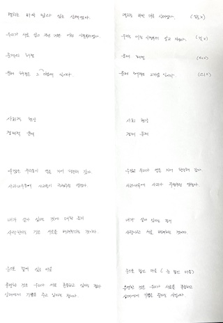

2024년 시작.

# 01/01

## 우리는 왜 숫자에 속을까

### 8장. 인공지능은 모든 걸 알고 있다

독일 내무부는 아래 2가지 숫자 때문에, 안면 인식 시스템에 열광하게 됨.

1. 적중률: 80
2. 오경보율: 0.1

위험 인물 100명 중 80명을 올바르게 인식하고, 1,000명 중 1명만 위험인물로 잘못 간주한다는 것. 이렇게만 보면 매우 우수한 시스템처럼 보임.

그런데 일단 사소한 문제 3가지가 있음.

1. 일단, 테스트에 사용된 시스템은 3개인데, 세 시스템 중 하나라도 위험인물을 맞추면 적중률에 포함함.
2. 또한, 테스트는 총 2회에 걸쳐 이뤄졌는데, 2회차에서는 고화질 카메라로 찍은 사진을 사용해 적중률이 훨씬 높아짐.
3. 그리고, 수집한 모든 데이터가 아닌 일부 데이터를 취사선택해 적중률을 계산하고, 선택의 기준도 명시하지 않음.

그리고 근본적 문제는 오경보에 있음.

빈도 수형도를 그려 보면 문제가 드러남.

1. 역 이용자가 1,200만명이라고 할 때, 1.2만명이 수배자로 잘못 지정(오경보율 0.1퍼센트).
2. 카메라가 위험인물로 인식한 사람이 정말로 위험할 확률은 0.7퍼센트(= 80 / 12,080).
3. 즉, 99.3%는 잘못된 경보인 가짜 양성.
4. 하루에도 1.2만 번의 가짜 알림이 울림. 엄청난 비용.

가짜 양성 비율과 양성 예측도를 구분하지 못하면, 0.1%라는 오경보율을 보고 99.9%의 경우 시스템이 올바른 분류를 한다고 착각하게 됨.

1. 가짜 양성 비율: 위험인물이 아닌 사람 중 얼마나 많은 사람이 위험인물로 잘못 분류되나? -> 0.1%
2. 양성 예측도: 시스템이 위험인물로 분류한 사람이 실제로 위험인물일 확률은 얼마나 높은가? -> 1%

# 01/07

## Multi-Cloud Strategy for Cloud Architects - 2E

- [CH1. Introduction to Multi-Cloud](https://github.com/codehumane/what-i-learned/blob/master/book/mcsfca-2e/README.md#ch1-introduction-to-multi-cloud)
  - [Gathering requirements for multi-cloud](https://github.com/codehumane/what-i-learned/blob/master/book/mcsfca-2e/README.md#gathering-requirements-for-multi-cloud)
    - [Using TOGAF for requirements management](https://github.com/codehumane/what-i-learned/blob/master/book/mcsfca-2e/README.md#using-togaf-for-requirements-management)
- [CH4. Service Designs for Multi-Cloud](https://github.com/codehumane/what-i-learned/blob/master/book/mcsfca-2e/README.md#ch4-service-designs-for-multi-cloud)
  - [Introducing the scaffold for multi-cloud environments](https://github.com/codehumane/what-i-learned/blob/master/book/mcsfca-2e/README.md#introducing-the-scaffold-for-multi-cloud-environments)
  - [Working with Well-Architected Frameworks](https://github.com/codehumane/what-i-learned/blob/master/book/mcsfca-2e/README.md#working-with-well-architected-frameworks)

# 01/21

## 코틀린 코루틴

- [9장. 취소](https://github.com/codehumane/what-i-learned/blob/master/book/kotlin-coroutines/README.md#9%EC%9E%A5-%EC%B7%A8%EC%86%8C)
  - [기본적인 취소](https://github.com/codehumane/what-i-learned/blob/master/book/kotlin-coroutines/README.md#%EA%B8%B0%EB%B3%B8%EC%A0%81%EC%9D%B8-%EC%B7%A8%EC%86%8C)
  - [취소는 어떻게 동작하는가](https://github.com/codehumane/what-i-learned/blob/master/book/kotlin-coroutines/README.md#%EC%B7%A8%EC%86%8C%EB%8A%94-%EC%96%B4%EB%96%BB%EA%B2%8C-%EC%9E%91%EB%8F%99%ED%95%98%EB%8A%94%EA%B0%80)
  - [취소 중 코루틴을 한 번 더 호출하기](https://github.com/codehumane/what-i-learned/blob/master/book/kotlin-coroutines/README.md#%EC%B7%A8%EC%86%8C-%EC%A4%91-%EC%BD%94%EB%A3%A8%ED%8B%B4%EC%9D%84-%ED%95%9C-%EB%B2%88-%EB%8D%94-%ED%98%B8%EC%B6%9C%ED%95%98%EA%B8%B0)
  - [invokeOnCompletion](https://github.com/codehumane/what-i-learned/blob/master/book/kotlin-coroutines/README.md#invokeoncompletion)
  - [중단될 수 없는 걸 중단하기](https://github.com/codehumane/what-i-learned/blob/master/book/kotlin-coroutines/README.md#%EC%A4%91%EB%8B%A8%EB%90%A0-%EC%88%98-%EC%97%86%EB%8A%94-%EA%B1%B8-%EC%A4%91%EB%8B%A8%ED%95%98%EA%B8%B0)
  - [suspendCancellableCoroutine](https://github.com/codehumane/what-i-learned/blob/master/book/kotlin-coroutines/README.md#suspendcancellablecoroutine)
- [10장. 예외 처리](https://github.com/codehumane/what-i-learned/blob/master/book/kotlin-coroutines/README.md#10%EC%9E%A5-%EC%98%88%EC%99%B8-%EC%B2%98%EB%A6%AC)
  - [코루틴 종료 멈추기](https://github.com/codehumane/what-i-learned/blob/master/book/kotlin-coroutines/README.md#%EC%BD%94%EB%A3%A8%ED%8B%B4-%EC%A2%85%EB%A3%8C-%EB%A9%88%EC%B6%94%EA%B8%B0)
    - [SupervisorJob](https://github.com/codehumane/what-i-learned/blob/master/book/kotlin-coroutines/README.md#supervisorjob)
    - [SupervisorScope](https://github.com/codehumane/what-i-learned/blob/master/book/kotlin-coroutines/README.md#supervisorscope)
  - [await](https://github.com/codehumane/what-i-learned/blob/master/book/kotlin-coroutines/README.md#await)
  - [CancellationException은 부모까지 전파되지 않는다](https://github.com/codehumane/what-i-learned/blob/master/book/kotlin-coroutines/README.md#cancellationexception%EC%9D%80-%EB%B6%80%EB%AA%A8%EA%B9%8C%EC%A7%80-%EC%A0%84%ED%8C%8C%EB%90%98%EC%A7%80-%EC%95%8A%EB%8A%94%EB%8B%A4)
  - [코루틴 예외 핸들러](https://github.com/codehumane/what-i-learned/blob/master/book/kotlin-coroutines/README.md#%EC%BD%94%EB%A3%A8%ED%8B%B4-%EC%98%88%EC%99%B8-%ED%95%B8%EB%93%A4%EB%9F%AC)

# 01/28

## 코틀린 코루틴

- [11장. 코루틴 스코프 함수](https://github.com/codehumane/what-i-learned/blob/master/book/kotlin-coroutines/README.md#11%EC%9E%A5-%EC%BD%94%EB%A3%A8%ED%8B%B4-%EC%8A%A4%EC%BD%94%ED%94%84-%ED%95%A8%EC%88%98)
  - [코루틴 스코프 함수가 소개되기 전에 사용한 방법들](https://github.com/codehumane/what-i-learned/blob/master/book/kotlin-coroutines/README.md#%EC%BD%94%EB%A3%A8%ED%8B%B4-%EC%8A%A4%EC%BD%94%ED%94%84-%ED%95%A8%EC%88%98%EA%B0%80-%EC%86%8C%EA%B0%9C%EB%90%98%EA%B8%B0-%EC%A0%84%EC%97%90-%EC%82%AC%EC%9A%A9%ED%95%9C-%EB%B0%A9%EB%B2%95%EB%93%A4)
  - [coroutineScope](https://github.com/codehumane/what-i-learned/blob/master/book/kotlin-coroutines/README.md#coroutinescope)
  - [코루틴 스코프 함수](https://github.com/codehumane/what-i-learned/blob/master/book/kotlin-coroutines/README.md#%EC%BD%94%EB%A3%A8%ED%8B%B4-%EC%8A%A4%EC%BD%94%ED%94%84-%ED%95%A8%EC%88%98)
  - [추가적인 연산](https://github.com/codehumane/what-i-learned/blob/master/book/kotlin-coroutines/README.md#%EC%B6%94%EA%B0%80%EC%A0%81%EC%9D%B8-%EC%97%B0%EC%82%B0)

# 02/04

## 코틀린 코루틴

- [1장. 코틀린 코루틴을 배워야 하는 이유](https://github.com/codehumane/what-i-learned/blob/master/book/kotlin-coroutines/README.md#1%EC%9E%A5-%EC%BD%94%ED%8B%80%EB%A6%B0-%EC%BD%94%EB%A3%A8%ED%8B%B4%EC%9D%84-%EB%B0%B0%EC%9B%8C%EC%95%BC-%ED%95%98%EB%8A%94-%EC%9D%B4%EC%9C%A0)
  - [안드로이드(그리고 다른 프론트엔드 플랫폼)에서의 코루틴 사용](https://github.com/codehumane/what-i-learned/blob/master/book/kotlin-coroutines/README.md#%EC%95%88%EB%93%9C%EB%A1%9C%EC%9D%B4%EB%93%9C%EA%B7%B8%EB%A6%AC%EA%B3%A0-%EB%8B%A4%EB%A5%B8-%ED%94%84%EB%A1%A0%ED%8A%B8%EC%97%94%EB%93%9C-%ED%94%8C%EB%9E%AB%ED%8F%BC%EC%97%90%EC%84%9C%EC%9D%98-%EC%BD%94%EB%A3%A8%ED%8B%B4-%EC%82%AC%EC%9A%A9)
  - [백엔드에서의 코루틴 사용](https://github.com/codehumane/what-i-learned/blob/master/book/kotlin-coroutines/README.md#%EB%B0%B1%EC%97%94%EB%93%9C%EC%97%90%EC%84%9C%EC%9D%98-%EC%BD%94%EB%A3%A8%ED%8B%B4-%EC%82%AC%EC%9A%A9)

# 02/12

## 틀리지 않는 법

15장. 골턴의 타원

- 우연의 영향을 받을 때면 언제든 평균으로 회귀.
- 이 힘은 유전의 영향에 비해 얼마나 강할까?
- 산포도를 구했더니 타원이고 그게 골턴의 타원.
- 타원에는 가늘기가 존재하고 이를 타원의 이심률이라 부름.
- 이심률이 크면 회귀가 미약, 이심률이 적으면 평균으로의 회귀가 압도.
- 상관계수도 골턴이 언급한 거라고 함.
- 그리고 상관계수는 두 벡터 사이 각도의 코사인.
- 각도가 둔각이면 서로 관계가 없음.
- 그래서 아무 관련이 없을 때 수직 혹은 직교한다고 표현.
- 한편, 상관관계는 추이적이지 않음.
- 3개의 벡터 그림으로 이를 입증.
- 상관관계는 오히려 혈연관계와 더 비슷.
- 나는 아들과 혈연관계, 아들은 내 아내와 혈연관계, 하지만 아내와 나는 혈연관계가 아님.
- 세 투자자들의 포트폴리오로도 상관관계가 추이적이지 않음을 설명.
- 마지막으로 상관관계는 선형적 관계만 감지할 수 있다는 한계점도 지적.
- 모든 관계가 선형적 관계는 아님. 그래서 상관관계 없어도 연관성이 없는 건 아님.
- 투표자들이 정보가 많을수록 좌파와 우파가 좀 더 극단으로 쏠리는 하트 모양 그래프가 그 예.

# 02/13

## 틀리지 않는 법

16장. 폐암이 담배를 피우도록 만들까?

- 회귀에서 시작해, 골턴의 타원과 상관관계를 지나, 마지막 벅슨의 오류 이야기.
- 어느 두 대상이 상관관계가 있어 보이지만, 사실은 두 대상 모두 참인 경우나 거짓인 경우의 데이터를 고려하지 않기 때문인 상황.
- [여기](https://en.wikipedia.org/wiki/Berkson%27s_paradox)에 나온 아래 그림이 이를 잘 설명함.

# 03/02

## 씽킹 101

### 1장. 유창함이 일으키는 착각

일과도 관련 높다 생각해서 기록. 먼저, 유창성에 대해.

- 책에서는 유창성 효과, 유창성 착각illusion of fluency 용어로 계속 소개.
- 머릿속으로 과정이 잘 그려지면, 나도 잘할 수 있을 것 같은 과신에 빠져드는 것.
- 테드 강연을 보면 길이가 짧다 보니 쉽게 준비할 수 있을 거라 생각.
- 하지만, 테드 스타일 강연 지침에 따르면, 강연 1분에 최소 1시간 리허설이 필요하다고 함.
- 그리고 이 대본을 만들고 검토하고 수정하는 시간은 또 별개.

과신에 빠지는 이유.

- 이런 과신에 빠지는 건, 뇌의 메타 인지 과정에서 비롯.
- 무엇을 아는지를 기반으로, 무엇을 피할지 무엇을 추구할지 등을 판단.
- 예컨대, '고정 금리 모기지'를 모른 채 계약서에 서명하지 않음.
- 일반적으로는 매우 도움 되는 휴리스틱.

해결책도 이야기.

- 먼저, 실제로 시도해 보기.
- 사람들 앞에 나서기 전 혼자 PT 발표를 해보면 됨.
- 다른 사람 초대에 앞서 달걀찜을 미리 한 번 만들어 보면 됨.
- 다음으로, 머릿속에 있는 내용을 글로 적는 것이 과신을 줄여준다고도 함.
- 예를 들어 헬리콥터가 작동하는 방식을 단계별로 종이에 적는 것.
- 개인의 과신이 줄면 정치적 극단주의가 완화된다고 하는 얘기도 재밌음.
- 그런데, 때로는 직접 해볼 수 없기도 하고, 지식을 꺼내어 표현하는 것으로 부족할 수도.
- 이는 계획 오류 때문.
- 일을 끝마치는 데 필요한 시간과 노력을 과소평가해, 마감 기한을 놓치거나 예산을 초과.
- 원인 중 하나는, 더 적은 비용으로 더 빨리 프로젝트를 끝내고 싶은 희망 때문.
- 해야 할 일과 직접적으로 관련된 걸림돌을 생각하면 도움이 됨.
- 하지만 경우의 수가 너무 많기에 모든 것을 예측하는 건 불가.
- 그래서 예상 시간의 50%를 추가해 게획.
- 마지막으로 과거의 유사 사례를 떠올리고 현재 상황에 적용하기.

# 03/10

## 내 문장이 그렇게 이상한가요?

- 내용이 재밌어서 종이에 몇 개 적어 딸에게 퀴즈 냄.
- 딸이 재밌다고 더 적어달라고 해서 A4 한 장 채움.
- 키워드만 남기면 `적의의 것들`과 있어도 되고 없어도 되는 `있는`.

# 03/17

## 내 문장이 그렇게 이상한가요?

'지적으로 게을러 보이게 만드는 표현'에서 나오는 문장들. 주로 교정 전 문장들이며, 그렇지 않은 것엔 O와 △ 표기함.

- 그는 내 가장 친한 친구들 중 한 명이다.
- 화가는 자신의 작품들 중 하나에서 누군가 덧칠한 흔적을 발견하고 경악했다.
- 과대망상에 대한 증거를 찾았다.
- 서로에 대해 깊은 신뢰를 느꼈다.
- 살아가는 데 있어 가장 중요한 것은 무엇일까?
- 눈으로 덮여 있는 마을
- 기분이 정말 날아갈 것 같다. [O]
- 기분이 정말 좋은 것 같아요.
- 방 한가운데에는 2인용 침대가 있었는데 방이 좁아서 침대가 방 안을 꽉 채우다시피 했다. [△]
- 방 한가운데에 2인용 침대가 있었는데 방이 좁아서 침대가 방 안을 꽉 채우다시피 했다. [O]
