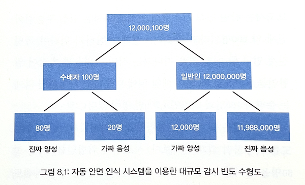

2024년 시작.

# 01/01

## 우리는 왜 숫자에 속을까

### 8장. 인공지능은 모든 걸 알고 있다

독일 내무부는 아래 2가지 숫자 때문에, 안면 인식 시스템에 열광하게 됨.

1. 적중률: 80
2. 오경보율: 0.1

위험 인물 100명 중 80명을 올바르게 인식하고, 1,000명 중 1명만 위험인물로 잘못 간주한다는 것. 이렇게만 보면 매우 우수한 시스템처럼 보임.

그런데 일단 사소한 문제 3가지가 있음.

1. 일단, 테스트에 사용된 시스템은 3개인데, 세 시스템 중 하나라도 위험인물을 맞추면 적중률에 포함함.
2. 또한, 테스트는 총 2회에 걸쳐 이뤄졌는데, 2회차에서는 고화질 카메라로 찍은 사진을 사용해 적중률이 훨씬 높아짐.
3. 그리고, 수집한 모든 데이터가 아닌 일부 데이터를 취사선택해 적중률을 계산하고, 선택의 기준도 명시하지 않음.

그리고 근본적 문제는 오경보에 있음.

빈도 수형도를 그려 보면 문제가 드러남.

1. 역 이용자가 1,200만명이라고 할 때, 1.2만명이 수배자로 잘못 지정(오경보율 0.1퍼센트).
2. 카메라가 위험인물로 인식한 사람이 정말로 위험할 확률은 0.7퍼센트(= 80 / 12,080).
3. 즉, 99.3%는 잘못된 경보인 가짜 양성.
4. 하루에도 1.2만 번의 가짜 알림이 울림. 엄청난 비용.

가짜 양성 비율과 양성 예측도를 구분하지 못하면, 0.1%라는 오경보율을 보고 99.9%의 경우 시스템이 올바른 분류를 한다고 착각하게 됨.

1. 가짜 양성 비율: 위험인물이 아닌 사람 중 얼마나 많은 사람이 위험인물로 잘못 분류되나? -> 0.1%
2. 양성 예측도: 시스템이 위험인물로 분류한 사람이 실제로 위험인물일 확률은 얼마나 높은가? -> 1%

# 01/07

## Multi-Cloud Strategy for Cloud Architects - 2E

- [CH1. Introduction to Multi-Cloud](https://github.com/codehumane/what-i-learned/blob/master/book/mcsfca-2e/README.md#ch1-introduction-to-multi-cloud)
  - [Gathering requirements for multi-cloud](https://github.com/codehumane/what-i-learned/blob/master/book/mcsfca-2e/README.md#gathering-requirements-for-multi-cloud)
    - [Using TOGAF for requirements management](https://github.com/codehumane/what-i-learned/blob/master/book/mcsfca-2e/README.md#using-togaf-for-requirements-management)
- [CH4. Service Designs for Multi-Cloud](https://github.com/codehumane/what-i-learned/blob/master/book/mcsfca-2e/README.md#ch4-service-designs-for-multi-cloud)
  - [Introducing the scaffold for multi-cloud environments](https://github.com/codehumane/what-i-learned/blob/master/book/mcsfca-2e/README.md#introducing-the-scaffold-for-multi-cloud-environments)
  - [Working with Well-Architected Frameworks](https://github.com/codehumane/what-i-learned/blob/master/book/mcsfca-2e/README.md#working-with-well-architected-frameworks)

# 01/21

## 코틀린 코루틴

- [9장. 취소](https://github.com/codehumane/what-i-learned/blob/master/book/kotlin-coroutines/README.md#9%EC%9E%A5-%EC%B7%A8%EC%86%8C)
  - [기본적인 취소](https://github.com/codehumane/what-i-learned/blob/master/book/kotlin-coroutines/README.md#%EA%B8%B0%EB%B3%B8%EC%A0%81%EC%9D%B8-%EC%B7%A8%EC%86%8C)
  - [취소는 어떻게 동작하는가](https://github.com/codehumane/what-i-learned/blob/master/book/kotlin-coroutines/README.md#%EC%B7%A8%EC%86%8C%EB%8A%94-%EC%96%B4%EB%96%BB%EA%B2%8C-%EC%9E%91%EB%8F%99%ED%95%98%EB%8A%94%EA%B0%80)
  - [취소 중 코루틴을 한 번 더 호출하기](https://github.com/codehumane/what-i-learned/blob/master/book/kotlin-coroutines/README.md#%EC%B7%A8%EC%86%8C-%EC%A4%91-%EC%BD%94%EB%A3%A8%ED%8B%B4%EC%9D%84-%ED%95%9C-%EB%B2%88-%EB%8D%94-%ED%98%B8%EC%B6%9C%ED%95%98%EA%B8%B0)
  - [invokeOnCompletion](https://github.com/codehumane/what-i-learned/blob/master/book/kotlin-coroutines/README.md#invokeoncompletion)
  - [중단될 수 없는 걸 중단하기](https://github.com/codehumane/what-i-learned/blob/master/book/kotlin-coroutines/README.md#%EC%A4%91%EB%8B%A8%EB%90%A0-%EC%88%98-%EC%97%86%EB%8A%94-%EA%B1%B8-%EC%A4%91%EB%8B%A8%ED%95%98%EA%B8%B0)
  - [suspendCancellableCoroutine](https://github.com/codehumane/what-i-learned/blob/master/book/kotlin-coroutines/README.md#suspendcancellablecoroutine)
- [10장. 예외 처리](https://github.com/codehumane/what-i-learned/blob/master/book/kotlin-coroutines/README.md#10%EC%9E%A5-%EC%98%88%EC%99%B8-%EC%B2%98%EB%A6%AC)
  - [코루틴 종료 멈추기](https://github.com/codehumane/what-i-learned/blob/master/book/kotlin-coroutines/README.md#%EC%BD%94%EB%A3%A8%ED%8B%B4-%EC%A2%85%EB%A3%8C-%EB%A9%88%EC%B6%94%EA%B8%B0)
    - [SupervisorJob](https://github.com/codehumane/what-i-learned/blob/master/book/kotlin-coroutines/README.md#supervisorjob)
    - [SupervisorScope](https://github.com/codehumane/what-i-learned/blob/master/book/kotlin-coroutines/README.md#supervisorscope)
  - [await](https://github.com/codehumane/what-i-learned/blob/master/book/kotlin-coroutines/README.md#await)
  - [CancellationException은 부모까지 전파되지 않는다](https://github.com/codehumane/what-i-learned/blob/master/book/kotlin-coroutines/README.md#cancellationexception%EC%9D%80-%EB%B6%80%EB%AA%A8%EA%B9%8C%EC%A7%80-%EC%A0%84%ED%8C%8C%EB%90%98%EC%A7%80-%EC%95%8A%EB%8A%94%EB%8B%A4)
  - [코루틴 예외 핸들러](https://github.com/codehumane/what-i-learned/blob/master/book/kotlin-coroutines/README.md#%EC%BD%94%EB%A3%A8%ED%8B%B4-%EC%98%88%EC%99%B8-%ED%95%B8%EB%93%A4%EB%9F%AC)

# 01/28

## 코틀린 코루틴

- [11장. 코루틴 스코프 함수](https://github.com/codehumane/what-i-learned/blob/master/book/kotlin-coroutines/README.md#11%EC%9E%A5-%EC%BD%94%EB%A3%A8%ED%8B%B4-%EC%8A%A4%EC%BD%94%ED%94%84-%ED%95%A8%EC%88%98)
  - [코루틴 스코프 함수가 소개되기 전에 사용한 방법들](https://github.com/codehumane/what-i-learned/blob/master/book/kotlin-coroutines/README.md#%EC%BD%94%EB%A3%A8%ED%8B%B4-%EC%8A%A4%EC%BD%94%ED%94%84-%ED%95%A8%EC%88%98%EA%B0%80-%EC%86%8C%EA%B0%9C%EB%90%98%EA%B8%B0-%EC%A0%84%EC%97%90-%EC%82%AC%EC%9A%A9%ED%95%9C-%EB%B0%A9%EB%B2%95%EB%93%A4)
  - [coroutineScope](https://github.com/codehumane/what-i-learned/blob/master/book/kotlin-coroutines/README.md#coroutinescope)
  - [코루틴 스코프 함수](https://github.com/codehumane/what-i-learned/blob/master/book/kotlin-coroutines/README.md#%EC%BD%94%EB%A3%A8%ED%8B%B4-%EC%8A%A4%EC%BD%94%ED%94%84-%ED%95%A8%EC%88%98)
  - [추가적인 연산](https://github.com/codehumane/what-i-learned/blob/master/book/kotlin-coroutines/README.md#%EC%B6%94%EA%B0%80%EC%A0%81%EC%9D%B8-%EC%97%B0%EC%82%B0)

# 02/04

## 코틀린 코루틴

- [1장. 코틀린 코루틴을 배워야 하는 이유](https://github.com/codehumane/what-i-learned/blob/master/book/kotlin-coroutines/README.md#1%EC%9E%A5-%EC%BD%94%ED%8B%80%EB%A6%B0-%EC%BD%94%EB%A3%A8%ED%8B%B4%EC%9D%84-%EB%B0%B0%EC%9B%8C%EC%95%BC-%ED%95%98%EB%8A%94-%EC%9D%B4%EC%9C%A0)
  - [안드로이드(그리고 다른 프론트엔드 플랫폼)에서의 코루틴 사용](https://github.com/codehumane/what-i-learned/blob/master/book/kotlin-coroutines/README.md#%EC%95%88%EB%93%9C%EB%A1%9C%EC%9D%B4%EB%93%9C%EA%B7%B8%EB%A6%AC%EA%B3%A0-%EB%8B%A4%EB%A5%B8-%ED%94%84%EB%A1%A0%ED%8A%B8%EC%97%94%EB%93%9C-%ED%94%8C%EB%9E%AB%ED%8F%BC%EC%97%90%EC%84%9C%EC%9D%98-%EC%BD%94%EB%A3%A8%ED%8B%B4-%EC%82%AC%EC%9A%A9)
  - [백엔드에서의 코루틴 사용](https://github.com/codehumane/what-i-learned/blob/master/book/kotlin-coroutines/README.md#%EB%B0%B1%EC%97%94%EB%93%9C%EC%97%90%EC%84%9C%EC%9D%98-%EC%BD%94%EB%A3%A8%ED%8B%B4-%EC%82%AC%EC%9A%A9)
